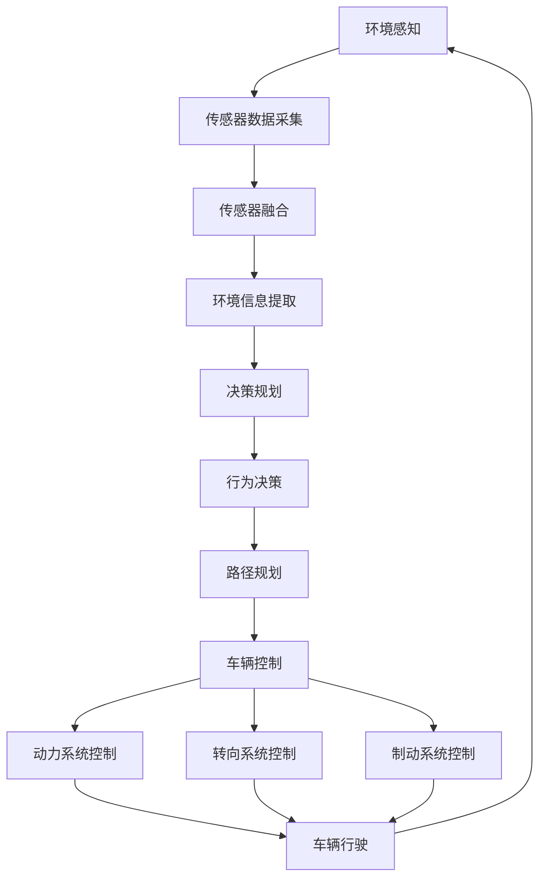

# 自动驾驶技术发展与相关产业链投资

> 关键词：自动驾驶技术、产业链、投资、发展趋势、技术原理

> 摘要：本文深入探讨了自动驾驶技术的发展现状、核心原理以及与之相关的产业链投资机会。首先介绍了自动驾驶技术的背景，包括其目的、预期读者等内容。接着详细阐述了自动驾驶的核心概念与联系，包括原理和架构。通过Python代码解释了核心算法原理及操作步骤，并运用数学模型和公式进行理论分析。结合项目实战，展示了代码案例及详细解释。探讨了自动驾驶技术的实际应用场景，推荐了相关的学习资源、开发工具和论文著作。最后总结了自动驾驶技术的未来发展趋势与挑战，还提供了常见问题解答和扩展阅读参考资料，旨在为关注自动驾驶技术及相关投资领域的人士提供全面且深入的参考。

## 1. 背景介绍 
### 1.1 目的和范围
自动驾驶技术作为当前交通领域的前沿科技，具有巨大的发展潜力和应用前景。本文章的目的在于全面、深入地探讨自动驾驶技术的发展现状、技术原理以及与之相关的产业链投资机会。范围涵盖自动驾驶技术的核心概念、算法原理、数学模型，同时结合实际项目案例进行分析，还会涉及到该技术在不同场景下的应用以及产业链投资的相关内容。通过对这些方面的研究，帮助读者更好地理解自动驾驶技术，为投资者提供有价值的参考信息，为技术开发者提供技术思路和方法。

### 1.2 预期读者
本文预期读者包括对自动驾驶技术感兴趣的普通大众、相关专业的学生、从事自动驾驶技术研发的工程师和技术人员、关注新兴科技领域投资的投资者、交通领域的研究人员和政策制定者等。不同的读者群体可以从本文中获取到与自身需求相关的信息，普通大众可以了解自动驾驶技术的基本原理和发展趋势，专业学生可以深入学习技术细节，投资者可以寻找投资机会，研发人员可以借鉴技术思路，研究人员和政策制定者可以为相关研究和政策制定提供参考。

### 1.3 文档结构概述
本文将按照以下结构进行阐述：首先介绍自动驾驶技术的背景信息，包括目的、预期读者等；接着讲解核心概念与联系，包括原理和架构，并通过Mermaid流程图进行展示；然后详细阐述核心算法原理和具体操作步骤，结合Python源代码进行说明；之后介绍数学模型和公式，并举例说明；通过项目实战展示代码实际案例和详细解释；探讨自动驾驶技术的实际应用场景；推荐相关的工具和资源，包括学习资源、开发工具和论文著作；总结自动驾驶技术的未来发展趋势与挑战；提供常见问题与解答作为附录；最后列出扩展阅读和参考资料。

### 1.4 术语表
#### 1.4.1 核心术语定义
- **自动驾驶**：指车辆在不需要人类驾驶员直接操作的情况下，能够自动完成环境感知、决策规划和车辆控制等一系列任务，实现安全、高效的行驶。
- **传感器融合**：将多种不同类型的传感器（如摄像头、雷达、激光雷达等）获取的数据进行整合和处理，以提高环境感知的准确性和可靠性。
- **决策规划**：根据环境感知的结果，制定车辆的行驶策略和路径规划，包括速度、方向、车道选择等决策。
- **车辆控制**：根据决策规划的结果，对车辆的动力系统、转向系统、制动系统等进行精确控制，实现车辆的自主行驶。

#### 1.4.2 相关概念解释
- **环境感知**：自动驾驶车辆通过各种传感器获取周围环境的信息，包括道路状况、交通标志、其他车辆和行人等，为决策规划提供基础数据。
- **高精度地图**：一种具有高精度地理信息的地图，包含道路的详细信息，如车道线、交通标志、障碍物等，为自动驾驶车辆提供更准确的定位和导航信息。
- **人工智能**：利用计算机技术模拟人类智能的过程，在自动驾驶中主要用于环境感知、决策规划等任务，提高车辆的自主决策能力。

#### 1.4.3 缩略词列表
- **ADAS**：Advanced Driver Assistance Systems，高级驾驶辅助系统
- **LIDAR**：Light Detection and Ranging，激光雷达
- **GPS**：Global Positioning System，全球定位系统
- **CAN**：Controller Area Network，控制器局域网

## 2. 核心概念与联系 
自动驾驶技术是一个复杂的系统工程，涉及多个核心概念和技术领域，各部分之间相互关联、协同工作，共同实现车辆的自动驾驶功能。

### 核心概念原理和架构

自动驾驶系统主要由环境感知、决策规划和车辆控制三个核心部分组成，其原理和架构如下：

#### 环境感知
环境感知是自动驾驶的基础，通过各种传感器获取车辆周围的环境信息。常用的传感器包括摄像头、雷达、激光雷达等。摄像头可以获取丰富的视觉信息，如道路图像、交通标志和其他车辆的外观等；雷达可以测量目标物体的距离、速度等信息；激光雷达则可以生成高精度的三维环境地图。这些传感器的数据通过传感器融合技术进行整合，提高环境感知的准确性和可靠性。

#### 决策规划
决策规划根据环境感知的结果，制定车辆的行驶策略和路径规划。它需要考虑多种因素，如交通规则、目标地点、道路状况、其他车辆和行人的行为等。决策规划通常包括行为决策和路径规划两个层次。行为决策确定车辆的宏观行为，如加速、减速、转弯、停车等；路径规划则具体规划车辆的行驶路径，确保车辆安全、高效地到达目标地点。

#### 车辆控制
车辆控制根据决策规划的结果，对车辆的动力系统、转向系统、制动系统等进行精确控制，实现车辆的自主行驶。车辆控制需要具备高精度、高可靠性和实时性的特点，以确保车辆在各种复杂环境下能够安全稳定地行驶。

### Mermaid 流程图


该流程图展示了自动驾驶系统的工作流程，从环境感知开始，通过传感器采集数据，经过融合和信息提取后进行决策规划，再将规划结果传递给车辆控制模块，最终实现车辆的行驶。车辆行驶过程中又不断进行环境感知，形成一个闭环系统，确保车辆能够实时适应环境变化。

## 3. 核心算法原理 & 具体操作步骤 
### 核心算法原理

自动驾驶技术中涉及多种核心算法，以下以基于深度学习的目标检测算法为例进行详细阐述。目标检测是环境感知的重要任务之一，其目的是在图像或点云数据中识别出感兴趣的目标物体，并确定其位置和类别。

基于深度学习的目标检测算法通常采用卷积神经网络（Convolutional Neural Network，CNN）进行特征提取和目标分类。其中，Faster R-CNN（Region-based Convolutional Neural Network）是一种经典的两阶段目标检测算法，其主要步骤包括：

1. **区域建议网络（Region Proposal Network，RPN）**：RPN是Faster R-CNN的第一个阶段，用于在图像中生成可能包含目标物体的候选区域（Region of Interest，ROI）。RPN通过滑动窗口的方式在特征图上生成一系列的锚点（Anchors），并对每个锚点进行分类和回归预测，判断其是否包含目标物体以及目标物体的位置偏移量。
2. **感兴趣区域池化（RoI Pooling）**：RoI Pooling是Faster R-CNN的第二个阶段，用于将不同大小的候选区域统一到固定大小的特征图上。通过RoI Pooling，可以将不同大小的候选区域提取出固定长度的特征向量，以便后续的分类和回归操作。
3. **分类和回归**：在经过RoI Pooling后，将提取的特征向量输入到全连接层中进行分类和回归预测。分类预测用于确定候选区域中目标物体的类别，回归预测用于进一步调整目标物体的位置。

### 具体操作步骤及Python源代码

以下是使用Python和PyTorch框架实现Faster R-CNN目标检测算法的示例代码：

```python
import torch
import torchvision
from torchvision.models.detection import fasterrcnn_resnet50_fpn
from torchvision.transforms import functional as F
from PIL import Image
import matplotlib.pyplot as plt
import matplotlib.patches as patches

# 加载预训练的Faster R-CNN模型
model = fasterrcnn_resnet50_fpn(pretrained=True)
model.eval()

# 加载图像
image = Image.open('test_image.jpg')
image = F.to_tensor(image)

# 进行目标检测
with torch.no_grad():
    prediction = model([image])

# 提取检测结果
boxes = prediction[0]['boxes'].cpu().numpy()
labels = prediction[0]['labels'].cpu().numpy()
scores = prediction[0]['scores'].cpu().numpy()

# 筛选出置信度大于0.5的检测结果
threshold = 0.5
keep_indices = scores > threshold
boxes = boxes[keep_indices]
labels = labels[keep_indices]
scores = scores[keep_indices]

# 定义类别名称
COCO_INSTANCE_CATEGORY_NAMES = [
    '__background__', 'person', 'bicycle', 'car', 'motorcycle', 'airplane', 'bus',
    'train', 'truck', 'boat', 'traffic light', 'fire hydrant', 'N/A', 'stop sign',
    'parking meter', 'bench', 'bird', 'cat', 'dog', 'horse', 'sheep', 'cow',
    'elephant', 'bear', 'zebra', 'giraffe', 'N/A', 'backpack', 'umbrella', 'N/A', 'N/A',
    'handbag', 'tie', 'suitcase', 'frisbee', 'skis', 'snowboard', 'sports ball',
    'kite', 'baseball bat', 'baseball glove', 'skateboard', 'surfboard', 'tennis racket',
    'bottle', 'N/A', 'wine glass', 'cup', 'fork', 'knife', 'spoon', 'bowl',
    'banana', 'apple', 'sandwich', 'orange', 'broccoli', 'carrot', 'hot dog', 'pizza',
    'donut', 'cake', 'chair', 'couch', 'potted plant', 'bed', 'N/A', 'dining table',
    'N/A', 'N/A', 'toilet', 'N/A', 'tv', 'laptop', 'mouse', 'remote', 'keyboard', 'cell phone',
    'microwave', 'oven', 'toaster', 'sink', 'refrigerator', 'N/A', 'book',
    'clock', 'vase', 'scissors', 'teddy bear', 'hair drier', 'toothbrush'
]

# 可视化检测结果
fig, ax = plt.subplots(1)
ax.imshow(image.permute(1, 2, 0).cpu().numpy())
for box, label, score in zip(boxes, labels, scores):
    x1, y1, x2, y2 = box
    rect = patches.Rectangle((x1, y1), x2 - x1, y2 - y1, linewidth=2, edgecolor='r', facecolor='none')
    ax.add_patch(rect)
    ax.text(x1, y1, f'{COCO_INSTANCE_CATEGORY_NAMES[label]}: {score:.2f}', color='r')
plt.show()
```

### 代码解释

1. **加载预训练模型**：使用`torchvision.models.detection.fasterrcnn_resnet50_fpn`函数加载预训练的Faster R-CNN模型，并将其设置为评估模式。
2. **加载图像**：使用`PIL.Image.open`函数加载图像，并将其转换为PyTorch张量。
3. **进行目标检测**：将图像输入到模型中进行目标检测，得到检测结果。
4. **筛选检测结果**：根据置信度阈值筛选出置信度大于0.5的检测结果。
5. **可视化检测结果**：使用`matplotlib`库将检测结果可视化，在图像上绘制检测框和类别标签。

## 4. 数学模型和公式 & 详细讲解 & 举例说明 
### 数学模型和公式

在自动驾驶的目标检测算法中，涉及到多个数学模型和公式，以下是Faster R-CNN算法中部分关键公式的详细讲解。

#### 区域建议网络（RPN）

RPN的目标是在特征图上生成候选区域，其主要任务包括分类和回归。

- **分类损失**：RPN的分类损失通常采用交叉熵损失函数，用于判断锚点是否包含目标物体。交叉熵损失函数的公式为：

$$
L_{cls}(p, p^*) = - \sum_{i=1}^{N} [p_i^* \log(p_i) + (1 - p_i^*) \log(1 - p_i)]
$$

其中，$p$ 是预测的概率分布，$p^*$ 是真实的标签分布，$N$ 是锚点的数量。

- **回归损失**：RPN的回归损失通常采用平滑L1损失函数，用于预测目标物体的位置偏移量。平滑L1损失函数的公式为：

$$
L_{reg}(t, t^*) = \sum_{i=1}^{N} \text{smooth}_{L1}(t_i - t_i^*)
$$

其中，$t$ 是预测的位置偏移量，$t^*$ 是真实的位置偏移量，$\text{smooth}_{L1}$ 是平滑L1函数，其定义为：

$$
\text{smooth}_{L1}(x) = 
\begin{cases}
0.5x^2, & \text{if } |x| < 1 \\
|x| - 0.5, & \text{otherwise}
\end{cases}
$$

- **总损失**：RPN的总损失是分类损失和回归损失的加权和，公式为：

$$
L_{RPN} = L_{cls}(p, p^*) + \lambda L_{reg}(t, t^*)
$$

其中，$\lambda$ 是回归损失的权重系数。

#### 感兴趣区域池化（RoI Pooling）

RoI Pooling的目的是将不同大小的候选区域统一到固定大小的特征图上。其具体实现步骤如下：

1. 将候选区域划分为 $H \times W$ 个网格。
2. 对于每个网格，在其对应的特征图区域中取最大值，得到固定大小的特征向量。

### 详细讲解

#### 交叉熵损失函数
交叉熵损失函数是一种常用的分类损失函数，用于衡量预测概率分布与真实标签分布之间的差异。当预测概率与真实标签一致时，损失函数的值最小；当预测概率与真实标签不一致时，损失函数的值会增大。通过最小化交叉熵损失函数，可以使模型的预测结果更接近真实标签。

#### 平滑L1损失函数
平滑L1损失函数是一种对L1损失函数的改进，它在 $|x| < 1$ 时采用二次函数，在 $|x| \geq 1$ 时采用线性函数。这样可以避免L1损失函数在 $x = 0$ 处的不可导问题，同时也能减少L2损失函数在 $|x|$ 较大时的梯度爆炸问题。

#### RoI Pooling
RoI Pooling通过将不同大小的候选区域统一到固定大小的特征图上，使得后续的分类和回归操作可以在相同维度的特征向量上进行。这有助于提高模型的计算效率和泛化能力。

### 举例说明

假设我们有一个包含10个锚点的特征图，真实标签分布 $p^*$ 为 $[1, 0, 1, 0, 1, 0, 1, 0, 1, 0]$，预测概率分布 $p$ 为 $[0.9, 0.1, 0.8, 0.2, 0.7, 0.3, 0.6, 0.4, 0.5, 0.5]$。则分类损失 $L_{cls}$ 的计算过程如下：

$$
\begin{align*}
L_{cls}(p, p^*) &= - [1 \times \log(0.9) + (1 - 1) \times \log(1 - 0.9) + 0 \times \log(0.1) + (1 - 0) \times \log(1 - 0.1) + \cdots] \\
&= - [\log(0.9) + \log(0.9) + \log(0.8) + \log(0.8) + \log(0.7) + \log(0.7) + \log(0.6) + \log(0.6) + \log(0.5) + \log(0.5)] \\
&\approx 2.30
\end{align*}
$$

假设预测的位置偏移量 $t$ 为 $[0.1, 0.2, 0.3, 0.4]$，真实的位置偏移量 $t^*$ 为 $[0.2, 0.3, 0.4, 0.5]$。则回归损失 $L_{reg}$ 的计算过程如下：

$$
\begin{align*}
L_{reg}(t, t^*) &= \text{smooth}_{L1}(0.1 - 0.2) + \text{smooth}_{L1}(0.2 - 0.3) + \text{smooth}_{L1}(0.3 - 0.4) + \text{smooth}_{L1}(0.4 - 0.5) \\
&= \text{smooth}_{L1}(-0.1) + \text{smooth}_{L1}(-0.1) + \text{smooth}_{L1}(-0.1) + \text{smooth}_{L1}(-0.1) \\
&= 0.5 \times (-0.1)^2 + 0.5 \times (-0.1)^2 + 0.5 \times (-0.1)^2 + 0.5 \times (-0.1)^2 \\
&= 0.02
\end{align*}
$$

假设回归损失的权重系数 $\lambda = 10$，则RPN的总损失 $L_{RPN}$ 为：

$$
L_{RPN} = L_{cls}(p, p^*) + \lambda L_{reg}(t, t^*) = 2.30 + 10 \times 0.02 = 2.50
$$

## 5. 项目实战：代码实际案例和详细解释说明 
### 5.1  开发环境搭建

在进行自动驾驶相关项目开发时，需要搭建合适的开发环境。以下是搭建开发环境的详细步骤：

#### 操作系统
推荐使用Ubuntu 18.04或更高版本的Linux操作系统，因为Linux系统在开发和调试过程中具有更好的兼容性和稳定性。

#### 安装Python
Python是自动驾驶开发中常用的编程语言，推荐使用Python 3.6或更高版本。可以通过以下命令安装Python：

```bash
sudo apt update
sudo apt install python3 python3-pip
```

#### 安装深度学习框架
常用的深度学习框架有PyTorch和TensorFlow，这里以PyTorch为例进行安装。可以根据自己的CUDA版本选择合适的PyTorch版本，以下是安装CPU版本的PyTorch的命令：

```bash
pip3 install torch torchvision torchaudio
```

#### 安装其他依赖库
还需要安装一些其他的依赖库，如OpenCV、NumPy、Matplotlib等。可以使用以下命令进行安装：

```bash
pip3 install opencv-python numpy matplotlib
```

### 5.2  源代码详细实现和代码解读

以下是一个简单的自动驾驶仿真项目的源代码示例，该项目模拟了一个自动驾驶车辆在简单环境中的行驶过程。

```python
import numpy as np
import matplotlib.pyplot as plt
import time

# 定义车辆类
class Vehicle:
    def __init__(self, x, y, speed):
        self.x = x
        self.y = y
        self.speed = speed

    def move(self, dt):
        self.x += self.speed * dt
        return self.x, self.y

# 定义环境类
class Environment:
    def __init__(self, width, height):
        self.width = width
        self.height = height
        self.vehicles = []

    def add_vehicle(self, vehicle):
        self.vehicles.append(vehicle)

    def update(self, dt):
        for vehicle in self.vehicles:
            vehicle.move(dt)

    def visualize(self):
        plt.figure(figsize=(8, 6))
        for vehicle in self.vehicles:
            plt.scatter(vehicle.x, vehicle.y, color='red', s=50)
        plt.xlim(0, self.width)
        plt.ylim(0, self.height)
        plt.xlabel('X')
        plt.ylabel('Y')
        plt.title('Autonomous Driving Simulation')
        plt.grid(True)
        plt.show()

# 主函数
def main():
    # 创建环境
    env = Environment(100, 100)

    # 创建车辆
    vehicle = Vehicle(0, 50, 5)
    env.add_vehicle(vehicle)

    # 模拟行驶过程
    for i in range(20):
        env.update(1)
        env.visualize()
        time.sleep(0.5)

if __name__ == '__main__':
    main()
```

### 5.3  代码解读与分析

#### 车辆类（Vehicle）
- `__init__` 方法：初始化车辆的位置和速度。
- `move` 方法：根据车辆的速度和时间步长更新车辆的位置。

#### 环境类（Environment）
- `__init__` 方法：初始化环境的宽度和高度，并创建一个空的车辆列表。
- `add_vehicle` 方法：向环境中添加车辆。
- `update` 方法：更新环境中所有车辆的位置。
- `visualize` 方法：可视化环境中所有车辆的位置。

#### 主函数（main）
- 创建一个环境对象和一个车辆对象，并将车辆添加到环境中。
- 模拟车辆的行驶过程，每隔0.5秒更新一次车辆的位置并可视化。

通过这个简单的仿真项目，我们可以初步了解自动驾驶车辆的运动原理和环境模拟的基本方法。在实际的自动驾驶项目中，还需要考虑更多的因素，如环境感知、决策规划、车辆控制等。

## 6. 实际应用场景 
自动驾驶技术具有广泛的实际应用场景，以下是一些主要的应用领域：

### 智能交通
自动驾驶技术可以提高交通效率，减少交通拥堵。通过车辆之间的通信和协同行驶，可以实现更高效的交通流量管理。例如，自动驾驶车辆可以根据实时交通信息调整行驶速度和路线，避免拥堵路段。此外，自动驾驶技术还可以提高交通安全，减少人为因素导致的交通事故。

### 物流运输
在物流运输领域，自动驾驶技术可以实现货物的自动化运输。自动驾驶货车可以24小时不间断工作，提高运输效率，降低运输成本。同时，自动驾驶技术还可以减少驾驶员的劳动强度，提高工作安全性。例如，一些物流公司已经开始测试自动驾驶货车，用于长途货物运输。

### 共享出行
自动驾驶技术可以推动共享出行的发展。通过自动驾驶车辆，可以实现按需出行，提高车辆的利用率。乘客可以通过手机应用程序预约自动驾驶车辆，车辆会自动接送乘客。共享出行可以减少个人汽车的使用，降低交通拥堵和环境污染。例如，一些城市已经开始试点自动驾驶共享汽车项目。

### 特种作业
在一些特种作业领域，自动驾驶技术也具有重要的应用价值。例如，在矿山、港口等场景中，自动驾驶车辆可以代替人工进行危险、繁重的作业任务，提高工作效率和安全性。此外，自动驾驶技术还可以应用于农业领域，实现农机的自动化作业，提高农业生产效率。

### 公共交通
自动驾驶技术可以应用于公共交通领域，如自动驾驶公交车、地铁等。自动驾驶公交车可以提高公交服务的准点率和舒适性，减少驾驶员的劳动强度。同时，自动驾驶地铁可以实现更精确的运行控制，提高地铁的运行效率和安全性。例如，一些城市已经开始试点自动驾驶公交车项目。

## 7. 工具和资源推荐
### 7.1 学习资源推荐
#### 7.1.1 书籍推荐
- 《自动驾驶：技术、应用与社会影响》：全面介绍了自动驾驶技术的原理、应用和社会影响，是一本很好的入门书籍。
- 《深度学习》：深度学习是自动驾驶技术的核心，这本书详细介绍了深度学习的基本原理和算法，适合有一定编程基础的读者。
- 《机器人学导论》：自动驾驶车辆本质上是一种机器人，这本书介绍了机器人学的基本概念和方法，对理解自动驾驶技术有很大帮助。

#### 7.1.2 在线课程
- Coursera上的“自动驾驶基础”课程：由知名大学的教授授课，系统地介绍了自动驾驶技术的基础知识和关键技术。
- Udemy上的“深度学习与自动驾驶”课程：结合实际案例，讲解了深度学习在自动驾驶中的应用。
- edX上的“机器人感知与决策”课程：重点介绍了自动驾驶中的环境感知和决策规划技术。

#### 7.1.3 技术博客和网站
- Medium：上面有很多关于自动驾驶技术的博客文章，涵盖了最新的技术进展和研究成果。
- arXiv：是一个预印本数据库，包含了大量的自动驾驶相关的学术论文，可以及时了解最新的研究动态。
- 自动驾驶技术社区：一些专门的自动驾驶技术社区，如自动驾驶之家、智驾网等，提供了丰富的技术资料和行业资讯。

### 7.2 开发工具框架推荐
#### 7.2.1 IDE和编辑器
- PyCharm：是一款专门为Python开发设计的集成开发环境，具有强大的代码编辑、调试和分析功能，适合自动驾驶项目的开发。
- Visual Studio Code：是一款轻量级的代码编辑器，支持多种编程语言和插件扩展，方便快捷地进行代码编写和调试。
- Jupyter Notebook：是一种交互式的开发环境，适合进行数据分析和模型训练，在自动驾驶技术的研究和开发中也经常使用。

#### 7.2.2 调试和性能分析工具
- GDB：是一款强大的调试工具，可用于调试C、C++等编程语言编写的自动驾驶代码。
- TensorBoard：是TensorFlow提供的可视化工具，可用于监控模型训练过程中的各种指标，如损失函数、准确率等。
- NVIDIA Nsight：是NVIDIA提供的性能分析工具，可用于优化GPU加速的自动驾驶代码。

#### 7.2.3 相关框架和库
- PyTorch：是一个开源的深度学习框架，具有简单易用、灵活性高的特点，在自动驾驶技术的研究和开发中广泛应用。
- TensorFlow：是另一个知名的深度学习框架，具有丰富的工具和资源，适合大规模的深度学习项目。
- OpenCV：是一个开源的计算机视觉库，提供了各种图像处理和计算机视觉算法，可用于自动驾驶中的环境感知任务。

### 7.3 相关论文著作推荐
#### 7.3.1 经典论文
- “Faster R-CNN: Towards Real-Time Object Detection with Region Proposal Networks”：提出了Faster R-CNN目标检测算法，是目标检测领域的经典论文。
- “You Only Look Once: Unified, Real-Time Object Detection”：提出了YOLO目标检测算法，实现了实时目标检测。
- “End to End Learning for Self-Driving Cars”：探讨了端到端的自动驾驶学习方法，为自动驾驶技术的发展提供了新的思路。

#### 7.3.2 最新研究成果
- 关注各大顶级学术会议，如CVPR（计算机视觉与模式识别会议）、ICRA（国际机器人与自动化会议）等，这些会议上会发表很多关于自动驾驶技术的最新研究成果。
- 一些知名学术期刊，如《IEEE Transactions on Intelligent Transportation Systems》《Journal of Field Robotics》等，也会发表高质量的自动驾驶相关论文。

#### 7.3.3 应用案例分析
- 一些知名企业的官方博客和技术报告，如特斯拉、Waymo等，会分享他们在自动驾驶技术研发和应用过程中的经验和案例。
- 行业研究机构的报告，如麦肯锡、波士顿咨询等，会对自动驾驶技术的市场趋势和应用案例进行分析和研究。

## 8. 总结：未来发展趋势与挑战
### 未来发展趋势

#### 技术不断进步
随着人工智能、传感器技术、通信技术等的不断发展，自动驾驶技术将不断进步。例如，传感器的精度和可靠性将不断提高，决策规划算法将更加智能和高效，车辆控制技术将更加精确和稳定。未来，自动驾驶车辆将能够应对更加复杂的环境和场景，实现更高等级的自动驾驶。

#### 商业化进程加速
目前，自动驾驶技术已经进入了商业化试点阶段，一些企业已经开始在特定场景下开展自动驾驶服务。未来，随着技术的成熟和成本的降低，自动驾驶技术的商业化进程将加速。预计在未来几年内，自动驾驶出租车、自动驾驶货车等将逐渐实现大规模商业化应用。

#### 与其他技术融合发展
自动驾驶技术将与物联网、云计算、大数据等技术融合发展，实现更加智能化的交通系统。例如，通过物联网技术，自动驾驶车辆可以与其他车辆、基础设施进行实时通信，实现协同行驶；通过云计算和大数据技术，可以对大量的交通数据进行分析和处理，为自动驾驶决策提供更准确的依据。

#### 法规和标准不断完善
随着自动驾驶技术的发展，相关的法规和标准也将不断完善。政府和相关部门将制定更加明确的法律法规，规范自动驾驶车辆的研发、测试和应用。同时，国际上也将形成统一的自动驾驶标准，促进自动驾驶技术的全球发展。

### 挑战

#### 技术挑战
虽然自动驾驶技术已经取得了很大的进展，但仍然面临一些技术挑战。例如，在复杂环境下的环境感知、决策规划和车辆控制仍然存在一定的困难；传感器的可靠性和鲁棒性还需要进一步提高；如何保证自动驾驶系统的安全性和可靠性也是一个亟待解决的问题。

#### 安全挑战
自动驾驶车辆的安全是人们关注的焦点。一旦自动驾驶系统出现故障或错误，可能会导致严重的交通事故。因此，如何确保自动驾驶车辆的安全是一个关键挑战。需要建立完善的安全评估和验证体系，对自动驾驶系统进行全面的测试和验证。

#### 伦理和法律挑战
自动驾驶技术的发展还带来了一系列伦理和法律问题。例如，当自动驾驶车辆面临不可避免的碰撞时，应该如何做出决策；自动驾驶车辆发生事故后，责任应该如何划分等。这些问题需要社会各界共同探讨和解决，制定相应的伦理准则和法律法规。

#### 社会接受度挑战
自动驾驶技术的推广和应用还面临社会接受度的挑战。一些人对自动驾驶车辆的安全性和可靠性存在疑虑，不愿意接受自动驾驶技术。因此，需要加强对自动驾驶技术的宣传和教育，提高公众对自动驾驶技术的认知和信任度。

## 9. 附录：常见问题与解答
### 1. 自动驾驶技术分为几个等级？
自动驾驶技术通常分为0-5级，具体如下：
- **0级**：无自动化，驾驶员完全控制车辆。
- **1级**：驾驶辅助，车辆可以提供一定的辅助功能，如自适应巡航控制、车道保持辅助等。
- **2级**：部分自动化，车辆可以同时控制加速、减速和转向，但驾驶员需要随时准备接管车辆。
- **3级**：有条件自动化，车辆在特定条件下可以实现自动驾驶，但驾驶员需要在必要时接管车辆。
- **4级**：高度自动化，车辆在大部分场景下可以实现自动驾驶，驾驶员不需要随时接管车辆。
- **5级**：完全自动化，车辆可以在任何场景下实现自动驾驶，不需要驾驶员。

### 2. 自动驾驶车辆主要使用哪些传感器？
自动驾驶车辆主要使用以下几种传感器：
- **摄像头**：可以获取丰富的视觉信息，如道路图像、交通标志和其他车辆的外观等。
- **雷达**：可以测量目标物体的距离、速度等信息。
- **激光雷达**：可以生成高精度的三维环境地图，提供更准确的环境感知信息。
- **超声波传感器**：主要用于近距离检测，如停车辅助等。

### 3. 自动驾驶技术的发展对就业市场有什么影响？
自动驾驶技术的发展将对就业市场产生一定的影响。一方面，自动驾驶技术的研发、测试、维护等领域将创造新的就业机会，如软件开发工程师、算法工程师、测试工程师等。另一方面，一些与驾驶相关的职业，如出租车司机、货车司机等，可能会受到一定的冲击。但从长远来看，自动驾驶技术的发展将推动整个社会的进步和发展，创造更多的就业机会。

### 4. 自动驾驶车辆的安全性如何保障？
为了保障自动驾驶车辆的安全性，需要采取以下措施：
- **技术层面**：不断提高传感器的精度和可靠性，优化决策规划和车辆控制算法，建立完善的安全监测和故障诊断系统。
- **测试和验证**：对自动驾驶系统进行全面的测试和验证，包括模拟测试、实际道路测试等，确保系统在各种场景下都能安全可靠地运行。
- **法规和标准**：制定严格的法规和标准，规范自动驾驶车辆的研发、测试和应用，对违规行为进行严厉处罚。
- **伦理和道德**：建立相应的伦理准则和道德规范，指导自动驾驶车辆在面临复杂情况时做出正确的决策。

### 5. 自动驾驶技术的发展需要哪些方面的支持？
自动驾驶技术的发展需要以下方面的支持：
- **技术支持**：不断推动人工智能、传感器技术、通信技术等相关技术的发展，为自动驾驶技术提供技术支撑。
- **政策支持**：政府出台相关的政策和法规，鼓励自动驾驶技术的研发和应用，为企业提供政策优惠和资金支持。
- **基础设施支持**：建设智能化的交通基础设施，如智能交通信号灯、车路协同系统等，为自动驾驶车辆提供更好的运行环境。
- **社会支持**：加强对自动驾驶技术的宣传和教育，提高公众对自动驾驶技术的认知和信任度，形成良好的社会氛围。

## 10. 扩展阅读 & 参考资料
### 扩展阅读
- 《智能网联汽车技术》：深入介绍了智能网联汽车的相关技术，包括自动驾驶、车路协同等。
- 《未来交通：自动驾驶与智能出行》：探讨了自动驾驶技术对未来交通和出行方式的影响。
- 《人工智能与自动驾驶：从理论到实践》：结合人工智能的理论和方法，详细介绍了自动驾驶技术的实践应用。

### 参考资料
- 各大自动驾驶企业的官方网站和技术报告，如特斯拉、Waymo、百度等。
- 相关学术期刊和会议论文，如《IEEE Transactions on Intelligent Transportation Systems》《CVPR》《ICRA》等。
- 政府部门发布的相关政策和法规文件，如交通运输部、工业和信息化部等发布的文件。