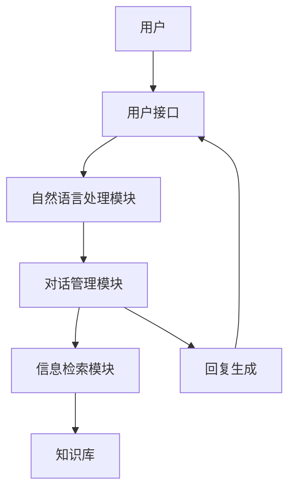

# 自然语言处理在技术支持聊天机器人中的应用

> 关键词：自然语言处理、技术支持聊天机器人、语义理解、对话管理、信息检索

> 摘要：本文深入探讨了自然语言处理在技术支持聊天机器人中的应用。首先介绍了相关背景知识，包括目的范围、预期读者等内容。接着阐述了自然语言处理和技术支持聊天机器人的核心概念及联系，详细讲解了核心算法原理和具体操作步骤，通过数学模型和公式进行理论支撑，并给出了实际的例子。然后进行项目实战，展示了代码实现和详细解读。分析了自然语言处理在技术支持聊天机器人中的实际应用场景，推荐了学习、开发相关的工具和资源，还介绍了相关论文著作。最后总结了未来发展趋势与挑战，对常见问题进行了解答，并提供了扩展阅读和参考资料，旨在全面呈现自然语言处理在技术支持聊天机器人领域的应用全貌。

## 1. 背景介绍 
### 1.1 目的和范围
随着互联网和信息技术的飞速发展，用户对技术支持的需求日益增长。传统的技术支持方式往往效率低下，难以满足大量用户的即时需求。技术支持聊天机器人作为一种新型的客户服务方式，能够快速响应用户问题，提供高效的技术支持。自然语言处理（NLP）作为人工智能领域的重要分支，为技术支持聊天机器人的实现提供了关键技术。

本文的目的在于全面介绍自然语言处理在技术支持聊天机器人中的应用，包括相关的核心概念、算法原理、数学模型、项目实战以及实际应用场景等内容。范围涵盖了自然语言处理的主要技术，如文本分类、命名实体识别、语义理解、对话管理等在技术支持聊天机器人中的具体应用。

### 1.2 预期读者
本文预期读者包括对自然语言处理和聊天机器人技术感兴趣的科研人员、开发者、技术爱好者，以及从事客户服务、技术支持相关工作，希望了解如何利用自然语言处理技术提升服务效率和质量的专业人士。

### 1.3 文档结构概述
本文首先介绍自然语言处理和技术支持聊天机器人的背景知识，包括目的范围、预期读者、术语表等内容。接着阐述核心概念与联系，通过文本示意图和 Mermaid 流程图展示自然语言处理和技术支持聊天机器人的架构和原理。然后详细讲解核心算法原理和具体操作步骤，结合 Python 源代码进行说明。之后介绍数学模型和公式，并通过举例进行详细讲解。再进行项目实战，展示开发环境搭建、源代码实现和代码解读。分析实际应用场景，推荐学习、开发相关的工具和资源，介绍相关论文著作。最后总结未来发展趋势与挑战，解答常见问题，并提供扩展阅读和参考资料。

### 1.4 术语表
#### 1.4.1 核心术语定义
- **自然语言处理（Natural Language Processing，NLP）**：是人工智能领域的一个重要分支，旨在让计算机能够理解、处理和生成人类语言。
- **技术支持聊天机器人（Technical Support Chatbot）**：是一种利用自然语言处理技术，能够与用户进行对话，为用户提供技术支持和解决方案的智能软件系统。
- **语义理解（Semantic Understanding）**：指计算机能够理解人类语言的含义和意图，包括对词汇、句子和篇章的语义分析。
- **对话管理（Dialogue Management）**：负责管理聊天机器人与用户之间的对话流程，包括对话状态的跟踪、回复的生成和对话策略的选择。
- **信息检索（Information Retrieval）**：是指从大量的文本数据中查找和提取与用户问题相关的信息。

#### 1.4.2 相关概念解释
- **词法分析（Lexical Analysis）**：对文本进行分词、词性标注等处理，将文本分解为单词和词性等基本单元。
- **句法分析（Syntactic Analysis）**：分析句子的语法结构，确定句子中各个成分之间的关系。
- **语用分析（Pragmatic Analysis）**：考虑语言使用的语境和意图，理解用户的真实需求。
- **机器学习（Machine Learning）**：是一门多领域交叉学科，涉及概率论、统计学、逼近论、凸分析、算法复杂度理论等多门学科。它专门研究计算机怎样模拟或实现人类的学习行为，以获取新的知识或技能，重新组织已有的知识结构使之不断改善自身的性能。
- **深度学习（Deep Learning）**：是机器学习的一个分支领域，它是一种基于对数据进行表征学习的方法。深度学习通过构建具有很多层的神经网络模型，自动从大量数据中学习特征和模式。

#### 1.4.3 缩略词列表
- **NLP**：Natural Language Processing（自然语言处理）
- **ML**：Machine Learning（机器学习）
- **DL**：Deep Learning（深度学习）
- **IR**：Information Retrieval（信息检索）
- **DM**：Dialogue Management（对话管理）

## 2. 核心概念与联系 
自然语言处理在技术支持聊天机器人中起着关键作用，它涉及多个核心概念和技术，这些概念和技术相互关联，共同构成了技术支持聊天机器人的基础。

### 核心概念原理
- **文本分类**：将文本划分到不同的类别中，例如将用户的问题分类为硬件问题、软件问题、网络问题等。其原理是通过提取文本的特征，如词频、词性等，利用机器学习算法（如朴素贝叶斯、支持向量机等）进行分类训练。
- **命名实体识别**：识别文本中的命名实体，如人名、地名、组织机构名、产品名等。它通过分析文本的上下文和语言规则，结合机器学习模型（如条件随机场、双向长短期记忆网络等）来实现。
- **语义理解**：理解用户问题的语义和意图，是自然语言处理的核心任务之一。它需要综合考虑词法、句法和语用信息，利用深度学习模型（如循环神经网络、Transformer 等）对文本进行语义表示和推理。
- **对话管理**：管理聊天机器人与用户之间的对话流程，包括对话状态的跟踪、回复的生成和对话策略的选择。对话管理可以基于规则、基于机器学习或基于强化学习来实现。
- **信息检索**：从大量的文本数据中查找和提取与用户问题相关的信息。它通过建立索引、计算文本相似度等方法来实现。

### 架构的文本示意图
技术支持聊天机器人的架构主要包括用户接口、自然语言处理模块、对话管理模块、知识库和信息检索模块。用户通过用户接口与聊天机器人进行交互，输入自然语言问题。自然语言处理模块对用户问题进行预处理，包括词法分析、句法分析、语义理解等。对话管理模块根据自然语言处理的结果，结合对话状态和对话策略，生成回复。信息检索模块从知识库中查找与用户问题相关的信息，为回复提供支持。

### Mermaid 流程图


## 3. 核心算法原理 & 具体操作步骤 
### 文本分类算法原理及实现
#### 原理
文本分类的常用算法之一是朴素贝叶斯算法。朴素贝叶斯算法基于贝叶斯定理和特征条件独立假设，通过计算文本属于各个类别的概率，选择概率最大的类别作为文本的分类结果。

#### Python 源代码实现
```python
from sklearn.feature_extraction.text import CountVectorizer
from sklearn.naive_bayes import MultinomialNB
from sklearn.model_selection import train_test_split
from sklearn.metrics import accuracy_score

# 示例数据
corpus = [
    "我的电脑无法开机，可能是硬件问题",
    "我的软件总是崩溃，需要解决",
    "网络连接不稳定，该怎么办",
    "打印机无法打印，求帮助"
]
labels = ["硬件问题", "软件问题", "网络问题", "硬件问题"]

# 特征提取
vectorizer = CountVectorizer()
X = vectorizer.fit_transform(corpus)

# 划分训练集和测试集
X_train, X_test, y_train, y_test = train_test_split(X, labels, test_size=0.2, random_state=42)

# 训练模型
clf = MultinomialNB()
clf.fit(X_train, y_train)

# 预测
y_pred = clf.predict(X_test)

# 评估
accuracy = accuracy_score(y_test, y_pred)
print(f"Accuracy: {accuracy}")
```

### 命名实体识别算法原理及实现
#### 原理
命名实体识别可以使用条件随机场（CRF）算法。CRF 是一种概率图模型，它通过考虑文本的上下文信息，对文本中的每个词进行标记，识别出命名实体。

#### Python 源代码实现
```python
import nltk
from nltk.corpus import conll2002
from sklearn_crfsuite import CRF
from sklearn_crfsuite.metrics import flat_f1_score

# 加载数据
train_sents = list(conll2002.iob_sents('esp.train'))
test_sents = list(conll2002.iob_sents('esp.testb'))

# 特征提取函数
def word2features(sent, i):
    word = sent[i][0]
    postag = sent[i][1]

    features = {
        'bias': 1.0,
        'word.lower()': word.lower(),
        'word[-3:]': word[-3:],
        'word[-2:]': word[-2:],
        'word.isupper()': word.isupper(),
        'word.istitle()': word.istitle(),
        'word.isdigit()': word.isdigit(),
        'postag': postag,
        'postag[:2]': postag[:2],
    }
    if i > 0:
        word1 = sent[i-1][0]
        postag1 = sent[i-1][1]
        features.update({
            '-1:word.lower()': word1.lower(),
            '-1:word.istitle()': word1.istitle(),
            '-1:word.isupper()': word1.isupper(),
            '-1:postag': postag1,
            '-1:postag[:2]': postag1[:2],
        })
    else:
        features['BOS'] = True

    if i < len(sent)-1:
        word1 = sent[i+1][0]
        postag1 = sent[i+1][1]
        features.update({
            '+1:word.lower()': word1.lower(),
            '+1:word.istitle()': word1.istitle(),
            '+1:word.isupper()': word1.isupper(),
            '+1:postag': postag1,
            '+1:postag[:2]': postag1[:2],
        })
    else:
        features['EOS'] = True

    return features

def sent2features(sent):
    return [word2features(sent, i) for i in range(len(sent))]

def sent2labels(sent):
    return [label for token, postag, label in sent]

# 提取特征
X_train = [sent2features(s) for s in train_sents]
y_train = [sent2labels(s) for s in train_sents]
X_test = [sent2features(s) for s in test_sents]
y_test = [sent2labels(s) for s in test_sents]

# 训练模型
crf = CRF(
    algorithm='lbfgs',
    c1=0.1,
    c2=0.1,
    max_iterations=100,
    all_possible_transitions=True
)
crf.fit(X_train, y_train)

# 预测
y_pred = crf.predict(X_test)

# 评估
f1_score = flat_f1_score(y_test, y_pred, average='weighted')
print(f"F1 Score: {f1_score}")
```

### 语义理解算法原理及实现
#### 原理
语义理解可以使用预训练的语言模型，如 BERT（Bidirectional Encoder Representations from Transformers）。BERT 是一种基于 Transformer 架构的双向预训练语言模型，它可以学习到文本的深层语义表示。

#### Python 源代码实现
```python
from transformers import AutoTokenizer, AutoModel
import torch

# 加载预训练模型和分词器
tokenizer = AutoTokenizer.from_pretrained('bert-base-uncased')
model = AutoModel.from_pretrained('bert-base-uncased')

# 示例文本
text = "我的电脑无法开机，可能是硬件问题"

# 分词
inputs = tokenizer(text, return_tensors='pt')

# 推理
outputs = model(**inputs)

# 获取语义表示
embedding = outputs.last_hidden_state.mean(dim=1)
print(embedding)
```

## 4. 数学模型和公式 & 详细讲解 & 举例说明 
### 朴素贝叶斯文本分类的数学模型和公式
#### 数学模型
朴素贝叶斯算法基于贝叶斯定理：
$$P(c|d)=\frac{P(d|c)P(c)}{P(d)}$$
其中，$P(c|d)$ 表示文档 $d$ 属于类别 $c$ 的概率，$P(d|c)$ 表示类别 $c$ 下生成文档 $d$ 的概率，$P(c)$ 表示类别 $c$ 的先验概率，$P(d)$ 表示文档 $d$ 的先验概率。

#### 详细讲解
在文本分类中，我们通常忽略 $P(d)$，因为它对于所有类别都是相同的。因此，我们只需要计算 $P(d|c)P(c)$ 并选择概率最大的类别作为分类结果。

假设文档 $d$ 由词 $w_1, w_2, \cdots, w_n$ 组成，根据特征条件独立假设，有：
$$P(d|c)=P(w_1, w_2, \cdots, w_n|c)=\prod_{i=1}^{n}P(w_i|c)$$

#### 举例说明
假设有两个类别 $c_1$（硬件问题）和 $c_2$（软件问题），文档 $d$ 为“我的电脑无法开机”。

- 计算先验概率：$P(c_1)$ 和 $P(c_2)$，可以通过训练数据中类别 $c_1$ 和 $c_2$ 的文档数量来估计。
- 计算条件概率：$P(w_i|c_1)$ 和 $P(w_i|c_2)$，可以通过训练数据中类别 $c_1$ 和 $c_2$ 下词 $w_i$ 的出现频率来估计。
- 计算 $P(d|c_1)P(c_1)$ 和 $P(d|c_2)P(c_2)$，选择概率最大的类别作为分类结果。

### 条件随机场命名实体识别的数学模型和公式
#### 数学模型
条件随机场是一种概率图模型，它定义了在给定输入序列 $x$ 的条件下，输出序列 $y$ 的条件概率：
$$P(y|x)=\frac{1}{Z(x)}\exp\left(\sum_{k=1}^{K}\lambda_k f_k(y, x)\right)$$
其中，$Z(x)$ 是归一化因子，$\lambda_k$ 是特征函数 $f_k(y, x)$ 的权重。

#### 详细讲解
特征函数 $f_k(y, x)$ 可以捕捉输入序列 $x$ 和输出序列 $y$ 之间的关系，例如词的词性、上下文信息等。通过学习特征函数的权重 $\lambda_k$，可以使模型更好地拟合训练数据。

#### 举例说明
假设输入序列 $x$ 为“我的电脑无法开机”，输出序列 $y$ 为“O O O B-HW”（O 表示非命名实体，B-HW 表示硬件命名实体的开始）。

- 定义特征函数，如 $f_1(y, x)$ 表示当前词为“电脑”且标签为 B-HW 的特征。
- 计算 $P(y|x)$，选择概率最大的输出序列作为命名实体识别结果。

### BERT 语义理解的数学模型和公式
#### 数学模型
BERT 基于 Transformer 架构，Transformer 由多头自注意力机制和前馈神经网络组成。多头自注意力机制的计算公式为：
$$\text{MultiHead}(Q, K, V)=\text{Concat}(\text{head}_1, \cdots, \text{head}_h)W^O$$
其中，$\text{head}_i=\text{Attention}(QW_i^Q, KW_i^K, VW_i^V)$，$\text{Attention}(Q, K, V)=\text{softmax}\left(\frac{QK^T}{\sqrt{d_k}}\right)V$。

#### 详细讲解
$Q$、$K$、$V$ 分别是查询、键、值矩阵，$W_i^Q$、$W_i^K$、$W_i^V$ 是可学习的权重矩阵，$d_k$ 是键的维度。多头自注意力机制可以捕捉不同位置之间的依赖关系。

#### 举例说明
对于输入文本“我的电脑无法开机”，BERT 首先将文本分词，然后通过词嵌入层将分词转换为词向量。接着，通过多头自注意力机制和前馈神经网络对词向量进行处理，得到每个词的上下文表示。最后，将这些表示用于语义理解任务，如文本分类、命名实体识别等。

## 5. 项目实战：代码实际案例和详细解释说明 
### 5.1  开发环境搭建
#### 安装 Python
首先，确保你已经安装了 Python 3.6 或更高版本。可以从 Python 官方网站（https://www.python.org/downloads/） 下载并安装。

#### 安装依赖库
使用 pip 安装所需的依赖库，如 `scikit-learn`、`transformers`、`nltk`、`sklearn-crfsuite` 等。
```sh
pip install scikit-learn transformers nltk sklearn-crfsuite
```

#### 下载 NLTK 数据
```python
import nltk
nltk.download('conll2002')
```

### 5.2  源代码详细实现和代码解读
以下是一个简单的技术支持聊天机器人的实现示例：

```python
from sklearn.feature_extraction.text import CountVectorizer
from sklearn.naive_bayes import MultinomialNB
import random

# 示例数据
corpus = [
    "我的电脑无法开机，可能是硬件问题",
    "我的软件总是崩溃，需要解决",
    "网络连接不稳定，该怎么办",
    "打印机无法打印，求帮助"
]
labels = ["硬件问题", "软件问题", "网络问题", "硬件问题"]

# 特征提取
vectorizer = CountVectorizer()
X = vectorizer.fit_transform(corpus)

# 训练模型
clf = MultinomialNB()
clf.fit(X, labels)

# 回复模板
responses = {
    "硬件问题": [
        "请检查电源是否连接正常。",
        "尝试重启设备。",
        "可能是硬件故障，建议联系专业维修人员。"
    ],
    "软件问题": [
        "尝试更新软件到最新版本。",
        "卸载并重新安装软件。",
        "检查软件的系统要求是否满足。"
    ],
    "网络问题": [
        "检查网络连接是否正常。",
        "尝试重启路由器。",
        "联系网络服务提供商。"
    ]
}

# 聊天函数
def chat():
    while True:
        user_input = input("请输入你的问题（输入 '退出' 结束对话）：")
        if user_input == "退出":
            break
        # 特征提取
        user_input_vector = vectorizer.transform([user_input])
        # 预测类别
        category = clf.predict(user_input_vector)[0]
        # 选择回复
        response = random.choice(responses[category])
        print(response)

if __name__ == "__main__":
    chat()
```

### 5.3  代码解读与分析
- **数据准备**：定义了示例数据 `corpus` 和对应的标签 `labels`，用于训练文本分类模型。
- **特征提取**：使用 `CountVectorizer` 对文本进行特征提取，将文本转换为向量表示。
- **模型训练**：使用 `MultinomialNB` 训练朴素贝叶斯文本分类模型。
- **回复模板**：定义了不同类别对应的回复模板，用于生成聊天机器人的回复。
- **聊天函数**：实现了一个简单的聊天循环，接收用户输入，对用户输入进行分类，选择对应的回复并输出。

这个示例只是一个简单的技术支持聊天机器人，实际应用中可能需要更复杂的模型和算法，如使用深度学习模型进行语义理解，使用对话管理模块管理对话流程等。

## 6. 实际应用场景 
### 在线客服
技术支持聊天机器人可以应用于在线客服场景，快速响应用户的技术问题，提供解决方案。例如，电商平台的技术支持聊天机器人可以帮助用户解决购物过程中遇到的技术问题，如支付失败、商品无法添加到购物车等。

### 智能助手
在智能助手领域，技术支持聊天机器人可以作为智能助手的一部分，为用户提供技术支持。例如，智能音箱的技术支持聊天机器人可以帮助用户解决设备连接、语音识别等问题。

### 企业内部技术支持
企业内部可以使用技术支持聊天机器人为员工提供技术支持，解决员工在使用办公软件、硬件设备等过程中遇到的技术问题。例如，企业的 IT 部门可以部署技术支持聊天机器人，提高技术支持的效率和质量。

### 自助服务系统
在自助服务系统中，技术支持聊天机器人可以为用户提供自助式的技术支持。例如，软件的自助服务系统可以使用技术支持聊天机器人，帮助用户解决软件安装、使用等问题。

## 7. 工具和资源推荐
### 7.1 学习资源推荐
#### 7.1.1 书籍推荐
- 《自然语言处理入门》：作者何晗，这本书适合自然语言处理的初学者，介绍了自然语言处理的基本概念、算法和技术。
- 《深度学习》：作者 Ian Goodfellow、Yoshua Bengio 和 Aaron Courville，这本书是深度学习领域的经典著作，介绍了深度学习的基本原理、算法和应用。
- 《Python 自然语言处理》：作者 Steven Bird、Ewan Klein 和 Edward Loper，这本书介绍了如何使用 Python 进行自然语言处理，包括文本处理、分类、聚类等技术。

#### 7.1.2 在线课程
- Coursera 上的“Natural Language Processing Specialization”：由斯坦福大学的教授授课，介绍了自然语言处理的前沿技术和应用。
- edX 上的“Introduction to Artificial Intelligence”：介绍了人工智能的基本概念和技术，包括自然语言处理。
- 网易云课堂上的“Python 自然语言处理实战”：通过实际案例介绍了如何使用 Python 进行自然语言处理。

#### 7.1.3 技术博客和网站
- 自然语言处理社区（https://www.nlpchina.org/）：提供自然语言处理的最新技术、研究成果和开源项目。
- 机器之心（https://www.alternativeto.net/software/machine-heart/）：关注人工智能领域的最新动态和技术趋势，包括自然语言处理。
- 博客园（https://www.cnblogs.com/）：有很多自然语言处理相关的技术博客和文章。

### 7.2 开发工具框架推荐
#### 7.2.1 IDE和编辑器
- PyCharm：是一款专业的 Python 集成开发环境，提供代码编辑、调试、版本控制等功能。
- Visual Studio Code：是一款轻量级的代码编辑器，支持多种编程语言，有丰富的插件可以扩展功能。
- Jupyter Notebook：是一个交互式的开发环境，适合进行数据分析和机器学习实验。

#### 7.2.2 调试和性能分析工具
- PDB：是 Python 自带的调试工具，可以帮助开发者调试 Python 代码。
- cProfile：是 Python 自带的性能分析工具，可以分析代码的性能瓶颈。
- TensorBoard：是 TensorFlow 提供的可视化工具，可以帮助开发者可视化训练过程和模型性能。

#### 7.2.3 相关框架和库
- NLTK：是 Python 中常用的自然语言处理库，提供了丰富的工具和数据集，如分词、词性标注、命名实体识别等。
- SpaCy：是一个快速、高效的自然语言处理库，支持多种语言，提供了预训练模型和简单易用的 API。
- Transformers：是 Hugging Face 开发的深度学习库，提供了多种预训练的语言模型，如 BERT、GPT 等。

### 7.3 相关论文著作推荐
#### 7.3.1 经典论文
- “Attention Is All You Need”：提出了 Transformer 架构，是自然语言处理领域的重要突破。
- “BERT: Pre-training of Deep Bidirectional Transformers for Language Understanding”：介绍了 BERT 模型，在自然语言处理任务中取得了很好的效果。
- “Sequence to Sequence Learning with Neural Networks”：提出了序列到序列模型，用于处理序列数据。

#### 7.3.2 最新研究成果
- 在 ACL（Association for Computational Linguistics）、EMNLP（Conference on Empirical Methods in Natural Language Processing）等自然语言处理领域的顶级会议上可以找到最新的研究成果。
- arXiv（https://arxiv.org/） 上也有很多自然语言处理相关的预印本论文。

#### 7.3.3 应用案例分析
- 《智能聊天机器人开发实战》：介绍了智能聊天机器人的开发过程和应用案例。
- 一些科技公司的官方博客上也会分享自然语言处理在聊天机器人等领域的应用案例，如 Google、Microsoft 等。

## 8. 总结：未来发展趋势与挑战
### 未来发展趋势
- **多模态融合**：未来的技术支持聊天机器人将不仅仅局限于处理文本，还将融合语音、图像、视频等多种模态的信息，提供更加丰富和全面的服务。
- **个性化服务**：根据用户的历史行为、偏好和需求，为用户提供个性化的技术支持和解决方案，提高用户满意度。
- **知识图谱的应用**：利用知识图谱整合和管理大量的技术知识，使聊天机器人能够更好地理解用户问题，提供更加准确和深入的回答。
- **强化学习的应用**：通过强化学习优化对话策略，使聊天机器人能够在与用户的交互中不断学习和改进，提高对话质量和效率。

### 挑战
- **语义理解的准确性**：虽然自然语言处理技术取得了很大的进展，但在复杂语义理解方面仍然存在挑战，如歧义消解、隐喻理解等。
- **数据的质量和规模**：训练高质量的自然语言处理模型需要大量的标注数据，数据的质量和规模直接影响模型的性能。
- **对话管理的复杂性**：管理复杂的对话流程，处理用户的多轮对话、上下文理解和对话策略选择等问题，仍然是一个具有挑战性的任务。
- **安全和隐私问题**：在处理用户的技术问题时，需要保护用户的隐私和数据安全，防止用户信息泄露。

## 9. 附录：常见问题与解答
### 自然语言处理在技术支持聊天机器人中的主要作用是什么？
自然语言处理在技术支持聊天机器人中的主要作用是理解用户的自然语言问题，提取关键信息，进行语义分析和意图识别，然后根据分析结果生成合适的回复，为用户提供技术支持和解决方案。

### 如何选择适合技术支持聊天机器人的自然语言处理算法？
选择适合技术支持聊天机器人的自然语言处理算法需要考虑多个因素，如任务的复杂度、数据的规模和质量、计算资源等。对于简单的任务，可以选择基于规则或传统机器学习的算法；对于复杂的任务，如语义理解，可以选择深度学习算法，如 BERT、GPT 等。

### 技术支持聊天机器人的训练数据从哪里获取？
技术支持聊天机器人的训练数据可以从多个渠道获取，如企业内部的技术文档、用户的历史问题记录、公开的数据集等。同时，也可以通过众包等方式收集和标注数据。

### 如何评估技术支持聊天机器人的性能？
可以从多个方面评估技术支持聊天机器人的性能，如准确率、召回率、F1 值等指标用于评估文本分类、命名实体识别等任务的性能；用户满意度调查、对话成功率等指标用于评估聊天机器人的整体性能。

## 10. 扩展阅读 & 参考资料
### 扩展阅读
- 《人工智能时代的自然语言处理》：深入探讨了自然语言处理在人工智能时代的发展和应用。
- 《对话系统技术原理与应用实践》：详细介绍了对话系统的技术原理和应用案例。

### 参考资料
- 《自然语言处理综论》（第二版），Daniel Jurafsky 和 James H. Martin 著。
- 相关的学术论文和研究报告，如 ACL、EMNLP 等会议的论文。
- 开源项目的文档和代码，如 NLTK、SpaCy、Transformers 等。