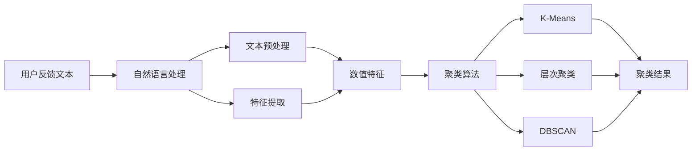

# 自然语言处理在用户反馈聚类中的应用

> 关键词：自然语言处理、用户反馈聚类、文本挖掘、机器学习、数据分析、信息提取、聚类算法

> 摘要：本文聚焦于自然语言处理在用户反馈聚类中的应用。首先介绍了相关背景，包括目的、预期读者等内容。接着深入阐述自然语言处理和用户反馈聚类的核心概念及联系，详细讲解核心算法原理与操作步骤，并通过数学模型和公式进行理论支撑。在项目实战部分，给出代码实际案例并进行详细解释。还探讨了自然语言处理在用户反馈聚类中的实际应用场景，推荐了相关工具和资源。最后总结未来发展趋势与挑战，提供常见问题解答及扩展阅读参考资料，旨在全面剖析自然语言处理在用户反馈聚类领域的应用，为相关从业者和研究者提供有价值的参考。

## 1. 背景介绍 
### 1.1 目的和范围
在当今数字化时代，企业和组织每天都会收到大量的用户反馈信息，这些反馈以自然语言的形式存在，如文本评论、邮件、社交媒体留言等。用户反馈中蕴含着宝贵的信息，如用户的需求、满意度、意见和建议等。然而，由于反馈信息的数量庞大且形式多样，人工处理和分析这些信息变得十分困难。自然语言处理（Natural Language Processing，NLP）技术的出现为解决这一问题提供了有效的手段。

本文章的目的在于深入探讨自然语言处理在用户反馈聚类中的应用，通过对用户反馈文本的处理和分析，将相似的反馈信息聚为一类，以便企业和组织能够快速、准确地了解用户的需求和意见，从而做出更明智的决策。文章的范围涵盖了自然语言处理的基本概念、核心算法、数学模型，以及在用户反馈聚类中的具体应用案例和实践经验。

### 1.2 预期读者
本文的预期读者包括但不限于以下几类人群：
- **数据科学家和分析师**：对自然语言处理和文本挖掘技术感兴趣，希望了解如何将这些技术应用于用户反馈分析的专业人士。
- **企业管理者和决策者**：希望通过分析用户反馈来改进产品和服务，提高用户满意度的企业管理人员。
- **研究人员和学者**：从事自然语言处理、机器学习、数据挖掘等相关领域研究的科研人员。
- **程序员和开发人员**：希望学习如何使用自然语言处理技术进行文本处理和分析，开发相关应用程序的技术人员。

### 1.3 文档结构概述
本文的结构如下：
- **核心概念与联系**：介绍自然语言处理和用户反馈聚类的基本概念，以及它们之间的联系。
- **核心算法原理 & 具体操作步骤**：详细讲解自然语言处理中用于文本聚类的核心算法原理，并给出具体的操作步骤，同时使用 Python 源代码进行阐述。
- **数学模型和公式 & 详细讲解 & 举例说明**：介绍文本聚类中涉及的数学模型和公式，并通过具体的例子进行详细讲解。
- **项目实战：代码实际案例和详细解释说明**：给出一个完整的用户反馈聚类项目实战案例，包括开发环境搭建、源代码实现和代码解读。
- **实际应用场景**：探讨自然语言处理在用户反馈聚类中的实际应用场景。
- **工具和资源推荐**：推荐学习自然语言处理和用户反馈聚类相关的工具和资源。
- **总结：未来发展趋势与挑战**：总结自然语言处理在用户反馈聚类中的应用现状，展望未来的发展趋势，并分析面临的挑战。
- **附录：常见问题与解答**：提供一些常见问题的解答，帮助读者更好地理解和应用相关技术。
- **扩展阅读 & 参考资料**：列出相关的扩展阅读材料和参考资料，方便读者进一步深入学习。

### 1.4 术语表
#### 1.4.1 核心术语定义
- **自然语言处理（Natural Language Processing，NLP）**：是计算机科学、人工智能和语言学的交叉领域，旨在让计算机能够理解、处理和生成人类语言。
- **用户反馈聚类**：将大量的用户反馈信息按照相似性进行分组，使得同一组内的反馈信息具有较高的相似性，不同组之间的反馈信息具有较大的差异性。
- **文本挖掘（Text Mining）**：从大量的文本数据中提取有价值的信息和知识的过程。
- **聚类算法（Clustering Algorithm）**：一种无监督学习算法，用于将数据对象分组到不同的簇中，使得同一簇内的对象具有较高的相似性，不同簇之间的对象具有较大的差异性。
- **词向量（Word Vector）**：将文本中的词语表示为向量的形式，以便计算机能够处理和计算词语之间的相似性。

#### 1.4.2 相关概念解释
- **词性标注（Part-of-Speech Tagging）**：给文本中的每个词语标注其词性，如名词、动词、形容词等。
- **命名实体识别（Named Entity Recognition，NER）**：识别文本中的命名实体，如人名、地名、组织机构名等。
- **词干提取（Stemming）**：将词语还原为其词干形式，如将“running”还原为“run”。
- **词形还原（Lemmatization）**：将词语还原为其词典形式，如将“better”还原为“good”。

#### 1.4.3 缩略词列表
- **NLP**：Natural Language Processing（自然语言处理）
- **NER**：Named Entity Recognition（命名实体识别）
- **TF-IDF**：Term Frequency-Inverse Document Frequency（词频 - 逆文档频率）
- **K-Means**：K-Means Clustering Algorithm（K 均值聚类算法）

## 2. 核心概念与联系 
### 自然语言处理的核心概念
自然语言处理主要涉及以下几个核心方面：
- **文本预处理**：包括文本清洗、分词、词性标注、词干提取、词形还原等操作，目的是将原始的文本数据转换为计算机能够处理的格式。
- **特征提取**：将文本数据转换为数值特征，常用的方法有词袋模型、TF-IDF、词向量等。
- **文本分类**：将文本数据分类到不同的类别中，如情感分类、主题分类等。
- **信息提取**：从文本数据中提取有用的信息，如命名实体识别、关系抽取等。
- **文本生成**：根据给定的输入生成自然语言文本，如机器翻译、文本摘要等。

### 用户反馈聚类的核心概念
用户反馈聚类的主要目标是将大量的用户反馈信息按照相似性进行分组，以便更好地理解用户的需求和意见。常用的聚类算法有 K-Means、层次聚类、DBSCAN 等。聚类的结果可以帮助企业和组织快速了解用户的关注点，发现潜在的问题和机会，从而采取相应的措施来改进产品和服务。

### 自然语言处理与用户反馈聚类的联系
自然语言处理是实现用户反馈聚类的关键技术。通过自然语言处理的文本预处理和特征提取步骤，可以将用户反馈文本转换为计算机能够处理的数值特征，然后使用聚类算法对这些特征进行聚类分析。同时，自然语言处理的信息提取和文本分类技术也可以辅助用户反馈聚类，提高聚类的准确性和效率。

### 核心概念原理和架构的文本示意图
```plaintext
用户反馈文本 -> 自然语言处理（文本预处理、特征提取） -> 数值特征 -> 聚类算法（K-Means、层次聚类等） -> 聚类结果
```

### Mermaid 流程图


## 3. 核心算法原理 & 具体操作步骤 
### K-Means 聚类算法原理
K-Means 是一种常用的聚类算法，其基本思想是将数据对象划分为 K 个簇，使得簇内的数据对象具有较高的相似性，簇间的数据对象具有较大的差异性。具体步骤如下：
1. **初始化**：随机选择 K 个数据对象作为初始的聚类中心。
2. **分配**：将每个数据对象分配到距离其最近的聚类中心所在的簇中。
3. **更新**：计算每个簇的新的聚类中心。
4. **重复**：重复步骤 2 和 3，直到聚类中心不再发生变化或达到最大迭代次数。

### Python 代码实现 K-Means 聚类
```python
import numpy as np
from sklearn.cluster import KMeans
from sklearn.feature_extraction.text import TfidfVectorizer

# 示例用户反馈文本
user_feedback = [
    "这个产品很好用，很方便",
    "产品质量不错，值得购买",
    "这个产品太垃圾了，根本没法用",
    "服务态度很好，很满意",
    "服务太差了，让人很生气"
]

# 文本特征提取，使用 TF-IDF 向量izer
vectorizer = TfidfVectorizer()
X = vectorizer.fit_transform(user_feedback)

# 设置聚类的簇数
k = 2

# 创建 K-Means 聚类模型
kmeans = KMeans(n_clusters=k, random_state=42)

# 训练模型
kmeans.fit(X)

# 获取聚类标签
labels = kmeans.labels_

# 输出聚类结果
for i in range(len(user_feedback)):
    print(f"文本: {user_feedback[i]}, 聚类标签: {labels[i]}")
```

### 代码解释
1. **导入必要的库**：导入 `numpy` 用于数值计算，`KMeans` 用于聚类，`TfidfVectorizer` 用于文本特征提取。
2. **定义示例用户反馈文本**：定义一个包含多个用户反馈文本的列表。
3. **文本特征提取**：使用 `TfidfVectorizer` 将文本转换为 TF-IDF 特征向量。
4. **设置聚类的簇数**：设置 `k` 为 2，表示将用户反馈文本分为 2 个簇。
5. **创建 K-Means 聚类模型**：创建一个 `KMeans` 模型，并设置簇数和随机种子。
6. **训练模型**：使用 `fit` 方法训练模型。
7. **获取聚类标签**：使用 `labels_` 属性获取每个文本的聚类标签。
8. **输出聚类结果**：遍历每个文本，输出其文本内容和聚类标签。

### 具体操作步骤总结
1. **数据准备**：收集用户反馈文本数据。
2. **文本预处理**：对文本数据进行清洗、分词等预处理操作。
3. **特征提取**：使用 TF-IDF 等方法将文本数据转换为数值特征。
4. **选择聚类算法**：选择合适的聚类算法，如 K-Means。
5. **设置参数**：设置聚类的簇数等参数。
6. **训练模型**：使用特征数据训练聚类模型。
7. **获取聚类结果**：获取每个文本的聚类标签。
8. **分析结果**：分析聚类结果，了解用户的需求和意见。

## 4. 数学模型和公式 & 详细讲解 & 举例说明 
### TF-IDF 数学模型和公式
TF-IDF（Term Frequency-Inverse Document Frequency）是一种常用的文本特征提取方法，用于衡量一个词语在文本中的重要性。其基本思想是：一个词语在一个文本中出现的频率越高，同时在其他文本中出现的频率越低，则该词语在该文本中的重要性越高。

#### 词频（Term Frequency，TF）
词频是指一个词语在一个文本中出现的频率，计算公式为：
$$
TF_{t,d} = \frac{n_{t,d}}{\sum_{i=1}^{|V|} n_{i,d}}
$$
其中，$TF_{t,d}$ 表示词语 $t$ 在文本 $d$ 中的词频，$n_{t,d}$ 表示词语 $t$ 在文本 $d$ 中出现的次数，$|V|$ 表示词汇表的大小。

#### 逆文档频率（Inverse Document Frequency，IDF）
逆文档频率是指一个词语在所有文本中出现的频率的倒数，计算公式为：
$$
IDF_{t} = \log\frac{N}{df_{t}}
$$
其中，$IDF_{t}$ 表示词语 $t$ 的逆文档频率，$N$ 表示文本的总数，$df_{t}$ 表示包含词语 $t$ 的文本的数量。

#### TF-IDF 值
TF-IDF 值是词频和逆文档频率的乘积，计算公式为：
$$
TF - IDF_{t,d} = TF_{t,d} \times IDF_{t}
$$

### 详细讲解
TF-IDF 方法通过词频和逆文档频率的组合，能够有效地过滤掉一些常见的、无意义的词语，如“的”、“是”、“在”等，同时突出一些具有代表性的、重要的词语。例如，在一个关于电子产品的用户反馈文本中，“手机”、“电池”、“性能”等词语可能是比较重要的，而“的”、“是”等词语则相对不重要。通过计算这些词语的 TF-IDF 值，可以将它们作为文本的特征，用于后续的聚类分析。

### 举例说明
假设有以下 3 个文本：
- $d_1$: "这个手机很好用，性能不错"
- $d_2$: "这个手机的电池续航太差了"
- $d_3$: "这个电脑的性能也不错"

词汇表 $V = \{"这个", "手机", "很好用", "性能", "不错", "电池", "续航", "太差了", "电脑"\}$。

计算词语“手机”的 TF-IDF 值：
- **词频（TF）**：
  - 在 $d_1$ 中，$n_{手机,d_1} = 1$，$\sum_{i=1}^{|V|} n_{i,d_1} = 5$，所以 $TF_{手机,d_1} = \frac{1}{5} = 0.2$。
  - 在 $d_2$ 中，$n_{手机,d_2} = 1$，$\sum_{i=1}^{|V|} n_{i,d_2} = 6$，所以 $TF_{手机,d_2} = \frac{1}{6} \approx 0.167$。
  - 在 $d_3$ 中，$n_{手机,d_3} = 0$，所以 $TF_{手机,d_3} = 0$。
- **逆文档频率（IDF）**：
  - 包含词语“手机”的文本数量 $df_{手机} = 2$，文本总数 $N = 3$，所以 $IDF_{手机} = \log\frac{3}{2} \approx 0.405$。
- **TF-IDF 值**：
  - 在 $d_1$ 中，$TF - IDF_{手机,d_1} = TF_{手机,d_1} \times IDF_{手机} = 0.2 \times 0.405 = 0.081$。
  - 在 $d_2$ 中，$TF - IDF_{手机,d_2} = TF_{手机,d_2} \times IDF_{手机} \approx 0.167 \times 0.405 \approx 0.068$。
  - 在 $d_3$ 中，$TF - IDF_{手机,d_3} = TF_{手机,d_3} \times IDF_{手机} = 0$。

通过计算 TF-IDF 值，可以得到每个词语在每个文本中的重要性，从而将文本转换为数值特征。

## 5. 项目实战：代码实际案例和详细解释说明 
### 5.1  开发环境搭建
#### 安装 Python
首先需要安装 Python 环境，建议使用 Python 3.6 及以上版本。可以从 Python 官方网站（https://www.python.org/downloads/） 下载并安装。

#### 安装必要的库
使用 `pip` 安装以下必要的库：
```sh
pip install numpy scikit-learn pandas nltk
```
- `numpy`：用于数值计算。
- `scikit-learn`：提供了各种机器学习算法和工具。
- `pandas`：用于数据处理和分析。
- `nltk`：自然语言处理工具包，用于文本预处理。

### 5.2  源代码详细实现和代码解读
```python
import pandas as pd
import numpy as np
from sklearn.feature_extraction.text import TfidfVectorizer
from sklearn.cluster import KMeans
from nltk.corpus import stopwords
from nltk.tokenize import word_tokenize
import nltk

# 下载 nltk 数据
nltk.download('punkt')
nltk.download('stopwords')

# 读取用户反馈数据
data = pd.read_csv('user_feedback.csv')

# 提取用户反馈文本列
feedback_text = data['feedback_text']

# 文本预处理函数
def preprocess_text(text):
    # 转换为小写
    text = text.lower()
    # 分词
    tokens = word_tokenize(text)
    # 去除停用词
    stop_words = set(stopwords.words('english'))
    filtered_tokens = [token for token in tokens if token.isalpha() and token not in stop_words]
    # 拼接成字符串
    preprocessed_text = ' '.join(filtered_tokens)
    return preprocessed_text

# 对用户反馈文本进行预处理
preprocessed_feedback = feedback_text.apply(preprocess_text)

# 文本特征提取，使用 TF-IDF 向量izer
vectorizer = TfidfVectorizer()
X = vectorizer.fit_transform(preprocessed_feedback)

# 设置聚类的簇数
k = 3

# 创建 K-Means 聚类模型
kmeans = KMeans(n_clusters=k, random_state=42)

# 训练模型
kmeans.fit(X)

# 获取聚类标签
labels = kmeans.labels_

# 将聚类标签添加到原始数据中
data['cluster_label'] = labels

# 保存聚类结果到新的 CSV 文件
data.to_csv('user_feedback_clustered.csv', index=False)
```

### 5.3  代码解读与分析
1. **导入必要的库**：导入 `pandas` 用于数据处理，`numpy` 用于数值计算，`TfidfVectorizer` 用于文本特征提取，`KMeans` 用于聚类，`nltk` 用于文本预处理。
2. **下载 nltk 数据**：下载 `punkt` 和 `stopwords` 数据，用于分词和去除停用词。
3. **读取用户反馈数据**：使用 `pandas` 读取用户反馈数据文件 `user_feedback.csv`。
4. **提取用户反馈文本列**：从数据中提取用户反馈文本列。
5. **文本预处理函数**：定义一个文本预处理函数 `preprocess_text`，用于将文本转换为小写、分词、去除停用词等操作。
6. **对用户反馈文本进行预处理**：使用 `apply` 方法对用户反馈文本列中的每个文本进行预处理。
7. **文本特征提取**：使用 `TfidfVectorizer` 将预处理后的文本转换为 TF-IDF 特征向量。
8. **设置聚类的簇数**：设置 `k` 为 3，表示将用户反馈文本分为 3 个簇。
9. **创建 K-Means 聚类模型**：创建一个 `KMeans` 模型，并设置簇数和随机种子。
10. **训练模型**：使用 `fit` 方法训练模型。
11. **获取聚类标签**：使用 `labels_` 属性获取每个文本的聚类标签。
12. **将聚类标签添加到原始数据中**：将聚类标签添加到原始数据的新列 `cluster_label` 中。
13. **保存聚类结果到新的 CSV 文件**：将包含聚类标签的原始数据保存到新的 CSV 文件 `user_feedback_clustered.csv` 中。

通过以上步骤，可以完成一个完整的用户反馈聚类项目，将用户反馈文本按照相似性进行分组，并将聚类结果保存到文件中。

## 6. 实际应用场景 
### 产品改进
通过对用户反馈进行聚类分析，企业可以了解用户对产品的需求和意见，发现产品存在的问题和不足之处。例如，将用户反馈分为功能需求、性能问题、界面设计等不同的簇，企业可以针对每个簇的问题进行有针对性的改进，提高产品的质量和用户满意度。

### 客户服务优化
对用户反馈进行聚类可以帮助企业了解用户的常见问题和需求，从而优化客户服务流程。例如，将用户反馈分为技术支持、订单查询、投诉建议等不同的簇，企业可以根据不同的簇分配相应的客服人员，提高客户服务的效率和质量。

### 市场调研
用户反馈中蕴含着丰富的市场信息，通过聚类分析可以了解用户的需求和偏好，为市场调研提供有力的支持。例如，将用户反馈分为不同的市场细分群体，企业可以针对每个群体的需求和偏好进行产品定位和市场营销策略的制定。

### 品牌管理
通过对用户反馈进行聚类分析，企业可以了解用户对品牌的评价和态度，及时发现品牌存在的问题和危机。例如，将用户反馈分为正面评价、负面评价、中性评价等不同的簇，企业可以针对不同的簇采取相应的措施，维护品牌形象和声誉。

## 7. 工具和资源推荐
### 7.1 学习资源推荐
#### 7.1.1 书籍推荐
- 《Python 自然语言处理》（Natural Language Processing with Python）：介绍了使用 Python 进行自然语言处理的基本方法和技术。
- 《统计自然语言处理基础》（Foundations of Statistical Natural Language Processing）：详细介绍了统计自然语言处理的理论和方法。
- 《机器学习》（Machine Learning）：介绍了机器学习的基本概念、算法和应用，对理解自然语言处理中的聚类算法有很大帮助。

#### 7.1.2 在线课程
- Coursera 上的“Natural Language Processing Specialization”：由斯坦福大学的教授授课，系统地介绍了自然语言处理的各个方面。
- edX 上的“Introduction to Artificial Intelligence”：介绍了人工智能的基本概念和方法，包括自然语言处理的相关内容。
- 网易云课堂上的“Python 自然语言处理实战”：通过实际案例介绍了使用 Python 进行自然语言处理的方法和技术。

#### 7.1.3 技术博客和网站
- Medium 上的“Towards Data Science”：发布了大量关于数据科学、机器学习、自然语言处理等领域的技术文章。
- 博客园：有很多开发者分享自然语言处理和机器学习的经验和技术。
- 开源中国：提供了丰富的开源项目和技术文章，包括自然语言处理相关的内容。

### 7.2 开发工具框架推荐
#### 7.2.1 IDE和编辑器
- PyCharm：一款专业的 Python 集成开发环境，提供了丰富的功能和插件，方便进行自然语言处理项目的开发。
- Jupyter Notebook：一种交互式的开发环境，适合进行数据分析和模型实验，在自然语言处理领域广泛应用。
- Visual Studio Code：一款轻量级的代码编辑器，支持多种编程语言和插件，可用于自然语言处理项目的开发。

#### 7.2.2 调试和性能分析工具
- pdb：Python 内置的调试器，可用于调试自然语言处理代码。
- cProfile：Python 内置的性能分析工具，可用于分析代码的性能瓶颈。
- Py-Spy：一个用于分析 Python 程序性能的工具，可实时查看函数调用和执行时间。

#### 7.2.3 相关框架和库
- NLTK（Natural Language Toolkit）：一个强大的自然语言处理工具包，提供了丰富的语料库、工具和算法。
- SpaCy：一个快速、高效的自然语言处理库，提供了多种语言的支持和预训练模型。
- Scikit-learn：一个常用的机器学习库，提供了各种机器学习算法和工具，可用于自然语言处理中的聚类、分类等任务。
- TensorFlow 和 PyTorch：深度学习框架，可用于构建和训练自然语言处理模型，如神经网络、循环神经网络等。

### 7.3 相关论文著作推荐
#### 7.3.1 经典论文
- “A Statistical Approach to Machine Translation”：介绍了统计机器翻译的基本方法和模型。
- “Word2Vec”：提出了一种用于学习词向量的方法，在自然语言处理领域有广泛的应用。
- “Convolutional Neural Networks for Sentence Classification”：介绍了使用卷积神经网络进行句子分类的方法。

#### 7.3.2 最新研究成果
- 关注 ACL（Association for Computational Linguistics）、EMNLP（Conference on Empirical Methods in Natural Language Processing）等自然语言处理领域的顶级会议，获取最新的研究成果和技术进展。
- 阅读《Journal of Artificial Intelligence Research》、《Transactions of the Association for Computational Linguistics》等相关学术期刊，了解自然语言处理领域的前沿研究。

#### 7.3.3 应用案例分析
- 可以参考一些知名企业和研究机构发布的自然语言处理应用案例，如 Google、Facebook、Microsoft 等公司的相关研究和实践，了解自然语言处理在实际应用中的方法和经验。

## 8. 总结：未来发展趋势与挑战
### 未来发展趋势
- **深度学习的广泛应用**：深度学习技术在自然语言处理领域的应用将越来越广泛，如基于神经网络的语言模型、预训练模型等，将进一步提高自然语言处理的性能和效果。
- **多模态融合**：将自然语言处理与图像、音频等多模态信息融合，实现更加智能和全面的信息处理和分析。
- **个性化和智能化**：根据用户的个性化需求和偏好，提供更加智能化的自然语言处理服务，如个性化推荐、智能客服等。
- **跨语言和跨文化处理**：随着全球化的发展，跨语言和跨文化的自然语言处理需求将越来越大，需要开发更加高效和准确的跨语言处理技术。

### 挑战
- **数据质量和标注**：自然语言处理需要大量高质量的数据进行训练和模型优化，数据的质量和标注的准确性对模型的性能有很大影响。
- **语义理解和推理**：虽然自然语言处理技术在词汇和句法层面取得了很大进展，但在语义理解和推理方面仍然面临很大挑战，需要进一步研究和发展。
- **计算资源和效率**：深度学习模型通常需要大量的计算资源和时间进行训练和推理，如何提高计算效率和降低计算成本是一个重要的挑战。
- **伦理和法律问题**：自然语言处理技术的应用涉及到隐私、安全、伦理等方面的问题，需要制定相应的法律法规和道德准则来规范其发展和应用。

## 9. 附录：常见问题与解答
### 问题 1：如何选择合适的聚类算法？
答：选择合适的聚类算法需要考虑数据的特点、聚类的目的和要求等因素。常见的聚类算法有 K-Means、层次聚类、DBSCAN 等。K-Means 算法简单、高效，适用于数据分布较为均匀的情况；层次聚类可以得到不同层次的聚类结果，适用于需要了解数据层次结构的情况；DBSCAN 算法可以处理任意形状的簇，适用于数据分布不均匀的情况。

### 问题 2：如何确定聚类的簇数？
答：确定聚类的簇数是一个比较困难的问题，常见的方法有手肘法、轮廓系数法等。手肘法通过绘制不同簇数下的聚类误差平方和（SSE）曲线，选择曲线拐点处的簇数作为最优簇数；轮廓系数法通过计算每个样本的轮廓系数，选择轮廓系数最大的簇数作为最优簇数。

### 问题 3：自然语言处理中的文本预处理有哪些步骤？
答：自然语言处理中的文本预处理通常包括以下步骤：文本清洗（去除特殊字符、HTML 标签等）、分词、词性标注、词干提取、词形还原、去除停用词等。这些步骤的目的是将原始的文本数据转换为计算机能够处理的格式，提高后续分析的准确性和效率。

### 问题 4：如何评估聚类结果的质量？
答：评估聚类结果的质量可以使用一些指标，如轮廓系数、Calinski-Harabasz 指数、Davies-Bouldin 指数等。轮廓系数反映了每个样本与所在簇的相似度和与其他簇的分离度，值越接近 1 表示聚类效果越好；Calinski-Harabasz 指数反映了簇间的分离程度和簇内的紧凑程度，值越大表示聚类效果越好；Davies-Bouldin 指数反映了簇间的相似度，值越小表示聚类效果越好。

## 10. 扩展阅读 & 参考资料
### 扩展阅读
- 《人工智能：现代方法》（Artificial Intelligence: A Modern Approach）：全面介绍了人工智能的基本概念、方法和技术，包括自然语言处理的相关内容。
- 《深度学习》（Deep Learning）：详细介绍了深度学习的理论和方法，对理解自然语言处理中的深度学习模型有很大帮助。
- 《数据挖掘：概念与技术》（Data Mining: Concepts and Techniques）：介绍了数据挖掘的基本概念、算法和应用，对理解自然语言处理中的文本挖掘和聚类算法有很大帮助。

### 参考资料
- 相关的学术论文和研究报告，可通过学术数据库（如 IEEE Xplore、ACM Digital Library、Google Scholar 等）进行查找。
- 开源项目的官方文档和代码库，如 NLTK、SpaCy、Scikit-learn 等的官方文档。
- 相关的技术博客和论坛，如 Stack Overflow、Reddit 等，可获取开发者的经验和技术分享。