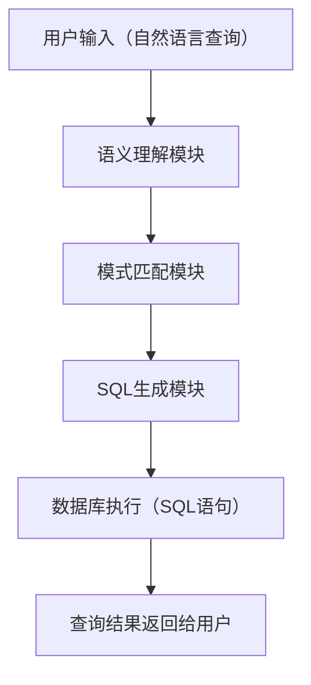

# 自然语言查询转SQL:AI简化数据分析

> 关键词：自然语言查询、SQL、人工智能、数据分析、语义理解、知识图谱、数据挖掘

> 摘要：在当今数据驱动的时代，数据分析变得至关重要。然而，传统的SQL查询需要专业的技术知识，限制了非技术人员对数据的探索和分析。自然语言查询转SQL技术借助人工智能的力量，让用户能够用自然语言表达查询需求，系统自动将其转换为可执行的SQL语句，极大地简化了数据分析过程。本文将深入探讨自然语言查询转SQL的核心概念、算法原理、数学模型、项目实战、应用场景等内容，为读者全面呈现这一技术的魅力和价值。

## 1. 背景介绍 
### 1.1 目的和范围
本技术博客的目的在于全面介绍自然语言查询转SQL这一前沿技术，帮助读者深入理解其原理、实现方法和应用场景。范围涵盖从基础概念的讲解到具体算法的剖析，再到实际项目的实战演练，以及对未来发展趋势的展望。旨在让不同层次的读者，无论是初学者还是有一定经验的技术人员，都能从中获得有价值的信息和启示。

### 1.2 预期读者
本文预期读者包括数据分析师、数据库管理员、软件开发者、人工智能爱好者以及对数据分析技术有兴趣的非技术人员。希望通过本文的讲解，能帮助他们更好地理解和应用自然语言查询转SQL技术，提升数据分析的效率和质量。

### 1.3 文档结构概述
本文将按照以下结构进行阐述：首先介绍自然语言查询转SQL的背景和相关术语；接着深入探讨核心概念及其联系，包括原理和架构的示意图；然后详细讲解核心算法原理和具体操作步骤，并用Python代码进行阐述；之后介绍数学模型和公式，并举例说明；再通过项目实战展示代码的实际应用和详细解释；随后探讨实际应用场景；推荐相关的工具和资源；最后总结未来发展趋势与挑战，并给出常见问题与解答以及扩展阅读和参考资料。

### 1.4 术语表
#### 1.4.1 核心术语定义
- **自然语言查询（Natural Language Query, NLQ）**：用户使用自然语言（如英语、中文等）表达对数据的查询需求，而不是使用传统的结构化查询语言（如SQL）。
- **SQL（Structured Query Language）**：一种用于管理关系型数据库的标准化语言，用于执行数据的查询、插入、更新和删除等操作。
- **人工智能（Artificial Intelligence, AI）**：研究如何使计算机系统能够模拟人类智能的领域，包括机器学习、深度学习、自然语言处理等技术。
- **语义理解（Semantic Understanding）**：计算机对自然语言文本的含义进行理解和分析的过程，以便准确把握用户的查询意图。
- **知识图谱（Knowledge Graph）**：一种以图的形式表示实体及其之间关系的知识库，可用于辅助自然语言查询转SQL的过程。

#### 1.4.2 相关概念解释
- **自然语言处理（Natural Language Processing, NLP）**：人工智能的一个分支，主要研究如何让计算机处理和理解人类语言。在自然语言查询转SQL中，NLP技术用于对用户输入的自然语言进行分词、词性标注、句法分析等处理，以提取关键信息。
- **机器学习（Machine Learning）**：人工智能的一个重要领域，通过让计算机从数据中学习模式和规律，从而实现对未知数据的预测和分类。在自然语言查询转SQL中，机器学习算法可用于训练模型，以提高查询转换的准确性。
- **深度学习（Deep Learning）**：一种基于人工神经网络的机器学习技术，通过构建多层神经网络来自动学习数据的特征和模式。在自然语言处理中，深度学习模型（如循环神经网络、卷积神经网络、Transformer等）被广泛应用于语义理解和文本生成任务。

#### 1.4.3 缩略词列表
- **NLQ**：Natural Language Query（自然语言查询）
- **SQL**：Structured Query Language（结构化查询语言）
- **AI**：Artificial Intelligence（人工智能）
- **NLP**：Natural Language Processing（自然语言处理）
- **ML**：Machine Learning（机器学习）
- **DL**：Deep Learning（深度学习）

## 2. 核心概念与联系 
自然语言查询转SQL的核心目标是将用户输入的自然语言查询转换为可执行的SQL语句，从而实现对数据库的查询操作。这一过程涉及多个核心概念和技术，它们之间相互关联，共同完成查询转换的任务。

### 核心概念原理
- **语义理解**：自然语言是非常灵活和多样化的，用户可能会用不同的表达方式来表达相同的查询需求。因此，系统需要对用户输入的自然语言进行语义理解，提取其中的关键信息，如实体、属性、关系等。例如，对于自然语言查询“找出年龄大于30岁的员工”，系统需要理解“员工”是实体，“年龄”是属性，“大于30岁”是条件。
- **模式匹配**：在理解了用户查询的语义后，系统需要将这些语义信息与数据库的模式（表结构、字段名等）进行匹配。例如，数据库中可能有一个名为“employees”的表，其中有一个字段名为“age”，系统需要将自然语言中的“员工”与“employees”表匹配，将“年龄”与“age”字段匹配。
- **SQL生成**：根据语义理解和模式匹配的结果，系统生成相应的SQL语句。例如，对于上述自然语言查询，生成的SQL语句可能是“SELECT * FROM employees WHERE age > 30;”。

### 架构的文本示意图
```plaintext
用户输入（自然语言查询）
    |
    v
语义理解模块
    |
    v
模式匹配模块
    |
    v
SQL生成模块
    |
    v
数据库执行（SQL语句）
    |
    v
查询结果返回给用户
```

### Mermaid流程图


## 3. 核心算法原理 & 具体操作步骤 
### 核心算法原理
自然语言查询转SQL的核心算法主要基于机器学习和深度学习技术，以下是几种常见的算法：

#### 基于规则的方法
基于规则的方法是最早被应用于自然语言查询转SQL的方法之一。该方法通过定义一系列的语法规则和语义规则，将自然语言查询转换为SQL语句。例如，对于特定的查询模式“找出XX的YY”，可以定义规则将其转换为“SELECT YY FROM XX”的SQL语句。这种方法的优点是简单直观，易于实现和调试；缺点是规则的覆盖范围有限，难以处理复杂和多样化的自然语言查询。

#### 基于机器学习的方法
基于机器学习的方法通过训练模型来学习自然语言查询和SQL语句之间的映射关系。常见的机器学习算法包括决策树、支持向量机、朴素贝叶斯等。具体步骤如下：
1. **数据收集**：收集大量的自然语言查询和对应的SQL语句作为训练数据。
2. **特征提取**：从自然语言查询和SQL语句中提取特征，如词频、词性、句法结构等。
3. **模型训练**：使用训练数据对机器学习模型进行训练，学习自然语言查询和SQL语句之间的映射关系。
4. **查询转换**：对于新的自然语言查询，使用训练好的模型将其转换为SQL语句。

#### 基于深度学习的方法
基于深度学习的方法近年来在自然语言查询转SQL领域取得了显著的成果。深度学习模型（如循环神经网络、卷积神经网络、Transformer等）能够自动学习自然语言的语义和结构，从而更准确地将自然语言查询转换为SQL语句。以下是一个基于Transformer的自然语言查询转SQL的示例代码：

```python
import torch
from transformers import AutoTokenizer, AutoModelForSeq2SeqLM

# 加载预训练的模型和分词器
tokenizer = AutoTokenizer.from_pretrained("mrm8488/t5-base-finetuned-wikiSQL")
model = AutoModelForSeq2SeqLM.from_pretrained("mrm8488/t5-base-finetuned-wikiSQL")

def natural_language_to_sql(natural_language_query):
    # 对自然语言查询进行分词
    input_ids = tokenizer.encode(natural_language_query, return_tensors="pt")
    
    # 生成SQL语句
    output = model.generate(input_ids)
    
    # 解码生成的SQL语句
    sql_query = tokenizer.decode(output[0], skip_special_tokens=True)
    
    return sql_query

# 示例自然语言查询
natural_language_query = "找出年龄大于30岁的员工"

# 转换为SQL语句
sql_query = natural_language_to_sql(natural_language_query)
print("自然语言查询:", natural_language_query)
print("生成的SQL语句:", sql_query)
```

### 具体操作步骤
1. **数据预处理**：对收集到的自然语言查询和SQL语句进行清洗和预处理，包括去除噪声、分词、词性标注等操作。
2. **模型选择和训练**：根据具体的任务需求和数据特点，选择合适的机器学习或深度学习模型，并使用预处理后的数据对模型进行训练。
3. **模型评估和优化**：使用测试数据对训练好的模型进行评估，根据评估结果对模型进行优化，如调整模型参数、增加训练数据等。
4. **查询转换**：将用户输入的自然语言查询输入到训练好的模型中，得到对应的SQL语句。
5. **SQL语句执行**：将生成的SQL语句发送到数据库中执行，获取查询结果并返回给用户。

## 4. 数学模型和公式 & 详细讲解 & 举例说明 
### 数学模型
自然语言查询转SQL可以看作是一个序列到序列的映射问题，即将自然语言查询序列映射为SQL语句序列。在深度学习中，常用的序列到序列模型包括编码器 - 解码器（Encoder - Decoder）模型。

编码器 - 解码器模型由编码器和解码器两部分组成。编码器将输入的自然语言查询序列编码为一个固定长度的向量表示，解码器则根据这个向量表示生成对应的SQL语句序列。

### 公式
设输入的自然语言查询序列为 $X = [x_1, x_2, \cdots, x_n]$，对应的SQL语句序列为 $Y = [y_1, y_2, \cdots, y_m]$。编码器的输出为 $h = Encoder(X)$，解码器的输出为 $\hat{Y} = Decoder(h)$。

在训练过程中，模型的目标是最小化预测的SQL语句序列 $\hat{Y}$ 与真实的SQL语句序列 $Y$ 之间的损失函数。常用的损失函数包括交叉熵损失函数：

$$
L = -\frac{1}{m} \sum_{i=1}^{m} \log P(y_i | y_1, \cdots, y_{i-1}, h)
$$

其中，$P(y_i | y_1, \cdots, y_{i-1}, h)$ 表示在给定前面的词 $y_1, \cdots, y_{i-1}$ 和编码器输出 $h$ 的条件下，生成词 $y_i$ 的概率。

### 详细讲解
编码器 - 解码器模型通过不断地调整参数，使得预测的SQL语句序列尽可能接近真实的SQL语句序列。在训练过程中，模型会根据损失函数的梯度来更新参数，以降低损失值。

### 举例说明
假设输入的自然语言查询为“找出年龄最大的员工”，对应的真实SQL语句为“SELECT * FROM employees ORDER BY age DESC LIMIT 1;”。模型在训练过程中，会不断地调整参数，使得生成的SQL语句尽可能接近这个真实的SQL语句。例如，在某个训练步骤中，模型生成的SQL语句为“SELECT * FROM employees ORDER BY age DESC;”，此时损失函数会计算这个预测结果与真实结果之间的差异，并根据差异来更新模型的参数。

## 5. 项目实战：代码实际案例和详细解释说明 
### 5.1  开发环境搭建
1. **安装Python**：确保你的系统中已经安装了Python 3.x版本。可以从Python官方网站（https://www.python.org/downloads/） 下载并安装。
2. **安装必要的库**：使用pip命令安装所需的库，如`torch`、`transformers`等。
```bash
pip install torch transformers
```

### 5.2  源代码详细实现和代码解读
以下是一个完整的自然语言查询转SQL的项目代码示例：

```python
import torch
from transformers import AutoTokenizer, AutoModelForSeq2SeqLM

# 加载预训练的模型和分词器
tokenizer = AutoTokenizer.from_pretrained("mrm8488/t5-base-finetuned-wikiSQL")
model = AutoModelForSeq2SeqLM.from_pretrained("mrm8488/t5-base-finetuned-wikiSQL")

def natural_language_to_sql(natural_language_query):
    # 对自然语言查询进行分词
    input_ids = tokenizer.encode(natural_language_query, return_tensors="pt")
    
    # 生成SQL语句
    output = model.generate(input_ids)
    
    # 解码生成的SQL语句
    sql_query = tokenizer.decode(output[0], skip_special_tokens=True)
    
    return sql_query

# 示例自然语言查询列表
natural_language_queries = [
    "找出年龄大于30岁的员工",
    "统计每个部门的员工数量",
    "查询工资最高的员工信息"
]

# 转换并打印结果
for query in natural_language_queries:
    sql_query = natural_language_to_sql(query)
    print("自然语言查询:", query)
    print("生成的SQL语句:", sql_query)
    print()
```

### 代码解读与分析
1. **模型和分词器的加载**：使用`AutoTokenizer`和`AutoModelForSeq2SeqLM`从Hugging Face的模型库中加载预训练的模型和分词器。这里使用的是“mrm8488/t5-base-finetuned-wikiSQL”模型，该模型是在WikiSQL数据集上进行微调的。
2. **`natural_language_to_sql`函数**：该函数接受一个自然语言查询作为输入，首先使用分词器对查询进行分词，将其转换为模型可以处理的输入ID。然后使用模型生成对应的SQL语句的ID序列，最后使用分词器将ID序列解码为文本形式的SQL语句。
3. **示例查询的处理**：定义了一个自然语言查询列表，遍历列表中的每个查询，调用`natural_language_to_sql`函数将其转换为SQL语句，并打印结果。

## 6. 实际应用场景 
### 企业数据分析
在企业中，不同部门的员工可能需要对公司的数据进行分析，但并非所有员工都具备专业的SQL知识。自然语言查询转SQL技术可以让这些员工用自然语言表达自己的查询需求，系统自动将其转换为SQL语句，从而方便地获取所需的数据。例如，市场部门的员工可以通过自然语言查询“找出最近一个月内销售额最高的产品”，系统自动生成相应的SQL语句并执行，返回查询结果。

### 智能客服
在智能客服系统中，用户可能会用自然语言询问关于产品信息、订单状态等问题。自然语言查询转SQL技术可以将用户的问题转换为SQL语句，从数据库中查询相关信息并返回给用户。例如，用户询问“我的订单什么时候发货”，系统可以将该问题转换为SQL语句，查询订单数据库中该用户订单的发货状态并返回给用户。

### 教育领域
在教育领域，学生可以通过自然语言查询来获取学习资源和信息。例如，学生可以询问“查找关于人工智能的书籍”，系统将该查询转换为SQL语句，从图书馆数据库中查询相关书籍信息并返回给学生。

## 7. 工具和资源推荐
### 7.1 学习资源推荐
#### 7.1.1 书籍推荐
- 《自然语言处理入门》：这本书全面介绍了自然语言处理的基本概念、算法和技术，适合初学者入门。
- 《深度学习》：由Ian Goodfellow、Yoshua Bengio和Aaron Courville三位深度学习领域的权威专家撰写，是深度学习领域的经典教材。
- 《Python自然语言处理》：介绍了如何使用Python进行自然语言处理，包含了丰富的实例代码。

#### 7.1.2 在线课程
- Coursera上的“Natural Language Processing Specialization”：由斯坦福大学的教授授课，系统地介绍了自然语言处理的各个方面。
- edX上的“Deep Learning Specialization”：由Andrew Ng教授授课，深入讲解了深度学习的原理和应用。
- 中国大学MOOC上的“自然语言处理”：国内高校教师授课，结合国内实际情况介绍自然语言处理技术。

#### 7.1.3 技术博客和网站
- Hugging Face Blog：提供了关于自然语言处理和深度学习的最新研究成果和技术文章。
- Medium上的Towards Data Science：汇集了大量关于数据科学和人工智能的优秀文章。
- 机器之心：专注于人工智能领域的资讯和技术分享。

### 7.2 开发工具框架推荐
#### 7.2.1 IDE和编辑器
- PyCharm：一款功能强大的Python集成开发环境，提供了代码编辑、调试、版本控制等功能。
- Visual Studio Code：一款轻量级的代码编辑器，支持多种编程语言，并且有丰富的插件扩展功能。

#### 7.2.2 调试和性能分析工具
- PyTorch Profiler：用于分析PyTorch模型的性能，找出性能瓶颈。
- TensorBoard：用于可视化深度学习模型的训练过程和性能指标。

#### 7.2.3 相关框架和库
- PyTorch：一个开源的深度学习框架，提供了丰富的深度学习模型和工具。
- Hugging Face Transformers：一个用于自然语言处理的开源库，提供了大量预训练的模型和工具。
- NLTK（Natural Language Toolkit）：一个用于自然语言处理的Python库，提供了丰富的自然语言处理工具和数据集。

### 7.3 相关论文著作推荐
#### 7.3.1 经典论文
- “Attention Is All You Need”：提出了Transformer模型，是自然语言处理领域的里程碑式论文。
- “Sequence to Sequence Learning with Neural Networks”：介绍了编码器 - 解码器模型在序列到序列任务中的应用。

#### 7.3.2 最新研究成果
- 关注ACL（Association for Computational Linguistics）、EMNLP（Conference on Empirical Methods in Natural Language Processing）等自然语言处理领域的顶级会议，获取最新的研究成果。

#### 7.3.3 应用案例分析
- 查看各大企业和研究机构发布的关于自然语言查询转SQL技术的应用案例，了解其在实际场景中的应用效果和经验。

## 8. 总结：未来发展趋势与挑战
### 未来发展趋势
- **多语言支持**：随着全球化的发展，自然语言查询转SQL技术将支持更多的语言，以满足不同地区用户的需求。
- **与知识图谱的深度融合**：知识图谱可以提供更丰富的语义信息，帮助系统更好地理解用户的查询意图。未来，自然语言查询转SQL技术将与知识图谱深度融合，提高查询转换的准确性和智能性。
- **端到端的学习**：目前的自然语言查询转SQL技术大多采用分阶段的方法，未来将朝着端到端的学习方向发展，即直接从自然语言查询到SQL语句的生成，减少中间环节，提高系统的性能和效率。
- **与其他技术的集成**：自然语言查询转SQL技术将与大数据、云计算、物联网等技术集成，为用户提供更全面、更智能的数据分析服务。

### 挑战
- **语义理解的准确性**：自然语言具有丰富的语义和多变的表达方式，准确理解用户的查询意图仍然是一个挑战。特别是对于一些模糊、歧义的查询，系统很难准确地将其转换为SQL语句。
- **数据的多样性和复杂性**：不同的数据库具有不同的模式和数据结构，自然语言查询转SQL技术需要能够处理各种类型的数据库和数据，这增加了技术的实现难度。
- **模型的可解释性**：深度学习模型在自然语言查询转SQL中取得了很好的效果，但这些模型往往是黑盒模型，缺乏可解释性。在一些对解释性要求较高的场景中，如金融、医疗等领域，模型的可解释性是一个重要的问题。
- **安全性和隐私问题**：自然语言查询转SQL技术涉及到用户的敏感数据和数据库的操作，如何保证数据的安全性和隐私性是一个需要解决的问题。

## 9. 附录：常见问题与解答
### 问题1：自然语言查询转SQL技术的准确率有多高？
答：自然语言查询转SQL技术的准确率受到多种因素的影响，如数据质量、模型的性能、查询的复杂度等。一般来说，在一些特定的领域和数据集上，准确率可以达到80% - 90% 左右，但在更复杂和多样化的场景中，准确率可能会有所下降。

### 问题2：该技术是否适用于所有类型的数据库？
答：理论上，自然语言查询转SQL技术可以适用于各种类型的关系型数据库，如MySQL、Oracle、SQL Server等。但不同的数据库可能有不同的语法和特性，需要对模型进行相应的调整和优化。

### 问题3：如何提高自然语言查询转SQL的性能？
答：可以从以下几个方面提高性能：1. 增加训练数据的数量和质量，让模型学习更多的模式和规律；2. 选择更合适的模型和算法，根据具体的任务需求进行优化；3. 对数据进行预处理，去除噪声和冗余信息；4. 采用并行计算和分布式计算技术，提高模型的训练和推理速度。

### 问题4：自然语言查询转SQL技术是否可以处理复杂的查询？
答：目前的技术可以处理一些相对复杂的查询，但对于非常复杂的查询，如涉及多个表的连接、嵌套查询等，仍然存在一定的挑战。随着技术的不断发展，处理复杂查询的能力将逐渐提高。

## 10. 扩展阅读 & 参考资料
- Hugging Face官方文档：https://huggingface.co/docs
- PyTorch官方文档：https://pytorch.org/docs/stable/index.html
- NLTK官方文档：https://www.nltk.org/
- WikiSQL数据集：https://github.com/salesforce/WikiSQL
- ACL Anthology：https://aclanthology.org/
- EMNLP Proceedings：https://www.aclweb.org/anthology/volumes/K/