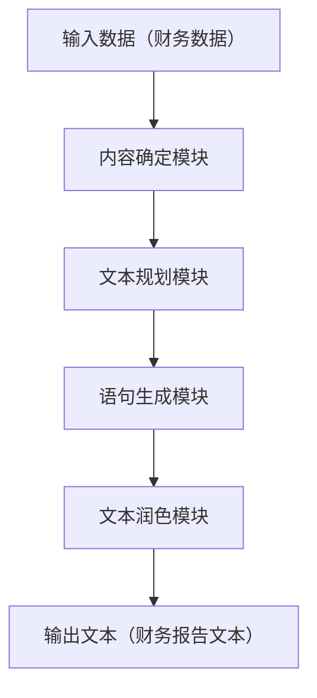

# 自然语言生成技术在财务报告中的应用

> 关键词：自然语言生成技术、财务报告、文本生成、数据分析、人工智能

> 摘要：本文深入探讨了自然语言生成技术在财务报告中的应用。首先介绍了该研究的背景、目的、预期读者和文档结构等内容。接着阐述了自然语言生成技术的核心概念与联系，包括其原理和架构。详细讲解了核心算法原理及具体操作步骤，并给出相关数学模型和公式。通过项目实战展示了代码实现及解读。分析了自然语言生成技术在财务报告中的实际应用场景，推荐了相关的工具和资源。最后总结了未来发展趋势与挑战，还提供了常见问题解答和扩展阅读参考资料，旨在全面呈现自然语言生成技术在财务报告领域的应用情况和潜力。

## 1. 背景介绍 
### 1.1 目的和范围
财务报告是企业向利益相关者传达财务状况和经营成果的重要文件。传统的财务报告编制方式往往耗费大量的人力和时间，且容易出现人为错误。自然语言生成技术作为人工智能领域的一项重要技术，能够自动将财务数据转化为清晰、准确的自然语言文本，提高财务报告的编制效率和质量。本文的目的在于全面探讨自然语言生成技术在财务报告中的应用，包括其原理、方法、实际案例以及未来发展趋势等，范围涵盖了从基础概念到实际应用的各个方面。

### 1.2 预期读者
本文预期读者包括财务领域的专业人士，如财务分析师、会计师、财务经理等，他们可以通过了解自然语言生成技术在财务报告中的应用，提高工作效率和报告质量；人工智能和计算机领域的研究人员和开发者，可从中获取该技术在财务领域的应用场景和需求，推动技术的进一步发展；以及对财务和人工智能交叉领域感兴趣的学生和爱好者，帮助他们了解相关前沿知识。

### 1.3 文档结构概述
本文首先介绍自然语言生成技术在财务报告应用的背景信息，包括目的、读者和结构等。然后阐述核心概念与联系，说明其原理和架构。接着详细讲解核心算法原理、具体操作步骤以及相关数学模型和公式。通过项目实战展示代码实现和解读。分析实际应用场景，推荐相关工具和资源。最后总结未来发展趋势与挑战，提供常见问题解答和扩展阅读参考资料。

### 1.4 术语表
#### 1.4.1 核心术语定义
- **自然语言生成技术（Natural Language Generation, NLG）**：是指利用计算机将结构化数据、知识或信息转化为自然语言文本的技术。
- **财务报告**：是企业对外提供的反映企业某一特定日期的财务状况和某一会计期间的经营成果、现金流量等会计信息的文件。
- **文本模板**：是预先定义好的包含固定文本和可变参数的文本结构，用于自然语言生成中组织和生成文本。
- **数据驱动**：指系统的行为和决策主要基于数据的特征和模式，而不是基于预先设定的规则。

#### 1.4.2 相关概念解释
- **人工智能（Artificial Intelligence, AI）**：是研究、开发用于模拟、延伸和扩展人的智能的理论、方法、技术及应用系统的一门新的技术科学。自然语言生成技术是人工智能的一个重要分支。
- **机器学习（Machine Learning, ML）**：是一门多领域交叉学科，涉及概率论、统计学、逼近论、凸分析、算法复杂度理论等多门学科。它专门研究计算机怎样模拟或实现人类的学习行为，以获取新的知识或技能，重新组织已有的知识结构使之不断改善自身的性能。自然语言生成技术中常常会用到机器学习算法。

#### 1.4.3 缩略词列表
- **NLG**：Natural Language Generation（自然语言生成）
- **AI**：Artificial Intelligence（人工智能）
- **ML**：Machine Learning（机器学习）

## 2. 核心概念与联系 
### 2.1 自然语言生成技术原理
自然语言生成技术的基本原理是将输入的结构化数据经过一系列处理，转化为自然语言文本。一般来说，它包括以下几个主要步骤：
1. **内容确定**：从输入的数据中选择与生成文本相关的信息，确定要表达的核心内容。
2. **文本规划**：对确定的内容进行组织和规划，决定文本的结构和层次，例如段落的划分、句子的顺序等。
3. **语句生成**：根据文本规划的结果，将内容转化为具体的自然语言句子，包括词汇选择、语法构造等。
4. **文本润色**：对生成的句子进行优化和调整，使其更加流畅、自然和符合语言习惯。

### 2.2 自然语言生成技术与财务报告的联系
在财务报告中，存在大量的结构化财务数据，如资产负债表、利润表、现金流量表等。自然语言生成技术可以将这些数据转化为通俗易懂的自然语言文本，帮助利益相关者更好地理解企业的财务状况和经营成果。例如，通过分析财务数据中的各项指标，生成对企业盈利能力、偿债能力、运营能力等方面的评价和分析文本。

### 2.3 核心概念架构的文本示意图
```plaintext
输入数据（财务数据）
|
|-- 内容确定模块（选择关键信息）
|       |
|       |-- 文本规划模块（组织文本结构）
|               |
|               |-- 语句生成模块（生成自然语言句子）
|                       |
|                       |-- 文本润色模块（优化文本）
|                               |
输出文本（财务报告文本）
```

### 2.4 Mermaid 流程图


## 3. 核心算法原理 & 具体操作步骤 
### 3.1 核心算法原理
自然语言生成技术中常用的算法包括基于规则的方法和基于机器学习的方法。

#### 3.1.1 基于规则的方法
基于规则的方法是通过预先定义的语法规则和词汇表来生成自然语言文本。例如，对于财务数据中的利润指标，如果利润增长，则可以定义规则“公司的利润在本期间增长了[利润增长值]，这表明公司的经营状况良好。”其中，[利润增长值]是根据实际数据填充的可变参数。

以下是一个简单的基于规则的自然语言生成的 Python 代码示例：
```python
# 定义财务数据
profit_growth = 10000

# 定义规则模板
rule_template = "公司的利润在本期间增长了{}，这表明公司的经营状况良好。"

# 生成文本
generated_text = rule_template.format(profit_growth)
print(generated_text)
```

#### 3.1.2 基于机器学习的方法
基于机器学习的方法主要是使用深度学习模型，如循环神经网络（RNN）、长短期记忆网络（LSTM）、门控循环单元（GRU）等。这些模型可以学习数据和文本之间的映射关系，从而生成自然语言文本。

以下是一个使用 LSTM 进行文本生成的简单 Python 代码示例：
```python
import numpy as np
from tensorflow.keras.models import Sequential
from tensorflow.keras.layers import LSTM, Dense
from tensorflow.keras.preprocessing.text import Tokenizer
from tensorflow.keras.preprocessing.sequence import pad_sequences

# 示例财务文本数据
text_data = ["公司的利润在本季度有所增长", "销售额较去年同期上升", "成本控制取得了良好效果"]

# 分词处理
tokenizer = Tokenizer()
tokenizer.fit_on_texts(text_data)
total_words = len(tokenizer.word_index) + 1

# 生成输入序列
input_sequences = []
for line in text_data:
    token_list = tokenizer.texts_to_sequences([line])[0]
    for i in range(1, len(token_list)):
        n_gram_sequence = token_list[:i + 1]
        input_sequences.append(n_gram_sequence)

# 填充序列
max_sequence_len = max([len(x) for x in input_sequences])
input_sequences = np.array(pad_sequences(input_sequences, maxlen=max_sequence_len, padding='pre'))

# 划分输入和目标
xs, labels = input_sequences[:, :-1], input_sequences[:, -1]

# 构建 LSTM 模型
model = Sequential()
model.add(LSTM(100, input_shape=(max_sequence_len - 1, 1)))
model.add(Dense(total_words, activation='softmax'))
model.compile(loss='sparse_categorical_crossentropy', optimizer='adam')

# 训练模型
model.fit(xs, labels, epochs=100, verbose=1)

# 生成文本
seed_text = "公司的"
next_words = 3

for _ in range(next_words):
    token_list = tokenizer.texts_to_sequences([seed_text])[0]
    token_list = pad_sequences([token_list], maxlen=max_sequence_len - 1, padding='pre')
    predicted = np.argmax(model.predict(token_list), axis=-1)
    output_word = ""
    for word, index in tokenizer.word_index.items():
        if index == predicted:
            output_word = word
            break
    seed_text += " " + output_word

print(seed_text)
```

### 3.2 具体操作步骤
1. **数据准备**：收集和整理财务数据，确保数据的准确性和完整性。
2. **算法选择**：根据具体需求和数据特点，选择合适的自然语言生成算法，如基于规则的方法或基于机器学习的方法。
3. **模型训练（如果使用机器学习方法）**：使用训练数据对模型进行训练，调整模型参数，提高模型的性能。
4. **文本生成**：将准备好的财务数据输入到自然语言生成系统中，生成相应的财务报告文本。
5. **文本审核和优化**：对生成的文本进行审核，检查文本的准确性、逻辑性和流畅性，必要时进行人工优化。

## 4. 数学模型和公式 & 详细讲解 & 举例说明 
### 4.1 基于规则的方法数学模型
基于规则的方法主要是通过规则匹配和参数替换来生成文本。假设我们有一个规则集合 $R = \{r_1, r_2, \cdots, r_n\}$，每个规则 $r_i$ 可以表示为一个三元组 $(C_i, T_i, P_i)$，其中 $C_i$ 是规则的条件，$T_i$ 是规则的文本模板，$P_i$ 是规则的参数集合。

当输入数据 $D$ 满足规则 $r_i$ 的条件 $C_i$ 时，将参数集合 $P_i$ 中的参数代入文本模板 $T_i$ 中，生成相应的文本。

例如，规则 $r_1 = (C_1, T_1, P_1)$，其中 $C_1$ 为“利润增长值大于 0”，$T_1$ 为“公司的利润在本期间增长了[利润增长值]，这表明公司的经营状况良好。”，$P_1$ 为 $\{利润增长值\}$。如果输入数据中的利润增长值为 5000，满足条件 $C_1$，则将 5000 代入文本模板 $T_1$ 中，生成文本“公司的利润在本期间增长了 5000，这表明公司的经营状况良好。”

### 4.2 基于机器学习的方法数学模型
基于机器学习的方法通常使用概率模型来描述数据和文本之间的关系。以 LSTM 为例，LSTM 是一种特殊的循环神经网络，它通过门控机制来控制信息的流动。

LSTM 单元的数学公式如下：

- 输入门 $i_t$：
$$i_t = \sigma(W_{ii}x_t + W_{hi}h_{t - 1} + b_i)$$
其中，$x_t$ 是输入向量，$h_{t - 1}$ 是上一时刻的隐藏状态，$W_{ii}$ 和 $W_{hi}$ 是权重矩阵，$b_i$ 是偏置向量，$\sigma$ 是 sigmoid 函数。

- 遗忘门 $f_t$：
$$f_t = \sigma(W_{if}x_t + W_{hf}h_{t - 1} + b_f)$$

- 细胞状态更新 $\tilde{C}_t$：
$$\tilde{C}_t = \tanh(W_{ic}x_t + W_{hc}h_{t - 1} + b_c)$$

- 细胞状态 $C_t$：
$$C_t = f_t \odot C_{t - 1} + i_t \odot \tilde{C}_t$$
其中，$\odot$ 表示逐元素相乘。

- 输出门 $o_t$：
$$o_t = \sigma(W_{io}x_t + W_{ho}h_{t - 1} + b_o)$$

- 隐藏状态 $h_t$：
$$h_t = o_t \odot \tanh(C_t)$$

### 4.3 举例说明
假设我们有一个简单的 LSTM 模型用于生成财务文本。输入数据是财务指标的时间序列，我们希望模型能够根据这些指标生成相应的描述文本。

例如，输入数据为某公司连续三个季度的利润数据 $[100, 150, 200]$，经过 LSTM 模型的训练和预测，生成文本“公司的利润在过去三个季度持续增长，显示出良好的发展态势。”

## 5. 项目实战：代码实际案例和详细解释说明 
### 5.1  开发环境搭建
1. **安装 Python**：建议使用 Python 3.7 及以上版本，可以从 Python 官方网站（https://www.python.org/downloads/） 下载并安装。
2. **安装必要的库**：使用 pip 安装所需的库，如 tensorflow、numpy、pandas 等。
```bash
pip install tensorflow numpy pandas
```

### 5.2  源代码详细实现和代码解读
以下是一个完整的基于规则和机器学习相结合的自然语言生成财务报告的代码示例：

```python
import pandas as pd
import numpy as np
from tensorflow.keras.models import Sequential
from tensorflow.keras.layers import LSTM, Dense
from tensorflow.keras.preprocessing.text import Tokenizer
from tensorflow.keras.preprocessing.sequence import pad_sequences

# 数据准备
# 假设我们有一个包含财务数据的 CSV 文件
data = pd.read_csv('financial_data.csv')

# 提取关键财务指标
profit = data['profit'].values
sales = data['sales'].values

# 基于规则的文本生成
def rule_based_generation(profit, sales):
    profit_growth = profit[-1] - profit[-2]
    sales_growth = sales[-1] - sales[-2]

    if profit_growth > 0:
        profit_text = f"公司的利润在本期间增长了 {profit_growth}，这表明公司的经营状况良好。"
    else:
        profit_text = f"公司的利润在本期间下降了 {-profit_growth}，需要关注经营状况。"

    if sales_growth > 0:
        sales_text = f"公司的销售额在本期间增长了 {sales_growth}，市场表现良好。"
    else:
        sales_text = f"公司的销售额在本期间下降了 {-sales_growth}，市场份额可能受到影响。"

    return profit_text + " " + sales_text

# 基于机器学习的文本生成
# 示例财务文本数据
text_data = ["公司的利润在本季度有所增长", "销售额较去年同期上升", "成本控制取得了良好效果"]

# 分词处理
tokenizer = Tokenizer()
tokenizer.fit_on_texts(text_data)
total_words = len(tokenizer.word_index) + 1

# 生成输入序列
input_sequences = []
for line in text_data:
    token_list = tokenizer.texts_to_sequences([line])[0]
    for i in range(1, len(token_list)):
        n_gram_sequence = token_list[:i + 1]
        input_sequences.append(n_gram_sequence)

# 填充序列
max_sequence_len = max([len(x) for x in input_sequences])
input_sequences = np.array(pad_sequences(input_sequences, maxlen=max_sequence_len, padding='pre'))

# 划分输入和目标
xs, labels = input_sequences[:, :-1], input_sequences[:, -1]

# 构建 LSTM 模型
model = Sequential()
model.add(LSTM(100, input_shape=(max_sequence_len - 1, 1)))
model.add(Dense(total_words, activation='softmax'))
model.compile(loss='sparse_categorical_crossentropy', optimizer='adam')

# 训练模型
model.fit(xs, labels, epochs=100, verbose=1)

# 生成文本
seed_text = "公司的"
next_words = 3

for _ in range(next_words):
    token_list = tokenizer.texts_to_sequences([seed_text])[0]
    token_list = pad_sequences([token_list], maxlen=max_sequence_len - 1, padding='pre')
    predicted = np.argmax(model.predict(token_list), axis=-1)
    output_word = ""
    for word, index in tokenizer.word_index.items():
        if index == predicted:
            output_word = word
            break
    seed_text += " " + output_word

# 合并基于规则和机器学习的生成结果
rule_based_result = rule_based_generation(profit, sales)
ml_result = seed_text
final_report = rule_based_result + " " + ml_result

print(final_report)
```

### 5.3  代码解读与分析
1. **数据准备**：使用 pandas 库读取包含财务数据的 CSV 文件，并提取关键财务指标，如利润和销售额。
2. **基于规则的文本生成**：定义 `rule_based_generation` 函数，根据利润和销售额的增长情况生成相应的文本描述。
3. **基于机器学习的文本生成**：
    - 对示例财务文本数据进行分词处理，构建词汇表。
    - 生成输入序列并填充，划分输入和目标。
    - 构建 LSTM 模型并进行训练。
    - 使用训练好的模型生成文本。
4. **合并结果**：将基于规则和机器学习的生成结果合并，得到最终的财务报告文本。

## 6. 实际应用场景 
### 6.1 定期财务报告生成
企业需要定期编制财务报告，如季度报告、年度报告等。自然语言生成技术可以自动将财务数据转化为报告文本，减少人工编写的工作量，提高报告的编制效率和准确性。

### 6.2 财务分析报告生成
财务分析师在进行财务分析时，需要对大量的财务数据进行解读和分析。自然语言生成技术可以帮助分析师快速生成分析报告，提供对企业财务状况和经营成果的客观评价和建议。

### 6.3 投资者关系沟通
企业需要向投资者传达财务信息，以增强投资者的信心。自然语言生成技术可以生成简洁明了的财务信息文本，用于企业的网站、公告等渠道，方便投资者获取和理解。

### 6.4 风险预警报告
通过对财务数据的实时监测和分析，自然语言生成技术可以及时发现潜在的风险，并生成风险预警报告，帮助企业管理层采取相应的措施。

## 7. 工具和资源推荐
### 7.1 学习资源推荐
#### 7.1.1 书籍推荐
- 《自然语言处理入门》：这本书系统地介绍了自然语言处理的基本概念、方法和技术，适合初学者入门。
- 《深度学习》：详细讲解了深度学习的原理和应用，对于理解自然语言生成技术中的深度学习模型有很大帮助。
- 《财务报表分析》：介绍了财务报表的分析方法和技巧，对于理解财务数据和财务报告有重要作用。

#### 7.1.2 在线课程
- Coursera 上的“Natural Language Processing Specialization”：提供了自然语言处理的全面课程，包括自然语言生成技术的相关内容。
- edX 上的“Deep Learning for Natural Language Processing”：深入讲解了深度学习在自然语言处理中的应用。
- 中国大学 MOOC 上的“财务报表分析”：帮助学习者掌握财务报表分析的方法和技能。

#### 7.1.3 技术博客和网站
- 博客园：有很多关于自然语言处理和财务分析的技术博客，分享了最新的研究成果和实践经验。
- 机器之心：专注于人工智能领域的资讯和技术文章，提供了自然语言生成技术的最新动态。
- 雪球网：是一个财经类社区，有很多关于财务报告和财务分析的讨论和分享。

### 7.2 开发工具框架推荐
#### 7.2.1 IDE和编辑器
- PyCharm：是一款专业的 Python 集成开发环境，提供了丰富的代码编辑、调试和项目管理功能。
- Jupyter Notebook：是一个交互式的开发环境，适合进行数据探索和模型实验。
- Visual Studio Code：是一款轻量级的代码编辑器，支持多种编程语言，有丰富的插件扩展。

#### 7.2.2 调试和性能分析工具
- TensorBoard：是 TensorFlow 提供的可视化工具，可以帮助开发者监控模型的训练过程和性能指标。
- Py-Spy：是一个 Python 性能分析工具，可以分析 Python 代码的运行时间和内存使用情况。
- PDB：是 Python 内置的调试器，可以帮助开发者调试 Python 代码。

#### 7.2.3 相关框架和库
- TensorFlow：是一个开源的深度学习框架，提供了丰富的深度学习模型和工具，可用于自然语言生成技术的开发。
- PyTorch：是另一个流行的深度学习框架，具有简洁的 API 和高效的计算性能。
- NLTK：是一个自然语言处理工具包，提供了丰富的自然语言处理功能，如分词、词性标注、命名实体识别等。

### 7.3 相关论文著作推荐
#### 7.3.1 经典论文
- “Sequence to Sequence Learning with Neural Networks”：介绍了序列到序列学习的基本思想和方法，是自然语言生成技术的重要基础。
- “Long Short-Term Memory”：详细阐述了 LSTM 模型的原理和应用，对于理解基于 LSTM 的自然语言生成技术有重要意义。
- “Attention Is All You Need”：提出了 Transformer 模型，是当前自然语言处理领域的重要突破。

#### 7.3.2 最新研究成果
- 关注 ACL（Association for Computational Linguistics）、EMNLP（Conference on Empirical Methods in Natural Language Processing）等自然语言处理领域的顶级会议，获取最新的研究成果。
- 查阅《Journal of Artificial Intelligence Research》《Artificial Intelligence》等学术期刊，了解自然语言生成技术的前沿研究。

#### 7.3.3 应用案例分析
- 一些知名企业的技术博客和研究报告，如 Google、Microsoft 等，会分享自然语言生成技术在实际应用中的案例和经验。
- 相关行业的研究报告和案例分析，如金融行业的财务报告自动化生成案例，可帮助了解自然语言生成技术在财务报告中的具体应用。

## 8. 总结：未来发展趋势与挑战
### 8.1 未来发展趋势
- **智能化程度不断提高**：随着人工智能技术的不断发展，自然语言生成技术将更加智能化，能够更好地理解财务数据的含义和背景，生成更加准确、详细和有深度的财务报告文本。
- **与其他技术的融合**：自然语言生成技术将与大数据、云计算、区块链等技术深度融合，实现财务数据的实时处理和分析，提高财务报告的及时性和可靠性。
- **个性化定制**：根据不同用户的需求和偏好，提供个性化的财务报告文本，满足不同利益相关者的信息需求。
- **跨语言应用**：随着全球化的发展，自然语言生成技术将支持多语言的财务报告生成，方便跨国企业和国际投资者获取和理解财务信息。

### 8.2 挑战
- **数据质量和安全**：财务数据的质量和安全是自然语言生成技术应用的关键。不准确或不完整的数据可能导致生成的文本出现错误，而数据泄露则会带来严重的风险。
- **语义理解的局限性**：自然语言生成技术在语义理解方面还存在一定的局限性，对于一些复杂的财务概念和业务逻辑可能无法准确理解和表达。
- **法规和合规性**：财务报告需要遵循严格的法规和合规要求，自然语言生成技术生成的文本需要确保符合相关规定，避免法律风险。
- **用户接受度**：一些财务专业人士可能对自然语言生成技术生成的报告存在疑虑，需要提高用户对该技术的信任和接受度。

## 9. 附录：常见问题与解答
### 9.1 自然语言生成技术生成的财务报告是否准确可靠？
自然语言生成技术生成的财务报告的准确性和可靠性取决于多个因素，如数据质量、算法模型、规则设定等。在实际应用中，需要对生成的报告进行人工审核和验证，确保报告的准确性和可靠性。

### 9.2 自然语言生成技术是否会取代财务分析师的工作？
自然语言生成技术不会完全取代财务分析师的工作。虽然该技术可以提高财务报告的编制效率，但财务分析师的专业判断和分析能力仍然是不可或缺的。自然语言生成技术可以作为财务分析师的辅助工具，帮助他们更好地完成工作。

### 9.3 如何提高自然语言生成技术在财务报告中的应用效果？
可以从以下几个方面提高自然语言生成技术在财务报告中的应用效果：
- 提高数据质量，确保输入数据的准确性和完整性。
- 选择合适的算法模型和规则，根据具体需求进行优化和调整。
- 结合人工审核和验证，对生成的报告进行质量控制。
- 不断学习和更新技术知识，关注行业的最新发展动态。

### 9.4 自然语言生成技术在财务报告中的应用是否有法律风险？
自然语言生成技术在财务报告中的应用需要遵循相关的法律法规和合规要求。如果生成的报告存在虚假信息或误导性陈述，可能会带来法律风险。因此，在使用该技术时，需要确保生成的报告符合法律规定。

## 10. 扩展阅读 & 参考资料
### 10.1 扩展阅读
- 《人工智能时代的财务管理变革》：探讨了人工智能技术对财务管理的影响和变革，包括自然语言生成技术在财务领域的应用。
- 《自然语言处理：原理、算法与应用》：深入介绍了自然语言处理的原理、算法和应用，为进一步学习自然语言生成技术提供了更深入的知识。

### 10.2 参考资料
- 相关学术论文和研究报告，如 ACL、EMNLP 等会议的论文集。
- 企业的财务报告和官方公告，了解自然语言生成技术在实际应用中的案例和效果。
- 行业标准和法规文件，确保自然语言生成技术在财务报告中的应用符合相关规定。