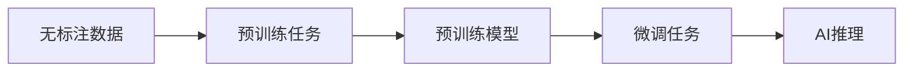

# 自监督学习提升AI推理的无标注数据利用效率研究

> 关键词：自监督学习、AI推理、无标注数据、利用效率、预训练模型

> 摘要：在人工智能领域，标注数据的获取往往成本高昂且耗时费力，而大量的无标注数据却未得到充分利用。自监督学习作为一种极具潜力的技术，为提升无标注数据的利用效率提供了有效途径。本文深入研究自监督学习如何提升AI推理中无标注数据的利用效率，从背景介绍出发，详细阐述核心概念与联系、核心算法原理、数学模型和公式，通过项目实战展示其应用，探讨实际应用场景，推荐相关工具和资源，最后总结未来发展趋势与挑战，并对常见问题进行解答，旨在为研究人员和开发者提供全面的技术参考。

## 1. 背景介绍 
### 1.1 目的和范围
随着人工智能技术的不断发展，对数据的需求也日益增长。然而，标注数据的成本限制了许多AI应用的发展。自监督学习旨在利用无标注数据自动学习数据的内在结构和特征，从而提升AI推理的性能。本研究的目的在于深入探讨自监督学习提升无标注数据利用效率的方法和机制，范围涵盖自监督学习的基本概念、算法原理、实际应用等多个方面。

### 1.2 预期读者
本文预期读者包括人工智能领域的研究人员、开发者、学生以及对自监督学习和无标注数据利用感兴趣的技术爱好者。希望通过本文的介绍，读者能够对自监督学习有更深入的理解，并掌握提升无标注数据利用效率的方法。

### 1.3 文档结构概述
本文将按照以下结构进行阐述：首先介绍自监督学习的背景和相关概念，包括目的、预期读者和文档结构概述等；接着详细讲解自监督学习的核心概念与联系，通过文本示意图和Mermaid流程图进行直观展示；然后深入探讨核心算法原理，并使用Python源代码进行详细阐述；之后介绍数学模型和公式，并通过举例说明其应用；再通过项目实战展示自监督学习在实际中的应用，包括开发环境搭建、源代码实现和代码解读等；接着探讨自监督学习的实际应用场景；推荐相关的工具和资源；最后总结未来发展趋势与挑战，对常见问题进行解答，并提供扩展阅读和参考资料。

### 1.4 术语表
#### 1.4.1 核心术语定义
- **自监督学习（Self-Supervised Learning）**：一种无需人工标注数据的学习方式，通过设计合适的预训练任务，让模型从无标注数据中自动学习特征。
- **AI推理（AI Inference）**：指在训练好的模型上对新数据进行预测和决策的过程。
- **无标注数据（Unlabeled Data）**：没有经过人工标注标签的数据，通常在现实世界中大量存在。
- **预训练模型（Pre-trained Model）**：在大规模无标注数据上进行预训练得到的模型，可用于后续的微调任务。

#### 1.4.2 相关概念解释
- **对比学习（Contrastive Learning）**：自监督学习中的一种重要方法，通过对比正样本和负样本，学习数据的特征表示。
- **生成式学习（Generative Learning）**：通过学习数据的分布，生成与原始数据相似的样本，从而学习数据的特征。

#### 1.4.3 缩略词列表
- **SSL**：Self-Supervised Learning（自监督学习）
- **MLP**：Multi-Layer Perceptron（多层感知机）

## 2. 核心概念与联系 

自监督学习的核心思想是利用无标注数据自动学习数据的内在结构和特征。其基本原理是通过设计合适的预训练任务，让模型从无标注数据中学习到有用的信息，然后将这些信息应用到后续的AI推理任务中。

### 文本示意图
自监督学习的核心概念可以用以下文本示意图表示：

无标注数据 -> 预训练任务 -> 预训练模型 -> 微调任务 -> AI推理

### Mermaid流程图


在这个流程图中，无标注数据首先被输入到预训练任务中，通过预训练任务学习到数据的特征表示，得到预训练模型。然后，预训练模型可以在有标注的微调任务中进行微调，以适应具体的AI推理任务。

## 3. 核心算法原理 & 具体操作步骤 

### 对比学习算法原理
对比学习是自监督学习中一种常用的算法，其核心思想是通过对比正样本和负样本，学习数据的特征表示。具体来说，对比学习的目标是让正样本之间的特征表示更加相似，而负样本之间的特征表示更加不同。

以下是一个简单的对比学习算法的Python实现：

```python
import torch
import torch.nn as nn
import torch.optim as optim

# 定义一个简单的特征提取器
class FeatureExtractor(nn.Module):
    def __init__(self):
        super(FeatureExtractor, self).__init__()
        self.fc1 = nn.Linear(10, 20)
        self.fc2 = nn.Linear(20, 10)

    def forward(self, x):
        x = torch.relu(self.fc1(x))
        x = self.fc2(x)
        return x

# 定义对比损失函数
class ContrastiveLoss(nn.Module):
    def __init__(self, temperature=0.1):
        super(ContrastiveLoss, self).__init__()
        self.temperature = temperature

    def forward(self, features):
        batch_size = features.shape[0]
        labels = torch.arange(batch_size).to(features.device)
        similarity_matrix = torch.matmul(features, features.T) / self.temperature
        logits = similarity_matrix - torch.max(similarity_matrix, dim=1, keepdim=True)[0]
        exp_logits = torch.exp(logits)
        log_prob = logits - torch.log(exp_logits.sum(dim=1, keepdim=True))
        mean_log_prob_pos = -log_prob.gather(1, labels.unsqueeze(1)).squeeze(1)
        loss = mean_log_prob_pos.mean()
        return loss

# 训练过程
def train_contrastive_learning():
    feature_extractor = FeatureExtractor()
    criterion = ContrastiveLoss()
    optimizer = optim.Adam(feature_extractor.parameters(), lr=0.001)

    # 生成一些随机的无标注数据
    data = torch.randn(100, 10)

    num_epochs = 10
    for epoch in range(num_epochs):
        features = feature_extractor(data)
        loss = criterion(features)
        optimizer.zero_grad()
        loss.backward()
        optimizer.step()
        print(f'Epoch {epoch+1}/{num_epochs}, Loss: {loss.item()}')

if __name__ == '__main__':
    train_contrastive_learning()
```

### 具体操作步骤
1. **数据准备**：收集大量的无标注数据。
2. **预训练任务设计**：根据数据的特点和任务需求，设计合适的预训练任务，如对比学习任务。
3. **模型定义**：定义一个特征提取器模型，用于从数据中提取特征。
4. **损失函数定义**：定义对比损失函数，用于衡量正样本和负样本之间的相似度。
5. **训练过程**：使用优化器对模型进行训练，最小化对比损失函数。
6. **微调任务**：在有标注的微调任务中，对预训练模型进行微调，以适应具体的AI推理任务。

## 4. 数学模型和公式 & 详细讲解 & 举例说明 

### 对比学习的数学模型
对比学习的目标是最大化正样本之间的相似度，同时最小化负样本之间的相似度。假设我们有一个样本 $x$，其特征表示为 $f(x)$。对于一个正样本对 $(x_i, x_j)$，其相似度可以表示为：

$$
s_{ij} = \frac{f(x_i)^T f(x_j)}{\tau}
$$

其中，$\tau$ 是温度参数。对于一个负样本对 $(x_i, x_k)$，其相似度同样可以表示为：

$$
s_{ik} = \frac{f(x_i)^T f(x_k)}{\tau}
$$

对比损失函数的目标是让正样本对的相似度尽可能高，负样本对的相似度尽可能低。常用的对比损失函数是 InfoNCE（Info Noise Contrastive Estimation）损失函数，其定义如下：

$$
L_{InfoNCE} = -\log \frac{\exp(s_{ij} / \tau)}{\sum_{k=1}^{N} \exp(s_{ik} / \tau)}
$$

其中，$N$ 是负样本的数量。

### 详细讲解
InfoNCE 损失函数的核心思想是通过对比正样本和负样本的相似度，来学习数据的特征表示。具体来说，对于一个正样本对 $(x_i, x_j)$，我们希望其相似度 $s_{ij}$ 尽可能高，而对于负样本对 $(x_i, x_k)$，我们希望其相似度 $s_{ik}$ 尽可能低。通过最小化 InfoNCE 损失函数，模型可以学习到数据的特征表示，使得正样本之间的特征表示更加相似，而负样本之间的特征表示更加不同。

### 举例说明
假设我们有一个样本 $x_i$，其特征表示为 $f(x_i) = [0.1, 0.2, 0.3]$，正样本 $x_j$ 的特征表示为 $f(x_j) = [0.15, 0.25, 0.35]$，负样本 $x_k$ 的特征表示为 $f(x_k) = [0.9, 0.8, 0.7]$。温度参数 $\tau = 0.1$。

首先，计算正样本对的相似度：

$$
s_{ij} = \frac{f(x_i)^T f(x_j)}{\tau} = \frac{0.1 \times 0.15 + 0.2 \times 0.25 + 0.3 \times 0.35}{0.1} = \frac{0.015 + 0.05 + 0.105}{0.1} = 1.7
$$

然后，计算负样本对的相似度：

$$
s_{ik} = \frac{f(x_i)^T f(x_k)}{\tau} = \frac{0.1 \times 0.9 + 0.2 \times 0.8 + 0.3 \times 0.7}{0.1} = \frac{0.09 + 0.16 + 0.21}{0.1} = 4.6
$$

假设只有一个负样本，即 $N = 1$，则 InfoNCE 损失函数为：

$$
L_{InfoNCE} = -\log \frac{\exp(1.7 / 0.1)}{\exp(1.7 / 0.1) + \exp(4.6 / 0.1)} \approx -\log \frac{244.69}{244.69 + 9.74 \times 10^{19}} \approx 46
$$

通过最小化这个损失函数，模型可以学习到更好的特征表示，使得正样本之间的相似度更高，负样本之间的相似度更低。

## 5. 项目实战：代码实际案例和详细解释说明 

### 5.1  开发环境搭建
为了实现自监督学习提升AI推理的无标注数据利用效率，我们需要搭建一个合适的开发环境。以下是具体的步骤：

1. **安装Python**：推荐使用Python 3.7及以上版本。
2. **安装深度学习框架**：本文使用PyTorch作为深度学习框架，可以通过以下命令进行安装：
```bash
pip install torch torchvision
```
3. **安装其他依赖库**：根据具体的项目需求，安装其他必要的依赖库，如`numpy`、`matplotlib`等。

### 5.2  源代码详细实现和代码解读
以下是一个基于PyTorch的自监督学习项目的完整代码示例，用于图像分类任务：

```python
import torch
import torch.nn as nn
import torch.optim as optim
import torchvision
import torchvision.transforms as transforms
from torch.utils.data import DataLoader

# 定义预训练模型
class PreTrainModel(nn.Module):
    def __init__(self):
        super(PreTrainModel, self).__init__()
        self.conv1 = nn.Conv2d(3, 16, kernel_size=3, padding=1)
        self.relu1 = nn.ReLU()
        self.pool1 = nn.MaxPool2d(2)
        self.conv2 = nn.Conv2d(16, 32, kernel_size=3, padding=1)
        self.relu2 = nn.ReLU()
        self.pool2 = nn.MaxPool2d(2)
        self.fc1 = nn.Linear(32 * 8 * 8, 128)
        self.relu3 = nn.ReLU()
        self.fc2 = nn.Linear(128, 10)

    def forward(self, x):
        x = self.pool1(self.relu1(self.conv1(x)))
        x = self.pool2(self.relu2(self.conv2(x)))
        x = x.view(-1, 32 * 8 * 8)
        x = self.relu3(self.fc1(x))
        x = self.fc2(x)
        return x

# 定义自监督学习任务（这里简单使用旋转预测任务）
class RotationTask(nn.Module):
    def __init__(self, base_model):
        super(RotationTask, self).__init__()
        self.base_model = base_model
        self.fc_rotation = nn.Linear(10, 4)

    def forward(self, x):
        features = self.base_model(x)
        rotation_pred = self.fc_rotation(features)
        return rotation_pred

# 数据预处理
transform = transforms.Compose([
    transforms.ToTensor(),
    transforms.Normalize((0.5, 0.5, 0.5), (0.5, 0.5, 0.5))
])

# 加载无标注数据（这里使用CIFAR-10数据集作为示例）
trainset = torchvision.datasets.CIFAR10(root='./data', train=True,
                                        download=True, transform=transform)
trainloader = DataLoader(trainset, batch_size=32, shuffle=True)

# 初始化模型
base_model = PreTrainModel()
rotation_model = RotationTask(base_model)

# 定义损失函数和优化器
criterion = nn.CrossEntropyLoss()
optimizer = optim.Adam(rotation_model.parameters(), lr=0.001)

# 自监督学习训练过程
num_epochs = 10
for epoch in range(num_epochs):
    running_loss = 0.0
    for i, data in enumerate(trainloader, 0):
        inputs, _ = data
        # 生成旋转标签
        rotation_labels = torch.randint(0, 4, (inputs.size(0),)).to(inputs.device)
        rotated_inputs = torch.rot90(inputs, rotation_labels, [2, 3])

        optimizer.zero_grad()
        outputs = rotation_model(rotated_inputs)
        loss = criterion(outputs, rotation_labels)
        loss.backward()
        optimizer.step()

        running_loss += loss.item()
    print(f'Epoch {epoch+1}/{num_epochs}, Loss: {running_loss / len(trainloader)}')

# 微调任务（使用有标注数据进行图像分类）
testset = torchvision.datasets.CIFAR10(root='./data', train=False,
                                       download=True, transform=transform)
testloader = DataLoader(testset, batch_size=32, shuffle=False)

# 冻结预训练模型的参数
for param in base_model.parameters():
    param.requires_grad = False

# 定义分类模型
class ClassificationModel(nn.Module):
    def __init__(self, base_model):
        super(ClassificationModel, self).__init__()
        self.base_model = base_model
        self.fc_classification = nn.Linear(10, 10)

    def forward(self, x):
        features = self.base_model(x)
        class_pred = self.fc_classification(features)
        return class_pred

classification_model = ClassificationModel(base_model)
criterion_classification = nn.CrossEntropyLoss()
optimizer_classification = optim.Adam(classification_model.parameters(), lr=0.001)

# 微调训练过程
num_epochs_finetune = 5
for epoch in range(num_epochs_finetune):
    running_loss = 0.0
    for i, data in enumerate(trainloader, 0):
        inputs, labels = data
        optimizer_classification.zero_grad()
        outputs = classification_model(inputs)
        loss = criterion_classification(outputs, labels)
        loss.backward()
        optimizer_classification.step()

        running_loss += loss.item()
    print(f'Epoch {epoch+1}/{num_epochs_finetune}, Loss: {running_loss / len(trainloader)}')

# 测试模型
correct = 0
total = 0
with torch.no_grad():
    for data in testloader:
        images, labels = data
        outputs = classification_model(images)
        _, predicted = torch.max(outputs.data, 1)
        total += labels.size(0)
        correct += (predicted == labels).sum().item()

print(f'Accuracy of the network on the 10000 test images: {100 * correct / total}%')
```

### 5.3  代码解读与分析
1. **预训练模型定义**：`PreTrainModel` 是一个简单的卷积神经网络，用于提取图像的特征。
2. **自监督学习任务定义**：`RotationTask` 是一个基于旋转预测的自监督学习任务，通过预测图像的旋转角度来学习图像的特征。
3. **数据预处理**：使用 `transforms` 对图像数据进行预处理，包括转换为张量和归一化操作。
4. **自监督学习训练过程**：在无标注数据上进行自监督学习训练，通过最小化旋转预测的损失函数来学习图像的特征。
5. **微调任务**：在有标注数据上进行微调，冻结预训练模型的参数，只训练分类层，以适应图像分类任务。
6. **测试模型**：在测试集上测试微调后的模型的准确率。

通过这个项目实战，我们可以看到自监督学习如何利用无标注数据提升AI推理的性能。

## 6. 实际应用场景 
自监督学习在许多实际应用场景中都有广泛的应用，以下是一些常见的应用场景：

### 计算机视觉
- **图像分类**：通过自监督学习，可以利用大量的无标注图像数据学习图像的特征，然后在有标注的图像数据上进行微调，提高图像分类的准确率。
- **目标检测**：自监督学习可以帮助模型学习到图像中目标的特征和上下文信息，从而提高目标检测的性能。
- **图像生成**：利用自监督学习学习到的图像特征，可以生成更加真实和多样化的图像。

### 自然语言处理
- **文本分类**：通过自监督学习，可以利用大量的无标注文本数据学习文本的语义信息，然后在有标注的文本数据上进行微调，提高文本分类的准确率。
- **机器翻译**：自监督学习可以帮助模型学习到不同语言之间的语义对应关系，从而提高机器翻译的质量。
- **问答系统**：利用自监督学习学习到的文本特征，可以更好地理解用户的问题，并给出准确的答案。

### 语音识别
- **语音特征提取**：自监督学习可以帮助模型学习到语音信号的特征，从而提高语音识别的准确率。
- **说话人识别**：通过自监督学习，可以学习到不同说话人的语音特征，从而实现说话人识别。

## 7. 工具和资源推荐
### 7.1 学习资源推荐
#### 7.1.1 书籍推荐
- 《深度学习》（Deep Learning）：由Ian Goodfellow、Yoshua Bengio和Aaron Courville所著，是深度学习领域的经典教材，涵盖了自监督学习等多个方面的内容。
- 《动手学深度学习》（Dive into Deep Learning）：由李沐等人所著，提供了丰富的深度学习实践案例，包括自监督学习的相关内容。

#### 7.1.2 在线课程
- Coursera上的《深度学习专项课程》（Deep Learning Specialization）：由Andrew Ng教授授课，系统地介绍了深度学习的各个方面，包括自监督学习。
- edX上的《麻省理工学院：深度学习基础》（MITx: 6.S191x Introduction to Deep Learning）：由麻省理工学院的教授授课，深入讲解了深度学习的原理和应用，包括自监督学习的相关内容。

#### 7.1.3 技术博客和网站
- Medium上的AI相关博客：有许多深度学习领域的专家和研究者在Medium上分享自监督学习的最新研究成果和实践经验。
- arXiv.org：是一个开放的学术预印本平台，提供了大量关于自监督学习的最新研究论文。

### 7.2 开发工具框架推荐
#### 7.2.1 IDE和编辑器
- PyCharm：是一款专门为Python开发设计的集成开发环境，提供了丰富的功能和插件，方便进行深度学习开发。
- Jupyter Notebook：是一个交互式的开发环境，适合进行深度学习的实验和调试。

#### 7.2.2 调试和性能分析工具
- TensorBoard：是TensorFlow提供的一个可视化工具，可以用于可视化模型的训练过程和性能指标。
- PyTorch Profiler：是PyTorch提供的一个性能分析工具，可以帮助开发者分析模型的性能瓶颈。

#### 7.2.3 相关框架和库
- PyTorch：是一个开源的深度学习框架，提供了丰富的深度学习模型和工具，支持自监督学习的实现。
- TensorFlow：是另一个广泛使用的深度学习框架，也提供了自监督学习的相关工具和模型。

### 7.3 相关论文著作推荐
#### 7.3.1 经典论文
- 《A Simple Framework for Contrastive Learning of Visual Representations》：提出了一种简单的对比学习框架，用于学习图像的特征表示。
- 《BERT: Pre-training of Deep Bidirectional Transformers for Language Understanding》：介绍了BERT模型，是自然语言处理领域自监督学习的经典之作。

#### 7.3.2 最新研究成果
- 关注arXiv.org上的最新研究论文，了解自监督学习领域的最新进展。

#### 7.3.3 应用案例分析
- 许多顶级学术会议（如CVPR、ICML、NeurIPS等）上的论文会分享自监督学习在实际应用中的案例和经验。

## 8. 总结：未来发展趋势与挑战
### 未来发展趋势
- **多模态自监督学习**：将自监督学习应用于多模态数据（如图像、文本、语音等），挖掘不同模态数据之间的关联和互补信息，提升AI系统的综合性能。
- **大规模预训练模型**：继续探索更大规模的预训练模型，利用更多的无标注数据进行训练，以学习到更强大的特征表示，从而在各种下游任务中取得更好的效果。
- **自监督学习与强化学习的结合**：将自监督学习与强化学习相结合，利用自监督学习学习环境的特征表示，为强化学习提供更有效的状态表示，从而提高强化学习的效率和性能。

### 挑战
- **计算资源需求**：自监督学习通常需要大量的计算资源来训练大规模的模型，这对于许多研究机构和企业来说是一个巨大的挑战。
- **预训练任务设计**：设计合适的预训练任务是自监督学习的关键，但目前还没有一种通用的方法来设计最优的预训练任务，需要根据不同的数据和任务进行探索和实验。
- **模型可解释性**：自监督学习模型通常是黑盒模型，缺乏可解释性，这在一些对安全性和可靠性要求较高的应用场景中是一个问题。

## 9. 附录：常见问题与解答
### 问题1：自监督学习和无监督学习有什么区别？
自监督学习是无监督学习的一种特殊形式。无监督学习的目标是发现数据的内在结构和模式，而自监督学习则是通过设计预训练任务，让模型从无标注数据中自动学习特征，然后将这些特征应用到后续的任务中。

### 问题2：自监督学习一定能提升AI推理的性能吗？
不一定。自监督学习的效果取决于多个因素，如预训练任务的设计、数据的质量和数量、模型的架构等。如果这些因素选择不当，自监督学习可能无法提升AI推理的性能。

### 问题3：如何选择合适的预训练任务？
选择合适的预训练任务需要考虑数据的特点和任务的需求。例如，对于图像数据，可以选择旋转预测、颜色化等预训练任务；对于文本数据，可以选择掩码语言模型、下一句预测等预训练任务。

## 10. 扩展阅读 & 参考资料
- Goodfellow, I., Bengio, Y., & Courville, A. (2016). Deep Learning. MIT Press.
- Li, M., et al. (2020). Dive into Deep Learning.
- Chen, T., et al. (2020). A Simple Framework for Contrastive Learning of Visual Representations. arXiv preprint arXiv:2002.05709.
- Devlin, J., et al. (2018). BERT: Pre-training of Deep Bidirectional Transformers for Language Understanding. arXiv preprint arXiv:1810.04805.