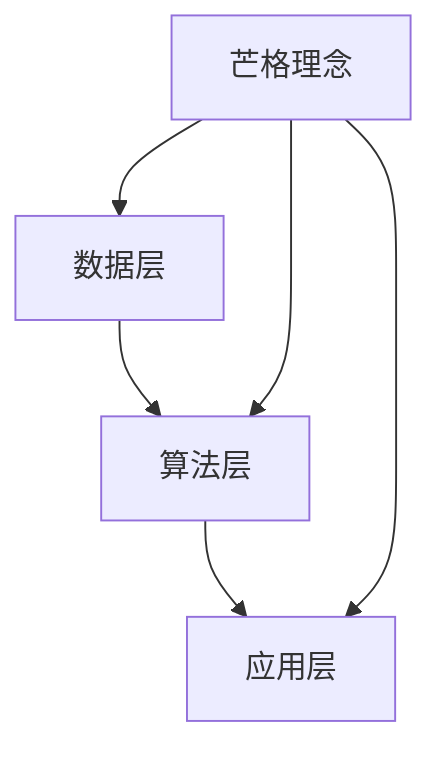

# 芒格的“别觉得自己太聪明”在人工智能伦理决策中的应用

> 关键词：芒格、人工智能、伦理决策、谦逊、智能系统

> 摘要：本文深入探讨了芒格“别觉得自己太聪明”这一理念在人工智能伦理决策中的重要应用。首先介绍了该研究的背景、目的、预期读者等内容，进而阐述人工智能伦理决策的核心概念及联系。详细讲解了相关核心算法原理与操作步骤，并借助数学模型和公式进行理论支持。通过项目实战展示了代码案例及分析，探讨了其实际应用场景。同时推荐了相关学习资源、开发工具及论文著作。最后总结了未来发展趋势与挑战，解答常见问题并提供扩展阅读和参考资料，旨在为人工智能伦理决策的研究与实践提供新的思路和方向。

## 1. 背景介绍 
### 1.1 目的和范围
本研究的主要目的在于探索芒格“别觉得自己太聪明”这一极具智慧的理念如何应用于人工智能伦理决策中。随着人工智能技术的飞速发展，其在各个领域的应用日益广泛，但也引发了诸多伦理问题。例如，自动驾驶汽车在面临道德困境时的决策、智能推荐系统对用户隐私和价值观的影响等。本研究将深入分析芒格理念在解决这些伦理问题中的作用和价值，范围涵盖人工智能伦理决策的各个方面，包括算法设计、系统开发、应用实践等。

### 1.2 预期读者
本文预期读者包括人工智能领域的研究人员、开发者、伦理学家、政策制定者以及对人工智能伦理问题感兴趣的普通读者。研究人员可以从理论层面获取新的研究视角，开发者能在实际开发中借鉴相关理念，伦理学家可从不同角度审视人工智能伦理问题，政策制定者有助于制定更合理的政策，普通读者则能增进对人工智能伦理的理解。

### 1.3 文档结构概述
本文首先介绍研究的背景信息，包括目的、预期读者和文档结构。接着阐述人工智能伦理决策的核心概念及联系，用文本示意图和 Mermaid 流程图展示。然后讲解核心算法原理和具体操作步骤，结合 Python 源代码详细说明。通过数学模型和公式对理论进行深入剖析，并举例说明。之后进行项目实战，展示代码案例并详细解读。探讨实际应用场景，推荐相关工具和资源。最后总结未来发展趋势与挑战，解答常见问题并提供扩展阅读和参考资料。

### 1.4 术语表
#### 1.4.1 核心术语定义
- **人工智能（Artificial Intelligence，AI）**：指机器模拟人类智能的能力，包括学习、推理、感知、决策等方面。
- **伦理决策（Ethical Decision - Making）**：在面临道德困境时，依据一定的伦理原则和价值观做出的决策。
- **芒格理念（Munger's Concept）**：指芒格提出的“别觉得自己太聪明”这一强调谦逊和谨慎的理念。

#### 1.4.2 相关概念解释
- **人工智能伦理（AI Ethics）**：研究人工智能技术在开发、应用过程中涉及的伦理问题，如隐私保护、公平性、责任归属等。
- **智能系统（Intelligent System）**：具备一定智能能力的系统，能够根据输入数据进行分析和决策，如智能机器人、智能推荐系统等。

#### 1.4.3 缩略词列表
- **AI**：Artificial Intelligence（人工智能）
- **ML**：Machine Learning（机器学习）
- **DL**：Deep Learning（深度学习）

## 2. 核心概念与联系 
### 2.1 核心概念原理
人工智能伦理决策是在人工智能系统的设计、开发和应用过程中，确保系统的行为和决策符合伦理原则和价值观的过程。其核心在于平衡各种利益和价值，如公平性、隐私保护、责任归属等。而芒格的“别觉得自己太聪明”理念强调人类的认知局限和谦逊态度。在人工智能伦理决策中，这一理念提醒开发者和决策者要认识到自己的知识和能力是有限的，不能过度自信地认为自己能够完全掌控人工智能系统的行为和后果。

### 2.2 架构的文本示意图
人工智能伦理决策的架构可以分为三个层次：数据层、算法层和应用层。数据层负责收集、整理和存储与人工智能系统相关的数据，这些数据是算法运行的基础。算法层包括各种机器学习和深度学习算法，用于对数据进行分析和处理，以生成决策结果。应用层则将算法层的决策结果应用到实际场景中，如自动驾驶、智能医疗等。芒格的理念贯穿于这三个层次，提醒开发者在每个层次都要保持谦逊和谨慎，充分考虑伦理因素。

### 2.3 Mermaid 流程图


该流程图展示了人工智能伦理决策的架构以及芒格理念在其中的贯穿作用。数据层是基础，为算法层提供数据支持；算法层对数据进行处理和分析，生成决策结果；应用层将决策结果应用到实际场景中。而芒格理念在每个层次都起到提醒和约束的作用，确保整个过程符合伦理原则。

## 3. 核心算法原理 & 具体操作步骤 
### 3.1 核心算法原理
在人工智能伦理决策中，一个重要的算法是基于规则的伦理决策算法。该算法通过定义一系列的伦理规则，对人工智能系统的决策进行约束和指导。例如，在自动驾驶汽车的伦理决策中，可以定义规则如“优先保护行人生命安全”“避免碰撞其他车辆”等。当自动驾驶汽车面临决策时，系统会根据这些规则进行判断和选择。

以下是一个简单的基于规则的伦理决策算法的 Python 实现：

```python
# 定义伦理规则
rules = [
    # 规则 1：优先保护行人生命安全
    lambda situation: situation["has_pedestrian"] and situation["collision_imminent"] and situation["action"] == "continue" and situation["can_stop"] == True,
    # 规则 2：避免碰撞其他车辆
    lambda situation: situation["has_other_vehicle"] and situation["collision_imminent"] and situation["action"] == "continue" and situation["can_avoid"] == True
]

def ethical_decision_making(situation):
    for rule in rules:
        if rule(situation):
            return "stop"  # 如果满足规则，返回停止动作
    return situation["action"]  # 否则返回原动作
```

### 3.2 具体操作步骤
1. **规则定义**：首先，需要根据具体的应用场景和伦理原则定义一系列的伦理规则。这些规则应该明确、具体，并且具有可操作性。
2. **情况评估**：在人工智能系统面临决策时，需要对当前的情况进行评估，获取相关的信息，如是否有行人、是否有其他车辆、是否即将发生碰撞等。
3. **规则匹配**：将评估得到的情况信息与定义的伦理规则进行匹配，检查是否有规则被满足。
4. **决策生成**：如果有规则被满足，则根据规则的要求生成相应的决策；如果没有规则被满足，则维持原决策。

## 4. 数学模型和公式 & 详细讲解 & 举例说明 
### 4.1 数学模型和公式
在人工智能伦理决策中，可以使用效用理论来建立数学模型。效用理论通过定义一个效用函数 $U(x)$ 来衡量不同决策的价值。对于每个决策 $x$，其效用值 $U(x)$ 表示该决策在伦理和实际效果方面的综合价值。

假设在一个简单的伦理决策场景中，有两个决策 $x_1$ 和 $x_2$，其效用值分别为 $U(x_1)$ 和 $U(x_2)$。则最优决策 $x^*$ 可以通过以下公式确定：

$$x^* = \arg\max_{x\in\{x_1,x_2\}} U(x)$$

### 4.2 详细讲解
效用函数 $U(x)$ 的定义需要考虑多个因素，如公平性、安全性、效率等。例如，在自动驾驶汽车的伦理决策中，效用函数可以定义为：

$$U(x) = w_1\times\text{Safety}(x)+w_2\times\text{Fairness}(x)+w_3\times\text{Efficiency}(x)$$

其中，$\text{Safety}(x)$ 表示决策 $x$ 的安全程度，$\text{Fairness}(x)$ 表示决策 $x$ 的公平程度，$\text{Efficiency}(x)$ 表示决策 $x$ 的效率。$w_1$、$w_2$ 和 $w_3$ 是权重系数，用于调整各个因素的重要性。

### 4.3 举例说明
假设在一个自动驾驶汽车的伦理决策场景中，有两个决策：$x_1$ 是继续行驶，可能会撞到一个行人；$x_2$ 是紧急刹车，可能会导致后面的车辆追尾。

- **安全程度评估**：$\text{Safety}(x_1) = 0.2$，$\text{Safety}(x_2) = 0.6$
- **公平程度评估**：$\text{Fairness}(x_1) = 0.1$，$\text{Fairness}(x_2) = 0.8$
- **效率评估**：$\text{Efficiency}(x_1) = 0.8$，$\text{Efficiency}(x_2) = 0.3$

假设权重系数 $w_1 = 0.5$，$w_2 = 0.3$，$w_3 = 0.2$。则：

$$U(x_1)=0.5\times0.2 + 0.3\times0.1+0.2\times0.8=0.27$$

$$U(x_2)=0.5\times0.6 + 0.3\times0.8+0.2\times0.3=0.6$$

由于 $U(x_2)>U(x_1)$，所以最优决策为 $x_2$，即紧急刹车。

## 5. 项目实战：代码实际案例和详细解释说明 
### 5.1  开发环境搭建
- **操作系统**：选择 Linux 或 Windows 操作系统。
- **编程语言**：使用 Python 3.x 版本。
- **开发工具**：推荐使用 PyCharm 或 Jupyter Notebook 作为开发工具。
- **相关库**：安装 numpy、pandas 等常用库，用于数据处理和分析。

### 5.2  源代码详细实现和代码解读
以下是一个简单的人工智能伦理决策项目的源代码实现：

```python
import numpy as np

# 定义伦理规则
rules = [
    # 规则 1：优先保护行人生命安全
    lambda situation: situation["has_pedestrian"] and situation["collision_imminent"] and situation["action"] == "continue" and situation["can_stop"] == True,
    # 规则 2：避免碰撞其他车辆
    lambda situation: situation["has_other_vehicle"] and situation["collision_imminent"] and situation["action"] == "continue" and situation["can_avoid"] == True
]

# 定义效用函数
def utility_function(situation, weights):
    safety = situation["safety_level"]
    fairness = situation["fairness_level"]
    efficiency = situation["efficiency_level"]
    return weights[0] * safety + weights[1] * fairness + weights[2] * efficiency

# 伦理决策函数
def ethical_decision_making(situation, weights):
    for rule in rules:
        if rule(situation):
            return "stop"  # 如果满足规则，返回停止动作
    # 计算不同决策的效用值
    actions = ["continue", "stop"]
    utilities = []
    for action in actions:
        new_situation = situation.copy()
        new_situation["action"] = action
        utilities.append(utility_function(new_situation, weights))
    # 选择效用值最大的决策
    best_action_index = np.argmax(utilities)
    return actions[best_action_index]

# 示例情况
situation = {
    "has_pedestrian": True,
    "has_other_vehicle": False,
    "collision_imminent": True,
    "can_stop": True,
    "action": "continue",
    "safety_level": 0.2,
    "fairness_level": 0.1,
    "efficiency_level": 0.8
}

# 权重系数
weights = [0.5, 0.3, 0.2]

# 进行伦理决策
decision = ethical_decision_making(situation, weights)
print("决策结果：", decision)
```

### 5.3  代码解读与分析
1. **规则定义**：定义了两个伦理规则，分别是优先保护行人生命安全和避免碰撞其他车辆。
2. **效用函数**：定义了一个效用函数 `utility_function`，用于计算不同决策的效用值。该函数考虑了安全、公平和效率三个因素。
3. **伦理决策函数**：`ethical_decision_making` 函数首先检查是否有规则被满足，如果有则返回相应的决策；否则，计算不同决策的效用值，选择效用值最大的决策。
4. **示例情况**：定义了一个示例情况，包括是否有行人、是否有其他车辆、是否即将发生碰撞等信息。
5. **权重系数**：定义了权重系数，用于调整安全、公平和效率三个因素的重要性。
6. **决策结果**：调用 `ethical_decision_making` 函数进行伦理决策，并输出决策结果。

## 6. 实际应用场景 
### 6.1 自动驾驶
在自动驾驶领域，人工智能伦理决策至关重要。例如，当自动驾驶汽车面临道德困境时，如前方突然出现行人，而紧急刹车可能会导致后面的车辆追尾，此时就需要进行伦理决策。芒格的理念提醒开发者要认识到自己无法完全预测所有可能的情况，不能过度自信地认为所设计的算法能够完美地解决所有伦理问题。因此，在设计自动驾驶汽车的伦理决策算法时，需要充分考虑各种因素，保持谦逊和谨慎。

### 6.2 智能医疗
在智能医疗领域，人工智能系统可以辅助医生进行诊断和治疗决策。例如，智能诊断系统可以根据患者的症状和检查结果给出诊断建议。然而，这些建议可能会受到数据偏差、算法局限性等因素的影响。芒格的理念提醒医生和开发者要认识到智能医疗系统的局限性，不能完全依赖系统的决策，而应该结合自己的专业知识和经验进行综合判断。

### 6.3 智能推荐系统
智能推荐系统广泛应用于电商、社交媒体等领域。然而，智能推荐系统可能会导致信息茧房、隐私泄露等伦理问题。例如，推荐系统可能会根据用户的历史行为和偏好，只推荐用户感兴趣的内容，从而限制了用户的信息获取范围。芒格的理念提醒开发者要认识到推荐系统的设计不能仅仅追求商业利益，而应该充分考虑用户的隐私和信息多样性，保持谦逊和谨慎的态度。

## 7. 工具和资源推荐
### 7.1 学习资源推荐
#### 7.1.1 书籍推荐
- 《人工智能伦理》：全面介绍了人工智能领域的伦理问题，包括隐私保护、公平性、责任归属等方面。
- 《穷查理宝典：查理·芒格的智慧箴言录》：深入阐述了芒格的投资理念和人生智慧，其中“别觉得自己太聪明”等理念对人工智能伦理决策有重要启示。

#### 7.1.2 在线课程
- Coursera 上的“人工智能伦理”课程：由知名专家授课，系统讲解了人工智能伦理的基本概念、理论和实践。
- edX 上的“机器学习与人工智能伦理”课程：结合机器学习和人工智能的实际应用，探讨了其中的伦理问题和解决方案。

#### 7.1.3 技术博客和网站
- Medium 上的人工智能伦理相关博客：许多专家和学者在 Medium 上分享了关于人工智能伦理的最新研究成果和实践经验。
- AI Ethics.org：专门介绍人工智能伦理的网站，提供了丰富的资源和案例。

### 7.2 开发工具框架推荐
#### 7.2.1 IDE和编辑器
- PyCharm：功能强大的 Python 集成开发环境，提供了代码编辑、调试、版本控制等功能。
- Jupyter Notebook：交互式的开发环境，适合进行数据探索和模型开发。

#### 7.2.2 调试和性能分析工具
- Py-Spy：用于分析 Python 程序的性能，找出性能瓶颈。
- PDB：Python 自带的调试工具，方便进行代码调试。

#### 7.2.3 相关框架和库
- TensorFlow：开源的机器学习框架，广泛应用于深度学习领域。
- PyTorch：另一个流行的深度学习框架，具有简洁易用的特点。

### 7.3 相关论文著作推荐
#### 7.3.1 经典论文
- “The Moral Machine Experiment”：通过大规模的在线实验，探讨了人们对自动驾驶汽车伦理决策的看法。
- “Ethics of Artificial Intelligence and Robotics”：全面综述了人工智能和机器人领域的伦理问题。

#### 7.3.2 最新研究成果
- 关注顶级学术会议如 NeurIPS、ICML 等上关于人工智能伦理的最新研究成果。
- 阅读相关学术期刊如 Journal of Artificial Intelligence Research 上的论文。

#### 7.3.3 应用案例分析
- 分析一些实际的人工智能应用案例，如谷歌的图像识别系统、亚马逊的智能助手等，探讨其中的伦理问题和解决方案。

## 8. 总结：未来发展趋势与挑战
### 8.1 未来发展趋势
- **伦理标准的统一化**：随着人工智能技术的广泛应用，不同国家和地区将逐渐达成共识，制定统一的人工智能伦理标准。
- **伦理决策的自动化**：未来的人工智能系统将具备更强的伦理决策能力，能够自动识别和处理伦理问题。
- **人机协作的伦理优化**：在人机协作的场景中，将更加注重伦理因素的优化，提高人机协作的效率和质量。

### 8.2 挑战
- **伦理观念的多样性**：不同文化、不同群体的伦理观念存在差异，如何在人工智能伦理决策中兼顾这些差异是一个挑战。
- **技术的复杂性**：人工智能技术不断发展，其算法和模型越来越复杂，如何确保这些技术符合伦理原则是一个难题。
- **责任归属的界定**：当人工智能系统做出不道德的决策时，如何界定责任归属是一个亟待解决的问题。

## 9. 附录：常见问题与解答
### 9.1 芒格的理念如何具体应用到人工智能伦理决策中？
芒格的“别觉得自己太聪明”理念提醒开发者和决策者要认识到自己的认知局限和人工智能系统的复杂性。在具体应用中，可以通过以下方式：
- 在算法设计阶段，充分考虑各种可能的情况，避免过度简化问题。
- 在系统开发过程中，进行充分的测试和验证，及时发现和纠正潜在的伦理问题。
- 在应用实践中，保持谦逊和谨慎的态度，不断反思和改进决策过程。

### 9.2 如何平衡人工智能伦理决策中的各种利益和价值？
可以使用效用理论来平衡各种利益和价值。通过定义一个效用函数，将不同的利益和价值量化，并根据权重系数调整其重要性。在实际决策中，选择效用值最大的决策。

### 9.3 人工智能伦理决策的责任应该由谁来承担？
人工智能伦理决策的责任归属是一个复杂的问题，需要综合考虑多个因素。一般来说，开发者、使用者和系统所有者都可能承担一定的责任。开发者应该确保系统的设计和开发符合伦理原则，使用者应该正确使用系统，系统所有者应该对系统的运行和管理负责。

## 10. 扩展阅读 & 参考资料
### 10.1 扩展阅读
- 《人类简史：从动物到上帝》：探讨了人类的进化和发展，对理解人工智能的伦理问题有一定的启示。
- 《未来简史：从智人到神人》：展望了未来人类和人工智能的发展趋势，引发对人工智能伦理的深入思考。

### 10.2 参考资料
- 相关学术论文和研究报告，如 IEEE 关于人工智能伦理的标准和指南。
- 政府发布的政策文件，如欧盟的《通用数据保护条例》（GDPR）。