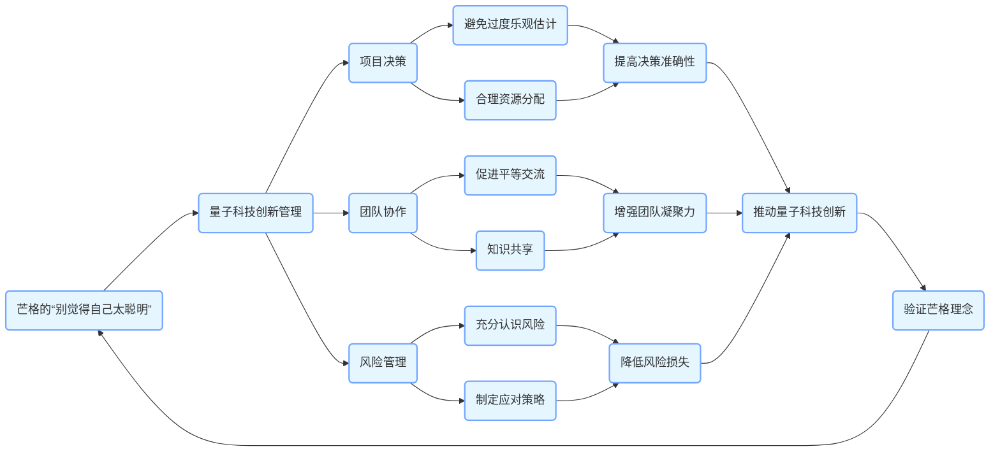

# 芒格的“别觉得自己太聪明”在量子科技创新管理中的应用

> 关键词：芒格、别觉得自己太聪明、量子科技、创新管理、谦逊态度

> 摘要：本文探讨了芒格提出的“别觉得自己太聪明”这一理念在量子科技创新管理中的应用。通过对背景的介绍，明确了研究的目的、范围和预期读者等内容。详细阐述了核心概念及其联系，包括芒格理念的内涵和量子科技创新管理的特点。深入分析了核心算法原理，以相关操作步骤和 Python 代码示例说明。借助数学模型和公式进一步阐释其内在逻辑，并举例说明。通过项目实战案例展示了如何在实际中运用该理念进行管理。探讨了其实际应用场景，推荐了相关的工具和资源。最后总结了未来发展趋势与挑战，解答了常见问题并提供扩展阅读和参考资料，旨在为量子科技创新管理提供新的思路和方法。

## 1. 背景介绍 
### 1.1 目的和范围
在当今科技飞速发展的时代，量子科技作为具有重大战略意义的前沿领域，正吸引着全球范围内的关注和投入。然而，量子科技创新管理面临着诸多独特的挑战，如技术的高度复杂性、不确定性以及长周期的研发过程等。芒格的“别觉得自己太聪明”这一理念蕴含着谦逊、务实和对未知的敬畏，将其应用于量子科技创新管理具有重要的现实意义。本文的目的在于深入探讨这一理念如何在量子科技创新管理的各个环节发挥作用，包括项目决策、团队协作、风险管理等。范围涵盖了量子科技的基础研究、应用开发以及产业化推广等不同阶段的创新管理活动。

### 1.2 预期读者
本文的预期读者主要包括量子科技领域的科研人员、科技创新管理者、科技企业的高管以及对量子科技和创新管理感兴趣的学者和爱好者。对于科研人员来说，了解这一理念有助于在研究过程中保持清醒的头脑，避免盲目自信；科技创新管理者可以借鉴其中的管理思路，优化项目管理流程；科技企业高管能够将其融入企业战略规划，提升企业的创新能力和竞争力；学者和爱好者则可以通过本文加深对量子科技创新管理的理解。

### 1.3 文档结构概述
本文将按照以下结构进行阐述：首先介绍背景信息，明确研究的目的、范围、预期读者和文档结构。接着详细讲解核心概念与联系，包括芒格理念和量子科技创新管理的核心概念，以及它们之间的内在联系，并通过文本示意图和 Mermaid 流程图进行直观展示。然后深入分析核心算法原理，结合 Python 代码给出具体操作步骤。之后利用数学模型和公式进一步阐释其原理，并举例说明。通过项目实战案例，详细介绍开发环境搭建、源代码实现和代码解读。探讨其实际应用场景，推荐相关的工具和资源。最后总结未来发展趋势与挑战，解答常见问题并提供扩展阅读和参考资料。

### 1.4 术语表
#### 1.4.1 核心术语定义
- **芒格的“别觉得自己太聪明”**：这一理念强调在面对复杂问题和未知领域时，要保持谦逊的态度，认识到自己知识和能力的局限性，避免过度自信导致的错误决策。
- **量子科技**：基于量子力学原理发展起来的一系列前沿技术，包括量子计算、量子通信、量子传感等，具有巨大的应用潜力和战略价值。
- **创新管理**：对创新活动进行规划、组织、协调和控制的过程，旨在提高创新效率和成功率，实现创新目标。

#### 1.4.2 相关概念解释
- **量子比特**：量子计算中的基本信息单位，与经典比特不同，它可以同时处于 0 和 1 的叠加态，这使得量子计算机具有强大的并行计算能力。
- **量子纠缠**：量子力学中的一种特殊现象，两个或多个量子系统之间存在一种非经典的关联，即使它们相隔很远，一个系统的状态变化也会瞬间影响另一个系统的状态。

#### 1.4.3 缩略词列表
- **QC**：Quantum Computing，量子计算
- **QCIT**：Quantum Communication and Information Technology，量子通信与信息技术

## 2. 核心概念与联系 

### 核心概念原理
#### 芒格的“别觉得自己太聪明”原理
芒格的这一理念源于他对人性和决策过程的深刻洞察。人类在认知过程中往往存在过度自信的倾向，容易高估自己的知识和能力，从而做出不理性的决策。在面对复杂问题时，这种过度自信可能导致忽视重要信息、低估风险，最终导致决策失误。保持谦逊的态度，认识到自己的局限性，能够促使我们更加谨慎地分析问题，充分考虑各种可能性，从而做出更明智的决策。

#### 量子科技创新管理原理
量子科技创新管理是一个复杂的系统工程，需要综合考虑技术、人才、资金、市场等多个因素。量子科技的高度复杂性和不确定性决定了创新管理需要采用灵活、动态的方法。在项目决策阶段，需要充分评估技术风险和市场前景；在研发过程中，需要组织跨学科的团队进行协作，解决技术难题；在产业化推广阶段，需要与市场需求紧密结合，确保创新成果能够实现商业价值。

### 架构的文本示意图
```plaintext
芒格理念（别觉得自己太聪明）
|
|-- 影响量子科技创新管理的各个环节
|   |
|   |-- 项目决策：避免过度乐观估计技术成熟度和市场前景
|   |
|   |-- 团队协作：促进成员之间的平等交流和知识共享
|   |
|   |-- 风险管理：充分认识技术风险和不确定性
|
|-- 与量子科技创新管理相互促进
|   |
|   |-- 量子科技创新管理的实践验证芒格理念的正确性
|   |
|   |-- 芒格理念为量子科技创新管理提供指导原则
```

### Mermaid 流程图


从流程图可以看出，芒格的理念对量子科技创新管理的各个关键环节产生影响，通过在项目决策、团队协作和风险管理中发挥作用，最终推动量子科技创新。而量子科技创新的实践又反过来验证了芒格理念的正确性，形成了一个良性循环。

## 3. 核心算法原理 & 具体操作步骤 

### 核心算法原理
在量子科技创新管理中应用芒格的“别觉得自己太聪明”理念，可以将其转化为一种决策算法。该算法的核心思想是在决策过程中引入谦逊因子，对决策者的主观判断进行修正，以减少过度自信带来的偏差。

具体来说，假设决策者对某个项目的成功概率有一个主观估计 $P_{subjective}$，同时考虑到项目的不确定性和自身知识的局限性，引入谦逊因子 $\alpha$（$0 < \alpha < 1$）。修正后的成功概率 $P_{corrected}$ 可以通过以下公式计算：

$P_{corrected} = \alpha \times P_{subjective}$

谦逊因子 $\alpha$ 的取值需要根据项目的具体情况进行调整。对于技术难度大、不确定性高的量子科技项目，$\alpha$ 的值应该相对较小，以充分考虑风险；对于相对成熟的技术领域，$\alpha$ 的值可以适当增大。

### 具体操作步骤

#### 步骤 1：确定主观估计
决策者根据自己的经验和知识，对量子科技项目的成功概率进行主观估计 $P_{subjective}$。例如，在评估一个量子计算算法的研发项目时，决策者可能认为该项目有 70% 的成功概率，即 $P_{subjective} = 0.7$。

#### 步骤 2：确定谦逊因子
根据项目的技术难度、不确定性、市场竞争等因素，确定谦逊因子 $\alpha$ 的值。对于一个处于早期研究阶段的量子通信项目，由于技术风险较大，不确定性高，可以将 $\alpha$ 设定为 0.3。

#### 步骤 3：计算修正后的成功概率
使用上述公式计算修正后的成功概率 $P_{corrected}$。在上述例子中，$P_{corrected} = 0.3 \times 0.7 = 0.21$。

#### 步骤 4：决策评估
根据修正后的成功概率 $P_{corrected}$ 进行决策评估。如果 $P_{corrected}$ 低于某个预先设定的阈值（例如 0.2），则需要重新评估项目的可行性，或者调整项目策略；如果 $P_{corrected}$ 高于阈值，则可以继续推进项目。

### Python 代码实现
```python
def correct_success_probability(subjective_probability, humility_factor):
    """
    计算修正后的成功概率
    :param subjective_probability: 主观估计的成功概率
    :param humility_factor: 谦逊因子
    :return: 修正后的成功概率
    """
    if 0 <= subjective_probability <= 1 and 0 < humility_factor < 1:
        return humility_factor * subjective_probability
    else:
        print("输入的概率或谦逊因子不合法，请检查。")
        return None

# 示例
subjective_probability = 0.7
humility_factor = 0.3
corrected_probability = correct_success_probability(subjective_probability, humility_factor)
if corrected_probability is not None:
    print(f"修正后的成功概率为: {corrected_probability}")
```

在上述代码中，定义了一个函数 `correct_success_probability` 来计算修正后的成功概率。函数接受主观估计的成功概率和谦逊因子作为输入，返回修正后的成功概率。如果输入的概率或谦逊因子不合法，函数会输出错误信息并返回 `None`。通过调用该函数，我们可以方便地进行成功概率的修正计算。

## 4. 数学模型和公式 & 详细讲解 & 举例说明 

### 数学模型和公式
#### 决策风险评估模型
在量子科技创新管理中，除了考虑项目的成功概率，还需要评估决策的风险。我们可以建立一个决策风险评估模型，结合修正后的成功概率和潜在损失来计算决策风险。

设 $P_{corrected}$ 为修正后的成功概率，$L$ 为项目失败时的潜在损失，$R$ 为决策风险。则决策风险可以通过以下公式计算：

$R = (1 - P_{corrected}) \times L$

#### 资源分配模型
在多个量子科技项目之间进行资源分配时，可以根据项目的修正成功概率和预期收益来确定资源分配比例。设 $n$ 个项目的修正成功概率分别为 $P_{corrected}^1, P_{corrected}^2, \cdots, P_{corrected}^n$，预期收益分别为 $E^1, E^2, \cdots, E^n$，第 $i$ 个项目的资源分配比例为 $r^i$。则资源分配比例可以通过以下公式计算：

$r^i = \frac{P_{corrected}^i \times E^i}{\sum_{j = 1}^{n} P_{corrected}^j \times E^j}$

### 详细讲解
#### 决策风险评估模型讲解
该模型的核心思想是，决策风险与项目失败的概率和潜在损失成正比。修正后的成功概率 $P_{corrected}$ 反映了考虑谦逊因素后的项目成功可能性，$1 - P_{corrected}$ 则表示项目失败的概率。潜在损失 $L$ 可以包括研发成本、机会成本、声誉损失等。通过计算 $R$，可以直观地了解决策所面临的风险大小，从而在决策过程中更加谨慎。

#### 资源分配模型讲解
资源分配模型的目的是在多个项目之间合理分配资源，以实现整体收益的最大化。修正成功概率 $P_{corrected}^i$ 考虑了项目的风险因素，预期收益 $E^i$ 反映了项目的潜在价值。通过计算每个项目的 $P_{corrected}^i \times E^i$ 并进行归一化处理，得到资源分配比例 $r^i$。这样可以确保资源向成功概率高、预期收益大的项目倾斜。

### 举例说明
#### 决策风险评估模型举例
假设一个量子传感技术研发项目，决策者主观估计的成功概率为 0.8，根据项目的不确定性，确定谦逊因子为 0.4。则修正后的成功概率为 $P_{corrected} = 0.4 \times 0.8 = 0.32$。如果项目失败，潜在损失为 100 万元。则决策风险为：

$R = (1 - 0.32) \times 100 = 68$（万元）

这意味着该决策面临着 68 万元的风险，决策者需要谨慎考虑是否继续推进该项目。

#### 资源分配模型举例
假设有三个量子科技项目，相关数据如下表所示：

| 项目编号 | 修正成功概率 $P_{corrected}^i$ | 预期收益 $E^i$（万元） |
| ---- | ---- | ---- |
| 1 | 0.2 | 500 |
| 2 | 0.3 | 800 |
| 3 | 0.4 | 600 |

首先计算每个项目的 $P_{corrected}^i \times E^i$：

项目 1：$0.2 \times 500 = 100$

项目 2：$0.3 \times 800 = 240$

项目 3：$0.4 \times 600 = 240$

然后计算总和：$\sum_{j = 1}^{3} P_{corrected}^j \times E^j = 100 + 240 + 240 = 580$

最后计算资源分配比例：

项目 1：$r^1 = \frac{100}{580} \approx 0.172$

项目 2：$r^2 = \frac{240}{580} \approx 0.414$

项目 3：$r^3 = \frac{240}{580} \approx 0.414$

因此，在资源分配时，项目 1 应分配约 17.2% 的资源，项目 2 和项目 3 各分配约 41.4% 的资源。

## 5. 项目实战：代码实际案例和详细解释说明 

### 5.1  开发环境搭建
#### 操作系统
选择适合开发的操作系统，如 Ubuntu 20.04 或 Windows 10。Ubuntu 具有良好的开源软件支持和稳定性，适合进行科学计算和开发；Windows 10 则具有广泛的用户基础和丰富的开发工具。

#### 编程语言和版本
使用 Python 3.8 及以上版本。Python 是一种功能强大、易于学习的编程语言，拥有丰富的科学计算库和机器学习库，非常适合用于量子科技创新管理的算法实现和数据分析。

#### 开发工具
推荐使用 PyCharm 作为集成开发环境（IDE）。PyCharm 提供了强大的代码编辑、调试和项目管理功能，能够提高开发效率。同时，也可以使用 Jupyter Notebook 进行代码的交互式开发和数据可视化。

#### 安装必要的库
在开发过程中，需要安装一些必要的 Python 库，如 `numpy`、`pandas`、`matplotlib` 等。可以使用 `pip` 命令进行安装：
```sh
pip install numpy pandas matplotlib
```

### 5.2  源代码详细实现和代码解读
#### 项目背景
假设我们要管理一个量子科技项目组合，包括多个不同类型的量子项目。我们需要根据每个项目的主观成功概率、谦逊因子、预期收益和潜在损失，计算修正后的成功概率、决策风险和资源分配比例。

#### 源代码实现
```python
import numpy as np
import pandas as pd
import matplotlib.pyplot as plt

def correct_success_probability(subjective_probability, humility_factor):
    """
    计算修正后的成功概率
    :param subjective_probability: 主观估计的成功概率
    :param humility_factor: 谦逊因子
    :return: 修正后的成功概率
    """
    if 0 <= subjective_probability <= 1 and 0 < humility_factor < 1:
        return humility_factor * subjective_probability
    else:
        print("输入的概率或谦逊因子不合法，请检查。")
        return None

def calculate_decision_risk(corrected_probability, potential_loss):
    """
    计算决策风险
    :param corrected_probability: 修正后的成功概率
    :param potential_loss: 潜在损失
    :return: 决策风险
    """
    return (1 - corrected_probability) * potential_loss

def resource_allocation(corrected_probabilities, expected_returns):
    """
    计算资源分配比例
    :param corrected_probabilities: 修正后的成功概率列表
    :param expected_returns: 预期收益列表
    :return: 资源分配比例列表
    """
    weighted_returns = np.array(corrected_probabilities) * np.array(expected_returns)
    total_weighted_return = np.sum(weighted_returns)
    if total_weighted_return == 0:
        print("总加权收益为零，无法进行资源分配。")
        return None
    allocation_ratios = weighted_returns / total_weighted_return
    return allocation_ratios

# 示例数据
projects = [
    {"name": "项目1", "subjective_probability": 0.7, "humility_factor": 0.3, "expected_return": 500, "potential_loss": 200},
    {"name": "项目2", "subjective_probability": 0.8, "humility_factor": 0.4, "expected_return": 800, "potential_loss": 300},
    {"name": "项目3", "subjective_probability": 0.6, "humility_factor": 0.2, "expected_return": 600, "potential_loss": 250}
]

# 计算修正后的成功概率、决策风险和资源分配比例
corrected_probabilities = []
decision_risks = []
expected_returns = []
for project in projects:
    subjective_probability = project["subjective_probability"]
    humility_factor = project["humility_factor"]
    corrected_probability = correct_success_probability(subjective_probability, humility_factor)
    if corrected_probability is not None:
        corrected_probabilities.append(corrected_probability)
        potential_loss = project["potential_loss"]
        decision_risk = calculate_decision_risk(corrected_probability, potential_loss)
        decision_risks.append(decision_risk)
        expected_return = project["expected_return"]
        expected_returns.append(expected_return)

# 计算资源分配比例
allocation_ratios = resource_allocation(corrected_probabilities, expected_returns)

# 输出结果
results = pd.DataFrame({
    "项目名称": [project["name"] for project in projects],
    "修正后成功概率": corrected_probabilities,
    "决策风险": decision_risks,
    "资源分配比例": allocation_ratios
})
print(results)

# 可视化资源分配比例
plt.bar(results["项目名称"], results["资源分配比例"])
plt.xlabel("项目名称")
plt.ylabel("资源分配比例")
plt.title("量子科技项目资源分配比例")
plt.show()
```

#### 代码解读
1. **函数定义**：
    - `correct_success_probability` 函数：根据主观成功概率和谦逊因子计算修正后的成功概率。
    - `calculate_decision_risk` 函数：根据修正后的成功概率和潜在损失计算决策风险。
    - `resource_allocation` 函数：根据修正后的成功概率和预期收益计算资源分配比例。

2. **数据准备**：
    定义了一个包含多个项目信息的列表 `projects`，每个项目包含主观成功概率、谦逊因子、预期收益和潜在损失。

3. **计算过程**：
    遍历每个项目，调用相应的函数计算修正后的成功概率、决策风险和资源分配比例，并将结果存储在列表中。

4. **结果输出**：
    使用 `pandas` 库将结果存储在 DataFrame 中，并打印输出。同时，使用 `matplotlib` 库绘制资源分配比例的柱状图，直观展示各个项目的资源分配情况。

### 5.3  代码解读与分析
#### 代码优势
- **模块化设计**：将不同的计算功能封装在独立的函数中，提高了代码的可读性和可维护性。
- **数据处理和可视化**：使用 `pandas` 和 `matplotlib` 库进行数据处理和可视化，方便对结果进行分析和展示。
- **错误处理**：在函数中添加了输入验证和错误处理代码，提高了代码的健壮性。

#### 代码局限性
- **数据来源单一**：示例代码中的数据是手动输入的，在实际应用中，需要从数据库或其他数据源获取数据。
- **模型简化**：所使用的数学模型是简化的，实际的量子科技创新管理可能需要更复杂的模型和算法。

#### 改进方向
- **数据接口**：开发数据接口，实现从数据库或其他数据源自动获取项目信息。
- **模型优化**：引入更复杂的数学模型和算法，考虑更多的因素，如技术发展趋势、市场竞争等。

## 6. 实际应用场景 
### 项目决策阶段
在量子科技项目的立项决策中，应用芒格的“别觉得自己太聪明”理念可以避免过度乐观的估计。例如，在评估一个新型量子计算芯片的研发项目时，研发团队可能因为对自身技术实力的自信，高估项目的成功概率和研发进度。通过引入谦逊因子，对主观估计进行修正，可以更准确地评估项目的可行性和风险。如果修正后的成功概率较低，决策层可以决定推迟项目、调整研发策略或寻找合作伙伴共同承担风险。

### 团队协作过程
在量子科技团队中，成员往往具有较高的专业知识和技能，但也容易产生自负情绪。芒格的理念可以促进团队成员之间的平等交流和知识共享。例如，在讨论量子算法优化方案时，每个成员都应该认识到自己的观点可能存在局限性，尊重他人的意见和建议。通过这种方式，可以避免团队内部的“一言堂”现象，激发团队的创新活力，提高问题解决的效率。

### 风险管理方面
量子科技项目面临着诸多不确定性和风险，如技术难题、市场变化、政策法规等。应用该理念可以帮助管理者充分认识到这些风险的存在，并采取相应的措施进行管理。例如，在制定风险管理策略时，管理者应该避免低估技术风险，对可能出现的技术瓶颈进行充分的预估和准备。同时，要密切关注市场动态和政策法规的变化，及时调整项目策略，降低风险损失。

### 技术创新与突破
在量子科技的研究和创新过程中，保持谦逊的态度有助于科研人员不断探索未知领域。当遇到技术难题时，科研人员不会轻易认为自己已经掌握了所有的解决方案，而是会积极寻求外部的帮助和合作。例如，在量子通信技术的研究中，科研团队可能会与其他领域的专家进行交流，借鉴他们的经验和方法，从而推动技术的创新和突破。

## 7. 工具和资源推荐
### 7.1 学习资源推荐
#### 7.1.1 书籍推荐
- 《穷查理宝典：查理·芒格的智慧箴言录》：这本书全面介绍了芒格的投资理念、思维方式和人生智慧，对于理解“别觉得自己太聪明”这一理念的内涵和应用具有重要的参考价值。
- 《量子计算与量子信息》：由 Michael A. Nielsen 和 Isaac L. Chuang 所著，是量子计算领域的经典教材，涵盖了量子比特、量子门、量子算法等基础知识，适合初学者和专业人士深入学习。
- 《创新管理：赢得竞争优势》：本书系统地介绍了创新管理的理论和方法，结合实际案例分析了如何在不同行业中进行创新管理，对于量子科技创新管理具有重要的指导意义。

#### 7.1.2 在线课程
- Coursera 上的“Quantum Computing for Everyone”：这门课程由澳大利亚新南威尔士大学的教授授课，面向非专业人士介绍量子计算的基本概念和应用，课程内容生动有趣，易于理解。
- edX 上的“Quantum Mechanics and Quantum Information Science”：该课程深入讲解了量子力学的基本原理和量子信息科学的前沿知识，适合有一定物理基础的学习者。
- 中国大学 MOOC 上的“创新管理与创业”：课程由国内知名高校的教授授课，结合中国的实际情况，介绍了创新管理的理论和实践，对于量子科技创新管理具有一定的借鉴作用。

#### 7.1.3 技术博客和网站
- Quantum Computing Report：这是一个专注于量子计算领域的新闻和分析网站，提供了最新的量子科技研究进展、行业动态和市场趋势等信息。
- IEEE Quantum Computing Initiative：IEEE 的量子计算倡议网站，汇集了全球量子计算领域的专家和学者，发布了大量的研究论文、技术报告和会议信息。
- 36氪：该网站不仅关注科技行业的最新动态，还经常发布关于量子科技的深度报道和分析文章，对于了解量子科技的商业应用和市场前景具有一定的帮助。

### 7.2 开发工具框架推荐
#### 7.2.1 IDE和编辑器
- PyCharm：前面已经介绍过，它是一款功能强大的 Python 集成开发环境，支持代码调试、代码分析、版本控制等功能，能够提高开发效率。
- Visual Studio Code：一款轻量级的代码编辑器，具有丰富的插件生态系统，支持多种编程语言。对于量子科技创新管理中的数据分析和算法实现，Visual Studio Code 也是一个不错的选择。

#### 7.2.2 调试和性能分析工具
- Py-Spy：这是一个用于 Python 代码性能分析的工具，可以实时监测 Python 程序的 CPU 使用情况和函数调用时间，帮助开发者找出代码中的性能瓶颈。
- PDB：Python 自带的调试器，可以在代码中设置断点，逐行执行代码，查看变量的值和程序的执行流程，方便调试代码。

#### 7.2.3 相关框架和库
- Qiskit：IBM 开发的开源量子计算框架，提供了量子电路设计、模拟和执行的工具，支持多种量子硬件平台，是量子计算领域最常用的开发框架之一。
- PennyLane：一个跨平台的量子机器学习库，支持多种量子计算后端，如 Qiskit、Cirq 等，方便开发者将量子计算与机器学习相结合。
- NumPy 和 SciPy：Python 中常用的科学计算库，提供了丰富的数学函数和数据结构，对于量子科技创新管理中的数据分析和算法实现具有重要的作用。

### 7.3 相关论文著作推荐
#### 7.3.1 经典论文
- “Quantum Computing in the NISQ era and beyond”：该论文由 John Preskill 发表，首次提出了“NISQ（Noisy Intermediate-Scale Quantum）”的概念，对量子计算的发展阶段和面临的挑战进行了深入分析。
- “A scheme for efficient quantum computation with linear optics”：由 E. Knill、R. Laflamme 和 G. J. Milburn 发表，提出了一种基于线性光学的量子计算方案，为量子光学计算领域的发展奠定了基础。

#### 7.3.2 最新研究成果
- 关注 Nature、Science、Physical Review Letters 等顶级学术期刊，这些期刊经常发表量子科技领域的最新研究成果，包括量子计算算法的改进、量子通信技术的突破等。
- 参加国际量子计算会议（QIP）、量子信息处理会议（QCrypt）等学术会议，会议上会展示最新的研究进展和创新成果。

#### 7.3.3 应用案例分析
- 研究 Google、IBM、Microsoft 等科技巨头在量子科技领域的应用案例，了解他们在量子计算、量子通信等方面的实践经验和商业应用模式。
- 分析国内量子科技企业的发展案例，如国盾量子在量子通信领域的产业化推广经验，对于推动量子科技创新管理具有重要的借鉴意义。

## 8. 总结：未来发展趋势与挑战
### 未来发展趋势
#### 技术融合趋势
未来，量子科技将与人工智能、大数据、物联网等技术深度融合。例如，量子计算可以为人工智能提供更强大的计算能力，加速机器学习算法的训练过程；量子通信可以为物联网提供更安全的通信保障。这种技术融合将催生更多的创新应用和商业模式，推动科技产业的升级和转型。

#### 产业化加速趋势
随着量子技术的不断发展和成熟，量子科技的产业化进程将加速。越来越多的企业将进入量子科技领域，开展相关产品和服务的研发和推广。例如，量子计算芯片、量子传感器、量子加密设备等产品将逐渐走向市场，为金融、医疗、能源等行业带来新的变革。

#### 国际合作加强趋势
量子科技是一个全球性的前沿领域，需要各国之间加强合作和交流。未来，国际间的量子科技合作将更加频繁，包括联合研发项目、学术交流活动、人才培养合作等。通过国际合作，可以共享资源、优势互补，加速量子科技的发展进程。

### 挑战
#### 技术难题挑战
量子科技目前仍面临着诸多技术难题，如量子比特的稳定性、量子纠错技术、量子系统的可扩展性等。解决这些技术难题需要大量的科研投入和时间，是量子科技创新管理面临的首要挑战。

#### 人才短缺挑战
量子科技是一个高度专业化的领域，需要具备深厚的物理学、数学和计算机科学知识的专业人才。目前，全球范围内量子科技领域的专业人才短缺，这制约了量子科技的发展。如何吸引和培养更多的量子科技人才，是量子科技创新管理需要解决的重要问题。

#### 市场应用挑战
虽然量子科技具有巨大的应用潜力，但目前市场对量子科技产品和服务的认知度和接受度还较低。如何将量子科技的创新成果转化为市场需求，实现商业价值，是量子科技创新管理面临的市场挑战。

### 应对策略
#### 加强技术研发投入
政府和企业应加大对量子科技研发的投入，支持科研机构开展基础研究和关键技术攻关。同时，鼓励企业与高校、科研机构合作，建立产学研合作机制，加速技术创新和成果转化。

#### 培养和引进人才
加强量子科技领域的人才培养，在高校开设相关专业和课程，培养一批高素质的专业人才。同时，积极引进国外优秀的量子科技人才，提高国内量子科技领域的整体水平。

#### 拓展市场应用
加强对量子科技市场的培育和引导，提高市场对量子科技产品和服务的认知度和接受度。通过举办技术研讨会、产品展示会等活动，宣传量子科技的优势和应用前景。同时，与金融、医疗、能源等行业合作，开展试点应用项目，积累市场经验，推动量子科技的产业化发展。

## 9. 附录：常见问题与解答
### 问题 1：芒格的“别觉得自己太聪明”理念与量子科技创新管理有什么直接联系？
答：这一理念强调在面对复杂问题和未知领域时要保持谦逊。量子科技创新管理面临着技术高度复杂、不确定性大等特点，管理者和科研人员容易过度自信。应用这一理念可以避免在项目决策、团队协作和风险管理等环节中因过度自信而导致的错误决策，使决策更加科学合理。

### 问题 2：在实际应用中，如何确定谦逊因子的值？
答：谦逊因子的值需要根据项目的具体情况进行调整。一般来说，对于技术难度大、不确定性高的量子科技项目，谦逊因子的值应该相对较小，例如在 0.2 - 0.4 之间；对于相对成熟的技术领域，谦逊因子的值可以适当增大，例如在 0.4 - 0.6 之间。可以结合历史数据、专家意见和项目的实际情况来综合确定谦逊因子的值。

### 问题 3：量子科技创新管理中应用这一理念会降低团队的积极性吗？
答：不会。保持谦逊并不意味着否定团队的能力和成就，而是让团队成员更加客观地认识自己和项目。在这种理念的引导下，团队成员会更加注重知识的学习和交流，积极寻求外部的帮助和合作。同时，通过合理的决策和风险管理，项目的成功率会提高，这反而会增强团队的信心和积极性。

### 问题 4：如何衡量量子科技创新管理中应用这一理念的效果？
答：可以从多个方面来衡量效果。在项目决策方面，可以通过比较应用理念前后项目的成功率和风险损失来评估；在团队协作方面，可以通过团队成员之间的沟通效率、知识共享程度和创新成果数量来评估；在市场应用方面，可以通过产品的市场占有率、客户满意度和商业价值来评估。

## 10. 扩展阅读 & 参考资料
### 扩展阅读
- 《从 0 到 1：开启商业与未来的秘密》：作者 Peter Thiel 探讨了创新的本质和方法，对于理解量子科技创新的思维方式具有一定的启发作用。
- 《创新者的窘境》：Clayton M. Christensen 所著，分析了创新者在面对新技术和市场变化时所面临的挑战和困境，对于量子科技创新管理具有重要的借鉴意义。

### 参考资料
- 查理·芒格的公开演讲和访谈记录。
- 量子科技领域的学术论文和研究报告，如 IEEE 量子计算相关论文、Nature 和 Science 杂志上的量子科技文章。
- 相关企业的年报和技术白皮书，如 IBM、Google 等公司在量子科技方面的报告。