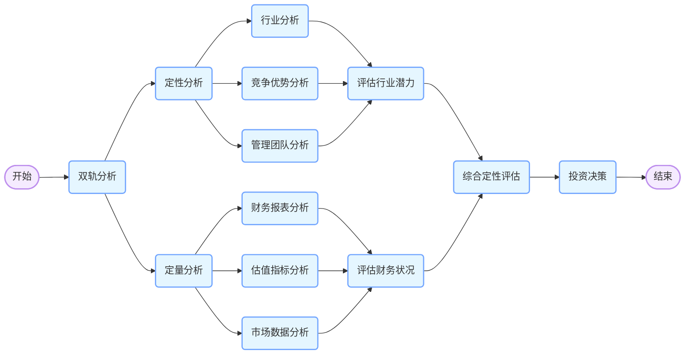

# 芒格的"双轨分析"：结合定性和定量的投资方法

> 关键词：芒格、双轨分析、定性投资、定量投资、投资方法

> 摘要：本文深入探讨了芒格提出的“双轨分析”投资方法，这一方法将定性分析与定量分析相结合，为投资者提供了更全面、科学的投资决策思路。文章详细介绍了“双轨分析”的背景，包括其目的、预期读者等。阐述了核心概念及联系，给出了相应的原理和架构示意图与流程图。对核心算法原理进行了讲解，并使用 Python 代码示例。分析了相关的数学模型和公式，还通过项目实战展示了如何在实际中应用该方法。此外，探讨了其实际应用场景，推荐了相关的学习资源、开发工具框架和论文著作。最后总结了未来发展趋势与挑战，并解答了常见问题，提供了扩展阅读和参考资料。

## 1. 背景介绍 
### 1.1 目的和范围
芒格的“双轨分析”投资方法旨在为投资者提供一种更为全面、系统的投资决策框架。传统的投资分析方法往往侧重于单一维度，要么过于依赖定量数据，如财务报表分析、估值模型等；要么过于强调定性因素，如企业的竞争优势、管理团队素质等。而“双轨分析”将两者有机结合，使投资者能够更准确地评估投资标的的价值和风险。

本文的范围涵盖了“双轨分析”的理论基础、核心概念、算法原理、数学模型，以及在实际投资项目中的应用案例。通过详细的讲解和分析，帮助读者深入理解这一投资方法，并学会在实际投资中运用。

### 1.2 预期读者
本文的预期读者主要包括以下几类人群：
1. **个人投资者**：希望提升投资决策能力，学习科学的投资方法，以实现资产的保值增值。
2. **专业投资人士**：如基金经理、投资顾问等，希望从芒格的“双轨分析”中获取新的思路和方法，优化现有的投资策略。
3. **金融专业学生**：作为学习投资学的补充资料，加深对投资分析方法的理解和掌握。
4. **对投资领域感兴趣的爱好者**：了解投资领域的前沿思想和方法，拓宽知识面。

### 1.3 文档结构概述
本文将按照以下结构进行组织：
1. **背景介绍**：阐述“双轨分析”的目的、预期读者和文档结构概述，以及相关术语的定义。
2. **核心概念与联系**：介绍“双轨分析”的核心概念，包括定性分析和定量分析的原理和架构，并给出相应的示意图和流程图。
3. **核心算法原理 & 具体操作步骤**：讲解“双轨分析”中涉及的核心算法原理，并使用 Python 代码详细阐述具体的操作步骤。
4. **数学模型和公式 & 详细讲解 & 举例说明**：分析“双轨分析”中使用的数学模型和公式，并通过具体例子进行说明。
5. **项目实战：代码实际案例和详细解释说明**：通过实际投资项目案例，展示如何运用“双轨分析”方法进行投资决策，包括开发环境搭建、源代码实现和代码解读。
6. **实际应用场景**：探讨“双轨分析”在不同投资场景中的应用，如股票投资、债券投资、基金投资等。
7. **工具和资源推荐**：推荐相关的学习资源、开发工具框架和论文著作，帮助读者进一步深入学习和研究。
8. **总结：未来发展趋势与挑战**：总结“双轨分析”的优点和局限性，分析其未来发展趋势和面临的挑战。
9. **附录：常见问题与解答**：解答读者在学习和应用“双轨分析”过程中常见的问题。
10. **扩展阅读 & 参考资料**：提供相关的扩展阅读资料和参考书目，方便读者进一步深入研究。

### 1.4 术语表
#### 1.4.1 核心术语定义
1. **双轨分析**：指同时运用定性分析和定量分析两种方法对投资标的进行评估和决策的投资分析方法。
2. **定性分析**：基于对企业的行业地位、竞争优势、管理团队、企业文化等非量化因素的分析，评估企业的长期发展潜力和投资价值。
3. **定量分析**：通过对企业的财务报表、估值指标、市场数据等量化信息的分析，评估企业的当前财务状况和估值水平。
4. **投资标的**：投资者进行投资的对象，如股票、债券、基金、房地产等。
5. **估值模型**：用于评估投资标的价值的数学模型，如市盈率模型、市净率模型、现金流折现模型等。

#### 1.4.2 相关概念解释
1. **竞争优势**：企业相对于竞争对手在产品、技术、成本、品牌等方面所具有的优势，能够使其在市场竞争中获得更高的利润和市场份额。
2. **管理团队**：负责企业日常运营和决策的核心人员，其素质和能力对企业的发展至关重要。
3. **财务报表**：反映企业财务状况和经营成果的文件，主要包括资产负债表、利润表和现金流量表。
4. **市盈率（P/E）**：股票价格与每股盈利的比率，用于衡量股票的估值水平。
5. **市净率（P/B）**：股票价格与每股净资产的比率，用于衡量股票的估值水平。

#### 1.4.3 缩略词列表
1. **P/E**：市盈率（Price-to-Earnings Ratio）
2. **P/B**：市净率（Price-to-Book Ratio）
3. **DCF**：现金流折现模型（Discounted Cash Flow Model）

## 2. 核心概念与联系 

### 2.1 定性分析原理
定性分析主要关注投资标的的非量化因素，通过对企业的行业地位、竞争优势、管理团队、企业文化等方面的分析，评估企业的长期发展潜力和投资价值。其原理基于以下几个方面：
1. **行业分析**：不同行业的发展前景和竞争格局差异很大。通过分析行业的市场规模、增长率、竞争程度、技术趋势等因素，判断行业的发展潜力。例如，新兴行业如人工智能、新能源汽车等通常具有较高的增长潜力，但也面临较高的竞争和技术风险；而传统行业如食品饮料、医药等则相对稳定，但增长速度可能较慢。
2. **竞争优势分析**：企业的竞争优势是其在市场竞争中获得持续盈利的关键。常见的竞争优势包括成本优势、技术优势、品牌优势、渠道优势等。例如，沃尔玛通过高效的供应链管理和大规模采购获得了成本优势，苹果公司通过强大的技术研发和品牌影响力获得了竞争优势。
3. **管理团队分析**：管理团队的素质和能力对企业的发展至关重要。一个优秀的管理团队能够制定合理的战略规划，有效地组织和管理企业资源，应对各种挑战和机遇。例如，巴菲特非常看重企业管理团队的诚信、能力和责任心。
4. **企业文化分析**：企业文化是企业的灵魂和价值观，它影响着企业的决策、员工的行为和企业的长期发展。一个积极向上、注重创新和客户服务的企业文化有助于企业吸引优秀人才，提高员工的工作积极性和创造力，从而提升企业的竞争力。

### 2.2 定量分析原理
定量分析主要通过对企业的财务报表、估值指标、市场数据等量化信息的分析，评估企业的当前财务状况和估值水平。其原理基于以下几个方面：
1. **财务报表分析**：财务报表是企业财务状况和经营成果的重要反映。通过对资产负债表、利润表和现金流量表的分析，可以了解企业的资产结构、负债水平、盈利能力、现金流状况等。例如，通过分析利润表中的营业收入、净利润等指标，可以了解企业的盈利能力；通过分析资产负债表中的资产负债率、流动比率等指标，可以了解企业的偿债能力。
2. **估值指标分析**：估值指标是评估投资标的价值的重要工具。常见的估值指标包括市盈率、市净率、市销率等。例如，市盈率反映了市场对企业盈利的预期，市净率反映了市场对企业净资产的估值。通过比较不同企业的估值指标，可以判断投资标的的估值水平是否合理。
3. **市场数据分析**：市场数据如股票价格、成交量、波动率等反映了市场对投资标的的预期和情绪。通过分析市场数据，可以了解市场的供求关系、投资者的情绪和市场趋势。例如，当股票价格持续上涨，成交量放大时，可能表明市场对该股票的预期较好；当股票价格持续下跌，成交量萎缩时，可能表明市场对该股票的预期较差。

### 2.3 定性分析与定量分析的联系
定性分析和定量分析是相辅相成的关系，它们共同构成了“双轨分析”的核心。定性分析为定量分析提供了方向和背景，帮助投资者确定投资标的的长期发展潜力和竞争优势；定量分析则为定性分析提供了数据支持和验证，帮助投资者评估投资标的的当前财务状况和估值水平。

例如，在选择投资标的时，首先通过定性分析筛选出具有良好发展前景、竞争优势和管理团队的企业；然后通过定量分析对这些企业的财务状况和估值水平进行评估，选择估值合理的企业进行投资。在投资过程中，也需要不断地进行定性分析和定量分析，根据企业的发展变化和市场情况调整投资策略。

### 2.4 核心概念原理和架构的文本示意图
```plaintext
                双轨分析
               /          \
         定性分析         定量分析
        /    |    \       /    |    \
 行业分析 竞争优势 管理团队 财务报表 估值指标 市场数据
```

### 2.5 Mermaid 流程图


## 3. 核心算法原理 & 具体操作步骤 

### 3.1 核心算法原理
“双轨分析”并没有严格意义上的固定算法，它是一种综合的投资分析方法。但在定量分析部分，常用到一些估值模型和数据分析方法，下面以现金流折现模型（DCF）为例进行讲解。

现金流折现模型的基本原理是将企业未来的现金流量按照一定的折现率折现到当前时刻，从而得到企业的内在价值。其公式为：

$$V = \sum_{t=1}^{n} \frac{CF_t}{(1 + r)^t}$$

其中，$V$ 表示企业的内在价值，$CF_t$ 表示第 $t$ 期的现金流量，$r$ 表示折现率，$n$ 表示预测期数。

### 3.2 具体操作步骤
#### 3.2.1 定性分析步骤
1. **行业研究**：收集行业的相关信息，包括市场规模、增长率、竞争格局、技术趋势等。可以通过行业报告、新闻资讯、专业数据库等渠道获取信息。
2. **企业竞争优势分析**：分析企业在产品、技术、成本、品牌、渠道等方面的竞争优势。可以通过与竞争对手进行比较，以及对企业的历史业绩和市场表现进行分析。
3. **管理团队评估**：了解管理团队的背景、经验、能力和业绩。可以通过查阅企业的年报、新闻报道、管理层访谈等方式获取信息。
4. **企业文化考察**：了解企业的价值观、经营理念、员工满意度等。可以通过与企业员工交流、查阅企业的内部资料等方式获取信息。

#### 3.2.2 定量分析步骤
1. **财务报表分析**：收集企业的财务报表，包括资产负债表、利润表和现金流量表。对财务报表进行分析，计算各种财务指标，如盈利能力指标（毛利率、净利率等）、偿债能力指标（资产负债率、流动比率等）、营运能力指标（存货周转率、应收账款周转率等）。
2. **估值指标计算**：根据财务报表数据，计算各种估值指标，如市盈率、市净率、市销率等。可以通过与同行业其他企业进行比较，判断企业的估值水平是否合理。
3. **现金流预测**：根据企业的历史业绩和发展前景，预测企业未来的现金流量。可以采用线性回归、时间序列分析等方法进行预测。
4. **折现率确定**：确定合适的折现率，通常可以采用资本资产定价模型（CAPM）来计算。资本资产定价模型的公式为：

$$r = R_f + \beta (R_m - R_f)$$

其中，$r$ 表示折现率，$R_f$ 表示无风险利率，$\beta$ 表示企业的贝塔系数，$R_m$ 表示市场收益率。

5. **内在价值计算**：将预测的现金流量按照确定的折现率折现到当前时刻，计算企业的内在价值。

### 3.3 Python 代码实现
```python
import numpy as np

# 定义现金流折现模型函数
def dcf(cash_flows, discount_rate):
    """
    计算现金流折现模型的内在价值
    :param cash_flows: 未来各期的现金流量列表
    :param discount_rate: 折现率
    :return: 企业的内在价值
    """
    n = len(cash_flows)
    discounted_cash_flows = []
    for t in range(n):
        discounted_cash_flow = cash_flows[t] / ((1 + discount_rate) ** (t + 1))
        discounted_cash_flows.append(discounted_cash_flow)
    intrinsic_value = np.sum(discounted_cash_flows)
    return intrinsic_value

# 示例数据
cash_flows = [100, 120, 150, 180, 200]  # 未来 5 年的现金流量
discount_rate = 0.1  # 折现率为 10%

# 计算内在价值
intrinsic_value = dcf(cash_flows, discount_rate)
print(f"企业的内在价值为: {intrinsic_value}")
```

### 3.4 代码解释
1. **函数定义**：定义了一个名为 `dcf` 的函数，用于计算现金流折现模型的内在价值。该函数接受两个参数：`cash_flows` 表示未来各期的现金流量列表，`discount_rate` 表示折现率。
2. **计算折现现金流**：在函数内部，使用循环遍历未来各期的现金流量，将每期的现金流量按照折现率折现到当前时刻，并将折现后的现金流量存储在 `discounted_cash_flows` 列表中。
3. **计算内在价值**：使用 `np.sum` 函数对 `discounted_cash_flows` 列表中的元素进行求和，得到企业的内在价值。
4. **示例数据和计算**：定义了示例数据 `cash_flows` 和 `discount_rate`，调用 `dcf` 函数计算企业的内在价值，并将结果打印输出。

## 4. 数学模型和公式 & 详细讲解 & 举例说明 

### 4.1 现金流折现模型（DCF）
#### 4.1.1 公式
$$V = \sum_{t=1}^{n} \frac{CF_t}{(1 + r)^t}$$

其中，$V$ 表示企业的内在价值，$CF_t$ 表示第 $t$ 期的现金流量，$r$ 表示折现率，$n$ 表示预测期数。

#### 4.1.2 详细讲解
现金流折现模型的核心思想是将企业未来的现金流量折现到当前时刻，以反映货币的时间价值。未来的现金流量是不确定的，因此需要进行预测。折现率反映了投资者对未来现金流量的风险预期，风险越高，折现率越高。预测期数通常根据企业的发展阶段和行业特点来确定。

#### 4.1.3 举例说明
假设一家企业未来 5 年的现金流量分别为 100 万元、120 万元、150 万元、180 万元和 200 万元，折现率为 10%。则该企业的内在价值计算如下：

$$
\begin{align*}
V &= \frac{100}{(1 + 0.1)^1} + \frac{120}{(1 + 0.1)^2} + \frac{150}{(1 + 0.1)^3} + \frac{180}{(1 + 0.1)^4} + \frac{200}{(1 + 0.1)^5}\\
&= \frac{100}{1.1} + \frac{120}{1.21} + \frac{150}{1.331} + \frac{180}{1.4641} + \frac{200}{1.61051}\\
&\approx 90.91 + 99.17 + 112.69 + 122.94 + 124.18\\
&= 549.89
\end{align*}
$$

因此，该企业的内在价值约为 549.89 万元。

### 4.2 资本资产定价模型（CAPM）
#### 4.2.1 公式
$$r = R_f + \beta (R_m - R_f)$$

其中，$r$ 表示折现率，$R_f$ 表示无风险利率，$\beta$ 表示企业的贝塔系数，$R_m$ 表示市场收益率。

#### 4.2.2 详细讲解
资本资产定价模型用于计算投资者要求的必要收益率，即折现率。无风险利率通常采用国债收益率来表示，它反映了投资者在无风险情况下的收益率。贝塔系数反映了企业股票的系统性风险，即与市场整体波动的相关性。市场收益率反映了市场整体的平均收益率。

#### 4.2.3 举例说明
假设无风险利率为 3%，市场收益率为 10%，某企业的贝塔系数为 1.2。则该企业的折现率计算如下：

$$r = 3\% + 1.2\times(10\% - 3\%) = 3\% + 8.4\% = 11.4\%$$

因此，该企业的折现率为 11.4%。

### 4.3 市盈率模型
#### 4.3.1 公式
$$P = E\times P/E$$

其中，$P$ 表示股票价格，$E$ 表示每股盈利，$P/E$ 表示市盈率。

#### 4.3.2 详细讲解
市盈率模型是一种简单的估值模型，它通过将每股盈利乘以市盈率来计算股票价格。市盈率反映了市场对企业盈利的预期，不同行业和企业的市盈率可能存在较大差异。

#### 4.3.3 举例说明
假设某企业的每股盈利为 2 元，行业平均市盈率为 15 倍。则该企业的股票价格计算如下：

$$P = 2\times15 = 30$$

因此，该企业的股票价格为 30 元。

## 5. 项目实战：代码实际案例和详细解释说明 

### 5.1 开发环境搭建
#### 5.1.1 安装 Python
首先需要安装 Python 编程语言，建议安装 Python 3.7 及以上版本。可以从 Python 官方网站（https://www.python.org/downloads/）下载安装包，按照安装向导进行安装。

#### 5.1.2 安装必要的库
在 Python 中，进行数据分析和计算通常需要使用一些第三方库，如 `numpy`、`pandas`、`matplotlib` 等。可以使用 `pip` 命令进行安装：

```sh
pip install numpy pandas matplotlib
```

### 5.2 源代码详细实现和代码解读
```python
import numpy as np
import pandas as pd
import matplotlib.pyplot as plt

# 模拟企业未来 10 年的现金流量数据
years = np.arange(1, 11)
cash_flows = np.random.randint(100, 200, size=10)

# 假设折现率为 10%
discount_rate = 0.1

# 计算折现现金流
discounted_cash_flows = []
for t in range(len(years)):
    discounted_cash_flow = cash_flows[t] / ((1 + discount_rate) ** (t + 1))
    discounted_cash_flows.append(discounted_cash_flow)

# 计算企业的内在价值
intrinsic_value = np.sum(discounted_cash_flows)

# 打印结果
print(f"未来 10 年的现金流量: {cash_flows}")
print(f"折现现金流: {discounted_cash_flows}")
print(f"企业的内在价值: {intrinsic_value}")

# 绘制现金流量和折现现金流的图表
plt.figure(figsize=(10, 6))
plt.plot(years, cash_flows, label='现金流量')
plt.plot(years, discounted_cash_flows, label='折现现金流')
plt.xlabel('年份')
plt.ylabel('金额')
plt.title('现金流量和折现现金流')
plt.legend()
plt.grid(True)
plt.show()
```

### 5.3 代码解读与分析
#### 5.3.1 数据生成
```python
years = np.arange(1, 11)
cash_flows = np.random.randint(100, 200, size=10)
```
使用 `np.arange` 函数生成 1 到 10 的年份序列，使用 `np.random.randint` 函数生成 10 个 100 到 200 之间的随机整数作为未来 10 年的现金流量数据。

#### 5.3.2 折现现金流计算
```python
discount_rate = 0.1
discounted_cash_flows = []
for t in range(len(years)):
    discounted_cash_flow = cash_flows[t] / ((1 + discount_rate) ** (t + 1))
    discounted_cash_flows.append(discounted_cash_flow)
```
假设折现率为 10%，使用循环遍历未来各年的现金流量，将每期的现金流量按照折现率折现到当前时刻，并将折现后的现金流量存储在 `discounted_cash_flows` 列表中。

#### 5.3.3 内在价值计算
```python
intrinsic_value = np.sum(discounted_cash_flows)
```
使用 `np.sum` 函数对 `discounted_cash_flows` 列表中的元素进行求和，得到企业的内在价值。

#### 5.3.4 结果打印
```python
print(f"未来 10 年的现金流量: {cash_flows}")
print(f"折现现金流: {discounted_cash_flows}")
print(f"企业的内在价值: {intrinsic_value}")
```
将未来 10 年的现金流量、折现现金流和企业的内在价值打印输出。

#### 5.3.5 图表绘制
```python
plt.figure(figsize=(10, 6))
plt.plot(years, cash_flows, label='现金流量')
plt.plot(years, discounted_cash_flows, label='折现现金流')
plt.xlabel('年份')
plt.ylabel('金额')
plt.title('现金流量和折现现金流')
plt.legend()
plt.grid(True)
plt.show()
```
使用 `matplotlib` 库绘制现金流量和折现现金流的折线图，直观地展示两者的变化趋势。

## 6. 实际应用场景 

### 6.1 股票投资
在股票投资中，“双轨分析”可以帮助投资者全面评估上市公司的投资价值。通过定性分析，投资者可以了解公司的行业地位、竞争优势、管理团队等因素，判断公司的长期发展潜力；通过定量分析，投资者可以评估公司的财务状况、估值水平等，选择估值合理的股票进行投资。例如，巴菲特在投资可口可乐公司时，不仅关注了可口可乐的品牌优势、市场份额等定性因素，还对其财务报表进行了深入分析，计算了公司的内在价值，最终做出了投资决策。

### 6.2 债券投资
在债券投资中，“双轨分析”同样具有重要意义。定性分析方面，投资者需要了解债券发行主体的信用状况、行业前景、经营稳定性等因素，评估债券的违约风险；定量分析方面，投资者需要计算债券的收益率、久期、凸性等指标，评估债券的投资价值和风险。例如，投资者在选择企业债券时，需要对企业的财务状况、信用评级等进行分析，同时计算债券的收益率，以确定是否值得投资。

### 6.3 基金投资
在基金投资中，“双轨分析”可以帮助投资者选择合适的基金产品。定性分析方面，投资者需要了解基金的投资策略、管理团队、业绩表现等因素，评估基金的投资风格和管理能力；定量分析方面，投资者需要计算基金的夏普比率、信息比率、跟踪误差等指标，评估基金的风险调整后收益和业绩稳定性。例如，投资者在选择股票型基金时，需要对基金的持仓结构、行业配置等进行分析，同时计算基金的业绩指标，以选择表现优秀的基金。

### 6.4 房地产投资
在房地产投资中，“双轨分析”也可以发挥重要作用。定性分析方面，投资者需要了解房地产项目的地理位置、周边配套设施、市场需求等因素，评估房地产的投资潜力；定量分析方面，投资者需要计算房地产的租金收益率、房价增长率、投资回报率等指标，评估房地产的投资价值和收益水平。例如，投资者在选择商业地产时，需要对商业地产的客流量、租金水平等进行分析，同时计算投资回报率，以确定是否值得投资。

## 7. 工具和资源推荐
### 7.1 学习资源推荐
#### 7.1.1 书籍推荐
1. 《穷查理宝典：查理·芒格的智慧箴言录》：本书收录了查理·芒格的演讲、文章和语录，全面介绍了他的投资理念和生活智慧，是学习“双轨分析”方法的必读之书。
2. 《聪明的投资者》：本杰明·格雷厄姆的经典著作，被誉为投资界的“圣经”。本书介绍了价值投资的基本原理和方法，对“双轨分析”中的定量分析具有重要的指导意义。
3. 《竞争优势：透视企业护城河》：本书详细介绍了企业竞争优势的来源和评估方法，对“双轨分析”中的定性分析具有重要的参考价值。

#### 7.1.2 在线课程
1. Coursera 平台上的“投资学”课程：由知名大学的教授授课，系统介绍了投资学的基本理论和方法，包括资产定价、投资组合管理、金融市场等内容。
2. edX 平台上的“价值投资基础”课程：该课程专注于价值投资的理念和方法，通过实际案例分析，帮助学员掌握如何进行基本面分析和估值。
3. 网易云课堂上的“巴菲特投资智慧”课程：该课程深入解读了巴菲特的投资理念和方法，包括“双轨分析”的应用，对投资者具有很大的启发。

#### 7.1.3 技术博客和网站
1. 雪球网：国内知名的投资社区，提供股票、基金、债券等投资品种的资讯、分析和交流平台。投资者可以在雪球网上学习其他投资者的经验和观点，了解市场动态。
2. 东方财富网：提供全面的金融资讯和数据服务，包括股票行情、财务报表、行业分析等内容。投资者可以通过东方财富网获取投资所需的各种数据和信息。
3. Seeking Alpha：国外知名的投资博客网站，汇聚了众多投资专家和分析师的文章和观点。投资者可以在 Seeking Alpha 上了解国际市场的投资动态和分析报告。

### 7.2 开发工具框架推荐
#### 7.2.1 IDE和编辑器
1. PyCharm：一款专业的 Python 集成开发环境，具有强大的代码编辑、调试、版本控制等功能，适合开发复杂的数据分析和投资相关的 Python 程序。
2. Jupyter Notebook：一种交互式的开发环境，支持 Python、R 等多种编程语言。Jupyter Notebook 可以将代码、文本、图表等内容集成在一个文档中，方便进行数据分析和可视化展示。
3. Visual Studio Code：一款轻量级的代码编辑器，支持多种编程语言和插件扩展。Visual Studio Code 具有丰富的代码编辑和调试功能，适合快速开发和测试 Python 代码。

#### 7.2.2 调试和性能分析工具
1. pdb：Python 内置的调试工具，可以帮助开发者在代码中设置断点、单步执行、查看变量值等，方便调试代码。
2. cProfile：Python 内置的性能分析工具，可以统计代码中各个函数的执行时间和调用次数，帮助开发者找出代码中的性能瓶颈。
3. Py-Spy：一款跨平台的 Python 性能分析工具，可以实时监控 Python 程序的性能，生成火焰图等可视化报告，帮助开发者优化代码性能。

#### 7.2.3 相关框架和库
1. NumPy：Python 中用于科学计算的基础库，提供了高效的多维数组对象和各种数学函数，是进行数据分析和数值计算的必备工具。
2. Pandas：Python 中用于数据处理和分析的库，提供了 DataFrame 和 Series 等数据结构，方便进行数据的读取、清洗、转换和分析。
3. Matplotlib：Python 中用于数据可视化的库，提供了各种绘图函数和工具，能够绘制折线图、柱状图、散点图等多种类型的图表，帮助开发者直观地展示数据。

### 7.3 相关论文著作推荐
#### 7.3.1 经典论文
1. “The Capital Asset Pricing Model: Theory and Evidence”（资本资产定价模型：理论与实证）：该论文对资本资产定价模型进行了深入的理论分析和实证研究，是投资领域的经典论文之一。
2. “Efficient Capital Markets: A Review of Theory and Empirical Work”（有效资本市场：理论与实证研究综述）：该论文对有效市场假说进行了系统的阐述和总结，对理解市场效率和投资策略具有重要意义。
3. “The Intelligent Investor”（《聪明的投资者》论文版）：本杰明·格雷厄姆在论文中详细阐述了价值投资的理念和方法，对“双轨分析”中的定量分析具有重要的指导作用。

#### 7.3.2 最新研究成果
1. 近年来，随着人工智能和机器学习技术的发展，一些研究将这些技术应用于投资分析中，提出了基于大数据和机器学习的投资策略。例如，通过分析社交媒体数据、新闻资讯等非结构化数据，预测股票价格走势。
2. 关于企业竞争优势的研究也在不断深入，一些学者提出了新的竞争优势评估方法和模型，为“双轨分析”中的定性分析提供了新的思路和方法。

#### 7.3.3 应用案例分析
1. 一些金融机构和投资公司会发布投资案例分析报告，介绍他们在实际投资中运用“双轨分析”方法的经验和成果。这些案例分析可以帮助投资者更好地理解和应用“双轨分析”方法。
2. 一些学术期刊和研究机构也会发表关于投资案例分析的论文，对不同行业和企业的投资决策进行深入分析，为投资者提供参考。

## 8. 总结：未来发展趋势与挑战
### 8.1 未来发展趋势
#### 8.1.1 与科技融合
随着人工智能、大数据、区块链等技术的不断发展，“双轨分析”方法将与这些技术深度融合。例如，利用人工智能算法对大量的财务数据、新闻资讯、社交媒体数据等进行分析，挖掘潜在的投资机会；利用区块链技术确保数据的真实性和安全性，提高投资决策的准确性和可靠性。

#### 8.1.2 多元化应用
“双轨分析”方法将不仅仅局限于传统的股票、债券、基金等投资领域，还将应用于新兴的投资领域，如数字货币、人工智能企业投资、绿色能源投资等。随着投资领域的不断拓展，“双轨分析”方法将不断适应新的投资需求，为投资者提供更全面、科学的投资决策支持。

#### 8.1.3 个性化投资
未来，投资者的需求将更加个性化。“双轨分析”方法将结合投资者的风险偏好、投资目标、投资期限等因素，为投资者提供个性化的投资建议和方案。例如，根据投资者的年龄、收入、资产状况等因素，制定适合其个人情况的投资组合。

### 8.2 挑战
#### 8.2.1 数据质量和可靠性
“双轨分析”方法依赖于大量的数据进行分析和决策。然而，数据的质量和可靠性往往存在问题，如数据不准确、不完整、过时等。这些问题可能会导致投资决策的失误。因此，如何获取高质量、可靠的数据，并对数据进行有效的清洗和预处理，是“双轨分析”方法面临的一个重要挑战。

#### 8.2.2 复杂的市场环境
金融市场是一个复杂的系统，受到多种因素的影响，如宏观经济环境、政策法规、地缘政治等。这些因素的变化具有不确定性和复杂性，增加了投资分析和决策的难度。如何准确地把握市场动态，及时调整投资策略，是“双轨分析”方法需要面对的挑战之一。

#### 8.2.3 人才短缺
“双轨分析”方法需要具备综合知识和技能的人才，包括投资学、经济学、统计学、计算机科学等方面的知识。然而，目前市场上这类复合型人才相对短缺。如何培养和吸引更多的专业人才，提高投资分析和决策的水平，是“双轨分析”方法发展面临的一个重要问题。

## 9. 附录：常见问题与解答
### 9.1 定性分析和定量分析哪个更重要？
定性分析和定量分析都非常重要，它们是相辅相成的关系。定性分析为定量分析提供了方向和背景，帮助投资者确定投资标的的长期发展潜力和竞争优势；定量分析则为定性分析提供了数据支持和验证，帮助投资者评估投资标的的当前财务状况和估值水平。在实际投资中，需要将两者结合起来，综合考虑各种因素，做出科学的投资决策。

### 9.2 如何确定合适的折现率？
确定合适的折现率是现金流折现模型中的关键步骤。通常可以采用资本资产定价模型（CAPM）来计算折现率。资本资产定价模型的公式为 $r = R_f + \beta (R_m - R_f)$，其中 $R_f$ 表示无风险利率，$\beta$ 表示企业的贝塔系数，$R_m$ 表示市场收益率。无风险利率通常采用国债收益率来表示，贝塔系数可以通过历史数据进行估算，市场收益率可以参考市场指数的平均收益率。此外，还可以根据企业的风险特征和投资者的风险偏好进行适当调整。

### 9.3 “双轨分析”方法适用于所有投资领域吗？
“双轨分析”方法具有广泛的适用性，但并不是适用于所有投资领域。对于一些缺乏明确财务数据和业绩指标的投资领域，如早期创业投资、艺术品投资等，定量分析的难度较大，定性分析可能更为重要。而对于一些成熟的投资领域，如股票、债券、基金等，“双轨分析”方法可以发挥更好的作用，帮助投资者全面评估投资标的的价值和风险。

### 9.4 如何提高“双轨分析”的准确性？
要提高“双轨分析”的准确性，需要从以下几个方面入手：
1. **提高数据质量**：确保获取的数据准确、完整、及时，并对数据进行有效的清洗和预处理。
2. **深入研究和分析**：对投资标的的行业、企业、财务等方面进行深入研究和分析，了解其内在价值和发展趋势。
3. **结合多种方法和工具**：除了定性分析和定量分析外，还可以结合其他分析方法和工具，如技术分析、情景分析等，提高分析的全面性和准确性。
4. **不断学习和实践**：投资是一个不断学习和实践的过程，需要不断积累经验，提高自己的分析能力和决策水平。

## 10. 扩展阅读 & 参考资料
### 10.1 扩展阅读
1. 《投资最重要的事》：霍华德·马克斯的著作，介绍了投资中的重要原则和方法，对“双轨分析”方法的应用具有一定的启示。
2. 《金融炼金术》：乔治·索罗斯的著作，提出了反身性理论，对理解金融市场的复杂性和不确定性具有重要意义。
3. 《行为金融学》：研究投资者行为和心理对金融市场的影响，有助于投资者更好地理解市场波动和投资决策中的非理性因素。

### 10.2 参考资料
1. 《穷查理宝典：查理·芒格的智慧箴言录》，彼得·考夫曼编著，李继宏译，中信出版社。
2. 《聪明的投资者》，本杰明·格雷厄姆著，王中华、黄一义译，人民邮电出版社。
3. 《竞争优势：透视企业护城河》，帕特·多尔西著，司福连、刘静译，机械工业出版社。
4. “The Capital Asset Pricing Model: Theory and Evidence”，作者：Fischer Black, Michael C. Jensen, Myron S. Scholes，发表于《Journal of Business》。
5. “Efficient Capital Markets: A Review of Theory and Empirical Work”，作者：Eugene F. Fama，发表于《The Journal of Finance》。
6. “The Intelligent Investor”，本杰明·格雷厄姆著，原载于《Financial Analysts Journal》。