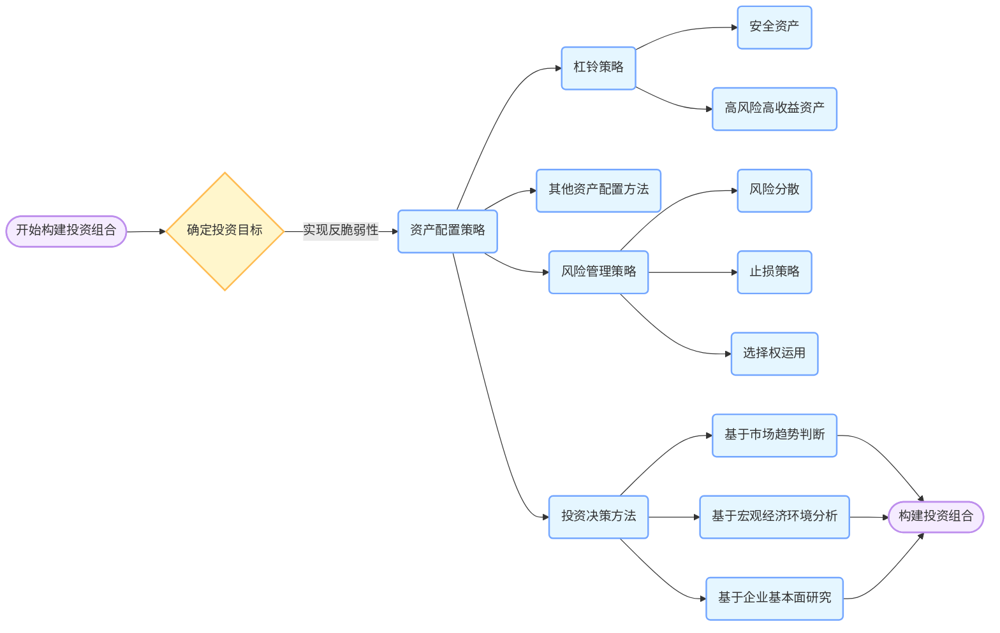

# 芒格的"反脆弱"概念在投资组合构建中的应用

> 关键词：芒格、反脆弱、投资组合构建、风险应对、投资策略

> 摘要：本文深入探讨了芒格的“反脆弱”概念在投资组合构建中的应用。首先介绍了“反脆弱”概念的背景及相关知识，包括目的范围、预期读者等。接着阐述了核心概念与联系，通过文本示意图和 Mermaid 流程图展示其架构。详细讲解了在投资组合构建中运用“反脆弱”概念的核心算法原理及具体操作步骤，给出 Python 源代码示例。分析了相关的数学模型和公式，并举例说明。通过项目实战，包括开发环境搭建、源代码实现与解读，展示了“反脆弱”概念在实际投资组合构建中的应用。还探讨了实际应用场景，推荐了学习、开发等相关的工具和资源。最后总结了未来发展趋势与挑战，解答常见问题并提供扩展阅读和参考资料，旨在帮助投资者更好地运用“反脆弱”概念构建稳健的投资组合。

## 1. 背景介绍 
### 1.1 目的和范围
在当今复杂多变的金融市场中，投资者面临着诸多不确定性和风险。传统的投资组合理论往往侧重于风险的分散和控制，但对于极端事件和不确定性的应对能力有限。芒格的“反脆弱”概念为投资组合的构建提供了一种全新的视角和思路。本文的目的在于深入研究“反脆弱”概念在投资组合构建中的具体应用，探讨如何通过合理的资产配置和策略选择，使投资组合不仅能够抵御风险，还能在不确定性中获益。

本文的范围涵盖了“反脆弱”概念的理论基础、在投资组合构建中的核心算法原理、实际应用案例以及相关的工具和资源推荐等方面。通过对这些内容的详细分析，帮助投资者更好地理解和运用“反脆弱”概念，提升投资组合的抗风险能力和收益潜力。

### 1.2 预期读者
本文的预期读者主要包括以下几类人群：
1. **投资者**：无论是个人投资者还是机构投资者，都希望通过合理的投资组合构建来实现资产的保值增值。本文提供的“反脆弱”投资策略和方法，能够帮助他们更好地应对市场的不确定性，提高投资的成功率。
2. **金融从业者**：如基金经理、投资顾问等，需要不断更新自己的投资理念和方法，为客户提供更优质的投资服务。本文对“反脆弱”概念的深入分析和应用案例，将为他们提供新的思路和借鉴。
3. **金融研究人员**：对投资组合理论和风险管理感兴趣的研究人员，可以通过本文了解“反脆弱”概念在投资领域的最新应用和发展趋势，为进一步的学术研究提供参考。
4. **金融专业学生**：学习金融投资相关专业的学生，可以通过本文加深对投资组合构建和风险管理的理解，拓宽自己的知识面和视野。

### 1.3 文档结构概述
本文将按照以下结构进行组织：
1. **背景介绍**：阐述本文的目的和范围、预期读者、文档结构概述以及相关术语表。
2. **核心概念与联系**：详细解释“反脆弱”概念的原理和架构，通过文本示意图和 Mermaid 流程图展示其与投资组合构建的联系。
3. **核心算法原理 & 具体操作步骤**：介绍在投资组合构建中运用“反脆弱”概念的核心算法原理，并给出具体的操作步骤，同时提供 Python 源代码示例。
4. **数学模型和公式 & 详细讲解 & 举例说明**：分析与“反脆弱”投资组合构建相关的数学模型和公式，通过具体的例子进行详细讲解。
5. **项目实战：代码实际案例和详细解释说明**：通过一个实际的投资组合构建项目，展示如何运用“反脆弱”概念进行开发环境搭建、源代码实现和代码解读。
6. **实际应用场景**：探讨“反脆弱”概念在不同投资场景中的应用，如股票投资、基金投资、债券投资等。
7. **工具和资源推荐**：推荐学习“反脆弱”投资相关的书籍、在线课程、技术博客和网站，以及开发工具、框架和相关论文著作。
8. **总结：未来发展趋势与挑战**：总结“反脆弱”概念在投资组合构建中的应用现状和未来发展趋势，分析面临的挑战和机遇。
9. **附录：常见问题与解答**：解答读者在阅读本文过程中可能遇到的常见问题。
10. **扩展阅读 & 参考资料**：提供相关的扩展阅读材料和参考资料，方便读者进一步深入学习。

### 1.4 术语表
#### 1.4.1 核心术语定义
- **反脆弱（Antifragile）**：由纳西姆·尼古拉斯·塔勒布（Nassim Nicholas Taleb）提出的概念，指的是那些能够从不确定性、混乱和压力中获益的事物。在投资领域，反脆弱的投资组合能够在市场波动和不确定性中实现价值的增长。
- **投资组合（Investment Portfolio）**：投资者将资金分散投资于不同的资产，如股票、债券、基金、房地产等，以达到降低风险、实现收益最大化的目的。
- **风险分散（Risk Diversification）**：通过投资于不同的资产或资产类别，降低投资组合的整体风险。风险分散的原理是不同资产的价格波动往往不完全相关，当某些资产价格下跌时，其他资产价格可能上涨，从而减少投资组合的损失。
- **杠铃策略（Barbell Strategy）**：一种投资策略，将投资组合分为两个极端，一端是非常安全的资产，如现金、国债等；另一端是高风险高收益的资产，如股票、期权等。通过这种策略，投资者可以在保证一定安全性的前提下，获取高风险资产带来的潜在收益。

#### 1.4.2 相关概念解释
- **脆弱性（Fragility）**：与反脆弱相对的概念，指的是那些在不确定性和压力下容易受到损害的事物。在投资领域，脆弱的投资组合在市场波动和不确定性中容易遭受重大损失。
- **不确定性（Uncertainty）**：指的是未来事件的发生具有不可预测性。在金融市场中，不确定性表现为市场价格的波动、宏观经济环境的变化、政策法规的调整等。
- **黑天鹅事件（Black Swan Event）**：由纳西姆·尼古拉斯·塔勒布提出的概念，指的是那些极其罕见、难以预测但具有重大影响的事件。黑天鹅事件往往会对金融市场造成巨大的冲击，使投资者遭受重大损失。

#### 1.4.3 缩略词列表
- **ETF**：Exchange-Traded Fund，交易型开放式指数基金
- **VAR**：Value at Risk，风险价值
- **CVAR**：Conditional Value at Risk，条件风险价值

## 2. 核心概念与联系 
### 核心概念原理
“反脆弱”概念的核心思想是，有些事物不仅能够在不确定性和压力下生存，还能从中获益。在投资领域，传统的投资组合理论主要关注风险的分散和控制，以降低投资组合的波动性。然而，这种方法往往只能应对已知的风险，对于未知的、极端的不确定性事件，如黑天鹅事件，往往无能为力。

而“反脆弱”的投资组合则不同，它通过合理的资产配置和策略选择，使投资组合能够在市场波动和不确定性中实现价值的增长。具体来说，“反脆弱”投资组合的构建基于以下几个原理：
1. **非线性响应**：反脆弱的事物对不确定性的响应是非线性的。在投资领域，这意味着投资组合在市场波动时，其收益的增长速度可能会超过损失的增长速度。例如，某些投资策略在市场下跌时损失有限，但在市场上涨时能够获得巨大的收益。
2. **杠铃策略**：通过将投资组合分为两个极端，一端是非常安全的资产，如现金、国债等；另一端是高风险高收益的资产，如股票、期权等。这种策略可以在保证一定安全性的前提下，获取高风险资产带来的潜在收益。同时，当市场出现极端事件时，安全资产可以为投资组合提供保护，避免遭受重大损失。
3. **选择权**：在投资中，选择权是一种赋予投资者在未来某个时间以特定价格买入或卖出资产的权利。选择权具有不对称性，即投资者在付出一定成本的情况下，有可能获得无限的收益。通过合理运用选择权，投资组合可以在不确定性中获得更多的机会。

### 架构的文本示意图
以下是“反脆弱”概念在投资组合构建中的架构文本示意图：

```plaintext
投资组合构建
|
|-- 核心目标：实现反脆弱性，在不确定性中获益
|
|-- 资产配置策略
|   |
|   |-- 杠铃策略
|   |   |
|   |   |-- 安全资产（现金、国债等）
|   |   |-- 高风险高收益资产（股票、期权等）
|   |
|   |-- 其他资产配置方法（如风险平价、因子投资等）
|
|-- 风险管理策略
|   |
|   |-- 风险分散
|   |-- 止损策略
|   |-- 选择权运用
|
|-- 投资决策方法
|   |
|   |-- 基于市场趋势的判断
|   |-- 基于宏观经济环境的分析
|   |-- 基于企业基本面的研究
```

### Mermaid 流程图


## 3. 核心算法原理 & 具体操作步骤 
### 核心算法原理
在投资组合构建中运用“反脆弱”概念的核心算法原理主要基于以下几个方面：
1. **风险度量**：使用风险价值（VAR）和条件风险价值（CVAR）等指标来度量投资组合的风险。VAR 是指在一定的置信水平下，投资组合在未来一段时间内可能遭受的最大损失。CVAR 则是在 VAR 的基础上，考虑了超过 VAR 的损失情况，更能反映投资组合在极端情况下的风险。
2. **资产配置优化**：通过优化资产配置，使投资组合在满足一定风险约束的前提下，实现收益的最大化。常用的资产配置优化方法包括均值 - 方差模型、风险平价模型等。
3. **选择权定价**：在运用选择权策略时，需要对选择权进行定价。常用的选择权定价模型包括布莱克 - 斯科尔斯模型（Black - Scholes Model）等。

### 具体操作步骤
以下是运用“反脆弱”概念构建投资组合的具体操作步骤：
1. **确定投资目标和风险承受能力**：投资者首先需要明确自己的投资目标，如资产保值、资产增值等，并评估自己的风险承受能力。
2. **选择资产类别**：根据投资目标和风险承受能力，选择合适的资产类别，如股票、债券、基金、现金等。
3. **运用杠铃策略进行资产配置**：将投资组合分为两个极端，一端是安全资产，如现金、国债等；另一端是高风险高收益资产，如股票、期权等。根据市场情况和投资者的风险偏好，确定安全资产和高风险高收益资产的比例。
4. **进行风险度量和优化**：使用 VAR 和 CVAR 等指标对投资组合的风险进行度量，并通过资产配置优化方法，如均值 - 方差模型、风险平价模型等，对投资组合进行优化，使投资组合在满足一定风险约束的前提下，实现收益的最大化。
5. **运用选择权策略**：根据市场情况和投资组合的风险状况，合理运用选择权策略，如买入看涨期权、卖出看跌期权等，以增加投资组合的反脆弱性。
6. **定期调整投资组合**：市场情况和投资者的风险承受能力会随着时间的推移而发生变化，因此需要定期对投资组合进行调整，以保持投资组合的反脆弱性。

### Python 源代码示例
以下是一个使用 Python 实现简单投资组合构建和风险度量的示例代码：

```python
import numpy as np
import pandas as pd
from scipy.stats import norm

# 定义资产收益率数据
returns = pd.DataFrame({
    'Stock': [0.05, 0.03, -0.02, 0.04, 0.06],
    'Bond': [0.02, 0.01, 0.01, 0.02, 0.02],
    'Cash': [0.005, 0.005, 0.005, 0.005, 0.005]
})

# 定义资产权重
weights = np.array([0.6, 0.3, 0.1])

# 计算投资组合的收益率
portfolio_returns = np.dot(returns, weights)

# 计算投资组合的均值和标准差
portfolio_mean = np.mean(portfolio_returns)
portfolio_std = np.std(portfolio_returns)

# 计算风险价值（VAR）
confidence_level = 0.95
z_score = norm.ppf(1 - confidence_level)
var = portfolio_mean + z_score * portfolio_std

# 计算条件风险价值（CVAR）
alpha = 1 - confidence_level
sorted_returns = np.sort(portfolio_returns)
n = len(sorted_returns)
index = int(np.floor(alpha * n))
cvar = np.mean(sorted_returns[:index])

print(f"投资组合的均值: {portfolio_mean}")
print(f"投资组合的标准差: {portfolio_std}")
print(f"风险价值（VAR）: {var}")
print(f"条件风险价值（CVAR）: {cvar}")
```

在上述代码中，我们首先定义了三种资产（股票、债券、现金）的收益率数据和资产权重。然后，计算了投资组合的收益率、均值和标准差。接着，使用正态分布的分位数计算了投资组合的风险价值（VAR）和条件风险价值（CVAR）。

## 4. 数学模型和公式 & 详细讲解 & 举例说明 
### 风险价值（VAR）
#### 数学模型和公式
风险价值（VAR）是指在一定的置信水平下，投资组合在未来一段时间内可能遭受的最大损失。其计算公式如下：

$$VAR = \mu + z_{\alpha} \sigma$$

其中，$\mu$ 是投资组合的预期收益率，$\sigma$ 是投资组合的收益率标准差，$z_{\alpha}$ 是标准正态分布的 $\alpha$ 分位数，$\alpha$ 是置信水平。

#### 详细讲解
VAR 的计算基于以下假设：投资组合的收益率服从正态分布。在实际应用中，我们可以通过历史数据来估计投资组合的预期收益率和收益率标准差。然后，根据置信水平 $\alpha$，查找标准正态分布表，得到对应的分位数 $z_{\alpha}$。最后，将这些值代入公式中，计算出 VAR。

#### 举例说明
假设某投资组合的预期收益率为 $0.05$，收益率标准差为 $0.1$，置信水平为 $0.95$。查标准正态分布表可知，$z_{0.05} = -1.645$。则该投资组合的 VAR 为：

$$VAR = 0.05 + (-1.645) \times 0.1 = -0.1145$$

这意味着在 $95\%$ 的置信水平下，该投资组合在未来一段时间内可能遭受的最大损失为 $11.45\%$。

### 条件风险价值（CVAR）
#### 数学模型和公式
条件风险价值（CVAR）是在 VAR 的基础上，考虑了超过 VAR 的损失情况，更能反映投资组合在极端情况下的风险。其计算公式如下：

$$CVAR = \frac{1}{\alpha} \int_{-\infty}^{VAR} x f(x) dx$$

其中，$\alpha$ 是置信水平，$f(x)$ 是投资组合收益率的概率密度函数。

在实际应用中，我们可以通过历史数据来近似计算 CVAR。具体步骤如下：
1. 将投资组合的历史收益率从小到大排序。
2. 找到 VAR 对应的收益率位置。
3. 计算 VAR 以下的收益率的平均值，即为 CVAR。

#### 详细讲解
CVAR 考虑了投资组合在极端情况下的损失情况，因此比 VAR 更能反映投资组合的真实风险。在计算 CVAR 时，我们需要对投资组合的收益率分布进行估计。如果投资组合的收益率服从正态分布，我们可以使用正态分布的概率密度函数来计算 CVAR。如果投资组合的收益率不服从正态分布，我们可以使用历史数据来近似计算 CVAR。

#### 举例说明
假设某投资组合的历史收益率数据为 $[-0.1, -0.05, 0.02, 0.03, 0.05]$，置信水平为 $0.95$。首先，将收益率数据从小到大排序：$[-0.1, -0.05, 0.02, 0.03, 0.05]$。然后，计算 VAR。由于 $n = 5$，$\alpha = 0.05$，$n \times \alpha = 0.25$，向下取整为 $0$。因此，VAR 对应的收益率为 $-0.1$。最后，计算 CVAR。由于 VAR 以下只有一个收益率 $-0.1$，因此 CVAR 为 $-0.1$。

### 均值 - 方差模型
#### 数学模型和公式
均值 - 方差模型是由哈里·马科维茨（Harry Markowitz）提出的一种资产配置优化模型。该模型的目标是在满足一定风险约束的前提下，实现投资组合的预期收益率最大化。其数学模型如下：

$$\max_{w} \mu_{p} = \sum_{i=1}^{n} w_{i} \mu_{i}$$

$$s.t. \quad \sigma_{p}^{2} = \sum_{i=1}^{n} \sum_{j=1}^{n} w_{i} w_{j} \sigma_{ij} \leq \sigma_{max}^{2}$$

$$\sum_{i=1}^{n} w_{i} = 1$$

其中，$w_{i}$ 是第 $i$ 种资产的权重，$\mu_{i}$ 是第 $i$ 种资产的预期收益率，$\sigma_{ij}$ 是第 $i$ 种资产和第 $j$ 种资产的收益率协方差，$\sigma_{p}^{2}$ 是投资组合的收益率方差，$\sigma_{max}^{2}$ 是投资者能够承受的最大方差。

#### 详细讲解
均值 - 方差模型的核心思想是通过合理的资产配置，在预期收益率和风险之间进行权衡。在该模型中，我们需要估计每种资产的预期收益率和收益率协方差。然后，通过优化算法，求解在满足一定风险约束的前提下，使投资组合的预期收益率最大化的资产权重。

#### 举例说明
假设我们有三种资产，其预期收益率分别为 $\mu_{1} = 0.1$，$\mu_{2} = 0.08$，$\mu_{3} = 0.05$，收益率协方差矩阵为：

$$\Sigma = \begin{bmatrix}
0.1 & 0.05 & 0.02 \\
0.05 & 0.08 & 0.03 \\
0.02 & 0.03 & 0.02
\end{bmatrix}$$

投资者能够承受的最大方差为 $\sigma_{max}^{2} = 0.05$。我们可以使用 Python 的 `scipy.optimize` 库来求解该优化问题：

```python
import numpy as np
from scipy.optimize import minimize

# 定义资产预期收益率
mu = np.array([0.1, 0.08, 0.05])

# 定义收益率协方差矩阵
Sigma = np.array([[0.1, 0.05, 0.02], [0.05, 0.08, 0.03], [0.02, 0.03, 0.02]])

# 定义目标函数（负的预期收益率）
def objective(w):
    return -np.dot(w, mu)

# 定义约束条件
def constraint1(w):
    return np.dot(np.dot(w, Sigma), w) - 0.05

def constraint2(w):
    return np.sum(w) - 1

cons = [{'type': 'ineq', 'fun': constraint1}, {'type': 'eq', 'fun': constraint2}]

# 定义初始权重
w0 = np.array([1/3, 1/3, 1/3])

# 求解优化问题
result = minimize(objective, w0, constraints=cons)

# 输出最优权重
optimal_weights = result.x
print(f"最优权重: {optimal_weights}")
```

在上述代码中，我们首先定义了资产的预期收益率和收益率协方差矩阵。然后，定义了目标函数（负的预期收益率）和约束条件。接着，使用 `scipy.optimize.minimize` 函数求解优化问题，得到最优的资产权重。

## 5. 项目实战：代码实际案例和详细解释说明 
### 5.1  开发环境搭建
#### 安装 Python
首先，我们需要安装 Python 环境。可以从 Python 官方网站（https://www.python.org/downloads/）下载适合自己操作系统的 Python 安装包，并按照安装向导进行安装。

#### 安装必要的库
在运用“反脆弱”概念构建投资组合的项目中，我们需要使用一些 Python 库，如 `numpy`、`pandas`、`scipy` 等。可以使用以下命令来安装这些库：

```sh
pip install numpy pandas scipy
```

### 5.2  源代码详细实现和代码解读
以下是一个完整的项目实战代码示例，用于构建一个基于“反脆弱”概念的投资组合：

```python
import numpy as np
import pandas as pd
from scipy.optimize import minimize
from scipy.stats import norm

# 定义资产收益率数据
returns = pd.DataFrame({
    'Stock': [0.05, 0.03, -0.02, 0.04, 0.06],
    'Bond': [0.02, 0.01, 0.01, 0.02, 0.02],
    'Cash': [0.005, 0.005, 0.005, 0.005, 0.005]
})

# 计算资产的预期收益率和协方差矩阵
mu = returns.mean()
Sigma = returns.cov()

# 定义目标函数（负的夏普比率）
def objective(w):
    portfolio_return = np.dot(w, mu)
    portfolio_std = np.sqrt(np.dot(np.dot(w, Sigma), w))
    sharpe_ratio = portfolio_return / portfolio_std
    return -sharpe_ratio

# 定义约束条件
def constraint1(w):
    return np.sum(w) - 1

cons = [{'type': 'eq', 'fun': constraint1}]

# 定义初始权重
w0 = np.array([1/3, 1/3, 1/3])

# 求解优化问题
result = minimize(objective, w0, constraints=cons)

# 输出最优权重
optimal_weights = result.x
print(f"最优权重: {optimal_weights}")

# 计算投资组合的收益率和标准差
portfolio_returns = np.dot(returns, optimal_weights)
portfolio_mean = np.mean(portfolio_returns)
portfolio_std = np.std(portfolio_returns)

# 计算风险价值（VAR）
confidence_level = 0.95
z_score = norm.ppf(1 - confidence_level)
var = portfolio_mean + z_score * portfolio_std

# 计算条件风险价值（CVAR）
alpha = 1 - confidence_level
sorted_returns = np.sort(portfolio_returns)
n = len(sorted_returns)
index = int(np.floor(alpha * n))
cvar = np.mean(sorted_returns[:index])

print(f"投资组合的均值: {portfolio_mean}")
print(f"投资组合的标准差: {portfolio_std}")
print(f"风险价值（VAR）: {var}")
print(f"条件风险价值（CVAR）: {cvar}")
```

### 代码解读与分析
#### 数据准备
```python
returns = pd.DataFrame({
    'Stock': [0.05, 0.03, -0.02, 0.04, 0.06],
    'Bond': [0.02, 0.01, 0.01, 0.02, 0.02],
    'Cash': [0.005, 0.005, 0.005, 0.005, 0.005]
})
```
这部分代码定义了三种资产（股票、债券、现金）的历史收益率数据，并使用 `pandas` 库将其存储为一个数据框。

#### 计算资产的预期收益率和协方差矩阵
```python
mu = returns.mean()
Sigma = returns.cov()
```
`returns.mean()` 计算每种资产的平均收益率，`returns.cov()` 计算资产收益率的协方差矩阵。

#### 定义目标函数
```python
def objective(w):
    portfolio_return = np.dot(w, mu)
    portfolio_std = np.sqrt(np.dot(np.dot(w, Sigma), w))
    sharpe_ratio = portfolio_return / portfolio_std
    return -sharpe_ratio
```
目标函数是负的夏普比率。夏普比率是衡量投资组合风险调整后收益的指标，其计算公式为投资组合的预期收益率除以投资组合的标准差。我们使用负的夏普比率作为目标函数，是因为 `scipy.optimize.minimize` 函数是一个最小化函数，我们希望最大化夏普比率，因此取负。

#### 定义约束条件
```python
def constraint1(w):
    return np.sum(w) - 1

cons = [{'type': 'eq', 'fun': constraint1}]
```
约束条件是资产权重之和等于 1。`constraint1` 函数计算资产权重之和减去 1，如果结果为 0，则满足约束条件。

#### 求解优化问题
```python
w0 = np.array([1/3, 1/3, 1/3])
result = minimize(objective, w0, constraints=cons)
```
我们使用初始权重 `w0` 作为优化的起始点，调用 `scipy.optimize.minimize` 函数求解优化问题，得到最优的资产权重。

#### 计算投资组合的风险指标
```python
portfolio_returns = np.dot(returns, optimal_weights)
portfolio_mean = np.mean(portfolio_returns)
portfolio_std = np.std(portfolio_returns)

confidence_level = 0.95
z_score = norm.ppf(1 - confidence_level)
var = portfolio_mean + z_score * portfolio_std

alpha = 1 - confidence_level
sorted_returns = np.sort(portfolio_returns)
n = len(sorted_returns)
index = int(np.floor(alpha * n))
cvar = np.mean(sorted_returns[:index])
```
这部分代码计算了投资组合的收益率、均值、标准差、风险价值（VAR）和条件风险价值（CVAR）。

## 6. 实际应用场景 
### 股票投资
在股票投资中，运用“反脆弱”概念可以帮助投资者构建更加稳健的投资组合。例如，投资者可以采用杠铃策略，将一部分资金投资于大型蓝筹股，这些股票通常具有稳定的业绩和分红，风险相对较低；另一部分资金投资于具有高成长潜力的小型科技股，这些股票虽然风险较高，但如果成功，可能带来巨大的收益。同时，投资者可以运用选择权策略，如买入股票的看涨期权，在股票价格上涨时获得额外的收益。

### 基金投资
在基金投资中，“反脆弱”概念同样适用。投资者可以选择不同类型的基金进行投资，如股票型基金、债券型基金、货币市场基金等，以实现风险的分散。此外，投资者还可以关注一些采用反脆弱策略的基金，这些基金通常会在资产配置和风险管理方面采用一些特殊的方法，以提高基金的抗风险能力和收益潜力。

### 债券投资
在债券投资中，投资者可以通过投资不同期限、不同信用等级的债券来构建反脆弱的投资组合。例如，投资者可以将一部分资金投资于短期国债，这些债券具有较高的安全性和流动性；另一部分资金投资于高收益债券，如垃圾债券，这些债券虽然风险较高，但收益率也相对较高。同时，投资者可以关注债券市场的利率变化，运用利率期权等工具来管理利率风险。

### 房地产投资
在房地产投资中，“反脆弱”概念可以体现在投资策略的选择上。投资者可以选择不同类型的房地产项目进行投资，如住宅、商业地产、工业地产等，以实现风险的分散。此外，投资者还可以关注房地产市场的宏观经济环境和政策变化，选择在市场低谷时进行投资，以获取更高的收益。同时，投资者可以运用房地产投资信托基金（REITs）等工具，降低投资门槛和风险。

## 7. 工具和资源推荐
### 7.1 学习资源推荐
#### 7.1.1 书籍推荐
- 《反脆弱：从不确定性中获益》（Antifragile: Things That Gain from Disorder）：纳西姆·尼古拉斯·塔勒布（Nassim Nicholas Taleb）的经典著作，深入阐述了“反脆弱”的概念和原理，并提供了许多实际应用案例。
- 《聪明的投资者》（The Intelligent Investor）：本杰明·格雷厄姆（Benjamin Graham）的投资经典，强调了价值投资和风险管理的重要性，对运用“反脆弱”概念构建投资组合具有重要的指导意义。
- 《漫步华尔街》（A Random Walk Down Wall Street）：伯顿·马尔基尔（Burton Malkiel）的著作，介绍了股票市场的基本原理和投资策略，对投资者了解市场和构建投资组合具有一定的帮助。

#### 7.1.2 在线课程
- Coursera 上的“投资组合理论与风险分析”（Portfolio Theory and Risk Analysis）课程：该课程由专业的金融教授授课，详细介绍了投资组合理论和风险管理的基本原理和方法，对运用“反脆弱”概念构建投资组合具有重要的参考价值。
- edX 上的“金融市场”（Financial Markets）课程：该课程由耶鲁大学教授罗伯特·席勒（Robert Shiller）授课，介绍了金融市场的基本原理和运行机制，对投资者了解市场和构建投资组合具有一定的帮助。

#### 7.1.3 技术博客和网站
- Seeking Alpha：一个专业的金融投资博客网站，提供了大量的投资分析和研究报告，对投资者了解市场和构建投资组合具有一定的帮助。
- Bloomberg：全球知名的金融资讯网站，提供了实时的金融市场数据和新闻报道，对投资者了解市场动态和做出投资决策具有重要的参考价值。

### 7.2 开发工具框架推荐
#### 7.2.1 IDE和编辑器
- PyCharm：一款专业的 Python 集成开发环境，提供了丰富的代码编辑、调试和项目管理功能，适合用于开发投资组合构建相关的 Python 代码。
- Jupyter Notebook：一个交互式的编程环境，适合用于数据分析和可视化，对投资组合的风险分析和可视化具有一定的帮助。

#### 7.2.2 调试和性能分析工具
- Py-Spy：一个用于分析 Python 代码性能的工具，可以帮助开发者找出代码中的性能瓶颈，提高代码的运行效率。
- PDB：Python 自带的调试器，可以帮助开发者调试 Python 代码，找出代码中的错误和问题。

#### 7.2.3 相关框架和库
- NumPy：一个用于科学计算的 Python 库，提供了高效的数组操作和数学函数，对投资组合的计算和分析具有重要的作用。
- Pandas：一个用于数据处理和分析的 Python 库，提供了丰富的数据结构和数据处理方法，对投资组合的历史数据处理和分析具有重要的作用。
- Scipy：一个用于科学计算和优化的 Python 库，提供了许多优化算法和统计函数，对投资组合的优化和风险分析具有重要的作用。

### 7.3 相关论文著作推荐
#### 7.3.1 经典论文
- Markowitz, H. M. (1952). Portfolio Selection. The Journal of Finance, 7(1), 77 - 91. 这篇论文提出了均值 - 方差模型，是现代投资组合理论的奠基之作。
- Sharpe, W. F. (1964). Capital Asset Prices: A Theory of Market Equilibrium under Conditions of Risk. The Journal of Finance, 19(3), 425 - 442. 这篇论文提出了资本资产定价模型（CAPM），对投资组合的风险和收益分析具有重要的影响。

#### 7.3.2 最新研究成果
- 近年来，关于“反脆弱”概念在投资领域的研究不断涌现。例如，一些学者研究了如何运用机器学习算法来构建反脆弱的投资组合，提高投资组合的抗风险能力和收益潜力。
- 还有一些学者研究了如何将“反脆弱”概念与行为金融学相结合，考虑投资者的心理因素和行为偏差，构建更加符合实际情况的投资组合。

#### 7.3.3 应用案例分析
- 一些金融机构和投资公司已经开始运用“反脆弱”概念来构建投资组合，并取得了一定的成效。例如，桥水基金（Bridgewater Associates）的全天候策略（All Weather Strategy）就是一种基于“反脆弱”思想的投资策略，通过合理的资产配置和风险管理，使投资组合在不同的市场环境下都能保持稳定的收益。

## 8. 总结：未来发展趋势与挑战
### 未来发展趋势
1. **智能化和自动化**：随着人工智能和机器学习技术的不断发展，未来投资组合的构建将越来越智能化和自动化。通过运用大数据分析和机器学习算法，投资者可以更加准确地预测市场走势和资产价格变化，构建更加优化的投资组合。
2. **多元化和全球化**：未来投资者将更加注重投资组合的多元化和全球化。通过投资于不同国家、不同行业、不同资产类别的资产，投资者可以进一步降低投资组合的风险，提高投资组合的收益潜力。
3. **与可持续发展相结合**：随着社会对可持续发展的关注度不断提高，未来投资组合的构建将越来越注重与可持续发展相结合。投资者将更加关注企业的环境、社会和治理（ESG）表现，选择具有良好 ESG 表现的企业进行投资，以实现经济、社会和环境的可持续发展。

### 挑战
1. **数据质量和可靠性**：在运用智能化和自动化技术构建投资组合时，数据的质量和可靠性至关重要。如果数据存在误差或偏差，可能会导致投资决策的失误。因此，如何获取高质量、可靠的数据是未来面临的一个重要挑战。
2. **模型的有效性和适应性**：投资组合的构建通常基于一定的数学模型和算法。然而，市场环境是不断变化的，模型的有效性和适应性也会受到影响。因此，如何不断优化和改进模型，使其能够更好地适应市场变化，是未来面临的另一个重要挑战。
3. **监管和合规要求**：随着金融市场的不断发展和创新，监管和合规要求也越来越严格。投资者在构建投资组合时，需要遵守各种监管规定和合规要求，这增加了投资组合构建的复杂性和难度。

## 9. 附录：常见问题与解答
### 1. “反脆弱”概念与传统投资组合理论有什么区别？
传统投资组合理论主要关注风险的分散和控制，以降低投资组合的波动性。而“反脆弱”概念则更加注重投资组合在不确定性和压力下的适应能力和获益能力。“反脆弱”的投资组合不仅能够抵御风险，还能在不确定性中实现价值的增长。

### 2. 如何判断一个投资组合是否具有反脆弱性？
判断一个投资组合是否具有反脆弱性可以从以下几个方面入手：
- **非线性响应**：观察投资组合在市场波动时的收益情况。如果投资组合在市场下跌时损失有限，但在市场上涨时能够获得巨大的收益，说明投资组合具有非线性响应，可能具有反脆弱性。
- **杠铃策略**：检查投资组合的资产配置是否采用了杠铃策略，即是否将投资组合分为两个极端，一端是非常安全的资产，另一端是高风险高收益的资产。
- **选择权运用**：查看投资组合是否合理运用了选择权策略，如买入看涨期权、卖出看跌期权等。选择权具有不对称性，能够为投资组合带来更多的机会。

### 3. 在实际投资中，如何运用“反脆弱”概念构建投资组合？
在实际投资中，运用“反脆弱”概念构建投资组合可以参考以下步骤：
- **确定投资目标和风险承受能力**：明确自己的投资目标，如资产保值、资产增值等，并评估自己的风险承受能力。
- **选择资产类别**：根据投资目标和风险承受能力，选择合适的资产类别，如股票、债券、基金、现金等。
- **运用杠铃策略进行资产配置**：将投资组合分为两个极端，一端是安全资产，如现金、国债等；另一端是高风险高收益资产，如股票、期权等。根据市场情况和投资者的风险偏好，确定安全资产和高风险高收益资产的比例。
- **进行风险度量和优化**：使用风险价值（VAR）和条件风险价值（CVAR）等指标对投资组合的风险进行度量，并通过资产配置优化方法，如均值 - 方差模型、风险平价模型等，对投资组合进行优化，使投资组合在满足一定风险约束的前提下，实现收益的最大化。
- **运用选择权策略**：根据市场情况和投资组合的风险状况，合理运用选择权策略，如买入看涨期权、卖出看跌期权等，以增加投资组合的反脆弱性。
- **定期调整投资组合**：市场情况和投资者的风险承受能力会随着时间的推移而发生变化，因此需要定期对投资组合进行调整，以保持投资组合的反脆弱性。

### 4. “反脆弱”概念在投资中是否适用于所有投资者？
“反脆弱”概念在投资中并不适用于所有投资者。对于风险承受能力较低、追求稳定收益的投资者来说，可能更适合采用传统的投资组合策略，注重风险的分散和控制。而对于风险承受能力较高、追求高收益的投资者来说，“反脆弱”概念可能更具吸引力。此外，运用“反脆弱”概念构建投资组合需要一定的专业知识和经验，投资者在实际应用时需要谨慎考虑。

## 10. 扩展阅读 & 参考资料
### 扩展阅读
- 《随机漫步的傻瓜》（Fooled by Randomness）：纳西姆·尼古拉斯·塔勒布（Nassim Nicholas Taleb）的另一本著作，探讨了随机性和不确定性对投资和生活的影响。
- 《黑天鹅：如何应对不可预知的未来》（The Black Swan: The Impact of the Highly Improbable）：纳西姆·尼古拉斯·塔勒布（Nassim Nicholas Taleb）的经典著作，深入分析了黑天鹅事件的特点和影响，并提供了应对黑天鹅事件的方法和策略。

### 参考资料
- Taleb, N. N. (2012). Antifragile: Things That Gain from Disorder. Random House.
- Markowitz, H. M. (1952). Portfolio Selection. The Journal of Finance, 7(1), 77 - 91.
- Sharpe, W. F. (1964). Capital Asset Prices: A Theory of Market Equilibrium under Conditions of Risk. The Journal of Finance, 19(3), 425 - 442.