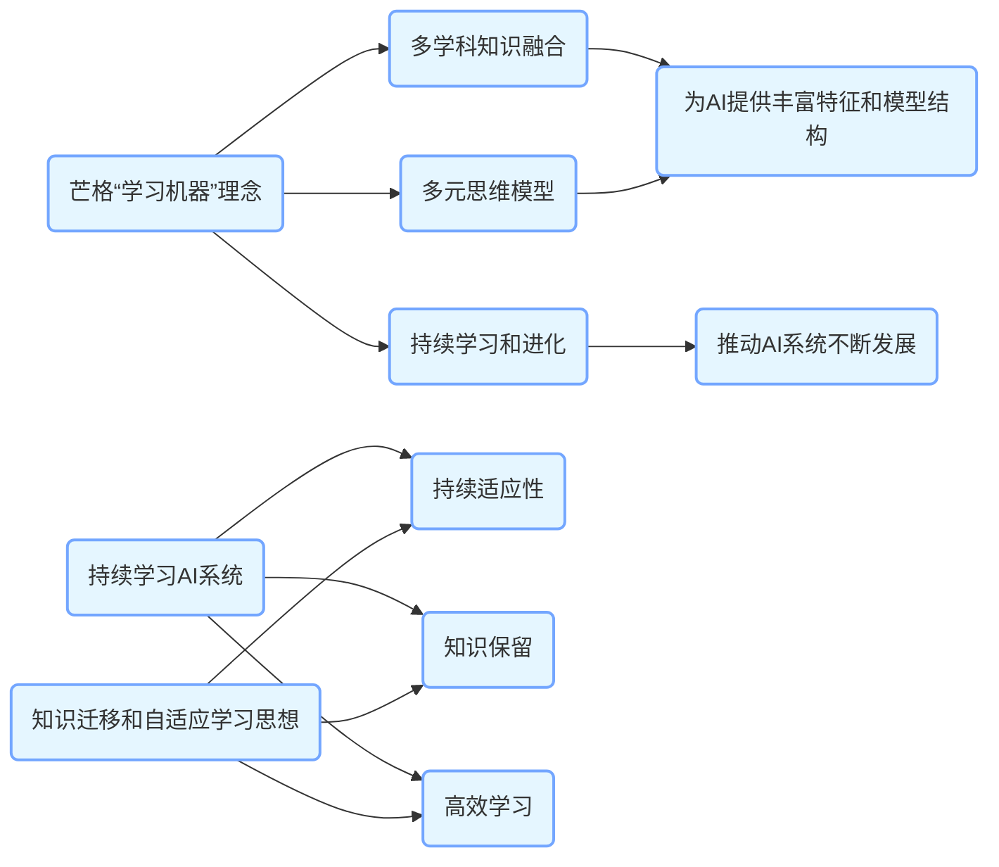

# 芒格的"学习机器"理念在持续学习AI系统开发中的应用

> 关键词：芒格、学习机器理念、持续学习、AI系统开发、知识迁移、自适应学习、元学习

> 摘要：本文深入探讨了芒格的“学习机器”理念在持续学习AI系统开发中的应用。首先介绍了背景信息，包括目的、预期读者、文档结构和相关术语。接着阐述了核心概念与联系，通过文本示意图和Mermaid流程图清晰展示。详细讲解了核心算法原理及具体操作步骤，结合Python源代码进行说明。同时给出了数学模型和公式，并举例解释。通过项目实战展示了代码实际案例及详细解读。探讨了实际应用场景，推荐了相关工具和资源。最后总结了未来发展趋势与挑战，提供了常见问题解答和扩展阅读参考资料。旨在揭示芒格理念对AI系统开发的启示，推动持续学习AI系统的发展。

## 1. 背景介绍 
### 1.1 目的和范围
本研究的目的在于深入探索芒格的“学习机器”理念在持续学习AI系统开发中的潜在价值和具体应用方式。范围涵盖从理念的核心思想出发，剖析其与持续学习AI系统的内在联系，研究如何将这一理念转化为具体的算法和开发策略，以及通过实际项目案例验证其可行性和有效性。同时，还会探讨该理念在不同应用场景下的适应性和发展前景，为AI领域的研究者和开发者提供新的思路和方法。

### 1.2 预期读者
本文预期读者主要包括人工智能领域的研究人员、开发者、软件架构师、对AI技术有深入兴趣的技术爱好者，以及关注AI发展趋势的企业管理者和决策者。对于希望深入了解持续学习AI系统开发的人员，以及寻求创新理念和方法来提升AI系统性能的相关人士，本文都具有一定的参考价值。

### 1.3 文档结构概述
本文将按照以下结构展开：首先介绍背景信息，包括目的、预期读者、文档结构和相关术语；接着阐述核心概念与联系，通过文本示意图和Mermaid流程图清晰展示理念与系统的关系；详细讲解核心算法原理及具体操作步骤，结合Python源代码进行说明；给出数学模型和公式，并举例解释；通过项目实战展示代码实际案例及详细解读；探讨实际应用场景；推荐相关工具和资源；最后总结未来发展趋势与挑战，提供常见问题解答和扩展阅读参考资料。

### 1.4 术语表
#### 1.4.1 核心术语定义
- **芒格的“学习机器”理念**：指查理·芒格所倡导的一种持续、高效学习的理念，强调不断获取多学科知识，建立多元思维模型，以实现对复杂问题的全面理解和有效解决。
- **持续学习AI系统**：是一种能够在不断接收新数据的过程中持续学习和适应，不断提升自身性能和能力，同时避免灾难性遗忘的人工智能系统。
- **灾难性遗忘**：在机器学习中，指模型在学习新任务时，会忘记之前所学任务的知识和能力，导致对旧任务的性能大幅下降。
- **知识迁移**：将在一个领域或任务中学习到的知识和技能应用到另一个领域或任务中的过程。
- **元学习**：又称“学习如何学习”，是一种让模型学习学习策略和方法，从而能够快速适应新任务和新环境的技术。

#### 1.4.2 相关概念解释
- **多学科知识融合**：在“学习机器”理念中，强调从不同学科领域获取知识，如数学、物理学、生物学、心理学等，并将这些知识相互融合，形成更全面、深入的认知。在AI系统开发中，多学科知识融合可以为算法设计、模型优化等提供更丰富的思路和方法。
- **自适应学习**：持续学习AI系统需要具备自适应学习能力，即能够根据新数据的特点和变化，自动调整学习策略和模型参数，以实现对新环境的快速适应和性能提升。
- **终身学习**：类似于人类的终身学习过程，持续学习AI系统应能够在其整个生命周期内不断学习和进化，不断提升自身的智能水平和应用价值。

#### 1.4.3 缩略词列表
- **AI**：Artificial Intelligence，人工智能
- **ML**：Machine Learning，机器学习
- **DL**：Deep Learning，深度学习
- **RL**：Reinforcement Learning，强化学习

## 2. 核心概念与联系 

### 芒格“学习机器”理念的核心思想
芒格认为，一个优秀的“学习机器”应该不断地学习和积累多学科的知识，构建多元思维模型。通过将不同学科的知识和方法相互结合，可以更全面、深入地理解问题，从而做出更明智的决策。例如，在解决复杂的商业问题时，不仅需要具备经济学知识，还需要了解心理学、社会学、物理学等多个学科的原理，以从不同角度分析问题，找到更优的解决方案。

### 持续学习AI系统的特点和需求
持续学习AI系统需要具备以下特点和需求：
- **持续适应性**：能够在不断接收新数据的过程中，持续调整和优化自身的模型和策略，以适应新的任务和环境。
- **知识保留**：避免灾难性遗忘，在学习新任务时，能够保留之前所学的知识和能力，确保对旧任务的性能不受影响。
- **高效学习**：能够快速学习新的知识和技能，提高学习效率，降低学习成本。

### 两者的联系
芒格的“学习机器”理念与持续学习AI系统存在着紧密的联系。可以将AI系统看作是一个“学习机器”，通过不断地学习新的数据和知识，构建多元的模型和算法，以实现对复杂任务的有效处理。具体来说，“学习机器”理念中的多学科知识融合可以为AI系统提供更丰富的特征表示和模型结构，知识迁移和自适应学习的思想可以帮助AI系统更好地实现持续学习和避免灾难性遗忘。

### 文本示意图
```plaintext
芒格“学习机器”理念
|-- 多学科知识融合
|   |-- 数学知识
|   |-- 物理学知识
|   |-- 生物学知识
|   |-- 心理学知识
|   |-- ...
|-- 多元思维模型
|   |-- 分析问题的不同视角
|   |-- 解决问题的多种策略
|-- 持续学习和进化

持续学习AI系统
|-- 持续适应性
|   |-- 新数据接收
|   |-- 模型调整和优化
|-- 知识保留
|   |-- 避免灾难性遗忘
|   |-- 旧知识存储和复用
|-- 高效学习
|   |-- 快速学习新任务
|   |-- 降低学习成本

联系
|-- 多学科知识融合为AI提供丰富特征和模型结构
|-- 知识迁移和自适应学习思想帮助AI实现持续学习
|-- 持续学习和进化理念推动AI系统不断发展
```

### Mermaid流程图


## 3. 核心算法原理 & 具体操作步骤 

### 基于元学习的持续学习算法原理
元学习的核心思想是让模型学习学习策略和方法，从而能够快速适应新任务。在持续学习AI系统中，元学习可以帮助模型在面对新数据时，快速调整自身的参数和结构，实现高效的学习和知识迁移。

以下是一个基于元学习的持续学习算法的Python示例：

```python
import torch
import torch.nn as nn
import torch.optim as optim

# 定义一个简单的神经网络模型
class SimpleNet(nn.Module):
    def __init__(self, input_size, hidden_size, output_size):
        super(SimpleNet, self).__init__()
        self.fc1 = nn.Linear(input_size, hidden_size)
        self.relu = nn.ReLU()
        self.fc2 = nn.Linear(hidden_size, output_size)

    def forward(self, x):
        out = self.fc1(x)
        out = self.relu(out)
        out = self.fc2(out)
        return out

# 定义元学习的训练过程
def meta_learning_train(model, meta_optimizer, tasks, num_inner_steps, inner_lr):
    meta_loss = 0
    for task in tasks:
        # 复制模型参数
        fast_weights = list(model.parameters())
        # 内循环训练
        for _ in range(num_inner_steps):
            inputs, labels = task
            logits = model.forward(inputs)
            loss = nn.CrossEntropyLoss()(logits, labels)
            grads = torch.autograd.grad(loss, fast_weights)
            fast_weights = [w - inner_lr * g for w, g in zip(fast_weights, grads)]
        # 计算元损失
        inputs, labels = task
        logits = model.forward(inputs)
        meta_loss += nn.CrossEntropyLoss()(logits, labels)
    # 更新元参数
    meta_optimizer.zero_grad()
    meta_loss.backward()
    meta_optimizer.step()
    return meta_loss.item()

# 初始化模型和优化器
input_size = 10
hidden_size = 20
output_size = 5
model = SimpleNet(input_size, hidden_size, output_size)
meta_optimizer = optim.Adam(model.parameters(), lr=0.001)

# 模拟任务数据
tasks = [
    (torch.randn(10, input_size), torch.randint(0, output_size, (10,))),
    (torch.randn(10, input_size), torch.randint(0, output_size, (10,)))
]

# 训练过程
num_epochs = 100
num_inner_steps = 5
inner_lr = 0.01
for epoch in range(num_epochs):
    meta_loss = meta_learning_train(model, meta_optimizer, tasks, num_inner_steps, inner_lr)
    if (epoch + 1) % 10 == 0:
        print(f'Epoch {epoch + 1}, Meta Loss: {meta_loss}')
```

### 具体操作步骤
1. **数据准备**：收集和整理不同任务的数据，将其划分为训练集、验证集和测试集。
2. **模型定义**：根据任务的特点和需求，定义合适的神经网络模型，如卷积神经网络（CNN）、循环神经网络（RNN）等。
3. **元学习训练**：在元学习阶段，使用元优化器（如Adam、SGD等）对模型进行训练。在每个元训练步骤中，从任务集合中采样多个任务，对每个任务进行内循环训练，更新模型的快速权重，然后计算元损失并更新元参数。
4. **持续学习阶段**：在持续学习阶段，当遇到新任务时，使用元学习得到的学习策略和方法，快速调整模型的参数和结构，以适应新任务。
5. **评估和优化**：在每个训练步骤后，使用验证集对模型的性能进行评估，根据评估结果调整模型的参数和训练策略，以提高模型的性能和泛化能力。

## 4. 数学模型和公式 & 详细讲解 & 举例说明 

### 元学习的数学模型
元学习的目标是学习一个初始参数 $\theta$，使得模型在面对新任务时能够快速收敛到最优解。假设我们有一个任务分布 $\mathcal{T}$，对于每个任务 $T \in \mathcal{T}$，有一个损失函数 $\mathcal{L}_T(\theta)$。元学习的优化目标可以表示为：

$$
\min_{\theta} \mathbb{E}_{T \sim \mathcal{T}} \left[ \mathcal{L}_T \left( \theta - \alpha \nabla_{\theta} \mathcal{L}_T(\theta) \right) \right]
$$

其中，$\alpha$ 是内循环的学习率，$\theta - \alpha \nabla_{\theta} \mathcal{L}_T(\theta)$ 表示在任务 $T$ 上进行一次梯度下降更新后的参数。

### 详细讲解
- **外循环**：在元学习的外循环中，我们的目标是最小化在任务分布 $\mathcal{T}$ 上的期望损失。通过不断更新初始参数 $\theta$，使得模型在不同任务上都能够快速学习和适应。
- **内循环**：对于每个采样的任务 $T$，我们在内循环中使用梯度下降算法对模型进行更新，得到快速权重 $\theta' = \theta - \alpha \nabla_{\theta} \mathcal{L}_T(\theta)$。然后，使用快速权重计算元损失 $\mathcal{L}_T(\theta')$，并将其作为外循环的优化目标。

### 举例说明
假设我们有两个分类任务 $T_1$ 和 $T_2$，每个任务有一个损失函数 $\mathcal{L}_{T_1}(\theta)$ 和 $\mathcal{L}_{T_2}(\theta)$。在元学习的外循环中，我们从任务分布中采样这两个任务，对于任务 $T_1$，我们在内循环中进行一次梯度下降更新，得到快速权重 $\theta_1' = \theta - \alpha \nabla_{\theta} \mathcal{L}_{T_1}(\theta)$，然后计算元损失 $\mathcal{L}_{T_1}(\theta_1')$。同样地，对于任务 $T_2$，我们得到快速权重 $\theta_2' = \theta - \alpha \nabla_{\theta} \mathcal{L}_{T_2}(\theta)$ 和元损失 $\mathcal{L}_{T_2}(\theta_2')$。最终的元损失为 $\frac{1}{2} \left( \mathcal{L}_{T_1}(\theta_1') + \mathcal{L}_{T_2}(\theta_2') \right)$，我们通过更新初始参数 $\theta$ 来最小化这个元损失。

## 5. 项目实战：代码实际案例和详细解释说明 

### 5.1  开发环境搭建
- **操作系统**：推荐使用 Ubuntu 18.04 或更高版本的 Linux 系统，或者 Windows 10 操作系统。
- **编程语言**：Python 3.7 或更高版本。
- **深度学习框架**：PyTorch 1.7 或更高版本。
- **开发工具**：推荐使用 PyCharm 或 Jupyter Notebook 作为开发工具。

### 5.2  源代码详细实现和代码解读
以下是一个基于 PyTorch 的持续学习AI系统的完整代码示例，结合了元学习和知识蒸馏的方法来实现持续学习和避免灾难性遗忘。

```python
import torch
import torch.nn as nn
import torch.optim as optim
from torch.utils.data import DataLoader, Dataset

# 定义一个简单的神经网络模型
class SimpleNet(nn.Module):
    def __init__(self, input_size, hidden_size, output_size):
        super(SimpleNet, self).__init__()
        self.fc1 = nn.Linear(input_size, hidden_size)
        self.relu = nn.ReLU()
        self.fc2 = nn.Linear(hidden_size, output_size)

    def forward(self, x):
        out = self.fc1(x)
        out = self.relu(out)
        out = self.fc2(out)
        return out

# 定义数据集类
class CustomDataset(Dataset):
    def __init__(self, inputs, labels):
        self.inputs = inputs
        self.labels = labels

    def __len__(self):
        return len(self.inputs)

    def __getitem__(self, idx):
        return self.inputs[idx], self.labels[idx]

# 元学习的训练过程
def meta_learning_train(model, meta_optimizer, tasks, num_inner_steps, inner_lr):
    meta_loss = 0
    for task in tasks:
        # 复制模型参数
        fast_weights = list(model.parameters())
        # 内循环训练
        for _ in range(num_inner_steps):
            inputs, labels = task
            logits = model.forward(inputs)
            loss = nn.CrossEntropyLoss()(logits, labels)
            grads = torch.autograd.grad(loss, fast_weights)
            fast_weights = [w - inner_lr * g for w, g in zip(fast_weights, grads)]
        # 计算元损失
        inputs, labels = task
        logits = model.forward(inputs)
        meta_loss += nn.CrossEntropyLoss()(logits, labels)
    # 更新元参数
    meta_optimizer.zero_grad()
    meta_loss.backward()
    meta_optimizer.step()
    return meta_loss.item()

# 知识蒸馏的训练过程
def knowledge_distillation_train(model, old_model, new_task_loader, distillation_loss_fn, alpha, temperature):
    model.train()
    old_model.eval()
    total_loss = 0
    for inputs, labels in new_task_loader:
        optimizer.zero_grad()
        new_logits = model(inputs)
        old_logits = old_model(inputs)
        student_loss = nn.CrossEntropyLoss()(new_logits, labels)
        distillation_loss = distillation_loss_fn(new_logits / temperature, old_logits / temperature)
        loss = alpha * student_loss + (1 - alpha) * distillation_loss
        loss.backward()
        optimizer.step()
        total_loss += loss.item()
    return total_loss / len(new_task_loader)

# 初始化模型和优化器
input_size = 10
hidden_size = 20
output_size = 5
model = SimpleNet(input_size, hidden_size, output_size)
meta_optimizer = optim.Adam(model.parameters(), lr=0.001)
optimizer = optim.Adam(model.parameters(), lr=0.001)

# 模拟任务数据
tasks = [
    (torch.randn(100, input_size), torch.randint(0, output_size, (100,))),
    (torch.randn(100, input_size), torch.randint(0, output_size, (100,)))
]

# 元学习训练
num_epochs = 100
num_inner_steps = 5
inner_lr = 0.01
for epoch in range(num_epochs):
    meta_loss = meta_learning_train(model, meta_optimizer, tasks, num_inner_steps, inner_lr)
    if (epoch + 1) % 10 == 0:
        print(f'Epoch {epoch + 1}, Meta Loss: {meta_loss}')

# 模拟新任务数据
new_inputs = torch.randn(100, input_size)
new_labels = torch.randint(0, output_size, (100,))
new_task_dataset = CustomDataset(new_inputs, new_labels)
new_task_loader = DataLoader(new_task_dataset, batch_size=10, shuffle=True)

# 知识蒸馏训练
old_model = SimpleNet(input_size, hidden_size, output_size)
old_model.load_state_dict(model.state_dict())
distillation_loss_fn = nn.KLDivLoss(reduction='batchmean')
alpha = 0.5
temperature = 2.0
num_distillation_epochs = 50
for epoch in range(num_distillation_epochs):
    distillation_loss = knowledge_distillation_train(model, old_model, new_task_loader, distillation_loss_fn, alpha, temperature)
    if (epoch + 1) % 10 == 0:
        print(f'Epoch {epoch + 1}, Distillation Loss: {distillation_loss}')
```

### 5.3  代码解读与分析
- **模型定义**：`SimpleNet` 类定义了一个简单的两层全连接神经网络模型，用于分类任务。
- **数据集类**：`CustomDataset` 类用于封装数据集，方便数据的加载和处理。
- **元学习训练**：`meta_learning_train` 函数实现了元学习的训练过程，通过内循环更新快速权重，外循环更新元参数，以学习一个通用的初始参数。
- **知识蒸馏训练**：`knowledge_distillation_train` 函数实现了知识蒸馏的训练过程，通过将旧模型的知识传递给新模型，避免灾难性遗忘。
- **训练过程**：首先进行元学习训练，然后模拟新任务数据，使用知识蒸馏的方法对模型进行持续学习，以适应新任务。

## 6. 实际应用场景 
### 智能客服系统
在智能客服系统中，持续学习AI系统可以根据用户的新问题和反馈不断学习和进化。例如，当遇到新的业务场景或用户需求时，系统可以快速学习相关知识，提供更准确和个性化的服务。通过应用芒格的“学习机器”理念，系统可以融合多领域的知识，如自然语言处理、业务知识、用户心理学等，以更好地理解用户意图，提高服务质量。

### 自动驾驶汽车
自动驾驶汽车需要在不断变化的环境中持续学习和适应。持续学习AI系统可以根据新的路况、交通规则和驾驶场景进行学习，提升自动驾驶的安全性和可靠性。结合“学习机器”理念，系统可以融合计算机视觉、传感器技术、控制理论等多学科知识，构建更全面、智能的决策模型。

### 医疗诊断系统
在医疗诊断领域，持续学习AI系统可以不断学习新的疾病特征、诊断方法和治疗方案。通过对大量医疗数据的持续学习，系统可以提高诊断的准确性和效率。借鉴“学习机器”理念，系统可以融合医学、生物学、统计学等多学科知识，为医生提供更科学、准确的诊断建议。

### 金融风险预测系统
金融市场环境复杂多变，持续学习AI系统可以实时监测市场数据，学习新的风险因素和趋势，提高风险预测的准确性。利用“学习机器”理念，系统可以融合经济学、金融学、数学等多学科知识，构建更全面、有效的风险评估模型。

## 7. 工具和资源推荐
### 7.1 学习资源推荐
#### 7.1.1 书籍推荐
- 《穷查理宝典：查理·芒格的智慧箴言录》：全面介绍了查理·芒格的投资理念、思维方式和学习方法，是了解“学习机器”理念的经典著作。
- 《深度学习》：由 Ian Goodfellow、Yoshua Bengio 和 Aaron Courville 合著，是深度学习领域的权威教材，涵盖了深度学习的基本原理、算法和应用。
- 《机器学习》：周志华著，是机器学习领域的经典教材，内容丰富，讲解详细，适合初学者和有一定基础的读者。

#### 7.1.2 在线课程
- Coursera 上的“深度学习专项课程”：由 Andrew Ng 教授授课，系统介绍了深度学习的基本概念、算法和应用，是学习深度学习的优质课程。
- edX 上的“人工智能基础”：由麻省理工学院（MIT）的教授授课，涵盖了人工智能的基本原理、方法和应用，对了解AI领域有很大帮助。
- Udemy 上的“Python 机器学习实战”：通过实际项目案例，介绍了如何使用Python进行机器学习开发，适合有一定编程基础的读者。

#### 7.1.3 技术博客和网站
- Medium：是一个优秀的技术博客平台，有很多关于人工智能、机器学习和深度学习的高质量文章。
- arXiv：是一个预印本服务器，提供了大量最新的学术论文，对于了解AI领域的最新研究成果非常有帮助。
- Kaggle：是一个数据科学竞赛平台，有很多公开的数据集和优秀的代码示例，可以帮助学习者提高实践能力。

### 7.2 开发工具框架推荐
#### 7.2.1 IDE和编辑器
- PyCharm：是一款专门为Python开发设计的集成开发环境（IDE），功能强大，提供了代码编辑、调试、版本控制等一系列功能，适合专业开发者使用。
- Jupyter Notebook：是一个交互式的开发环境，支持多种编程语言，尤其适合数据科学和机器学习的开发和实验。
- Visual Studio Code：是一款轻量级的代码编辑器，支持多种编程语言和插件，具有良好的扩展性和用户体验。

#### 7.2.2 调试和性能分析工具
- PyTorch Profiler：是 PyTorch 自带的性能分析工具，可以帮助开发者分析模型的运行时间、内存使用等性能指标，优化模型性能。
- TensorBoard：是 TensorFlow 提供的可视化工具，也可以与 PyTorch 结合使用，用于可视化模型的训练过程、损失曲线、准确率等指标。
- cProfile：是 Python 自带的性能分析工具，可以帮助开发者分析代码的运行时间和函数调用关系，找出性能瓶颈。

#### 7.2.3 相关框架和库
- PyTorch：是一个开源的深度学习框架，具有动态图、易于使用等优点，广泛应用于学术界和工业界。
- TensorFlow：是另一个开源的深度学习框架，具有强大的分布式训练和部署能力，在工业界有广泛的应用。
- Scikit-learn：是一个简单易用的机器学习库，提供了丰富的机器学习算法和工具，适合初学者和快速开发。

### 7.3 相关论文著作推荐
#### 7.3.1 经典论文
- "Model-Agnostic Meta-Learning for Fast Adaptation of Deep Networks"：提出了模型无关元学习（MAML）算法，是元学习领域的经典论文。
- "Overcoming Catastrophic Forgetting in Neural Networks"：提出了弹性权重巩固（EWC）算法，用于解决神经网络中的灾难性遗忘问题。
- "Distilling the Knowledge in a Neural Network"：提出了知识蒸馏的概念，为解决持续学习中的知识保留问题提供了一种有效方法。

#### 7.3.2 最新研究成果
- 关注 arXiv 上的最新论文，以及 NeurIPS、ICML、CVPR 等顶级学术会议的研究成果，了解持续学习AI系统领域的最新进展。

#### 7.3.3 应用案例分析
- 研究工业界的实际应用案例，如谷歌、微软、百度等公司在持续学习AI系统方面的应用，了解如何将理论研究应用到实际项目中。

## 8. 总结：未来发展趋势与挑战
### 未来发展趋势
- **多模态融合**：未来的持续学习AI系统将更加注重多模态数据的融合，如文本、图像、语音等，以实现更全面、深入的理解和学习。
- **强化学习与持续学习的结合**：强化学习可以为持续学习AI系统提供更有效的学习策略和决策机制，两者的结合将使系统在复杂环境中具有更强的适应性和智能性。
- **跨领域知识迁移**：持续学习AI系统将能够更好地实现跨领域的知识迁移，将在一个领域学习到的知识和技能应用到其他领域，提高系统的泛化能力和应用范围。
- **与人类智能的融合**：未来的AI系统将更加注重与人类智能的融合，通过与人类的交互和协作，不断学习和进化，实现人机协同的智能系统。

### 挑战
- **灾难性遗忘问题**：虽然已经提出了一些解决灾难性遗忘的方法，但仍然是持续学习AI系统面临的主要挑战之一。如何在学习新任务的同时，更好地保留旧知识，是未来研究的重点。
- **计算资源和效率**：持续学习需要不断地处理新数据和更新模型，对计算资源和效率提出了很高的要求。如何在有限的计算资源下，实现高效的持续学习，是需要解决的问题。
- **数据隐私和安全**：持续学习AI系统需要处理大量的数据，数据隐私和安全问题至关重要。如何在保证数据隐私和安全的前提下，实现有效的持续学习，是未来需要关注的问题。
- **可解释性和可靠性**：随着AI系统的复杂性不断增加，其可解释性和可靠性成为了重要的问题。如何使持续学习AI系统的决策和行为具有可解释性和可靠性，是未来研究的方向。

## 9. 附录：常见问题与解答
### 1. 什么是灾难性遗忘？
灾难性遗忘是指在机器学习中，模型在学习新任务时，会忘记之前所学任务的知识和能力，导致对旧任务的性能大幅下降。这是持续学习AI系统面临的一个主要问题。

### 2. 元学习如何解决持续学习中的问题？
元学习通过学习学习策略和方法，使模型能够快速适应新任务。在持续学习中，元学习可以帮助模型在面对新数据时，快速调整自身的参数和结构，实现高效的学习和知识迁移，从而缓解灾难性遗忘问题。

### 3. 知识蒸馏在持续学习中有什么作用？
知识蒸馏通过将旧模型的知识传递给新模型，帮助新模型在学习新任务的同时，保留旧模型的知识。在持续学习中，知识蒸馏可以作为一种有效的方法来避免灾难性遗忘，提高模型的性能和泛化能力。

### 4. 持续学习AI系统的训练时间会很长吗？
持续学习AI系统的训练时间会受到多种因素的影响，如数据量、模型复杂度、训练算法等。一般来说，由于需要不断处理新数据和更新模型，训练时间可能会相对较长。但通过优化算法和使用高效的计算资源，可以在一定程度上缩短训练时间。

### 5. 如何评估持续学习AI系统的性能？
评估持续学习AI系统的性能可以从多个方面进行，如对旧任务的保留能力、对新任务的学习能力、模型的泛化能力等。常用的评估指标包括准确率、召回率、F1值等。同时，还可以通过可视化的方法观察模型的训练过程和性能变化。

## 10. 扩展阅读 & 参考资料
- 查理·芒格的演讲和著作，如《穷查理宝典：查理·芒格的智慧箴言录》等。
- 相关学术论文，如关于元学习、持续学习、知识蒸馏等方面的论文。
- 开源项目和代码库，如 PyTorch、TensorFlow 等深度学习框架的官方文档和示例代码。
- 行业报告和技术博客，了解持续学习AI系统在不同领域的应用和发展趋势。