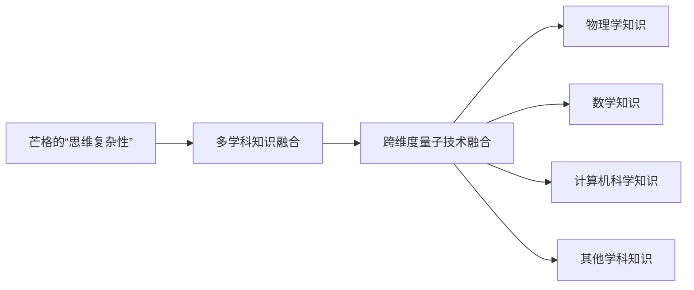

# 芒格的"思维复杂性"在跨维度量子技术融合中的重要性

> 关键词：芒格、思维复杂性、跨维度、量子技术融合、重要性

> 摘要：本文深入探讨了芒格的“思维复杂性”概念在跨维度量子技术融合领域的重要性。首先介绍了研究的背景，包括目的、预期读者等内容。接着阐述了核心概念，通过示意图和流程图展示其原理与架构。详细讲解了相关核心算法原理和操作步骤，用 Python 代码进行说明，还给出了数学模型和公式并举例。通过项目实战展示代码实现与解读，分析其在实际应用场景中的价值。推荐了学习资源、开发工具框架及相关论文著作。最后总结未来发展趋势与挑战，提供常见问题解答和扩展阅读参考资料，旨在揭示“思维复杂性”如何助力跨维度量子技术融合的发展。

## 1. 背景介绍 
### 1.1 目的和范围
在当今科技飞速发展的时代，量子技术作为前沿领域正不断取得突破。跨维度量子技术融合更是一个具有巨大潜力和挑战的研究方向，它涉及到多个学科和领域的知识与技术的整合。本研究的目的在于探讨芒格的“思维复杂性”这一独特的思维理念如何应用于跨维度量子技术融合中，以及其在该领域所起到的重要作用。范围涵盖了量子技术的基本概念、跨维度融合的相关理论，以及芒格“思维复杂性”的内涵和应用方式等方面。

### 1.2 预期读者
本文预期读者包括对量子技术、跨学科研究、思维方式研究等领域感兴趣的科研人员、工程师、学者，以及希望了解前沿科技发展动态和思维创新方法的科技爱好者。无论是专业人士希望从新的视角拓展研究思路，还是普通爱好者希望对跨维度量子技术融合有更深入的理解，都能从本文中获得有价值的信息。

### 1.3 文档结构概述
本文将按照以下结构进行阐述：首先介绍背景信息，包括目的、读者和文档结构等；接着讲解核心概念与联系，通过文本示意图和 Mermaid 流程图展示相关原理和架构；然后详细阐述核心算法原理和具体操作步骤，用 Python 代码进行说明；再给出数学模型和公式并举例讲解；通过项目实战展示代码实现和解读；分析实际应用场景；推荐相关的工具和资源；最后总结未来发展趋势与挑战，提供常见问题解答和扩展阅读参考资料。

### 1.4 术语表
#### 1.4.1 核心术语定义
- **芒格的“思维复杂性”**：由查理·芒格提出的一种思维理念，强调从多个不同的学科和领域获取知识和思维方式，将其融合运用，以更全面、深入地理解和解决问题。
- **跨维度量子技术融合**：指将不同维度（如空间维度、时间维度、能量维度等）的量子技术进行整合和协同，以实现更高效、更强大的量子系统和应用。
- **量子比特**：量子计算中的基本信息单位，与经典比特不同，它可以同时处于 0 和 1 的叠加态。
- **量子纠缠**：量子力学中的一种现象，两个或多个量子系统之间存在一种特殊的关联，使得一个系统的状态改变会瞬间影响到其他系统的状态。

#### 1.4.2 相关概念解释
- **多学科思维**：借鉴不同学科的理论、方法和工具来解决问题，打破单一学科的局限，拓宽思维视野。
- **量子技术**：基于量子力学原理发展起来的一系列技术，包括量子计算、量子通信、量子传感等。
- **跨维度**：涉及到超越传统三维空间和一维时间的维度概念，在更高维度或不同维度的层面上进行研究和应用。

#### 1.4.3 缩略词列表
- **QC**：Quantum Computing，量子计算
- **QE**：Quantum Entanglement，量子纠缠
- **QBIT**：Quantum Bit，量子比特

## 2. 核心概念与联系 
### 核心概念原理
芒格的“思维复杂性”强调从多个学科的角度去思考问题，其原理在于不同学科有着各自独特的研究方法、理论体系和思维模式。通过将这些不同的思维方式融合在一起，能够打破单一学科的局限性，从而更全面、深入地理解和解决复杂问题。

在跨维度量子技术融合中，量子技术本身就涉及到物理学、数学、计算机科学等多个学科的知识。例如，量子计算需要运用量子力学的原理来设计和实现计算模型，同时也需要计算机科学的算法和编程知识来进行具体的计算操作。而跨维度的概念则涉及到更高维度的数学理论和物理模型。将芒格的“思维复杂性”应用于跨维度量子技术融合中，就是要从多个学科的角度去理解量子技术的本质和跨维度的意义，从而更好地实现不同维度量子技术的融合。

### 架构的文本示意图
```plaintext
          芒格的“思维复杂性”
               |
               | 融合多个学科思维
               |
        +-------------------+
        | 跨维度量子技术融合 |
        +-------------------+
        |  物理学知识       |
        |  数学知识         |
        |  计算机科学知识   |
        |  其他学科知识     |
        +-------------------+
```

### Mermaid 流程图


## 3. 核心算法原理 & 具体操作步骤 
### 核心算法原理
在跨维度量子技术融合中，一个重要的算法是量子态的模拟和控制算法。下面以量子比特的简单模拟为例，介绍其算法原理。

量子比特可以用一个二维复向量来表示，例如一个处于叠加态的量子比特可以表示为：

$\vert\psi\rangle = \alpha\vert0\rangle + \beta\vert1\rangle$

其中，$\alpha$ 和 $\beta$ 是复数，且满足 $\vert\alpha\vert^2 + \vert\beta\vert^2 = 1$。

在量子计算中，我们可以通过对量子比特应用不同的量子门来改变其状态。例如，常见的 Pauli-X 门可以表示为：

$X = \begin{bmatrix}0 & 1\\1 & 0\end{bmatrix}$

当对一个量子比特 $\vert\psi\rangle$ 应用 Pauli-X 门时，其状态会发生改变：

$X\vert\psi\rangle = X(\alpha\vert0\rangle + \beta\vert1\rangle) = \alpha X\vert0\rangle + \beta X\vert1\rangle = \alpha\vert1\rangle + \beta\vert0\rangle$

### 具体操作步骤
1. 初始化量子比特的状态，确定 $\alpha$ 和 $\beta$ 的值。
2. 选择要应用的量子门，例如 Pauli-X 门。
3. 计算应用量子门后量子比特的新状态。
4. 重复步骤 2 和 3，直到达到所需的量子态。

### Python 源代码实现
```python
import numpy as np

# 定义 Pauli-X 门
X = np.array([[0, 1], [1, 0]])

# 初始化量子比特状态
alpha = 0.6
beta = np.sqrt(1 - alpha**2)
psi = np.array([alpha, beta])

# 应用 Pauli-X 门
new_psi = np.dot(X, psi)

print("初始量子比特状态:", psi)
print("应用 Pauli-X 门后的量子比特状态:", new_psi)
```

### 代码解释
1. 首先，我们使用 `numpy` 库来进行矩阵运算。
2. 定义了 Pauli-X 门的矩阵表示。
3. 初始化了一个量子比特的状态，其中 $\alpha = 0.6$，$\beta$ 通过 $\vert\alpha\vert^2 + \vert\beta\vert^2 = 1$ 计算得到。
4. 使用 `np.dot` 函数计算应用 Pauli-X 门后量子比特的新状态。
5. 最后，打印出初始状态和新状态。

## 4. 数学模型和公式 & 详细讲解 & 举例说明 
### 量子态的数学模型
量子态可以用希尔伯特空间中的向量来表示。对于一个 $n$ 个量子比特的系统，其状态空间是一个 $2^n$ 维的希尔伯特空间。例如，对于一个单量子比特系统，其状态可以表示为：

$\vert\psi\rangle = \alpha\vert0\rangle + \beta\vert1\rangle$

其中，$\vert0\rangle$ 和 $\vert1\rangle$ 是基态，$\alpha$ 和 $\beta$ 是复数，且满足 $\vert\alpha\vert^2 + \vert\beta\vert^2 = 1$。

### 量子门的数学表示
量子门是对量子态进行操作的线性变换，通常用幺正矩阵来表示。例如，常见的 Pauli 门：

- Pauli-X 门：$X = \begin{bmatrix}0 & 1\\1 & 0\end{bmatrix}$
- Pauli-Y 门：$Y = \begin{bmatrix}0 & -i\\i & 0\end{bmatrix}$
- Pauli-Z 门：$Z = \begin{bmatrix}1 & 0\\0 & -1\end{bmatrix}$

### 量子测量的数学公式
量子测量是将量子态投影到一组基态上，并得到相应的测量结果。对于一个单量子比特系统，测量结果为 0 的概率为 $\vert\alpha\vert^2$，测量结果为 1 的概率为 $\vert\beta\vert^2$。

### 详细讲解
量子态的叠加原理是量子力学的一个重要特性，它允许量子比特同时处于多个状态的叠加。量子门的幺正性保证了量子态的演化是可逆的，这是量子计算的一个重要基础。量子测量则是将量子态转换为经典信息的过程，测量结果是概率性的。

### 举例说明
假设一个单量子比特系统的状态为 $\vert\psi\rangle = \frac{1}{\sqrt{2}}\vert0\rangle + \frac{1}{\sqrt{2}}\vert1\rangle$。

- 应用 Pauli-X 门后，新状态为 $X\vert\psi\rangle = \frac{1}{\sqrt{2}}\vert1\rangle + \frac{1}{\sqrt{2}}\vert0\rangle$。
- 测量该量子比特，得到 0 的概率为 $\vert\frac{1}{\sqrt{2}}\vert^2 = \frac{1}{2}$，得到 1 的概率也为 $\frac{1}{2}$。

## 5. 项目实战：代码实际案例和详细解释说明 
### 5.1  开发环境搭建
#### 安装 Python
首先，需要安装 Python 环境。可以从 Python 官方网站（https://www.python.org/downloads/） 下载适合自己操作系统的 Python 版本，并按照安装向导进行安装。

#### 安装相关库
在跨维度量子技术融合的项目中，需要使用一些相关的 Python 库，例如 `numpy`、`qiskit` 等。可以使用 `pip` 命令进行安装：

```sh
pip install numpy qiskit
```

### 5.2  源代码详细实现和代码解读
以下是一个使用 `qiskit` 库实现简单量子电路的代码示例：

```python
from qiskit import QuantumCircuit, Aer, execute
import matplotlib.pyplot as plt

# 创建一个量子电路，包含 1 个量子比特和 1 个经典比特
qc = QuantumCircuit(1, 1)

# 应用 Hadamard 门，将量子比特置于叠加态
qc.h(0)

# 进行测量，将量子比特的状态映射到经典比特
qc.measure(0, 0)

# 打印量子电路
print(qc)

# 使用 Aer 模拟器进行模拟
backend = Aer.get_backend('qasm_simulator')
job = execute(qc, backend, shots=1000)
result = job.result()

# 获取测量结果
counts = result.get_counts(qc)

# 绘制测量结果的直方图
plt.bar(counts.keys(), counts.values())
plt.xlabel('Measurement Outcome')
plt.ylabel('Count')
plt.title('Quantum Circuit Measurement Results')
plt.show()
```

### 5.3  代码解读与分析
1. **导入必要的库**：`QuantumCircuit` 用于创建量子电路，`Aer` 用于模拟量子计算，`execute` 用于执行量子电路。
2. **创建量子电路**：使用 `QuantumCircuit(1, 1)` 创建一个包含 1 个量子比特和 1 个经典比特的量子电路。
3. **应用 Hadamard 门**：使用 `qc.h(0)` 将第一个量子比特置于叠加态。
4. **进行测量**：使用 `qc.measure(0, 0)` 将量子比特的状态映射到经典比特。
5. **打印量子电路**：使用 `print(qc)` 打印出量子电路的结构。
6. **使用模拟器进行模拟**：使用 `Aer.get_backend('qasm_simulator')` 获取量子模拟器，然后使用 `execute` 函数执行量子电路，设置模拟次数为 1000 次。
7. **获取测量结果**：使用 `result.get_counts(qc)` 获取测量结果。
8. **绘制直方图**：使用 `matplotlib` 库绘制测量结果的直方图，直观展示测量结果的分布。

## 6. 实际应用场景 
### 量子通信
在量子通信中，跨维度量子技术融合可以提高通信的安全性和效率。例如，通过利用量子纠缠的特性，可以实现量子密钥分发，确保通信双方之间的密钥传输是绝对安全的。芒格的“思维复杂性”可以帮助研究人员从物理学、数学、信息论等多个学科的角度去理解和优化量子通信系统，提高通信的性能和可靠性。

### 量子计算
量子计算是跨维度量子技术融合的一个重要应用领域。通过将不同维度的量子比特进行融合和操作，可以实现更强大的计算能力。例如，在解决一些复杂的优化问题、密码分析问题等方面，量子计算具有巨大的潜力。芒格的“思维复杂性”可以促使研究人员借鉴计算机科学、物理学、数学等多个学科的知识，设计出更高效的量子算法和量子计算架构。

### 量子传感
量子传感利用量子系统的特性来实现高精度的测量。跨维度量子技术融合可以提高量子传感器的灵敏度和分辨率。例如，在测量微小磁场、引力场等方面，量子传感器具有独特的优势。芒格的“思维复杂性”可以引导研究人员从物理学、材料科学、信号处理等多个学科的角度去改进量子传感技术，提高传感器的性能和应用范围。

## 7. 工具和资源推荐
### 7.1 学习资源推荐
#### 7.1.1 书籍推荐
- 《量子力学导论》：全面介绍了量子力学的基本原理和概念，是学习量子技术的基础书籍。
- 《量子计算与量子信息》：详细讲解了量子计算和量子信息的理论和技术，是该领域的经典著作。
- 《穷查理宝典：查理·芒格的智慧箴言录》：深入介绍了芒格的思维方式和投资理念，对于理解“思维复杂性”有很大的帮助。

#### 7.1.2 在线课程
- Coursera 上的“Quantum Mechanics for Everyone”：适合初学者，从基础的量子力学知识讲起。
- edX 上的“Quantum Computing Fundamentals”：系统介绍量子计算的基本原理和算法。
- Udemy 上的“Charlie Munger's Mental Models: Think Like a Billionaire Investor”：专门讲解芒格的思维模型。

#### 7.1.3 技术博客和网站
- Quantum Computing Report：提供量子计算领域的最新研究动态和技术进展。
- Qiskit 官方博客：关于 Qiskit 库的使用和量子计算的实践经验分享。
- Farnam Street：专注于思维模型和决策方法的博客，有很多关于芒格思维方式的文章。

### 7.2 开发工具框架推荐
#### 7.2.1 IDE和编辑器
- PyCharm：功能强大的 Python 集成开发环境，适合开发量子计算相关的 Python 代码。
- Visual Studio Code：轻量级的代码编辑器，支持多种编程语言，有丰富的插件可以扩展功能。

#### 7.2.2 调试和性能分析工具
- Qiskit 自带的调试工具：可以帮助调试量子电路和分析量子计算的性能。
- Python 的 `pdb` 调试器：用于调试 Python 代码中的逻辑错误。

#### 7.2.3 相关框架和库
- Qiskit：IBM 开发的开源量子计算框架，提供了丰富的量子电路构建和模拟工具。
- Cirq：Google 开发的量子计算框架，支持量子电路的设计和模拟。
- PennyLane：用于量子机器学习的框架，结合了量子计算和机器学习的技术。

### 7.3 相关论文著作推荐
#### 7.3.1 经典论文
- “The Physical Implementation of Quantum Computation”：详细讨论了量子计算的物理实现方法和技术挑战。
- “Quantum Entanglement and the Foundations of Quantum Mechanics”：对量子纠缠这一重要概念进行了深入的理论探讨。

#### 7.3.2 最新研究成果
- 关注《Nature》、《Science》等顶级科学期刊上关于量子技术的最新研究论文，了解该领域的前沿进展。

#### 7.3.3 应用案例分析
- 一些科研机构和企业发布的关于量子技术在通信、计算、传感等领域的应用案例报告，从中可以学习到实际应用中的经验和方法。

## 8. 总结：未来发展趋势与挑战
### 未来发展趋势
- **跨学科融合的深化**：跨维度量子技术融合将进一步与更多学科进行深度融合，例如生物学、化学等，创造出更多新的应用领域和研究方向。
- **量子技术的商业化应用**：随着量子技术的不断发展和成熟，越来越多的量子技术产品和服务将进入市场，实现商业化应用，例如量子通信网络、量子云计算等。
- **国际合作的加强**：量子技术是一个全球性的研究领域，各国将加强在该领域的合作与交流，共同推动量子技术的发展和应用。

### 挑战
- **技术难题**：跨维度量子技术融合面临着许多技术难题，例如量子比特的稳定性、量子噪声的控制、量子系统的可扩展性等，需要不断进行技术创新和突破。
- **人才短缺**：该领域需要具备多学科知识和技能的复合型人才，目前人才短缺的问题比较突出，需要加强相关人才的培养和引进。
- **伦理和安全问题**：量子技术的发展也带来了一些伦理和安全问题，例如量子计算可能对现有密码系统造成威胁，需要建立相应的伦理和安全规范。

## 9. 附录：常见问题与解答
### 问题 1：芒格的“思维复杂性”如何具体应用到跨维度量子技术融合中？
答：可以从多个方面应用，例如在研究量子技术时，借鉴不同学科的理论和方法，如物理学提供量子力学原理，数学提供计算和建模工具，计算机科学提供算法和编程技术等。在解决跨维度融合的问题时，综合运用这些不同学科的思维方式，打破单一学科的局限，找到更全面、有效的解决方案。

### 问题 2：量子计算与经典计算有什么本质区别？
答：量子计算基于量子力学原理，利用量子比特的叠加态和纠缠态等特性进行计算，可以同时处理多个状态，具有指数级的计算速度优势。而经典计算基于经典比特，只能处于 0 或 1 两种状态之一，计算速度相对较慢。

### 问题 3：跨维度量子技术融合面临的最大挑战是什么？
答：最大挑战之一是技术层面的问题，如量子比特的稳定性和量子噪声的控制。量子系统非常脆弱，容易受到外界环境的干扰，导致量子比特的状态发生改变，从而影响计算结果的准确性。此外，跨维度的理论和技术还不够成熟，需要进一步的研究和探索。

### 问题 4：学习跨维度量子技术融合需要具备哪些基础知识？
答：需要具备物理学（特别是量子力学）、数学（如线性代数、概率论等）、计算机科学（如编程、算法等）等方面的基础知识。同时，了解芒格的“思维复杂性”等思维方式，有助于从多学科的角度去理解和研究该领域。

## 10. 扩展阅读 & 参考资料
### 扩展阅读
- 《时间简史》：斯蒂芬·霍金的经典著作，介绍了宇宙的基本原理和前沿科学知识，对于理解量子技术的物理背景有一定的帮助。
- 《人类简史：从动物到上帝》：从宏观的人类发展角度探讨人类的思维和认知方式，启发读者从更广阔的视角思考问题。

### 参考资料
- Qiskit 官方文档：https://qiskit.org/documentation/
- Cirq 官方文档：https://quantumai.google/cirq
- PennyLane 官方文档：https://pennylane.ai/
- 《量子力学》（曾谨言著）
- 《数学物理方法》（梁昆淼著）