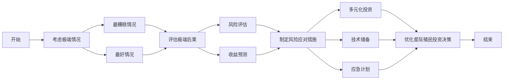

# 芒格的"极端后果"思维在星际殖民投资决策中的应用

> 关键词：芒格、极端后果思维、星际殖民、投资决策、风险评估

> 摘要：本文探讨了芒格的“极端后果”思维在星际殖民投资决策中的应用。首先介绍了相关背景，包括目的范围、预期读者等内容。接着阐述了核心概念与联系，分析了“极端后果”思维的原理及其与星际殖民投资决策的关联。通过详细的算法原理和数学模型，讲解了如何运用这种思维进行决策分析。以实际项目案例展示了具体的操作步骤和代码实现。探讨了星际殖民投资决策的实际应用场景，推荐了相关的学习资源、开发工具和论文著作。最后总结了未来发展趋势与挑战，解答了常见问题，并提供了扩展阅读和参考资料，旨在为投资者在星际殖民这一新兴且充满挑战的领域提供科学、全面的决策思路。

## 1. 背景介绍 
### 1.1 目的和范围
随着科技的飞速发展，星际殖民不再仅仅是科幻小说中的幻想，逐渐成为现实中可能实现的目标。星际殖民投资作为一个新兴且极具潜力的领域，吸引了众多投资者的目光。然而，这一领域面临着前所未有的高风险和不确定性。本研究的目的在于探讨如何运用芒格的“极端后果”思维，为星际殖民投资决策提供一种有效的分析方法和决策框架，以降低投资风险，提高决策的科学性和准确性。

本研究的范围涵盖了星际殖民投资决策的各个方面，包括但不限于投资项目的可行性分析、风险评估、收益预测以及战略规划等。同时，将结合实际案例，详细阐述“极端后果”思维在这些环节中的具体应用。

### 1.2 预期读者
本文预期读者包括对星际殖民投资领域感兴趣的投资者、金融分析师、科技行业从业者、科研人员以及相关领域的学者。对于投资者而言，希望通过本文了解如何运用“极端后果”思维进行星际殖民投资决策，以优化投资组合，实现投资收益最大化；金融分析师可以借鉴本文的分析方法和决策框架，为客户提供更专业的投资建议；科技行业从业者和科研人员可以从本文中获得关于星际殖民投资的风险和机遇的深入理解，为技术研发和项目规划提供参考；相关领域的学者则可以将本文作为研究星际殖民投资决策理论和方法的重要文献。

### 1.3 文档结构概述
本文将按照以下结构进行阐述：首先介绍背景信息，包括目的范围、预期读者等内容；接着深入探讨核心概念与联系，分析“极端后果”思维的原理及其与星际殖民投资决策的关联；然后详细讲解核心算法原理和具体操作步骤，并通过数学模型和公式进行理论支持；以实际项目案例展示“极端后果”思维在星际殖民投资决策中的具体应用；探讨星际殖民投资决策的实际应用场景；推荐相关的学习资源、开发工具和论文著作；最后总结未来发展趋势与挑战，解答常见问题，并提供扩展阅读和参考资料。

### 1.4 术语表
#### 1.4.1 核心术语定义
- **芒格的“极端后果”思维**：由查理·芒格提出的一种思维方式，强调在决策过程中不仅要考虑正常情况下的结果，还要充分考虑可能出现的极端情况及其后果，通过对极端后果的评估和分析，来优化决策。
- **星际殖民**：指人类在地球以外的其他天体上建立永久性定居点的过程，包括但不限于月球、火星等行星和卫星。
- **投资决策**：投资者在进行投资活动时，根据自身的投资目标、风险承受能力和市场情况等因素，对投资项目进行评估和选择的过程。

#### 1.4.2 相关概念解释
- **风险评估**：对投资项目可能面临的各种风险进行识别、分析和评估的过程，包括市场风险、技术风险、政治风险等。
- **收益预测**：对投资项目未来可能获得的收益进行预测和估算的过程，通常基于历史数据、市场趋势和项目特点等因素。
- **战略规划**：为实现投资目标而制定的一系列长期计划和策略，包括投资方向、投资规模、投资时间等方面的规划。

#### 1.4.3 缩略词列表
- ROI（Return on Investment）：投资回报率
- NPV（Net Present Value）：净现值
- IRR（Internal Rate of Return）：内部收益率

## 2. 核心概念与联系 
### 芒格的“极端后果”思维原理
芒格的“极端后果”思维是一种基于逆向思考的决策方法。传统的决策过程往往侧重于对正常情况和大概率事件的分析，而忽略了小概率但可能产生重大影响的极端事件。“极端后果”思维则要求决策者在决策过程中，主动考虑各种可能出现的极端情况，包括最糟糕的情况和最好的情况，并评估这些极端情况对决策结果的影响。

例如，在投资决策中，除了考虑项目在正常市场环境下的收益和风险外，还要考虑诸如战争、自然灾害、技术失败等极端事件可能对项目造成的影响。通过对极端后果的分析，决策者可以更好地了解项目的风险边界，制定相应的风险应对措施，从而提高决策的稳健性。

### “极端后果”思维与星际殖民投资决策的联系
星际殖民投资决策面临着极高的风险和不确定性。由于星际殖民技术尚处于发展阶段，许多关键技术还存在很大的不确定性，同时，星际环境的复杂性和未知性也增加了投资的风险。在这种情况下，传统的投资决策方法可能无法充分评估和应对这些风险。

而芒格的“极端后果”思维为星际殖民投资决策提供了一种有效的分析框架。通过考虑星际殖民过程中可能出现的极端情况，如航天器故障、外星生物入侵、资源短缺等，投资者可以更全面地评估投资项目的风险和潜在收益。同时，基于对极端后果的分析，投资者可以制定相应的风险缓释策略，如多元化投资、技术储备、应急计划等，以降低投资风险，提高投资的成功率。

### 文本示意图
```plaintext
芒格的“极端后果”思维
|
|-- 考虑极端情况
|   |-- 最糟糕情况
|   |-- 最好情况
|
|-- 评估极端后果
|   |-- 对投资项目的影响
|   |   |-- 风险评估
|   |   |-- 收益预测
|
|-- 制定风险应对措施
|   |-- 多元化投资
|   |-- 技术储备
|   |-- 应急计划
|
|-- 优化星际殖民投资决策
```

### Mermaid 流程图


## 3. 核心算法原理 & 具体操作步骤 
### 核心算法原理
在星际殖民投资决策中，运用“极端后果”思维的核心算法原理是基于风险评估和收益预测的多情景分析。具体步骤如下：

1. **情景设定**：根据星际殖民项目的特点和可能面临的风险因素，设定不同的情景，包括正常情景、最糟糕情景和最好情景。
2. **风险评估**：对每个情景下的风险进行评估，确定风险发生的概率和可能造成的损失。
3. **收益预测**：根据每个情景下的风险评估结果，预测投资项目的收益。
4. **决策分析**：综合考虑不同情景下的风险和收益，运用决策准则（如最大化期望收益、最小化最大损失等）进行决策分析。

### Python 源代码实现
```python
import numpy as np

# 定义情景和相关参数
scenarios = ['normal', 'worst', 'best']
probabilities = [0.7, 0.2, 0.1]  # 各情景发生的概率
initial_investment = 1000000  # 初始投资
risk_losses = {
    'normal': 0,
    'worst': 800000,
    'best': 0
}  # 各情景下的风险损失
expected_returns = {
    'normal': 200000,
    'worst': -500000,
    'best': 1000000
}  # 各情景下的预期收益

# 计算各情景下的净收益
net_returns = {}
for scenario in scenarios:
    net_returns[scenario] = expected_returns[scenario] - risk_losses[scenario]

# 计算期望净收益
expected_net_return = np.sum([probabilities[i] * net_returns[scenarios[i]] for i in range(len(scenarios))])

# 计算最小净收益和最大净收益
min_net_return = min(net_returns.values())
max_net_return = max(net_returns.values())

# 决策分析：最大化期望收益
if expected_net_return > 0:
    decision = '投资'
else:
    decision = '不投资'

# 输出结果
print(f"各情景下的净收益: {net_returns}")
print(f"期望净收益: {expected_net_return}")
print(f"最小净收益: {min_net_return}")
print(f"最大净收益: {max_net_return}")
print(f"决策结果: {decision}")
```

### 具体操作步骤
1. **情景设定**：根据星际殖民项目的特点和可能面临的风险因素，确定不同的情景。例如，正常情景可以假设项目按计划顺利进行，技术难题得到及时解决，市场需求稳定；最糟糕情景可以假设航天器发生严重故障，外星生物入侵，资源短缺等极端事件发生；最好情景可以假设技术取得重大突破，发现丰富的资源，市场需求大幅增长等。
2. **风险评估**：对每个情景下的风险进行评估，确定风险发生的概率和可能造成的损失。可以通过历史数据、专家意见、模拟分析等方法来确定风险概率和损失程度。
3. **收益预测**：根据每个情景下的风险评估结果，预测投资项目的收益。收益预测可以考虑项目的销售收入、成本、利润等因素。
4. **决策分析**：综合考虑不同情景下的风险和收益，运用决策准则进行决策分析。常见的决策准则包括最大化期望收益、最小化最大损失、最大化最小收益等。根据决策准则的结果，做出投资决策。

## 4. 数学模型和公式 & 详细讲解 & 举例说明 
### 数学模型和公式
#### 期望净收益公式
期望净收益（$E[NR]$）是各情景下净收益（$NR_i$）的加权平均值，权重为各情景发生的概率（$P_i$），公式如下：

$$E[NR] = \sum_{i=1}^{n} P_i \times NR_i$$

其中，$n$ 为情景的数量。

#### 净收益公式
净收益（$NR_i$）等于预期收益（$ER_i$）减去风险损失（$RL_i$），公式如下：

$$NR_i = ER_i - RL_i$$

### 详细讲解
期望净收益公式通过对不同情景下的净收益进行加权平均，考虑了各情景发生的概率，能够更全面地反映投资项目的预期收益情况。净收益公式则明确了风险损失对投资收益的影响，提醒投资者在决策过程中要充分考虑风险因素。

### 举例说明
假设一个星际殖民投资项目有三种情景：正常情景、最糟糕情景和最好情景，各情景发生的概率分别为 0.7、0.2 和 0.1。初始投资为 1000000 元，各情景下的预期收益和风险损失如下表所示：

| 情景 | 预期收益（元） | 风险损失（元） |
| ---- | ---- | ---- |
| 正常 | 200000 | 0 |
| 最糟糕 | -500000 | 800000 |
| 最好 | 1000000 | 0 |

首先，计算各情景下的净收益：

- 正常情景：$NR_{normal} = 200000 - 0 = 200000$（元）
- 最糟糕情景：$NR_{worst} = -500000 - 800000 = -1300000$（元）
- 最好情景：$NR_{best} = 1000000 - 0 = 1000000$（元）

然后，计算期望净收益：

$$E[NR] = 0.7 \times 200000 + 0.2 \times (-1300000) + 0.1 \times 1000000 = 140000 - 260000 + 100000 = -20000$$（元）

由于期望净收益为负数，根据最大化期望收益的决策准则，该项目不建议投资。

## 5. 项目实战：代码实际案例和详细解释说明 
### 5.1  开发环境搭建
本项目使用 Python 进行开发，建议使用 Anaconda 环境来管理 Python 包和虚拟环境。具体步骤如下：

1. **安装 Anaconda**：从 Anaconda 官方网站（https://www.anaconda.com/products/individual）下载适合自己操作系统的 Anaconda 安装包，并按照安装向导进行安装。
2. **创建虚拟环境**：打开 Anaconda Prompt 或终端，运行以下命令创建一个名为 `space_colonization` 的虚拟环境：

```bash
conda create -n space_colonization python=3.8
```

3. **激活虚拟环境**：运行以下命令激活虚拟环境：

```bash
conda activate space_colonization
```

4. **安装必要的库**：运行以下命令安装本项目所需的库：

```bash
pip install numpy
```

### 5.2  源代码详细实现和代码解读
```python
import numpy as np

# 定义情景和相关参数
scenarios = ['normal', 'worst', 'best']
probabilities = [0.7, 0.2, 0.1]  # 各情景发生的概率
initial_investment = 1000000  # 初始投资
risk_losses = {
    'normal': 0,
    'worst': 800000,
    'best': 0
}  # 各情景下的风险损失
expected_returns = {
    'normal': 200000,
    'worst': -500000,
    'best': 1000000
}  # 各情景下的预期收益

# 计算各情景下的净收益
net_returns = {}
for scenario in scenarios:
    net_returns[scenario] = expected_returns[scenario] - risk_losses[scenario]

# 计算期望净收益
expected_net_return = np.sum([probabilities[i] * net_returns[scenarios[i]] for i in range(len(scenarios))])

# 计算最小净收益和最大净收益
min_net_return = min(net_returns.values())
max_net_return = max(net_returns.values())

# 决策分析：最大化期望收益
if expected_net_return > 0:
    decision = '投资'
else:
    decision = '不投资'

# 输出结果
print(f"各情景下的净收益: {net_returns}")
print(f"期望净收益: {expected_net_return}")
print(f"最小净收益: {min_net_return}")
print(f"最大净收益: {max_net_return}")
print(f"决策结果: {decision}")
```

### 代码解读与分析
1. **导入必要的库**：使用 `import numpy as np` 导入 `numpy` 库，用于进行数值计算。
2. **定义情景和相关参数**：定义了三种情景（正常、最糟糕、最好），并设置了各情景发生的概率、初始投资、风险损失和预期收益。
3. **计算各情景下的净收益**：通过遍历各情景，根据净收益公式计算每个情景下的净收益，并将结果存储在字典 `net_returns` 中。
4. **计算期望净收益**：使用 `np.sum` 函数和列表推导式计算期望净收益。
5. **计算最小净收益和最大净收益**：使用 `min` 和 `max` 函数分别计算最小净收益和最大净收益。
6. **决策分析**：根据最大化期望收益的决策准则，判断期望净收益是否大于 0，从而做出投资或不投资的决策。
7. **输出结果**：使用 `print` 函数输出各情景下的净收益、期望净收益、最小净收益、最大净收益和决策结果。

## 6. 实际应用场景 
### 投资项目筛选
在众多的星际殖民投资项目中，投资者可以运用芒格的“极端后果”思维对每个项目进行评估。通过考虑项目可能面临的极端情况，如技术失败、市场需求骤减、政治风险等，筛选出风险相对较低、收益潜力较大的项目进行投资。

例如，对于一个计划在火星建立科研基地的项目，投资者可以考虑如果航天器在发射过程中出现故障、火星环境比预期更加恶劣、科研成果无法转化为商业价值等极端情况，对项目的风险和收益进行评估。如果在最糟糕的情况下，项目的损失仍然在投资者可承受的范围内，且在正常和最好情况下有较高的收益潜力，则该项目可能是一个值得投资的项目。

### 风险应对策略制定
在确定投资项目后，投资者可以基于“极端后果”思维制定相应的风险应对策略。对于可能出现的极端情况，提前做好准备，降低风险对投资项目的影响。

例如，对于一个星际采矿项目，投资者可以考虑如果遇到外星生物的干扰、资源储量低于预期、国际政治局势变化导致采矿权受限等极端情况。针对这些情况，投资者可以制定多元化投资策略，同时投资多个不同类型的星际项目，分散风险；建立技术储备，不断研发和改进采矿技术，提高应对极端情况的能力；制定应急计划，如在遇到外星生物干扰时的应对措施、资源短缺时的补充方案等。

### 战略规划调整
随着星际殖民技术的发展和市场环境的变化，投资者需要不断调整投资战略规划。运用“极端后果”思维，投资者可以提前预测可能出现的极端情况，及时调整投资方向和规模。

例如，如果预测到未来可能出现星际战争，导致星际贸易受阻，投资者可以减少对依赖星际贸易的项目的投资，增加对防御性项目或资源储备项目的投资。如果预测到技术取得重大突破，可能会改变星际殖民的格局，投资者可以提前布局相关领域，抢占市场先机。

## 7. 工具和资源推荐
### 7.1 学习资源推荐
#### 7.1.1 书籍推荐
- 《穷查理宝典：查理·芒格的智慧箴言录》：这本书全面介绍了查理·芒格的投资理念和思维方式，包括“极端后果”思维等重要思想，是学习芒格思想的经典著作。
- 《星际殖民：人类的未来之路》：详细介绍了星际殖民的相关技术、科学原理和发展前景，对于了解星际殖民投资领域具有重要的参考价值。
- 《投资学》：经典的投资学教材，系统地介绍了投资决策的理论和方法，对于掌握投资分析和决策技巧有很大帮助。

#### 7.1.2 在线课程
- Coursera 上的“投资决策与风险管理”课程：由知名大学的教授授课，讲解了投资决策的基本原理和方法，以及如何进行风险管理。
- edX 上的“星际探索与殖民”课程：介绍了星际探索和殖民的最新研究成果和技术发展，帮助学习者了解星际殖民领域的前沿动态。
- Udemy 上的“芒格的思维方式与投资智慧”课程：专门讲解芒格的思维方式和投资智慧，包括“极端后果”思维在投资决策中的应用。

#### 7.1.3 技术博客和网站
- 太空探索技术公司（SpaceX）的官方博客：提供了关于星际探索和殖民技术的最新进展和研究成果，是了解星际殖民技术的重要渠道。
- 美国国家航空航天局（NASA）的官方网站：发布了大量关于太空科学和星际探索的信息，包括科研项目、技术突破等内容。
- 金融界网站：提供了丰富的投资资讯和分析报告，对于了解投资市场动态和投资决策方法有很大帮助。

### 7.2 开发工具框架推荐
#### 7.2.1 IDE和编辑器
- PyCharm：一款专业的 Python 集成开发环境，具有代码编辑、调试、版本控制等功能，适合进行 Python 项目开发。
- Jupyter Notebook：一种交互式的开发环境，支持多种编程语言，适合进行数据分析和模型验证。
- Visual Studio Code：一款轻量级的代码编辑器，支持多种编程语言和插件扩展，可用于快速开发和调试代码。

#### 7.2.2 调试和性能分析工具
- PDB：Python 自带的调试工具，可用于调试 Python 代码，定位和解决代码中的问题。
- cProfile：Python 标准库中的性能分析工具，可用于分析 Python 代码的性能瓶颈，优化代码性能。
- Py-Spy：一款轻量级的 Python 性能分析工具，可实时监控 Python 程序的性能，帮助开发者快速发现性能问题。

#### 7.2.3 相关框架和库
- NumPy：用于进行数值计算和科学计算的 Python 库，提供了高效的数组操作和数学函数。
- Pandas：用于数据处理和分析的 Python 库，提供了灵活的数据结构和数据操作方法。
- Matplotlib：用于数据可视化的 Python 库，可绘制各种类型的图表，帮助开发者直观地展示数据和分析结果。

### 7.3 相关论文著作推荐
#### 7.3.1 经典论文
- “The Case for Interstellar Colonization”：该论文探讨了星际殖民的必要性和可行性，分析了星际殖民面临的挑战和机遇，为星际殖民研究提供了重要的理论基础。
- “Risk Assessment in Space Exploration Investments”：介绍了在太空探索投资中进行风险评估的方法和模型，对于星际殖民投资决策具有重要的参考价值。
- “The Application of Munger's Thinking in Investment Decision-Making”：研究了芒格的思维方式在投资决策中的应用，包括“极端后果”思维的具体应用案例和分析方法。

#### 7.3.2 最新研究成果
- 关注国际知名学术期刊，如《Nature》《Science》《Astronomy & Astrophysics》等，这些期刊经常发表关于星际探索、太空科学和投资决策等领域的最新研究成果。
- 参加相关的学术会议和研讨会，如国际宇航大会（IAC）、美国航空航天学会（AIAA）年会等，与行业专家和学者交流最新的研究进展和观点。

#### 7.3.3 应用案例分析
- 分析一些成功的星际探索和投资项目案例，如 SpaceX 的火星计划、蓝色起源的太空旅游项目等，了解这些项目的投资决策过程、风险应对策略和技术创新点。
- 研究一些失败的项目案例，分析其失败的原因和教训，从中吸取经验，避免在星际殖民投资决策中犯类似的错误。

## 8. 总结：未来发展趋势与挑战
### 未来发展趋势
- **技术创新加速**：随着科技的不断进步，星际殖民技术将不断取得突破，如航天器推进技术、生命保障技术、资源开发技术等。这些技术的创新将降低星际殖民的成本和风险，提高投资的可行性和回报率。
- **国际合作加强**：星际殖民是一个全球性的挑战，需要各国共同合作。未来，国际间的合作将更加紧密，共同开展星际探索和殖民项目，分享技术和资源，降低投资风险。
- **商业化进程加快**：随着技术的成熟和市场需求的增长，星际殖民领域的商业化进程将加快。越来越多的企业将参与到星际殖民投资中来，推动星际殖民产业的发展。

### 挑战
- **技术难题**：尽管星际殖民技术取得了一定的进展，但仍然面临着许多技术难题，如长时间太空飞行的辐射防护、外星环境的适应性、资源的高效利用等。解决这些技术难题需要大量的研发投入和时间。
- **法律和政策问题**：星际殖民涉及到许多法律和政策问题，如外星资源的归属权、太空活动的监管、国际合作的法律框架等。目前，相关的法律和政策还不完善，需要进一步制定和完善。
- **社会伦理问题**：星际殖民还涉及到许多社会伦理问题，如人类在太空中的生存和发展、外星生物的保护和尊重、文化和价值观的冲突等。这些问题需要引起社会的广泛关注和讨论。

## 9. 附录：常见问题与解答
### 1. 芒格的“极端后果”思维在星际殖民投资决策中是否适用？
适用。星际殖民投资决策面临着极高的风险和不确定性，传统的投资决策方法可能无法充分评估和应对这些风险。而芒格的“极端后果”思维强调考虑极端情况及其后果，能够帮助投资者更全面地评估投资项目的风险和潜在收益，制定相应的风险应对措施，提高决策的稳健性。

### 2. 如何确定星际殖民投资项目的极端情景？
可以通过以下方法确定星际殖民投资项目的极端情景：
- **历史数据分析**：研究以往太空探索项目中出现的极端事件，如航天器故障、技术失败等，作为参考。
- **专家意见**：咨询太空科学、工程技术、投资等领域的专家，了解他们对星际殖民项目可能面临的极端情况的看法。
- **模拟分析**：使用计算机模拟技术，模拟不同的极端情况，分析其对投资项目的影响。

### 3. 如何评估极端情景发生的概率和可能造成的损失？
评估极端情景发生的概率和可能造成的损失可以采用以下方法：
- **统计分析**：根据历史数据和相关统计资料，分析类似极端事件发生的频率和损失程度，以此来估计极端情景发生的概率和可能造成的损失。
- **专家评估**：邀请专家对极端情景发生的概率和可能造成的损失进行评估，综合专家意见得出结论。
- **风险模型**：建立风险评估模型，考虑多种因素，如技术风险、市场风险、政治风险等，对极端情景发生的概率和可能造成的损失进行量化分析。

### 4. 在星际殖民投资决策中，如何平衡风险和收益？
在星际殖民投资决策中，可以通过以下方法平衡风险和收益：
- **多元化投资**：同时投资多个不同类型的星际殖民项目，分散风险，降低单个项目失败对整体投资组合的影响。
- **风险应对策略**：制定相应的风险应对策略，如技术储备、应急计划等，降低风险发生时的损失。
- **决策准则**：根据自身的风险承受能力和投资目标，选择合适的决策准则，如最大化期望收益、最小化最大损失等，进行决策分析。

## 10. 扩展阅读 & 参考资料
### 扩展阅读
- 《时间简史》：由斯蒂芬·霍金所著，介绍了宇宙的起源、演化和未来，对于了解宇宙和星际探索的背景知识有很大帮助。
- 《人类的未来》：探讨了人类在未来的发展方向和面临的挑战，包括星际殖民等方面的内容，引发读者对人类未来的思考。
- 《投资最重要的事》：由霍华德·马克斯所著，阐述了投资的核心原则和方法，对于提高投资决策能力有很大启示。

### 参考资料
- 查理·芒格的官方演讲和著作。
- 国际宇航科学院（IAA）、美国航空航天学会（AIAA）等学术组织发布的研究报告和论文。
- 太空探索技术公司（SpaceX）、蓝色起源（Blue Origin）等企业的官方网站和新闻稿。
- 金融领域的权威期刊和研究报告，如《Journal of Finance》《Financial Analysts Journal》等。