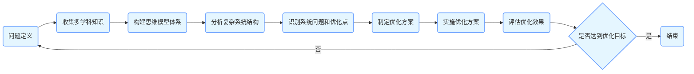

# 芒格的"清晰思考"方法在复杂系统优化中的运用

> 关键词：芒格、清晰思考方法、复杂系统优化、思维模型、决策

> 摘要：本文深入探讨了芒格的“清晰思考”方法在复杂系统优化中的运用。首先介绍了相关背景，包括目的、预期读者等内容。接着阐述了核心概念，剖析了芒格“清晰思考”方法的原理及与复杂系统优化的联系。通过Python代码详细讲解了核心算法原理与具体操作步骤，并给出相关数学模型和公式。结合项目实战案例，展示了如何将该方法应用于实际系统优化中。同时介绍了该方法的实际应用场景、推荐了相关工具和资源。最后总结了未来发展趋势与挑战，提供常见问题解答和扩展阅读参考资料，旨在为读者全面呈现芒格“清晰思考”方法在复杂系统优化中的价值与应用路径。

## 1. 背景介绍 
### 1.1 目的和范围
在当今科技飞速发展的时代，复杂系统无处不在，如交通系统、金融系统、生态系统等。这些系统内部结构复杂、元素众多且相互关联，对其进行优化面临着巨大的挑战。芒格的“清晰思考”方法以其独特的思维视角和逻辑体系，为复杂系统优化提供了新的思路和方法。本文的目的在于深入研究芒格的“清晰思考”方法，并探讨如何将其有效地应用于复杂系统优化中，以提高系统的性能和效率。本文的范围涵盖了对芒格“清晰思考”方法的理论分析、算法原理阐述、实际案例应用以及未来发展趋势的探讨等方面。

### 1.2 预期读者
本文预期读者包括对复杂系统优化感兴趣的科研人员、工程师、系统分析师、项目管理者等。同时，对于希望提升自身思维能力和决策水平的人士，以及对芒格的思想和方法有深入研究需求的爱好者，本文也具有一定的参考价值。

### 1.3 文档结构概述
本文首先介绍背景信息，包括目的、预期读者和文档结构概述等内容。接着阐述核心概念，分析芒格“清晰思考”方法的原理及其与复杂系统优化的联系，并给出相应的示意图和流程图。然后详细讲解核心算法原理，用Python代码展示具体操作步骤。之后介绍相关的数学模型和公式，并举例说明。通过项目实战案例，展示该方法在实际系统优化中的应用过程和效果。再介绍该方法的实际应用场景和推荐相关的工具、资源。最后总结未来发展趋势与挑战，提供常见问题解答和扩展阅读参考资料。

### 1.4 术语表
#### 1.4.1 核心术语定义
- **芒格的“清晰思考”方法**：指查理·芒格所倡导的一种综合运用多学科知识和思维模型，以理性、客观、全面的方式进行思考和决策的方法。
- **复杂系统**：由大量相互作用的组件或元素组成，具有高度的非线性、动态性和不确定性，其行为和特性难以通过简单的分析和预测来理解和掌握的系统。
- **系统优化**：通过对系统的结构、参数、运行策略等进行调整和改进，以提高系统的性能、效率、可靠性等目标的过程。

#### 1.4.2 相关概念解释
- **思维模型**：是一种简化的、抽象的认知框架，用于帮助人们理解和处理复杂的信息和问题。芒格强调要掌握多种不同学科的思维模型，以更全面地看待问题。
- **多学科知识**：涉及多个不同学科领域的知识，如数学、物理学、生物学、心理学、经济学等。在复杂系统优化中，综合运用多学科知识可以从不同角度分析和解决问题。

#### 1.4.3 缩略词列表
无

## 2. 核心概念与联系 

### 芒格“清晰思考”方法的原理
芒格的“清晰思考”方法强调要建立多元的思维模型体系。他认为，不同学科的知识和思维方式可以相互补充和印证，从而帮助我们更全面、深入地理解问题。例如，在分析一个经济现象时，不仅要运用经济学的知识，还可以结合心理学、社会学等学科的观点，以更准确地把握其本质和影响因素。

这种方法的核心在于理性和客观。芒格主张在思考过程中要避免受到情绪、偏见等因素的干扰，以事实和数据为依据进行判断和决策。同时，他也强调要从多个角度看待问题，不局限于单一的思维模式，这样才能发现问题的全貌和潜在的解决方案。

### 复杂系统优化的本质
复杂系统优化的目标是提高系统的整体性能和效率，使其更好地满足特定的需求和目标。复杂系统通常具有高度的非线性和动态性，其内部元素之间存在着复杂的相互作用关系。因此，优化过程需要综合考虑系统的各种因素和约束条件，通过调整系统的结构、参数或运行策略等方式，来实现系统性能的提升。

### 两者的联系
芒格的“清晰思考”方法与复杂系统优化有着紧密的联系。复杂系统的复杂性决定了单一学科的知识和方法往往难以有效地解决问题，而芒格的多元思维模型体系可以为复杂系统优化提供更全面、丰富的视角和方法。通过运用不同学科的思维模型，我们可以更深入地理解复杂系统的内部结构和运行机制，发现系统中存在的问题和潜在的优化点。

同时，芒格强调的理性和客观思考方式，对于在复杂系统优化过程中做出准确的判断和决策至关重要。在面对复杂系统的不确定性和复杂性时，保持理性和客观可以帮助我们避免盲目决策，提高优化方案的可行性和有效性。

### 文本示意图
芒格的“清晰思考”方法就像一个多面的镜子，它从不同的学科领域反射出各种知识和思维方式。这些知识和思维方式汇聚在一起，形成一个强大的思维框架。而复杂系统则像是一个充满各种元素和相互作用的迷宫。在这个迷宫中，我们需要借助芒格的“清晰思考”方法这面多面镜，从不同的角度去观察和分析迷宫的结构和路径，从而找到优化系统的最佳方案。

### Mermaid 流程图


## 3. 核心算法原理 & 具体操作步骤 

### 核心算法原理
芒格的“清晰思考”方法在复杂系统优化中的核心算法原理可以概括为以下几个步骤：
1. **问题定义**：明确复杂系统需要优化的具体问题和目标。这一步骤需要对系统进行全面的调研和分析，了解系统的现状、运行机制以及存在的问题。
2. **多学科知识收集**：收集与复杂系统相关的多个学科领域的知识和信息。例如，对于一个交通系统的优化，可能需要收集数学、物理学、计算机科学、社会学、经济学等学科的知识。
3. **思维模型构建**：根据收集到的多学科知识，构建相应的思维模型。每个思维模型代表一种特定的思考方式和分析角度，可以帮助我们从不同的方面理解和解决问题。
4. **系统分析**：运用构建的思维模型对复杂系统进行全面的分析。通过不同思维模型的交叉验证和综合运用，深入了解系统的内部结构、元素之间的相互作用关系以及系统的动态变化规律。
5. **问题识别**：在系统分析的基础上，识别出复杂系统中存在的问题和潜在的优化点。这些问题和优化点可能涉及系统的结构、参数、运行策略等多个方面。
6. **方案制定**：根据识别出的问题和优化点，制定相应的优化方案。优化方案需要综合考虑系统的各种约束条件和目标要求，确保方案的可行性和有效性。
7. **方案实施**：将制定好的优化方案应用到复杂系统中，对系统进行实际的调整和改进。
8. **效果评估**：对优化方案的实施效果进行评估。通过对比优化前后系统的性能指标和运行状态，判断优化方案是否达到了预期的目标。
9. **迭代优化**：如果优化方案没有达到预期的目标，需要对问题进行重新定义和分析，调整思维模型和优化方案，进行新一轮的优化迭代，直到达到优化目标为止。

### 具体操作步骤（Python 源代码示例）
以下是一个简单的 Python 代码示例，模拟了芒格的“清晰思考”方法在复杂系统优化中的应用过程。假设我们要优化一个简单的库存管理系统，目标是降低库存成本并提高库存周转率。

```python
# 步骤 1: 问题定义
# 假设我们已知当前库存管理系统的一些基本信息，如库存成本、库存周转率等
current_inventory_cost = 10000
current_inventory_turnover = 2

# 我们的优化目标是降低库存成本 20%，并将库存周转率提高到 3
target_inventory_cost = current_inventory_cost * 0.8
target_inventory_turnover = 3

# 步骤 2: 多学科知识收集
# 这里我们简单模拟收集到的一些与库存管理相关的知识，如需求预测模型、采购成本模型等
# 假设需求预测模型是一个简单的线性函数，根据历史数据预测未来需求
def demand_forecast(historical_data, time_step):
    # 简单的线性预测，这里只是示例，实际情况可能更复杂
    slope = (historical_data[-1] - historical_data[0]) / (len(historical_data) - 1)
    return historical_data[-1] + slope * time_step

# 假设采购成本模型是一个固定成本加上可变成本的函数
def procurement_cost(quantity, fixed_cost, variable_cost):
    return fixed_cost + quantity * variable_cost

# 步骤 3: 思维模型构建
# 构建一个库存成本计算模型，考虑采购成本、存储成本等因素
def inventory_cost(quantity, fixed_cost, variable_cost, storage_cost_per_unit):
    procurement = procurement_cost(quantity, fixed_cost, variable_cost)
    storage = quantity * storage_cost_per_unit
    return procurement + storage

# 构建一个库存周转率计算模型
def inventory_turnover(sales_volume, average_inventory):
    return sales_volume / average_inventory

# 步骤 4: 系统分析
# 假设我们有一些历史销售数据
historical_sales = [100, 120, 130, 150]

# 预测下一个时间步的需求
next_demand = demand_forecast(historical_sales, 1)

# 假设固定采购成本为 1000，可变采购成本为 10 元/单位，存储成本为 2 元/单位
fixed_cost = 1000
variable_cost = 10
storage_cost_per_unit = 2

# 步骤 5: 问题识别
# 计算当前库存水平下的库存成本和库存周转率
current_quantity = 200
current_inventory_cost = inventory_cost(current_quantity, fixed_cost, variable_cost, storage_cost_per_unit)
current_sales_volume = historical_sales[-1]
current_inventory_turnover = inventory_turnover(current_sales_volume, current_quantity)

if current_inventory_cost > target_inventory_cost:
    print("当前库存成本过高，需要优化。")
if current_inventory_turnover < target_inventory_turnover:
    print("当前库存周转率过低，需要优化。")

# 步骤 6: 方案制定
# 尝试不同的库存水平，找到满足优化目标的方案
optimal_quantity = None
for quantity in range(100, 300):
    cost = inventory_cost(quantity, fixed_cost, variable_cost, storage_cost_per_unit)
    turnover = inventory_turnover(current_sales_volume, quantity)
    if cost <= target_inventory_cost and turnover >= target_inventory_turnover:
        optimal_quantity = quantity
        break

# 步骤 7: 方案实施
if optimal_quantity is not None:
    print(f"建议将库存水平调整为 {optimal_quantity} 单位。")
else:
    print("未找到满足优化目标的方案，需要进一步分析。")

# 步骤 8: 效果评估
if optimal_quantity is not None:
    new_inventory_cost = inventory_cost(optimal_quantity, fixed_cost, variable_cost, storage_cost_per_unit)
    new_inventory_turnover = inventory_turnover(current_sales_volume, optimal_quantity)
    print(f"调整库存水平后，库存成本为 {new_inventory_cost}，库存周转率为 {new_inventory_turnover}。")
    if new_inventory_cost <= target_inventory_cost and new_inventory_turnover >= target_inventory_turnover:
        print("优化方案达到预期目标。")
    else:
        print("优化方案未达到预期目标，需要进一步调整。")
```

### 代码解释
1. **问题定义**：明确了当前库存管理系统的现状和优化目标，包括库存成本和库存周转率的目标值。
2. **多学科知识收集**：模拟了需求预测模型和采购成本模型，这些模型是从相关学科知识中抽象出来的。
3. **思维模型构建**：构建了库存成本计算模型和库存周转率计算模型，用于分析和评估库存管理系统的性能。
4. **系统分析**：利用历史销售数据预测下一个时间步的需求，并计算当前库存水平下的库存成本和库存周转率。
5. **问题识别**：通过对比当前的库存成本和库存周转率与目标值，识别出系统中存在的问题。
6. **方案制定**：尝试不同的库存水平，找到满足优化目标的方案。
7. **方案实施**：如果找到合适的方案，建议将库存水平调整为相应的值。
8. **效果评估**：计算调整库存水平后的库存成本和库存周转率，评估优化方案是否达到预期目标。

## 4. 数学模型和公式 & 详细讲解 & 举例说明 

### 需求预测模型
在库存管理系统中，需求预测是一个重要的环节。一个简单的线性需求预测模型可以表示为：
$$D_{t+1} = D_t + \frac{D_t - D_0}{t} \times 1$$
其中，$D_{t+1}$ 是下一个时间步的需求预测值，$D_t$ 是当前时间步的需求值，$D_0$ 是初始时间步的需求值，$t$ 是时间步数。

**详细讲解**：这个公式的原理是基于历史需求数据的变化趋势进行线性外推。通过计算历史需求数据的斜率，预测下一个时间步的需求值。

**举例说明**：假设历史销售数据为 $[100, 120, 130, 150]$，当前时间步 $t = 3$，$D_0 = 100$，$D_t = 150$。则下一个时间步的需求预测值为：
$$D_{4} = 150 + \frac{150 - 100}{3} \times 1 \approx 166.67$$

### 采购成本模型
采购成本模型可以表示为：
$$C_p = F + Q \times V$$
其中，$C_p$ 是采购成本，$F$ 是固定采购成本，$Q$ 是采购数量，$V$ 是可变采购成本。

**详细讲解**：这个公式表示采购成本由固定成本和可变成本两部分组成。固定成本不随采购数量的变化而变化，而可变成本与采购数量成正比。

**举例说明**：假设固定采购成本 $F = 1000$ 元，可变采购成本 $V = 10$ 元/单位，采购数量 $Q = 200$ 单位。则采购成本为：
$$C_p = 1000 + 200 \times 10 = 3000$$ 元

### 库存成本模型
库存成本模型可以表示为：
$$C_i = C_p + Q \times S$$
其中，$C_i$ 是库存成本，$C_p$ 是采购成本，$Q$ 是库存数量，$S$ 是单位存储成本。

**详细讲解**：库存成本包括采购成本和存储成本两部分。存储成本与库存数量成正比。

**举例说明**：假设采购成本 $C_p = 3000$ 元，库存数量 $Q = 200$ 单位，单位存储成本 $S = 2$ 元/单位。则库存成本为：
$$C_i = 3000 + 200 \times 2 = 3400$$ 元

### 库存周转率模型
库存周转率模型可以表示为：
$$I_t = \frac{S_v}{A_i}$$
其中，$I_t$ 是库存周转率，$S_v$ 是销售数量，$A_i$ 是平均库存数量。

**详细讲解**：库存周转率反映了库存的周转速度，即一定时期内库存的销售次数。

**举例说明**：假设销售数量 $S_v = 150$ 单位，平均库存数量 $A_i = 200$ 单位。则库存周转率为：
$$I_t = \frac{150}{200} = 0.75$$

## 5. 项目实战：代码实际案例和详细解释说明 

### 5.1  开发环境搭建
本项目实战使用 Python 语言进行开发，以下是搭建开发环境的步骤：
1. **安装 Python**：从 Python 官方网站（https://www.python.org/downloads/）下载并安装适合你操作系统的 Python 版本。建议安装 Python 3.6 及以上版本。
2. **安装开发工具**：可以选择使用 PyCharm、Visual Studio Code 等集成开发环境（IDE），也可以使用简单的文本编辑器如 Sublime Text 或 Notepad++ 结合命令行工具进行开发。
3. **安装必要的库**：本项目主要使用 Python 的内置库，无需额外安装其他库。

### 5.2  源代码详细实现和代码解读
以下是一个更完整的项目实战代码示例，用于优化一个更复杂的库存管理系统，考虑了多个时间步的需求变化和不同的采购策略。

```python
import numpy as np

# 步骤 1: 问题定义
# 初始库存成本和库存周转率
current_inventory_cost = 15000
current_inventory_turnover = 1.5

# 优化目标
target_inventory_cost = current_inventory_cost * 0.7
target_inventory_turnover = 2.5

# 步骤 2: 多学科知识收集
# 历史销售数据
historical_sales = np.array([120, 130, 140, 150, 160])

# 需求预测模型（线性回归）
def demand_forecast(historical_data, time_steps):
    x = np.arange(len(historical_data))
    slope, intercept = np.polyfit(x, historical_data, 1)
    future_x = np.arange(len(historical_data), len(historical_data) + time_steps)
    return slope * future_x + intercept

# 采购成本模型
def procurement_cost(quantity, fixed_cost, variable_cost):
    return fixed_cost + quantity * variable_cost

# 存储成本模型
def storage_cost(quantity, storage_cost_per_unit):
    return quantity * storage_cost_per_unit

# 步骤 3: 思维模型构建
# 库存成本计算模型
def inventory_cost(quantity, fixed_cost, variable_cost, storage_cost_per_unit):
    procurement = procurement_cost(quantity, fixed_cost, variable_cost)
    storage = storage_cost(quantity, storage_cost_per_unit)
    return procurement + storage

# 库存周转率计算模型
def inventory_turnover(sales_volume, average_inventory):
    return sales_volume / average_inventory

# 步骤 4: 系统分析
# 预测未来 5 个时间步的需求
future_demands = demand_forecast(historical_sales, 5)

# 固定采购成本、可变采购成本和存储成本
fixed_cost = 1500
variable_cost = 12
storage_cost_per_unit = 3

# 初始库存数量
initial_inventory = 250

# 步骤 5: 问题识别
# 计算当前库存水平下的库存成本和库存周转率
current_sales_volume = historical_sales[-1]
current_inventory_cost = inventory_cost(initial_inventory, fixed_cost, variable_cost, storage_cost_per_unit)
current_inventory_turnover = inventory_turnover(current_sales_volume, initial_inventory)

if current_inventory_cost > target_inventory_cost:
    print("当前库存成本过高，需要优化。")
if current_inventory_turnover < target_inventory_turnover:
    print("当前库存周转率过低，需要优化。")

# 步骤 6: 方案制定
# 尝试不同的采购策略，找到满足优化目标的方案
best_cost = float('inf')
best_turnover = 0
best_strategy = None

for order_quantity in range(100, 300, 10):
    inventory = initial_inventory
    total_cost = 0
    total_sales = 0
    for demand in future_demands:
        if inventory < demand:
            inventory += order_quantity
            total_cost += inventory_cost(order_quantity, fixed_cost, variable_cost, storage_cost_per_unit)
        sales = min(inventory, demand)
        inventory -= sales
        total_sales += sales
    average_inventory = (initial_inventory + inventory) / 2
    cost = total_cost
    turnover = total_sales / average_inventory
    if cost <= target_inventory_cost and turnover >= target_inventory_turnover and cost < best_cost:
        best_cost = cost
        best_turnover = turnover
        best_strategy = order_quantity

# 步骤 7: 方案实施
if best_strategy is not None:
    print(f"建议采用的采购策略是每次采购 {best_strategy} 单位。")
else:
    print("未找到满足优化目标的方案，需要进一步分析。")

# 步骤 8: 效果评估
if best_strategy is not None:
    inventory = initial_inventory
    total_cost = 0
    total_sales = 0
    for demand in future_demands:
        if inventory < demand:
            inventory += best_strategy
            total_cost += inventory_cost(best_strategy, fixed_cost, variable_cost, storage_cost_per_unit)
        sales = min(inventory, demand)
        inventory -= sales
        total_sales += sales
    average_inventory = (initial_inventory + inventory) / 2
    new_inventory_cost = total_cost
    new_inventory_turnover = total_sales / average_inventory
    print(f"采用新的采购策略后，库存成本为 {new_inventory_cost}，库存周转率为 {new_inventory_turnover}。")
    if new_inventory_cost <= target_inventory_cost and new_inventory_turnover >= target_inventory_turnover:
        print("优化方案达到预期目标。")
    else:
        print("优化方案未达到预期目标，需要进一步调整。")
```

### 5.3  代码解读与分析
1. **问题定义**：明确了当前库存管理系统的现状和优化目标，包括库存成本和库存周转率的目标值。
2. **多学科知识收集**：使用历史销售数据进行需求预测，采用线性回归模型预测未来多个时间步的需求。同时定义了采购成本模型和存储成本模型。
3. **思维模型构建**：构建了库存成本计算模型和库存周转率计算模型，用于分析和评估库存管理系统的性能。
4. **系统分析**：预测未来 5 个时间步的需求，计算当前库存水平下的库存成本和库存周转率，识别系统中存在的问题。
5. **方案制定**：尝试不同的采购策略，通过模拟未来多个时间步的库存变化，找到满足优化目标的最佳采购策略。
6. **方案实施**：如果找到合适的采购策略，建议采用该策略进行库存管理。
7. **效果评估**：模拟采用新的采购策略后的库存变化，计算新的库存成本和库存周转率，评估优化方案是否达到预期目标。

## 6. 实际应用场景 
### 供应链管理
在供应链管理中，复杂系统涉及到供应商、制造商、分销商、零售商等多个环节，各环节之间相互关联、相互影响。芒格的“清晰思考”方法可以帮助供应链管理者从多个角度分析供应链的结构和运行机制，识别出潜在的问题和优化点。例如，通过运用经济学的成本效益分析模型、物流学的运输优化模型、管理学的流程优化模型等，制定出更合理的采购计划、生产计划和配送计划，从而降低供应链成本，提高供应链的响应速度和灵活性。

### 城市交通规划
城市交通系统是一个典型的复杂系统，包括道路网络、交通工具、交通流量、交通管理等多个要素。运用芒格的“清晰思考”方法，可以综合考虑城市地理、人口分布、经济发展等多方面因素，对交通系统进行全面的分析和优化。例如，结合数学的图论模型分析道路网络的拓扑结构，运用统计学的数据分析方法预测交通流量，借鉴心理学的行为模型了解驾驶员和行人的行为特点，从而制定出更科学合理的交通规划方案，缓解交通拥堵，提高交通效率。

### 金融风险管理
金融市场是一个高度复杂和不确定的系统，涉及到各种金融产品、投资者行为、宏观经济环境等多个因素。芒格的“清晰思考”方法可以帮助金融机构和投资者更全面、深入地理解金融市场的运行规律，识别和评估金融风险。例如，运用经济学的宏观经济模型分析宏观经济环境对金融市场的影响，使用统计学的风险度量模型评估投资组合的风险水平，结合心理学的行为金融理论分析投资者的心理和行为偏差，从而制定出更有效的风险管理策略，降低金融风险，提高投资收益。

### 生态系统保护
生态系统是一个复杂的生物群落与非生物环境相互作用的系统，包括生物多样性、生态平衡、生态服务等多个方面。在生态系统保护中，芒格的“清晰思考”方法可以帮助生态学家和决策者从多个学科的角度分析生态系统的结构和功能，制定出更科学合理的保护措施。例如，运用生物学的生态位理论分析物种之间的竞争和共生关系，使用地理学的空间分析方法研究生态系统的空间分布特征，借鉴社会学的公众参与理论促进公众对生态保护的参与和支持，从而实现生态系统的可持续发展。

## 7. 工具和资源推荐
### 7.1 学习资源推荐
#### 7.1.1 书籍推荐
- 《穷查理宝典：查理·芒格的智慧箴言录》：这是一本全面介绍查理·芒格的思想、方法和智慧的书籍，书中包含了芒格的演讲、文章和访谈等内容，深入阐述了他的多元思维模型体系和“清晰思考”方法。
- 《思考，快与慢》：作者丹尼尔·卡尼曼是行为经济学领域的大师，本书介绍了人类思维的两种模式——快思考和慢思考，以及它们在决策过程中的作用和影响。对于理解芒格强调的理性思考和避免思维偏差具有重要的参考价值。
- 《系统之美：决策者的系统思考》：这本书介绍了系统思考的基本概念、方法和工具，帮助读者理解复杂系统的结构和行为，以及如何运用系统思考的方法解决实际问题。对于在复杂系统优化中运用芒格的“清晰思考”方法具有重要的指导意义。

#### 7.1.2 在线课程
- Coursera 上的“Decision Making in Complex Environments”：该课程介绍了在复杂环境中进行决策的方法和策略，结合了多学科的知识和案例分析，对于理解和应用芒格的“清晰思考”方法在复杂系统优化中的决策过程具有很大的帮助。
- edX 上的“Systems Thinking and Modeling”：该课程系统地介绍了系统思考和建模的基本理论和方法，通过实际案例和实践项目，帮助学员掌握如何运用系统思考的方法分析和解决复杂系统问题。

#### 7.1.3 技术博客和网站
- Farnam Street：这是一个专注于分享思维模型和决策方法的博客网站，其中包含了大量关于芒格的思想和方法的文章和讨论，以及如何将这些方法应用于实际生活和工作中的案例分析。
- LessWrong：该网站致力于探讨理性思考、决策理论和认知科学等领域的问题，提供了许多关于如何避免思维偏差、提高思考效率的文章和资源，对于深入理解芒格的“清晰思考”方法具有重要的参考价值。

### 7.2 开发工具框架推荐
#### 7.2.1 IDE和编辑器
- PyCharm：是一款专门为 Python 开发设计的集成开发环境，具有强大的代码编辑、调试、自动完成等功能，适合初学者和专业开发者使用。
- Visual Studio Code：是一款轻量级的开源代码编辑器，支持多种编程语言和插件扩展，具有丰富的代码编辑和调试功能，可用于 Python 开发和复杂系统优化项目的开发。

#### 7.2.2 调试和性能分析工具
- PDB：是 Python 的内置调试器，可以帮助开发者在代码执行过程中进行调试和定位问题。
- cProfile：是 Python 的性能分析工具，可以帮助开发者分析代码的性能瓶颈，优化代码的执行效率。

#### 7.2.3 相关框架和库
- NumPy：是 Python 的一个科学计算库，提供了高效的数组操作和数学函数，可用于复杂系统优化中的数值计算和数据分析。
- Pandas：是 Python 的一个数据处理和分析库，提供了灵活的数据结构和数据处理方法，可用于复杂系统优化中的数据清洗、整理和分析。

### 7.3 相关论文著作推荐
#### 7.3.1 经典论文
- Simon, H. A. (1962). The architecture of complexity. Proceedings of the American Philosophical Society, 106(6), 467 - 482. 这篇论文探讨了复杂系统的结构和组织方式，提出了层次结构和近可分解性的概念，对于理解复杂系统的本质和优化方法具有重要的理论基础。
- Forrester, J. W. (1961). Industrial dynamics. MIT Press. 这本书介绍了系统动力学的基本理论和方法，通过建立系统的动态模型，分析系统的行为和变化趋势，对于复杂系统优化中的建模和分析具有重要的指导意义。

#### 7.3.2 最新研究成果
- Epstein, J. M. (2006). Generative social science: Studies in agent - based computational modeling. Princeton University Press. 这本书介绍了基于智能体的计算建模方法，通过模拟复杂系统中个体的行为和相互作用，研究复杂系统的涌现现象和演化规律，为复杂系统优化提供了新的研究视角和方法。
- Bar - Yam, Y. (2004). Making things work: Solving complex problems in a complex world. NECSI. 这本书探讨了在复杂世界中解决复杂问题的方法和策略，结合了系统科学、复杂性理论和工程实践，对于将芒格的“清晰思考”方法应用于复杂系统优化具有重要的参考价值。

#### 7.3.3 应用案例分析
- Sterman, J. D. (2000). Business dynamics: Systems thinking and modeling for a complex world. McGraw - Hill. 这本书通过大量的商业案例分析，介绍了如何运用系统思考和建模的方法解决企业中的复杂问题，如供应链管理、市场营销、战略规划等，对于理解芒格的“清晰思考”方法在实际商业系统优化中的应用具有重要的借鉴意义。
- Meadows, D. H., Randers, J., & Meadows, D. L. (2004). Limits to growth: The 30 - year update. Chelsea Green Publishing. 这本书通过建立全球系统模型，分析了人口、资源、环境等因素之间的相互作用和影响，探讨了可持续发展的问题和对策，对于将芒格的“清晰思考”方法应用于全球复杂系统优化具有重要的启示作用。

## 8. 总结：未来发展趋势与挑战
### 未来发展趋势
1. **跨学科融合的深入发展**：随着科技的不断进步和社会的不断发展，复杂系统的复杂性和不确定性将不断增加。未来，芒格的“清晰思考”方法将更加注重跨学科知识的融合和应用，不仅仅局限于传统的学科领域，还将涉及到新兴的学科和技术，如人工智能、大数据、物联网等。通过跨学科的合作和创新，将能够更全面、深入地理解和解决复杂系统问题。
2. **智能化和自动化的应用**：人工智能和机器学习技术的发展将为芒格的“清晰思考”方法在复杂系统优化中的应用带来新的机遇。未来，可能会开发出智能化的决策支持系统，能够自动收集和分析多学科的知识和数据，运用多元思维模型进行推理和决策，从而提高复杂系统优化的效率和准确性。
3. **强调可持续发展**：在全球面临资源短缺、环境污染等问题的背景下，复杂系统优化将更加注重可持续发展的目标。芒格的“清晰思考”方法将有助于在复杂系统优化中综合考虑经济、社会和环境等多方面的因素，制定出更加可持续的发展策略和方案。

### 挑战
1. **知识整合的难度**：芒格的“清晰思考”方法强调多元思维模型的构建和应用，需要掌握多个学科的知识和方法。然而，不同学科之间的知识体系和思维方式存在较大的差异，如何有效地整合这些知识，构建一个有机的思维模型体系，是一个具有挑战性的问题。
2. **数据质量和可用性**：在复杂系统优化中，需要大量的高质量数据来支持分析和决策。然而，实际情况中，数据的质量和可用性往往存在问题，如数据缺失、数据不准确、数据不一致等。如何解决数据质量和可用性问题，是应用芒格的“清晰思考”方法进行复杂系统优化的关键挑战之一。
3. **人类思维的局限性**：尽管芒格的“清晰思考”方法强调理性和客观思考，但人类的思维仍然存在一定的局限性，如认知偏差、情绪影响等。在实际应用中，如何克服这些思维局限性，确保决策的科学性和合理性，是一个需要不断探索和解决的问题。

## 9. 附录：常见问题与解答
### 问题 1：芒格的“清晰思考”方法适用于所有类型的复杂系统吗？
解答：芒格的“清晰思考”方法具有一定的通用性，但并不是适用于所有类型的复杂系统。不同类型的复杂系统具有不同的特点和规律，需要根据具体情况进行调整和应用。例如，对于一些具有高度不确定性和非线性的复杂系统，可能需要结合更高级的建模和分析方法。

### 问题 2：如何构建有效的多元思维模型体系？
解答：构建有效的多元思维模型体系需要以下几个步骤：首先，广泛学习不同学科的知识和方法，了解各个学科的基本原理和思维方式。其次，将所学的知识和方法进行分类和整理，提炼出关键的思维模型。最后，通过实践和应用，不断完善和优化思维模型体系，使其更加符合实际需求。

### 问题 3：在复杂系统优化中，如何平衡不同学科知识和思维模型的应用？
解答：在复杂系统优化中，平衡不同学科知识和思维模型的应用需要根据具体问题和目标进行综合考虑。首先，要明确问题的核心和关键因素，选择与之相关的学科知识和思维模型。其次，要考虑不同学科知识和思维模型之间的相互关系和协同作用，避免出现冲突和矛盾。最后，要通过实践和反馈，不断调整和优化知识和思维模型的应用策略。

### 问题 4：如何评估芒格的“清晰思考”方法在复杂系统优化中的效果？
解答：评估芒格的“清晰思考”方法在复杂系统优化中的效果可以从多个方面进行。首先，可以通过对比优化前后系统的性能指标和运行状态，如成本、效率、可靠性等，来评估优化的效果。其次，可以通过用户满意度调查、专家评估等方式，了解相关人员对优化方案的认可程度。最后，还可以通过长期的跟踪和监测，评估优化方案的可持续性和稳定性。

## 10. 扩展阅读 & 参考资料
1. 《从优秀到卓越》，[美]吉姆·柯林斯著，中信出版社。
2. 《创新者的窘境》，[美]克莱顿·克里斯坦森著，中信出版社。
3. 《失控：全人类的最终命运和结局》，[美]凯文·凯利著，新星出版社。
4. 维基百科中关于查理·芒格、复杂系统、系统优化等相关词条。
5. 相关学术期刊如《系统工程理论与实践》《管理科学学报》等发表的关于复杂系统优化和思维方法的研究论文。