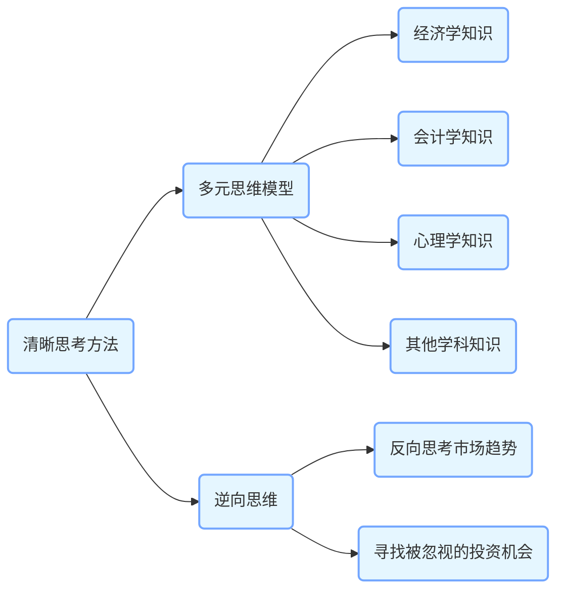

# 芒格的"清晰思考"方法：提高投资分析的准确性

> 关键词：芒格、清晰思考方法、投资分析、准确性、多元思维模型

> 摘要：本文聚焦于芒格的“清晰思考”方法及其在提高投资分析准确性方面的应用。详细介绍了该方法的背景，包括目的、预期读者、文档结构和相关术语。深入剖析了“清晰思考”方法的核心概念与联系，阐述其核心算法原理并给出具体操作步骤，同时运用数学模型和公式进行详细讲解与举例。通过项目实战案例，展示该方法在实际投资分析中的应用。探讨了其实际应用场景，推荐了相关的学习资源、开发工具框架以及论文著作。最后总结了该方法的未来发展趋势与挑战，解答常见问题，并提供扩展阅读与参考资料，旨在帮助投资者运用芒格的“清晰思考”方法提升投资分析能力。

## 1. 背景介绍 
### 1.1 目的和范围
在投资领域，准确的分析是做出明智决策的关键。然而，市场的复杂性和不确定性使得投资分析充满挑战。查理·芒格作为投资界的传奇人物，他所倡导的“清晰思考”方法为提高投资分析的准确性提供了独特而有效的途径。本文的目的在于深入探讨芒格的“清晰思考”方法，详细阐述其原理、操作步骤和应用场景，帮助投资者更好地理解和运用这一方法，从而提升投资分析的质量和决策的准确性。

本文的范围涵盖了“清晰思考”方法的理论基础、实际操作以及在投资分析中的具体应用。我们将从核心概念的解读入手，逐步深入到算法原理、数学模型和实际案例分析，最后探讨该方法在不同投资场景中的应用以及未来的发展趋势。

### 1.2 预期读者
本文的预期读者主要包括以下几类人群：
1. **投资者**：无论是个人投资者还是专业投资机构的从业者，都希望通过更科学、准确的投资分析方法来提高投资回报率。芒格的“清晰思考”方法能够为他们提供新的思路和工具，帮助他们在复杂的市场环境中做出更明智的投资决策。
2. **金融分析师**：金融分析师需要对各种投资标的进行深入分析和评估。掌握“清晰思考”方法可以提升他们的分析能力和专业水平，使他们能够更准确地预测市场走势和企业价值。
3. **投资爱好者**：对投资领域感兴趣的人士，希望通过学习和了解投资分析的方法和技巧，提高自己的投资素养和能力。本文将为他们提供一个系统学习芒格投资思想和方法的平台。
4. **学生和研究人员**：金融、经济等相关专业的学生以及从事投资领域研究的人员，可以从本文中获取关于投资分析方法的最新研究成果和实践经验，为他们的学习和研究提供参考。

### 1.3 文档结构概述
本文将按照以下结构进行组织：
1. **背景介绍**：介绍本文的目的、范围、预期读者、文档结构概述以及相关术语。
2. **核心概念与联系**：深入解读芒格“清晰思考”方法的核心概念，包括多元思维模型、逆向思维等，并分析它们之间的联系。通过文本示意图和 Mermaid 流程图展示其架构。
3. **核心算法原理 & 具体操作步骤**：阐述“清晰思考”方法的核心算法原理，并给出具体的操作步骤。运用 Python 源代码详细阐述算法的实现过程。
4. **数学模型和公式 & 详细讲解 & 举例说明**：介绍与“清晰思考”方法相关的数学模型和公式，对其进行详细讲解，并通过具体的例子说明如何应用这些模型和公式进行投资分析。
5. **项目实战：代码实际案例和详细解释说明**：通过一个实际的投资分析项目，展示“清晰思考”方法的具体应用。包括开发环境搭建、源代码详细实现和代码解读。
6. **实际应用场景**：探讨“清晰思考”方法在不同投资场景中的应用，如股票投资、债券投资、基金投资等。
7. **工具和资源推荐**：推荐与“清晰思考”方法相关的学习资源、开发工具框架以及论文著作，帮助读者进一步深入学习和研究。
8. **总结：未来发展趋势与挑战**：总结“清晰思考”方法的优势和不足，分析其未来的发展趋势和面临的挑战。
9. **附录：常见问题与解答**：解答读者在学习和应用“清晰思考”方法过程中常见的问题。
10. **扩展阅读 & 参考资料**：提供相关的扩展阅读材料和参考资料，方便读者进一步深入学习和研究。

### 1.4 术语表
#### 1.4.1 核心术语定义
1. **清晰思考**：指在投资分析过程中，运用科学的思维方法和逻辑推理，排除干扰因素，准确地理解和评估投资标的的价值和风险。
2. **多元思维模型**：芒格提出的一种思维方式，主张从多个学科的角度去分析问题，综合运用不同学科的知识和方法，以获得更全面、准确的认识。
3. **逆向思维**：与正向思维相反，从问题的反面去思考和分析，寻找解决问题的新途径和方法。在投资分析中，逆向思维可以帮助投资者发现被市场忽视的投资机会。
4. **投资分析**：对投资标的的价值、风险、收益等方面进行评估和分析的过程，为投资决策提供依据。

#### 1.4.2 相关概念解释
1. **学科知识**：包括但不限于经济学、金融学、会计学、心理学、物理学、生物学等学科的知识。在投资分析中，不同学科的知识可以为我们提供不同的视角和方法。
2. **逻辑推理**：运用逻辑规则和方法，从已知的事实和前提中推导出结论的过程。在投资分析中，逻辑推理可以帮助我们分析和判断投资标的的价值和风险。
3. **市场有效性**：指市场价格能够充分反映所有可用信息的程度。在有效市场中，投资者很难通过分析公开信息获得超额收益。

#### 1.4.3 缩略词列表
本文不涉及缩略词。

## 2. 核心概念与联系 

### 核心概念原理
芒格的“清晰思考”方法建立在多元思维模型和逆向思维的基础之上。

#### 多元思维模型
多元思维模型是芒格“清晰思考”方法的核心之一。芒格认为，世界是复杂的，单一学科的知识和方法往往无法全面、准确地理解和解决问题。因此，他主张投资者应该掌握多个学科的知识，构建一个多元的思维模型。

不同学科的知识可以为我们提供不同的视角和方法。例如，经济学可以帮助我们分析市场的供求关系和价格走势；会计学可以帮助我们了解企业的财务状况和经营业绩；心理学可以帮助我们理解投资者的行为和市场情绪。通过综合运用不同学科的知识，我们可以更全面、准确地评估投资标的的价值和风险。

#### 逆向思维
逆向思维是芒格“清晰思考”方法的另一个重要组成部分。逆向思维要求我们从问题的反面去思考和分析，寻找解决问题的新途径和方法。在投资分析中，逆向思维可以帮助我们发现被市场忽视的投资机会。

例如，当市场上大多数投资者都看好某只股票时，我们可以运用逆向思维，思考这只股票是否存在被高估的风险；当市场上大多数投资者都看空某只股票时，我们可以思考这只股票是否存在被低估的机会。通过逆向思维，我们可以避免盲目跟风，做出更理性的投资决策。

### 架构的文本示意图
```plaintext
清晰思考方法
|-- 多元思维模型
|   |-- 经济学知识
|   |-- 会计学知识
|   |-- 心理学知识
|   |-- 其他学科知识
|-- 逆向思维
|   |-- 反向思考市场趋势
|   |-- 寻找被忽视的投资机会
```

### Mermaid 流程图


## 3. 核心算法原理 & 具体操作步骤 

### 核心算法原理
芒格的“清晰思考”方法的核心算法原理可以概括为以下几点：
1. **收集信息**：从多个渠道收集与投资标的相关的信息，包括财务报表、行业报告、新闻资讯等。
2. **构建多元思维模型**：运用多个学科的知识和方法，对收集到的信息进行分析和评估。
3. **逆向思维分析**：从问题的反面去思考和分析，寻找被市场忽视的投资机会。
4. **综合评估**：综合考虑多元思维模型和逆向思维分析的结果，对投资标的的价值和风险进行评估。
5. **决策制定**：根据综合评估的结果，制定投资决策。

### 具体操作步骤

#### 步骤 1：收集信息
使用 Python 代码可以通过网络爬虫技术从多个网站收集与投资标的相关的信息。以下是一个简单的示例代码，用于从财经网站收集股票的基本信息：

```python
import requests
from bs4 import BeautifulSoup

def get_stock_info(stock_code):
    url = f'https://example.com/stock/{stock_code}'  # 替换为实际的财经网站 URL
    response = requests.get(url)
    if response.status_code == 200:
        soup = BeautifulSoup(response.text, 'html.parser')
        # 解析网页内容，提取所需信息
        name = soup.find('span', class_='stock-name').text
        price = soup.find('span', class_='stock-price').text
        return {'name': name, 'price': price}
    else:
        return None

stock_code = '600001'
stock_info = get_stock_info(stock_code)
if stock_info:
    print(f"股票名称: {stock_info['name']}，当前价格: {stock_info['price']}")
else:
    print("获取信息失败")
```

#### 步骤 2：构建多元思维模型
在收集到信息后，我们可以运用不同学科的知识和方法对其进行分析。例如，运用经济学知识分析市场的供求关系和价格走势，运用会计学知识分析企业的财务状况和经营业绩。

```python
# 假设我们已经收集到了企业的财务数据
financial_data = {
    'revenue': 1000000,  # 营业收入
    'cost': 800000,  # 营业成本
    'profit': 200000  # 净利润
}

# 运用会计学知识计算毛利率
gross_margin = (financial_data['revenue'] - financial_data['cost']) / financial_data['revenue']
print(f"毛利率: {gross_margin * 100:.2f}%")
```

#### 步骤 3：逆向思维分析
运用逆向思维，我们可以从问题的反面去思考和分析。例如，当市场上大多数投资者都看好某只股票时，我们可以思考这只股票是否存在被高估的风险。

```python
# 假设市场上大多数投资者都看好某只股票，我们可以从反面思考
# 假设我们通过分析发现该股票的市盈率过高
pe_ratio = 50  # 市盈率
if pe_ratio > 30:
    print("该股票可能被高估，存在投资风险")
else:
    print("该股票的估值相对合理")
```

#### 步骤 4：综合评估
综合考虑多元思维模型和逆向思维分析的结果，对投资标的的价值和风险进行评估。

```python
# 综合考虑毛利率和市盈率等因素
if gross_margin > 0.3 and pe_ratio < 30:
    print("该股票具有较高的投资价值")
else:
    print("该股票的投资价值有待进一步评估")
```

#### 步骤 5：决策制定
根据综合评估的结果，制定投资决策。

```python
# 根据综合评估结果制定投资决策
if gross_margin > 0.3 and pe_ratio < 30:
    decision = "买入"
else:
    decision = "观望"

print(f"投资决策: {decision}")
```

## 4. 数学模型和公式 & 详细讲解 & 举例说明 

### 数学模型和公式

#### 市盈率（PE）
市盈率是衡量股票估值的常用指标之一，其计算公式为：
$$PE = \frac{股价}{每股收益}$$
其中，股价是指股票的当前市场价格，每股收益是指公司每股股票的盈利。

#### 市净率（PB）
市净率是衡量股票估值的另一个重要指标，其计算公式为：
$$PB = \frac{股价}{每股净资产}$$
其中，股价是指股票的当前市场价格，每股净资产是指公司每股股票的净资产。

#### 毛利率
毛利率是衡量企业盈利能力的重要指标之一，其计算公式为：
$$毛利率 = \frac{营业收入 - 营业成本}{营业收入} \times 100\%$$

### 详细讲解
#### 市盈率（PE）
市盈率反映了投资者为获得公司每一元盈利所愿意支付的价格。一般来说，市盈率越高，说明市场对该股票的预期越高，但也可能意味着该股票被高估；市盈率越低，说明市场对该股票的预期越低，但也可能意味着该股票被低估。

#### 市净率（PB）
市净率反映了投资者为获得公司每一元净资产所愿意支付的价格。一般来说，市净率越高，说明市场对该股票的预期越高，但也可能意味着该股票被高估；市净率越低，说明市场对该股票的预期越低，但也可能意味着该股票被低估。

#### 毛利率
毛利率反映了企业在扣除营业成本后，每一元营业收入所能够获得的毛利。毛利率越高，说明企业的盈利能力越强；毛利率越低，说明企业的盈利能力越弱。

### 举例说明
假设某公司的股票当前市场价格为 20 元，每股收益为 1 元，每股净资产为 5 元，营业收入为 1000 万元，营业成本为 600 万元。

#### 计算市盈率
$$PE = \frac{20}{1} = 20$$
这意味着投资者为获得该公司每一元盈利愿意支付 20 元的价格。

#### 计算市净率
$$PB = \frac{20}{5} = 4$$
这意味着投资者为获得该公司每一元净资产愿意支付 4 元的价格。

#### 计算毛利率
$$毛利率 = \frac{1000 - 600}{1000} \times 100\% = 40\%$$
这意味着该公司每一元营业收入能够获得 0.4 元的毛利。

通过对这些指标的分析，我们可以对该公司的股票估值和盈利能力有一个初步的了解。如果市盈率和市净率相对较低，毛利率相对较高，那么该股票可能具有较高的投资价值；反之，如果市盈率和市净率相对较高，毛利率相对较低，那么该股票可能被高估，投资风险较大。

## 5. 项目实战：代码实际案例和详细解释说明 

### 5.1  开发环境搭建
为了实现芒格的“清晰思考”方法在投资分析中的应用，我们需要搭建一个开发环境。以下是具体的步骤：

#### 安装 Python
Python 是一种广泛使用的编程语言，具有丰富的库和工具，非常适合用于数据处理和分析。我们可以从 Python 官方网站（https://www.python.org/downloads/）下载并安装 Python。

#### 安装必要的库
在 Python 中，我们可以使用一些第三方库来帮助我们完成数据收集、处理和分析的任务。以下是一些常用的库：
- **requests**：用于发送 HTTP 请求，获取网页内容。
- **BeautifulSoup**：用于解析 HTML 和 XML 文档，提取所需信息。
- **pandas**：用于数据处理和分析。
- **numpy**：用于数值计算。

可以使用以下命令来安装这些库：
```sh
pip install requests beautifulsoup4 pandas numpy
```

### 5.2  源代码详细实现和代码解读
以下是一个完整的投资分析项目的源代码示例，该项目使用芒格的“清晰思考”方法对某只股票进行分析：

```python
import requests
from bs4 import BeautifulSoup
import pandas as pd
import numpy as np

# 步骤 1：收集信息
def get_stock_info(stock_code):
    url = f'https://example.com/stock/{stock_code}'  # 替换为实际的财经网站 URL
    response = requests.get(url)
    if response.status_code == 200:
        soup = BeautifulSoup(response.text, 'html.parser')
        # 解析网页内容，提取所需信息
        name = soup.find('span', class_='stock-name').text
        price = float(soup.find('span', class_='stock-price').text)
        eps = float(soup.find('span', class_='stock-eps').text)  # 每股收益
        bvps = float(soup.find('span', class_='stock-bvps').text)  # 每股净资产
        revenue = float(soup.find('span', class_='stock-revenue').text)  # 营业收入
        cost = float(soup.find('span', class_='stock-cost').text)  # 营业成本
        return {'name': name, 'price': price, 'eps': eps, 'bvps': bvps, 'revenue': revenue, 'cost': cost}
    else:
        return None

# 步骤 2：构建多元思维模型
def calculate_metrics(stock_info):
    pe_ratio = stock_info['price'] / stock_info['eps']
    pb_ratio = stock_info['price'] / stock_info['bvps']
    gross_margin = (stock_info['revenue'] - stock_info['cost']) / stock_info['revenue']
    return {'pe_ratio': pe_ratio, 'pb_ratio': pb_ratio, 'gross_margin': gross_margin}

# 步骤 3：逆向思维分析
def reverse_analysis(metrics):
    if metrics['pe_ratio'] > 30:
        pe_warning = "该股票市盈率过高，可能被高估"
    else:
        pe_warning = "该股票市盈率相对合理"
    
    if metrics['pb_ratio'] > 5:
        pb_warning = "该股票市净率过高，可能被高估"
    else:
        pb_warning = "该股票市净率相对合理"
    
    return {'pe_warning': pe_warning, 'pb_warning': pb_warning}

# 步骤 4：综合评估
def comprehensive_evaluation(metrics, warnings):
    if metrics['gross_margin'] > 0.3 and metrics['pe_ratio'] < 30 and metrics['pb_ratio'] < 5:
        evaluation = "该股票具有较高的投资价值"
    else:
        evaluation = "该股票的投资价值有待进一步评估"
    return evaluation

# 步骤 5：决策制定
def make_decision(evaluation):
    if evaluation == "该股票具有较高的投资价值":
        decision = "买入"
    else:
        decision = "观望"
    return decision

# 主程序
stock_code = '600001'
stock_info = get_stock_info(stock_code)
if stock_info:
    print(f"股票名称: {stock_info['name']}，当前价格: {stock_info['price']}")
    metrics = calculate_metrics(stock_info)
    print(f"市盈率: {metrics['pe_ratio']:.2f}，市净率: {metrics['pb_ratio']:.2f}，毛利率: {metrics['gross_margin'] * 100:.2f}%")
    warnings = reverse_analysis(metrics)
    print(warnings['pe_warning'])
    print(warnings['pb_warning'])
    evaluation = comprehensive_evaluation(metrics, warnings)
    print(evaluation)
    decision = make_decision(evaluation)
    print(f"投资决策: {decision}")
else:
    print("获取信息失败")
```

### 5.3  代码解读与分析
#### 收集信息
`get_stock_info` 函数用于从财经网站收集股票的基本信息，包括股票名称、当前价格、每股收益、每股净资产、营业收入和营业成本。通过发送 HTTP 请求获取网页内容，并使用 BeautifulSoup 解析网页，提取所需信息。

#### 构建多元思维模型
`calculate_metrics` 函数根据收集到的信息，计算股票的市盈率、市净率和毛利率。这些指标可以帮助我们从不同的角度评估股票的价值和盈利能力。

#### 逆向思维分析
`reverse_analysis` 函数运用逆向思维，对市盈率和市净率进行分析。如果市盈率或市净率过高，提示该股票可能被高估。

#### 综合评估
`comprehensive_evaluation` 函数综合考虑毛利率、市盈率和市净率等因素，对股票的投资价值进行评估。如果毛利率较高，市盈率和市净率相对较低，则认为该股票具有较高的投资价值。

#### 决策制定
`make_decision` 函数根据综合评估的结果，制定投资决策。如果评估结果为该股票具有较高的投资价值，则建议买入；否则，建议观望。

通过以上步骤，我们可以运用芒格的“清晰思考”方法对股票进行全面、准确的分析，从而做出更明智的投资决策。

## 6. 实际应用场景 
### 股票投资
在股票投资中，芒格的“清晰思考”方法可以帮助投资者更准确地评估股票的价值和风险。通过收集公司的财务报表、行业报告等信息，运用多元思维模型从多个学科的角度进行分析，如经济学、会计学、心理学等。同时，运用逆向思维，反向思考市场趋势，寻找被市场忽视的投资机会。例如，当市场上大多数投资者都看好某只热门股票时，运用逆向思维分析该股票是否存在被高估的风险；当市场上大多数投资者都不看好某只冷门股票时，思考该股票是否存在被低估的机会。

### 债券投资
在债券投资中，“清晰思考”方法同样适用。投资者需要收集债券的基本信息，如债券的票面利率、到期时间、信用评级等。运用多元思维模型，分析宏观经济环境、利率走势、债券发行主体的财务状况等因素对债券价值的影响。例如，从经济学角度分析宏观经济形势对利率的影响，从而判断债券价格的走势；从会计学角度分析债券发行主体的财务报表，评估其偿债能力。逆向思维可以帮助投资者在市场普遍看好或看空债券市场时，做出更理性的决策。

### 基金投资
在基金投资中，投资者可以运用“清晰思考”方法评估基金的业绩和投资策略。收集基金的历史业绩数据、投资组合信息等，运用多元思维模型分析基金经理的投资能力、基金的投资风格、市场环境等因素对基金业绩的影响。例如，从心理学角度分析基金经理的投资决策是否受到市场情绪的影响；从统计学角度分析基金的业绩表现是否具有可持续性。逆向思维可以帮助投资者在市场上热门基金受到追捧时，思考该基金是否存在过热风险；在冷门基金被忽视时，挖掘其潜在的投资价值。

### 房地产投资
在房地产投资中，“清晰思考”方法也具有重要的应用价值。投资者需要收集房地产项目的相关信息，如地理位置、周边配套设施、房价走势等。运用多元思维模型，分析宏观经济环境、人口增长、政策法规等因素对房地产市场的影响。例如，从经济学角度分析房地产市场的供求关系和价格走势；从社会学角度分析人口流动对房地产需求的影响。逆向思维可以帮助投资者在房地产市场火爆时，思考是否存在泡沫风险；在市场低迷时，寻找被低估的优质房地产项目。

## 7. 工具和资源推荐
### 7.1 学习资源推荐
#### 7.1.1 书籍推荐
1. 《穷查理宝典：查理·芒格的智慧箴言录》：这是一本全面介绍查理·芒格投资思想和人生智慧的书籍，书中包含了芒格的演讲、文章和访谈等内容，是学习芒格“清晰思考”方法的必读之书。
2. 《思考，快与慢》：作者丹尼尔·卡尼曼是诺贝尔经济学奖获得者，本书介绍了人类思维的两种模式：快思考和慢思考，并分析了它们在决策过程中的作用。通过学习本书，投资者可以更好地理解人类思维的局限性，从而运用“清晰思考”方法避免决策失误。
3. 《聪明的投资者》：作者本杰明·格雷厄姆是价值投资理论的奠基人，本书是价值投资领域的经典之作。书中介绍了价值投资的基本原理和方法，与芒格的“清晰思考”方法相辅相成，有助于投资者提高投资分析的准确性。

#### 7.1.2 在线课程
1. Coursera 平台上的“投资分析与组合管理”课程：该课程由知名高校的教授授课，系统地介绍了投资分析的基本理论和方法，包括财务报表分析、估值模型、投资组合理论等内容。通过学习该课程，投资者可以深入了解投资分析的过程和方法，提升自己的投资分析能力。
2. edX 平台上的“行为金融学”课程：行为金融学是研究投资者行为和心理对金融市场影响的学科。该课程介绍了行为金融学的基本理论和方法，帮助投资者了解人类行为和心理在投资决策中的作用，从而运用“清晰思考”方法避免因心理因素导致的决策失误。

#### 7.1.3 技术博客和网站
1. 雪球网：雪球网是一个专注于投资领域的社交平台，汇聚了众多投资者和投资专家。在雪球网上，投资者可以分享自己的投资经验和见解，学习他人的投资策略和方法。同时，雪球网还提供了丰富的财经资讯和数据分析工具，帮助投资者进行投资分析。
2. 价值大师网：价值大师网是一个专注于价值投资的网站，提供了大量的价值投资分析工具和数据。通过该网站，投资者可以查询公司的财务报表、估值数据、投资评级等信息，运用“清晰思考”方法进行投资分析。

### 7.2 开发工具框架推荐
#### 7.2.1 IDE和编辑器
1. PyCharm：PyCharm 是一款专门为 Python 开发设计的集成开发环境（IDE），具有强大的代码编辑、调试和项目管理功能。在使用 Python 进行投资分析时，PyCharm 可以提高开发效率，帮助开发者更好地管理代码。
2. Jupyter Notebook：Jupyter Notebook 是一个交互式的开发环境，支持多种编程语言，包括 Python。它可以将代码、文本、图表等内容整合在一起，方便开发者进行数据分析和可视化。在投资分析中，Jupyter Notebook 可以帮助投资者快速验证想法，展示分析结果。

#### 7.2.2 调试和性能分析工具
1. PDB：PDB 是 Python 自带的调试工具，可以帮助开发者在代码运行过程中进行调试，查找和解决问题。通过 PDB，开发者可以设置断点、单步执行代码、查看变量值等，提高代码的调试效率。
2. cProfile：cProfile 是 Python 的性能分析工具，可以帮助开发者分析代码的性能瓶颈。通过 cProfile，开发者可以了解代码中各个函数的执行时间和调用次数，从而优化代码性能。

#### 7.2.3 相关框架和库
1. Pandas：Pandas 是一个用于数据处理和分析的 Python 库，提供了高效的数据结构和数据操作方法。在投资分析中，Pandas 可以帮助投资者处理和分析大量的金融数据，如股票价格、财务报表等。
2. NumPy：NumPy 是一个用于数值计算的 Python 库，提供了高效的多维数组对象和数学函数。在投资分析中，NumPy 可以帮助投资者进行数值计算和统计分析，如计算收益率、标准差等。
3. Matplotlib：Matplotlib 是一个用于数据可视化的 Python 库，提供了丰富的绘图功能。在投资分析中，Matplotlib 可以帮助投资者将分析结果以图表的形式展示出来，更直观地理解数据。

### 7.3 相关论文著作推荐
#### 7.3.1 经典论文
1. 《有效市场假说》：该论文由尤金·法玛（Eugene F. Fama）发表于 1970 年，提出了有效市场假说的理论框架。有效市场假说认为，市场价格能够充分反映所有可用信息，投资者很难通过分析公开信息获得超额收益。该论文对投资分析领域产生了深远的影响，是投资分析领域的经典之作。
2. 《资本资产定价模型》：该论文由威廉·夏普（William F. Sharpe）发表于 1964 年，提出了资本资产定价模型（CAPM）。CAPM 是一种用于计算资产预期收益率的模型，它考虑了资产的系统性风险和市场风险溢价。该论文为投资组合理论和资产定价提供了重要的理论基础。

#### 7.3.2 最新研究成果
1. 《行为金融学的新进展》：该论文总结了行为金融学领域的最新研究成果，包括投资者的行为偏差、市场异常现象等内容。行为金融学是近年来投资分析领域的热门研究方向，通过学习该论文，投资者可以了解行为金融学的最新研究动态，运用“清晰思考”方法避免因行为偏差导致的决策失误。
2. 《机器学习在投资分析中的应用》：该论文探讨了机器学习技术在投资分析中的应用，如股票价格预测、风险评估等。随着人工智能技术的发展，机器学习在投资分析领域的应用越来越广泛。通过学习该论文，投资者可以了解机器学习技术在投资分析中的应用现状和发展趋势。

#### 7.3.3 应用案例分析
1. 《巴菲特的投资策略分析》：该论文对巴菲特的投资策略进行了深入分析，包括他的选股标准、投资组合管理方法等内容。巴菲特是投资界的传奇人物，他的投资策略具有很高的参考价值。通过学习该论文，投资者可以了解巴菲特的投资思想和方法，运用“清晰思考”方法进行投资分析。
2. 《量化投资的实践案例》：该论文介绍了量化投资的实践案例，包括量化选股模型、量化交易策略等内容。量化投资是一种基于数学模型和计算机算法的投资方法，通过学习该论文，投资者可以了解量化投资的实践经验和方法，运用“清晰思考”方法开发自己的量化投资策略。

## 8. 总结：未来发展趋势与挑战
### 未来发展趋势
#### 与人工智能和大数据的融合
随着人工智能和大数据技术的不断发展，芒格的“清晰思考”方法将与这些技术更加紧密地融合。人工智能可以帮助投资者快速处理和分析大量的金融数据，挖掘潜在的投资机会；大数据可以提供更全面、准确的信息，为投资分析提供更坚实的基础。例如，利用机器学习算法对历史数据进行分析，预测股票价格的走势；利用自然语言处理技术对新闻资讯和社交媒体数据进行分析，了解市场情绪和投资者预期。

#### 跨学科研究的深入
“清晰思考”方法强调多元思维模型，未来跨学科研究将更加深入。投资者将不仅仅局限于经济学、金融学等传统学科的知识，还将借鉴心理学、社会学、物理学等多个学科的理论和方法。例如，从心理学角度分析投资者的行为偏差，从社会学角度分析社会文化因素对投资决策的影响，从物理学角度运用复杂系统理论分析金融市场的复杂性。

#### 个性化投资分析的发展
随着投资者对个性化投资需求的增加，“清晰思考”方法将更加注重个性化投资分析。投资者可以根据自己的风险偏好、投资目标和财务状况，运用“清晰思考”方法制定个性化的投资策略。例如，为风险偏好较低的投资者提供更稳健的投资建议，为风险偏好较高的投资者提供更具挑战性的投资机会。

### 挑战
#### 信息过载
在信息爆炸的时代，投资者面临着大量的信息，如何从海量的信息中筛选出有价值的信息，是运用“清晰思考”方法进行投资分析的一大挑战。过多的信息可能会导致投资者陷入混乱，难以做出准确的决策。因此，投资者需要具备良好的信息筛选和处理能力，运用科学的方法对信息进行分析和评估。

#### 模型的局限性
虽然数学模型和算法可以帮助投资者进行投资分析，但模型本身存在一定的局限性。模型往往是基于历史数据和假设条件建立的，而市场是不断变化的，未来的市场情况可能与历史数据存在较大差异。因此，投资者在运用模型进行投资分析时，需要充分认识到模型的局限性，结合实际情况进行综合判断。

#### 情绪和心理因素的影响
投资决策往往受到投资者情绪和心理因素的影响，即使运用“清晰思考”方法，也难以完全避免情绪和心理因素的干扰。例如，投资者在面对市场波动时，可能会产生恐惧、贪婪等情绪，从而做出不理性的决策。因此，投资者需要具备良好的心理素质，学会控制自己的情绪，运用“清晰思考”方法保持理性和冷静。

## 9. 附录：常见问题与解答
### 问题 1：如何构建多元思维模型？
答：构建多元思维模型需要投资者学习多个学科的知识，包括经济学、金融学、会计学、心理学、物理学、生物学等。可以通过阅读相关的书籍、参加培训课程、学习在线课程等方式来获取不同学科的知识。在学习过程中，要注重将不同学科的知识融会贯通，尝试从多个学科的角度去分析问题。例如，在分析一家公司的价值时，可以从经济学角度分析市场需求和竞争格局，从会计学角度分析公司的财务状况，从心理学角度分析管理层的决策行为。

### 问题 2：逆向思维在投资分析中如何应用？
答：逆向思维在投资分析中可以从以下几个方面应用：
1. **反向思考市场趋势**：当市场上大多数投资者都看好或看空某只股票或某个市场时，运用逆向思维思考是否存在相反的可能性。例如，当市场上大多数投资者都看好某只热门股票时，思考该股票是否存在被高估的风险；当市场上大多数投资者都不看好某只冷门股票时，思考该股票是否存在被低估的机会。
2. **寻找被忽视的投资机会**：关注那些被市场忽视或遗忘的投资领域或公司。这些领域或公司可能由于各种原因不被投资者关注，但实际上可能具有较高的投资价值。例如，一些新兴行业或小众市场，可能在初期不被投资者看好，但随着行业的发展和市场的成熟，可能会出现巨大的投资机会。
3. **分析负面因素的另一面**：当一家公司面临负面事件时，运用逆向思维分析负面因素的另一面。例如，一家公司的产品出现质量问题，可能会导致股价下跌，但从另一个角度看，这也可能促使公司加强质量管理，提升产品竞争力。

### 问题 3：如何运用数学模型和公式进行投资分析？
答：运用数学模型和公式进行投资分析可以按照以下步骤进行：
1. **选择合适的模型和公式**：根据投资分析的目的和对象，选择合适的数学模型和公式。例如，在评估股票的估值时，可以选择市盈率、市净率等模型；在计算投资组合的风险时，可以选择方差、标准差等公式。
2. **收集数据**：收集与模型和公式相关的数据。例如，在计算市盈率时，需要收集股票的价格和每股收益数据；在计算方差时，需要收集投资组合中各资产的收益率数据。
3. **计算结果**：将收集到的数据代入模型和公式中，计算出相应的结果。
4. **分析结果**：对计算结果进行分析，评估投资标的的价值和风险。例如，如果市盈率过高，说明该股票可能被高估；如果方差过大，说明投资组合的风险较高。

### 问题 4：在实际投资中，如何平衡多元思维模型和逆向思维的应用？
答：在实际投资中，平衡多元思维模型和逆向思维的应用可以从以下几个方面入手：
1. **以多元思维模型为基础**：多元思维模型可以帮助投资者从多个角度全面、准确地评估投资标的的价值和风险。在进行投资分析时，首先运用多元思维模型，收集和分析各种相关信息，对投资标的有一个全面的了解。
2. **适时运用逆向思维**：在运用多元思维模型进行分析的过程中，适时运用逆向思维，反向思考市场趋势和投资机会。例如，当市场上大多数投资者都看好某只股票时，运用逆向思维思考该股票是否存在被高估的风险；当市场上大多数投资者都不看好某只股票时，思考该股票是否存在被低估的机会。
3. **综合考虑各种因素**：在做出投资决策时，综合考虑多元思维模型和逆向思维的分析结果，以及其他相关因素，如市场环境、政策法规等。不能仅仅依赖于某一种思维方式，而要全面、客观地评估投资标的的价值和风险。

## 10. 扩展阅读 & 参考资料
### 扩展阅读
1. 《黑天鹅：如何应对不可预知的未来》：作者纳西姆·尼古拉斯·塔勒布（Nassim Nicholas Taleb）在书中介绍了黑天鹅事件的概念和特点，以及如何应对不可预知的未来。通过阅读本书，投资者可以更好地认识到市场的不确定性，运用“清晰思考”方法应对各种突发情况。
2. 《创新者的窘境》：作者克莱顿·克里斯坦森（Clayton M. Christensen）在书中提出了颠覆性创新的概念，分析了大企业在面对颠覆性创新时的困境和应对策略。通过阅读本书，投资者可以了解新兴行业和技术的发展趋势，寻找潜在的投资机会。
3. 《原则》：作者瑞·达利欧（Ray Dalio）在书中分享了自己的生活和工作原则，包括如何做出决策、如何应对挑战等内容。通过阅读本书，投资者可以学习到一种科学、理性的思维方式和决策方法，运用“清晰思考”方法提升自己的投资决策能力。

### 参考资料
1. 查理·芒格的演讲和文章：查理·芒格在多个场合发表了精彩的演讲和文章，阐述了他的投资思想和“清晰思考”方法。可以通过网络搜索或阅读相关书籍来获取这些资料。
2. 财经媒体和研究机构的报告：财经媒体和研究机构会发布各种关于投资分析和市场趋势的报告，这些报告可以为投资者提供丰富的信息和参考。例如，《财经》杂志、《证券时报》等财经媒体，以及高盛、摩根士丹利等研究机构的报告。
3. 学术期刊和论文数据库：学术期刊和论文数据库收录了大量关于投资分析和金融领域的研究论文，这些论文可以为投资者提供深入的理论分析和实证研究。例如，《金融研究》、《经济研究》等学术期刊，以及知网、万方等论文数据库。