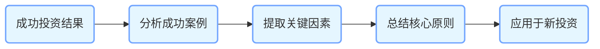

# 芒格的"逆向工程"思维：从成功投资中提取核心原则

> 关键词：芒格、逆向工程思维、成功投资、核心原则、投资策略

> 摘要：本文深入探讨了芒格的“逆向工程”思维在投资领域的应用。通过背景介绍，明确了研究目的、预期读者和文档结构。详细阐述了核心概念与联系，以直观的方式展示逆向工程思维的原理和架构。对核心算法原理进行了Python代码的详细阐述，并结合数学模型和公式进行深入讲解与举例说明。通过项目实战案例，展示了逆向工程思维在实际投资中的具体应用和代码实现。分析了该思维在不同场景下的实际应用，推荐了相关的学习资源、开发工具框架和论文著作。最后总结了逆向工程思维在投资领域的未来发展趋势与挑战，解答了常见问题并提供了扩展阅读和参考资料，旨在帮助投资者从成功投资中提取核心原则，提升投资决策的科学性和准确性。

## 1. 背景介绍 
### 1.1 目的和范围
本研究的主要目的是深入剖析芒格的“逆向工程”思维，并从成功投资案例中提取出具有普适性的核心原则。我们将通过对该思维方式的原理、应用方法以及实际案例的分析，为投资者提供一种全新的投资视角和决策思路。研究范围涵盖了投资领域的各个方面，包括股票投资、基金投资、企业并购等，旨在全面揭示逆向工程思维在不同投资场景下的应用价值。

### 1.2 预期读者
本文预期读者主要包括专业投资者、投资爱好者、金融从业者以及对投资决策方法感兴趣的人群。无论是经验丰富的投资老手，还是初涉投资领域的新手，都可以从本文中获得关于逆向工程思维的深入理解和实际应用指导。

### 1.3 文档结构概述
本文将按照以下结构展开：首先介绍逆向工程思维的背景和相关概念，包括其定义、起源和与投资的联系；接着详细阐述核心算法原理和具体操作步骤，通过Python代码进行示例；然后引入数学模型和公式，对逆向工程思维进行量化分析；之后通过项目实战案例，展示该思维在实际投资中的应用；再分析逆向工程思维的实际应用场景；推荐相关的学习资源、开发工具框架和论文著作；最后总结未来发展趋势与挑战，解答常见问题并提供扩展阅读和参考资料。

### 1.4 术语表
#### 1.4.1 核心术语定义
- **逆向工程思维**：是指从想要达到的目标或已经取得的成功结果出发，反向推导实现该目标所需的步骤和条件，通过分析这些步骤和条件来总结出一般性的原则和方法。
- **成功投资**：是指在投资过程中，投资者在一定的风险承受范围内，实现了预期的投资回报，包括资产的增值、股息收入等。
- **核心原则**：是指在投资过程中具有普遍指导意义的、能够帮助投资者做出正确决策的基本准则。

#### 1.4.2 相关概念解释
- **正向思维**：与逆向工程思维相对，是指按照事物发展的正常顺序，从原因出发去推导结果的思维方式。在投资中，正向思维通常表现为根据市场趋势、公司基本面等因素预测未来的投资回报。
- **投资决策**：是指投资者在进行投资活动时，根据自身的投资目标、风险承受能力和市场情况等因素，选择合适的投资对象和投资时机的过程。

#### 1.4.3 缩略词列表
- **ROI**：Return on Investment，投资回报率
- **PE**：Price-to-Earnings Ratio，市盈率
- **PB**：Price-to-Book Ratio，市净率

## 2. 核心概念与联系 

### 逆向工程思维的原理
逆向工程思维的核心原理是从结果出发，反向推导过程。在投资领域，我们通常关注的是如何获得成功的投资回报。通过逆向工程思维，我们可以先确定成功投资的标准，例如达到一定的投资回报率、实现资产的稳健增长等。然后，我们分析那些已经取得成功投资的案例，找出它们共同的特征和操作步骤。

### 逆向工程思维与投资的联系
逆向工程思维在投资中具有重要的应用价值。传统的投资方法往往是基于正向思维，即根据市场趋势、公司基本面等因素预测未来的投资回报。然而，市场是复杂多变的，这种预测往往具有一定的不确定性。逆向工程思维则可以帮助我们从成功投资的结果出发，总结出具有普适性的投资原则，从而提高投资决策的准确性和可靠性。

### 逆向工程思维的架构示意图


该流程图展示了逆向工程思维在投资中的应用过程。首先，我们明确成功投资的结果，然后对成功案例进行深入分析，从中提取出关键因素，进而总结出核心原则。最后，将这些核心原则应用到新的投资决策中。

## 3. 核心算法原理 & 具体操作步骤 

### 核心算法原理
逆向工程思维的核心算法原理可以概括为以下几个步骤：
1. **数据收集**：收集大量的成功投资案例，包括投资对象、投资时间、投资金额、投资回报等信息。
2. **特征提取**：对每个成功投资案例进行分析，提取出可能影响投资成功的关键特征，例如公司的财务指标、行业趋势、管理层能力等。
3. **特征筛选**：通过数据分析和统计方法，筛选出与投资成功相关性较高的特征。
4. **模型构建**：根据筛选出的特征，构建一个投资成功的预测模型。
5. **模型验证**：使用历史数据对模型进行验证，评估模型的准确性和可靠性。
6. **核心原则总结**：根据模型的结果，总结出具有普适性的核心原则。

### 具体操作步骤及Python代码实现
以下是一个使用Python实现逆向工程思维核心算法的示例代码：

```python
import pandas as pd
from sklearn.ensemble import RandomForestClassifier
from sklearn.model_selection import train_test_split
from sklearn.metrics import accuracy_score

# 步骤1：数据收集
# 假设我们有一个包含成功投资案例的CSV文件，文件名为'successful_investments.csv'
data = pd.read_csv('successful_investments.csv')

# 步骤2：特征提取
# 假设数据集中包含以下特征：公司市值、市盈率、市净率、行业增长率等
features = data[['market_cap', 'pe_ratio', 'pb_ratio', 'industry_growth_rate']]
# 假设投资成功的标签为1，失败的标签为0
labels = data['investment_success']

# 步骤3：特征筛选
# 这里我们使用随机森林分类器进行特征筛选
model = RandomForestClassifier()
model.fit(features, labels)
feature_importances = model.feature_importances_
important_features = features.columns[feature_importances > 0.1]  # 筛选出重要性大于0.1的特征

# 步骤4：模型构建
# 使用筛选后的特征构建新的数据集
new_features = features[important_features]
X_train, X_test, y_train, y_test = train_test_split(new_features, labels, test_size=0.2, random_state=42)
model = RandomForestClassifier()
model.fit(X_train, y_train)

# 步骤5：模型验证
y_pred = model.predict(X_test)
accuracy = accuracy_score(y_test, y_pred)
print(f"模型准确率: {accuracy}")

# 步骤6：核心原则总结
# 根据模型的特征重要性，总结出核心原则
feature_importance_df = pd.DataFrame({'feature': important_features, 'importance': feature_importances[feature_importances > 0.1]})
feature_importance_df = feature_importance_df.sort_values(by='importance', ascending=False)
print("核心原则：")
for index, row in feature_importance_df.iterrows():
    print(f"{row['feature']}对投资成功的影响较大，应重点关注。")
```

## 4. 数学模型和公式 & 详细讲解 & 举例说明 

### 数学模型
在逆向工程思维中，我们可以使用多种数学模型来分析投资数据和总结核心原则。其中，决策树模型和随机森林模型是比较常用的方法。

#### 决策树模型
决策树是一种基于树结构进行决策的模型。它通过对数据的特征进行划分，构建出一棵决策树，每个内部节点表示一个特征上的测试，每个分支表示一个测试输出，每个叶节点表示一个类别或值。决策树的构建过程可以使用信息增益、基尼指数等指标来选择最优的特征划分。

决策树的数学表达式可以表示为：
$$D = (X, Y)$$
其中，$D$ 表示数据集，$X$ 表示特征向量，$Y$ 表示标签向量。决策树的目标是找到一个最优的划分函数 $f(X)$，使得对于每个样本 $x \in X$，$f(x)$ 能够准确地预测其标签 $y$。

#### 随机森林模型
随机森林是一种集成学习方法，它由多个决策树组成。每个决策树在不同的样本子集和特征子集上进行训练，最后通过投票或平均的方式来进行预测。随机森林的优点是能够降低过拟合的风险，提高模型的准确性和稳定性。

随机森林的数学表达式可以表示为：
$$F(x) = \frac{1}{n} \sum_{i=1}^{n} f_i(x)$$
其中，$F(x)$ 表示随机森林的预测结果，$n$ 表示决策树的数量，$f_i(x)$ 表示第 $i$ 个决策树的预测结果。

### 详细讲解
在上述的Python代码示例中，我们使用了随机森林模型来进行投资成功的预测。随机森林模型通过对多个决策树的结果进行综合，能够更准确地预测投资的成功与否。在模型训练过程中，我们使用了特征重要性来筛选出与投资成功相关性较高的特征，从而提高模型的准确性和解释性。

### 举例说明
假设我们有一个包含100个成功投资案例和100个失败投资案例的数据集，其中每个案例包含公司市值、市盈率、市净率、行业增长率等特征。我们使用随机森林模型对这些数据进行训练和预测。经过模型训练和特征筛选，我们发现公司市值和行业增长率这两个特征的重要性较高。这意味着在进行投资决策时，我们应该重点关注公司的市值和所在行业的增长率。

## 5. 项目实战：代码实际案例和详细解释说明 

### 5.1  开发环境搭建
为了运行上述的Python代码，我们需要搭建一个合适的开发环境。以下是具体的步骤：
1. **安装Python**：可以从Python官方网站（https://www.python.org/downloads/）下载并安装Python 3.x版本。
2. **安装必要的库**：使用以下命令安装所需的库：
```sh
pip install pandas scikit-learn
```
3. **准备数据集**：将包含成功投资案例的CSV文件保存到本地，并确保文件路径正确。

### 5.2  源代码详细实现和代码解读
以下是对上述Python代码的详细解读：

```python
import pandas as pd
from sklearn.ensemble import RandomForestClassifier
from sklearn.model_selection import train_test_split
from sklearn.metrics import accuracy_score

# 步骤1：数据收集
# 假设我们有一个包含成功投资案例的CSV文件，文件名为'successful_investments.csv'
data = pd.read_csv('successful_investments.csv')

# 代码解读：使用pandas库的read_csv函数读取CSV文件，并将数据存储在DataFrame对象中。

# 步骤2：特征提取
# 假设数据集中包含以下特征：公司市值、市盈率、市净率、行业增长率等
features = data[['market_cap', 'pe_ratio', 'pb_ratio', 'industry_growth_rate']]
# 假设投资成功的标签为1，失败的标签为0
labels = data['investment_success']

# 代码解读：从DataFrame对象中提取出所需的特征和标签，分别存储在features和labels变量中。

# 步骤3：特征筛选
# 这里我们使用随机森林分类器进行特征筛选
model = RandomForestClassifier()
model.fit(features, labels)
feature_importances = model.feature_importances_
important_features = features.columns[feature_importances > 0.1]  # 筛选出重要性大于0.1的特征

# 代码解读：使用随机森林分类器对特征进行训练，并获取每个特征的重要性得分。然后筛选出重要性得分大于0.1的特征。

# 步骤4：模型构建
# 使用筛选后的特征构建新的数据集
new_features = features[important_features]
X_train, X_test, y_train, y_test = train_test_split(new_features, labels, test_size=0.2, random_state=42)
model = RandomForestClassifier()
model.fit(X_train, y_train)

# 代码解读：使用筛选后的特征构建新的数据集，并将数据集划分为训练集和测试集。然后使用随机森林分类器对训练集进行训练。

# 步骤5：模型验证
y_pred = model.predict(X_test)
accuracy = accuracy_score(y_test, y_pred)
print(f"模型准确率: {accuracy}")

# 代码解读：使用训练好的模型对测试集进行预测，并计算模型的准确率。

# 步骤6：核心原则总结
# 根据模型的特征重要性，总结出核心原则
feature_importance_df = pd.DataFrame({'feature': important_features, 'importance': feature_importances[feature_importances > 0.1]})
feature_importance_df = feature_importance_df.sort_values(by='importance', ascending=False)
print("核心原则：")
for index, row in feature_importance_df.iterrows():
    print(f"{row['feature']}对投资成功的影响较大，应重点关注。")

# 代码解读：根据特征的重要性得分，总结出对投资成功影响较大的特征，并将其作为核心原则输出。
```

### 5.3  代码解读与分析
通过上述代码，我们可以看到逆向工程思维在投资中的具体应用。首先，我们通过数据收集和特征提取，获取了与投资成功相关的特征和标签。然后，使用随机森林模型进行特征筛选和模型构建，提高了模型的准确性和解释性。最后，通过模型验证和核心原则总结，我们得到了对投资决策具有指导意义的核心原则。

需要注意的是，上述代码只是一个示例，实际应用中可能需要根据具体情况进行调整和优化。例如，数据集的质量和特征的选择会对模型的性能产生重要影响，需要进行仔细的分析和处理。

## 6. 实际应用场景 
逆向工程思维在投资领域有广泛的实际应用场景，以下是一些常见的例子：

### 股票投资
在股票投资中，逆向工程思维可以帮助投资者从成功的股票投资案例中总结出核心原则。例如，通过分析那些长期表现优异的股票，我们可以发现一些共同的特征，如公司具有稳定的盈利能力、良好的现金流状况、优秀的管理层等。投资者可以根据这些核心原则，筛选出具有潜力的股票进行投资。

### 基金投资
对于基金投资，逆向工程思维可以用于评估基金经理的投资能力。通过分析那些业绩优秀的基金，我们可以找出基金经理的投资策略和决策方法。例如，某些基金经理擅长投资特定行业或板块，或者注重价值投资和长期持有。投资者可以根据这些核心原则，选择适合自己的基金进行投资。

### 企业并购
在企业并购中，逆向工程思维可以帮助企业从成功的并购案例中学习经验。例如，分析那些并购后实现了协同效应和业绩提升的案例，我们可以总结出并购的关键因素，如并购目标的选择、并购后的整合策略等。企业可以根据这些核心原则，制定更加科学合理的并购计划。

### 风险投资
在风险投资领域，逆向工程思维可以帮助投资者识别具有潜力的创业项目。通过分析那些成功的创业项目，我们可以找出它们的共同特征，如创新的商业模式、优秀的创业团队、巨大的市场潜力等。投资者可以根据这些核心原则，筛选出具有投资价值的创业项目。

## 7. 工具和资源推荐
### 7.1 学习资源推荐
#### 7.1.1 书籍推荐
- 《穷查理宝典：查理·芒格的智慧箴言录》：本书收录了查理·芒格的演讲、文章和访谈等内容，全面展现了他的投资理念和逆向工程思维。
- 《聪明的投资者》：本杰明·格雷厄姆的经典著作，介绍了价值投资的基本原理和方法，对逆向工程思维在投资中的应用有一定的启示作用。
- 《投资中最简单的事》：邱国鹭的著作，结合中国市场的实际情况，阐述了投资的基本原则和方法，适合投资者学习和参考。

#### 7.1.2 在线课程
- Coursera上的“投资学原理”：该课程由知名教授授课，系统介绍了投资学的基本概念、理论和方法，对逆向工程思维在投资中的应用有一定的涉及。
- 网易云课堂上的“股票投资实战技巧”：课程结合实际案例，讲解了股票投资的实战技巧和方法，有助于投资者提升投资能力。

#### 7.1.3 技术博客和网站
- 雪球网：国内知名的投资社区，提供了丰富的投资资讯、研究报告和投资者交流平台，投资者可以从中学习到不同的投资策略和方法。
- 金融界网站：提供了全面的金融信息和投资分析工具，对逆向工程思维在投资中的应用有一定的参考价值。

### 7.2 开发工具框架推荐
#### 7.2.1 IDE和编辑器
- PyCharm：一款专业的Python集成开发环境，提供了丰富的代码编辑、调试和项目管理功能，适合Python开发。
- Jupyter Notebook：一个交互式的编程环境，支持Python、R等多种编程语言，方便数据科学家和分析师进行数据分析和模型开发。

#### 7.2.2 调试和性能分析工具
- Py-Spy：一个轻量级的Python性能分析工具，可以帮助开发者找出代码中的性能瓶颈。
- PDB：Python自带的调试器，可以帮助开发者调试代码，定位和解决问题。

#### 7.2.3 相关框架和库
- Pandas：一个强大的数据分析库，提供了高效的数据结构和数据处理工具，适合处理和分析投资数据。
- Scikit-learn：一个常用的机器学习库，提供了丰富的机器学习算法和工具，适合构建投资预测模型。

### 7.3 相关论文著作推荐
#### 7.3.1 经典论文
- 《证券分析》：本杰明·格雷厄姆和大卫·多德的经典论文，奠定了价值投资的理论基础，对逆向工程思维在投资中的应用有重要的启示作用。
- 《有效市场假说》：尤金·法玛的论文，提出了有效市场假说，对投资理论和实践产生了深远的影响。

#### 7.3.2 最新研究成果
- 《行为金融学》：结合心理学和金融学的研究成果，探讨了投资者的行为偏差和决策机制，为逆向工程思维在投资中的应用提供了新的视角。
- 《量化投资》：运用数学模型和计算机技术进行投资决策，是当前投资领域的研究热点之一，对逆向工程思维的应用有一定的借鉴意义。

#### 7.3.3 应用案例分析
- 《巴菲特的投资策略分析》：通过对巴菲特的投资案例进行分析，总结了他的投资原则和方法，对逆向工程思维在投资中的应用有实际的参考价值。
- 《中国资本市场投资案例研究》：结合中国资本市场的实际情况，分析了不同类型的投资案例，为投资者提供了具体的实践经验。

## 8. 总结：未来发展趋势与挑战
### 未来发展趋势
随着科技的不断进步和金融市场的不断发展，逆向工程思维在投资领域的应用前景非常广阔。以下是一些未来的发展趋势：
1. **数据驱动的投资决策**：随着大数据和人工智能技术的发展，投资者可以获取更多的投资数据，并通过数据分析和模型构建来进行投资决策。逆向工程思维可以帮助投资者从海量的数据中提取出有价值的信息，提高投资决策的准确性和科学性。
2. **跨学科融合**：投资领域涉及到经济学、金融学、数学、统计学、计算机科学等多个学科的知识。未来，逆向工程思维将与这些学科进行更深入的融合，形成更加综合和系统的投资理论和方法。
3. **个性化投资服务**：随着投资者需求的不断多样化，未来的投资服务将更加个性化。逆向工程思维可以帮助投资机构根据投资者的风险偏好、投资目标和财务状况等因素，为其提供定制化的投资方案。

### 挑战
尽管逆向工程思维在投资领域有很多优势，但也面临着一些挑战：
1. **数据质量和可用性**：逆向工程思维依赖于大量的投资数据，但数据的质量和可用性往往是一个问题。例如，数据可能存在缺失、错误或不一致的情况，这会影响模型的准确性和可靠性。
2. **模型的解释性和可解释性**：一些复杂的机器学习模型，如深度学习模型，虽然具有很高的预测准确性，但模型的解释性和可解释性较差。这使得投资者难以理解模型的决策过程和依据，从而影响了模型的应用。
3. **市场的不确定性和复杂性**：金融市场是复杂多变的，受到多种因素的影响，如宏观经济环境、政策法规、市场情绪等。这些因素的不确定性和复杂性增加了投资决策的难度，也对逆向工程思维的应用提出了挑战。

## 9. 附录：常见问题与解答
### 问题1：逆向工程思维与传统投资思维有什么区别？
逆向工程思维是从结果出发，反向推导过程，通过分析成功投资案例来总结核心原则。而传统投资思维通常是基于正向思维，从原因出发去推导结果，根据市场趋势、公司基本面等因素预测未来的投资回报。逆向工程思维可以帮助投资者更全面地了解投资成功的关键因素，提高投资决策的准确性和可靠性。

### 问题2：逆向工程思维在投资中一定能取得成功吗？
逆向工程思维只是一种投资决策的方法和工具，不能保证在投资中一定能取得成功。投资市场是复杂多变的，受到多种因素的影响，如宏观经济环境、政策法规、市场情绪等。逆向工程思维可以帮助投资者从成功投资案例中总结出一些具有普适性的核心原则，但在实际应用中，还需要结合市场情况和自身的投资目标、风险承受能力等因素进行综合考虑。

### 问题3：如何获取高质量的投资数据？
可以通过以下途径获取高质量的投资数据：
1. 金融数据提供商：如Wind、东方财富等，提供了丰富的金融数据和分析工具。
2. 上市公司公告和年报：可以从上市公司的官方网站或证券交易所网站获取公司的财务报表、经营情况等信息。
3. 政府部门和行业协会：提供了一些宏观经济数据和行业统计数据。
4. 学术研究机构和智库：发布了一些关于投资领域的研究报告和数据。

### 问题4：如何评估逆向工程思维构建的投资模型的准确性？
可以使用以下方法评估投资模型的准确性：
1. 交叉验证：将数据集划分为训练集和测试集，使用训练集对模型进行训练，使用测试集对模型进行验证，计算模型的准确率、召回率、F1值等指标。
2. 回测：使用历史数据对模型进行回测，模拟模型在历史市场环境下的表现，评估模型的盈利能力和风险控制能力。
3. 与基准模型比较：将构建的模型与一些基准模型进行比较，如市场指数、行业平均水平等，评估模型的相对表现。

## 10. 扩展阅读 & 参考资料
### 扩展阅读
- 《投资最重要的事》：霍华德·马克斯的著作，深入探讨了投资中的风险管理、价值评估等重要问题，对逆向工程思维在投资中的应用有进一步的拓展和深化。
- 《黑天鹅》：纳西姆·尼古拉斯·塔勒布的著作，介绍了极端不确定性事件对投资市场的影响，提醒投资者要重视风险管理和不确定性。

### 参考资料
- 查理·芒格的演讲和文章：可以通过网络搜索获取查理·芒格的相关演讲和文章，深入了解他的投资理念和逆向工程思维。
- 学术期刊和研究报告：如《金融研究》、《经济研究》等学术期刊，以及各大金融机构发布的研究报告，提供了关于投资领域的最新研究成果和实践经验。