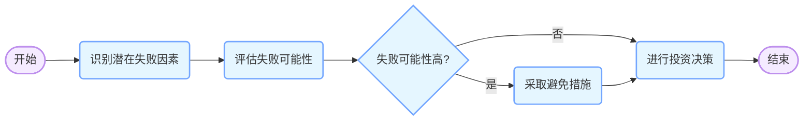

# 芒格的"避免失败"原则：投资成功的另一面

> 关键词：芒格、避免失败原则、投资成功、风险控制、决策框架

> 摘要：本文深入探讨了芒格的“避免失败”原则在投资领域的重要性和应用。从背景介绍出发，阐述了该原则提出的目的、适用读者群体以及文档的整体结构。详细解释了核心概念与联系，通过示意图和流程图展示其架构。剖析了核心算法原理，并用 Python 代码说明。讲解了相关数学模型和公式，结合实例加深理解。通过项目实战案例，展示了如何在实际投资中运用该原则。分析了其实际应用场景，推荐了学习、开发工具和相关论文著作。最后总结了未来发展趋势与挑战，解答常见问题并提供扩展阅读和参考资料，旨在帮助投资者从避免失败的角度实现投资成功。

## 1. 背景介绍 
### 1.1 目的和范围
查理·芒格（Charlie Munger）是投资界的传奇人物，他与沃伦·巴菲特（Warren Buffett）搭档，创造了伯克希尔·哈撒韦公司的辉煌业绩。芒格的“避免失败”原则是其投资哲学的重要组成部分。本文的目的在于深入剖析这一原则，揭示其在投资决策中的关键作用。我们将探讨该原则的核心概念、算法原理、数学模型，并通过实际案例展示其应用。范围涵盖了投资领域的各个方面，包括股票投资、基金投资等，旨在为投资者提供全面而深入的理解。

### 1.2 预期读者
本文预期读者主要包括各类投资者，无论是初涉投资领域的新手，还是有一定经验的专业投资者。对于新手投资者，本文可以帮助他们建立正确的投资理念，避免常见的投资错误；对于专业投资者，本文可以提供新的视角和思路，进一步优化他们的投资决策过程。此外，金融专业的学生和研究人员也可以从本文中获取有价值的信息，深入研究投资理论和实践。

### 1.3 文档结构概述
本文将按照以下结构进行阐述：首先介绍背景信息，包括目的、预期读者和文档结构概述。接着讲解核心概念与联系，通过文本示意图和 Mermaid 流程图展示其架构。然后剖析核心算法原理，并用 Python 代码详细说明。随后讲解相关数学模型和公式，结合实例进行解释。通过项目实战案例，展示该原则在实际投资中的应用。分析实际应用场景，推荐学习、开发工具和相关论文著作。最后总结未来发展趋势与挑战，解答常见问题并提供扩展阅读和参考资料。

### 1.4 术语表
#### 1.4.1 核心术语定义
- **避免失败原则**：芒格提出的一种投资理念，强调在投资过程中通过识别和避免潜在的风险和失败因素，来提高投资成功的概率。
- **投资决策框架**：一套系统的方法和规则，用于指导投资者在面对各种投资机会时做出合理的决策。
- **风险评估**：对投资项目可能面临的各种风险进行分析和评估，以确定风险的大小和可能性。
- **安全边际**：投资者在购买资产时，为了应对可能的不确定性和风险，所预留的价格缓冲空间。

#### 1.4.2 相关概念解释
- **逆向思维**：与传统思维方式相反，从问题的反面或对立面去思考和分析，以发现潜在的问题和机会。
- **多元思维模型**：综合运用多个学科的知识和方法，来分析和解决问题，避免单一思维模式的局限性。
- **能力圈**：投资者所熟悉和擅长的领域，只在自己的能力圈内进行投资决策，以降低风险。

#### 1.4.3 缩略词列表
无

## 2. 核心概念与联系 
芒格的“避免失败”原则的核心思想是，与其专注于寻找成功的投资机会，不如先集中精力避免那些可能导致失败的因素。这一原则基于逆向思维，即通过思考什么会导致失败，从而更好地做出正确的投资决策。

### 核心概念原理
在投资中，失败的原因往往是多种多样的，包括市场风险、公司经营风险、行业竞争风险等。芒格认为，通过识别和分析这些潜在的失败因素，并采取相应的措施来避免它们，投资者可以大大提高投资成功的概率。例如，在选择投资标的时，不仅要关注公司的业绩和前景，还要考虑其面临的风险和挑战。如果一家公司所处的行业竞争激烈，且自身缺乏核心竞争力，那么即使其当前业绩良好，也可能存在潜在的失败风险。

### 架构的文本示意图
```plaintext
避免失败原则
|-- 识别潜在失败因素
|   |-- 市场风险
|   |-- 公司经营风险
|   |-- 行业竞争风险
|   |-- 其他风险
|-- 评估失败可能性
|   |-- 定性分析
|   |-- 定量分析
|-- 采取避免措施
|   |-- 调整投资组合
|   |-- 设定安全边际
|   |-- 坚守能力圈
```

### Mermaid 流程图


## 3. 核心算法原理 & 具体操作步骤 
### 核心算法原理
芒格的“避免失败”原则并没有一个固定的算法，但可以通过一些方法来实现。其中一个重要的方法是风险评估。风险评估可以分为定性分析和定量分析两个方面。

定性分析主要是通过对公司的商业模式、管理团队、行业竞争等方面进行分析，评估其潜在的风险。例如，一家公司的商业模式是否可持续，管理团队是否有能力应对各种挑战，行业竞争是否激烈等。

定量分析则是通过对公司的财务数据、估值指标等进行分析，评估其风险程度。例如，公司的负债率、盈利能力、市盈率等。

### 具体操作步骤
1. **识别潜在失败因素**
    - 收集公司的相关信息，包括财务报表、行业报告、新闻报道等。
    - 分析公司所处的市场环境、行业竞争态势、政策法规等因素。
    - 关注公司的内部管理、技术创新、人才储备等方面的情况。

2. **评估失败可能性**
    - 进行定性分析，判断公司的商业模式、管理团队等方面是否存在潜在风险。
    - 进行定量分析，计算公司的财务指标和估值指标，评估其风险程度。
    - 综合定性和定量分析的结果，给出一个整体的风险评估。

3. **采取避免措施**
    - 如果评估结果显示失败可能性较高，可以考虑调整投资组合，减少对该公司的投资。
    - 设定安全边际，即购买资产时预留一定的价格缓冲空间，以应对可能的风险。
    - 坚守自己的能力圈，只投资自己熟悉和擅长的领域。

### Python 代码示例
```python
import pandas as pd

# 模拟收集的公司财务数据
data = {
    '公司名称': ['A公司', 'B公司', 'C公司'],
    '负债率': [0.5, 0.3, 0.7],
    '盈利能力': [0.2, 0.3, 0.1],
    '市盈率': [20, 15, 30]
}

df = pd.DataFrame(data)

# 定义风险评估函数
def risk_assessment(row):
    risk_score = 0
    if row['负债率'] > 0.6:
        risk_score += 1
    if row['盈利能力'] < 0.2:
        risk_score += 1
    if row['市盈率'] > 25:
        risk_score += 1
    return risk_score

# 计算风险得分
df['风险得分'] = df.apply(risk_assessment, axis=1)

# 筛选出风险得分较高的公司
high_risk_companies = df[df['风险得分'] >= 2]

print("风险得分较高的公司：")
print(high_risk_companies)
```

## 4. 数学模型和公式 & 详细讲解 & 举例说明 
### 数学模型和公式
在投资中，常用的数学模型和公式包括风险评估模型、估值模型等。以下是一些常见的模型和公式：

#### 风险评估模型
- **Z-score 模型**：用于评估公司的财务风险，公式为：
$$Z = 1.2X_1 + 1.4X_2 + 3.3X_3 + 0.6X_4 + 0.999X_5$$
其中，$X_1$ 为营运资金/总资产，$X_2$ 为留存收益/总资产，$X_3$ 为息税前利润/总资产，$X_4$ 为股权市值/总负债，$X_5$ 为销售收入/总资产。$Z$ 值越低，公司的财务风险越高。

#### 估值模型
- **市盈率（P/E）模型**：用于评估公司的估值水平，公式为：
$$P/E = \frac{股价}{每股收益}$$
市盈率越高，说明市场对公司的预期越高，但也可能意味着公司的估值过高。

### 详细讲解
#### Z-score 模型
Z-score 模型通过综合考虑公司的多个财务指标，来评估其财务风险。营运资金/总资产反映了公司的短期偿债能力，留存收益/总资产反映了公司的积累能力，息税前利润/总资产反映了公司的盈利能力，股权市值/总负债反映了公司的财务杠杆，销售收入/总资产反映了公司的资产运营效率。通过对这些指标进行加权平均，得到一个综合的风险得分。

#### 市盈率（P/E）模型
市盈率是衡量公司估值的常用指标之一。它反映了投资者为了获得公司每一元的收益愿意支付的价格。一般来说，市盈率较高的公司，市场对其未来的增长预期较高；但如果市盈率过高，可能意味着公司的估值已经超出了其实际价值，存在投资风险。

### 举例说明
#### Z-score 模型
假设某公司的营运资金/总资产为 0.2，留存收益/总资产为 0.1，息税前利润/总资产为 0.15，股权市值/总负债为 2，销售收入/总资产为 1.5。则该公司的 Z-score 为：
$$Z = 1.2\times0.2 + 1.4\times0.1 + 3.3\times0.15 + 0.6\times2 + 0.999\times1.5$$
$$Z = 0.24 + 0.14 + 0.495 + 1.2 + 1.4985$$
$$Z = 3.5735$$
一般来说，$Z$ 值大于 2.99 表示公司的财务状况良好，风险较低；$Z$ 值小于 1.81 表示公司存在较高的财务风险。

#### 市盈率（P/E）模型
假设某公司的股价为 50 元，每股收益为 2 元，则该公司的市盈率为：
$$P/E = \frac{50}{2} = 25$$
如果同行业的平均市盈率为 20，那么该公司的市盈率相对较高，可能意味着市场对该公司的预期较高，但也可能存在估值过高的风险。

## 5. 项目实战：代码实际案例和详细解释说明 
### 5.1  开发环境搭建
在进行投资项目实战时，我们可以使用 Python 作为开发语言，并使用一些常用的库，如 Pandas、Numpy、Matplotlib 等。以下是搭建开发环境的步骤：

1. **安装 Python**：从 Python 官方网站（https://www.python.org/downloads/）下载并安装 Python 3.x 版本。
2. **安装必要的库**：打开命令行工具，使用以下命令安装所需的库：
```sh
pip install pandas numpy matplotlib
```

### 5.2  源代码详细实现和代码解读
以下是一个简单的投资项目实战案例，通过对股票数据进行分析，评估股票的风险和估值。

```python
import pandas as pd
import numpy as np
import matplotlib.pyplot as plt

# 读取股票数据
data = pd.read_csv('stock_data.csv')

# 计算收益率
data['收益率'] = data['收盘价'].pct_change()

# 计算波动率
volatility = data['收益率'].std()

# 计算市盈率
data['市盈率'] = data['收盘价'] / data['每股收益']

# 筛选出市盈率较低的股票
low_pe_stocks = data[data['市盈率'] < 15]

# 绘制收益率和市盈率的散点图
plt.scatter(data['收益率'], data['市盈率'])
plt.xlabel('收益率')
plt.ylabel('市盈率')
plt.title('收益率 vs 市盈率')
plt.show()

# 输出结果
print("股票的波动率：", volatility)
print("市盈率较低的股票：")
print(low_pe_stocks)
```

### 代码解读与分析
1. **读取股票数据**：使用 Pandas 的 `read_csv` 函数读取股票数据文件。
2. **计算收益率**：使用 `pct_change` 函数计算股票的收益率。
3. **计算波动率**：使用 `std` 函数计算收益率的标准差，即波动率。
4. **计算市盈率**：将收盘价除以每股收益，得到市盈率。
5. **筛选出市盈率较低的股票**：使用布尔索引筛选出市盈率小于 15 的股票。
6. **绘制散点图**：使用 Matplotlib 的 `scatter` 函数绘制收益率和市盈率的散点图，直观展示两者之间的关系。
7. **输出结果**：打印股票的波动率和市盈率较低的股票。

通过这个案例，我们可以对股票的风险和估值进行初步的评估，为投资决策提供参考。

## 6. 实际应用场景 
芒格的“避免失败”原则在投资领域有广泛的实际应用场景，以下是一些常见的场景：

### 股票投资
在股票投资中，投资者可以运用该原则来筛选股票。首先，识别潜在的失败因素，如公司的财务风险、行业竞争风险等。然后，评估这些因素导致失败的可能性。如果失败可能性较高，可以避免投资该股票；如果失败可能性较低，可以进一步分析其投资价值。例如，通过分析公司的财务报表，判断其负债率是否过高、盈利能力是否稳定等。

### 基金投资
在选择基金时，投资者也可以使用“避免失败”原则。了解基金的投资策略、管理团队、历史业绩等信息，识别可能导致基金业绩不佳的因素。例如，基金的投资风格是否过于激进，管理团队是否有丰富的经验等。对于那些存在较高失败风险的基金，投资者可以选择避开。

### 资产配置
在进行资产配置时，该原则可以帮助投资者降低整体投资组合的风险。通过分散投资不同类型的资产，如股票、债券、基金等，避免将所有资金集中在某一种资产上。同时，对每种资产进行风险评估，根据风险程度调整投资比例。例如，如果股票市场的风险较高，可以适当增加债券的投资比例。

### 创业投资
在创业投资中，“避免失败”原则同样重要。投资者在选择创业项目时，要仔细评估项目的商业模式、市场前景、团队能力等方面的风险。避免投资那些商业模式不清晰、市场竞争激烈、团队缺乏经验的项目。例如，一个创业项目的盈利模式依赖于尚未成熟的技术，那么该项目就存在较高的失败风险。

## 7. 工具和资源推荐
### 7.1 学习资源推荐
#### 7.1.1 书籍推荐
- 《穷查理宝典：查理·芒格的智慧箴言录》：这本书收录了芒格的演讲、文章和语录，全面展示了他的投资理念和人生智慧。
- 《聪明的投资者》：作者是本杰明·格雷厄姆（Benjamin Graham），是价值投资的经典著作，对芒格的投资思想产生了重要影响。
- 《巴菲特致股东的信：投资者和公司高管教程》：通过巴菲特致股东的信，了解他和芒格的投资策略和决策过程。

#### 7.1.2 在线课程
- Coursera 上的“投资学原理”课程：介绍了投资的基本概念、理论和方法，有助于初学者建立投资知识体系。
- edX 上的“价值投资：从理论到实践”课程：深入讲解了价值投资的理念和实践，与芒格的投资思想相关。

#### 7.1.3 技术博客和网站
- 雪球网：提供了丰富的股票投资信息和投资者交流平台，可以了解到其他投资者的观点和经验。
- 东方财富网：是国内知名的财经网站，提供了全面的金融市场数据和资讯。

### 7.2 开发工具框架推荐
#### 7.2.1 IDE和编辑器
- PyCharm：是一款专业的 Python 集成开发环境，具有强大的代码编辑、调试和分析功能。
- Jupyter Notebook：是一个交互式的开发环境，适合进行数据分析和可视化，方便在投资分析中使用。

#### 7.2.2 调试和性能分析工具
- PDB：Python 自带的调试工具，可以帮助开发者定位代码中的问题。
- cProfile：用于分析 Python 代码的性能，找出代码中的瓶颈。

#### 7.2.3 相关框架和库
- Pandas：是一个强大的数据分析库，提供了丰富的数据结构和数据处理方法，适合处理金融数据。
- Numpy：是 Python 的数值计算库，用于高效地进行数值运算。
- Matplotlib：是一个绘图库，可用于绘制各种类型的图表，直观展示投资数据。

### 7.3 相关论文著作推荐
#### 7.3.1 经典论文
- “The Intelligent Investor” by Benjamin Graham：这篇论文奠定了价值投资的理论基础，对芒格的投资思想产生了深远影响。
- “Security Analysis” by Benjamin Graham and David Dodd：详细阐述了证券分析的方法和技巧，是投资领域的经典之作。

#### 7.3.2 最新研究成果
- 可以关注《金融研究》《经济研究》等学术期刊，了解投资领域的最新研究动态。
- 参加学术会议，如中国金融学年会等，获取最新的研究成果和学术交流机会。

#### 7.3.3 应用案例分析
- 一些财经媒体和研究机构会发布投资案例分析报告，可以从中学习到实际应用中的经验和教训。
- 分析知名投资机构的投资案例，如伯克希尔·哈撒韦公司的投资决策过程，了解芒格和巴菲特的投资策略在实际中的应用。

## 8. 总结：未来发展趋势与挑战
### 未来发展趋势
- **科技融合**：随着科技的不断发展，投资领域将与人工智能、大数据、区块链等技术深度融合。例如，利用人工智能算法进行风险评估和投资决策，使用大数据分析挖掘潜在的投资机会。芒格的“避免失败”原则在这种科技融合的背景下，将更加注重数据的分析和利用，以更准确地识别潜在的失败因素。
- **多元化投资**：投资者将越来越倾向于多元化投资，不仅包括传统的股票、债券、基金等资产，还会涉及新兴的资产类别，如加密货币、私募股权等。在多元化投资中，“避免失败”原则将帮助投资者更好地管理不同资产之间的风险，实现资产的合理配置。
- **社会责任投资**：越来越多的投资者开始关注企业的社会责任和可持续发展。在投资决策中，会考虑企业的环境、社会和治理（ESG）因素。芒格的“避免失败”原则可以应用于筛选那些具有良好 ESG 表现的企业，避免投资那些存在重大社会和环境风险的企业。

### 挑战
- **信息过载**：在信息爆炸的时代，投资者面临着大量的信息。如何从海量的信息中筛选出有价值的信息，准确识别潜在的失败因素，是一个巨大的挑战。投资者需要具备更强的信息分析和判断能力。
- **市场不确定性**：金融市场充满了不确定性，宏观经济环境、政策法规变化、突发事件等都可能对市场产生重大影响。即使运用了“避免失败”原则，也难以完全避免市场波动带来的风险。投资者需要不断调整投资策略，以适应市场的变化。
- **新兴技术风险**：虽然科技融合为投资带来了新的机遇，但也带来了新的风险。例如，人工智能算法可能存在模型偏差和数据质量问题，区块链技术可能面临安全漏洞和监管不确定性。投资者需要了解这些新兴技术的特点和风险，避免因技术问题导致投资失败。

## 9. 附录：常见问题与解答
### 问题 1：“避免失败”原则是否意味着不承担任何风险？
解答：“避免失败”原则并不意味着不承担任何风险。在投资中，风险是不可避免的。该原则的核心是通过识别和评估潜在的失败因素，采取相应的措施来降低风险，而不是完全消除风险。投资者仍然需要在风险和收益之间进行权衡，根据自己的风险承受能力做出合理的投资决策。

### 问题 2：如何判断一个投资项目的失败可能性？
解答：判断一个投资项目的失败可能性需要综合考虑多个因素。可以从定性和定量两个方面进行分析。定性分析包括评估公司的商业模式、管理团队、行业竞争等方面的情况；定量分析包括计算公司的财务指标、估值指标等。同时，还可以参考历史数据、行业研究报告等信息，进行综合判断。

### 问题 3：“避免失败”原则适用于所有类型的投资吗？
解答：“避免失败”原则适用于大多数类型的投资，包括股票投资、基金投资、债券投资、创业投资等。无论投资何种资产，都存在失败的风险，该原则可以帮助投资者识别和避免这些风险。但不同类型的投资可能需要采用不同的方法和指标来评估风险，投资者需要根据具体情况进行调整。

### 问题 4：如何在投资中运用逆向思维？
解答：在投资中运用逆向思维可以从以下几个方面入手：首先，当市场情绪高涨时，要保持冷静，思考市场是否存在过热的风险；当市场情绪低迷时，要寻找被低估的投资机会。其次，对于热门的投资概念和行业，要思考其背后可能存在的问题和风险。最后，在分析公司时，不仅要关注其优点和亮点，还要关注其潜在的缺点和问题。

## 10. 扩展阅读 & 参考资料
### 扩展阅读
- 《投资最重要的事》：作者是霍华德·马克斯（Howard Marks），书中阐述了投资中的重要原则和理念，与芒格的投资思想有相似之处。
- 《金融炼金术》：作者是乔治·索罗斯（George Soros），介绍了他的投资哲学和交易策略，对投资者有一定的启发。

### 参考资料
- 《穷查理宝典：查理·芒格的智慧箴言录》
- 各大财经网站和学术期刊发布的相关研究报告和文章
- 伯克希尔·哈撒韦公司的年报和股东大会记录