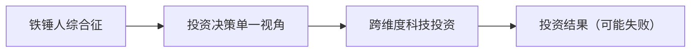

# 芒格的"铁锤人综合征"警示在跨维度科技投资中的应用

> 关键词：芒格、铁锤人综合征、跨维度科技投资、投资警示、科技投资策略

> 摘要：本文深入探讨了芒格的“铁锤人综合征”在跨维度科技投资领域的应用。首先介绍了“铁锤人综合征”的背景及相关概念，阐述了其核心原理。接着分析了该综合征在跨维度科技投资中可能带来的问题，通过数学模型和公式进一步阐释其影响。结合项目实战案例，详细讲解了如何避免该综合征对投资决策的负面影响。探讨了“铁锤人综合征”警示在实际科技投资场景中的应用，推荐了相关学习资源、开发工具和研究论文。最后总结了未来跨维度科技投资的发展趋势与挑战，并对常见问题进行解答，为跨维度科技投资提供了全面且有深度的参考。

## 1. 背景介绍 
### 1.1 目的和范围
在当今科技飞速发展的时代，跨维度科技投资逐渐成为投资领域的热门话题。跨维度科技投资涉及多个科技领域，如人工智能、区块链、量子计算等，这些领域相互交织，充满了机遇和挑战。芒格提出的“铁锤人综合征”是一种认知偏差，指的是当一个人手中只有一把铁锤时，他会把所有问题都看成钉子。本研究的目的在于深入探讨“铁锤人综合征”在跨维度科技投资中的表现、影响以及如何避免这种综合征对投资决策的误导，从而提高跨维度科技投资的成功率和效益。研究范围涵盖了跨维度科技投资的各个环节，包括投资前的项目评估、投资过程中的决策制定以及投资后的风险管理等。

### 1.2 预期读者
本文预期读者主要包括从事跨维度科技投资的专业人士，如风险投资家、基金经理等，他们可以从本文中获取有关避免认知偏差、优化投资决策的实用建议。同时，对于科技创业者来说，了解投资者可能存在的“铁锤人综合征”有助于他们更好地展示项目的价值和潜力，提高获得投资的机会。此外，对科技投资和认知心理学感兴趣的学者和研究人员也可以从本文中获得新的研究视角和思路。

### 1.3 文档结构概述
本文首先介绍“铁锤人综合征”的相关背景知识，包括其定义、来源以及在不同领域的表现。然后深入分析“铁锤人综合征”与跨维度科技投资的核心概念和联系，通过示意图和流程图展示其内在逻辑。接着阐述核心算法原理和具体操作步骤，使用Python代码进行详细说明。利用数学模型和公式进一步剖析“铁锤人综合征”对投资决策的影响，并通过实际案例进行举例说明。在项目实战部分，提供代码实际案例和详细解释，包括开发环境搭建、源代码实现和代码解读。探讨“铁锤人综合征”警示在实际应用场景中的作用。推荐相关的学习资源、开发工具和研究论文。最后总结未来跨维度科技投资的发展趋势与挑战，解答常见问题，并提供扩展阅读和参考资料。

### 1.4 术语表
#### 1.4.1 核心术语定义
- **铁锤人综合征**：指由于过度依赖某种特定的工具、方法或思维模式，而将所有问题都用这种单一模式去解决的认知偏差现象。
- **跨维度科技投资**：指跨越不同科技领域进行的投资活动，涉及多个具有不同技术特点和发展规律的科技行业。
- **投资决策**：指投资者在对投资项目进行评估和分析后，做出是否投资以及投资多少的决定过程。
- **认知偏差**：指人们在认知过程中由于各种因素的影响而产生的偏离客观事实的判断和决策。

#### 1.4.2 相关概念解释
- **科技领域**：指具有特定技术特征和应用场景的科技行业，如信息技术、生物技术、新能源技术等。
- **投资组合**：指投资者将资金分散投资于多个不同项目或资产，以降低风险和提高收益的投资策略。
- **风险评估**：指对投资项目可能面临的各种风险进行识别、分析和评估的过程。

#### 1.4.3 缩略词列表
- **AI**：Artificial Intelligence，人工智能
- **BC**：Blockchain，区块链
- **QC**：Quantum Computing，量子计算

## 2. 核心概念与联系 
### 2.1 “铁锤人综合征”的核心原理
“铁锤人综合征”源于一种简单而又普遍的人类认知倾向。当一个人对某种工具、方法或思维模式非常熟悉和依赖时，他会不自觉地将所有问题都用这种熟悉的方式去处理。这种倾向在投资领域表现得尤为明显。例如，一个投资者如果对某种特定的投资分析方法非常擅长，如财务报表分析，那么他在评估所有投资项目时都会过度依赖财务报表，而忽略其他重要因素，如市场趋势、技术创新等。这种单一的分析视角可能导致投资者错过一些具有潜力但在财务报表上表现不突出的项目，或者对一些存在潜在风险的项目做出错误的判断。

### 2.2 跨维度科技投资的特点
跨维度科技投资具有高度的复杂性和不确定性。不同的科技领域具有不同的技术发展规律、市场需求和竞争格局。例如，人工智能领域注重算法创新和数据积累，而区块链领域则强调去中心化和安全性。在跨维度科技投资中，投资者需要面对多个不同领域的项目，每个项目都有其独特的技术和商业逻辑。这就要求投资者具备广泛的知识和多元化的思维方式，能够从不同的角度去评估项目的价值和风险。

### 2.3 两者的联系
在跨维度科技投资中，“铁锤人综合征”可能会导致投资者陷入严重的决策误区。由于科技领域的多样性和复杂性，如果投资者仅仅依赖自己熟悉的某一种投资方法或思维模式，就很容易忽略其他重要的信息和因素。例如，一个习惯于传统行业投资的投资者，可能会用评估传统企业的标准去评估科技初创企业，而忽略了科技企业的创新性、技术壁垒和市场潜力等关键因素。这种单一的评估方式可能会使投资者错过一些具有高增长潜力的科技项目，或者对科技项目的风险做出错误的判断，从而导致投资失败。

### 2.4 文本示意图
```plaintext
"铁锤人综合征"
    |
    | 导致
    |
投资决策单一视角
    |
    | 作用于
    |
跨维度科技投资
    |
    | 产生影响
    |
投资结果（可能失败）
```

### 2.5 Mermaid 流程图


## 3. 核心算法原理 & 具体操作步骤 
### 3.1 核心算法原理
在跨维度科技投资中，为了避免“铁锤人综合征”的影响，我们可以采用一种基于多维度评估的算法。该算法的核心思想是综合考虑多个不同的评估维度，包括技术创新、市场潜力、团队能力、财务状况等，为每个维度赋予不同的权重，然后通过加权计算得出项目的综合评估得分。具体来说，我们可以将每个评估维度看作一个特征向量，每个特征向量包含多个具体的评估指标。通过对这些指标的量化和加权求和，得到每个维度的得分，再将各个维度的得分按照其权重进行加权求和，最终得到项目的综合评估得分。

### 3.2 Python 源代码实现
```python
# 定义评估维度和对应的权重
dimensions = {
    "技术创新": 0.3,
    "市场潜力": 0.3,
    "团队能力": 0.2,
    "财务状况": 0.2
}

# 定义每个维度的具体评估指标和对应的权重
indicators = {
    "技术创新": {
        "专利数量": 0.4,
        "技术领先性": 0.3,
        "研发投入": 0.3
    },
    "市场潜力": {
        "市场规模": 0.4,
        "市场增长率": 0.3,
        "竞争格局": 0.3
    },
    "团队能力": {
        "团队经验": 0.4,
        "团队创新能力": 0.3,
        "团队协作能力": 0.3
    },
    "财务状况": {
        "盈利能力": 0.4,
        "偿债能力": 0.3,
        "现金流状况": 0.3
    }
}

def evaluate_project(project_data):
    total_score = 0
    for dimension, dimension_weight in dimensions.items():
        dimension_score = 0
        for indicator, indicator_weight in indicators[dimension].items():
            indicator_value = project_data[dimension][indicator]
            dimension_score += indicator_value * indicator_weight
        total_score += dimension_score * dimension_weight
    return total_score

# 示例项目数据
project_data = {
    "技术创新": {
        "专利数量": 5,
        "技术领先性": 8,
        "研发投入": 7
    },
    "市场潜力": {
        "市场规模": 6,
        "市场增长率": 7,
        "竞争格局": 5
    },
    "团队能力": {
        "团队经验": 7,
        "团队创新能力": 8,
        "团队协作能力": 7
    },
    "财务状况": {
        "盈利能力": 6,
        "偿债能力": 7,
        "现金流状况": 6
    }
}

# 计算项目评估得分
score = evaluate_project(project_data)
print(f"项目评估得分: {score}")
```

### 3.3 具体操作步骤
1. **确定评估维度和权重**：根据跨维度科技投资的特点和需求，确定需要评估的维度，如技术创新、市场潜力等，并为每个维度赋予相应的权重。权重的确定可以根据投资策略和经验进行调整。
2. **定义每个维度的评估指标和权重**：对于每个评估维度，进一步确定具体的评估指标，并为每个指标赋予相应的权重。这些指标应该能够全面、客观地反映该维度的情况。
3. **收集项目数据**：收集待评估项目在各个评估指标上的数据，可以通过查阅资料、实地调研、专家咨询等方式获取。
4. **量化指标数据**：将收集到的项目数据进行量化，使其能够进行数值计算。例如，可以将专利数量直接作为数值，将技术领先性等指标通过打分的方式进行量化。
5. **计算维度得分**：根据每个指标的权重和量化后的数据，计算每个维度的得分。
6. **计算综合评估得分**：根据每个维度的权重和维度得分，计算项目的综合评估得分。
7. **根据得分进行决策**：根据项目的综合评估得分，结合投资策略和风险偏好，做出投资决策。

## 4. 数学模型和公式 & 详细讲解 & 举例说明 
### 4.1 数学模型
设项目的综合评估得分用 $S$ 表示，评估维度有 $n$ 个，分别为 $D_1, D_2, \cdots, D_n$，每个维度的权重为 $w_i$（$i = 1, 2, \cdots, n$），且 $\sum_{i = 1}^{n} w_i = 1$。每个维度 $D_i$ 包含 $m_i$ 个评估指标，分别为 $I_{i1}, I_{i2}, \cdots, I_{im_i}$，每个指标的权重为 $w_{ij}$（$j = 1, 2, \cdots, m_i$），且 $\sum_{j = 1}^{m_i} w_{ij} = 1$。指标 $I_{ij}$ 的量化值为 $x_{ij}$。

则维度 $D_i$ 的得分 $S_i$ 为：
$$S_i = \sum_{j = 1}^{m_i} w_{ij} x_{ij}$$

项目的综合评估得分 $S$ 为：
$$S = \sum_{i = 1}^{n} w_i S_i$$

### 4.2 详细讲解
这个数学模型的核心思想是通过分层加权的方式，综合考虑多个评估维度和指标，从而得到项目的综合评估得分。首先，对于每个评估维度，通过对其包含的指标进行加权求和，得到该维度的得分。然后，将各个维度的得分按照其权重进行加权求和，得到项目的综合评估得分。这种方法可以避免单一维度或指标对评估结果的过度影响，使评估结果更加全面、客观。

### 4.3 举例说明
假设我们有一个跨维度科技投资项目，需要从技术创新、市场潜力、团队能力和财务状况四个维度进行评估。各维度的权重分别为 $w_1 = 0.3$（技术创新），$w_2 = 0.3$（市场潜力），$w_3 = 0.2$（团队能力），$w_4 = 0.2$（财务状况）。

技术创新维度包含三个指标：专利数量（权重 $w_{11} = 0.4$）、技术领先性（权重 $w_{12} = 0.3$）、研发投入（权重 $w_{13} = 0.3$），对应的量化值分别为 $x_{11} = 5$，$x_{12} = 8$，$x_{13} = 7$。

市场潜力维度包含三个指标：市场规模（权重 $w_{21} = 0.4$）、市场增长率（权重 $w_{22} = 0.3$）、竞争格局（权重 $w_{23} = 0.3$），对应的量化值分别为 $x_{21} = 6$，$x_{22} = 7$，$x_{23} = 5$。

团队能力维度包含三个指标：团队经验（权重 $w_{31} = 0.4$）、团队创新能力（权重 $w_{32} = 0.3$）、团队协作能力（权重 $w_{33} = 0.3$），对应的量化值分别为 $x_{31} = 7$，$x_{32} = 8$，$x_{33} = 7$。

财务状况维度包含三个指标：盈利能力（权重 $w_{41} = 0.4$）、偿债能力（权重 $w_{42} = 0.3$）、现金流状况（权重 $w_{43} = 0.3$），对应的量化值分别为 $x_{41} = 6$，$x_{42} = 7$，$x_{43} = 6$。

首先计算各维度的得分：
- 技术创新维度得分 $S_1$：
$$S_1 = w_{11} x_{11} + w_{12} x_{12} + w_{13} x_{13} = 0.4 \times 5 + 0.3 \times 8 + 0.3 \times 7 = 2 + 2.4 + 2.1 = 6.5$$
- 市场潜力维度得分 $S_2$：
$$S_2 = w_{21} x_{21} + w_{22} x_{22} + w_{23} x_{23} = 0.4 \times 6 + 0.3 \times 7 + 0.3 \times 5 = 2.4 + 2.1 + 1.5 = 6$$
- 团队能力维度得分 $S_3$：
$$S_3 = w_{31} x_{31} + w_{32} x_{32} + w_{33} x_{33} = 0.4 \times 7 + 0.3 \times 8 + 0.3 \times 7 = 2.8 + 2.4 + 2.1 = 7.3$$
- 财务状况维度得分 $S_4$：
$$S_4 = w_{41} x_{41} + w_{42} x_{42} + w_{43} x_{43} = 0.4 \times 6 + 0.3 \times 7 + 0.3 \times 6 = 2.4 + 2.1 + 1.8 = 6.3$$

然后计算项目的综合评估得分 $S$：
$$S = w_1 S_1 + w_2 S_2 + w_3 S_3 + w_4 S_4 = 0.3 \times 6.5 + 0.3 \times 6 + 0.2 \times 7.3 + 0.2 \times 6.3 = 1.95 + 1.8 + 1.46 + 1.26 = 6.47$$

通过这个例子可以看到，我们通过数学模型和公式，综合考虑了多个维度和指标，得到了项目的综合评估得分，从而为投资决策提供了更全面、客观的依据。

## 5. 项目实战：代码实际案例和详细解释说明 
### 5.1  开发环境搭建
为了运行上述的 Python 代码，我们需要搭建相应的开发环境。以下是具体的步骤：

#### 5.1.1 安装 Python
首先，我们需要安装 Python 解释器。可以从 Python 官方网站（https://www.python.org/downloads/） 下载适合你操作系统的 Python 安装包，按照安装向导的提示进行安装。安装完成后，可以在命令行中输入 `python --version` 来验证 Python 是否安装成功。

#### 5.1.2 安装开发工具
推荐使用 PyCharm 作为开发工具，它是一款功能强大的 Python 集成开发环境（IDE）。可以从 JetBrains 官方网站（https://www.jetbrains.com/pycharm/download/） 下载 PyCharm 社区版或专业版，按照安装向导的提示进行安装。

#### 5.1.3 创建项目
打开 PyCharm，选择 `File` -> `New Project`，在弹出的对话框中选择项目的存储路径和 Python 解释器，点击 `Create` 创建项目。

### 5.2  源代码详细实现和代码解读
```python
# 定义评估维度和对应的权重
dimensions = {
    "技术创新": 0.3,
    "市场潜力": 0.3,
    "团队能力": 0.2,
    "财务状况": 0.2
}

# 代码解读：这里定义了一个字典 dimensions，用于存储评估维度和对应的权重。键表示评估维度的名称，值表示该维度的权重。权重的总和应该为 1，以确保综合评估得分的合理性。

# 定义每个维度的具体评估指标和对应的权重
indicators = {
    "技术创新": {
        "专利数量": 0.4,
        "技术领先性": 0.3,
        "研发投入": 0.3
    },
    "市场潜力": {
        "市场规模": 0.4,
        "市场增长率": 0.3,
        "竞争格局": 0.3
    },
    "团队能力": {
        "团队经验": 0.4,
        "团队创新能力": 0.3,
        "团队协作能力": 0.3
    },
    "财务状况": {
        "盈利能力": 0.4,
        "偿债能力": 0.3,
        "现金流状况": 0.3
    }
}

# 代码解读：这里定义了一个嵌套字典 indicators，用于存储每个评估维度的具体评估指标和对应的权重。外层字典的键是评估维度的名称，内层字典的键是该维度下的具体评估指标，值是该指标的权重。每个维度下的指标权重总和也应该为 1。

def evaluate_project(project_data):
    total_score = 0
    for dimension, dimension_weight in dimensions.items():
        dimension_score = 0
        for indicator, indicator_weight in indicators[dimension].items():
            indicator_value = project_data[dimension][indicator]
            dimension_score += indicator_value * indicator_weight
        total_score += dimension_score * dimension_weight
    return total_score

# 代码解读：定义了一个名为 evaluate_project 的函数，用于计算项目的综合评估得分。该函数接受一个参数 project_data，它是一个包含项目在各个评估指标上数据的字典。函数内部通过两层循环，先计算每个维度的得分，再将各个维度的得分按照其权重进行加权求和，最终得到项目的综合评估得分。

# 示例项目数据
project_data = {
    "技术创新": {
        "专利数量": 5,
        "技术领先性": 8,
        "研发投入": 7
    },
    "市场潜力": {
        "市场规模": 6,
        "市场增长率": 7,
        "竞争格局": 5
    },
    "团队能力": {
        "团队经验": 7,
        "团队创新能力": 8,
        "团队协作能力": 7
    },
    "财务状况": {
        "盈利能力": 6,
        "偿债能力": 7,
        "现金流状况": 6
    }
}

# 代码解读：这里定义了一个示例项目数据 project_data，它是一个嵌套字典，用于存储项目在各个评估指标上的量化值。可以根据实际项目情况修改这些数据。

# 计算项目评估得分
score = evaluate_project(project_data)
print(f"项目评估得分: {score}")

# 代码解读：调用 evaluate_project 函数，传入示例项目数据，计算项目的综合评估得分，并将结果打印输出。
```

### 5.3  代码解读与分析
通过上述代码，我们实现了一个基于多维度评估的项目评估系统。该系统可以帮助投资者综合考虑多个因素，避免“铁锤人综合征”带来的单一视角问题。代码的可扩展性较强，如果需要增加或修改评估维度、指标和权重，只需要修改 `dimensions` 和 `indicators` 字典即可。同时，代码的模块化设计使得各个部分的功能清晰，便于维护和优化。

然而，该代码也存在一些局限性。例如，指标的量化值是手动输入的，可能存在主观误差。在实际应用中，可以通过更科学的方法进行量化，如市场调研、专家评估等。此外，代码没有考虑指标之间的相关性，可能会导致评估结果不够准确。在未来的改进中，可以引入相关性分析和数据挖掘技术，提高评估的准确性和可靠性。

## 6. 实际应用场景 
### 6.1 风险投资决策
在风险投资领域，投资者面临着众多跨维度科技项目的投资机会。运用基于多维度评估的方法，可以避免“铁锤人综合征”的影响，更全面地评估项目的价值和风险。例如，在评估一个人工智能医疗项目时，不仅要关注其技术创新性，如算法的准确性和效率，还要考虑市场潜力，如医疗市场的需求和竞争格局，以及团队能力，如团队成员的医学和技术背景等。通过综合评估，可以做出更明智的投资决策，提高投资成功率。

### 6.2 企业战略投资
企业在进行战略投资时，也需要考虑多个维度的因素。例如，一家传统制造业企业计划投资区块链技术，以提升供应链的透明度和效率。在投资决策过程中，企业需要评估区块链技术的成熟度、市场应用前景、团队的技术实力和创新能力等。通过多维度评估，可以更好地判断投资的可行性和潜在收益，避免因过度关注某一方面而导致决策失误。

### 6.3 政府科技项目资助
政府在资助科技项目时，也可以采用多维度评估的方法。例如，在资助量子计算领域的科研项目时，需要评估项目的技术创新性、对国家战略的重要性、团队的科研能力和资源需求等。通过全面评估，可以确保政府资金的有效利用，推动科技领域的发展。

## 7. 工具和资源推荐
### 7.1 学习资源推荐
#### 7.1.1 书籍推荐
- 《穷查理宝典：查理·芒格的智慧箴言录》：本书收录了芒格的演讲、文章等，深入阐述了他的投资理念和思维方式，包括“铁锤人综合征”等重要概念。
- 《聪明的投资者》：本杰明·格雷厄姆的经典著作，介绍了价值投资的基本原理和方法，对于理解投资决策和风险管理具有重要意义。
- 《创新者的窘境》：克莱顿·克里斯坦森的著作，探讨了创新在企业发展中的作用和挑战，对于跨维度科技投资具有重要的启示。

#### 7.1.2 在线课程
- Coursera 上的“投资学原理”：由知名大学教授授课，系统介绍了投资学的基本理论和方法。
- edX 上的“人工智能基础”：帮助学习者了解人工智能的基本概念、算法和应用，对于评估人工智能领域的科技项目具有重要帮助。
- Udemy 上的“区块链技术实战”：通过实际案例和项目，深入讲解区块链技术的原理和应用，适合对区块链投资感兴趣的学习者。

#### 7.1.3 技术博客和网站
- 36氪：提供最新的科技资讯和创业项目报道，对于了解科技行业的发展动态和投资机会具有重要参考价值。
- 钛媒体：专注于科技、商业和投资领域的深度报道和分析，提供专业的观点和见解。
- 知乎：一个知识分享平台，有很多关于科技投资和认知心理学的讨论和文章，可以从中获取不同的观点和思路。

### 7.2 开发工具框架推荐
#### 7.2.1 IDE和编辑器
- PyCharm：功能强大的 Python 集成开发环境，提供代码编辑、调试、版本控制等功能，适合 Python 开发。
- Visual Studio Code：轻量级的代码编辑器，支持多种编程语言，具有丰富的插件生态系统，可以根据需要进行扩展。
- Jupyter Notebook：交互式的编程环境，适合数据探索和分析，方便进行代码演示和实验。

#### 7.2.2 调试和性能分析工具
- PySnooper：简单易用的 Python 调试工具，可以自动记录函数的调用过程和变量的值，帮助快速定位问题。
- cProfile：Python 内置的性能分析工具，可以分析代码的运行时间和函数调用次数，帮助优化代码性能。
- Pyflame：基于火焰图的 Python 性能分析工具，可以直观地展示代码的性能瓶颈。

#### 7.2.3 相关框架和库
- Pandas：用于数据处理和分析的 Python 库，提供高效的数据结构和数据分析工具，方便处理和分析项目数据。
- NumPy：Python 的数值计算库，提供高效的数组和矩阵运算功能，用于数值计算和科学计算。
- Scikit-learn：机器学习库，提供各种机器学习算法和工具，可用于数据挖掘和预测分析，辅助投资决策。

### 7.3 相关论文著作推荐
#### 7.3.1 经典论文
- "The Capital Asset Pricing Model: Theory and Evidence"：由 Eugene F. Fama 和 Kenneth R. French 撰写，探讨了资本资产定价模型的理论和实证研究，对于理解投资风险和收益具有重要意义。
- "A Behavioral Model of Rational Choice"：由 Herbert A. Simon 撰写，提出了有限理性的概念，对于理解投资者的决策行为具有重要启示。
- "The Innovator's Dilemma: When New Technologies Cause Great Firms to Fail"：由 Clayton M. Christensen 撰写，阐述了创新者的窘境理论，对于理解科技行业的发展和竞争具有重要参考价值。

#### 7.3.2 最新研究成果
- 关注顶级学术期刊，如《Journal of Finance》、《Management Science》、《Harvard Business Review》等，这些期刊经常发表关于投资、创新和决策的最新研究成果。
- 参加国际学术会议，如 ACM SIGKDD（知识发现与数据挖掘会议）、NeurIPS（神经信息处理系统大会）等，了解最新的技术和研究趋势。

#### 7.3.3 应用案例分析
- 研究知名投资机构的投资案例，如红杉资本、软银集团等，了解他们的投资策略和决策过程。
- 分析成功的科技创业公司的发展历程，如苹果公司、谷歌公司等，总结他们的创新模式和市场策略。

## 8. 总结：未来发展趋势与挑战
### 8.1 未来发展趋势
- **多元化投资**：随着科技的不断发展，跨维度科技投资将越来越多元化。投资者将不再局限于某几个热门领域，而是会关注更多新兴科技领域，如基因编辑、脑机接口等。这将要求投资者具备更广泛的知识和更敏锐的洞察力，以发现潜在的投资机会。
- **数据驱动的投资决策**：数据在投资决策中的作用将越来越重要。通过大数据分析、人工智能等技术，可以更全面、准确地评估项目的价值和风险。投资者将更加依赖数据来制定投资策略，提高投资决策的科学性和准确性。
- **跨领域合作**：跨维度科技投资将促进不同科技领域之间的合作。例如，人工智能与医疗、金融等领域的融合将创造更多的创新机会。投资者需要关注跨领域合作的趋势，寻找具有协同效应的投资项目。

### 8.2 挑战
- **技术复杂性**：科技领域的技术更新换代速度越来越快，技术复杂性也越来越高。投资者需要不断学习和更新知识，以理解和评估新兴技术的潜力和风险。否则，可能会因为对技术的不了解而做出错误的投资决策。
- **不确定性增加**：跨维度科技投资面临着更多的不确定性。新兴科技领域的市场需求、竞争格局等都难以预测，投资项目的成功率也相对较低。投资者需要具备更强的风险承受能力和应对不确定性的能力。
- **人才短缺**：跨维度科技投资需要既懂科技又懂投资的复合型人才。目前，这类人才相对短缺，这给投资机构和企业带来了一定的挑战。需要加强人才培养和引进，提高投资团队的整体素质。

## 9. 附录：常见问题与解答
### 9.1 如何确定评估维度和指标的权重？
评估维度和指标的权重可以根据投资策略、经验和市场情况进行调整。一般来说，可以通过专家评估、历史数据统计分析等方法来确定权重。例如，可以邀请行业专家对各个维度和指标的重要性进行打分，然后根据打分结果确定权重。也可以分析历史投资项目的数据，找出与投资成功相关度较高的维度和指标，赋予它们较高的权重。

### 9.2 如何量化评估指标的数据？
量化评估指标的数据可以采用多种方法。对于一些客观指标，如专利数量、市场规模等，可以直接获取数据。对于一些主观指标，如技术领先性、团队创新能力等，可以通过打分的方式进行量化。打分可以由专家、投资者或相关利益者进行，为了提高打分的准确性，可以制定详细的打分标准和流程。

### 9.3 如何应对评估结果的不确定性？
评估结果的不确定性是跨维度科技投资中不可避免的问题。可以通过以下方法来应对：一是进行敏感性分析，分析不同指标和维度的变化对评估结果的影响，找出关键因素；二是采用多方案评估，对项目的不同发展情景进行评估，了解项目在不同情况下的表现；三是结合定性分析，评估结果只是一个参考，还需要结合投资者的经验、直觉和市场动态等进行综合判断。

## 10. 扩展阅读 & 参考资料
- [1] 查理·芒格. 穷查理宝典：查理·芒格的智慧箴言录[M]. 李继宏译. 中信出版社, 2016.
- [2] 本杰明·格雷厄姆. 聪明的投资者[M]. 王中华, 黄一义译. 人民邮电出版社, 2015.
- [3] 克莱顿·克里斯坦森. 创新者的窘境[M]. 胡建桥译. 中信出版社, 2010.
- [4] Eugene F. Fama, Kenneth R. French. The Capital Asset Pricing Model: Theory and Evidence[J]. Journal of Economic Perspectives, 2004, 18(3): 25-46.
- [5] Herbert A. Simon. A Behavioral Model of Rational Choice[J]. The Quarterly Journal of Economics, 1955, 69(1): 99-118.
- [6] Clayton M. Christensen. The Innovator's Dilemma: When New Technologies Cause Great Firms to Fail[M]. Harvard Business School Press, 1997.
- [7] 36氪官网：https://36kr.com/
- [8] 钛媒体官网：https://www.tmtpost.com/
- [9] 知乎官网：https://www.zhihu.com/
- [10] Coursera官网：https://www.coursera.org/
- [11] edX官网：https://www.edx.org/
- [12] Udemy官网：https://www.udemy.com/
- [13] PyCharm官网：https://www.jetbrains.com/pycharm/
- [14] Visual Studio Code官网：https://code.visualstudio.com/
- [15] Jupyter Notebook官网：https://jupyter.org/ 