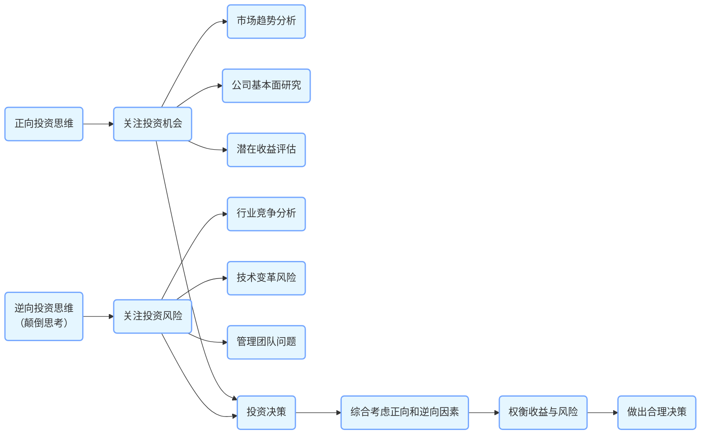

# 芒格的"颠倒思考"：在投资中应用逆向思维

> 关键词：芒格、颠倒思考、投资、逆向思维、决策

> 摘要：本文深入探讨了芒格的“颠倒思考”理念在投资领域的应用。通过对核心概念的剖析、算法原理的阐述、数学模型的讲解、项目实战案例的分析，揭示了逆向思维在投资决策中的重要性。同时，介绍了该理念的实际应用场景，推荐了相关的学习资源、开发工具和研究论文，最后对其未来发展趋势与挑战进行了总结，并提供了常见问题解答和扩展阅读资料。

## 1. 背景介绍 
### 1.1 目的和范围
本文旨在全面介绍芒格的“颠倒思考”理念在投资领域的应用。通过深入分析这一独特的思维方式，帮助投资者更好地理解其原理和优势，并学会在实际投资决策中运用逆向思维。我们将探讨该理念的核心概念、算法原理、数学模型，通过实际案例展示其应用效果，同时提供相关的学习资源和工具，为投资者提供一个系统的学习和实践指南。

### 1.2 预期读者
本文主要面向对投资感兴趣的人群，包括专业投资者、投资初学者、金融从业者以及对思维方式和决策方法有研究兴趣的人士。无论您是已经在投资领域有一定经验，还是刚刚涉足投资，都能从本文中获得有价值的信息和启发。

### 1.3 文档结构概述
本文将按照以下结构进行阐述：首先介绍“颠倒思考”的核心概念与联系，通过文本示意图和 Mermaid 流程图直观展示其原理和架构；接着详细讲解核心算法原理，并给出具体操作步骤，同时使用 Python 源代码进行说明；然后介绍相关的数学模型和公式，并通过举例进行详细讲解；之后通过项目实战案例，包括开发环境搭建、源代码实现和代码解读，展示逆向思维在投资中的实际应用；再介绍该理念的实际应用场景；推荐相关的学习资源、开发工具和研究论文；最后总结未来发展趋势与挑战，提供常见问题解答和扩展阅读资料。

### 1.4 术语表
#### 1.4.1 核心术语定义
- **颠倒思考**：由查理·芒格提出的一种思维方式，强调通过逆向思考来解决问题，即不是直接思考如何达到目标，而是思考如何避免失败。
- **逆向思维**：与正向思维相对，是一种从相反方向进行思考的思维方式，在投资中常用于分析风险、寻找被低估的资产等。
- **投资决策**：投资者根据自身的投资目标、风险承受能力等因素，对投资对象、投资时机、投资金额等进行选择和判断的过程。

#### 1.4.2 相关概念解释
- **正向思维**：在投资中，正向思维通常是指按照常规的逻辑和方法，从市场趋势、公司基本面等方面直接分析投资机会。而逆向思维则是从相反的角度，如市场的负面因素、被忽视的风险等方面进行思考。
- **风险评估**：对投资过程中可能面临的各种风险进行识别、分析和评估的过程。逆向思维可以帮助投资者更全面地评估风险，发现潜在的问题。

#### 1.4.3 缩略词列表
- 无

## 2. 核心概念与联系 

### 核心概念原理
芒格的“颠倒思考”核心在于通过逆向思维来审视投资决策。传统的投资思维往往侧重于寻找投资机会，关注资产的潜在收益。而“颠倒思考”则强调先考虑可能导致投资失败的因素，通过避免这些失败来提高投资的成功率。

例如，在评估一家公司的投资价值时，正向思维可能会关注公司的市场份额、增长率、盈利前景等积极因素。而逆向思维则会思考公司可能面临的风险，如行业竞争加剧、技术变革、管理团队问题等。通过对这些风险的分析和评估，投资者可以更全面地了解公司的状况，避免陷入潜在的投资陷阱。

### 架构的文本示意图
```plaintext
正向投资思维
|
|-- 关注投资机会
|   |-- 市场趋势分析
|   |-- 公司基本面研究
|   |-- 潜在收益评估
|
逆向投资思维（颠倒思考）
|
|-- 关注投资风险
|   |-- 行业竞争分析
|   |-- 技术变革风险
|   |-- 管理团队问题
|
投资决策
|
|-- 综合考虑正向和逆向因素
|   |-- 权衡收益与风险
|   |-- 做出合理决策
```

### Mermaid 流程图


## 3. 核心算法原理 & 具体操作步骤 

### 核心算法原理
“颠倒思考”在投资中的核心算法原理可以概括为以下几个步骤：
1. **定义投资目标**：明确投资者的投资目标，如长期资本增值、短期收益、资产保值等。
2. **列出失败因素**：逆向思考，列出可能导致投资无法实现目标的各种因素。这些因素可以包括市场风险、行业风险、公司特定风险等。
3. **评估风险概率**：对每个失败因素发生的概率进行评估，可以使用历史数据、行业研究、专家意见等方法。
4. **制定应对策略**：针对每个失败因素，制定相应的应对策略，如分散投资、设置止损点、深入研究公司等。
5. **综合决策**：综合考虑正向因素（如潜在收益）和逆向因素（如风险），做出最终的投资决策。

### 具体操作步骤
以下是使用 Python 实现上述核心算法原理的具体操作步骤和代码示例：

```python
# 步骤 1: 定义投资目标
investment_goal = "长期资本增值"

# 步骤 2: 列出失败因素
failure_factors = [
    "市场大幅下跌",
    "行业竞争加剧导致公司市场份额下降",
    "公司财务造假",
    "技术变革使公司产品过时"
]

# 步骤 3: 评估风险概率
risk_probabilities = {
    "市场大幅下跌": 0.2,
    "行业竞争加剧导致公司市场份额下降": 0.3,
    "公司财务造假": 0.1,
    "技术变革使公司产品过时": 0.2
}

# 步骤 4: 制定应对策略
response_strategies = {
    "市场大幅下跌": "分散投资，配置一定比例的债券",
    "行业竞争加剧导致公司市场份额下降": "深入研究公司竞争优势，定期评估市场份额",
    "公司财务造假": "仔细审查公司财务报表，关注审计意见",
    "技术变革使公司产品过时": "关注行业技术发展趋势，评估公司研发能力"
}

# 步骤 5: 综合决策
# 假设正向因素评估得到的潜在收益为 0.5
potential_return = 0.5

# 计算总风险概率
total_risk_probability = sum(risk_probabilities.values())

# 简单的风险收益权衡，这里假设风险和收益线性相关
if potential_return > total_risk_probability:
    decision = "投资"
else:
    decision = "不投资"

print(f"投资目标: {investment_goal}")
print("失败因素及风险概率:")
for factor, probability in risk_probabilities.items():
    print(f"{factor}: {probability * 100}%")
print("应对策略:")
for factor, strategy in response_strategies.items():
    print(f"{factor}: {strategy}")
print(f"决策: {decision}")
```

在上述代码中，我们首先定义了投资目标，然后列出了可能的失败因素，并对每个因素的风险概率进行了评估。接着，针对每个失败因素制定了相应的应对策略。最后，通过简单的风险收益权衡，做出了投资决策。

## 4. 数学模型和公式 & 详细讲解 & 举例说明 

### 数学模型和公式
在投资中应用“颠倒思考”可以使用一些数学模型和公式来辅助决策。其中一个常用的模型是风险调整后的收益模型，公式如下：

$$
\text{风险调整后的收益} = \frac{\text{预期收益}}{\text{风险系数}}
$$

其中，预期收益是投资者对投资项目的预期回报，风险系数可以通过对各种失败因素的评估来确定。风险系数越高，说明投资面临的风险越大。

### 详细讲解
风险调整后的收益模型的核心思想是在考虑投资收益的同时，充分考虑投资所面临的风险。通过将预期收益除以风险系数，我们可以得到一个经过风险调整后的收益指标，该指标可以更准确地反映投资的实际价值。

例如，如果两个投资项目的预期收益相同，但一个项目的风险系数较高，那么该项目的风险调整后的收益就会较低，说明该项目在考虑风险因素后，实际价值相对较低。

### 举例说明
假设我们有两个投资项目 A 和 B，相关数据如下：

| 项目 | 预期收益 | 风险系数 |
| ---- | ---- | ---- |
| A | 20% | 1.5 |
| B | 18% | 1.2 |

根据风险调整后的收益公式，计算两个项目的风险调整后的收益：

项目 A 的风险调整后的收益为：

$$
\frac{0.2}{1.5} \approx 0.133
$$

项目 B 的风险调整后的收益为：

$$
\frac{0.18}{1.2} = 0.15
$$

虽然项目 A 的预期收益高于项目 B，但项目 B 的风险调整后的收益更高，说明在考虑风险因素后，项目 B 更具投资价值。

## 5. 项目实战：代码实际案例和详细解释说明 

### 5.1  开发环境搭建
为了实现“颠倒思考”在投资中的应用，我们可以使用 Python 进行开发。以下是搭建开发环境的步骤：
1. **安装 Python**：从 Python 官方网站（https://www.python.org/downloads/）下载并安装最新版本的 Python。
2. **安装必要的库**：我们需要使用一些 Python 库来进行数据处理和分析，如 `pandas`、`numpy` 等。可以使用以下命令进行安装：
```sh
pip install pandas numpy
```

### 5.2  源代码详细实现和代码解读
以下是一个使用“颠倒思考”进行股票投资决策的实际案例代码：

```python
import pandas as pd
import numpy as np

# 步骤 1: 定义投资目标
investment_goal = "长期资本增值"

# 步骤 2: 收集股票数据
# 假设我们有一个包含股票信息的 CSV 文件
stock_data = pd.read_csv('stock_data.csv')

# 步骤 3: 列出失败因素并评估风险概率
failure_factors = [
    "市场整体下跌",
    "公司业绩下滑",
    "行业竞争加剧"
]

risk_probabilities = {
    "市场整体下跌": 0.2,
    "公司业绩下滑": 0.3,
    "行业竞争加剧": 0.2
}

# 步骤 4: 计算风险系数
risk_coefficient = sum(risk_probabilities.values())

# 步骤 5: 评估预期收益
# 假设我们根据历史数据和分析，计算出每只股票的预期收益
stock_data['expected_return'] = np.random.uniform(0.1, 0.3, len(stock_data))

# 步骤 6: 计算风险调整后的收益
stock_data['risk_adjusted_return'] = stock_data['expected_return'] / risk_coefficient

# 步骤 7: 做出投资决策
# 选择风险调整后的收益最高的股票
selected_stock = stock_data[stock_data['risk_adjusted_return'] == stock_data['risk_adjusted_return'].max()]

print(f"投资目标: {investment_goal}")
print("失败因素及风险概率:")
for factor, probability in risk_probabilities.items():
    print(f"{factor}: {probability * 100}%")
print("选择的股票:")
print(selected_stock[['stock_name', 'risk_adjusted_return']])
```

### 代码解读与分析
1. **数据收集**：使用 `pandas` 库读取包含股票信息的 CSV 文件，获取股票的基本数据。
2. **风险评估**：列出可能的失败因素，并对每个因素的风险概率进行评估，然后计算风险系数。
3. **预期收益评估**：根据历史数据和分析，为每只股票计算预期收益。
4. **风险调整后的收益计算**：使用风险调整后的收益公式，为每只股票计算风险调整后的收益。
5. **投资决策**：选择风险调整后的收益最高的股票作为投资对象。

通过这个案例，我们可以看到如何使用“颠倒思考”的方法，在考虑风险因素的情况下，做出更合理的投资决策。

## 6. 实际应用场景 
### 股票投资
在股票投资中，逆向思维可以帮助投资者发现被市场忽视的机会。例如，当市场整体下跌时，很多投资者会恐慌抛售股票，但逆向投资者会思考市场下跌的原因是否真的影响到了公司的长期价值。如果公司的基本面没有发生重大变化，只是受到市场情绪的影响而股价下跌，那么逆向投资者可能会认为这是一个买入的机会。

### 基金投资
在选择基金时，逆向思维可以帮助投资者避免盲目跟风。很多投资者会选择近期业绩表现优异的基金，但逆向投资者会思考这种优异表现是否可持续。他们会关注基金的投资策略、管理团队、风险控制等方面，而不是仅仅看短期业绩。例如，如果一只基金的投资策略过于激进，虽然近期业绩很好，但可能面临较大的风险，逆向投资者可能会谨慎考虑。

### 房地产投资
在房地产投资中，逆向思维可以帮助投资者发现潜在的价值洼地。当某个地区的房地产市场被普遍看好时，房价可能已经被推高，投资回报率可能较低。而逆向投资者会关注那些被市场忽视的地区，思考这些地区是否有潜在的发展机会，如基础设施建设、产业升级等。如果这些地区有发展潜力，那么在房价还未大幅上涨时进行投资，可能会获得较高的回报。

### 创业投资
在创业投资中，逆向思维可以帮助投资者发现创新的商业模式和机会。很多创业者会跟风进入热门行业，但逆向投资者会思考那些被忽视的行业和领域。例如，当大家都在关注互联网行业时，逆向投资者可能会关注传统行业的数字化转型机会，或者新兴的小众行业。通过逆向思考，投资者可以发现一些具有独特竞争力的创业项目。

## 7. 工具和资源推荐
### 7.1 学习资源推荐
#### 7.1.1 书籍推荐
- 《穷查理宝典：查理·芒格的智慧箴言录》：这本书全面介绍了查理·芒格的投资理念、思维方式和人生智慧，是学习“颠倒思考”的必读之书。
- 《聪明的投资者》：本杰明·格雷厄姆的经典著作，强调了价值投资和逆向思维的重要性，对投资者有很大的启发。
- 《投资中最简单的事》：邱国鹭的作品，结合了中国市场的实际情况，阐述了投资的基本原理和逆向思维的应用。

#### 7.1.2 在线课程
- Coursera 上的“投资学原理”课程：该课程由知名教授授课，系统介绍了投资的基本理论和方法，包括逆向思维在投资中的应用。
- 网易云课堂上的“价值投资实战”课程：通过实际案例分析，讲解了价值投资和逆向思维的具体应用。

#### 7.1.3 技术博客和网站
- 雪球网：一个投资交流社区，有很多投资者分享自己的投资经验和逆向思维的案例。
- 价值投资网：专注于价值投资领域，提供了大量关于逆向思维和投资决策的文章和分析。

### 7.2 开发工具框架推荐
#### 7.2.1 IDE和编辑器
- PyCharm：一款专业的 Python 集成开发环境，具有强大的代码编辑、调试和分析功能，适合用于开发投资分析相关的 Python 程序。
- Jupyter Notebook：一种交互式的开发环境，适合进行数据探索和分析，方便展示代码和结果。

#### 7.2.2 调试和性能分析工具
- PDB：Python 自带的调试器，可以帮助开发者定位和解决代码中的问题。
- cProfile：Python 的性能分析工具，可以帮助开发者找出代码中的性能瓶颈。

#### 7.2.3 相关框架和库
- Pandas：用于数据处理和分析的 Python 库，提供了高效的数据结构和数据操作方法，适合处理投资数据。
- Numpy：用于科学计算的 Python 库，提供了高性能的多维数组对象和各种数学函数，可用于投资模型的计算。

### 7.3 相关论文著作推荐
#### 7.3.1 经典论文
- 《证券分析》（Security Analysis）：本杰明·格雷厄姆和戴维·多德的经典论文，奠定了价值投资的理论基础，其中包含了逆向思维的思想。
- 《有效市场假说》（Efficient Market Hypothesis）：尤金·法玛的论文，探讨了市场效率和投资策略的关系，对逆向投资有一定的启示。

#### 7.3.2 最新研究成果
- 近年来，有很多关于行为金融学的研究成果，探讨了投资者的心理和行为对投资决策的影响，其中涉及到逆向思维在投资中的应用。可以通过学术数据库如知网、万方等查找相关论文。

#### 7.3.3 应用案例分析
- 一些金融研究机构和投资公司会发布投资案例分析报告，其中可能包含逆向思维在实际投资中的应用案例。可以关注这些机构的官方网站或研究报告。

## 8. 总结：未来发展趋势与挑战
### 未来发展趋势
- **与大数据和人工智能结合**：随着大数据和人工智能技术的发展，逆向思维在投资中的应用将更加智能化。通过分析海量的市场数据和投资者行为数据，可以更准确地发现市场的异常情况和潜在的投资机会。例如，利用机器学习算法对市场情绪进行分析，判断投资者的恐慌或乐观情绪，从而为逆向投资提供决策依据。
- **跨领域应用拓展**：逆向思维不仅仅局限于传统的金融投资领域，未来将在更多领域得到应用。例如，在科技创新、企业战略规划等领域，逆向思维可以帮助企业发现新的商业模式和发展方向。

### 挑战
- **数据质量和可靠性**：逆向思维的应用依赖于大量的数据和信息，但数据的质量和可靠性可能存在问题。不准确或不完整的数据可能导致错误的投资决策。因此，如何获取高质量的数据，并对数据进行有效的清洗和分析，是一个挑战。
- **投资者心理和情绪影响**：逆向思维要求投资者克服从众心理和情绪的影响，做出独立的判断。但在实际投资中，投资者往往容易受到市场情绪的左右，难以坚持逆向思维。如何培养投资者的逆向思维能力和心理素质，是一个需要解决的问题。
- **市场环境变化**：市场环境是不断变化的，过去有效的逆向投资策略在未来可能不再适用。投资者需要不断学习和适应市场变化，及时调整投资策略。

## 9. 附录：常见问题与解答
### 问题 1：逆向思维是否适用于所有投资领域？
解答：逆向思维在很多投资领域都有应用价值，但并不是适用于所有情况。在一些新兴的、快速发展的行业，正向思维可能更能抓住投资机会。而在一些成熟的、周期性较强的行业，逆向思维可能更有效。投资者需要根据具体的市场情况和投资目标，灵活运用逆向思维和正向思维。

### 问题 2：如何判断逆向投资的时机？
解答：判断逆向投资的时机是一个复杂的问题，需要综合考虑多个因素。可以关注市场情绪、估值水平、行业趋势等。当市场情绪过度悲观，估值水平处于历史低位，而行业的基本面并没有发生重大变化时，可能是逆向投资的时机。但这需要投资者有丰富的经验和深入的研究。

### 问题 3：逆向投资是否一定能获得高收益？
解答：逆向投资并不一定能获得高收益。逆向投资只是一种投资策略，它可以帮助投资者发现被市场忽视的机会，但并不能保证投资成功。投资还受到很多其他因素的影响，如宏观经济环境、公司基本面变化等。投资者在进行逆向投资时，仍然需要进行充分的风险评估和投资分析。

## 10. 扩展阅读 & 参考资料
### 扩展阅读
- 《黑天鹅：如何应对不可预知的未来》：纳西姆·尼古拉斯·塔勒布的著作，探讨了不确定性和极端事件对投资和决策的影响，与逆向思维有一定的关联。
- 《思考，快与慢》：丹尼尔·卡尼曼的作品，介绍了人类的两种思维模式，对理解投资者的心理和行为有很大帮助。

### 参考资料
- 查理·芒格的演讲和访谈记录，可在网上搜索获取。
- 金融学术期刊，如《金融研究》《证券市场导报》等，发表了很多关于投资理论和实践的研究论文。