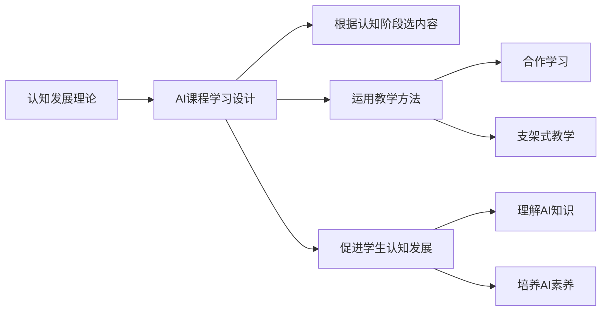

# 认知发展理论指导下的AI课程学习设计

> 关键词：认知发展理论、AI课程、学习设计、教育心理学、人工智能教育

> 摘要：本文旨在探讨如何在认知发展理论的指导下进行AI课程的学习设计。通过深入研究认知发展理论的核心原理及其与AI课程的内在联系，详细阐述AI课程设计中所涉及的核心算法原理、数学模型等内容，并结合项目实战案例进行分析。同时，介绍AI课程的实际应用场景、相关工具和资源，最后对未来AI课程在认知发展理论指导下的发展趋势与挑战进行总结，为AI教育的有效实施提供理论与实践依据。

## 1. 背景介绍 
### 1.1 目的和范围
随着人工智能技术的飞速发展，AI教育逐渐成为教育领域的重要组成部分。本研究的目的在于将认知发展理论融入AI课程学习设计中，以提高学生对AI知识的理解和掌握程度，培养学生的人工智能素养。研究范围涵盖了从认知发展理论的基本概念到AI课程设计的各个环节，包括课程目标设定、教学内容选择、教学方法运用以及课程评价等方面。

### 1.2 预期读者
本文预期读者包括教育工作者，如中小学信息技术教师、高校人工智能相关专业教师等，他们可以从中获取基于认知发展理论的AI课程设计思路和方法，优化自己的教学实践。同时，也适合教育研究者，为他们在AI教育领域的研究提供理论和实践参考。此外，对AI教育感兴趣的学生和家长也能通过本文了解AI课程的设计原理和学习要点。

### 1.3 文档结构概述
本文首先介绍认知发展理论的背景知识和相关术语，为后续的研究奠定基础。接着阐述认知发展理论与AI课程的核心概念及联系，通过示意图和流程图直观展示。然后详细讲解AI课程中涉及的核心算法原理和具体操作步骤，并结合数学模型和公式进行深入分析。之后通过项目实战案例，展示AI课程的实际设计和实施过程。再介绍AI课程的实际应用场景和相关工具资源。最后总结未来AI课程在认知发展理论指导下的发展趋势与挑战，并提供常见问题解答和扩展阅读参考资料。

### 1.4 术语表
#### 1.4.1 核心术语定义
- **认知发展理论**：是研究人类认知能力的发展过程和机制的理论，主要探讨个体从出生到成年的认知结构和认知能力的变化规律。
- **AI课程**：即人工智能课程，是传授人工智能相关知识和技能的课程，包括人工智能的基本概念、算法、模型等内容。
- **学习设计**：是指依据一定的学习理论和教学理论，对学习目标、学习内容、学习活动、学习评价等进行系统规划和设计的过程。

#### 1.4.2 相关概念解释
- **图式**：认知发展理论中的一个重要概念，指个体对世界的知觉、理解和思考的方式，是认知结构的基本单元。
- **同化**：个体将环境中的信息纳入已有的图式中，以丰富和加强已有的认知结构。
- **顺应**：当个体遇到不能用已有图式来同化新的刺激时，便要对原有图式加以修改或重建，以适应环境。

#### 1.4.3 缩略词列表
- **AI**：Artificial Intelligence，人工智能
- **ML**：Machine Learning，机器学习
- **DL**：Deep Learning，深度学习

## 2. 核心概念与联系 

### 认知发展理论的核心原理
认知发展理论主要有皮亚杰的认知发展阶段理论、维果茨基的社会文化理论等。皮亚杰认为个体的认知发展经历了感知运动阶段、前运算阶段、具体运算阶段和形式运算阶段。在不同阶段，个体的认知结构和认知能力具有不同的特点。例如，在感知运动阶段（0 - 2岁），婴儿主要通过感知和动作来认识世界；在前运算阶段（2 - 7岁），儿童开始使用符号和表象来思考，但思维具有自我中心性和不可逆性。

维果茨基的社会文化理论强调社会文化环境对个体认知发展的重要作用，提出了“最近发展区”的概念，即个体实际发展水平与潜在发展水平之间的差距，教学应着眼于学生的最近发展区，为学生提供带有难度的内容，调动学生的积极性，发挥其潜能。

### AI课程的核心概念
AI课程主要涉及人工智能的基本概念、机器学习、深度学习等内容。人工智能是指让计算机模拟人类智能的技术，包括自然语言处理、计算机视觉、专家系统等领域。机器学习是人工智能的一个重要分支，它通过让计算机从数据中学习模式和规律，从而实现预测和决策。深度学习则是机器学习的一种，它通过构建多层神经网络来学习数据的深层特征。

### 认知发展理论与AI课程的联系
认知发展理论为AI课程的学习设计提供了理论基础。根据皮亚杰的认知发展阶段理论，不同年龄段的学生具有不同的认知特点，因此在设计AI课程时，应根据学生的认知阶段选择合适的教学内容和教学方法。例如，对于处于具体运算阶段的学生，可以通过具体的实例和操作来讲解AI的基本概念；对于处于形式运算阶段的学生，则可以引导他们进行抽象的思考和理论的探究。

维果茨基的社会文化理论强调合作学习和支架式教学在AI课程中的应用。通过合作学习，学生可以在与同伴的交流和互动中共同探索AI知识，促进认知发展。支架式教学则可以根据学生的最近发展区，为学生提供适当的支持和引导，帮助学生逐步掌握AI知识和技能。

### 文本示意图
认知发展理论与AI课程的联系可以用以下文本示意图表示：

认知发展理论（皮亚杰、维果茨基等）
|
|-- 指导AI课程学习设计
|   |
|   |-- 根据认知阶段选择教学内容
|   |-- 运用合作学习和支架式教学方法
|
|-- 促进学生认知发展
|   |
|   |-- 提高学生对AI知识的理解和掌握
|   |-- 培养学生的人工智能素养

### Mermaid流程图


## 3. 核心算法原理 & 具体操作步骤 

### 机器学习中的线性回归算法原理
线性回归是一种基本的机器学习算法，用于预测连续值的输出。其基本原理是通过找到一条最佳的直线（在二维空间中）或超平面（在多维空间中），使得所有数据点到该直线或超平面的距离之和最小。

假设我们有一组数据点 $(x_1, y_1), (x_2, y_2), \cdots, (x_n, y_n)$，其中 $x_i$ 是输入特征，$y_i$ 是对应的输出值。线性回归模型的表达式为：

$y = \theta_0 + \theta_1x_1 + \theta_2x_2 + \cdots + \theta_mx_m$

其中 $\theta_0, \theta_1, \cdots, \theta_m$ 是模型的参数。

为了找到最佳的参数 $\theta$，我们通常使用最小二乘法，即最小化以下损失函数：

$J(\theta) = \frac{1}{2n}\sum_{i = 1}^{n}(y_i - \hat{y}_i)^2$

其中 $\hat{y}_i$ 是模型的预测值。

### Python源代码实现线性回归算法
```python
import numpy as np

class LinearRegression:
    def __init__(self):
        self.theta = None

    def fit(self, X, y):
        # 在X矩阵中添加一列全为1的列，用于表示截距项
        X_b = np.c_[np.ones((X.shape[0], 1)), X]
        # 使用正规方程求解参数theta
        self.theta = np.linalg.inv(X_b.T.dot(X_b)).dot(X_b.T).dot(y)

    def predict(self, X):
        X_b = np.c_[np.ones((X.shape[0], 1)), X]
        return X_b.dot(self.theta)

# 示例数据
X = np.array([[1], [2], [3], [4], [5]])
y = np.array([2, 4, 6, 8, 10])

# 创建线性回归模型
model = LinearRegression()
# 训练模型
model.fit(X, y)
# 预测新数据
new_X = np.array([[6]])
prediction = model.predict(new_X)
print("预测值:", prediction)
```

### 具体操作步骤
1. **数据准备**：收集和整理相关的数据，将其分为输入特征 $X$ 和输出值 $y$。
2. **模型初始化**：创建线性回归模型的实例。
3. **模型训练**：调用模型的 `fit` 方法，使用训练数据来估计模型的参数 $\theta$。
4. **模型预测**：使用训练好的模型对新的数据进行预测，调用模型的 `predict` 方法。

## 4. 数学模型和公式 & 详细讲解 & 举例说明 

### 线性回归的数学模型和公式详细讲解
线性回归的数学模型 $y = \theta_0 + \theta_1x_1 + \theta_2x_2 + \cdots + \theta_mx_m$ 可以用矩阵形式表示为：

$\mathbf{y} = \mathbf{X}\boldsymbol{\theta}$

其中 $\mathbf{y}$ 是 $n$ 维的输出向量，$\mathbf{X}$ 是 $n \times (m + 1)$ 的输入矩阵（包含截距项），$\boldsymbol{\theta}$ 是 $(m + 1)$ 维的参数向量。

最小二乘法的损失函数 $J(\theta) = \frac{1}{2n}\sum_{i = 1}^{n}(y_i - \hat{y}_i)^2$ 可以用矩阵形式表示为：

$J(\boldsymbol{\theta}) = \frac{1}{2n}(\mathbf{y} - \mathbf{X}\boldsymbol{\theta})^T(\mathbf{y} - \mathbf{X}\boldsymbol{\theta})$

为了找到使损失函数最小的参数 $\boldsymbol{\theta}$，我们对 $J(\boldsymbol{\theta})$ 求关于 $\boldsymbol{\theta}$ 的偏导数，并令其等于零：

$\frac{\partial J(\boldsymbol{\theta})}{\partial \boldsymbol{\theta}} = \frac{1}{n}\mathbf{X}^T(\mathbf{X}\boldsymbol{\theta} - \mathbf{y}) = 0$

解这个方程可以得到参数 $\boldsymbol{\theta}$ 的最优解：

$\boldsymbol{\theta} = (\mathbf{X}^T\mathbf{X})^{-1}\mathbf{X}^T\mathbf{y}$

这就是正规方程的表达式。

### 举例说明
假设我们有以下数据：

| 输入特征 $x$ | 输出值 $y$ |
| --- | --- |
| 1 | 2 |
| 2 | 4 |
| 3 | 6 |
| 4 | 8 |
| 5 | 10 |

我们可以使用线性回归模型来预测 $x = 6$ 时的 $y$ 值。

首先，将数据表示为矩阵形式：

$\mathbf{X} = \begin{bmatrix} 1 & 1 \\ 1 & 2 \\ 1 & 3 \\ 1 & 4 \\ 1 & 5 \end{bmatrix}$

$\mathbf{y} = \begin{bmatrix} 2 \\ 4 \\ 6 \\ 8 \\ 10 \end{bmatrix}$

然后，根据正规方程计算参数 $\boldsymbol{\theta}$：

$\boldsymbol{\theta} = (\mathbf{X}^T\mathbf{X})^{-1}\mathbf{X}^T\mathbf{y} = \begin{bmatrix} 0 \\ 2 \end{bmatrix}$

最后，预测 $x = 6$ 时的 $y$ 值：

$\hat{y} = \begin{bmatrix} 1 & 6 \end{bmatrix}\begin{bmatrix} 0 \\ 2 \end{bmatrix} = 12$

## 5. 项目实战：代码实际案例和详细解释说明 

### 5.1  开发环境搭建
- **Python环境**：安装Python 3.x 版本，可以从Python官方网站（https://www.python.org/downloads/） 下载并安装。
- **开发工具**：推荐使用PyCharm或Jupyter Notebook作为开发工具。PyCharm是一款功能强大的Python集成开发环境，Jupyter Notebook则适合进行交互式的代码编写和数据分析。
- **必要的库**：安装 `numpy`、`pandas`、`matplotlib` 等常用的Python库，可以使用 `pip` 命令进行安装，例如：

```sh
pip install numpy pandas matplotlib
```

### 5.2  源代码详细实现和代码解读
以下是一个使用Python实现简单的AI图像分类项目的代码示例，使用的是 `scikit-learn` 库中的手写数字数据集。

```python
# 导入必要的库
from sklearn.datasets import load_digits
from sklearn.model_selection import train_test_split
from sklearn.svm import SVC
from sklearn.metrics import accuracy_score
import matplotlib.pyplot as plt

# 加载手写数字数据集
digits = load_digits()
X = digits.data  # 特征数据
y = digits.target  # 标签数据

# 划分训练集和测试集
X_train, X_test, y_train, y_test = train_test_split(X, y, test_size=0.2, random_state=42)

# 创建支持向量机分类器
clf = SVC(kernel='linear')

# 训练模型
clf.fit(X_train, y_train)

# 预测测试集
y_pred = clf.predict(X_test)

# 计算准确率
accuracy = accuracy_score(y_test, y_pred)
print("准确率:", accuracy)

# 可视化部分预测结果
fig, axes = plt.subplots(2, 5, figsize=(10, 4))
for i, ax in enumerate(axes.flat):
    ax.imshow(X_test[i].reshape(8, 8), cmap='gray')
    ax.set_title(f"预测: {y_pred[i]}")
    ax.axis('off')
plt.show()
```

### 代码解读与分析
1. **数据加载**：使用 `load_digits()` 函数从 `scikit-learn` 库中加载手写数字数据集，将特征数据存储在 `X` 中，标签数据存储在 `y` 中。
2. **数据划分**：使用 `train_test_split()` 函数将数据集划分为训练集和测试集，测试集占总数据的20%。
3. **模型创建**：创建一个支持向量机分类器 `SVC`，并指定核函数为线性核。
4. **模型训练**：使用训练集数据对模型进行训练，调用 `fit()` 方法。
5. **模型预测**：使用训练好的模型对测试集数据进行预测，调用 `predict()` 方法。
6. **准确率计算**：使用 `accuracy_score()` 函数计算模型的准确率。
7. **结果可视化**：使用 `matplotlib` 库可视化部分预测结果，展示手写数字图像和对应的预测标签。

## 6. 实际应用场景 
### 教育领域
在教育领域，AI课程可以帮助学生培养逻辑思维能力、创新能力和解决问题的能力。通过认知发展理论指导下的AI课程学习设计，可以根据学生的认知水平和学习能力，设计个性化的学习方案。例如，在中小学阶段，可以通过简单的编程和游戏化的方式，让学生了解AI的基本概念和应用；在高校阶段，则可以深入学习AI的算法和模型，培养学生的科研能力和实践能力。

### 医疗领域
AI在医疗领域的应用越来越广泛，如疾病诊断、医学影像分析、药物研发等。通过AI课程的学习，培养专业的AI医疗人才，可以提高医疗诊断的准确性和效率，推动医疗技术的发展。例如，学生可以学习深度学习算法，开发基于医学影像的疾病诊断模型，帮助医生更准确地诊断疾病。

### 金融领域
在金融领域，AI可以用于风险评估、投资决策、客户服务等方面。认知发展理论指导下的AI课程可以培养学生在金融领域应用AI技术的能力，帮助金融机构提高风险管理水平和服务质量。例如，学生可以学习机器学习算法，开发信用风险评估模型，为金融机构提供决策支持。

### 交通领域
AI在交通领域的应用包括自动驾驶、智能交通系统等。通过AI课程的学习，学生可以了解自动驾驶的原理和技术，参与智能交通系统的研发和优化。例如，学生可以学习计算机视觉和传感器技术，开发自动驾驶汽车的环境感知系统。

## 7. 工具和资源推荐
### 7.1 学习资源推荐
#### 7.1.1 书籍推荐
- 《人工智能：一种现代的方法》：这是一本经典的人工智能教材，全面介绍了人工智能的各个领域，包括搜索算法、知识表示、机器学习、自然语言处理等。
- 《Python机器学习》：详细介绍了使用Python进行机器学习的方法和技术，包括数据预处理、模型选择、模型评估等内容。
- 《深度学习》：由深度学习领域的三位先驱Ian Goodfellow、Yoshua Bengio和Aaron Courville撰写，是深度学习领域的权威著作。

#### 7.1.2 在线课程
- Coursera上的“机器学习”课程：由斯坦福大学的Andrew Ng教授授课，是机器学习领域的经典课程，内容涵盖了机器学习的基本概念、算法和应用。
- edX上的“人工智能基础”课程：介绍了人工智能的基本原理和技术，包括搜索算法、知识表示、机器学习等内容。
- 中国大学MOOC上的“人工智能导论”课程：由国内知名高校的教师授课，适合初学者了解人工智能的基本概念和发展现状。

#### 7.1.3 技术博客和网站
- Medium：是一个知名的技术博客平台，上面有很多关于人工智能、机器学习、深度学习等领域的优秀文章。
- Towards Data Science：专注于数据科学和机器学习领域，提供了很多实用的教程和案例分析。
- 机器之心：是国内知名的人工智能媒体，提供了丰富的人工智能资讯、技术文章和研究报告。

### 7.2 开发工具框架推荐
#### 7.2.1 IDE和编辑器
- PyCharm：是一款功能强大的Python集成开发环境，提供了代码编辑、调试、版本控制等功能，适合专业的Python开发者。
- Jupyter Notebook：是一个交互式的代码编写和数据分析工具，支持多种编程语言，适合进行数据探索和模型开发。
- Visual Studio Code：是一款轻量级的代码编辑器，支持多种编程语言和插件扩展，适合初学者和快速开发。

#### 7.2.2 调试和性能分析工具
- TensorBoard：是TensorFlow提供的可视化工具，可以用于查看模型的训练过程、损失函数曲线、模型结构等信息。
- Py-Spy：是一个用于Python代码性能分析的工具，可以帮助开发者找出代码中的性能瓶颈。
- cProfile：是Python标准库中的性能分析工具，可以统计函数的调用次数、执行时间等信息。

#### 7.2.3 相关框架和库
- TensorFlow：是Google开发的开源深度学习框架，提供了丰富的工具和接口，支持多种深度学习任务。
- PyTorch：是Facebook开发的开源深度学习框架，具有动态图的特点，适合快速开发和研究。
- Scikit-learn：是一个简单易用的机器学习库，提供了多种机器学习算法和工具，适合初学者和快速原型开发。

### 7.3 相关论文著作推荐
#### 7.3.1 经典论文
- “A Logical Calculus of the Ideas Immanent in Nervous Activity”：由Warren McCulloch和Walter Pitts于1943年发表，提出了人工神经元模型，为神经网络的发展奠定了基础。
- “Learning Representations by Back-propagating Errors”：由David Rumelhart、Geoffrey Hinton和Ronald Williams于1986年发表，介绍了反向传播算法，推动了神经网络的发展。
- “ImageNet Classification with Deep Convolutional Neural Networks”：由Alex Krizhevsky、Ilya Sutskever和Geoffrey Hinton于2012年发表，介绍了AlexNet模型，开启了深度学习在计算机视觉领域的革命。

#### 7.3.2 最新研究成果
- OpenAI的GPT系列论文：介绍了基于Transformer架构的语言模型，在自然语言处理领域取得了显著的成果。
- DeepMind的AlphaGo系列论文：介绍了使用强化学习算法开发的围棋人工智能程序，在围棋领域击败了人类冠军。

#### 7.3.3 应用案例分析
- 《AI未来进行式》：李开复和王咏刚著，介绍了人工智能在医疗、金融、教育、交通等领域的应用案例和发展趋势。
- 《智能时代》：吴军著，探讨了人工智能对社会和经济的影响，以及如何在智能时代中把握机遇。

## 8. 总结：未来发展趋势与挑战
### 未来发展趋势
- **个性化学习**：随着认知发展理论的不断深入研究和AI技术的不断进步，未来的AI课程将更加注重个性化学习。根据每个学生的认知特点、学习进度和兴趣爱好，为学生提供个性化的学习内容和学习路径，提高学习效果。
- **跨学科融合**：AI教育将与其他学科进行更深入的融合，如数学、物理、生物等。通过跨学科的学习，学生可以更好地理解AI的原理和应用，培养综合能力和创新思维。
- **实践导向**：未来的AI课程将更加注重实践教学，通过实际项目和案例分析，让学生在实践中掌握AI知识和技能。同时，加强与企业的合作，为学生提供更多的实习和就业机会，提高学生的实践能力和职业素养。

### 挑战
- **师资短缺**：目前，具备AI知识和教学能力的教师相对短缺，这给AI课程的推广和实施带来了一定的困难。需要加强对教师的培训，提高教师的AI教学水平。
- **课程体系不完善**：目前的AI课程体系还不够完善，缺乏统一的标准和规范。需要进一步研究和制定科学合理的AI课程体系，确保课程内容的系统性和科学性。
- **伦理和安全问题**：随着AI技术的广泛应用，伦理和安全问题日益突出。在AI课程中，需要加强对学生的伦理和安全教育，培养学生的社会责任感和安全意识。

## 9. 附录：常见问题与解答
### 问题1：认知发展理论如何具体应用到AI课程学习设计中？
答：可以根据皮亚杰的认知发展阶段理论，针对不同年龄段学生的认知特点选择合适的教学内容和教学方法。例如，对于低年龄段学生，可以通过游戏和实例让他们了解AI的基本概念；对于高年龄段学生，则可以引导他们进行理论探究和算法实现。同时，运用维果茨基的社会文化理论，采用合作学习和支架式教学方法，促进学生的认知发展。

### 问题2：AI课程中涉及的算法原理是否很难理解？
答：AI课程中涉及的算法原理有一定的难度，但可以通过逐步引导和实例讲解来帮助学生理解。例如，在讲解线性回归算法时，可以先从简单的二维空间入手，通过图形和具体数据来解释算法的原理，然后再推广到多维空间。同时，结合Python代码实现，让学生在实践中加深对算法的理解。

### 问题3：如何评估AI课程的学习效果？
答：可以采用多种方式评估AI课程的学习效果，如考试、作业、项目实践、实验报告等。同时，可以关注学生的学习过程，如参与度、合作能力、问题解决能力等。此外，还可以通过学生的自我评价和同伴评价来全面了解学生的学习情况。

## 10. 扩展阅读 & 参考资料
### 扩展阅读
- 《人工智能简史》：详细介绍了人工智能的发展历程和重要事件，有助于读者全面了解人工智能的发展脉络。
- 《人类简史：从动物到上帝》：虽然不是专门的AI书籍，但探讨了人类的认知发展和技术进步对人类社会的影响，与认知发展理论和AI教育有一定的关联。

### 参考资料
- Piaget, J. (1952). The Origins of Intelligence in Children. International Universities Press.
- Vygotsky, L. S. (1978). Mind in Society: The Development of Higher Psychological Processes. Harvard University Press.
- Géron, A. (2019). Hands-On Machine Learning with Scikit-Learn, Keras, and TensorFlow: Concepts, Tools, and Techniques to Build Intelligent Systems. O'Reilly Media.