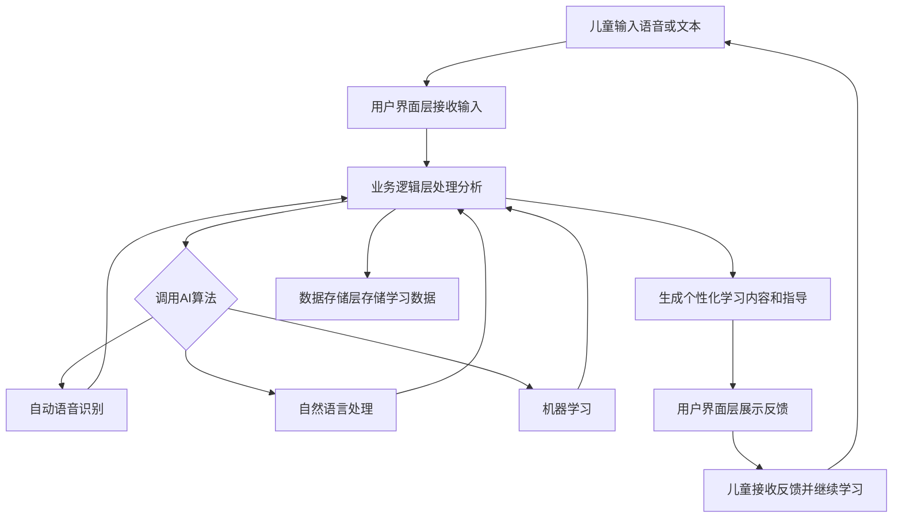

# 认知发展理论指导下的AI辅助儿童语言学习系统

> 关键词：认知发展理论、AI、儿童语言学习系统、智能交互、个性化学习

> 摘要：本文聚焦于认知发展理论指导下的AI辅助儿童语言学习系统。首先阐述了该系统开发的背景及相关理论基础，详细介绍了核心概念及联系，包括系统架构与工作原理。深入讲解了系统所涉及的核心算法原理，并给出Python源代码示例。通过数学模型和公式对系统的相关机制进行详细分析与举例说明。结合项目实战，展示了系统的开发环境搭建、源代码实现及代码解读。探讨了系统的实际应用场景，推荐了相关的学习资源、开发工具框架以及论文著作。最后对系统未来发展趋势与挑战进行总结，并在附录中提供常见问题解答，还列出扩展阅读与参考资料，旨在全面深入地介绍这一具有创新性和实用性的儿童语言学习系统。

## 1. 背景介绍 
### 1.1 目的和范围
随着科技的飞速发展，人工智能在教育领域的应用越来越广泛。儿童时期是语言学习的关键阶段，传统的儿童语言学习方式存在着缺乏个性化、互动性不足等问题。本AI辅助儿童语言学习系统的目的在于利用认知发展理论，结合人工智能技术，开发出一套能够根据儿童不同的认知发展阶段，提供个性化、互动性强的语言学习方案的系统。

本系统的范围涵盖了儿童从幼儿期到小学阶段的语言学习，包括语音识别、词汇学习、语法理解、句子构建等多个方面。系统旨在通过智能交互，激发儿童的学习兴趣，提高儿童的语言学习效果。

### 1.2 预期读者
本文的预期读者包括教育工作者，他们可以从中了解如何将认知发展理论与人工智能技术结合应用于儿童语言教学中，为教学方法的创新提供思路；儿童家长，他们可以借助本系统更好地辅助孩子进行语言学习；人工智能开发者，他们可以参考系统的架构、算法等内容，进行相关领域的技术研发；教育技术研究者，他们可以从理论和实践的结合上，深入研究儿童语言学习的新方法和新技术。

### 1.3 文档结构概述
本文首先介绍了认知发展理论指导下的AI辅助儿童语言学习系统的背景信息，包括目的、预期读者和文档结构概述等内容。接着阐述了系统的核心概念与联系，包括认知发展理论的原理、AI技术在系统中的应用以及系统的整体架构。然后详细讲解了系统的核心算法原理和具体操作步骤，并给出Python源代码示例。之后通过数学模型和公式对系统的相关机制进行分析和举例说明。结合项目实战，展示了系统的开发环境搭建、源代码实现及代码解读。探讨了系统的实际应用场景，推荐了相关的学习资源、开发工具框架以及论文著作。最后对系统未来发展趋势与挑战进行总结，在附录中提供常见问题解答，并列出扩展阅读与参考资料。

### 1.4 术语表
#### 1.4.1 核心术语定义
- **认知发展理论**：是指研究人类认知能力的发展过程和机制的理论，如皮亚杰的认知发展阶段理论，该理论将儿童的认知发展分为感知运动阶段、前运算阶段、具体运算阶段和形式运算阶段。
- **AI（人工智能）**：是指计算机系统能够执行通常需要人类智能才能完成的任务，如语音识别、自然语言处理、机器学习等。
- **儿童语言学习系统**：是指专门为儿童设计的，用于辅助儿童进行语言学习的软件系统。

#### 1.4.2 相关概念解释
- **智能交互**：是指系统能够根据用户的输入，自动生成相应的反馈和指导，实现人与系统之间的自然、高效的交互。
- **个性化学习**：是指根据每个学习者的特点和需求，提供定制化的学习内容和学习方式，以提高学习效果。

#### 1.4.3 缩略词列表
- **NLP（Natural Language Processing）**：自然语言处理
- **ML（Machine Learning）**：机器学习
- **ASR（Automatic Speech Recognition）**：自动语音识别

## 2. 核心概念与联系 

### 认知发展理论与儿童语言学习
认知发展理论认为，儿童的认知能力是逐步发展的，不同的认知发展阶段对语言学习有不同的需求和特点。例如，在感知运动阶段，儿童主要通过感知和动作来认识世界，语言学习主要是对语音的感知和模仿；在前运算阶段，儿童开始使用符号和表象进行思维，语言学习中开始出现词汇的积累和简单句子的表达；在具体运算阶段，儿童能够进行逻辑推理，但需要具体事物的支持，语言学习中语法和语义的理解逐渐加深；在形式运算阶段，儿童能够进行抽象思维，语言学习中能够进行复杂的语言表达和逻辑分析。

### AI技术在儿童语言学习系统中的应用
AI技术在儿童语言学习系统中发挥着重要作用。自动语音识别（ASR）技术可以将儿童的语音输入转换为文本，方便系统进行处理和分析；自然语言处理（NLP）技术可以对儿童的文本输入进行语义理解、语法分析等，为系统提供反馈和指导；机器学习（ML）技术可以根据儿童的学习数据，自动调整学习内容和学习方式，实现个性化学习。

### 系统架构与工作原理
本系统的架构主要包括用户界面层、业务逻辑层和数据存储层。用户界面层负责与儿童进行交互，接收儿童的语音或文本输入，并将系统的反馈和指导展示给儿童；业务逻辑层是系统的核心，负责对儿童的输入进行处理和分析，调用相关的AI算法，生成个性化的学习内容和指导；数据存储层负责存储儿童的学习数据、系统的知识图谱等信息。

下面是系统的Mermaid流程图：


## 3. 核心算法原理 & 具体操作步骤 

### 自动语音识别（ASR）算法原理
自动语音识别的主要任务是将语音信号转换为文本。常见的ASR算法基于深度学习，如端到端的深度神经网络（DNN）模型。其基本原理是通过大量的语音数据进行训练，让模型学习语音信号和文本之间的映射关系。

以下是一个简单的Python示例，使用`SpeechRecognition`库进行语音识别：
```python
import speech_recognition as sr

def recognize_speech():
    r = sr.Recognizer()
    with sr.Microphone() as source:
        print("请说话...")
        audio = r.listen(source)

    try:
        text = r.recognize_google(audio, language='zh-CN')
        print("识别结果: " + text)
        return text
    except sr.UnknownValueError:
        print("无法识别语音")
    except sr.RequestError as e:
        print("请求错误; {0}".format(e))
    return None

if __name__ == "__main__":
    recognize_speech()
```
### 自然语言处理（NLP）算法原理
自然语言处理包括语义理解、语法分析等任务。以语义理解为例，常用的方法是使用词向量模型，如Word2Vec。词向量模型将每个词表示为一个向量，通过计算向量之间的相似度来判断词与词之间的语义关系。

以下是一个简单的Python示例，使用`gensim`库训练Word2Vec模型：
```python
from gensim.models import Word2Vec

# 示例文本数据
sentences = [["我", "喜欢", "学习", "语言"], ["儿童", "在", "学习", "语言"]]

# 训练Word2Vec模型
model = Word2Vec(sentences, min_count=1)

# 获取词向量
vector = model.wv['学习']
print("学习的词向量: ", vector)

# 查找最相似的词
similar_words = model.wv.most_similar('学习')
print("与学习最相似的词: ", similar_words)
```
### 机器学习（ML）算法原理
机器学习在儿童语言学习系统中主要用于个性化学习。可以使用基于内容的推荐算法，根据儿童的学习历史和兴趣偏好，推荐适合的学习内容。

以下是一个简单的Python示例，使用`scikit-learn`库实现基于内容的推荐算法：
```python
from sklearn.feature_extraction.text import TfidfVectorizer
from sklearn.metrics.pairwise import cosine_similarity

# 学习内容
learning_contents = ["词汇学习", "语法学习", "句子构建"]

# 儿童的学习历史
learning_history = ["词汇学习"]

# 计算TF-IDF向量
vectorizer = TfidfVectorizer()
content_vectors = vectorizer.fit_transform(learning_contents)
history_vector = vectorizer.transform(learning_history)

# 计算相似度
similarities = cosine_similarity(history_vector, content_vectors)

# 推荐最相似的学习内容
recommended_index = similarities.argmax()
recommended_content = learning_contents[recommended_index]
print("推荐的学习内容: ", recommended_content)
```

### 具体操作步骤
1. 儿童通过用户界面输入语音或文本。
2. 系统的用户界面层接收输入，并将其传递给业务逻辑层。
3. 业务逻辑层调用自动语音识别算法，将语音输入转换为文本。
4. 业务逻辑层调用自然语言处理算法，对文本进行语义理解和语法分析。
5. 业务逻辑层调用机器学习算法，根据儿童的学习历史和当前输入，生成个性化的学习内容和指导。
6. 业务逻辑层将生成的学习内容和指导传递给用户界面层。
7. 用户界面层将学习内容和指导展示给儿童。
8. 儿童接收反馈并继续学习，重复上述步骤。

## 4. 数学模型和公式 & 详细讲解 & 举例说明 

### 自动语音识别（ASR）的数学模型
自动语音识别可以看作是一个概率模型，目标是找到最可能的文本序列 $W$ 来匹配输入的语音信号 $X$。根据贝叶斯定理，可以表示为：

$$W^* = \arg\max_{W} P(W|X) = \arg\max_{W} \frac{P(X|W)P(W)}{P(X)}$$

其中，$P(W|X)$ 是给定语音信号 $X$ 时文本序列 $W$ 的后验概率，$P(X|W)$ 是给定文本序列 $W$ 时语音信号 $X$ 的似然概率，$P(W)$ 是文本序列 $W$ 的先验概率，$P(X)$ 是语音信号 $X$ 的概率。由于 $P(X)$ 对于所有的 $W$ 都是相同的，因此可以忽略不计，得到：

$$W^* = \arg\max_{W} P(X|W)P(W)$$

在实际应用中，$P(X|W)$ 通常由声学模型计算，$P(W)$ 通常由语言模型计算。

### 自然语言处理（NLP）的数学模型
以词向量模型Word2Vec为例，其目标是学习每个词的向量表示，使得在语义上相似的词在向量空间中距离较近。Word2Vec有两种训练模型：跳字模型（Skip-gram）和连续词袋模型（CBOW）。

#### 跳字模型（Skip-gram）
跳字模型的目标是根据中心词预测其上下文词。设中心词为 $w_t$，上下文词为 $w_{t-c}, \cdots, w_{t-1}, w_{t+1}, \cdots, w_{t+c}$，其中 $c$ 是上下文窗口的大小。跳字模型的损失函数可以表示为：

$$L = -\sum_{t=1}^{T} \sum_{-c \leq j \leq c, j \neq 0} \log P(w_{t+j}|w_t)$$

其中，$T$ 是文本的长度，$P(w_{t+j}|w_t)$ 是给定中心词 $w_t$ 时上下文词 $w_{t+j}$ 的概率，可以通过softmax函数计算：

$$P(w_{t+j}|w_t) = \frac{\exp(u_{w_{t+j}}^T v_{w_t})}{\sum_{w=1}^{V} \exp(u_w^T v_{w_t})}$$

其中，$u_w$ 是上下文词 $w$ 的向量表示，$v_{w_t}$ 是中心词 $w_t$ 的向量表示，$V$ 是词汇表的大小。

#### 连续词袋模型（CBOW）
连续词袋模型的目标是根据上下文词预测中心词。设上下文词为 $w_{t-c}, \cdots, w_{t-1}, w_{t+1}, \cdots, w_{t+c}$，中心词为 $w_t$。连续词袋模型的损失函数可以表示为：

$$L = -\sum_{t=1}^{T} \log P(w_t|w_{t-c}, \cdots, w_{t-1}, w_{t+1}, \cdots, w_{t+c})$$

其中，$P(w_t|w_{t-c}, \cdots, w_{t-1}, w_{t+1}, \cdots, w_{t+c})$ 是给定上下文词时中心词 $w_t$ 的概率，可以通过softmax函数计算：

$$P(w_t|w_{t-c}, \cdots, w_{t-1}, w_{t+1}, \cdots, w_{t+c}) = \frac{\exp(u_{w_t}^T \frac{1}{2c} \sum_{-c \leq j \leq c, j \neq 0} v_{w_{t+j}})}{\sum_{w=1}^{V} \exp(u_w^T \frac{1}{2c} \sum_{-c \leq j \leq c, j \neq 0} v_{w_{t+j}})}$$

### 机器学习（ML）的数学模型
以基于内容的推荐算法为例，使用余弦相似度来计算学习内容和儿童学习历史之间的相似度。设学习内容的向量表示为 $x$，儿童学习历史的向量表示为 $y$，则余弦相似度可以表示为：

$$\text{sim}(x, y) = \frac{x \cdot y}{\|x\| \|y\|}$$

其中，$x \cdot y$ 是向量 $x$ 和 $y$ 的点积，$\|x\|$ 和 $\|y\|$ 分别是向量 $x$ 和 $y$ 的模。

### 举例说明
#### 自动语音识别
假设输入的语音信号 $X$ 是“我喜欢学习”，通过声学模型计算得到 $P(X|W_1) = 0.8$（$W_1$ 表示“我喜欢学习”），$P(X|W_2) = 0.2$（$W_2$ 表示“我讨厌学习”），通过语言模型计算得到 $P(W_1) = 0.9$，$P(W_2) = 0.1$。则：

$$P(W_1|X) \propto P(X|W_1)P(W_1) = 0.8 \times 0.9 = 0.72$$

$$P(W_2|X) \propto P(X|W_2)P(W_2) = 0.2 \times 0.1 = 0.02$$

因为 $P(W_1|X) > P(W_2|X)$，所以系统识别的文本序列为 $W_1$，即“我喜欢学习”。

#### 自然语言处理
假设词汇表中有三个词：“学习”、“喜欢”、“儿童”，其向量表示分别为：

$v_{学习} = [0.1, 0.2, 0.3]$

$v_{喜欢} = [0.2, 0.3, 0.4]$

$v_{儿童} = [0.4, 0.5, 0.6]$

中心词为“学习”，上下文词为“喜欢”，则根据跳字模型计算：

$u_{喜欢}^T v_{学习} = [0.2, 0.3, 0.4] \cdot [0.1, 0.2, 0.3] = 0.2 \times 0.1 + 0.3 \times 0.2 + 0.4 \times 0.3 = 0.2$

$\sum_{w=1}^{3} \exp(u_w^T v_{学习}) = \exp(0.2) + \exp([0.4, 0.5, 0.6] \cdot [0.1, 0.2, 0.3]) + \exp([0.1, 0.2, 0.3] \cdot [0.1, 0.2, 0.3])$

$P(喜欢|学习) = \frac{\exp(0.2)}{\sum_{w=1}^{3} \exp(u_w^T v_{学习})}$

#### 机器学习
假设学习内容的向量表示为：

$x_1 = [0.1, 0.2, 0.3]$（词汇学习）

$x_2 = [0.2, 0.3, 0.4]$（语法学习）

$x_3 = [0.3, 0.4, 0.5]$（句子构建）

儿童学习历史的向量表示为 $y = [0.1, 0.2, 0.3]$（词汇学习）

则：

$\text{sim}(y, x_1) = \frac{[0.1, 0.2, 0.3] \cdot [0.1, 0.2, 0.3]}{\| [0.1, 0.2, 0.3] \| \| [0.1, 0.2, 0.3] \|} = 1$

$\text{sim}(y, x_2) = \frac{[0.1, 0.2, 0.3] \cdot [0.2, 0.3, 0.4]}{\| [0.1, 0.2, 0.3] \| \| [0.2, 0.3, 0.4] \|} \approx 0.98$

$\text{sim}(y, x_3) = \frac{[0.1, 0.2, 0.3] \cdot [0.3, 0.4, 0.5]}{\| [0.1, 0.2, 0.3] \| \| [0.3, 0.4, 0.5] \|} \approx 0.96$

因为 $\text{sim}(y, x_1)$ 最大，所以推荐的学习内容为“词汇学习”。

## 5. 项目实战：代码实际案例和详细解释说明 

### 5.1  开发环境搭建
#### 硬件环境
- 服务器：可以选择云服务器，如阿里云、腾讯云等，配置建议为2核4G内存以上。
- 客户端设备：可以是普通的电脑、平板电脑或智能手机。

#### 软件环境
- 操作系统：服务器端可以选择Linux系统，如Ubuntu 18.04及以上版本；客户端可以根据设备类型选择相应的操作系统，如Windows、iOS、Android等。
- 编程语言：Python 3.6及以上版本。
- 开发框架和库：
    - `SpeechRecognition`：用于语音识别。
    - `gensim`：用于自然语言处理中的词向量模型。
    - `scikit-learn`：用于机器学习算法。
    - `Flask`：用于搭建Web服务器，实现用户界面和业务逻辑的交互。

#### 安装步骤
1. 安装Python：可以从Python官方网站下载并安装Python 3.6及以上版本。
2. 安装依赖库：使用`pip`命令安装所需的库，例如：
```sh
pip install SpeechRecognition gensim scikit-learn Flask
```

### 5.2  源代码详细实现和代码解读
以下是一个简化的AI辅助儿童语言学习系统的代码示例，包括用户界面、语音识别、自然语言处理和学习内容推荐等功能。

```python
from flask import Flask, request, jsonify
import speech_recognition as sr
from gensim.models import Word2Vec
from sklearn.feature_extraction.text import TfidfVectorizer
from sklearn.metrics.pairwise import cosine_similarity

app = Flask(__name__)

# 示例学习内容
learning_contents = ["词汇学习", "语法学习", "句子构建"]

# 示例儿童学习历史
learning_history = []

# 训练Word2Vec模型
sentences = [["我", "喜欢", "学习", "语言"], ["儿童", "在", "学习", "语言"]]
word2vec_model = Word2Vec(sentences, min_count=1)

# 语音识别函数
def recognize_speech():
    r = sr.Recognizer()
    with sr.Microphone() as source:
        print("请说话...")
        audio = r.listen(source)

    try:
        text = r.recognize_google(audio, language='zh-CN')
        print("识别结果: " + text)
        return text
    except sr.UnknownValueError:
        print("无法识别语音")
    except sr.RequestError as e:
        print("请求错误; {0}".format(e))
    return None

# 自然语言处理函数（简单示例）
def nlp_process(text):
    words = text.split()
    vectors = []
    for word in words:
        if word in word2vec_model.wv:
            vectors.append(word2vec_model.wv[word])
    return vectors

# 学习内容推荐函数
def recommend_learning_content():
    vectorizer = TfidfVectorizer()
    content_vectors = vectorizer.fit_transform(learning_contents)
    history_vector = vectorizer.transform(learning_history)

    similarities = cosine_similarity(history_vector, content_vectors)
    recommended_index = similarities.argmax()
    recommended_content = learning_contents[recommended_index]
    return recommended_content

# 处理语音输入的API
@app.route('/speech_input', methods=['POST'])
def speech_input():
    text = recognize_speech()
    if text:
        learning_history.append(text)
        vectors = nlp_process(text)
        recommended_content = recommend_learning_content()
        return jsonify({
            "text": text,
            "vectors": vectors,
            "recommended_content": recommended_content
        })
    else:
        return jsonify({"error": "无法识别语音"})

if __name__ == '__main__':
    app.run(debug=True)
```

### 5.3  代码解读与分析
1. **导入必要的库**：导入了`Flask`、`speech_recognition`、`gensim`、`scikit-learn`等库，用于实现Web服务器、语音识别、自然语言处理和机器学习等功能。
2. **定义学习内容和学习历史**：`learning_contents` 存储了示例学习内容，`learning_history` 存储了儿童的学习历史。
3. **训练Word2Vec模型**：使用示例文本数据训练Word2Vec模型，用于自然语言处理。
4. **语音识别函数**：`recognize_speech` 函数使用`SpeechRecognition`库进行语音识别，将语音信号转换为文本。
5. **自然语言处理函数**：`nlp_process` 函数将输入的文本进行分词，并将每个词转换为词向量。
6. **学习内容推荐函数**：`recommend_learning_content` 函数使用基于内容的推荐算法，根据儿童的学习历史推荐适合的学习内容。
7. **处理语音输入的API**：`/speech_input` 是一个POST请求的API，接收语音输入，进行语音识别、自然语言处理和学习内容推荐，并返回处理结果。
8. **启动Web服务器**：使用`Flask`的`app.run`方法启动Web服务器，监听客户端的请求。

## 6. 实际应用场景 
### 家庭学习场景
在家庭环境中，儿童可以使用本系统进行自主语言学习。系统可以根据儿童的语音输入，实时提供反馈和指导，帮助儿童纠正发音、理解词汇和语法。例如，当儿童朗读一篇课文时，系统可以识别儿童的语音，分析其中的错误，并给出正确的发音和解释。同时，系统可以根据儿童的学习历史，推荐适合的学习内容，如词汇练习、语法讲解等，提高儿童的语言学习效果。

### 学校教学场景
在学校教学中，教师可以将本系统作为辅助教学工具。教师可以利用系统的语音识别和自然语言处理功能，对学生的口语表达和写作进行评估和反馈。例如，在口语课上，教师可以让学生使用系统进行口语练习，系统可以自动评估学生的发音、流利度和语法正确性，并给出详细的评价和建议。在写作课上，系统可以对学生的作文进行语法检查和语义分析，帮助教师更高效地批改作文。此外，系统还可以根据学生的学习情况，为教师提供个性化的教学方案，提高教学质量。

### 特殊教育场景
对于有语言障碍或学习困难的儿童，本系统可以提供针对性的语言学习支持。系统可以根据儿童的特殊需求，调整学习内容和学习方式。例如，对于发音困难的儿童，系统可以提供更多的发音练习和纠正指导；对于理解能力较弱的儿童，系统可以使用更简单、生动的方式讲解词汇和语法。同时，系统可以记录儿童的学习进展，为家长和教师提供详细的学习报告，帮助他们更好地了解儿童的学习情况，制定更有效的教育计划。

## 7. 工具和资源推荐
### 7.1 学习资源推荐
#### 7.1.1 书籍推荐
- 《认知发展理论》：全面介绍了认知发展的相关理论，包括皮亚杰的认知发展阶段理论、维果茨基的社会文化理论等，有助于深入理解儿童的认知发展过程和机制。
- 《Python自然语言处理》：详细介绍了Python在自然语言处理中的应用，包括文本处理、语音识别、语义理解等方面的技术和方法。
- 《机器学习实战》：通过实际案例介绍了机器学习的基本算法和应用，如分类算法、回归算法、聚类算法等，适合初学者快速入门。

#### 7.1.2 在线课程
- Coursera平台上的“Natural Language Processing Specialization”：由知名大学的教授授课，系统介绍了自然语言处理的理论和实践，包括词向量模型、语言模型、机器翻译等内容。
- edX平台上的“Artificial Intelligence for Robotics”：讲解了人工智能在机器人领域的应用，其中涉及到的语音识别、智能交互等技术与本系统相关。
- 中国大学MOOC平台上的“Python语言程序设计”：适合零基础的学习者，系统介绍了Python语言的基础知识和编程技巧。

#### 7.1.3 技术博客和网站
- 博客园：汇聚了众多技术开发者的经验分享和技术文章，在人工智能、自然语言处理等领域有很多有价值的内容。
- 知乎：有很多关于儿童教育、人工智能应用等方面的讨论和分享，可以获取不同的观点和见解。
- 开源中国：提供了大量的开源项目和技术资源，对于了解相关技术的最新发展和应用案例有很大帮助。

### 7.2 开发工具框架推荐
#### 7.2.1 IDE和编辑器
- PyCharm：功能强大的Python集成开发环境，提供代码编辑、调试、版本控制等功能，适合开发大型Python项目。
- Visual Studio Code：轻量级的代码编辑器，支持多种编程语言，有丰富的插件可以扩展功能，适合快速开发和调试。

#### 7.2.2 调试和性能分析工具
- pdb：Python自带的调试工具，可以帮助开发者定位代码中的错误和问题。
- cProfile：Python的性能分析工具，可以分析代码的运行时间和资源消耗，帮助优化代码性能。

#### 7.2.3 相关框架和库
- TensorFlow：开源的机器学习框架，提供了丰富的深度学习模型和工具，可用于开发更复杂的语音识别和自然语言处理模型。
- PyTorch：另一个流行的深度学习框架，具有简洁的API和高效的计算性能，适合进行研究和开发。
- NLTK：自然语言处理工具包，提供了丰富的文本处理功能，如分词、词性标注、命名实体识别等。

### 7.3 相关论文著作推荐
#### 7.3.1 经典论文
- “A Logical Calculus of the Ideas Immanent in Nervous Activity”：由Warren S. McCulloch和Walter Pitts发表，提出了神经元模型，为神经网络的发展奠定了基础。
- “Efficient Estimation of Word Representations in Vector Space”：由Tomas Mikolov等人发表，介绍了Word2Vec模型，推动了词向量技术的发展。

#### 7.3.2 最新研究成果
- 关注ACM SIGKDD、NeurIPS、ACL等顶级学术会议的最新论文，了解人工智能、自然语言处理等领域的最新研究进展。
- 查阅《Journal of Artificial Intelligence Research》、《Transactions of the Association for Computational Linguistics》等学术期刊，获取高质量的研究论文。

#### 7.3.3 应用案例分析
- 参考《Educational Technology Research and Development》等期刊上的论文，了解人工智能在教育领域的应用案例和实践经验。
- 关注一些教育科技公司的官方网站和博客，获取他们在儿童语言学习系统等方面的应用案例和技术分享。

## 8. 总结：未来发展趋势与挑战
### 未来发展趋势
#### 更个性化的学习体验
随着人工智能技术的不断发展，AI辅助儿童语言学习系统将能够更精准地了解每个儿童的学习特点和需求，提供更加个性化的学习内容和学习方式。例如，系统可以根据儿童的认知发展阶段、学习进度、兴趣爱好等因素，动态调整学习计划和教学策略，实现真正的因材施教。

#### 多模态交互
未来的系统将不仅仅局限于语音和文本交互，还将结合图像、视频、手势等多种模态进行交互。例如，儿童可以通过展示图片、做出手势等方式与系统进行互动，系统也可以通过视频、动画等形式更生动地呈现学习内容，提高儿童的学习兴趣和参与度。

#### 与虚拟现实（VR）和增强现实（AR）技术结合
将VR和AR技术应用于儿童语言学习系统中，可以为儿童创造更加沉浸式的学习环境。例如，儿童可以在虚拟的场景中进行语言实践，与虚拟角色进行对话，提高语言运用能力。同时，AR技术可以将虚拟的学习内容与现实场景相结合，增强学习的趣味性和实用性。

#### 跨语言学习
随着全球化的发展，儿童学习多种语言的需求越来越大。未来的系统将支持跨语言学习，能够帮助儿童同时学习多种语言，并提供语言之间的对比和转换功能，提高儿童的语言学习效率和跨文化交流能力。

### 挑战
#### 数据隐私和安全问题
AI辅助儿童语言学习系统需要收集和处理大量的儿童个人信息和学习数据，这些数据的隐私和安全问题至关重要。如何确保数据不被泄露、滥用，保护儿童的合法权益，是系统开发和应用过程中需要解决的重要问题。

#### 技术局限性
虽然人工智能技术在不断发展，但目前仍然存在一些技术局限性。例如，语音识别在复杂环境下的准确率有待提高，自然语言处理在理解语义和上下文方面还存在一定的困难。如何克服这些技术局限性，提高系统的性能和可靠性，是需要进一步研究和解决的问题。

#### 教育理念的融合
将认知发展理论与人工智能技术相结合，需要在教育理念和技术实现之间找到平衡。如何确保系统的设计和开发符合儿童的认知发展规律和教育需求，避免过度依赖技术而忽视了儿童的情感、社交等方面的发展，是需要深入思考和探讨的问题。

#### 成本和可及性
开发和维护AI辅助儿童语言学习系统需要投入大量的人力、物力和财力，这使得系统的成本较高。如何降低系统的成本，提高系统的可及性，让更多的儿童能够受益于该系统，是推广和应用该系统面临的挑战之一。

## 9. 附录：常见问题与解答
### 1. 系统的语音识别准确率如何？
系统的语音识别准确率受多种因素影响，如语音质量、背景噪音、儿童的发音清晰度等。在理想的环境下，系统的语音识别准确率可以达到较高水平，但在复杂环境下，准确率可能会有所下降。我们会不断优化语音识别算法，提高系统的准确率。

### 2. 系统如何保护儿童的个人信息和学习数据？
我们采用了多种安全措施来保护儿童的个人信息和学习数据。例如，对数据进行加密处理，限制数据的访问权限，定期进行数据备份和安全审计等。同时，我们严格遵守相关的法律法规，确保数据的隐私和安全。

### 3. 系统是否支持多语言学习？
目前系统主要支持中文语言学习，未来我们会逐步扩展支持更多的语言，以满足不同儿童的学习需求。

### 4. 系统适合哪个年龄段的儿童使用？
系统主要适合幼儿期到小学阶段的儿童使用。系统会根据儿童的不同认知发展阶段，提供相应的学习内容和指导。

### 5. 系统能否与学校的教学内容相结合？
系统可以与学校的教学内容相结合。我们会不断更新和完善系统的学习内容，使其与学校的教学大纲和课程标准相匹配。同时，教师可以根据教学需要，灵活调整系统的使用方式和学习计划。

## 10. 扩展阅读 & 参考资料
### 扩展阅读
- 《儿童心理学》：深入了解儿童的心理发展过程和特点，对于理解儿童语言学习的机制有很大帮助。
- 《人工智能时代的教育革命》：探讨了人工智能技术对教育领域的影响和变革，为AI辅助儿童语言学习系统的发展提供了宏观的视角。
- 《教育中的技术应用》：介绍了各种技术在教育中的应用案例和实践经验，有助于启发系统的设计和开发思路。

### 参考资料
- 皮亚杰. 《发生认识论原理》.
- 维果茨基. 《思维与语言》.
- 相关的学术论文和研究报告，如ACM SIGKDD、NeurIPS、ACL等会议的论文，《Journal of Artificial Intelligence Research》、《Transactions of the Association for Computational Linguistics》等期刊的文章。
- 开源项目和技术文档，如TensorFlow、PyTorch、NLTK等框架和库的官方文档。