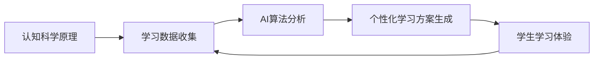

# 认知科学启发的AI驱动个性化学习体验设计

> 关键词：认知科学、AI、个性化学习体验、学习设计、教育技术

> 摘要：本文深入探讨了基于认知科学启发的AI驱动个性化学习体验设计。首先介绍了相关背景，包括目的、预期读者、文档结构和术语表。接着阐述了核心概念及其联系，通过示意图和流程图进行清晰展示。详细讲解了核心算法原理和具体操作步骤，并使用Python代码进行说明。同时给出了相关数学模型和公式，并举例解释。在项目实战部分，展示了开发环境搭建、源代码实现及解读。分析了实际应用场景，推荐了学习资源、开发工具框架和相关论文著作。最后总结了未来发展趋势与挑战，还包含常见问题解答和扩展阅读参考资料，旨在为教育领域利用认知科学和AI技术打造个性化学习体验提供全面的指导和深入的思考。

## 1. 背景介绍 
### 1.1 目的和范围
在当今教育领域，传统的“一刀切”式教学方法已难以满足学生多样化的学习需求。每个学生都有独特的学习风格、知识基础和学习速度。本文章的目的在于探索如何结合认知科学的原理和AI技术，设计出能够为每个学生提供个性化学习体验的方案。范围涵盖了从理论基础的认知科学原理到实际应用的AI技术实现，以及如何将两者融合到具体的学习体验设计中。通过研究和实践，旨在为教育机构、教师和教育技术开发者提供一种新的思路和方法，以提高学生的学习效果和学习满意度。

### 1.2 预期读者
本文的预期读者主要包括教育领域的专业人士，如教师、教育研究者、教育机构管理人员等，他们可以从中获取将认知科学和AI技术应用于教学实践的方法和思路，以改进教学策略和提升教学质量。同时，对于从事教育技术开发的程序员、软件架构师和CTO等，本文提供了技术实现的原理和具体步骤，有助于他们开发出更符合学生需求的个性化学习系统。此外，对教育创新和人工智能应用感兴趣的学生和爱好者也可以从本文中了解到相关领域的前沿知识和发展趋势。

### 1.3 文档结构概述
本文将按照以下结构进行阐述。首先介绍相关的背景知识，包括目的、读者和术语表等。接着深入探讨核心概念及其联系，通过示意图和流程图清晰展示认知科学与AI在个性化学习体验设计中的关系。然后详细讲解核心算法原理和具体操作步骤，并使用Python代码进行说明。之后给出相关的数学模型和公式，并通过举例进行解释。在项目实战部分，将展示开发环境的搭建、源代码的实现及代码解读。分析实际应用场景，为不同场景下的个性化学习体验设计提供参考。推荐学习资源、开发工具框架和相关论文著作，帮助读者进一步深入学习。最后总结未来发展趋势与挑战，并提供常见问题解答和扩展阅读参考资料。

### 1.4 术语表
#### 1.4.1 核心术语定义
- **认知科学**：是一门研究人类认知过程的跨学科领域，涉及心理学、神经科学、语言学、哲学等多个学科。它主要研究人类如何感知、学习、记忆、思考和解决问题等认知活动。
- **AI（人工智能）**：是指让计算机模拟人类智能的技术和方法，包括机器学习、深度学习、自然语言处理等。在个性化学习体验设计中，AI可以用于分析学生的学习数据、预测学生的学习需求和提供个性化的学习建议。
- **个性化学习体验**：根据每个学生的独特特征，如学习风格、知识水平、兴趣爱好等，为其量身定制的学习过程和体验。旨在提高学生的学习效果和学习动力。
- **学习风格**：指学生在学习过程中表现出的偏好和方式，如视觉型、听觉型、动觉型等。不同的学习风格适合不同的学习方法和教学资源。

#### 1.4.2 相关概念解释
- **认知负荷理论**：该理论认为人类的认知资源是有限的。在学习过程中，如果学习材料的复杂性超过了学生的认知负荷，就会导致学习困难。因此，在设计学习体验时，需要根据学生的认知能力合理安排学习内容和教学方法。
- **机器学习算法**：是AI的核心技术之一，通过让计算机从大量的数据中学习规律和模式，从而实现预测和决策。在个性化学习中，机器学习算法可以用于分析学生的学习数据，如学习时间、答题正确率等，以了解学生的学习状态和需求。
- **自适应学习系统**：是一种能够根据学生的学习情况自动调整学习内容和难度的系统。它利用AI技术实时监测学生的学习进度和表现，为学生提供最适合的学习资源和学习任务。

#### 1.4.3 缩略词列表
- **AI**：Artificial Intelligence（人工智能）
- **ML**：Machine Learning（机器学习）
- **DL**：Deep Learning（深度学习）
- **NLP**：Natural Language Processing（自然语言处理）

## 2. 核心概念与联系 

### 核心概念原理
认知科学为个性化学习体验设计提供了理论基础。它揭示了人类学习的本质和规律，例如人类的记忆分为短期记忆和长期记忆，短期记忆容量有限，而长期记忆则可以存储大量的信息。在学习过程中，需要将新知识与已有的知识结构相结合，才能更好地理解和记忆。认知科学还研究了不同的学习风格和认知策略，如视觉型学习者更擅长通过图像和图表来学习，而听觉型学习者则更适合通过听讲来学习。

AI技术则为实现个性化学习体验提供了技术手段。通过机器学习算法，可以对学生的学习数据进行分析和挖掘，了解学生的学习行为和模式。例如，通过分析学生的答题记录，可以发现学生在哪些知识点上存在困难，从而为其提供针对性的学习资源和辅导。深度学习技术可以处理复杂的学习数据，如图像、语音等，为学生提供更加丰富的学习体验。自然语言处理技术可以实现人机交互，让学生能够通过语音或文字与学习系统进行交流。

### 架构的文本示意图
以下是一个简单的文本示意图，展示了认知科学启发的AI驱动个性化学习体验设计的架构：

认知科学原理（学习风格、认知负荷理论等） ---> 学习数据收集（学习时间、答题记录等） ---> AI算法分析（机器学习、深度学习等） ---> 个性化学习方案生成（学习资源推荐、学习任务安排等） ---> 学生学习体验（个性化学习过程）

### Mermaid 流程图

这个流程图展示了一个循环的过程。首先，基于认知科学原理收集学生的学习数据，然后使用AI算法对这些数据进行分析，生成个性化的学习方案。学生在实施这些学习方案的过程中产生新的学习数据，这些数据又会被收集起来，进入下一轮的分析和方案调整，从而不断优化学生的学习体验。

## 3. 核心算法原理 & 具体操作步骤 

### 核心算法原理
在个性化学习体验设计中，常用的核心算法包括聚类算法、推荐算法和预测算法等。

#### 聚类算法
聚类算法的目的是将学生根据其学习特征进行分组。例如，根据学生的学习风格、知识水平等特征，将学生分为不同的类别。常用的聚类算法有K-Means算法。K-Means算法的基本思想是将数据点划分为K个簇，使得每个数据点都属于离它最近的簇的中心。

以下是K-Means算法的Python代码实现：
```python
import numpy as np
from sklearn.cluster import KMeans

# 示例学习数据
X = np.array([[1, 2], [1, 4], [1, 0], [4, 2], [4, 4], [4, 0]])

# 创建K-Means模型，设置簇的数量为2
kmeans = KMeans(n_clusters=2, random_state=0).fit(X)

# 打印每个数据点所属的簇
print(kmeans.labels_)

# 打印簇的中心
print(kmeans.cluster_centers_)
```
在这个代码中，我们首先创建了一个示例学习数据`X`，然后使用`KMeans`模型将数据分为2个簇。最后打印出每个数据点所属的簇和簇的中心。

#### 推荐算法
推荐算法用于为学生推荐适合的学习资源。常用的推荐算法有基于内容的推荐算法和协同过滤推荐算法。基于内容的推荐算法根据学习资源的特征和学生的兴趣偏好进行推荐。协同过滤推荐算法则根据其他学生的学习行为来为目标学生推荐学习资源。

以下是一个简单的基于内容的推荐算法的Python代码实现：
```python
import pandas as pd

# 学习资源特征数据
resources = pd.DataFrame({
    'resource_id': [1, 2, 3],
    'topic': ['math', 'english', 'science'],
    'difficulty': ['easy', 'medium', 'hard']
})

# 学生兴趣偏好数据
student_preferences = {'topic': 'math', 'difficulty': 'easy'}

# 筛选符合学生兴趣偏好的学习资源
recommended_resources = resources[(resources['topic'] == student_preferences['topic']) & (resources['difficulty'] == student_preferences['difficulty'])]

print(recommended_resources)
```
在这个代码中，我们首先创建了学习资源的特征数据和学生的兴趣偏好数据，然后筛选出符合学生兴趣偏好的学习资源并打印出来。

#### 预测算法
预测算法用于预测学生的学习表现和需求。例如，通过分析学生的历史学习数据，预测学生在未来某个知识点上的掌握情况。常用的预测算法有线性回归算法。

以下是线性回归算法的Python代码实现：
```python
from sklearn.linear_model import LinearRegression
import numpy as np

# 示例学习数据
X = np.array([[1], [2], [3], [4], [5]])
y = np.array([2, 4, 6, 8, 10])

# 创建线性回归模型
model = LinearRegression()
model.fit(X, y)

# 预测新的数据点
new_X = np.array([[6]])
prediction = model.predict(new_X)

print(prediction)
```
在这个代码中，我们首先创建了示例学习数据`X`和`y`，然后使用线性回归模型进行训练。最后，我们预测了一个新的数据点的值并打印出来。

### 具体操作步骤
1. **数据收集**：收集学生的学习数据，包括学习时间、答题记录、学习偏好等。可以通过学习管理系统、在线测试平台等工具进行数据收集。
2. **数据预处理**：对收集到的数据进行清洗、转换和归一化等处理，以提高数据的质量和可用性。
3. **算法选择和模型训练**：根据具体的需求选择合适的算法，如聚类算法、推荐算法或预测算法，并使用预处理后的数据进行模型训练。
4. **个性化学习方案生成**：根据训练好的模型，为每个学生生成个性化的学习方案，包括学习资源推荐、学习任务安排等。
5. **学习方案实施和反馈**：让学生按照个性化学习方案进行学习，并收集学生的学习反馈数据，如学习效果、满意度等。
6. **模型更新和优化**：根据学生的学习反馈数据，对模型进行更新和优化，以提高个性化学习方案的准确性和有效性。

## 4. 数学模型和公式 & 详细讲解 & 举例说明 

### K-Means算法的数学模型和公式
K-Means算法的目标是最小化所有数据点到其所属簇的中心的距离之和。数学公式如下：
$$
J = \sum_{i=1}^{n} \sum_{j=1}^{k} r_{ij} \left\| x_i - \mu_j \right\|^2
$$
其中，$n$ 是数据点的数量，$k$ 是簇的数量，$x_i$ 是第 $i$ 个数据点，$\mu_j$ 是第 $j$ 个簇的中心，$r_{ij}$ 是一个指示变量，如果数据点 $x_i$ 属于簇 $j$，则 $r_{ij} = 1$，否则 $r_{ij} = 0$。

### 详细讲解
K-Means算法的具体步骤如下：
1. 随机初始化 $k$ 个簇的中心 $\mu_1, \mu_2, \cdots, \mu_k$。
2. 对于每个数据点 $x_i$，计算它到每个簇的中心的距离 $\left\| x_i - \mu_j \right\|^2$，并将其分配到距离最近的簇中。
3. 更新每个簇的中心，即计算该簇中所有数据点的平均值。
4. 重复步骤2和3，直到簇的中心不再发生变化或达到最大迭代次数。

### 举例说明
假设我们有以下5个数据点：$x_1 = [1, 2], x_2 = [2, 3], x_3 = [8, 7], x_4 = [9, 8], x_5 = [10, 9]$，我们要将这些数据点分为2个簇。

首先，随机初始化2个簇的中心：$\mu_1 = [1, 1], \mu_2 = [10, 10]$。

然后，计算每个数据点到每个簇的中心的距离：
- 对于 $x_1$：
  - 到 $\mu_1$ 的距离：$\left\| [1, 2] - [1, 1] \right\|^2 = (1 - 1)^2 + (2 - 1)^2 = 1$
  - 到 $\mu_2$ 的距离：$\left\| [1, 2] - [10, 10] \right\|^2 = (1 - 10)^2 + (2 - 10)^2 = 81 + 64 = 145$
  因为 $1 < 145$，所以 $x_1$ 属于簇1。
- 对于 $x_2$：
  - 到 $\mu_1$ 的距离：$\left\| [2, 3] - [1, 1] \right\|^2 = (2 - 1)^2 + (3 - 1)^2 = 1 + 4 = 5$
  - 到 $\mu_2$ 的距离：$\left\| [2, 3] - [10, 10] \right\|^2 = (2 - 10)^2 + (3 - 10)^2 = 64 + 49 = 113$
  因为 $5 < 113$，所以 $x_2$ 属于簇1。
- 对于 $x_3$：
  - 到 $\mu_1$ 的距离：$\left\| [8, 7] - [1, 1] \right\|^2 = (8 - 1)^2 + (7 - 1)^2 = 49 + 36 = 85$
  - 到 $\mu_2$ 的距离：$\left\| [8, 7] - [10, 10] \right\|^2 = (8 - 10)^2 + (7 - 10)^2 = 4 + 9 = 13$
  因为 $13 < 85$，所以 $x_3$ 属于簇2。
- 对于 $x_4$：
  - 到 $\mu_1$ 的距离：$\left\| [9, 8] - [1, 1] \right\|^2 = (9 - 1)^2 + (8 - 1)^2 = 64 + 49 = 113$
  - 到 $\mu_2$ 的距离：$\left\| [9, 8] - [10, 10] \right\|^2 = (9 - 10)^2 + (8 - 10)^2 = 1 + 4 = 5$
  因为 $5 < 113$，所以 $x_4$ 属于簇2。
- 对于 $x_5$：
  - 到 $\mu_1$ 的距离：$\left\| [10, 9] - [1, 1] \right\|^2 = (10 - 1)^2 + (9 - 1)^2 = 81 + 64 = 145$
  - 到 $\mu_2$ 的距离：$\left\| [10, 9] - [10, 10] \right\|^2 = (10 - 10)^2 + (9 - 10)^2 = 0 + 1 = 1$
  因为 $1 < 145$，所以 $x_5$ 属于簇2。

接着，更新簇的中心：
- 簇1的中心：$\mu_1 = \frac{[1, 2] + [2, 3]}{2} = [1.5, 2.5]$
- 簇2的中心：$\mu_2 = \frac{[8, 7] + [9, 8] + [10, 9]}{3} = [9, 8]$

重复上述步骤，直到簇的中心不再发生变化。

### 线性回归算法的数学模型和公式
线性回归算法的数学模型可以表示为：
$$
y = \theta_0 + \theta_1 x_1 + \theta_2 x_2 + \cdots + \theta_n x_n + \epsilon
$$
其中，$y$ 是目标变量，$x_1, x_2, \cdots, x_n$ 是特征变量，$\theta_0, \theta_1, \cdots, \theta_n$ 是模型的参数，$\epsilon$ 是误差项。

在简单线性回归中，只有一个特征变量，模型可以简化为：
$$
y = \theta_0 + \theta_1 x + \epsilon
$$

线性回归的目标是找到一组参数 $\theta_0$ 和 $\theta_1$，使得预测值 $\hat{y}$ 与真实值 $y$ 之间的误差最小。常用的误差度量方法是均方误差（MSE）：
$$
MSE = \frac{1}{n} \sum_{i=1}^{n} (y_i - \hat{y}_i)^2
$$
其中，$n$ 是数据点的数量，$y_i$ 是第 $i$ 个数据点的真实值，$\hat{y}_i$ 是第 $i$ 个数据点的预测值。

### 详细讲解
线性回归算法的具体步骤如下：
1. 初始化模型的参数 $\theta_0$ 和 $\theta_1$。
2. 计算预测值 $\hat{y}_i = \theta_0 + \theta_1 x_i$。
3. 计算均方误差 $MSE$。
4. 使用梯度下降法更新模型的参数 $\theta_0$ 和 $\theta_1$，使得 $MSE$ 最小。
5. 重复步骤2到4，直到 $MSE$ 收敛或达到最大迭代次数。

### 举例说明
假设我们有以下数据集：
| $x$ | $y$ |
| --- | --- |
| 1 | 2 |
| 2 | 4 |
| 3 | 6 |
| 4 | 8 |
| 5 | 10 |

我们要使用线性回归算法来拟合这个数据集。

首先，初始化模型的参数 $\theta_0 = 0$ 和 $\theta_1 = 0$。

然后，计算预测值 $\hat{y}_i = \theta_0 + \theta_1 x_i$。例如，当 $x_1 = 1$ 时，$\hat{y}_1 = 0 + 0 \times 1 = 0$。

接着，计算均方误差 $MSE$：
$$
MSE = \frac{1}{5} \sum_{i=1}^{5} (y_i - \hat{y}_i)^2
$$

使用梯度下降法更新模型的参数 $\theta_0$ 和 $\theta_1$。梯度下降法的更新公式如下：
$$
\theta_0 = \theta_0 - \alpha \frac{\partial MSE}{\partial \theta_0}
$$
$$
\theta_1 = \theta_1 - \alpha \frac{\partial MSE}{\partial \theta_1}
$$
其中，$\alpha$ 是学习率。

重复上述步骤，直到 $MSE$ 收敛或达到最大迭代次数。最终，我们可以得到一组最优的参数 $\theta_0$ 和 $\theta_1$，使得模型能够最好地拟合数据集。

## 5. 项目实战：代码实际案例和详细解释说明 

### 5.1  开发环境搭建
#### 安装Python
首先，确保你已经安装了Python。可以从Python官方网站（https://www.python.org/downloads/）下载适合你操作系统的Python版本，并按照安装向导进行安装。

#### 安装必要的库
在命令行中使用以下命令安装必要的库：
```sh
pip install numpy pandas scikit-learn
```
- `numpy`：用于进行数值计算。
- `pandas`：用于数据处理和分析。
- `scikit-learn`：提供了各种机器学习算法和工具。

### 5.2  源代码详细实现和代码解读
以下是一个完整的项目实战代码示例，用于实现基于认知科学启发的AI驱动个性化学习体验设计。

```python
import numpy as np
import pandas as pd
from sklearn.cluster import KMeans
from sklearn.linear_model import LinearRegression
from sklearn.model_selection import train_test_split

# 模拟学习数据
data = {
    'study_time': [2, 3, 4, 5, 6, 7, 8, 9, 10, 11],
    'quiz_score': [30, 40, 50, 60, 70, 80, 90, 95, 98, 100],
    'learning_style': [0, 1, 0, 1, 0, 1, 0, 1, 0, 1]  # 0: 视觉型，1: 听觉型
}

df = pd.DataFrame(data)

# 数据预处理
X = df[['study_time', 'learning_style']]
y = df['quiz_score']

# 聚类分析
kmeans = KMeans(n_clusters=2, random_state=0).fit(X)
df['cluster'] = kmeans.labels_

# 划分训练集和测试集
X_train, X_test, y_train, y_test = train_test_split(X, y, test_size=0.2, random_state=42)

# 线性回归模型训练
model = LinearRegression()
model.fit(X_train, y_train)

# 预测
y_pred = model.predict(X_test)

# 打印预测结果
print("预测结果：", y_pred)

# 根据聚类结果为不同簇的学生推荐学习资源
resource_recommendations = {
    0: ["视觉学习资料", "图表分析教程"],
    1: ["音频学习资料", "讲座视频"]
}

for cluster in df['cluster'].unique():
    cluster_students = df[df['cluster'] == cluster]
    print(f"簇 {cluster} 的学生推荐学习资源：{resource_recommendations[cluster]}")
```

### 5.3  代码解读与分析
#### 数据模拟
首先，我们使用字典模拟了学生的学习数据，包括学习时间、测验成绩和学习风格。然后将这些数据转换为`pandas`的`DataFrame`对象，方便进行数据处理和分析。

#### 数据预处理
我们从`DataFrame`中提取了特征变量`X`（学习时间和学习风格）和目标变量`y`（测验成绩）。

#### 聚类分析
使用`KMeans`算法将学生分为2个簇，并将簇的标签添加到`DataFrame`中。这样可以将学生根据其学习特征进行分组。

#### 划分训练集和测试集
使用`train_test_split`函数将数据划分为训练集和测试集，比例为80:20。

#### 线性回归模型训练
使用线性回归模型对训练集进行训练，学习特征变量和目标变量之间的关系。

#### 预测
使用训练好的模型对测试集进行预测，并打印预测结果。

#### 学习资源推荐
根据聚类结果，为不同簇的学生推荐不同的学习资源。视觉型学生推荐视觉学习资料和图表分析教程，听觉型学生推荐音频学习资料和讲座视频。

通过这个项目实战，我们展示了如何结合聚类分析和线性回归算法，为学生提供个性化的学习体验，包括分组和学习资源推荐。

## 6. 实际应用场景 
### 在线教育平台
在线教育平台可以利用认知科学启发的AI驱动个性化学习体验设计，为学生提供更加个性化的学习服务。例如，通过分析学生的学习数据，如学习时间、答题正确率、学习偏好等，为学生推荐适合的课程和学习资源。根据学生的学习风格，如视觉型、听觉型、动觉型等，为学生提供不同形式的学习材料，如视频、音频、互动游戏等。同时，利用自适应学习系统，根据学生的学习进度和表现，自动调整学习内容和难度，确保学生在合适的难度水平上学习，提高学习效果。

### 学校课堂教学
在学校课堂教学中，教师可以借助AI技术和认知科学原理，为学生设计个性化的学习计划。通过收集学生的日常学习数据，如作业完成情况、课堂表现等，了解每个学生的学习特点和需求。然后，根据这些信息为学生制定个性化的学习目标和任务，如为学习困难的学生提供额外的辅导和练习，为学有余力的学生提供拓展性的学习内容。此外，还可以利用AI工具进行课堂教学评估，及时发现学生的学习问题并给予反馈。

### 企业培训
企业培训也可以应用认知科学启发的AI驱动个性化学习体验设计。企业员工具有不同的知识背景、技能水平和学习需求。通过分析员工的培训数据，如培训课程的学习情况、技能测试成绩等，为员工推荐适合的培训课程和学习资源。同时，利用AI技术模拟实际工作场景，让员工在虚拟环境中进行实践和训练，提高员工的实际操作能力。此外，还可以根据员工的学习进度和表现，实时调整培训计划，确保培训效果的最大化。

### 职业技能提升平台
职业技能提升平台可以根据用户的职业目标和兴趣爱好，为用户提供个性化的学习路径和课程推荐。通过分析用户的学习数据和职业发展需求，利用AI算法为用户生成定制化的学习计划。例如，对于想要提升编程技能的用户，可以根据其现有编程水平和目标方向，推荐适合的编程语言课程、项目实践等。同时，平台可以利用认知科学原理，设计有效的学习活动和练习，帮助用户更好地掌握职业技能。

## 7. 工具和资源推荐
### 7.1 学习资源推荐
#### 7.1.1 书籍推荐
- 《认知心理学》：这本书系统地介绍了认知科学的基本概念、理论和研究方法，对于理解人类的认知过程和学习机制有很大的帮助。
- 《人工智能：一种现代的方法》：是人工智能领域的经典教材，涵盖了机器学习、深度学习、自然语言处理等多个方面的内容，适合想要深入学习AI技术的读者。
- 《个性化学习：重新设计教育以适应每个学生的需求》：详细探讨了个性化学习的理论和实践，提供了许多实际案例和操作方法。

#### 7.1.2 在线课程
- Coursera上的“机器学习”课程：由斯坦福大学的Andrew Ng教授授课，是机器学习领域的经典课程，内容丰富，讲解详细。
- edX上的“深度学习”课程：由多位知名学者和专家授课，深入介绍了深度学习的原理和应用。
- Udemy上的“教育技术与个性化学习”课程：结合了教育技术和个性化学习的理论和实践，适合教育领域的专业人士学习。

#### 7.1.3 技术博客和网站
- Medium：上面有许多关于认知科学、AI和教育技术的文章，作者来自不同的领域，观点新颖，内容丰富。
- Towards Data Science：专注于数据科学和机器学习领域的技术博客，有很多关于AI算法和应用的详细介绍。
- EdTech Digest：是一个专门关注教育技术的网站，提供了最新的教育技术动态和案例分析。

### 7.2 开发工具框架推荐
#### 7.2.1 IDE和编辑器
- PyCharm：是一款专门为Python开发设计的集成开发环境（IDE），具有强大的代码编辑、调试和分析功能，适合开发各种Python项目。
- Jupyter Notebook：是一个交互式的开发环境，支持多种编程语言，特别适合进行数据探索和机器学习实验。
- Visual Studio Code：是一款轻量级的代码编辑器，支持多种编程语言和插件扩展，具有丰富的功能和良好的用户体验。

#### 7.2.2 调试和性能分析工具
- TensorBoard：是TensorFlow提供的一个可视化工具，可以帮助用户监控和分析深度学习模型的训练过程和性能。
- Py-Spy：是一个用于Python代码性能分析的工具，可以帮助用户找出代码中的性能瓶颈。
- Debugpy：是一个Python调试器，可以在VS Code等编辑器中使用，方便用户进行代码调试。

#### 7.2.3 相关框架和库
- TensorFlow：是一个开源的机器学习框架，提供了丰富的工具和库，支持深度学习模型的开发和训练。
- PyTorch：是另一个流行的深度学习框架，具有简洁的API和高效的计算性能，适合研究和开发。
- Scikit-learn：是一个用于机器学习的Python库，提供了各种机器学习算法和工具，如分类、回归、聚类等。

### 7.3 相关论文著作推荐
#### 7.3.1 经典论文
- “Learning representations by back-propagating errors”：这篇论文是神经网络和深度学习领域的经典之作，介绍了反向传播算法的原理和应用。
- “A Taxonomy for Learning, Teaching, and Assessing: A Revision of Bloom's Taxonomy of Educational Objectives”：提出了布鲁姆教育目标分类学的修订版，对于理解学习目标和教学评价有重要的指导意义。
- “Cognitive Load Theory, Learning Difficulty, and Instructional Design”：详细阐述了认知负荷理论，为学习设计提供了重要的理论基础。

#### 7.3.2 最新研究成果
- 近年来，有许多关于认知科学和AI在教育领域应用的研究成果发表在顶级学术期刊上，如《Journal of Educational Psychology》、《Artificial Intelligence in Education》等。可以通过学术搜索引擎，如Google Scholar、IEEE Xplore等，查找相关的最新研究论文。

#### 7.3.3 应用案例分析
- 一些教育技术公司和研究机构会发布关于认知科学启发的AI驱动个性化学习体验设计的应用案例分析报告。例如，Knewton公司的个性化学习平台的案例分析，展示了如何利用AI技术为学生提供个性化的学习服务。可以通过这些案例分析了解实际应用中的经验和挑战。

## 8. 总结：未来发展趋势与挑战
### 未来发展趋势
#### 融合更多技术
未来，认知科学启发的AI驱动个性化学习体验设计将融合更多的技术，如虚拟现实（VR）、增强现实（AR）和物联网（IoT）等。VR和AR技术可以为学生创造更加沉浸式的学习环境，让学生身临其境地感受学习内容。物联网技术可以收集更多的学生学习数据，如学生的学习设备使用情况、身体状态等，为个性化学习提供更全面的信息。

#### 强化跨学科合作
认知科学、AI和教育领域的跨学科合作将更加紧密。教育学家、心理学家、计算机科学家等将共同合作，深入研究人类的学习机制和需求，开发更加智能、高效的个性化学习系统。同时，跨学科合作还将促进不同领域的知识和方法的交流与融合，推动个性化学习体验设计的创新发展。

#### 普及个性化学习
随着技术的不断进步和成本的降低，个性化学习将逐渐普及到更多的教育场景中。不仅是在线教育和学校课堂，职业培训、社区教育等领域也将广泛应用个性化学习技术，让更多的人能够享受到个性化的学习服务，提高全民的学习质量和效率。

### 挑战
#### 数据隐私和安全问题
在收集和使用学生的学习数据时，数据隐私和安全是一个重要的问题。学生的学习数据包含了许多个人信息，如学习习惯、兴趣爱好等，如果这些数据被泄露或滥用，将对学生的权益造成损害。因此，需要建立严格的数据隐私和安全保护机制，确保学生数据的安全和合法使用。

#### 技术成本和复杂性
开发和维护认知科学启发的AI驱动个性化学习系统需要投入大量的技术成本和人力资源。同时，这些系统的技术复杂性也较高，需要专业的技术人员进行开发和维护。对于一些教育机构和学校来说，可能难以承担这些成本和技术挑战。

#### 教师培训和适应问题
要实现个性化学习，教师需要具备新的教学理念和技术能力。他们需要学会如何利用AI技术和认知科学原理设计个性化的教学方案，如何分析学生的学习数据并给予针对性的指导。因此，需要对教师进行系统的培训，帮助他们适应个性化学习的教学模式。

## 9. 附录：常见问题与解答
### 问题1：如何确保个性化学习方案的有效性？
解答：要确保个性化学习方案的有效性，首先需要收集准确、全面的学生学习数据，包括学习时间、答题记录、学习偏好等。然后使用合适的AI算法对这些数据进行分析，生成个性化的学习方案。在实施学习方案的过程中，需要不断收集学生的学习反馈数据，根据反馈结果对学习方案进行调整和优化。同时，还可以参考认知科学的原理，确保学习方案符合学生的认知特点和学习规律。

### 问题2：AI技术在个性化学习中的应用是否会取代教师的作用？
解答：AI技术在个性化学习中的应用不会取代教师的作用。虽然AI可以为学生提供个性化的学习资源和建议，但教师在教学过程中仍然起着不可替代的作用。教师可以与学生进行情感交流，了解学生的心理需求和学习动机，给予学生鼓励和支持。同时，教师还可以根据学生的实际情况进行灵活的教学调整，解决学生在学习过程中遇到的问题。AI技术只是教师教学的辅助工具，两者可以相互补充，共同提高教学质量。

### 问题3：如何解决数据隐私和安全问题？
解答：解决数据隐私和安全问题需要从多个方面入手。首先，在收集学生数据时，需要获得学生和家长的明确授权，并告知他们数据的使用目的和方式。其次，采用安全可靠的技术手段对数据进行存储和传输，如加密技术、访问控制技术等。此外，建立严格的数据管理制度，对数据的访问和使用进行严格的审批和监控。定期对数据系统进行安全评估和漏洞修复，确保数据的安全和隐私。

### 问题4：个性化学习是否适合所有学生？
解答：个性化学习适合大多数学生，但并不是所有学生都能完全适应个性化学习模式。一些学生可能更习惯于传统的教学方式，对于个性化学习的自主性和灵活性可能不太适应。因此，在实施个性化学习时，需要根据学生的实际情况进行适当的引导和支持。同时，也可以结合传统教学方式和个性化学习方式，为学生提供更加多样化的学习选择。

## 10. 扩展阅读 & 参考资料
### 扩展阅读
- 《教育的未来：智能时代的学习革命》：探讨了智能时代教育的发展趋势和变革，为读者提供了对未来教育的深入思考。
- 《智能教育：技术赋能教育创新》：介绍了各种智能技术在教育领域的应用案例和实践经验，对推动教育创新有很大的启发。
- 《认知神经科学与教育》：结合认知神经科学的研究成果，探讨了如何将其应用于教育实践，为教育教学提供了新的视角和方法。

### 参考资料
- 认知科学相关的学术期刊，如《Cognitive Psychology》、《Journal of Cognitive Science》等。
- AI领域的学术会议和论文集，如NeurIPS、ICML等。
- 教育技术领域的研究报告和政策文件，如联合国教科文组织发布的相关报告。