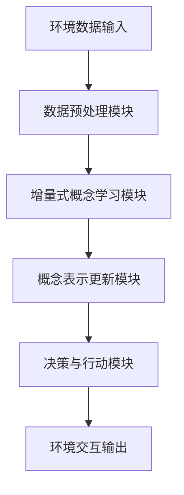

# 设计AI Agent的增量式概念学习策略

> 关键词：AI Agent、增量式学习、概念学习、机器学习、人工智能、学习策略、知识更新

> 摘要：本文聚焦于设计AI Agent的增量式概念学习策略。在人工智能不断发展的背景下，AI Agent需要具备高效的学习能力以适应动态变化的环境。增量式概念学习策略能够让AI Agent在持续获取新数据的过程中，不断更新和完善自身对概念的理解与认知，而无需每次都重新训练整个模型。文章详细阐述了增量式概念学习的核心概念与联系，深入剖析其核心算法原理并给出具体操作步骤，通过数学模型和公式进行理论支撑，结合项目实战展示代码实现与解读，探讨实际应用场景，推荐相关工具和资源，最后总结未来发展趋势与挑战，并提供常见问题解答和参考资料，为AI Agent的增量式概念学习提供全面且深入的技术指导。

## 1. 背景介绍 
### 1.1 目的和范围
在当今信息爆炸的时代，数据不断涌现且处于动态变化之中。传统的机器学习方法通常是在固定的数据集上进行训练，当有新的数据到来时，往往需要重新训练整个模型，这不仅计算成本高，而且效率低下。对于AI Agent而言，其需要在与环境的持续交互中不断学习和适应新的情况，因此设计一种能够增量式学习概念的策略具有重要意义。

本文的范围涵盖了增量式概念学习策略的基本原理、算法实现、数学模型、实际应用以及相关工具和资源推荐等方面。旨在为研究人员和开发者提供一个全面的技术框架，帮助他们理解和实现AI Agent的增量式概念学习。

### 1.2 预期读者
本文预期读者包括但不限于人工智能领域的研究人员、机器学习工程师、软件开发者、对AI Agent技术感兴趣的学生以及相关领域的专业人士。无论是希望深入了解增量式概念学习理论的学者，还是想要在实际项目中应用该策略的开发者，都能从本文中获得有价值的信息。

### 1.3 文档结构概述
本文将按照以下结构进行阐述：首先介绍增量式概念学习的背景和相关术语；接着阐述核心概念与联系，包括原理和架构的文本示意图及Mermaid流程图；然后深入讲解核心算法原理并给出具体操作步骤，同时使用Python源代码进行详细阐述；再通过数学模型和公式对其进行理论分析，并举例说明；之后进行项目实战，展示代码实际案例和详细解释说明；探讨实际应用场景；推荐相关工具和资源；总结未来发展趋势与挑战；提供常见问题与解答；最后给出扩展阅读和参考资料。

### 1.4 术语表
#### 1.4.1 核心术语定义
- **AI Agent（人工智能代理）**：是一种能够感知环境、进行决策并采取行动的智能实体，它可以通过学习来不断提高自身的性能。
- **增量式学习**：是指在已有学习结果的基础上，随着新数据的到来，逐步更新和完善模型，而无需重新训练整个模型。
- **概念学习**：是指从具体的实例中抽象出概念的过程，通过对实例的观察和分析，学习到概念的本质特征。
- **概念表示**：是指用某种形式来描述和存储概念的信息，例如用特征向量、规则集等方式来表示概念。

#### 1.4.2 相关概念解释
- **在线学习**：是一种特殊的增量式学习方式，它在数据到来时立即进行学习和更新，适用于实时性要求较高的场景。
- **遗忘机制**：在增量式学习中，由于数据不断积累，可能会导致模型过于复杂或出现过拟合现象。遗忘机制是指在学习过程中，有选择地忘记一些旧的、不再有用的数据或知识，以保持模型的有效性和简洁性。

#### 1.4.3 缩略词列表
- **ML（Machine Learning）**：机器学习
- **DL（Deep Learning）**：深度学习
- **AI（Artificial Intelligence）**：人工智能

## 2. 核心概念与联系 
### 核心概念原理
增量式概念学习的核心原理在于，AI Agent在初始阶段基于一定的数据集学习到初始的概念表示。随着新数据的不断到来，Agent不会完全抛弃已有的学习结果，而是在已有概念表示的基础上，对新数据进行分析和处理，将新的信息融入到已有的概念中，从而逐步更新和完善概念表示。

例如，在图像识别领域，AI Agent最初学习到猫和狗的概念表示，当遇到新的猫或狗的图像时，它会根据已有的概念表示对新图像进行分类，并根据分类结果对概念表示进行调整和更新，以更好地适应新的图像特征。

### 架构的文本示意图
```plaintext
|----------------------|
|     环境数据输入     |
|----------------------|
           |
           v
|----------------------|
|  数据预处理模块      |
|----------------------|
           |
           v
|----------------------|
|  增量式概念学习模块 |
|----------------------|
           |
           v
|----------------------|
|  概念表示更新模块    |
|----------------------|
           |
           v
|----------------------|
|  决策与行动模块      |
|----------------------|
           |
           v
|----------------------|
|     环境交互输出     |
|----------------------|
```
### Mermaid流程图


在这个架构中，环境数据输入是AI Agent获取信息的来源，数据预处理模块对输入的数据进行清洗、特征提取等操作，以便后续处理。增量式概念学习模块根据已有的概念表示和新的数据进行学习，概念表示更新模块将学习到的新信息融入到已有的概念表示中。决策与行动模块根据更新后的概念表示进行决策并采取相应的行动，最后将结果输出到环境中。

## 3. 核心算法原理 & 具体操作步骤 
### 核心算法原理
增量式概念学习的一种常见算法是基于决策树的增量式学习算法。决策树是一种常用的分类和回归模型，它通过对数据的特征进行递归划分来构建树结构，每个内部节点表示一个特征上的测试，每个分支表示一个测试输出，每个叶节点表示一个类别或值。

在增量式学习中，当有新的数据到来时，我们可以根据已有的决策树对新数据进行分类，并根据分类结果对决策树进行调整和更新。具体来说，如果新数据能够正确地被已有的决策树分类，那么决策树不需要进行更新；如果新数据不能被正确分类，那么我们需要对决策树进行修改，例如在某个节点上进行分裂或合并操作，以适应新的数据。

### 具体操作步骤
1. **初始化决策树**：根据初始数据集构建一个决策树。可以使用常见的决策树算法，如ID3、C4.5或CART算法。
2. **获取新数据**：从环境中获取新的数据。
3. **数据预处理**：对新数据进行清洗、特征提取等操作，使其与已有的数据格式一致。
4. **分类新数据**：使用已有的决策树对新数据进行分类。
5. **判断分类结果**：如果新数据能够被正确分类，那么决策树不需要进行更新，返回步骤2继续获取新数据；如果新数据不能被正确分类，进入下一步。
6. **更新决策树**：根据新数据对决策树进行调整和更新。可以采用以下方法：
    - **节点分裂**：在某个节点上根据新数据的特征进行分裂，创建新的子节点。
    - **节点合并**：将某些相邻的节点合并成一个节点，以减少决策树的复杂度。
7. **重复步骤2 - 6**：不断获取新数据并更新决策树，直到满足停止条件。

### Python源代码详细阐述
```python
import numpy as np
from sklearn.tree import DecisionTreeClassifier

# 初始化决策树
initial_data = np.array([[1, 2], [2, 3], [3, 4], [4, 5]])
initial_labels = np.array([0, 0, 1, 1])
dt = DecisionTreeClassifier()
dt.fit(initial_data, initial_labels)

# 模拟获取新数据
new_data = np.array([[5, 6]])
new_label = np.array([1])

# 分类新数据
predicted_label = dt.predict(new_data)

# 判断分类结果
if predicted_label == new_label:
    print("新数据分类正确，决策树无需更新")
else:
    print("新数据分类错误，更新决策树")
    # 合并新旧数据
    all_data = np.vstack((initial_data, new_data))
    all_labels = np.hstack((initial_labels, new_label))
    # 重新训练决策树
    dt.fit(all_data, all_labels)
```
在这个代码示例中，我们首先使用初始数据集初始化一个决策树分类器。然后模拟获取新数据，并使用已有的决策树对新数据进行分类。根据分类结果判断是否需要更新决策树，如果需要更新，则将新旧数据合并，重新训练决策树。

## 4. 数学模型和公式 & 详细讲解 & 举例说明 
### 数学模型
在增量式概念学习中，我们可以使用概率模型来描述概念的表示和更新过程。假设我们有一个概念 $C$，它可以用一个概率分布 $P(C|X)$ 来表示，其中 $X$ 是数据的特征向量。在初始阶段，我们根据初始数据集 $D_0$ 估计出 $P(C|X)$ 的初始值 $P_0(C|X)$。

当有新的数据 $D_1$ 到来时，我们可以使用贝叶斯公式来更新 $P(C|X)$：

$$P_1(C|X) = \frac{P(D_1|C, X)P_0(C|X)}{P(D_1|X)}$$

其中，$P(D_1|C, X)$ 是在给定概念 $C$ 和特征向量 $X$ 的情况下，新数据 $D_1$ 出现的概率，$P(D_1|X)$ 是在给定特征向量 $X$ 的情况下，新数据 $D_1$ 出现的概率。

### 详细讲解
贝叶斯公式的核心思想是根据新的证据（即新数据 $D_1$）来更新我们对概念 $C$ 的信念（即 $P(C|X)$）。$P(D_1|C, X)$ 表示在概念 $C$ 和特征向量 $X$ 成立的情况下，新数据 $D_1$ 出现的可能性，$P_0(C|X)$ 是我们在看到新数据之前对概念 $C$ 的信念，$P(D_1|X)$ 是一个归一化因子，用于确保更新后的概率分布仍然是一个合法的概率分布。

### 举例说明
假设我们要学习一个二分类概念 $C$（$C = 0$ 或 $C = 1$），特征向量 $X$ 是一个一维向量。初始数据集 $D_0$ 包含 10 个样本，其中 6 个样本属于类别 $C = 0$，4 个样本属于类别 $C = 1$。根据 $D_0$，我们估计出 $P_0(C = 0|X) = 0.6$，$P_0(C = 1|X) = 0.4$。

现在有一个新的数据样本 $D_1$，经过分析，我们估计出 $P(D_1|C = 0, X) = 0.2$，$P(D_1|C = 1, X) = 0.8$。首先计算 $P(D_1|X)$：

$$P(D_1|X) = P(D_1|C = 0, X)P_0(C = 0|X) + P(D_1|C = 1, X)P_0(C = 1|X)$$
$$= 0.2\times0.6 + 0.8\times0.4 = 0.44$$

然后根据贝叶斯公式更新 $P(C|X)$：

$$P_1(C = 0|X) = \frac{P(D_1|C = 0, X)P_0(C = 0|X)}{P(D_1|X)} = \frac{0.2\times0.6}{0.44} \approx 0.27$$

$$P_1(C = 1|X) = \frac{P(D_1|C = 1, X)P_0(C = 1|X)}{P(D_1|X)} = \frac{0.8\times0.4}{0.44} \approx 0.73$$

通过这个例子可以看出，新数据的到来改变了我们对概念 $C$ 的概率分布，从而更新了我们对概念的理解。

## 5. 项目实战：代码实际案例和详细解释说明 
### 5.1  开发环境搭建
为了实现增量式概念学习的项目，我们可以使用Python作为开发语言，并借助一些常见的机器学习库，如`scikit-learn`、`numpy`和`pandas`。以下是搭建开发环境的步骤：

1. **安装Python**：可以从Python官方网站（https://www.python.org/downloads/）下载并安装Python 3.x版本。
2. **安装虚拟环境（可选）**：为了避免不同项目之间的依赖冲突，建议使用虚拟环境。可以使用`venv`或`conda`来创建虚拟环境。例如，使用`venv`创建虚拟环境的命令如下：
```bash
python -m venv myenv
```
然后激活虚拟环境：
```bash
# 在Windows上
myenv\Scripts\activate
# 在Linux或Mac上
source myenv/bin/activate
```
3. **安装依赖库**：使用`pip`安装所需的依赖库：
```bash
pip install scikit-learn numpy pandas
```

### 5.2  源代码详细实现和代码解读
以下是一个完整的增量式概念学习项目的代码示例，使用`scikit-learn`中的决策树分类器来实现增量式学习：

```python
import numpy as np
from sklearn.tree import DecisionTreeClassifier
import pandas as pd

# 生成初始数据集
initial_data = pd.DataFrame({
    'feature1': [1, 2, 3, 4],
    'feature2': [2, 3, 4, 5],
    'label': [0, 0, 1, 1]
})

# 初始化决策树分类器
dt = DecisionTreeClassifier()
X_initial = initial_data[['feature1', 'feature2']]
y_initial = initial_data['label']
dt.fit(X_initial, y_initial)

# 模拟增量数据
incremental_data = pd.DataFrame({
    'feature1': [5, 6],
    'feature2': [6, 7],
    'label': [1, 1]
})

# 增量学习过程
for index, row in incremental_data.iterrows():
    new_data = row[['feature1', 'feature2']].values.reshape(1, -1)
    new_label = row['label']
    predicted_label = dt.predict(new_data)
    if predicted_label != new_label:
        print("新数据分类错误，更新决策树")
        # 合并新旧数据
        X_all = pd.concat([X_initial, pd.DataFrame(new_data, columns=['feature1', 'feature2'])])
        y_all = pd.concat([y_initial, pd.Series(new_label)])
        # 重新训练决策树
        dt.fit(X_all, y_all)
        X_initial = X_all
        y_initial = y_all
    else:
        print("新数据分类正确，决策树无需更新")
```

### 5.3  代码解读与分析
1. **初始数据集生成**：使用`pandas`创建一个包含特征和标签的初始数据集。
2. **决策树初始化**：使用`DecisionTreeClassifier`初始化一个决策树分类器，并使用初始数据集进行训练。
3. **模拟增量数据**：创建一个包含新数据的`pandas` DataFrame。
4. **增量学习过程**：遍历增量数据集中的每一个样本，使用已有的决策树对其进行分类。如果分类错误，则将新数据与旧数据合并，重新训练决策树；如果分类正确，则决策树无需更新。

通过这种方式，我们实现了一个简单的增量式概念学习系统，能够在新数据到来时不断更新和完善决策树模型。

## 6. 实际应用场景 
### 图像识别领域
在图像识别任务中，随着时间的推移，新的图像类别和图像特征可能会不断出现。例如，在安防监控系统中，可能会出现新的异常行为或物体。使用增量式概念学习策略，AI Agent可以在不重新训练整个模型的情况下，快速学习和识别新的图像类别和特征，提高系统的实时性和适应性。

### 自然语言处理领域
在自然语言处理中，语言是不断发展和变化的，新的词汇、语法和语义可能会不断涌现。例如，在智能客服系统中，用户可能会使用一些新的表达方式或专业术语。增量式概念学习可以让AI Agent不断学习和更新对语言的理解，提高语言处理的准确性和效率。

### 金融风险评估领域
金融市场是动态变化的，新的风险因素和市场趋势可能会不断出现。在金融风险评估中，使用增量式概念学习策略，AI Agent可以根据新的市场数据和风险信息，及时调整和更新风险评估模型，提高风险评估的准确性和及时性。

### 工业生产领域
在工业生产中，生产环境和产品质量可能会受到多种因素的影响，并且这些因素可能会随时间发生变化。例如，在智能制造中，设备的运行状态和生产工艺可能会不断调整。增量式概念学习可以让AI Agent实时监测和学习这些变化，优化生产过程，提高产品质量和生产效率。

## 7. 工具和资源推荐
### 7.1 学习资源推荐
#### 7.1.1 书籍推荐
- 《机器学习》（周志华著）：这本书全面介绍了机器学习的基本概念、算法和应用，对于理解增量式概念学习的理论基础有很大帮助。
- 《Python机器学习实战》（Sebastian Raschka著）：通过实际的Python代码示例，详细讲解了机器学习的各种算法和应用，适合初学者快速上手。
- 《深度学习》（Ian Goodfellow、Yoshua Bengio和Aaron Courville著）：深度学习是人工智能领域的重要分支，这本书对深度学习的理论和实践进行了深入探讨，对于理解增量式概念学习在深度学习中的应用有一定的参考价值。

#### 7.1.2 在线课程
- Coursera上的“机器学习”课程（由Andrew Ng教授授课）：这是一门非常经典的机器学习课程，系统地介绍了机器学习的基本概念、算法和应用，适合初学者入门。
- edX上的“深度学习基础”课程：该课程深入讲解了深度学习的基本原理和方法，对于想要深入学习增量式概念学习在深度学习中应用的学习者有很大帮助。
- 中国大学MOOC上的“人工智能”课程：由国内知名高校的教授授课，全面介绍了人工智能的各个领域，包括增量式概念学习的相关内容。

#### 7.1.3 技术博客和网站
- Medium：这是一个技术博客平台，上面有很多关于人工智能和机器学习的优质文章，包括增量式概念学习的最新研究成果和实践经验。
- arXiv：这是一个预印本服务器，提供了大量的学术论文，包括人工智能领域的最新研究成果，可以帮助读者了解增量式概念学习的前沿技术。
- Kaggle：这是一个数据科学竞赛平台，上面有很多关于机器学习和人工智能的数据集和代码示例，可以帮助读者通过实践来学习增量式概念学习。

### 7.2 开发工具框架推荐
#### 7.2.1 IDE和编辑器
- PyCharm：这是一款专门为Python开发设计的集成开发环境（IDE），提供了丰富的功能和插件，能够提高开发效率。
- Jupyter Notebook：这是一个交互式的开发环境，适合进行数据探索、模型训练和可视化等工作，非常适合机器学习和人工智能的开发。
- Visual Studio Code：这是一款轻量级的代码编辑器，支持多种编程语言和插件，具有良好的扩展性和灵活性。

#### 7.2.2 调试和性能分析工具
- `pdb`：这是Python自带的调试工具，可以帮助开发者在代码中设置断点、单步执行等，方便调试代码。
- `cProfile`：这是Python的性能分析工具，可以帮助开发者分析代码的运行时间和内存使用情况，找出性能瓶颈。
- TensorBoard：这是TensorFlow的可视化工具，可以帮助开发者可视化模型的训练过程、性能指标等，方便进行模型调优。

#### 7.2.3 相关框架和库
- `scikit-learn`：这是一个开源的机器学习库，提供了丰富的机器学习算法和工具，包括决策树、支持向量机、神经网络等，非常适合实现增量式概念学习。
- `TensorFlow`：这是一个开源的深度学习框架，提供了高效的计算图和分布式训练功能，适合实现大规模的深度学习模型。
- `PyTorch`：这是另一个开源的深度学习框架，具有动态计算图的特点，适合快速迭代和实验。

### 7.3 相关论文著作推荐
#### 7.3.1 经典论文
- “Incremental Learning in Neural Networks”（由Sebastian Thrun发表）：这篇论文深入探讨了神经网络中的增量学习方法，为增量式概念学习的研究奠定了基础。
- “A Survey on Incremental Learning Algorithms”（由Massimo Melucci发表）：这篇论文对增量学习算法进行了全面的综述，介绍了各种增量学习算法的原理和应用。

#### 7.3.2 最新研究成果
- 通过在arXiv上搜索“incremental concept learning”可以找到很多关于增量式概念学习的最新研究成果，这些论文通常会介绍一些新的算法和技术。

#### 7.3.3 应用案例分析
- 在Kaggle上可以找到很多关于增量式概念学习的应用案例，这些案例通常会详细介绍如何在实际项目中应用增量式概念学习策略，以及遇到的问题和解决方案。

## 8. 总结：未来发展趋势与挑战
### 未来发展趋势
- **与深度学习的结合**：深度学习在图像识别、自然语言处理等领域取得了巨大的成功，未来增量式概念学习将与深度学习更加紧密地结合，例如在深度神经网络中实现增量式学习，以提高模型的适应性和效率。
- **多模态学习**：随着传感器技术的发展，数据的模态越来越多样化，包括图像、语音、文本等。未来增量式概念学习将能够处理多模态数据，实现更加全面和准确的概念学习。
- **强化学习与增量式概念学习的融合**：强化学习可以让AI Agent在与环境的交互中不断优化自己的策略，将强化学习与增量式概念学习相结合，可以让AI Agent在学习概念的同时，不断提高自己的决策能力和行动能力。

### 挑战
- **概念漂移问题**：在动态变化的环境中，概念的定义和特征可能会随时间发生变化，这就是概念漂移问题。如何有效地检测和处理概念漂移，是增量式概念学习面临的一个重要挑战。
- **计算资源和时间开销**：虽然增量式学习可以避免重新训练整个模型，但在处理大量新数据时，仍然需要一定的计算资源和时间开销。如何优化算法，减少计算资源和时间开销，是需要解决的问题。
- **知识的融合和更新**：在增量式学习过程中，如何将新的知识有效地融合到已有的知识体系中，并且保证知识的一致性和完整性，是一个具有挑战性的问题。

## 9. 附录：常见问题与解答
### 问题1：增量式概念学习与传统的批量学习有什么区别？
传统的批量学习是在固定的数据集上进行训练，当有新的数据到来时，需要重新训练整个模型。而增量式概念学习是在已有学习结果的基础上，随着新数据的到来，逐步更新和完善模型，无需重新训练整个模型，具有更高的效率和适应性。

### 问题2：增量式概念学习会导致模型过拟合吗？
增量式概念学习在一定程度上可以减少过拟合的风险，因为它是逐步学习和更新模型的。但是，如果新数据中存在噪声或异常值，或者遗忘机制不合理，仍然可能会导致模型过拟合。因此，在增量式学习过程中，需要采取一些措施来避免过拟合，如合理设置遗忘机制、进行数据预处理等。

### 问题3：如何选择合适的增量式概念学习算法？
选择合适的增量式概念学习算法需要考虑多个因素，如数据的特点、学习任务的要求、计算资源的限制等。例如，如果数据是流式数据，且实时性要求较高，可以选择在线学习算法；如果数据的维度较高，可以选择基于决策树或神经网络的增量式学习算法。

## 10. 扩展阅读 & 参考资料
### 扩展阅读
- 《人工智能：一种现代的方法》（Stuart J. Russell和Peter Norvig著）：这本书全面介绍了人工智能的各个领域，包括机器学习、自然语言处理、计算机视觉等，对于深入理解人工智能和增量式概念学习有很大帮助。
- 《机器学习实战：基于Scikit-Learn、Keras和TensorFlow》（Aurélien Géron著）：通过实际的代码示例，详细讲解了如何使用Scikit-Learn、Keras和TensorFlow等工具实现机器学习和深度学习算法，适合想要进行实践的读者。

### 参考资料
- 周志华. 机器学习[M]. 清华大学出版社, 2016.
- Sebastian Raschka. Python机器学习实战[M]. 机械工业出版社, 2018.
- Ian Goodfellow, Yoshua Bengio, Aaron Courville. 深度学习[M]. 人民邮电出版社, 2017.
- Thrun S. Incremental Learning in Neural Networks[J]. Machine Learning, 1998, 31(1): 77-103.
- Melucci M. A Survey on Incremental Learning Algorithms[J]. International Journal of Pattern Recognition and Artificial Intelligence, 2008, 22(8): 1319-1345.