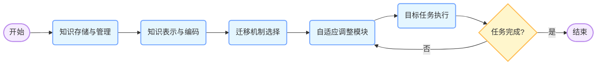

# 设计AI Agent的自适应知识迁移策略

> 关键词：AI Agent、自适应知识迁移、迁移策略设计、机器学习、知识表示

> 摘要：本文围绕设计AI Agent的自适应知识迁移策略展开，深入探讨了该策略的背景、核心概念、算法原理、数学模型等内容。详细阐述了如何实现AI Agent在不同任务和环境中的自适应知识迁移，通过项目实战案例展示了具体的实现过程和代码解读。同时，介绍了该策略在实际应用场景中的表现，推荐了相关的学习资源、开发工具和论文著作。最后总结了未来的发展趋势与挑战，并对常见问题进行了解答，为进一步研究和应用AI Agent的自适应知识迁移策略提供了全面的参考。

## 1. 背景介绍 
### 1.1 目的和范围
在当今的人工智能领域，AI Agent面临着处理多样化任务和复杂环境的挑战。传统的机器学习模型往往需要为每个特定任务进行大量的数据训练，这不仅耗时耗力，而且在数据稀缺的情况下效果不佳。自适应知识迁移策略的目的在于使AI Agent能够将在一个或多个任务中学习到的知识有效地迁移到新的任务中，从而提高学习效率、减少训练数据需求，并提升模型在新任务上的性能。

本文的范围涵盖了自适应知识迁移策略的核心概念、算法原理、数学模型、实际应用以及相关的工具和资源。我们将详细探讨如何设计这样的策略，使其能够在不同的场景下实现自适应的知识迁移。

### 1.2 预期读者
本文的预期读者包括人工智能领域的研究人员、开发者、学生以及对AI Agent和知识迁移感兴趣的技术爱好者。对于正在从事相关研究的人员，本文可以提供新的思路和方法；对于开发者，能够帮助他们在实际项目中应用自适应知识迁移策略；对于学生，有助于他们深入理解该领域的核心概念和技术。

### 1.3 文档结构概述
本文将按照以下结构进行组织：
- 核心概念与联系：介绍自适应知识迁移策略的核心概念，包括知识表示、迁移机制等，并通过示意图和流程图展示其原理和架构。
- 核心算法原理 & 具体操作步骤：详细讲解实现自适应知识迁移的核心算法，使用Python源代码进行阐述。
- 数学模型和公式 & 详细讲解 & 举例说明：通过数学模型和公式来描述知识迁移的过程，并结合具体例子进行说明。
- 项目实战：代码实际案例和详细解释说明：通过一个实际项目案例，展示自适应知识迁移策略的实现过程，包括开发环境搭建、源代码实现和代码解读。
- 实际应用场景：介绍自适应知识迁移策略在不同领域的实际应用场景。
- 工具和资源推荐：推荐相关的学习资源、开发工具和论文著作。
- 总结：未来发展趋势与挑战：总结自适应知识迁移策略的未来发展趋势和面临的挑战。
- 附录：常见问题与解答：解答读者在学习和应用过程中可能遇到的常见问题。
- 扩展阅读 & 参考资料：提供相关的扩展阅读材料和参考资料。

### 1.4 术语表
#### 1.4.1 核心术语定义
- **AI Agent**：人工智能代理，是一种能够感知环境、做出决策并执行动作的智能实体。
- **知识迁移**：将在一个或多个任务中学习到的知识应用到新的任务中的过程。
- **自适应知识迁移**：AI Agent能够根据新任务的特点和环境自动调整知识迁移的方式和程度。
- **知识表示**：将知识以某种形式进行编码和存储，以便于AI Agent进行处理和使用。

#### 1.4.2 相关概念解释
- **源任务**：AI Agent已经学习过的任务，从中获取知识。
- **目标任务**：AI Agent需要应用知识的新任务。
- **迁移损失**：在知识迁移过程中，由于源任务和目标任务之间的差异而导致的性能下降。

#### 1.4.3 缩略词列表
- **ML**：Machine Learning，机器学习
- **DL**：Deep Learning，深度学习
- **RL**：Reinforcement Learning，强化学习

## 2. 核心概念与联系 

### 核心概念原理
自适应知识迁移策略的核心思想是让AI Agent能够根据目标任务的特点和环境，自动选择合适的知识进行迁移，并调整迁移的方式和程度。这需要解决以下几个关键问题：
- **知识表示**：如何将知识以一种通用、可迁移的方式进行表示，以便于在不同任务之间进行共享。
- **迁移机制**：确定哪些知识可以迁移，以及如何将这些知识应用到目标任务中。
- **自适应调整**：根据目标任务的反馈，动态调整知识迁移的策略，以提高迁移的效果。

### 架构的文本示意图
以下是自适应知识迁移策略的架构示意图：

```plaintext
               +-------------------+
               | 知识存储与管理   |
               +-------------------+
                        |
                        v
               +-------------------+
               | 知识表示与编码   |
               +-------------------+
                        |
                        v
               +-------------------+
               | 迁移机制选择     |
               +-------------------+
                        |
                        v
               +-------------------+
               | 自适应调整模块   |
               +-------------------+
                        |
                        v
               +-------------------+
               | 目标任务执行     |
               +-------------------+
```

### Mermaid流程图


该流程图展示了自适应知识迁移策略的主要流程。首先，AI Agent从知识存储与管理模块获取知识，并进行知识表示与编码。然后，根据目标任务的特点选择合适的迁移机制。在目标任务执行过程中，自适应调整模块根据任务的反馈动态调整迁移策略。如果任务未完成，则继续进行调整；如果任务完成，则结束流程。

## 3. 核心算法原理 & 具体操作步骤 

### 核心算法原理
自适应知识迁移的核心算法主要包括以下几个步骤：
1. **知识提取**：从源任务中提取有用的知识。
2. **知识表示**：将提取的知识以一种通用的方式进行表示。
3. **迁移评估**：评估源任务和目标任务之间的相似度，确定哪些知识可以迁移。
4. **迁移执行**：将选择的知识应用到目标任务中。
5. **自适应调整**：根据目标任务的反馈，调整迁移的策略和参数。

### 具体操作步骤及Python源代码实现

```python
import numpy as np

# 假设源任务和目标任务的数据
source_data = np.random.rand(100, 10)  # 源任务数据，100个样本，每个样本10个特征
target_data = np.random.rand(50, 10)   # 目标任务数据，50个样本，每个样本10个特征

# 1. 知识提取
# 这里简单地使用源任务数据的均值作为知识
source_mean = np.mean(source_data, axis=0)

# 2. 知识表示
# 直接使用均值作为知识表示
knowledge_representation = source_mean

# 3. 迁移评估
# 计算源任务和目标任务数据的均值相似度
target_mean = np.mean(target_data, axis=0)
similarity = np.linalg.norm(source_mean - target_mean)

# 4. 迁移执行
# 如果相似度小于某个阈值，则进行知识迁移
threshold = 1.0
if similarity < threshold:
    # 将知识应用到目标任务中，这里简单地将目标任务数据的均值调整为源任务的均值
    adjusted_target_data = target_data - target_mean + source_mean
else:
    adjusted_target_data = target_data

# 5. 自适应调整
# 这里简单地根据调整后的目标任务数据的性能反馈进行调整
# 假设性能指标为调整后数据的方差，方差越小越好
performance = np.var(adjusted_target_data)
if performance > 0.1:
    # 如果性能不佳，降低迁移的程度
    adjusted_target_data = target_data - 0.5 * (target_mean - source_mean)

print("调整后的目标任务数据:", adjusted_target_data)
```

在上述代码中，我们首先从源任务数据中提取知识（均值），并进行知识表示。然后，通过计算源任务和目标任务数据的均值相似度进行迁移评估。如果相似度满足条件，则进行知识迁移。最后，根据调整后的目标任务数据的性能反馈进行自适应调整。

## 4. 数学模型和公式 & 详细讲解 & 举例说明 

### 数学模型
自适应知识迁移的数学模型可以描述为以下几个步骤：

#### 知识提取
假设源任务的数据为 $X_s \in \mathbb{R}^{n_s \times d}$，其中 $n_s$ 是源任务的样本数量，$d$ 是特征维度。知识提取可以表示为一个函数 $f: \mathbb{R}^{n_s \times d} \to \mathbb{R}^k$，将源任务数据映射到一个 $k$ 维的知识空间，即 $K = f(X_s)$。

#### 知识表示
知识表示可以使用向量 $K$ 来表示，其中 $K$ 是知识提取的结果。

#### 迁移评估
源任务和目标任务之间的相似度可以使用距离度量来评估。假设目标任务的数据为 $X_t \in \mathbb{R}^{n_t \times d}$，则相似度可以表示为 $S = D(K, g(X_t))$，其中 $g: \mathbb{R}^{n_t \times d} \to \mathbb{R}^k$ 是将目标任务数据映射到知识空间的函数，$D$ 是距离度量函数，如欧几里得距离：

$$D(K_1, K_2) = \sqrt{\sum_{i=1}^{k} (K_{1i} - K_{2i})^2}$$

#### 迁移执行
如果相似度 $S$ 小于某个阈值 $\tau$，则进行知识迁移。迁移后的目标任务数据可以表示为：

$$\tilde{X}_t = X_t + \alpha (K - g(X_t))$$

其中 $\alpha$ 是迁移系数，控制迁移的程度。

#### 自适应调整
根据目标任务的性能反馈 $P$，动态调整迁移系数 $\alpha$。例如，可以使用梯度下降的方法来优化 $\alpha$，使得性能指标 $P$ 最小化。

### 详细讲解
- **知识提取**：从源任务数据中提取有用的信息，如均值、方差、特征向量等。这些信息可以作为知识的基础。
- **知识表示**：将提取的知识以一种统一的方式进行表示，以便于在不同任务之间进行比较和迁移。
- **迁移评估**：通过计算源任务和目标任务之间的相似度，判断是否可以进行知识迁移。相似度越高，迁移的效果可能越好。
- **迁移执行**：将源任务的知识应用到目标任务中，通过调整目标任务的数据来实现知识迁移。
- **自适应调整**：根据目标任务的性能反馈，动态调整迁移的策略和参数，以提高迁移的效果。

### 举例说明
假设源任务是预测房价，目标任务是预测汽车价格。源任务的数据包括房屋的面积、卧室数量、地理位置等特征，目标任务的数据包括汽车的品牌、型号、里程数等特征。

- **知识提取**：从源任务数据中提取每个特征的均值和方差。
- **知识表示**：将均值和方差组成一个向量作为知识表示。
- **迁移评估**：计算源任务和目标任务数据的均值和方差的相似度。如果相似度较高，则认为可以进行知识迁移。
- **迁移执行**：将源任务的均值和方差应用到目标任务中，调整目标任务数据的分布。
- **自适应调整**：根据目标任务的预测准确率，动态调整迁移的程度。如果准确率较低，则减少迁移的程度；如果准确率较高，则增加迁移的程度。

## 5. 项目实战：代码实际案例和详细解释说明 

### 5.1  开发环境搭建
- **操作系统**：推荐使用Ubuntu 18.04或以上版本，Windows 10或以上版本。
- **Python版本**：Python 3.7或以上版本。
- **依赖库**：安装以下Python库：
```bash
pip install numpy pandas scikit-learn matplotlib
```

### 5.2  源代码详细实现和代码解读
以下是一个基于鸢尾花数据集的自适应知识迁移项目示例：

```python
import numpy as np
from sklearn.datasets import load_iris
from sklearn.model_selection import train_test_split
from sklearn.linear_model import LogisticRegression
from sklearn.metrics import accuracy_score

# 加载鸢尾花数据集
iris = load_iris()
X = iris.data
y = iris.target

# 划分源任务和目标任务的数据
X_source, X_target, y_source, y_target = train_test_split(X, y, test_size=0.3, random_state=42)

# 源任务模型训练
source_model = LogisticRegression()
source_model.fit(X_source, y_source)

# 知识提取：提取源任务模型的系数和截距
coefficients = source_model.coef_
intercept = source_model.intercept_

# 知识表示：将系数和截距组合成一个知识向量
knowledge = np.concatenate((coefficients.flatten(), intercept))

# 迁移评估：使用源任务模型在目标任务数据上的准确率作为相似度评估
source_pred = source_model.predict(X_target)
similarity = accuracy_score(y_target, source_pred)

# 迁移执行
threshold = 0.7
if similarity > threshold:
    # 直接使用源任务模型进行预测
    target_pred = source_model.predict(X_target)
else:
    # 微调目标任务模型，使用源任务的知识作为初始值
    target_model = LogisticRegression()
    target_model.coef_ = coefficients
    target_model.intercept_ = intercept
    target_model.fit(X_target, y_target)
    target_pred = target_model.predict(X_target)

# 自适应调整
target_accuracy = accuracy_score(y_target, target_pred)
if target_accuracy < 0.8:
    # 如果准确率较低，重新训练目标任务模型
    target_model = LogisticRegression()
    target_model.fit(X_target, y_target)
    target_pred = target_model.predict(X_target)

# 输出结果
print("目标任务的预测准确率:", accuracy_score(y_target, target_pred))
```

### 5.3  代码解读与分析
- **数据加载和划分**：使用 `load_iris` 函数加载鸢尾花数据集，并将其划分为源任务和目标任务的数据。
- **源任务模型训练**：使用逻辑回归模型对源任务数据进行训练。
- **知识提取**：提取源任务模型的系数和截距作为知识。
- **知识表示**：将系数和截距组合成一个知识向量。
- **迁移评估**：使用源任务模型在目标任务数据上的准确率作为相似度评估。
- **迁移执行**：如果相似度大于阈值，则直接使用源任务模型进行预测；否则，微调目标任务模型，使用源任务的知识作为初始值。
- **自适应调整**：如果目标任务的准确率较低，则重新训练目标任务模型。

通过这种方式，我们实现了一个简单的自适应知识迁移策略，根据目标任务的情况自动调整知识迁移的方式和程度。

## 6. 实际应用场景 
自适应知识迁移策略在许多实际应用场景中都有广泛的应用，以下是一些常见的场景：

### 自然语言处理
- **文本分类**：在不同领域的文本分类任务中，如新闻分类、情感分析等，可以将在一个领域中学习到的语言知识迁移到另一个领域，提高分类的准确率。
- **机器翻译**：在不同语言对的机器翻译任务中，将在一种语言对上学习到的翻译知识迁移到其他语言对，减少训练数据的需求。

### 计算机视觉
- **图像分类**：在不同类型的图像分类任务中，如动物分类、植物分类等，可以将在一个类型中学习到的图像特征知识迁移到其他类型，提高分类的效率。
- **目标检测**：在不同场景的目标检测任务中，如城市街道、森林等，可以将在一个场景中学习到的目标检测知识迁移到其他场景，增强检测的鲁棒性。

### 强化学习
- **机器人控制**：在不同环境的机器人控制任务中，如室内导航、户外探索等，可以将在一个环境中学习到的控制策略知识迁移到其他环境，提高机器人的适应能力。
- **游戏AI**：在不同游戏的AI开发中，如棋类游戏、射击游戏等，可以将在一个游戏中学习到的策略知识迁移到其他游戏，加快AI的学习速度。

### 医疗领域
- **疾病诊断**：在不同疾病的诊断任务中，如心脏病诊断、癌症诊断等，可以将在一种疾病中学习到的诊断知识迁移到其他疾病，提高诊断的准确性。
- **药物研发**：在不同药物的研发任务中，如抗癌药物研发、抗生素研发等，可以将在一种药物中学习到的研发知识迁移到其他药物，缩短研发周期。

## 7. 工具和资源推荐
### 7.1 学习资源推荐
#### 7.1.1 书籍推荐
- 《机器学习》（周志华）：全面介绍了机器学习的基本概念、算法和应用，是机器学习领域的经典教材。
- 《深度学习》（Ian Goodfellow、Yoshua Bengio、Aaron Courville）：深入讲解了深度学习的原理、模型和方法，是深度学习领域的权威著作。
- 《人工智能：一种现代的方法》（Stuart Russell、Peter Norvig）：系统介绍了人工智能的各个方面，包括知识表示、搜索算法、机器学习等，是人工智能领域的经典教材。

#### 7.1.2 在线课程
- Coursera上的“机器学习”课程（Andrew Ng）：由机器学习领域的知名专家Andrew Ng授课，课程内容丰富，讲解详细，是学习机器学习的入门好课程。
- edX上的“深度学习基础”课程（DeepLearning.AI）：由深度学习领域的权威机构DeepLearning.AI推出，课程内容涵盖了深度学习的基本概念、模型和方法，是学习深度学习的优质课程。
- Udemy上的“强化学习实战”课程：通过实际案例讲解强化学习的原理和应用，适合有一定编程基础的学习者。

#### 7.1.3 技术博客和网站
- Medium：上面有许多人工智能领域的技术博客，涵盖了机器学习、深度学习、知识迁移等方面的内容。
- arXiv：是一个预印本服务器，提供了大量的人工智能领域的研究论文，是了解最新研究成果的重要渠道。
- Kaggle：是一个数据科学竞赛平台，上面有许多关于机器学习和深度学习的开源代码和数据集，适合学习者进行实践和学习。

### 7.2 开发工具框架推荐
#### 7.2.1 IDE和编辑器
- PyCharm：是一款专门为Python开发设计的集成开发环境，具有代码编辑、调试、版本控制等功能，适合Python开发者使用。
- Jupyter Notebook：是一个交互式的开发环境，支持Python、R等多种编程语言，适合进行数据探索、模型训练和可视化等工作。
- Visual Studio Code：是一款轻量级的代码编辑器，支持多种编程语言和插件，具有丰富的扩展功能，适合开发者进行快速开发。

#### 7.2.2 调试和性能分析工具
- TensorBoard：是TensorFlow的可视化工具，可以用于可视化模型的训练过程、性能指标等，帮助开发者进行调试和优化。
- PyTorch Profiler：是PyTorch的性能分析工具，可以用于分析模型的运行时间、内存使用等情况，帮助开发者进行性能优化。
- cProfile：是Python的内置性能分析工具，可以用于分析Python代码的运行时间和函数调用情况，帮助开发者找出性能瓶颈。

#### 7.2.3 相关框架和库
- TensorFlow：是一个开源的深度学习框架，由Google开发，具有丰富的模型和工具，支持分布式训练和部署。
- PyTorch：是一个开源的深度学习框架，由Facebook开发，具有动态图机制和简洁的API，适合快速开发和研究。
- Scikit-learn：是一个开源的机器学习库，提供了丰富的机器学习算法和工具，适合进行机器学习的入门和实践。

### 7.3 相关论文著作推荐
#### 7.3.1 经典论文
- “Domain Adaptation via Transfer Component Analysis”（Pan et al., 2011）：提出了一种基于迁移成分分析的领域自适应方法，是领域自适应领域的经典论文。
- “Inductive Transfer for Reinforcement Learning”（Taylor and Stone, 2009）：探讨了强化学习中的归纳迁移问题，为强化学习的知识迁移提供了理论基础。
- “Learning to Learn by Gradient Descent by Gradient Descent”（Andrychowicz et al., 2016）：提出了一种基于梯度下降的元学习方法，为自适应知识迁移提供了新的思路。

#### 7.3.2 最新研究成果
- 关注arXiv上关于知识迁移、领域自适应、元学习等方面的最新论文，了解该领域的最新研究动态。
- 参加人工智能领域的顶级会议，如NeurIPS、ICML、CVPR等，获取最新的研究成果和趋势。

#### 7.3.3 应用案例分析
- 研究Kaggle上的相关竞赛案例，了解自适应知识迁移策略在实际数据科学项目中的应用。
- 关注工业界的应用案例，如谷歌、微软、亚马逊等公司在人工智能领域的应用，学习他们的实践经验。

## 8. 总结：未来发展趋势与挑战
### 未来发展趋势
- **多模态知识迁移**：随着人工智能技术的发展，多模态数据（如图像、文本、音频等）的处理变得越来越重要。未来的自适应知识迁移策略将更加注重多模态知识的迁移，实现不同模态之间的知识共享和融合。
- **元学习与自适应迁移的结合**：元学习是一种能够快速学习新知识的方法，与自适应知识迁移策略相结合，可以使AI Agent更加智能地适应不同的任务和环境。未来，元学习将在自适应知识迁移中发挥重要作用。
- **跨领域知识迁移**：目前的知识迁移主要集中在同一领域内的不同任务之间。未来，自适应知识迁移策略将朝着跨领域知识迁移的方向发展，实现不同领域之间的知识共享和应用。
- **可解释性知识迁移**：随着人工智能技术的广泛应用，模型的可解释性变得越来越重要。未来的自适应知识迁移策略将更加注重知识迁移的可解释性，使人们能够理解模型为什么选择某些知识进行迁移。

### 挑战
- **知识表示的通用性**：如何将知识以一种通用的方式进行表示，使得不同任务和领域之间的知识能够有效地迁移，是一个亟待解决的问题。
- **迁移评估的准确性**：目前的迁移评估方法还存在一定的局限性，无法准确地评估源任务和目标任务之间的相似度。如何提高迁移评估的准确性，是自适应知识迁移策略面临的一个挑战。
- **自适应调整的复杂性**：自适应调整需要考虑多个因素，如目标任务的特点、迁移的效果等。如何设计一个简单有效的自适应调整机制，是一个具有挑战性的问题。
- **数据隐私和安全**：在知识迁移过程中，需要共享和使用大量的数据。如何保护数据的隐私和安全，避免数据泄露和滥用，是一个重要的挑战。

## 9. 附录：常见问题与解答
### 问题1：自适应知识迁移策略适用于所有类型的任务吗？
不是的。自适应知识迁移策略适用于源任务和目标任务之间存在一定相似度的情况。如果源任务和目标任务之间差异过大，知识迁移可能无法取得良好的效果。

### 问题2：如何选择合适的迁移机制？
选择合适的迁移机制需要考虑源任务和目标任务的特点、数据的分布、模型的类型等因素。一般来说，可以通过实验和比较不同的迁移机制，选择效果最好的一种。

### 问题3：知识迁移会导致过拟合吗？
知识迁移本身不会导致过拟合，但如果迁移的知识不适合目标任务，或者迁移的程度过大，可能会导致模型在目标任务上出现过拟合的现象。因此，在进行知识迁移时，需要进行适当的调整和验证。

### 问题4：如何评估知识迁移的效果？
可以使用目标任务的性能指标（如准确率、召回率、F1值等）来评估知识迁移的效果。同时，也可以比较使用知识迁移和不使用知识迁移时模型的性能差异。

### 问题5：自适应知识迁移策略需要大量的计算资源吗？
自适应知识迁移策略的计算资源需求取决于具体的算法和任务。一些复杂的迁移算法可能需要大量的计算资源，而一些简单的迁移策略则相对较少。在实际应用中，需要根据具体情况进行选择和优化。

## 10. 扩展阅读 & 参考资料
### 扩展阅读
- 《迁移学习》（Qiang Yang、Yang Liu）：全面介绍了迁移学习的理论和方法，是迁移学习领域的权威著作。
- 《元学习：理论与应用》（Honglak Lee、Alexandr A. Rusu等）：深入探讨了元学习的原理、算法和应用，是元学习领域的重要参考书籍。
- 《人工智能前沿技术》（李开复、王咏刚）：介绍了人工智能领域的最新前沿技术，包括知识迁移、自适应学习等方面的内容。

### 参考资料
- 相关的学术论文和研究报告，可以通过学术搜索引擎（如Google Scholar、IEEE Xplore等）进行查找。
- 开源代码和数据集，可以通过GitHub、Kaggle等平台进行获取。
- 人工智能领域的官方文档和教程，如TensorFlow、PyTorch等框架的官方文档。