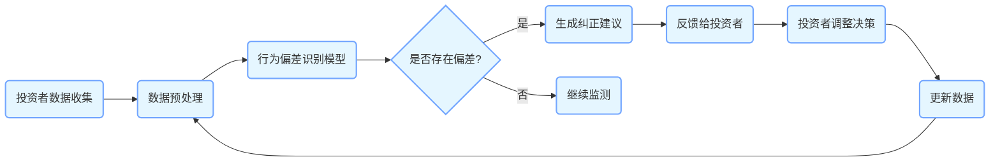

# 设计智能化的个人投资者行为偏差纠正工具

> 关键词：个人投资者、行为偏差、智能化工具、投资决策、纠正机制

> 摘要：本文聚焦于设计智能化的个人投资者行为偏差纠正工具。首先介绍了该工具开发的背景，包括目的、预期读者、文档结构和相关术语。接着阐述了核心概念，如行为偏差的类型及与投资决策的联系，并给出原理和架构示意图。详细讲解了核心算法原理和具体操作步骤，结合Python代码进行说明。通过数学模型和公式进一步分析行为偏差对投资的影响。以项目实战展示工具的开发过程，包括环境搭建、代码实现和解读。探讨了工具的实际应用场景，推荐了相关的学习资源、开发工具和论文著作。最后总结了未来发展趋势与挑战，解答常见问题并提供扩展阅读和参考资料，旨在帮助个人投资者有效纠正行为偏差，做出更理性的投资决策。

## 1. 背景介绍 
### 1.1 目的和范围
在金融市场中，个人投资者常常受到各种行为偏差的影响，如过度自信、损失厌恶、羊群效应等，这些偏差可能导致投资决策失误，造成资产损失。本工具的目的是设计一个智能化的系统，能够识别个人投资者的行为偏差，并提供针对性的纠正建议，帮助投资者做出更理性、更科学的投资决策。

本工具的范围涵盖了常见的行为偏差类型，适用于股票、基金、债券等多种投资领域。它可以对投资者的历史交易数据、投资偏好、心理特征等进行综合分析，以实现精准的偏差识别和有效的纠正。

### 1.2 预期读者
本文的预期读者主要包括个人投资者，他们希望通过使用智能化工具来改善自己的投资决策，减少行为偏差的影响；金融科技开发者，对开发智能化投资辅助工具感兴趣，希望从中获取相关的技术思路和实现方法；金融研究人员，关注投资者行为偏差的研究，本工具的设计思路和实现细节可以为他们的研究提供实践参考。

### 1.3 文档结构概述
本文将按照以下结构进行详细阐述：首先介绍核心概念，包括行为偏差的定义、类型以及与投资决策的联系，并给出相应的示意图和流程图；接着讲解核心算法原理和具体操作步骤，结合Python代码进行详细说明；然后通过数学模型和公式进一步分析行为偏差对投资的影响，并举例说明；再通过项目实战展示工具的开发过程，包括开发环境搭建、源代码实现和代码解读；探讨工具的实际应用场景；推荐相关的学习资源、开发工具和论文著作；最后总结未来发展趋势与挑战，解答常见问题并提供扩展阅读和参考资料。

### 1.4 术语表
#### 1.4.1 核心术语定义
- **行为偏差**：指投资者在进行投资决策时，由于心理因素、认知局限等原因，偏离了理性决策的行为模式。
- **智能化工具**：利用人工智能技术，如机器学习、深度学习等，对投资者的行为数据进行分析和处理，以实现自动化的偏差识别和纠正的工具。
- **投资决策**：投资者根据自身的财务状况、投资目标、风险承受能力等因素，选择合适的投资产品和投资时机的过程。

#### 1.4.2 相关概念解释
- **过度自信**：投资者高估自己的投资能力和判断准确性，往往会进行过度交易或承担过高的风险。
- **损失厌恶**：投资者对损失的敏感度高于对收益的敏感度，在面对损失时会采取更为保守的投资策略。
- **羊群效应**：投资者在投资决策时受到市场上其他投资者的影响，盲目跟随他人的投资行为。

#### 1.4.3 缩略词列表
- **AI**：Artificial Intelligence，人工智能
- **ML**：Machine Learning，机器学习
- **DL**：Deep Learning，深度学习

## 2. 核心概念与联系 

### 核心概念原理
个人投资者的行为偏差是由多种因素共同作用产生的，主要包括心理因素和认知局限。心理因素如情绪、偏好等会影响投资者的决策过程，而认知局限则导致投资者无法全面、准确地分析信息。

智能化的个人投资者行为偏差纠正工具的核心原理是通过收集投资者的多维度数据，包括交易记录、投资偏好、心理测试结果等，利用机器学习和数据分析技术，建立行为偏差识别模型。该模型可以对投资者的行为进行实时监测和分析，识别出潜在的行为偏差。一旦发现偏差，工具会根据预设的纠正策略，为投资者提供个性化的建议，帮助他们调整投资决策，减少偏差的影响。

### 架构示意图


### 原理说明
1. **投资者数据收集**：通过多种渠道收集投资者的交易记录、投资偏好、心理测试结果等数据。
2. **数据预处理**：对收集到的数据进行清洗、归一化等处理，以便后续分析。
3. **行为偏差识别模型**：利用机器学习算法，如决策树、神经网络等，建立行为偏差识别模型。
4. **偏差判断**：模型对投资者的行为进行实时监测和分析，判断是否存在行为偏差。
5. **生成纠正建议**：如果存在偏差，工具根据预设的纠正策略，生成个性化的建议。
6. **反馈给投资者**：将纠正建议反馈给投资者，帮助他们调整投资决策。
7. **更新数据**：投资者调整决策后，更新数据，继续进行监测和分析。

## 3. 核心算法原理 & 具体操作步骤 

### 核心算法原理
本工具采用机器学习中的分类算法来识别投资者的行为偏差。具体来说，使用决策树算法作为行为偏差识别模型的核心算法。决策树是一种基于树结构进行决策的算法，它通过对数据的特征进行划分，构建一棵决策树，每个内部节点表示一个特征上的测试，每个分支表示一个测试输出，每个叶节点表示一个类别。

决策树算法的优点是易于理解和解释，能够处理多分类问题，并且对数据的预处理要求较低。在本工具中，决策树算法可以根据投资者的多维度数据，如交易频率、持仓时间、收益率等，对投资者的行为进行分类，判断是否存在行为偏差以及偏差的类型。

### 具体操作步骤

#### 步骤1：数据准备
首先，需要收集投资者的多维度数据，包括交易记录、投资偏好、心理测试结果等。将这些数据整理成一个数据集，其中每个样本包含多个特征和一个标签，标签表示该样本所属的行为偏差类别（如过度自信、损失厌恶等）。

以下是一个简单的Python代码示例，用于生成一个模拟的数据集：
```python
import numpy as np
import pandas as pd

# 生成模拟数据
np.random.seed(42)
n_samples = 100
features = {
    '交易频率': np.random.randint(1, 10, n_samples),
    '持仓时间': np.random.randint(1, 365, n_samples),
    '收益率': np.random.uniform(-0.5, 0.5, n_samples),
    '行为偏差类别': np.random.choice(['过度自信', '损失厌恶', '无偏差'], n_samples)
}
data = pd.DataFrame(features)

# 保存数据到CSV文件
data.to_csv('investor_data.csv', index=False)
```

#### 步骤2：数据预处理
对收集到的数据进行预处理，包括数据清洗、特征选择和数据归一化。数据清洗主要是处理缺失值、异常值等问题；特征选择是选择与行为偏差相关性较高的特征；数据归一化是将特征值缩放到一个特定的范围，以提高模型的训练效果。

以下是一个数据预处理的Python代码示例：
```python
from sklearn.preprocessing import StandardScaler
from sklearn.model_selection import train_test_split

# 读取数据
data = pd.read_csv('investor_data.csv')

# 分离特征和标签
X = data.drop('行为偏差类别', axis=1)
y = data['行为偏差类别']

# 数据归一化
scaler = StandardScaler()
X_scaled = scaler.fit_transform(X)

# 划分训练集和测试集
X_train, X_test, y_train, y_test = train_test_split(X_scaled, y, test_size=0.2, random_state=42)
```

#### 步骤3：模型训练
使用决策树算法对训练数据进行训练，得到行为偏差识别模型。

以下是一个模型训练的Python代码示例：
```python
from sklearn.tree import DecisionTreeClassifier

# 创建决策树分类器
clf = DecisionTreeClassifier()

# 训练模型
clf.fit(X_train, y_train)
```

#### 步骤4：模型评估
使用测试数据对训练好的模型进行评估，计算模型的准确率、召回率等指标，评估模型的性能。

以下是一个模型评估的Python代码示例：
```python
from sklearn.metrics import accuracy_score, classification_report

# 预测测试集
y_pred = clf.predict(X_test)

# 计算准确率
accuracy = accuracy_score(y_test, y_pred)
print(f"模型准确率: {accuracy}")

# 打印分类报告
print(classification_report(y_test, y_pred))
```

#### 步骤5：生成纠正建议
根据模型的预测结果，为存在行为偏差的投资者生成个性化的纠正建议。例如，如果投资者被识别为过度自信，建议其降低交易频率，增加投资研究的时间；如果投资者被识别为损失厌恶，建议其适当增加风险投资的比例。

以下是一个简单的生成纠正建议的Python代码示例：
```python
def generate_advice(bias_type):
    if bias_type == '过度自信':
        return "建议降低交易频率，增加投资研究的时间。"
    elif bias_type == '损失厌恶':
        return "建议适当增加风险投资的比例。"
    else:
        return "继续保持理性投资。"

# 示例：根据预测结果生成建议
for i in range(len(y_pred)):
    advice = generate_advice(y_pred[i])
    print(f"投资者 {i+1} 被识别为 {y_pred[i]}，建议: {advice}")
```

## 4. 数学模型和公式 & 详细讲解 & 举例说明 

### 信息增益公式
决策树算法在构建决策树时，通常使用信息增益来选择最优的划分特征。信息增益是指在使用某个特征进行划分后，数据集的信息熵减少的程度。信息熵是衡量数据集不确定性的指标，信息熵越大，数据集的不确定性越高。

信息增益的计算公式如下：
$$
IG(D, A) = Ent(D) - \sum_{v=1}^{V} \frac{|D^v|}{|D|} Ent(D^v)
$$
其中，$IG(D, A)$ 表示使用特征 $A$ 对数据集 $D$ 进行划分的信息增益；$Ent(D)$ 表示数据集 $D$ 的信息熵；$V$ 表示特征 $A$ 的取值个数；$D^v$ 表示特征 $A$ 取值为 $v$ 的样本子集；$|D|$ 表示数据集 $D$ 的样本数量；$|D^v|$ 表示样本子集 $D^v$ 的样本数量。

信息熵的计算公式如下：
$$
Ent(D) = - \sum_{k=1}^{K} p_k \log_2 p_k
$$
其中，$K$ 表示数据集 $D$ 中类别的个数；$p_k$ 表示第 $k$ 个类别的样本在数据集 $D$ 中所占的比例。

### 详细讲解
信息增益的核心思想是通过选择信息增益最大的特征进行划分，使得划分后的子集的信息熵尽可能小，从而提高决策树的分类准确性。在构建决策树时，首先计算每个特征的信息增益，选择信息增益最大的特征作为当前节点的划分特征，然后递归地对划分后的子集进行同样的操作，直到子集的信息熵为零或满足其他终止条件。

### 举例说明
假设我们有一个包含 10 个样本的数据集 $D$，其中有 6 个正例和 4 个反例。我们要使用一个特征 $A$ 对数据集进行划分，特征 $A$ 有两个取值 $A_1$ 和 $A_2$，划分后得到两个子集 $D_1$ 和 $D_2$，其中 $D_1$ 包含 4 个样本，其中 3 个正例和 1 个反例；$D_2$ 包含 6 个样本，其中 3 个正例和 3 个反例。

首先，计算数据集 $D$ 的信息熵：
$$
p_1 = \frac{6}{10} = 0.6, p_2 = \frac{4}{10} = 0.4
$$
$$
Ent(D) = - (0.6 \log_2 0.6 + 0.4 \log_2 0.4) \approx 0.971
$$

然后，计算子集 $D_1$ 和 $D_2$ 的信息熵：
$$
p_{11} = \frac{3}{4} = 0.75, p_{12} = \frac{1}{4} = 0.25
$$
$$
Ent(D_1) = - (0.75 \log_2 0.75 + 0.25 \log_2 0.25) \approx 0.811
$$
$$
p_{21} = \frac{3}{6} = 0.5, p_{22} = \frac{3}{6} = 0.5
$$
$$
Ent(D_2) = - (0.5 \log_2 0.5 + 0.5 \log_2 0.5) = 1
$$

最后，计算使用特征 $A$ 进行划分的信息增益：
$$
\frac{|D_1|}{|D|} = \frac{4}{10} = 0.4, \frac{|D_2|}{|D|} = \frac{6}{10} = 0.6
$$
$$
IG(D, A) = Ent(D) - (0.4 Ent(D_1) + 0.6 Ent(D_2)) \approx 0.971 - (0.4 \times 0.811 + 0.6 \times 1) \approx 0.047
$$

通过计算信息增益，我们可以评估特征 $A$ 对数据集 $D$ 的划分效果。在实际应用中，我们会计算所有特征的信息增益，选择信息增益最大的特征进行划分。

## 5. 项目实战：代码实际案例和详细解释说明 

### 5.1  开发环境搭建
#### 安装Python
首先，需要安装Python环境。可以从Python官方网站（https://www.python.org/downloads/）下载适合自己操作系统的Python版本，并按照安装向导进行安装。

#### 安装必要的库
本项目需要使用一些Python库，如`pandas`、`numpy`、`scikit-learn`等。可以使用`pip`命令进行安装：
```sh
pip install pandas numpy scikit-learn
```

### 5.2  源代码详细实现和代码解读

#### 完整代码示例
```python
import numpy as np
import pandas as pd
from sklearn.preprocessing import StandardScaler
from sklearn.model_selection import train_test_split
from sklearn.tree import DecisionTreeClassifier
from sklearn.metrics import accuracy_score, classification_report

# 生成模拟数据
np.random.seed(42)
n_samples = 100
features = {
    '交易频率': np.random.randint(1, 10, n_samples),
    '持仓时间': np.random.randint(1, 365, n_samples),
    '收益率': np.random.uniform(-0.5, 0.5, n_samples),
    '行为偏差类别': np.random.choice(['过度自信', '损失厌恶', '无偏差'], n_samples)
}
data = pd.DataFrame(features)

# 保存数据到CSV文件
data.to_csv('investor_data.csv', index=False)

# 读取数据
data = pd.read_csv('investor_data.csv')

# 分离特征和标签
X = data.drop('行为偏差类别', axis=1)
y = data['行为偏差类别']

# 数据归一化
scaler = StandardScaler()
X_scaled = scaler.fit_transform(X)

# 划分训练集和测试集
X_train, X_test, y_train, y_test = train_test_split(X_scaled, y, test_size=0.2, random_state=42)

# 创建决策树分类器
clf = DecisionTreeClassifier()

# 训练模型
clf.fit(X_train, y_train)

# 预测测试集
y_pred = clf.predict(X_test)

# 计算准确率
accuracy = accuracy_score(y_test, y_pred)
print(f"模型准确率: {accuracy}")

# 打印分类报告
print(classification_report(y_test, y_pred))

# 生成纠正建议的函数
def generate_advice(bias_type):
    if bias_type == '过度自信':
        return "建议降低交易频率，增加投资研究的时间。"
    elif bias_type == '损失厌恶':
        return "建议适当增加风险投资的比例。"
    else:
        return "继续保持理性投资。"

# 根据预测结果生成建议
for i in range(len(y_pred)):
    advice = generate_advice(y_pred[i])
    print(f"投资者 {i+1} 被识别为 {y_pred[i]}，建议: {advice}")
```

#### 代码解读
1. **数据生成**：使用`numpy`和`pandas`库生成模拟的投资者数据，并保存到CSV文件中。
2. **数据读取和预处理**：读取CSV文件中的数据，分离特征和标签，使用`StandardScaler`对特征数据进行归一化处理，然后将数据集划分为训练集和测试集。
3. **模型训练**：使用`DecisionTreeClassifier`创建决策树分类器，并使用训练集数据对模型进行训练。
4. **模型评估**：使用测试集数据对训练好的模型进行预测，计算模型的准确率和分类报告，评估模型的性能。
5. **生成纠正建议**：定义一个函数`generate_advice`，根据模型的预测结果生成个性化的纠正建议，并打印输出。

### 5.3  代码解读与分析
#### 优点
- **简单易懂**：使用决策树算法作为核心算法，代码结构清晰，易于理解和实现。
- **可扩展性**：可以通过添加更多的特征和行为偏差类别，扩展模型的功能。
- **可解释性**：决策树模型具有较好的可解释性，可以直观地展示模型的决策过程。

#### 局限性
- **数据质量依赖**：模型的性能高度依赖于数据的质量和数量，如果数据存在噪声或偏差，可能会影响模型的准确性。
- **泛化能力**：决策树模型容易过拟合，特别是在处理高维数据时，需要进行适当的剪枝或使用其他正则化方法来提高模型的泛化能力。

## 6. 实际应用场景 
### 个人投资者使用
个人投资者可以使用本工具来识别自己的行为偏差，并根据工具提供的建议调整投资决策。例如，投资者可以将自己的交易记录和投资偏好输入到工具中，工具会分析投资者的行为，识别是否存在过度自信、损失厌恶等行为偏差，并提供相应的纠正建议。投资者可以根据这些建议，调整自己的投资策略，如降低交易频率、增加风险投资的比例等，从而提高投资收益。

### 金融机构服务
金融机构可以将本工具集成到自己的投资服务平台中，为客户提供个性化的投资建议。例如，银行可以为客户提供投资咨询服务，使用本工具分析客户的投资行为，识别潜在的行为偏差，并为客户提供针对性的投资建议。证券公司可以将本工具应用于客户交易系统中，实时监测客户的交易行为，当发现客户存在行为偏差时，及时提醒客户并提供纠正建议。

### 投资教育
本工具可以作为投资教育的辅助工具，帮助投资者了解自己的行为偏差，提高投资决策的理性水平。例如，投资培训机构可以使用本工具进行案例分析，让学员通过实际操作了解行为偏差对投资的影响，以及如何通过调整投资策略来纠正行为偏差。学校的金融课程也可以引入本工具，让学生在实践中学习投资知识和技能。

## 7. 工具和资源推荐
### 7.1 学习资源推荐
#### 7.1.1 书籍推荐
- 《思考，快与慢》：作者丹尼尔·卡尼曼是行为经济学领域的先驱，本书介绍了人类思维的两种模式——快思考和慢思考，以及它们如何影响我们的决策，包括投资决策。
- 《金融心理学：掌握市场波动的真谛》：本书从心理学的角度分析金融市场中的投资者行为，探讨了各种行为偏差的成因和影响，以及如何应对这些偏差。
- 《聪明的投资者》：作者本杰明·格雷厄姆是价值投资理论的奠基人，本书介绍了价值投资的基本理念和方法，帮助投资者建立理性的投资思维。

#### 7.1.2 在线课程
- Coursera上的“Behavioral Finance”：该课程由知名高校的教授授课，系统地介绍了行为金融学的理论和实践，包括投资者行为偏差的识别和纠正。
- edX上的“Investment Management with Python and Machine Learning”：该课程结合Python编程和机器学习技术，介绍了投资管理的方法和策略，包括如何使用机器学习算法分析投资者行为。

#### 7.1.3 技术博客和网站
- Towards Data Science：一个专注于数据科学和机器学习的技术博客，上面有很多关于投资数据分析和机器学习应用的文章。
- Seeking Alpha：一个金融投资领域的专业网站，提供了大量的投资分析和研究报告，同时也有关于投资者行为和市场趋势的讨论。

### 7.2 开发工具框架推荐
#### 7.2.1 IDE和编辑器
- PyCharm：一款专业的Python集成开发环境，具有代码编辑、调试、版本控制等功能，适合开发Python项目。
- Jupyter Notebook：一个交互式的开发环境，支持Python代码的编写、运行和可视化，非常适合进行数据分析和机器学习实验。

#### 7.2.2 调试和性能分析工具
- PDB：Python自带的调试工具，可以帮助开发者定位代码中的错误和问题。
- cProfile：Python的性能分析工具，可以分析代码的运行时间和内存使用情况，帮助开发者优化代码性能。

#### 7.2.3 相关框架和库
- Scikit-learn：一个强大的机器学习库，提供了多种机器学习算法的实现，包括决策树、神经网络等，方便开发者进行模型训练和评估。
- Pandas：一个用于数据处理和分析的库，提供了高效的数据结构和数据操作方法，适合处理投资者的交易数据和其他相关数据。

### 7.3 相关论文著作推荐
#### 7.3.1 经典论文
- “Prospect Theory: An Analysis of Decision under Risk”：作者丹尼尔·卡尼曼和阿莫斯·特沃斯基提出了前景理论，解释了投资者在面对风险时的决策行为，是行为金融学领域的经典论文。
- “The Limits of Arbitrage”：作者安德烈·施莱弗和罗伯特·维什尼探讨了套利的局限性，说明了市场中存在的行为偏差如何影响资产价格的形成。

#### 7.3.2 最新研究成果
- 可以通过学术数据库如IEEE Xplore、ACM Digital Library等搜索关于投资者行为偏差和智能化投资工具的最新研究论文，了解该领域的最新发展动态。

#### 7.3.3 应用案例分析
- 一些金融科技公司和研究机构会发布关于智能化投资工具的应用案例分析报告，可以通过它们的官方网站或行业媒体获取这些报告，了解实际应用中的经验和教训。

## 8. 总结：未来发展趋势与挑战
### 未来发展趋势
- **多模态数据融合**：未来的智能化个人投资者行为偏差纠正工具将不仅仅依赖于交易数据和心理测试结果，还会融合更多的多模态数据，如社交媒体数据、新闻资讯数据等，以更全面、准确地识别投资者的行为偏差。
- **深度学习技术的应用**：深度学习技术在图像识别、自然语言处理等领域取得了巨大的成功，未来也将在投资者行为分析中得到更广泛的应用。例如，使用深度学习模型对投资者的文本评论和语音信息进行情感分析，以更好地了解投资者的心理状态。
- **个性化服务的提升**：工具将更加注重个性化服务，根据投资者的不同特征和需求，提供更加精准、个性化的纠正建议。例如，针对不同年龄段、投资经验和风险承受能力的投资者，提供不同的投资策略和建议。

### 挑战
- **数据隐私和安全**：收集和使用投资者的多维度数据涉及到数据隐私和安全问题。如何在保护投资者数据隐私的前提下，有效地利用数据进行行为偏差识别和纠正，是未来需要解决的重要问题。
- **模型可解释性**：深度学习模型虽然在性能上表现出色，但往往缺乏可解释性。在投资领域，投资者需要了解模型的决策过程和依据，因此如何提高模型的可解释性，是未来智能化工具发展的一个挑战。
- **市场环境的复杂性**：金融市场环境复杂多变，投资者的行为偏差也会受到市场环境的影响。如何使工具能够适应不同的市场环境，准确地识别和纠正投资者的行为偏差，是未来需要面对的挑战之一。

## 9. 附录：常见问题与解答
### 问题1：本工具适用于所有类型的投资者吗？
答：本工具适用于大多数个人投资者，但不同投资者的投资目标、风险承受能力和投资经验存在差异，工具提供的建议可能需要根据个人情况进行适当调整。

### 问题2：工具的准确率有多高？
答：工具的准确率受到多种因素的影响，如数据质量、模型选择和参数调整等。在实际应用中，可以通过不断优化数据和模型来提高工具的准确率。

### 问题3：如何保证投资者数据的安全？
答：在开发和使用工具的过程中，会采取多种措施来保证投资者数据的安全，如数据加密、访问控制、定期备份等。同时，遵守相关的法律法规和隐私政策，保护投资者的个人信息。

### 问题4：工具可以实时监测投资者的行为吗？
答：可以通过与投资者的交易系统进行实时数据对接，实现对投资者行为的实时监测。当发现投资者存在行为偏差时，及时提供纠正建议。

## 10. 扩展阅读 & 参考资料
### 扩展阅读
- 《行为投资学手册：投资者如何避免成为自己最大的敌人》
- 《非理性繁荣》
- 《噪声：人类判断的缺陷》

### 参考资料
- 丹尼尔·卡尼曼. 思考，快与慢[M]. 中信出版社.
- 安德烈·施莱弗. 并非有效的市场：行为金融学导论[M]. 中国人民大学出版社.
- Scikit-learn官方文档：https://scikit-learn.org/stable/
- Pandas官方文档：https://pandas.pydata.org/