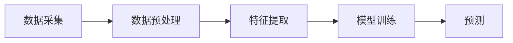

# 设计智能化的企业并购文化整合成功率预测模型

> 关键词：企业并购、文化整合、成功率预测、智能化模型、机器学习

> 摘要：本文聚焦于设计智能化的企业并购文化整合成功率预测模型。在企业并购活动日益频繁的背景下，文化整合的成败对并购的最终结果有着关键影响。通过构建智能化预测模型，利用先进的技术和算法，能够提前对文化整合的成功率进行预测，为企业决策提供有力支持。文章详细阐述了模型的核心概念、算法原理、数学模型，通过项目实战展示了模型的具体实现过程，探讨了实际应用场景，推荐了相关的工具和资源，最后对未来发展趋势与挑战进行了总结。

## 1. 背景介绍 

### 1.1 目的和范围
企业并购作为企业快速扩张和发展的重要战略手段，在全球范围内广泛开展。然而，大量的研究表明，许多企业并购最终未能达到预期目标，其中文化整合的失败是一个重要因素。本项目的目的在于设计一个智能化的企业并购文化整合成功率预测模型，通过对影响文化整合的各种因素进行分析和建模，预测文化整合的成功率，为企业在并购决策和文化整合过程中提供科学依据。

本模型的范围涵盖了企业并购过程中与文化整合相关的多个方面，包括企业文化差异、组织架构、员工态度、管理风格等因素。通过对这些因素的综合分析，实现对文化整合成功率的预测。

### 1.2 预期读者
本文的预期读者包括企业管理人员、并购专家、投资分析师、学术研究人员以及对企业并购和文化整合感兴趣的技术人员。对于企业管理人员和并购专家来说，该模型可以帮助他们在并购决策和文化整合过程中做出更明智的选择；投资分析师可以利用模型的预测结果评估并购项目的风险和收益；学术研究人员可以从模型的设计和实现过程中获取研究思路和方法；技术人员可以借鉴模型的算法和实现细节，进行相关技术的研究和开发。

### 1.3 文档结构概述
本文将按照以下结构进行阐述：首先介绍核心概念与联系，包括文化整合的定义、影响因素以及模型的架构；接着详细讲解核心算法原理和具体操作步骤，通过 Python 源代码进行说明；然后介绍数学模型和公式，并结合具体例子进行解释；之后通过项目实战展示模型的实际实现过程，包括开发环境搭建、源代码详细实现和代码解读；再探讨模型的实际应用场景；推荐相关的工具和资源；最后总结未来发展趋势与挑战，提供常见问题与解答和扩展阅读及参考资料。

### 1.4 术语表

#### 1.4.1 核心术语定义
- **企业并购**：指企业之间的合并与收购行为，是企业实现扩张和发展的重要战略手段。
- **文化整合**：指在企业并购过程中，将不同企业文化进行融合和协调，形成一种新的、统一的企业文化的过程。
- **成功率预测**：指通过对影响文化整合的各种因素进行分析和建模，预测文化整合成功的概率。
- **智能化模型**：指利用先进的技术和算法，如机器学习、人工智能等，实现对文化整合成功率的自动预测的模型。

#### 1.4.2 相关概念解释
- **企业文化**：指企业在长期的发展过程中形成的共同价值观、行为准则、经营理念等。
- **文化差异**：指不同企业之间在文化方面的差异，包括价值观、管理风格、员工行为等方面的差异。
- **组织架构**：指企业内部的组织结构和管理层次，包括部门设置、职责分工等。
- **员工态度**：指员工对企业并购和文化整合的态度和看法，包括支持、反对、中立等。

#### 1.4.3 缩略词列表
- **ML**：Machine Learning，机器学习
- **AI**：Artificial Intelligence，人工智能
- **PCA**：Principal Component Analysis，主成分分析
- **SVM**：Support Vector Machine，支持向量机

## 2. 核心概念与联系 

### 2.1 文化整合的定义与重要性
文化整合是企业并购过程中的关键环节，它涉及到将不同企业的文化进行融合和协调，以实现企业的战略目标。文化整合的成功与否直接影响到企业并购的最终结果，包括企业的绩效、员工的满意度、企业的竞争力等方面。如果文化整合失败，可能会导致员工离职、企业绩效下降、企业文化冲突等问题，从而影响企业的发展。

### 2.2 影响文化整合成功率的因素
影响文化整合成功率的因素有很多，主要包括以下几个方面：
- **企业文化差异**：不同企业之间的文化差异是影响文化整合成功率的重要因素之一。如果企业文化差异过大，可能会导致文化冲突，从而影响文化整合的成功率。
- **组织架构**：企业的组织架构也会影响文化整合的成功率。如果企业的组织架构不合理，可能会导致信息传递不畅、决策效率低下等问题，从而影响文化整合的效果。
- **员工态度**：员工对企业并购和文化整合的态度也会影响文化整合的成功率。如果员工对企业并购和文化整合持支持态度，可能会积极参与文化整合过程，从而提高文化整合的成功率；反之，如果员工对企业并购和文化整合持反对态度，可能会抵制文化整合过程，从而降低文化整合的成功率。
- **管理风格**：企业的管理风格也会影响文化整合的成功率。如果企业的管理风格过于强硬，可能会导致员工的抵触情绪，从而影响文化整合的效果；反之，如果企业的管理风格过于宽松，可能会导致文化整合缺乏有效的指导和监督，从而影响文化整合的质量。

### 2.3 智能化预测模型的架构
智能化的企业并购文化整合成功率预测模型主要包括数据采集、数据预处理、特征提取、模型训练和预测等几个部分。其架构如图 1 所示：



- **数据采集**：收集与企业并购文化整合相关的数据，包括企业文化、组织架构、员工态度、管理风格等方面的数据。
- **数据预处理**：对采集到的数据进行清洗、转换和归一化等处理，以提高数据的质量和可用性。
- **特征提取**：从预处理后的数据中提取与文化整合成功率相关的特征，如企业文化差异度、组织架构复杂度等。
- **模型训练**：利用提取的特征和已知的文化整合成功率数据，对模型进行训练，以学习特征与文化整合成功率之间的关系。
- **预测**：利用训练好的模型对新的企业并购文化整合项目进行预测，输出文化整合的成功率。

## 3. 核心算法原理 & 具体操作步骤 

### 3.1 核心算法原理
本模型采用机器学习算法中的支持向量机（SVM）作为核心算法。支持向量机是一种常用的分类和回归算法，它通过寻找一个最优的超平面来将不同类别的数据分开。在本模型中，我们将文化整合成功率分为成功和失败两类，利用支持向量机算法对输入的特征数据进行分类，从而预测文化整合的成功率。

支持向量机的基本思想是在特征空间中找到一个最优的超平面，使得不同类别的数据点到该超平面的距离最大。具体来说，对于一个二分类问题，给定一组训练数据 $\{(x_1, y_1), (x_2, y_2), \cdots, (x_n, y_n)\}$，其中 $x_i \in \mathbb{R}^d$ 是输入特征向量，$y_i \in \{-1, 1\}$ 是对应的类别标签。支持向量机的目标是找到一个超平面 $w^T x + b = 0$，使得对于所有的正类样本 $y_i = 1$，有 $w^T x_i + b \geq 1$；对于所有的负类样本 $y_i = -1$，有 $w^T x_i + b \leq -1$。同时，要使得间隔 $\frac{2}{\|w\|}$ 最大。

### 3.2 具体操作步骤

#### 3.2.1 数据采集
首先，我们需要收集与企业并购文化整合相关的数据。可以通过问卷调查、访谈、企业文档等方式获取企业文化、组织架构、员工态度、管理风格等方面的数据。

#### 3.2.2 数据预处理
对采集到的数据进行清洗、转换和归一化等处理。具体步骤如下：
- **数据清洗**：去除数据中的缺失值、重复值和异常值。
- **数据转换**：将分类数据转换为数值数据，例如将企业文化类型转换为数字编码。
- **数据归一化**：将数据的取值范围归一化到 $[0, 1]$ 之间，以提高模型的训练效果。

#### 3.2.3 特征提取
从预处理后的数据中提取与文化整合成功率相关的特征。可以采用主成分分析（PCA）等方法进行特征提取，以减少特征的维度，提高模型的训练效率。

#### 3.2.4 模型训练
利用提取的特征和已知的文化整合成功率数据，对支持向量机模型进行训练。具体步骤如下：
- **划分训练集和测试集**：将数据划分为训练集和测试集，一般采用 80% 的数据作为训练集，20% 的数据作为测试集。
- **模型训练**：利用训练集数据对支持向量机模型进行训练，调整模型的参数，以提高模型的准确率。
- **模型评估**：利用测试集数据对训练好的模型进行评估，计算模型的准确率、召回率、F1 值等指标，评估模型的性能。

#### 3.2.5 预测
利用训练好的模型对新的企业并购文化整合项目进行预测，输出文化整合的成功率。

### 3.3 Python 源代码实现

```python
import numpy as np
from sklearn.svm import SVC
from sklearn.preprocessing import StandardScaler
from sklearn.decomposition import PCA
from sklearn.model_selection import train_test_split
from sklearn.metrics import accuracy_score, recall_score, f1_score

# 数据采集和预处理
# 假设我们已经采集到了数据，存储在 X 和 y 中
# X 是特征矩阵，y 是标签向量
# 这里我们随机生成一些示例数据
np.random.seed(42)
X = np.random.rand(100, 10)
y = np.random.randint(0, 2, 100)

# 数据归一化
scaler = StandardScaler()
X = scaler.fit_transform(X)

# 特征提取
pca = PCA(n_components=5)
X = pca.fit_transform(X)

# 划分训练集和测试集
X_train, X_test, y_train, y_test = train_test_split(X, y, test_size=0.2, random_state=42)

# 模型训练
model = SVC(kernel='rbf', C=1.0)
model.fit(X_train, y_train)

# 模型评估
y_pred = model.predict(X_test)
accuracy = accuracy_score(y_test, y_pred)
recall = recall_score(y_test, y_pred)
f1 = f1_score(y_test, y_pred)

print(f"Accuracy: {accuracy}")
print(f"Recall: {recall}")
print(f"F1 Score: {f1}")

# 预测新数据
new_data = np.random.rand(1, 10)
new_data = scaler.transform(new_data)
new_data = pca.transform(new_data)
prediction = model.predict(new_data)
print(f"Prediction: {prediction}")
```

## 4. 数学模型和公式 & 详细讲解 & 举例说明 

### 4.1 支持向量机的数学模型
支持向量机的数学模型可以表示为以下优化问题：

$$
\begin{aligned}
\min_{w, b, \xi} &\quad \frac{1}{2} \|w\|^2 + C \sum_{i=1}^{n} \xi_i \\
\text{s.t.} &\quad y_i (w^T x_i + b) \geq 1 - \xi_i, \quad i = 1, 2, \cdots, n \\
&\quad \xi_i \geq 0, \quad i = 1, 2, \cdots, n
\end{aligned}
$$

其中，$w$ 是超平面的法向量，$b$ 是超平面的截距，$\xi_i$ 是松弛变量，用于处理数据的不可分情况，$C$ 是惩罚参数，用于控制模型的复杂度和误差之间的平衡。

### 4.2 拉格朗日对偶问题
为了求解上述优化问题，我们可以引入拉格朗日乘子 $\alpha_i$ 和 $\mu_i$，将其转化为拉格朗日对偶问题：

$$
\begin{aligned}
\max_{\alpha} &\quad \sum_{i=1}^{n} \alpha_i - \frac{1}{2} \sum_{i=1}^{n} \sum_{j=1}^{n} \alpha_i \alpha_j y_i y_j x_i^T x_j \\
\text{s.t.} &\quad \sum_{i=1}^{n} \alpha_i y_i = 0 \\
&\quad 0 \leq \alpha_i \leq C, \quad i = 1, 2, \cdots, n
\end{aligned}
$$

### 4.3 核函数
在实际应用中，为了处理非线性可分的数据，我们可以引入核函数 $K(x_i, x_j)$，将原始特征空间映射到高维特征空间，从而使得数据在高维特征空间中线性可分。常见的核函数包括线性核、多项式核、径向基核（RBF）等。

例如，径向基核函数的定义为：

$$
K(x_i, x_j) = \exp \left( -\frac{\|x_i - x_j\|^2}{2 \sigma^2} \right)
$$

其中，$\sigma$ 是核函数的带宽参数。

### 4.4 举例说明
假设我们有一个二维的二分类问题，数据点如下：

| $x_1$ | $x_2$ | $y$ |
|-------|-------|-----|
| 1     | 2     | 1   |
| 2     | 3     | 1   |
| 3     | 1     | -1  |
| 4     | 2     | -1  |

我们可以使用支持向量机算法对这些数据进行分类。首先，我们需要将数据进行归一化处理，然后选择合适的核函数和参数进行模型训练。最后，我们可以利用训练好的模型对新的数据点进行分类预测。

```python
import numpy as np
from sklearn.svm import SVC
from sklearn.preprocessing import StandardScaler

# 数据
X = np.array([[1, 2], [2, 3], [3, 1], [4, 2]])
y = np.array([1, 1, -1, -1])

# 数据归一化
scaler = StandardScaler()
X = scaler.fit_transform(X)

# 模型训练
model = SVC(kernel='rbf', C=1.0)
model.fit(X, y)

# 预测新数据
new_data = np.array([[2.5, 2]])
new_data = scaler.transform(new_data)
prediction = model.predict(new_data)
print(f"Prediction: {prediction}")
```

## 5. 项目实战：代码实际案例和详细解释说明 

### 5.1  开发环境搭建
本项目的开发环境主要包括以下几个部分：
- **操作系统**：Windows、Linux 或 macOS
- **编程语言**：Python 3.x
- **开发工具**：Jupyter Notebook 或 PyCharm
- **相关库**：NumPy、Pandas、Scikit-learn、Matplotlib 等

可以使用以下命令安装相关库：

```sh
pip install numpy pandas scikit-learn matplotlib
```

### 5.2  源代码详细实现和代码解读

```python
import numpy as np
import pandas as pd
from sklearn.svm import SVC
from sklearn.preprocessing import StandardScaler
from sklearn.decomposition import PCA
from sklearn.model_selection import train_test_split
from sklearn.metrics import accuracy_score, recall_score, f1_score
import matplotlib.pyplot as plt

# 数据采集和预处理
# 假设我们已经采集到了数据，存储在 CSV 文件中
data = pd.read_csv('data.csv')

# 分离特征和标签
X = data.drop('success', axis=1).values
y = data['success'].values

# 数据归一化
scaler = StandardScaler()
X = scaler.fit_transform(X)

# 特征提取
pca = PCA(n_components=5)
X = pca.fit_transform(X)

# 划分训练集和测试集
X_train, X_test, y_train, y_test = train_test_split(X, y, test_size=0.2, random_state=42)

# 模型训练
model = SVC(kernel='rbf', C=1.0)
model.fit(X_train, y_train)

# 模型评估
y_pred = model.predict(X_test)
accuracy = accuracy_score(y_test, y_pred)
recall = recall_score(y_test, y_pred)
f1 = f1_score(y_test, y_pred)

print(f"Accuracy: {accuracy}")
print(f"Recall: {recall}")
print(f"F1 Score: {f1}")

# 可视化结果
plt.figure(figsize=(8, 6))
plt.scatter(X_test[:, 0], X_test[:, 1], c=y_pred, cmap='viridis')
plt.title('Prediction Results')
plt.xlabel('Feature 1')
plt.ylabel('Feature 2')
plt.show()

# 预测新数据
new_data = np.random.rand(1, X.shape[1])
new_data = scaler.transform(new_data)
new_data = pca.transform(new_data)
prediction = model.predict(new_data)
print(f"Prediction: {prediction}")
```

### 5.3  代码解读与分析
- **数据采集和预处理**：从 CSV 文件中读取数据，分离特征和标签，然后对特征数据进行归一化处理。
- **特征提取**：使用主成分分析（PCA）方法对特征数据进行降维，提取主要特征。
- **划分训练集和测试集**：将数据划分为训练集和测试集，比例为 80% 和 20%。
- **模型训练**：使用支持向量机（SVM）算法对训练集数据进行训练，选择径向基核函数（RBF）和惩罚参数 $C = 1.0$。
- **模型评估**：使用测试集数据对训练好的模型进行评估，计算准确率、召回率和 F1 值。
- **可视化结果**：使用 Matplotlib 库将预测结果可视化，以便更直观地观察模型的预测效果。
- **预测新数据**：生成一个新的数据点，对其进行预处理和特征提取，然后使用训练好的模型进行预测。

## 6. 实际应用场景 
### 6.1 企业并购决策
在企业进行并购决策时，智能化的企业并购文化整合成功率预测模型可以帮助企业评估并购项目的风险和收益。通过对目标企业的文化、组织架构、员工态度等因素进行分析和预测，企业可以提前了解文化整合的难度和成功率，从而决定是否进行并购以及如何制定文化整合策略。

### 6.2 文化整合策略制定
在企业并购后的文化整合过程中，预测模型可以为企业提供科学依据，帮助企业制定合理的文化整合策略。根据预测结果，企业可以针对不同的文化差异和员工态度，采取不同的文化整合措施，如文化培训、沟通交流、激励机制等，以提高文化整合的成功率。

### 6.3 投资分析
投资分析师可以利用预测模型评估并购项目的风险和收益，为投资者提供决策建议。通过对并购项目的文化整合成功率进行预测，投资分析师可以判断并购项目的可行性和潜在价值，从而帮助投资者做出明智的投资决策。

## 7. 工具和资源推荐

### 7.1 学习资源推荐

#### 7.1.1 书籍推荐
- 《机器学习》（周志华著）：全面介绍了机器学习的基本概念、算法和应用，是学习机器学习的经典教材。
- 《Python 机器学习》（Sebastian Raschka 著）：详细介绍了使用 Python 进行机器学习的方法和技巧，包括数据预处理、特征提取、模型训练和评估等方面的内容。
- 《企业并购与文化整合》（XXX 著）：深入探讨了企业并购过程中的文化整合问题，包括文化差异、文化冲突、文化整合策略等方面的内容。

#### 7.1.2 在线课程
- Coursera 上的“机器学习”课程（Andrew Ng 教授）：由斯坦福大学的 Andrew Ng 教授授课，是学习机器学习的经典在线课程。
- edX 上的“数据科学与机器学习”课程：介绍了数据科学和机器学习的基本概念、算法和应用，适合初学者学习。
- 中国大学 MOOC 上的“企业并购与重组”课程：系统介绍了企业并购与重组的理论、方法和实践，包括并购决策、文化整合、财务分析等方面的内容。

#### 7.1.3 技术博客和网站
- Kaggle：全球最大的数据科学竞赛平台，提供了丰富的数据集、代码和学习资源。
- Medium：一个技术博客平台，有很多关于机器学习、人工智能等领域的优质文章。
- 博客园：国内知名的技术博客平台，有很多关于企业管理、并购重组等领域的文章。

### 7.2 开发工具框架推荐

#### 7.2.1 IDE和编辑器
- PyCharm：一款专业的 Python 集成开发环境，提供了丰富的代码编辑、调试和项目管理功能。
- Jupyter Notebook：一个交互式的开发环境，适合进行数据分析和机器学习实验。
- Visual Studio Code：一款轻量级的代码编辑器，支持多种编程语言和插件，适合快速开发和调试。

#### 7.2.2 调试和性能分析工具
- PyCharm 调试器：可以帮助开发者快速定位和解决代码中的问题。
- TensorBoard：一个可视化工具，用于监控和分析机器学习模型的训练过程和性能。
- cProfile：Python 内置的性能分析工具，可以帮助开发者找出代码中的性能瓶颈。

#### 7.2.3 相关框架和库
- Scikit-learn：一个简单易用的机器学习库，提供了丰富的机器学习算法和工具，如分类、回归、聚类等。
- TensorFlow：一个开源的深度学习框架，用于构建和训练各种深度学习模型。
- Keras：一个高级神经网络 API，基于 TensorFlow 或 Theano 等后端，适合快速搭建和训练神经网络模型。

### 7.3 相关论文著作推荐

#### 7.3.1 经典论文
- “Support-Vector Networks”（Cortes 和 Vapnik 著）：介绍了支持向量机的基本原理和算法，是支持向量机领域的经典论文。
- “Principal Component Analysis”（Pearson 著）：介绍了主成分分析的基本原理和算法，是主成分分析领域的经典论文。
- “The Role of Culture in Mergers and Acquisitions”（Schweiger 和 Goulet 著）：探讨了企业文化在企业并购中的作用和影响，是企业并购文化整合领域的经典论文。

#### 7.3.2 最新研究成果
- 可以通过 Google Scholar、IEEE Xplore、ACM Digital Library 等学术数据库搜索关于企业并购文化整合和机器学习预测模型的最新研究成果。

#### 7.3.3 应用案例分析
- 可以参考一些知名企业的并购案例，如惠普并购康柏、联想并购 IBM PC 业务等，分析这些案例中文化整合的成功经验和失败教训。

## 8. 总结：未来发展趋势与挑战

### 8.1 未来发展趋势
- **智能化程度不断提高**：随着人工智能技术的不断发展，智能化的企业并购文化整合成功率预测模型将越来越智能化，能够自动学习和优化模型，提高预测的准确性和可靠性。
- **多学科融合**：企业并购文化整合是一个复杂的问题，涉及到管理学、心理学、社会学等多个学科领域。未来的预测模型将更加注重多学科融合，综合考虑各种因素的影响，提高模型的科学性和实用性。
- **可视化和交互性增强**：未来的预测模型将更加注重可视化和交互性，通过直观的图表和界面展示预测结果，方便用户进行分析和决策。同时，用户可以与模型进行交互，调整模型的参数和输入，获得更个性化的预测结果。

### 8.2 挑战
- **数据质量和获取难度**：企业并购文化整合的数据往往比较复杂和难以获取，数据质量也参差不齐。如何提高数据的质量和获取效率，是构建预测模型面临的一个重要挑战。
- **文化差异的量化和度量**：企业文化差异是影响文化整合成功率的重要因素之一，但文化差异的量化和度量是一个难题。如何准确地量化和度量文化差异，是提高预测模型准确性的关键。
- **模型的可解释性**：机器学习模型往往是一个黑箱，难以解释其预测结果。在企业并购文化整合的决策中，决策者需要了解模型的预测依据和原理。如何提高模型的可解释性，是未来研究的一个重要方向。

## 9. 附录：常见问题与解答

### 9.1 数据采集时需要注意哪些问题？
- **数据的完整性**：确保采集到的数据包含了所有与文化整合成功率相关的因素，避免数据缺失。
- **数据的准确性**：确保采集到的数据准确无误，避免数据错误。
- **数据的代表性**：确保采集到的数据具有代表性，能够反映企业并购文化整合的实际情况。

### 9.2 如何选择合适的核函数和参数？
- **核函数的选择**：根据数据的特点和问题的性质选择合适的核函数。一般来说，线性核函数适用于线性可分的数据，多项式核函数和径向基核函数适用于非线性可分的数据。
- **参数的选择**：可以使用交叉验证等方法选择合适的参数。通过在不同的参数组合下训练模型，选择性能最优的参数组合。

### 9.3 模型的预测结果是否可靠？
模型的预测结果受到多种因素的影响，如数据质量、模型算法、参数选择等。为了提高模型的预测可靠性，可以采取以下措施：
- **提高数据质量**：确保采集到的数据准确、完整、具有代表性。
- **选择合适的模型算法和参数**：根据数据的特点和问题的性质选择合适的模型算法和参数。
- **进行模型评估和验证**：使用交叉验证、留一法等方法对模型进行评估和验证，确保模型的性能稳定可靠。

## 10. 扩展阅读 & 参考资料
- [1] 周志华. 机器学习[M]. 清华大学出版社, 2016.
- [2] Sebastian Raschka. Python 机器学习[M]. 人民邮电出版社, 2017.
- [3] Cortes C, Vapnik V. Support-Vector Networks[J]. Machine Learning, 1995, 20(3): 273-297.
- [4] Pearson K. Principal Component Analysis[J]. The London, Edinburgh, and Dublin Philosophical Magazine and Journal of Science, 1901, 2(11): 559-572.
- [5] Schweiger D M, Goulet M A. The Role of Culture in Mergers and Acquisitions[J]. Journal of Organizational Behavior, 2000, 21(1): 1-14.