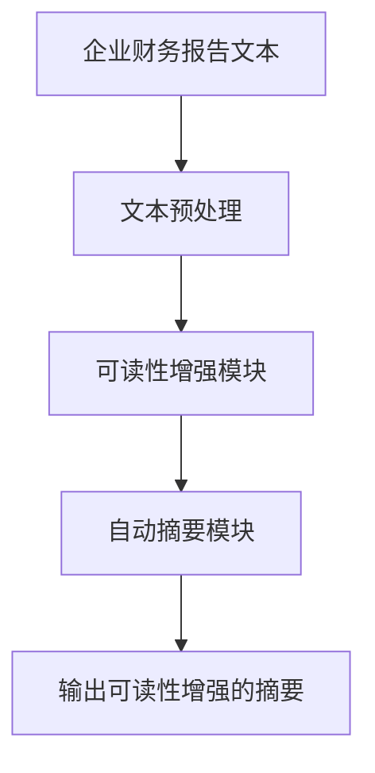

# 设计智能化的企业财务报告可读性增强与自动摘要模型

> 关键词：企业财务报告、可读性增强、自动摘要模型、自然语言处理、人工智能

> 摘要：本文聚焦于设计智能化的企业财务报告可读性增强与自动摘要模型。在当今信息爆炸的时代，企业财务报告包含大量复杂信息，其可读性差和信息提取困难的问题日益凸显。通过构建智能化模型，利用自然语言处理、人工智能等先进技术，能够有效提升财务报告的可读性，并实现自动摘要，帮助用户快速准确地获取关键信息。文章详细阐述了相关核心概念、算法原理、数学模型，通过项目实战展示代码实现与分析，探讨了实际应用场景，推荐了相关工具和资源，最后对未来发展趋势与挑战进行总结。

## 1. 背景介绍 
### 1.1 目的和范围
企业财务报告是企业向利益相关者传达财务状况和经营成果的重要文件。然而，传统的财务报告往往篇幅冗长、语言专业晦涩，导致普通投资者、监管机构等非专业人士难以理解其中的关键信息。本项目的目的在于设计一个智能化的模型，一方面增强企业财务报告的可读性，使其语言更加通俗易懂；另一方面实现财务报告的自动摘要，提取出关键的财务指标、经营成果等信息，为用户提供简洁明了的报告概述。

本项目的范围涵盖了从财务报告文本数据的预处理，到可读性增强算法的设计与实现，再到自动摘要模型的构建与优化，最后通过实际案例验证模型的有效性。

### 1.2 预期读者
本文的预期读者包括但不限于企业财务管理人员、投资者、监管机构工作人员、自然语言处理和人工智能领域的研究人员和从业者。对于企业财务管理人员来说，该模型可以帮助他们更好地向利益相关者传达财务信息；投资者可以借助该模型快速了解企业的财务状况，做出更明智的投资决策；监管机构工作人员能够更高效地审查企业财务报告；研究人员和从业者则可以从技术实现和算法优化的角度获取相关知识和灵感。

### 1.3 文档结构概述
本文将按照以下结构进行组织：首先介绍背景知识，包括项目的目的、预期读者和文档结构概述等内容；接着阐述核心概念与联系，包括可读性增强和自动摘要的原理、架构及其相互关系；然后详细讲解核心算法原理和具体操作步骤，通过 Python 代码进行说明；随后介绍相关的数学模型和公式，并举例说明；再通过项目实战展示代码的实际案例和详细解释；探讨该模型的实际应用场景；推荐相关的工具和资源；最后总结未来发展趋势与挑战，提供常见问题与解答以及扩展阅读和参考资料。

### 1.4 术语表
#### 1.4.1 核心术语定义
- **企业财务报告**：企业定期编制的，反映企业财务状况、经营成果和现金流量等信息的书面文件，通常包括资产负债表、利润表、现金流量表等。
- **可读性增强**：通过对文本进行处理，如简化语言表达、调整句子结构等，使文本更易于理解和阅读。
- **自动摘要**：利用计算机技术，从文本中提取关键信息，生成简洁明了的摘要，概括文本的主要内容。
- **自然语言处理（NLP）**：研究如何让计算机理解和处理人类语言的技术领域，包括文本分类、情感分析、机器翻译等任务。
- **人工智能（AI）**：使计算机能够模拟人类智能的技术，包括机器学习、深度学习等方法。

#### 1.4.2 相关概念解释
- **机器学习**：人工智能的一个分支，通过让计算机从数据中学习模式和规律，从而实现预测和决策的能力。常见的机器学习算法包括决策树、支持向量机、神经网络等。
- **深度学习**：一种基于神经网络的机器学习方法，通过构建多层神经网络，自动学习数据的特征表示，在图像识别、自然语言处理等领域取得了显著的成果。
- **文本预处理**：在对文本进行分析和处理之前，对文本进行清洗、分词、去除停用词等操作，以提高后续处理的效率和准确性。

#### 1.4.3 缩略词列表
- **NLP**：自然语言处理（Natural Language Processing）
- **AI**：人工智能（Artificial Intelligence）
- **ML**：机器学习（Machine Learning）
- **DL**：深度学习（Deep Learning）

## 2. 核心概念与联系 

### 2.1 可读性增强原理
可读性增强的核心在于将复杂、专业的财务报告语言转化为更通俗易懂的表达方式。这可以通过以下几个方面实现：
- **词汇替换**：将专业术语替换为更常见、易懂的词汇。例如，将“应收账款周转率”替换为“应收款项收回速度”。
- **句子简化**：将复杂的长句子拆分成多个简单的短句子，减少句子的复杂度。例如，将“由于市场需求的波动以及原材料价格的上涨，导致本公司本季度的净利润较上季度有所下降”拆分成“市场需求有波动。原材料价格上涨。这导致本公司本季度净利润较上季度下降”。
- **语法优化**：调整句子的语法结构，使其更符合自然语言的表达习惯。例如，将“本公司产品的销售额在过去一年中呈现出稳步增长的趋势”调整为“过去一年，本公司产品销售额稳步增长”。

### 2.2 自动摘要原理
自动摘要的目标是从财务报告中提取关键信息，生成简洁的摘要。常见的自动摘要方法包括抽取式摘要和生成式摘要：
- **抽取式摘要**：直接从原文中选取重要的句子或段落作为摘要。通常通过计算句子的重要性得分，选择得分较高的句子组成摘要。例如，可以根据句子的位置、关键词频率、句子长度等因素计算句子的重要性得分。
- **生成式摘要**：通过深度学习模型，如序列到序列模型（Seq2Seq），根据原文的语义信息生成全新的摘要。生成式摘要能够更好地概括原文的主要内容，但对模型的训练要求较高。

### 2.3 可读性增强与自动摘要的联系
可读性增强和自动摘要都是为了提高用户对企业财务报告的理解效率和效果。可读性增强侧重于改善报告文本的语言表达，使读者更容易理解报告的内容；而自动摘要则侧重于提取报告的关键信息，为读者提供报告的概述。两者相互补充，共同提高财务报告的信息传达效率。例如，在进行自动摘要之前，先对财务报告进行可读性增强处理，可以提高摘要的准确性和可读性；而自动摘要的结果也可以作为可读性增强的参考，进一步优化报告的语言表达。

### 2.4 架构示意图


该架构图展示了从企业财务报告文本输入到最终输出可读性增强的摘要的整个流程。首先对输入的财务报告文本进行预处理，去除噪声和无用信息；然后通过可读性增强模块对文本进行语言优化；最后经过自动摘要模块提取关键信息，生成摘要并输出。

## 3. 核心算法原理 & 具体操作步骤 

### 3.1 可读性增强算法原理与实现
#### 3.1.1 词汇替换算法
词汇替换算法的基本思想是构建一个专业术语到通俗易懂词汇的映射表，然后在文本中查找并替换相应的术语。以下是一个简单的 Python 代码示例：

```python
# 定义专业术语到通俗易懂词汇的映射表
term_mapping = {
    "应收账款周转率": "应收款项收回速度",
    "资产负债率": "负债占资产比例"
}

def replace_terms(text):
    for term, replacement in term_mapping.items():
        text = text.replace(term, replacement)
    return text

# 示例使用
financial_report = "本公司的应收账款周转率较上季度有所提高。"
readable_report = replace_terms(financial_report)
print(readable_report)
```

#### 3.1.2 句子简化算法
句子简化算法可以通过自然语言处理工具，如 NLTK（Natural Language Toolkit），将复杂的句子拆分成简单的句子。以下是一个简单的示例：

```python
import nltk
nltk.download('punkt')

def simplify_sentences(text):
    sentences = nltk.sent_tokenize(text)
    simplified_sentences = []
    for sentence in sentences:
        # 简单的句子拆分规则，例如按逗号拆分
        sub_sentences = sentence.split('，')
        for sub_sentence in sub_sentences:
            simplified_sentences.append(sub_sentence.strip())
    return "。".join(simplified_sentences)

# 示例使用
complex_sentence = "由于市场需求的波动以及原材料价格的上涨，导致本公司本季度的净利润较上季度有所下降。"
simplified_sentence = simplify_sentences(complex_sentence)
print(simplified_sentence)
```

### 3.2 自动摘要算法原理与实现
#### 3.2.1 抽取式摘要算法
抽取式摘要算法可以使用 TextRank 算法，该算法基于图的排序算法，通过计算句子之间的相似度，对句子进行排序，选择得分较高的句子作为摘要。以下是一个使用 Python 的 `sumy` 库实现的 TextRank 摘要示例：

```python
from sumy.parsers.plaintext import PlaintextParser
from sumy.nlp.tokenizers import Tokenizer
from sumy.summarizers.text_rank import TextRankSummarizer

def extractive_summary(text, num_sentences=3):
    parser = PlaintextParser.from_string(text, Tokenizer("chinese"))
    summarizer = TextRankSummarizer()
    summary = summarizer(parser.document, num_sentences)
    summary_text = "".join([str(sentence) for sentence in summary])
    return summary_text

# 示例使用
financial_report = "本公司在过去一年中取得了显著的业绩增长。销售额较上一年增长了 20%。净利润达到了 1000 万元。同时，公司加强了研发投入，推出了多款新产品。"
summary = extractive_summary(financial_report)
print(summary)
```

#### 3.2.2 生成式摘要算法
生成式摘要算法可以使用基于 Transformer 架构的预训练模型，如 BART（Bidirectional and Auto-Regressive Transformer）。以下是一个使用 `transformers` 库实现的 BART 摘要示例：

```python
from transformers import BartForConditionalGeneration, BartTokenizer

model_name = "facebook/bart-large-cnn"
tokenizer = BartTokenizer.from_pretrained(model_name)
model = BartForConditionalGeneration.from_pretrained(model_name)

def generative_summary(text, max_length=100):
    inputs = tokenizer([text], max_length=1024, return_tensors="pt")
    summary_ids = model.generate(inputs["input_ids"], num_beams=4, max_length=max_length, early_stopping=True)
    summary = tokenizer.decode(summary_ids[0], skip_special_tokens=True)
    return summary

# 示例使用
financial_report = "本公司在过去一年中取得了显著的业绩增长。销售额较上一年增长了 20%。净利润达到了 1000 万元。同时，公司加强了研发投入，推出了多款新产品。"
summary = generative_summary(financial_report)
print(summary)
```

## 4. 数学模型和公式 & 详细讲解 & 举例说明 

### 4.1 词汇替换的数学模型
词汇替换可以看作是一个字符串匹配和替换的过程。设 $T$ 为原始文本，$M$ 为专业术语到通俗易懂词汇的映射表，$T'$ 为替换后的文本。对于 $T$ 中的每个子字符串 $t$，如果 $t$ 存在于 $M$ 的键集合中，则将其替换为 $M[t]$。数学公式表示为：

$$T' = \text{replace}(T, M)$$

其中，$\text{replace}(T, M)$ 是一个替换函数，它遍历 $T$ 中的每个子字符串，根据 $M$ 进行替换。

例如，对于原始文本 $T = \text{"本公司的应收账款周转率较上季度有所提高。"}$，映射表 $M = \{\text{"应收账款周转率"}: \text{"应收款项收回速度"}\}$，则替换后的文本 $T' = \text{"本公司的应收款项收回速度较上季度有所提高。"}$。

### 4.2 句子简化的数学模型
句子简化可以看作是一个句子分割的过程。设 $S$ 为原始句子集合，$S'$ 为简化后的句子集合。对于 $S$ 中的每个句子 $s$，根据一定的规则（如按逗号分割）将其拆分成多个子句子 $s_1, s_2, \cdots, s_n$，并将这些子句子添加到 $S'$ 中。数学公式表示为：

$$S' = \bigcup_{s \in S} \text{split}(s)$$

其中，$\text{split}(s)$ 是一个句子分割函数，它将句子 $s$ 拆分成多个子句子。

例如，对于原始句子 $s = \text{"由于市场需求的波动以及原材料价格的上涨，导致本公司本季度的净利润较上季度有所下降。"}$，按逗号分割后得到子句子 $s_1 = \text{"由于市场需求的波动以及原材料价格的上涨"}$，$s_2 = \text{"导致本公司本季度的净利润较上季度有所下降"}$，则简化后的句子集合 $S' = \{s_1, s_2\}$。

### 4.3 抽取式摘要的数学模型
TextRank 算法基于图的排序算法，其核心思想是通过计算句子之间的相似度，构建一个句子图，然后在图上进行迭代计算，得到每个句子的重要性得分。设 $G = (V, E)$ 为句子图，其中 $V$ 为句子集合，$E$ 为边集合，表示句子之间的相似度关系。句子 $i$ 的重要性得分 $S(i)$ 可以通过以下公式计算：

$$S(i) = (1 - d) + d \times \sum_{j \in In(i)} \frac{w_{ji}}{\sum_{k \in Out(j)} w_{jk}} S(j)$$

其中，$d$ 为阻尼系数，通常取值为 0.85；$In(i)$ 为指向句子 $i$ 的所有句子集合；$Out(j)$ 为句子 $j$ 指向的所有句子集合；$w_{ji}$ 为句子 $j$ 到句子 $i$ 的边的权重，表示句子 $j$ 和句子 $i$ 的相似度。

例如，假设有三个句子 $s_1, s_2, s_3$，它们之间的相似度矩阵为：

$$
\begin{bmatrix}
0 & 0.5 & 0.3 \\
0.5 & 0 & 0.4 \\
0.3 & 0.4 & 0
\end{bmatrix}
$$

则句子 $s_1$ 的重要性得分 $S(s_1)$ 的计算过程如下：

$$
\begin{align*}
S(s_1) &= (1 - 0.85) + 0.85 \times (\frac{0.5}{0.5 + 0.4} S(s_2) + \frac{0.3}{0.3 + 0.4} S(s_3)) \\
&= 0.15 + 0.85 \times (\frac{0.5}{0.9} S(s_2) + \frac{0.3}{0.7} S(s_3))
\end{align*}
$$

通过迭代计算，直到 $S(i)$ 收敛，得到每个句子的最终重要性得分，选择得分较高的句子作为摘要。

### 4.4 生成式摘要的数学模型
基于 Transformer 架构的生成式摘要模型，如 BART，是一个序列到序列的模型，通过编码器 - 解码器结构进行训练。编码器将输入的文本序列编码为一个隐藏状态序列，解码器根据编码器的输出和之前生成的词，生成下一个词。设 $x = (x_1, x_2, \cdots, x_n)$ 为输入的文本序列，$y = (y_1, y_2, \cdots, y_m)$ 为生成的摘要序列，则生成 $y$ 的概率可以表示为：

$$P(y|x) = \prod_{i = 1}^{m} P(y_i|y_{<i}, x)$$

其中，$y_{<i} = (y_1, y_2, \cdots, y_{i - 1})$ 表示之前生成的词序列。模型通过最大化训练数据的对数似然函数来进行训练：

$$\mathcal{L} = \sum_{(x, y) \in \mathcal{D}} \log P(y|x)$$

其中，$\mathcal{D}$ 为训练数据集。

例如，对于输入文本 $x = \text{"本公司在过去一年中取得了显著的业绩增长。销售额较上一年增长了 20%。净利润达到了 1000 万元。同时，公司加强了研发投入，推出了多款新产品。"}$，模型通过学习训练数据，生成摘要序列 $y$，如 $y = \text{"本公司去年业绩显著增长，销售额增 20%，净利润 1000 万，加强研发推新产品。"}$。

## 5. 项目实战：代码实际案例和详细解释说明 

### 5.1  开发环境搭建
#### 5.1.1 安装 Python
首先需要安装 Python 环境，建议使用 Python 3.7 及以上版本。可以从 Python 官方网站（https://www.python.org/downloads/） 下载并安装适合自己操作系统的 Python 版本。

#### 5.1.2 创建虚拟环境
为了避免不同项目之间的依赖冲突，建议使用虚拟环境。可以使用 `venv` 或 `conda` 来创建虚拟环境。以下是使用 `venv` 创建虚拟环境的示例：

```bash
python -m venv financial_report_env
source financial_report_env/bin/activate  # 在 Linux 或 macOS 上激活虚拟环境
financial_report_env\Scripts\activate  # 在 Windows 上激活虚拟环境
```

#### 5.1.3 安装依赖库
在虚拟环境中安装项目所需的依赖库，包括 `nltk`、`sumy`、`transformers` 等。可以使用 `pip` 进行安装：

```bash
pip install nltk sumy transformers
```

### 5.2  源代码详细实现和代码解读
以下是一个完整的企业财务报告可读性增强与自动摘要的 Python 代码示例：

```python
import nltk
from sumy.parsers.plaintext import PlaintextParser
from sumy.nlp.tokenizers import Tokenizer
from sumy.summarizers.text_rank import TextRankSummarizer
from transformers import BartForConditionalGeneration, BartTokenizer

# 定义专业术语到通俗易懂词汇的映射表
term_mapping = {
    "应收账款周转率": "应收款项收回速度",
    "资产负债率": "负债占资产比例"
}

def replace_terms(text):
    for term, replacement in term_mapping.items():
        text = text.replace(term, replacement)
    return text

def simplify_sentences(text):
    nltk.download('punkt')
    sentences = nltk.sent_tokenize(text)
    simplified_sentences = []
    for sentence in sentences:
        # 简单的句子拆分规则，例如按逗号拆分
        sub_sentences = sentence.split('，')
        for sub_sentence in sub_sentences:
            simplified_sentences.append(sub_sentence.strip())
    return "。".join(simplified_sentences)

def extractive_summary(text, num_sentences=3):
    parser = PlaintextParser.from_string(text, Tokenizer("chinese"))
    summarizer = TextRankSummarizer()
    summary = summarizer(parser.document, num_sentences)
    summary_text = "".join([str(sentence) for sentence in summary])
    return summary_text

model_name = "facebook/bart-large-cnn"
tokenizer = BartTokenizer.from_pretrained(model_name)
model = BartForConditionalGeneration.from_pretrained(model_name)

def generative_summary(text, max_length=100):
    inputs = tokenizer([text], max_length=1024, return_tensors="pt")
    summary_ids = model.generate(inputs["input_ids"], num_beams=4, max_length=max_length, early_stopping=True)
    summary = tokenizer.decode(summary_ids[0], skip_special_tokens=True)
    return summary

def enhance_readability_and_summarize(financial_report):
    # 可读性增强
    readable_report = replace_terms(financial_report)
    readable_report = simplify_sentences(readable_report)
    
    # 自动摘要
    extractive_summary_text = extractive_summary(readable_report)
    generative_summary_text = generative_summary(readable_report)
    
    return readable_report, extractive_summary_text, generative_summary_text

# 示例使用
financial_report = "本公司的应收账款周转率较上季度有所提高。由于市场需求的波动以及原材料价格的上涨，导致本公司本季度的净利润较上季度有所下降。本公司在过去一年中取得了显著的业绩增长。销售额较上一年增长了 20%。净利润达到了 1000 万元。同时，公司加强了研发投入，推出了多款新产品。"
readable_report, extractive_summary_text, generative_summary_text = enhance_readability_and_summarize(financial_report)

print("可读性增强后的报告：", readable_report)
print("抽取式摘要：", extractive_summary_text)
print("生成式摘要：", generative_summary_text)
```

### 5.3  代码解读与分析
- **`replace_terms` 函数**：该函数接受一个文本字符串作为输入，根据 `term_mapping` 映射表，将文本中的专业术语替换为通俗易懂的词汇。
- **`simplify_sentences` 函数**：该函数使用 `nltk` 库的 `sent_tokenize` 方法将文本拆分成句子，然后按逗号将每个句子拆分成子句子，最后将子句子用句号连接起来，实现句子的简化。
- **`extractive_summary` 函数**：该函数使用 `sumy` 库的 `TextRankSummarizer` 算法，对输入的文本进行抽取式摘要，选择得分较高的句子作为摘要。
- **`generative_summary` 函数**：该函数使用 `transformers` 库的 `BartForConditionalGeneration` 模型，对输入的文本进行生成式摘要，生成全新的摘要文本。
- **`enhance_readability_and_summarize` 函数**：该函数先对输入的财务报告进行可读性增强处理，然后分别进行抽取式摘要和生成式摘要，最后返回可读性增强后的报告、抽取式摘要和生成式摘要。

通过以上代码，我们可以实现企业财务报告的可读性增强和自动摘要功能。

## 6. 实际应用场景 
### 6.1 投资者决策
投资者在进行投资决策时，需要快速了解企业的财务状况和经营成果。通过使用智能化的企业财务报告可读性增强与自动摘要模型，投资者可以在短时间内获取财务报告的关键信息，如销售额、净利润、资产负债率等，从而更准确地评估企业的投资价值，做出更明智的投资决策。

### 6.2 监管机构审查
监管机构需要对企业的财务报告进行审查，以确保企业的财务信息真实、准确、完整。该模型可以帮助监管机构快速提取财务报告的关键信息，提高审查效率，同时增强报告的可读性，使监管人员更容易理解报告内容，发现潜在的问题和风险。

### 6.3 企业内部沟通
在企业内部，不同部门之间需要共享和沟通财务信息。由于财务报告通常包含大量专业术语和复杂数据，非财务部门的人员可能难以理解。通过使用该模型，可以将财务报告转化为通俗易懂的语言，并生成简洁的摘要，方便企业内部各部门之间的沟通和协作，提高工作效率。

### 6.4 金融研究
金融研究人员需要对大量的企业财务报告进行分析和研究。该模型可以帮助研究人员快速获取财务报告的关键信息，节省时间和精力，同时提高研究的准确性和效率。研究人员可以基于模型生成的摘要和可读性增强的报告，进行更深入的数据分析和挖掘，发现潜在的经济规律和趋势。

## 7. 工具和资源推荐
### 7.1 学习资源推荐
#### 7.1.1 书籍推荐
- 《自然语言处理入门》：作者何晗，本书系统地介绍了自然语言处理的基本概念、算法和技术，适合初学者入门学习。
- 《深度学习》：作者 Ian Goodfellow、Yoshua Bengio 和 Aaron Courville，本书是深度学习领域的经典著作，全面介绍了深度学习的理论和实践。
- 《Python 自然语言处理》：作者 Steven Bird、Ewan Klein 和 Edward Loper，本书结合 Python 语言，详细介绍了自然语言处理的各种技术和应用。

#### 7.1.2 在线课程
- Coursera 上的 “Natural Language Processing Specialization”：该课程由顶尖大学的教授授课，系统地介绍了自然语言处理的各个方面，包括文本分类、情感分析、机器翻译等。
- edX 上的 “Introduction to Artificial Intelligence”：该课程介绍了人工智能的基本概念、算法和技术，包括机器学习、深度学习等，为学习自然语言处理和智能化模型设计奠定基础。
- 哔哩哔哩（B 站）上的自然语言处理相关教程：B 站上有许多免费的自然语言处理教程，由不同的博主分享，内容丰富多样，可以根据自己的需求选择学习。

#### 7.1.3 技术博客和网站
- Medium：Medium 上有许多自然语言处理和人工智能领域的技术博客，作者来自世界各地的研究人员和从业者，分享了最新的研究成果和实践经验。
- arXiv：arXiv 是一个预印本服务器，提供了大量的自然科学和计算机科学领域的研究论文，包括自然语言处理和人工智能的最新研究成果。
- 机器之心：机器之心是一个专注于人工智能和机器学习的科技媒体，提供了最新的行业动态、技术文章和研究报告。

### 7.2 开发工具框架推荐
#### 7.2.1 IDE和编辑器
- PyCharm：PyCharm 是一款专门为 Python 开发设计的集成开发环境（IDE），具有代码编辑、调试、自动补全、版本控制等功能，非常适合 Python 项目的开发。
- Visual Studio Code：Visual Studio Code 是一款轻量级的代码编辑器，支持多种编程语言，通过安装 Python 相关的扩展，可以实现 Python 代码的编辑、调试和运行。
- Jupyter Notebook：Jupyter Notebook 是一个交互式的开发环境，支持 Python、R 等多种编程语言，适合进行数据探索、模型训练和代码演示。

#### 7.2.2 调试和性能分析工具
- PDB：PDB 是 Python 自带的调试器，可以在代码中设置断点，逐行执行代码，查看变量的值和程序的执行流程，帮助开发者快速定位和解决问题。
- Py-Spy：Py-Spy 是一个轻量级的 Python 性能分析工具，可以实时监控 Python 程序的 CPU 使用情况和函数调用栈，帮助开发者找出性能瓶颈。
- TensorBoard：TensorBoard 是 TensorFlow 提供的可视化工具，可以可视化模型的训练过程、损失函数曲线、准确率曲线等，帮助开发者更好地理解和优化模型。

#### 7.2.3 相关框架和库
- NLTK：NLTK 是 Python 中最常用的自然语言处理库，提供了丰富的工具和数据集，包括分词、词性标注、命名实体识别等功能。
- SpaCy：SpaCy 是一个高效的自然语言处理库，具有快速的处理速度和良好的性能，支持多种语言，提供了预训练的模型和工具。
- Transformers：Transformers 是 Hugging Face 开发的一个用于自然语言处理的库，提供了大量的预训练模型，如 BERT、GPT、BART 等，方便开发者进行模型的微调与应用。

### 7.3 相关论文著作推荐
#### 7.3.1 经典论文
- “Attention Is All You Need”：该论文提出了 Transformer 架构，为自然语言处理和深度学习领域带来了革命性的变化，是现代自然语言处理模型的基础。
- “TextRank: Bringing Order into Texts”：该论文提出了 TextRank 算法，用于文本的自动摘要和关键词提取，是抽取式摘要算法的经典之作。
- “Sequence to Sequence Learning with Neural Networks”：该论文提出了序列到序列（Seq2Seq）模型，为生成式自然语言处理任务提供了重要的思路和方法。

#### 7.3.2 最新研究成果
- 关注 ACL（Association for Computational Linguistics）、EMNLP（Conference on Empirical Methods in Natural Language Processing）等自然语言处理领域的顶级会议，这些会议上的研究论文代表了自然语言处理领域的最新研究成果。
- 查阅 arXiv 上的最新预印本论文，了解自然语言处理和人工智能领域的前沿研究动态。

#### 7.3.3 应用案例分析
- 阅读相关的行业报告和案例分析，了解智能化的企业财务报告可读性增强与自动摘要模型在实际应用中的效果和经验教训。
- 参考国内外知名企业的实践案例，学习他们在财务报告处理和信息提取方面的先进技术和方法。

## 8. 总结：未来发展趋势与挑战
### 8.1 未来发展趋势
#### 8.1.1 多模态融合
未来的企业财务报告可读性增强与自动摘要模型将不仅仅局限于文本处理，还将融合图像、音频等多模态信息。例如，财务报告中可能包含图表、图片等信息，通过多模态融合技术，可以更全面地提取和理解财务报告中的信息，提高摘要的准确性和可读性。

#### 8.1.2 个性化定制
不同的用户对财务报告的关注点和需求可能不同。未来的模型将能够根据用户的个性化需求，生成定制化的摘要和可读性增强的报告。例如，投资者可能更关注财务指标和投资价值，监管机构可能更关注合规性和风险信息，模型可以根据用户的身份和需求，提供针对性的信息。

#### 8.1.3 与知识图谱结合
知识图谱可以将企业的财务信息与相关的行业知识、市场信息等进行关联，形成一个庞大的知识网络。未来的模型将与知识图谱结合，利用知识图谱中的信息，更好地理解财务报告的语义，提高摘要的质量和准确性。

#### 8.1.4 实时处理
随着企业财务信息的实时更新，未来的模型将具备实时处理的能力，能够及时对新的财务报告进行可读性增强和自动摘要，为用户提供最新的信息。

### 8.2 挑战
#### 8.2.1 数据质量和多样性
企业财务报告的数据质量和多样性对模型的性能有很大影响。财务报告中可能存在数据缺失、错误、不一致等问题，同时不同企业的财务报告格式和语言表达也可能存在差异。如何处理这些数据质量和多样性问题，是模型开发和应用中的一个挑战。

#### 8.2.2 语义理解的准确性
财务报告中包含大量的专业术语和复杂的语义信息，如何准确理解这些语义信息，是提高模型性能的关键。目前的自然语言处理技术在语义理解方面还存在一定的局限性，需要进一步研究和改进。

#### 8.2.3 模型的可解释性
随着深度学习模型在自然语言处理中的广泛应用，模型的可解释性成为一个重要的问题。在企业财务报告处理中，用户需要了解模型是如何生成摘要和进行可读性增强的，以便对结果进行评估和信任。如何提高模型的可解释性，是未来研究的一个方向。

#### 8.2.4 隐私和安全
企业财务报告包含大量的敏感信息，如财务数据、商业机密等。在模型开发和应用过程中，需要确保数据的隐私和安全，防止信息泄露。如何在保证模型性能的前提下，实现数据的隐私保护和安全，是一个重要的挑战。

## 9. 附录：常见问题与解答
### 9.1 如何处理财务报告中的图表和图片信息？
目前的模型主要处理文本信息，对于图表和图片信息的处理还存在一定的局限性。未来可以通过多模态融合技术，结合图像识别和自然语言处理技术，对图表和图片中的信息进行提取和分析。例如，可以使用 OCR（Optical Character Recognition）技术将图表中的文字信息提取出来，然后进行文本处理。

### 9.2 模型的准确性如何评估？
模型的准确性可以通过多种指标进行评估，如准确率、召回率、F1 值等。对于抽取式摘要，可以计算摘要中包含的关键信息与原文中关键信息的匹配程度；对于生成式摘要，可以使用 ROUGE（Recall-Oriented Understudy for Gisting Evaluation）等指标评估摘要与参考摘要的相似度。同时，还可以通过人工评估的方式，让专业人员对摘要的质量进行评价。

### 9.3 如何提高模型的性能？
可以从以下几个方面提高模型的性能：
- **数据增强**：增加训练数据的数量和多样性，提高模型的泛化能力。
- **模型优化**：选择合适的模型架构和参数，对模型进行优化和调优。
- **特征工程**：提取和选择有价值的特征，提高模型的输入质量。
- **集成学习**：将多个模型的结果进行融合，提高模型的准确性和稳定性。

### 9.4 模型是否可以处理不同语言的财务报告？
目前的模型主要针对中文财务报告进行开发和测试。对于不同语言的财务报告，可以使用多语言的自然语言处理工具和预训练模型，对模型进行相应的调整和优化，以实现对不同语言财务报告的处理。

## 10. 扩展阅读 & 参考资料
### 10.1 扩展阅读
- 《人工智能时代的财务转型》：本书探讨了人工智能技术在财务领域的应用和影响，以及企业如何进行财务转型。
- 《大数据与财务决策》：本书介绍了大数据技术在财务决策中的应用，包括数据挖掘、数据分析等方法。
- 《自然语言处理实战》：本书通过实际案例，介绍了自然语言处理的各种技术和应用，包括文本分类、情感分析、机器翻译等。

### 10.2 参考资料
- [NLTK 官方文档](https://www.nltk.org/)
- [SpaCy 官方文档](https://spacy.io/)
- [Transformers 官方文档](https://huggingface.co/docs/transformers/index)
- [Sumy 官方文档](https://sumy.readthedocs.io/en/latest/)
- [ACL 官方网站](https://www.aclweb.org/)
- [EMNLP 官方网站](https://2021.emnlp.org/)