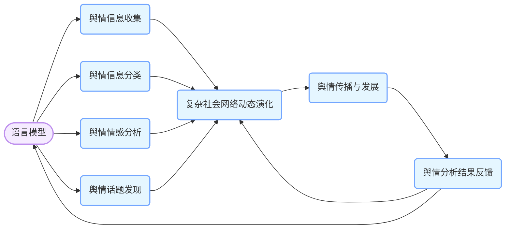

# 语言模型在复杂社会网络动态演化与舆情分析中的应用

> 关键词：语言模型、复杂社会网络、动态演化、舆情分析、自然语言处理

> 摘要：本文深入探讨了语言模型在复杂社会网络动态演化与舆情分析中的应用。首先介绍了相关背景，包括研究的目的、预期读者等内容。接着阐述了语言模型、复杂社会网络动态演化以及舆情分析的核心概念与联系，并给出了相应的文本示意图和 Mermaid 流程图。详细讲解了语言模型在舆情分析等方面的核心算法原理，通过 Python 源代码进行具体说明，同时介绍了相关的数学模型和公式。在项目实战部分，提供了开发环境搭建、源代码实现与解读。还探讨了实际应用场景，推荐了学习资源、开发工具框架以及相关论文著作。最后总结了未来发展趋势与挑战，并给出常见问题解答和参考资料，旨在为相关领域的研究和实践提供全面且深入的指导。

## 1. 背景介绍 
### 1.1 目的和范围
随着互联网和社交媒体的飞速发展，社会网络变得日益复杂，信息传播速度极快且范围广泛。舆情作为社会情绪和公众意见的反映，对社会稳定、企业决策等方面都有着重要影响。本研究的目的在于深入探讨语言模型在复杂社会网络动态演化与舆情分析中的应用，通过利用语言模型强大的文本处理能力，更好地理解社会网络中信息的传播规律、公众的情绪倾向和意见表达，从而为舆情监测、预警和引导提供有效的技术支持。

本研究的范围涵盖了语言模型的基本原理和发展现状，复杂社会网络的结构特征和动态演化机制，舆情分析的主要任务和方法，以及语言模型在舆情分析各个环节的具体应用，包括舆情信息的收集、分类、情感分析、话题发现等。同时，还将通过实际案例分析来验证语言模型在复杂社会网络舆情分析中的有效性和实用性。

### 1.2 预期读者
本文的预期读者包括从事自然语言处理、社会网络分析、舆情研究等领域的科研人员和学者，他们可以从本文中获取语言模型在复杂社会网络与舆情分析方面的最新研究成果和技术方法，为进一步的研究提供参考。此外，还包括政府部门、企业的舆情监测与管理工作人员，他们可以通过本文了解如何利用语言模型提升舆情分析的效率和准确性，更好地应对社会舆论和市场动态。对于对人工智能和社会网络感兴趣的技术爱好者和学生，本文也提供了一个系统学习和了解相关知识的机会。

### 1.3 文档结构概述
本文共分为十个部分。第一部分为背景介绍，阐述了研究的目的、预期读者和文档结构概述，并给出了相关术语的定义和解释。第二部分介绍核心概念与联系，包括语言模型、复杂社会网络动态演化和舆情分析的基本概念、原理和它们之间的联系，同时给出文本示意图和 Mermaid 流程图。第三部分详细讲解核心算法原理和具体操作步骤，通过 Python 源代码对语言模型在舆情分析中的算法进行阐述。第四部分介绍数学模型和公式，并结合具体例子进行详细讲解。第五部分为项目实战，包括开发环境搭建、源代码实现和代码解读。第六部分探讨实际应用场景。第七部分推荐学习资源、开发工具框架和相关论文著作。第八部分总结未来发展趋势与挑战。第九部分为附录，解答常见问题。第十部分提供扩展阅读和参考资料。

### 1.4 术语表
#### 1.4.1 核心术语定义
- **语言模型**：是一种对自然语言文本进行概率建模的工具，它可以预测给定文本序列的下一个词或字符的概率分布，从而评估文本的合理性和生成新的文本。
- **复杂社会网络**：由大量的个体（如人、组织等）通过各种关系（如社交关系、信息传播关系等）相互连接而形成的网络，具有复杂的结构和动态演化特性。
- **动态演化**：指复杂社会网络的结构、节点属性和边的关系随时间不断变化的过程。
- **舆情分析**：对社会公众关于某一特定事件、话题或对象的情绪、态度、意见和行为倾向等信息进行收集、整理、分析和研判的过程。

#### 1.4.2 相关概念解释
- **自然语言处理（NLP）**：是计算机科学与人工智能领域的一个重要分支，主要研究如何让计算机理解、处理和生成自然语言，语言模型是自然语言处理中的关键技术之一。
- **图论**：是研究图的结构、性质和应用的数学分支，复杂社会网络可以用图来表示，图论中的相关概念和方法可以用于分析复杂社会网络的结构和演化。
- **机器学习**：是一门多领域交叉学科，涉及概率论、统计学、逼近论、凸分析、算法复杂度理论等多门学科。它专门研究计算机怎样模拟或实现人类的学习行为，以获取新的知识或技能，重新组织已有的知识结构使之不断改善自身的性能。语言模型的训练通常基于机器学习算法。

#### 1.4.3 缩略词列表
- **NLP**：Natural Language Processing（自然语言处理）
- **RNN**：Recurrent Neural Network（循环神经网络）
- **LSTM**：Long Short - Term Memory（长短期记忆网络）
- **GRU**：Gated Recurrent Unit（门控循环单元）
- **BERT**：Bidirectional Encoder Representations from Transformers（基于变换器的双向编码器表示）

## 2. 核心概念与联系 
### 2.1 语言模型
语言模型的基本原理是基于概率论，通过对大量文本数据的学习，估计文本序列的概率分布。常见的语言模型包括基于统计的 n - 元语法模型和基于深度学习的神经网络语言模型。

n - 元语法模型假设一个词的出现只与它前面的 n - 1 个词有关，其概率计算公式为：$P(w_i|w_1^{i - 1})\approx P(w_i|w_{i - n + 1}^{i - 1})$ ，其中 $w_i$ 表示第 $i$ 个词，$w_1^{i - 1}$ 表示从第 1 个词到第 $i - 1$ 个词的序列。

基于深度学习的神经网络语言模型，如 RNN、LSTM、GRU 和 BERT 等，通过神经网络的强大学习能力来捕捉文本中的语义和上下文信息。以 RNN 为例，它的基本结构可以用以下公式表示：
$h_t = \sigma(W_{hh}h_{t - 1}+W_{xh}x_t + b_h)$
$y_t = W_{hy}h_t + b_y$
其中 $h_t$ 是隐藏层状态，$x_t$ 是输入层的词向量，$W_{hh}$、$W_{xh}$、$W_{hy}$ 是权重矩阵，$b_h$、$b_y$ 是偏置项，$\sigma$ 是激活函数。

### 2.2 复杂社会网络动态演化
复杂社会网络可以用图 $G=(V, E)$ 来表示，其中 $V$ 是节点集合，代表网络中的个体；$E$ 是边集合，代表个体之间的关系。复杂社会网络的动态演化包括节点的加入和退出、边的建立和删除以及节点属性的变化等。

节点的加入和退出会改变网络的规模和结构。例如，在社交媒体网络中，新用户的注册相当于节点的加入，用户的注销则相当于节点的退出。边的建立和删除反映了个体之间关系的变化，如在社交网络中，用户之间的关注和取消关注操作。节点属性的变化可以包括用户的兴趣爱好、情绪状态等的改变。

### 2.3 舆情分析
舆情分析的主要任务包括舆情信息的收集、分类、情感分析、话题发现等。舆情信息的收集可以通过网络爬虫等技术从社交媒体、新闻网站等渠道获取。分类是将收集到的舆情信息按照不同的主题、来源等进行划分。情感分析是判断舆情信息中所表达的情感倾向，如积极、消极或中性。话题发现是从大量的舆情信息中提取出热点话题和关键信息。

### 2.4 核心概念联系
语言模型在复杂社会网络动态演化与舆情分析中起着关键作用。在舆情信息收集阶段，语言模型可以用于筛选和过滤有价值的信息，提高信息收集的效率和准确性。在分类和话题发现中，语言模型可以通过对文本的语义理解，将相似的信息归为同一类别或话题。在情感分析方面，语言模型可以学习文本中的情感表达模式，准确判断情感倾向。

同时，复杂社会网络的动态演化会影响舆情的传播和发展。例如，新节点的加入可能会带来新的舆情信息和观点，边的变化会改变信息的传播路径和范围。而舆情分析的结果又可以反馈到复杂社会网络的研究中，帮助我们更好地理解网络中个体的行为和关系。

### 2.5 文本示意图
语言模型、复杂社会网络动态演化和舆情分析的关系可以用以下文本示意图表示：

语言模型作为核心技术，贯穿于舆情分析的各个环节。舆情分析的结果反映了复杂社会网络中个体的意见和情绪，而复杂社会网络的动态演化又会影响舆情的产生和传播。它们之间相互作用、相互影响，形成一个有机的整体。

### 2.6 Mermaid 流程图


## 3. 核心算法原理 & 具体操作步骤 
### 3.1 舆情信息收集算法
在舆情信息收集中，可以使用网络爬虫技术。以下是一个简单的 Python 爬虫示例，使用 `requests` 和 `BeautifulSoup` 库来爬取新闻网站的文章标题和内容：

```python
import requests
from bs4 import BeautifulSoup

def get_news(url):
    try:
        response = requests.get(url)
        response.raise_for_status()
        response.encoding = response.apparent_encoding
        soup = BeautifulSoup(response.text, 'html.parser')
        title = soup.find('h1').text
        content = ''.join([p.text for p in soup.find_all('p')])
        return title, content
    except Exception as e:
        print(f"Error: {e}")
        return None, None

url = 'https://example.com/news/article'
title, content = get_news(url)
if title and content:
    print(f"Title: {title}")
    print(f"Content: {content}")
```

### 3.2 舆情信息分类算法
可以使用朴素贝叶斯分类器对舆情信息进行分类。以下是一个使用 `sklearn` 库实现的简单示例：

```python
from sklearn.feature_extraction.text import CountVectorizer
from sklearn.naive_bayes import MultinomialNB
from sklearn.model_selection import train_test_split
from sklearn.metrics import accuracy_score

# 示例数据
corpus = [
    "这是一条关于科技的新闻",
    "体育赛事取得了圆满成功",
    "经济形势一片大好",
    "娱乐明星又有新动态"
]
labels = ["科技", "体育", "经济", "娱乐"]

# 特征提取
vectorizer = CountVectorizer()
X = vectorizer.fit_transform(corpus)

# 划分训练集和测试集
X_train, X_test, y_train, y_test = train_test_split(X, labels, test_size=0.2, random_state=42)

# 训练模型
clf = MultinomialNB()
clf.fit(X_train, y_train)

# 预测
y_pred = clf.predict(X_test)

# 评估模型
accuracy = accuracy_score(y_test, y_pred)
print(f"Accuracy: {accuracy}")
```

### 3.3 舆情情感分析算法
可以使用基于预训练语言模型的方法进行情感分析。以下是一个使用 `transformers` 库和 BERT 模型的示例：

```python
from transformers import AutoTokenizer, AutoModelForSequenceClassification
import torch

# 加载预训练模型和分词器
tokenizer = AutoTokenizer.from_pretrained('bert-base-chinese')
model = AutoModelForSequenceClassification.from_pretrained('bert-base-chinese', num_labels=3)

# 示例文本
text = "这个产品真的太棒了，我非常喜欢！"

# 分词
inputs = tokenizer(text, return_tensors='pt')

# 预测
with torch.no_grad():
    outputs = model(**inputs)
    logits = outputs.logits
    predicted_class_id = logits.argmax().item()

# 定义情感标签
labels = ["消极", "中性", "积极"]
print(f"Sentiment: {labels[predicted_class_id]}")
```

### 3.4 舆情话题发现算法
可以使用 LDA（Latent Dirichlet Allocation）主题模型进行话题发现。以下是一个使用 `gensim` 库实现的示例：

```python
from gensim import corpora, models
from nltk.tokenize import word_tokenize
import nltk
nltk.download('punkt')

# 示例文本
documents = [
    "科技公司不断推出新的产品和技术",
    "体育赛事吸引了大量观众的关注",
    "经济发展是当前的重要任务",
    "娱乐行业充满了各种八卦和新闻"
]

# 分词
texts = [[word for word in word_tokenize(doc)] for doc in documents]

# 创建词典
dictionary = corpora.Dictionary(texts)

# 创建语料库
corpus = [dictionary.doc2bow(text) for text in texts]

# 训练 LDA 模型
lda_model = models.LdaModel(corpus=corpus,
                            id2word=dictionary,
                            num_topics=4,
                            random_state=100,
                            update_every=1,
                            chunksize=100,
                            passes=10,
                            alpha='auto',
                            per_word_topics=True)

# 打印话题
for idx, topic in lda_model.print_topics(-1):
    print(f"Topic: {idx} \nWords: {topic}")
```

## 4. 数学模型和公式 & 详细讲解 & 举例说明 
### 4.1 朴素贝叶斯分类器数学模型
朴素贝叶斯分类器基于贝叶斯定理，其基本公式为：
$P(c|x)=\frac{P(x|c)P(c)}{P(x)}$
其中 $P(c|x)$ 是在给定特征 $x$ 的情况下类别 $c$ 的后验概率，$P(x|c)$ 是在类别 $c$ 下特征 $x$ 的似然概率，$P(c)$ 是类别 $c$ 的先验概率，$P(x)$ 是特征 $x$ 的概率。

在朴素贝叶斯分类器中，假设特征之间是相互独立的，即：
$P(x|c)=\prod_{i = 1}^{n}P(x_i|c)$
其中 $x=(x_1,x_2,\cdots,x_n)$ 是特征向量。

在舆情信息分类中，$c$ 可以表示不同的舆情类别（如科技、体育、经济等），$x$ 可以表示舆情信息的文本特征（如词频、词向量等）。

举例说明：假设有两个类别 $c_1$（科技）和 $c_2$（体育），一篇舆情文章的特征向量 $x$ 包含一些关键词。通过训练数据可以估计出 $P(c_1)$、$P(c_2)$、$P(x|c_1)$ 和 $P(x|c_2)$，然后根据贝叶斯公式计算 $P(c_1|x)$ 和 $P(c_2|x)$，将文章分类到后验概率较大的类别中。

### 4.2 LDA 主题模型数学模型
LDA 主题模型基于概率图模型，其核心思想是每个文档可以表示为一个主题的概率分布，每个主题可以表示为一个词的概率分布。

LDA 模型的生成过程如下：
1. 对于每个主题 $k$，从狄利克雷分布 $\theta_k\sim Dir(\alpha)$ 中采样一个主题分布 $\theta_k$。
2. 对于每个词 $w_{ij}$ 在文档 $d_i$ 中：
    - 从多项式分布 $z_{ij}\sim Mult(\theta_{d_i})$ 中采样一个主题 $z_{ij}$。
    - 从多项式分布 $w_{ij}\sim Mult(\varphi_{z_{ij}})$ 中采样一个词 $w_{ij}$，其中 $\varphi_{z_{ij}}$ 是主题 $z_{ij}$ 下的词分布。

LDA 模型的目标是通过最大化似然函数来估计模型参数 $\alpha$ 和 $\varphi$。

举例说明：假设有一组舆情文档，LDA 模型可以将这些文档分为不同的主题，如科技、体育、娱乐等。每个主题下有一些关键词，如科技主题下可能有“人工智能”、“大数据”等关键词。通过分析文档中主题的分布，可以发现舆情的热点话题。

### 4.3 基于预训练语言模型的情感分析数学模型
基于预训练语言模型的情感分析通常使用分类器对模型的输出进行分类。假设预训练语言模型的输出为 $h$，分类器的权重矩阵为 $W$ 和偏置项为 $b$，则分类器的输出为：
$y = softmax(Wh + b)$
其中 $softmax$ 是激活函数，用于将输出转换为概率分布。

在舆情情感分析中，$y$ 表示不同情感类别的概率，如消极、中性、积极。通过选择概率最大的类别作为预测结果。

举例说明：对于一篇舆情文章，经过预训练语言模型处理后得到特征向量 $h$，然后通过分类器计算得到不同情感类别的概率。如果积极情感的概率最大，则认为这篇文章表达的是积极情感。

## 5. 项目实战：代码实际案例和详细解释说明 
### 5.1  开发环境搭建
#### 5.1.1 安装 Python
首先需要安装 Python 环境，建议使用 Python 3.7 及以上版本。可以从 Python 官方网站（https://www.python.org/downloads/） 下载并安装。

#### 5.1.2 安装必要的库
使用 `pip` 命令安装项目所需的库，如 `requests`、`beautifulsoup4`、`sklearn`、`transformers`、`gensim`、`torch` 等。示例命令如下：
```sh
pip install requests beautifulsoup4 scikit-learn transformers gensim torch
```

### 5.2  源代码详细实现和代码解读
#### 5.2.1 舆情信息收集模块
```python
import requests
from bs4 import BeautifulSoup

def get_news(url):
    try:
        # 发送 HTTP 请求
        response = requests.get(url)
        # 检查请求是否成功
        response.raise_for_status()
        # 设置编码
        response.encoding = response.apparent_encoding
        # 使用 BeautifulSoup 解析 HTML 内容
        soup = BeautifulSoup(response.text, 'html.parser')
        # 提取文章标题
        title = soup.find('h1').text
        # 提取文章内容
        content = ''.join([p.text for p in soup.find_all('p')])
        return title, content
    except Exception as e:
        print(f"Error: {e}")
        return None, None

url = 'https://example.com/news/article'
title, content = get_news(url)
if title and content:
    print(f"Title: {title}")
    print(f"Content: {content}")
```
代码解读：首先使用 `requests` 库发送 HTTP 请求获取网页内容，然后使用 `BeautifulSoup` 库解析 HTML 内容，提取文章的标题和内容。如果请求过程中出现异常，会捕获异常并打印错误信息。

#### 5.2.2 舆情信息分类模块
```python
from sklearn.feature_extraction.text import CountVectorizer
from sklearn.naive_bayes import MultinomialNB
from sklearn.model_selection import train_test_split
from sklearn.metrics import accuracy_score

# 示例数据
corpus = [
    "这是一条关于科技的新闻",
    "体育赛事取得了圆满成功",
    "经济形势一片大好",
    "娱乐明星又有新动态"
]
labels = ["科技", "体育", "经济", "娱乐"]

# 特征提取
vectorizer = CountVectorizer()
X = vectorizer.fit_transform(corpus)

# 划分训练集和测试集
X_train, X_test, y_train, y_test = train_test_split(X, labels, test_size=0.2, random_state=42)

# 训练模型
clf = MultinomialNB()
clf.fit(X_train, y_train)

# 预测
y_pred = clf.predict(X_test)

# 评估模型
accuracy = accuracy_score(y_test, y_pred)
print(f"Accuracy: {accuracy}")
```
代码解读：使用 `CountVectorizer` 对文本数据进行特征提取，将文本转换为词频矩阵。然后使用 `train_test_split` 函数将数据划分为训练集和测试集。使用 `MultinomialNB` 训练朴素贝叶斯分类器，对测试集进行预测，并使用 `accuracy_score` 函数评估模型的准确率。

#### 5.2.3 舆情情感分析模块
```python
from transformers import AutoTokenizer, AutoModelForSequenceClassification
import torch

# 加载预训练模型和分词器
tokenizer = AutoTokenizer.from_pretrained('bert-base-chinese')
model = AutoModelForSequenceClassification.from_pretrained('bert-base-chinese', num_labels=3)

# 示例文本
text = "这个产品真的太棒了，我非常喜欢！"

# 分词
inputs = tokenizer(text, return_tensors='pt')

# 预测
with torch.no_grad():
    outputs = model(**inputs)
    logits = outputs.logits
    predicted_class_id = logits.argmax().item()

# 定义情感标签
labels = ["消极", "中性", "积极"]
print(f"Sentiment: {labels[predicted_class_id]}")
```
代码解读：使用 `transformers` 库加载预训练的 BERT 模型和分词器。对输入文本进行分词处理，然后将分词结果输入到模型中进行预测。通过 `argmax` 函数获取预测结果的类别索引，最后根据类别索引输出对应的情感标签。

#### 5.2.4 舆情话题发现模块
```python
from gensim import corpora, models
from nltk.tokenize import word_tokenize
import nltk
nltk.download('punkt')

# 示例文本
documents = [
    "科技公司不断推出新的产品和技术",
    "体育赛事吸引了大量观众的关注",
    "经济发展是当前的重要任务",
    "娱乐行业充满了各种八卦和新闻"
]

# 分词
texts = [[word for word in word_tokenize(doc)] for doc in documents]

# 创建词典
dictionary = corpora.Dictionary(texts)

# 创建语料库
corpus = [dictionary.doc2bow(text) for text in texts]

# 训练 LDA 模型
lda_model = models.LdaModel(corpus=corpus,
                            id2word=dictionary,
                            num_topics=4,
                            random_state=100,
                            update_every=1,
                            chunksize=100,
                            passes=10,
                            alpha='auto',
                            per_word_topics=True)

# 打印话题
for idx, topic in lda_model.print_topics(-1):
    print(f"Topic: {idx} \nWords: {topic}")
```
代码解读：使用 `nltk` 库的 `word_tokenize` 函数对文本进行分词处理。使用 `gensim` 库的 `corpora.Dictionary` 函数创建词典，将分词后的文本转换为词袋表示的语料库。然后使用 `LdaModel` 训练 LDA 主题模型，最后打印出每个主题的关键词。

### 5.3  代码解读与分析
#### 5.3.1 舆情信息收集模块
该模块的优点是实现简单，能够快速获取网页上的舆情信息。缺点是对于不同的网站，HTML 结构可能不同，需要根据具体情况调整提取规则。同时，频繁的请求可能会被网站的反爬虫机制拦截。

#### 5.3.2 舆情信息分类模块
朴素贝叶斯分类器的优点是训练速度快，对小规模数据有较好的效果。缺点是假设特征之间相互独立，在实际应用中可能不符合实际情况，导致分类准确率不高。

#### 5.3.3 舆情情感分析模块
基于预训练语言模型的情感分析方法能够捕捉文本中的语义信息，具有较高的准确率。但缺点是模型较大，需要较高的计算资源和内存，训练和推理速度较慢。

#### 5.3.4 舆情话题发现模块
LDA 主题模型能够自动发现文本中的潜在话题，不需要人工标注数据。但缺点是主题的解释性较差，需要人工进行一定的调整和分析。

## 6. 实际应用场景 
### 6.1 政府部门舆情监测与管理
政府部门可以利用语言模型对社交媒体、新闻网站等渠道的舆情信息进行实时监测和分析。通过舆情信息分类，了解不同领域的舆情动态，如民生、经济、环保等。通过情感分析，及时发现公众的负面情绪和意见，采取相应的措施进行引导和解决。例如，在重大政策发布后，通过舆情分析了解公众的反应和关注点，为政策的调整和完善提供参考。

### 6.2 企业市场调研与品牌管理
企业可以利用语言模型对市场舆情进行分析，了解消费者对产品和品牌的评价和需求。通过话题发现，找出市场的热点和趋势，为产品的研发和推广提供方向。例如，通过分析社交媒体上的用户评论，了解消费者对某款手机的优缺点评价，及时改进产品。同时，通过情感分析监测品牌形象，及时处理负面舆情，维护品牌声誉。

### 6.3 媒体机构内容创作与传播
媒体机构可以利用语言模型对舆情信息进行挖掘和分析，发现有价值的新闻线索和话题。通过舆情信息分类，为不同的受众群体提供个性化的新闻内容。例如，根据用户的兴趣爱好，推送相关领域的新闻报道。同时，通过情感分析了解公众对新闻事件的态度和反应，优化新闻报道的方式和角度，提高新闻的传播效果。

### 6.4 社会事件研究与预测
研究机构可以利用语言模型对复杂社会网络中的舆情信息进行分析，研究社会事件的发展规律和趋势。通过对舆情信息的动态监测和分析，预测社会事件的发生和发展，为社会管理和决策提供科学依据。例如，在公共卫生事件期间，通过分析舆情信息了解公众的恐慌情绪和行为倾向，制定相应的防控措施。

## 7. 工具和资源推荐
### 7.1 学习资源推荐
#### 7.1.1 书籍推荐
- 《自然语言处理入门》：作者何晗，这本书系统地介绍了自然语言处理的基本概念、方法和技术，适合初学者入门。
- 《深度学习》：作者 Ian Goodfellow、Yoshua Bengio 和 Aaron Courville，这本书是深度学习领域的经典著作，对语言模型等深度学习技术有深入的讲解。
- 《社会网络分析》：作者林聚任，这本书介绍了社会网络分析的基本理论、方法和应用，有助于理解复杂社会网络的结构和演化。

#### 7.1.2 在线课程
- Coursera 上的“Natural Language Processing Specialization”：由斯坦福大学的教授授课，涵盖了自然语言处理的各个方面，包括语言模型、情感分析等内容。
- edX 上的“Deep Learning for Natural Language Processing”：介绍了深度学习在自然语言处理中的应用，包括 RNN、LSTM、Transformer 等模型。
- 中国大学 MOOC 上的“社会网络分析”：由国内高校的教师授课，讲解了社会网络分析的基本原理和方法。

#### 7.1.3 技术博客和网站
- Medium 上的“Towards Data Science”：有很多关于自然语言处理、机器学习等领域的技术文章和案例分享。
- 机器之心：提供人工智能领域的最新技术动态和研究成果。
- 开源中国：有很多关于软件开发、技术应用等方面的文章和资源。

### 7.2 开发工具框架推荐
#### 7.2.1 IDE和编辑器
- PyCharm：是一款专业的 Python 集成开发环境，具有代码编辑、调试、自动补全、版本控制等功能，适合 Python 开发。
- Visual Studio Code：是一款轻量级的代码编辑器，支持多种编程语言，有丰富的插件扩展功能，可以满足不同的开发需求。

#### 7.2.2 调试和性能分析工具
- PDB：Python 自带的调试工具，可以帮助开发者定位代码中的问题。
- Py-Spy：用于分析 Python 程序的性能瓶颈，找出耗时的函数和代码段。

#### 7.2.3 相关框架和库
- TensorFlow：是一个开源的机器学习框架，提供了丰富的工具和接口，可用于开发和训练语言模型等机器学习模型。
- PyTorch：是另一个流行的深度学习框架，具有动态图的特点，易于使用和调试，在自然语言处理领域有广泛的应用。
- NLTK：是一个自然语言处理工具包，提供了很多自然语言处理的功能，如分词、词性标注、命名实体识别等。

### 7.3 相关论文著作推荐
#### 7.3.1 经典论文
- “Attention Is All You Need”：介绍了 Transformer 模型，是自然语言处理领域的重要突破，为 BERT 等语言模型的发展奠定了基础。
- “Long Short - Term Memory”：提出了 LSTM 网络，解决了传统 RNN 存在的梯度消失和梯度爆炸问题，在序列数据处理中取得了很好的效果。
- “Latent Dirichlet Allocation”：提出了 LDA 主题模型，为文本挖掘和话题发现提供了一种有效的方法。

#### 7.3.2 最新研究成果
可以关注 ACL（Association for Computational Linguistics）、EMNLP（Conference on Empirical Methods in Natural Language Processing）等自然语言处理领域的顶级学术会议，了解最新的研究成果和技术发展趋势。

#### 7.3.3 应用案例分析
- 可以查看一些政府部门、企业的舆情分析报告和案例，了解语言模型在实际应用中的效果和经验。
- 一些学术期刊上也会发表关于语言模型在舆情分析等领域的应用案例研究，如《情报学报》《管理科学学报》等。

## 8. 总结：未来发展趋势与挑战
### 8.1 未来发展趋势
#### 8.1.1 多模态融合
未来的语言模型将不仅仅局限于文本处理，还会与图像、音频等多模态信息进行融合。例如，在舆情分析中，可以结合社交媒体上的图片和视频信息，更全面地了解公众的情绪和意见。

#### 8.1.2 个性化舆情分析
随着用户数据的不断积累和分析技术的发展，舆情分析将更加注重个性化。根据不同用户的兴趣、偏好和历史行为，为用户提供个性化的舆情信息和分析结果。

#### 8.1.3 实时动态分析
复杂社会网络的动态演化速度越来越快，舆情信息也在不断更新。未来的语言模型将具备更强的实时处理能力，能够实时监测和分析舆情的动态变化，及时发出预警。

#### 8.1.4 跨语言舆情分析
随着全球化的发展，跨语言的信息传播越来越频繁。未来的语言模型将支持多种语言的舆情分析，能够处理不同语言背景下的舆情信息。

### 8.2 挑战
#### 8.2.1 数据质量和隐私问题
语言模型的训练和应用需要大量的数据，但数据质量参差不齐，存在噪声、虚假信息等问题。同时，舆情信息往往涉及用户的隐私，如何在保证数据质量的前提下，保护用户的隐私是一个重要的挑战。

#### 8.2.2 计算资源和效率问题
一些先进的语言模型，如大型预训练语言模型，需要大量的计算资源和时间进行训练和推理。如何在有限的计算资源下，提高模型的效率和性能是一个亟待解决的问题。

#### 8.2.3 语义理解和情感分析的准确性
虽然语言模型在语义理解和情感分析方面取得了很大的进展，但仍然存在一些问题。例如，对于一些隐晦、复杂的语言表达，模型的理解和分析能力还不够准确。如何提高语义理解和情感分析的准确性是未来的一个重要研究方向。

#### 8.2.4 复杂社会网络动态建模
复杂社会网络的动态演化机制非常复杂，目前的建模方法还存在一定的局限性。如何更准确地建模复杂社会网络的动态演化，以及如何将语言模型与复杂社会网络模型更好地结合起来，是一个具有挑战性的问题。

## 9. 附录：常见问题与解答
### 9.1 如何选择合适的语言模型进行舆情分析？
选择合适的语言模型需要考虑多个因素，如数据规模、任务复杂度、计算资源等。如果数据规模较小，可以选择一些轻量级的语言模型，如朴素贝叶斯分类器。如果数据规模较大，且任务复杂，可以选择基于深度学习的语言模型，如 BERT、GPT 等。同时，还需要考虑计算资源的限制，选择适合自己硬件环境的模型。

### 9.2 如何处理舆情信息中的噪声和虚假信息？
可以采用多种方法处理舆情信息中的噪声和虚假信息。例如，使用数据清洗技术去除重复、无意义的信息；使用机器学习算法对信息进行分类和筛选，识别出虚假信息；结合多源数据进行验证和比对，提高信息的可信度。

### 9.3 如何提高舆情分析的实时性？
可以采用以下方法提高舆情分析的实时性：使用分布式计算和并行处理技术，提高数据处理和模型推理的速度；优化数据采集和传输机制，减少数据延迟；使用流式计算框架，对实时数据进行实时处理和分析。

### 9.4 如何评估语言模型在舆情分析中的效果？
可以使用多种指标评估语言模型在舆情分析中的效果，如准确率、召回率、F1 值等。对于情感分析任务，可以使用混淆矩阵、ROC 曲线等方法进行评估。同时，还可以通过人工标注和用户反馈等方式，对模型的效果进行主观评估。

## 10. 扩展阅读 & 参考资料
### 10.1 扩展阅读
- 《人工智能时代的舆情管理》：深入探讨了人工智能技术在舆情管理中的应用和发展趋势。
- 《复杂网络与社会动力学》：介绍了复杂网络的基本理论和社会动力学的相关知识，有助于理解复杂社会网络的动态演化。

### 10.2 参考资料
- 相关学术论文和研究报告，如 ACL、EMNLP 等会议的论文。
- 相关的开源代码和数据集，如 Hugging Face 的 Transformers 库、GLUE 数据集等。
- 相关的技术文档和官方网站，如 TensorFlow、PyTorch 的官方文档。