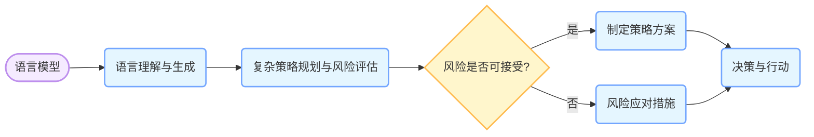

# 语言模型在复杂策略规划与风险评估中的前沿应用研究

> 关键词：语言模型、复杂策略规划、风险评估、自然语言处理、人工智能、机器学习、决策支持

> 摘要：本文聚焦于语言模型在复杂策略规划与风险评估领域的前沿应用。首先介绍了相关背景，包括研究目的、预期读者等内容。接着阐述了语言模型、复杂策略规划和风险评估的核心概念及相互联系，给出了原理和架构的文本示意图与 Mermaid 流程图。详细讲解了核心算法原理，并使用 Python 源代码进行说明，同时给出了数学模型和公式并举例。通过项目实战展示了代码的实际案例及详细解释。探讨了语言模型在不同场景下的实际应用，推荐了相关的学习资源、开发工具框架和论文著作。最后总结了未来发展趋势与挑战，解答了常见问题，并提供了扩展阅读和参考资料，旨在全面深入地探讨语言模型在复杂策略规划与风险评估中的应用。

## 1. 背景介绍 
### 1.1 目的和范围
在当今复杂多变的社会经济环境中，无论是企业制定发展战略、政府进行政策规划，还是金融机构评估风险等，都面临着海量信息和复杂情况的挑战。语言模型作为自然语言处理领域的重要技术，具有强大的语言理解和生成能力。本研究的目的在于探索语言模型如何在复杂策略规划与风险评估中发挥作用，提高决策的科学性和准确性。

研究范围涵盖了语言模型在不同行业和领域中的应用，包括但不限于金融、医疗、交通、能源等。同时，研究不仅关注语言模型在策略规划和风险评估中的具体应用方法，还探讨其背后的算法原理、数学模型以及实际应用中可能面临的问题和挑战。

### 1.2 预期读者
本文预期读者包括自然语言处理、人工智能、机器学习等领域的研究人员和学者，他们可以从本文中获取语言模型在复杂策略规划与风险评估方面的最新研究成果和技术趋势；也适合企业的战略规划师、风险评估师等专业人士，帮助他们了解如何利用语言模型提升工作效率和决策质量；此外，对人工智能应用感兴趣的广大技术爱好者也能通过本文了解语言模型的实际应用场景和价值。

### 1.3 文档结构概述
本文首先介绍了研究的背景信息，包括目的、范围、预期读者等内容。接着详细阐述了语言模型、复杂策略规划和风险评估的核心概念及它们之间的联系，并给出了相应的原理和架构示意图。然后深入讲解了核心算法原理，使用 Python 源代码进行具体说明，同时给出了相关的数学模型和公式并举例。通过项目实战展示了代码的实际应用案例和详细解释。探讨了语言模型在不同场景下的实际应用。推荐了相关的学习资源、开发工具框架和论文著作。最后总结了未来发展趋势与挑战，解答了常见问题，并提供了扩展阅读和参考资料。

### 1.4 术语表
#### 1.4.1 核心术语定义
- **语言模型**：是一种对自然语言文本进行建模的概率模型，用于预测给定上下文下下一个词或字符的概率分布。它可以学习语言的语法、语义和统计规律，从而生成自然流畅的文本。
- **复杂策略规划**：指在复杂多变的环境中，为实现特定目标而制定的一系列相互关联的行动方案和决策过程。这些方案需要考虑多种因素，如市场动态、竞争对手、资源限制等。
- **风险评估**：是对可能影响目标实现的不确定性因素进行识别、分析和评价的过程。通过风险评估，可以确定风险的可能性和影响程度，为制定风险应对策略提供依据。

#### 1.4.2 相关概念解释
- **自然语言处理（NLP）**：是人工智能领域的一个重要分支，主要研究如何让计算机理解、处理和生成自然语言。语言模型是自然语言处理中的核心技术之一。
- **机器学习**：是一门多领域交叉学科，涉及概率论、统计学、逼近论、凸分析、算法复杂度理论等多门学科。它专门研究计算机怎样模拟或实现人类的学习行为，以获取新的知识或技能，重新组织已有的知识结构使之不断改善自身的性能。
- **深度学习**：是机器学习的一个分支领域，它是一种基于对数据进行表征学习的方法。深度学习通过构建具有多个层次的神经网络模型，自动从大量数据中学习特征和模式。

#### 1.4.3 缩略词列表
- **NLP**：自然语言处理（Natural Language Processing）
- **ML**：机器学习（Machine Learning）
- **DL**：深度学习（Deep Learning）

## 2. 核心概念与联系 

### 核心概念原理
#### 语言模型原理
语言模型的核心思想是对语言的概率分布进行建模。给定一个文本序列 $w_1, w_2, \cdots, w_n$，语言模型的目标是计算该序列出现的概率 $P(w_1, w_2, \cdots, w_n)$。根据链式法则，该概率可以分解为：

$$P(w_1, w_2, \cdots, w_n) = P(w_1)P(w_2|w_1)P(w_3|w_1, w_2) \cdots P(w_n|w_1, w_2, \cdots, w_{n-1})$$

在实际应用中，由于计算 $P(w_n|w_1, w_2, \cdots, w_{n-1})$ 的复杂度较高，通常采用 $n$-gram 模型或神经网络模型进行近似计算。

- **$n$-gram 模型**：假设一个词的出现只依赖于其前面的 $n-1$ 个词，即：

$$P(w_n|w_1, w_2, \cdots, w_{n-1}) \approx P(w_n|w_{n-(n-1)}, \cdots, w_{n-1})$$

例如，在二元语法（$n = 2$）模型中，$P(w_n|w_1, w_2, \cdots, w_{n-1}) \approx P(w_n|w_{n-1})$。

- **神经网络语言模型**：如循环神经网络（RNN）、长短期记忆网络（LSTM）和门控循环单元（GRU）等，通过学习文本序列中的上下文信息来预测下一个词的概率。近年来，基于Transformer架构的语言模型，如GPT、BERT等，取得了显著的效果。

#### 复杂策略规划原理
复杂策略规划是一个系统性的过程，通常包括以下几个步骤：
1. **目标设定**：明确规划的目标和愿景，确定要实现的具体指标和成果。
2. **环境分析**：对内部和外部环境进行全面分析，包括市场趋势、竞争对手、政策法规、技术发展等因素。
3. **策略制定**：根据目标和环境分析结果，制定多种可能的策略方案。
4. **方案评估**：对不同的策略方案进行评估和比较，考虑其可行性、有效性、风险等因素。
5. **决策选择**：从评估后的方案中选择最优的策略方案。
6. **实施与监控**：将选定的策略方案付诸实施，并对实施过程进行监控和调整。

#### 风险评估原理
风险评估的主要步骤包括：
1. **风险识别**：通过各种方法，如头脑风暴、问卷调查、历史数据分析等，识别可能影响目标实现的风险因素。
2. **风险分析**：对识别出的风险因素进行定性和定量分析，确定其发生的可能性和影响程度。
3. **风险评价**：根据风险分析结果，对风险进行排序和评价，确定风险的优先级。
4. **风险应对**：根据风险评价结果，制定相应的风险应对策略，如风险规避、风险减轻、风险转移、风险接受等。

### 架构的文本示意图
```plaintext
+----------------------+
|      语言模型       |
| (Transformer架构等) |
+----------------------+
           |
           |  语言理解与生成
           v
+----------------------+
| 复杂策略规划与风险评估 |
|  (目标设定、环境分析  |
|   风险识别、分析等)  |
+----------------------+
           |
           |  决策支持
           v
+----------------------+
|      决策与行动      |
+----------------------+
```

### Mermaid 流程图


## 3. 核心算法原理 & 具体操作步骤 

### 语言模型核心算法原理 - Transformer 架构
Transformer 架构是一种基于注意力机制的深度学习模型，主要由编码器（Encoder）和解码器（Decoder）组成。

#### 编码器
编码器由多个相同的层堆叠而成，每层包含两个子层：多头自注意力机制（Multi-Head Self-Attention）和前馈神经网络（Feed-Forward Network）。

- **多头自注意力机制**：自注意力机制允许模型在处理每个位置的输入时，关注输入序列中的其他位置。多头自注意力机制则是将自注意力机制并行应用多次，以捕捉不同的注意力表示。

- **前馈神经网络**：由两个全连接层和一个非线性激活函数（如 ReLU）组成，用于对多头自注意力机制的输出进行进一步的变换。

#### 解码器
解码器也由多个相同的层堆叠而成，每层包含三个子层：多头自注意力机制、编码器 - 解码器注意力机制和前馈神经网络。

- **编码器 - 解码器注意力机制**：允许解码器在生成输出时，关注编码器的输出，从而获取输入序列的信息。

### Python 源代码实现
以下是一个使用 PyTorch 实现简单 Transformer 语言模型的示例代码：

```python
import torch
import torch.nn as nn
import torch.optim as optim

# 定义 Transformer 模型
class TransformerModel(nn.Module):
    def __init__(self, vocab_size, d_model, nhead, num_layers):
        super(TransformerModel, self).__init__()
        self.embedding = nn.Embedding(vocab_size, d_model)
        self.transformer_encoder = nn.TransformerEncoder(
            nn.TransformerEncoderLayer(d_model, nhead),
            num_layers
        )
        self.decoder = nn.Linear(d_model, vocab_size)

    def forward(self, src):
        src = self.embedding(src)
        output = self.transformer_encoder(src)
        output = self.decoder(output)
        return output

# 示例参数
vocab_size = 1000
d_model = 128
nhead = 4
num_layers = 2

# 创建模型实例
model = TransformerModel(vocab_size, d_model, nhead, num_layers)

# 定义损失函数和优化器
criterion = nn.CrossEntropyLoss()
optimizer = optim.Adam(model.parameters(), lr=0.001)

# 示例输入
input_sequence = torch.randint(0, vocab_size, (10, 32))  # 序列长度为 10，批量大小为 32

# 前向传播
output = model(input_sequence)

# 计算损失
target_sequence = torch.randint(0, vocab_size, (10, 32))
loss = criterion(output.view(-1, vocab_size), target_sequence.view(-1))

# 反向传播和优化
optimizer.zero_grad()
loss.backward()
optimizer.step()

print("Loss:", loss.item())
```

### 具体操作步骤
1. **数据准备**：收集和整理用于训练语言模型的文本数据，并进行预处理，如分词、构建词汇表等。
2. **模型定义**：根据需求定义 Transformer 模型的结构，包括词汇表大小、嵌入维度、头数、层数等参数。
3. **损失函数和优化器选择**：选择合适的损失函数（如交叉熵损失）和优化器（如 Adam 优化器）。
4. **训练模型**：将预处理后的数据输入到模型中进行训练，通过反向传播更新模型参数。
5. **模型评估**：使用验证集或测试集对训练好的模型进行评估，计算评估指标（如准确率、困惑度等）。
6. **应用模型**：将训练好的语言模型应用到复杂策略规划与风险评估任务中，如文本生成、文本分类等。

## 4. 数学模型和公式 & 详细讲解 & 举例说明 

### 语言模型的数学模型
#### 最大似然估计
在训练语言模型时，通常使用最大似然估计来估计模型的参数。给定一个训练数据集 $D = \{w^{(1)}, w^{(2)}, \cdots, w^{(N)}\}$，其中 $w^{(i)} = (w_1^{(i)}, w_2^{(i)}, \cdots, w_{n_i}^{(i)})$ 是第 $i$ 个文本序列，模型的似然函数为：

$$L(\theta) = \prod_{i=1}^{N} P(w^{(i)}|\theta)$$

其中 $\theta$ 是模型的参数。为了方便计算，通常对似然函数取对数，得到对数似然函数：

$$\log L(\theta) = \sum_{i=1}^{N} \log P(w^{(i)}|\theta)$$

最大似然估计的目标是找到使对数似然函数最大的参数 $\theta$，即：

$$\hat{\theta} = \arg \max_{\theta} \log L(\theta)$$

#### 交叉熵损失
在实际训练中，通常使用交叉熵损失来优化模型。交叉熵损失定义为：

$$H(p, q) = -\sum_{x} p(x) \log q(x)$$

其中 $p(x)$ 是真实概率分布，$q(x)$ 是模型预测的概率分布。在语言模型中，$p(x)$ 是真实的词分布，$q(x)$ 是模型预测的词分布。

### 复杂策略规划的数学模型
#### 多目标优化
在复杂策略规划中，通常需要考虑多个目标，如最大化收益、最小化成本、最小化风险等。可以使用多目标优化模型来求解最优策略。

假设有 $m$ 个目标函数 $f_1(x), f_2(x), \cdots, f_m(x)$，其中 $x$ 是决策变量。多目标优化问题可以表示为：

$$\min_{x \in X} [f_1(x), f_2(x), \cdots, f_m(x)]$$

其中 $X$ 是决策变量的可行域。常用的多目标优化方法包括加权法、约束法、目标规划法等。

### 风险评估的数学模型
#### 风险度量指标
常用的风险度量指标包括方差、标准差、风险价值（VaR）、条件风险价值（CVaR）等。

- **方差和标准差**：用于衡量随机变量的离散程度，反映了风险的大小。设随机变量 $X$ 的均值为 $\mu$，则方差定义为：

$$\text{Var}(X) = E[(X - \mu)^2]$$

标准差定义为方差的平方根：

$$\text{SD}(X) = \sqrt{\text{Var}(X)}$$

- **风险价值（VaR）**：是指在一定的置信水平下，某一金融资产或投资组合在未来特定时期内的最大可能损失。设 $X$ 是投资组合的损失随机变量，置信水平为 $\alpha$，则 VaR 定义为：

$$\text{VaR}_{\alpha} = \inf \{x \in \mathbb{R} : P(X \leq x) \geq \alpha\}$$

- **条件风险价值（CVaR）**：是指在一定的置信水平下，超过 VaR 的损失的期望值。设 $X$ 是投资组合的损失随机变量，置信水平为 $\alpha$，则 CVaR 定义为：

$$\text{CVaR}_{\alpha} = E[X|X \geq \text{VaR}_{\alpha}]$$

### 举例说明
#### 语言模型
假设有一个简单的语言模型，词汇表为 $\{a, b, c\}$。给定一个训练序列 $(a, b, c)$，模型预测的概率分布为 $P(a) = 0.3, P(b) = 0.5, P(c) = 0.2$。真实的概率分布为 $P(a) = 0.2, P(b) = 0.6, P(c) = 0.2$。则交叉熵损失为：

$$H(p, q) = -(0.2 \log 0.3 + 0.6 \log 0.5 + 0.2 \log 0.2) \approx 0.673$$

#### 复杂策略规划
假设有一个投资决策问题，需要考虑两个目标：最大化预期收益和最小化风险。设投资组合的预期收益为 $f_1(x)$，风险为 $f_2(x)$，其中 $x$ 是投资组合的权重向量。使用加权法将多目标优化问题转化为单目标优化问题：

$$\min_{x \in X} w_1 f_1(x) + w_2 f_2(x)$$

其中 $w_1$ 和 $w_2$ 是权重系数，满足 $w_1 + w_2 = 1$。

#### 风险评估
假设有一个投资组合，其损失随机变量 $X$ 服从正态分布 $N(0, 1)$。在置信水平 $\alpha = 0.95$ 下，VaR 为：

$$\text{VaR}_{0.95} = \Phi^{-1}(0.95) \approx 1.645$$

其中 $\Phi^{-1}$ 是标准正态分布的逆累积分布函数。CVaR 为：

$$\text{CVaR}_{0.95} = E[X|X \geq 1.645] \approx 2.063$$

## 5. 项目实战：代码实际案例和详细解释说明 

### 5.1  开发环境搭建
#### 安装 Python
首先，确保你已经安装了 Python 3.6 或更高版本。可以从 Python 官方网站（https://www.python.org/downloads/） 下载并安装适合你操作系统的 Python 版本。

#### 安装必要的库
在项目中，我们需要使用 PyTorch、transformers 等库。可以使用以下命令进行安装：

```sh
pip install torch
pip install transformers
```

### 5.2  源代码详细实现和代码解读
以下是一个使用预训练的语言模型（如 GPT-2）进行文本生成的示例代码，用于复杂策略规划中的情景模拟：

```python
from transformers import GPT2LMHeadModel, GPT2Tokenizer

# 加载预训练的 GPT-2 模型和分词器
model_name = "gpt2"
tokenizer = GPT2Tokenizer.from_pretrained(model_name)
model = GPT2LMHeadModel.from_pretrained(model_name)

# 定义输入文本
input_text = "在当前市场环境下，公司制定的发展策略是"

# 对输入文本进行编码
input_ids = tokenizer.encode(input_text, return_tensors="pt")

# 生成文本
output = model.generate(input_ids, max_length=100, num_beams=5, no_repeat_ngram_size=2, early_stopping=True)

# 解码生成的文本
generated_text = tokenizer.decode(output[0], skip_special_tokens=True)

print("生成的文本：", generated_text)
```

### 代码解读与分析
1. **加载预训练的模型和分词器**：使用 `transformers` 库的 `GPT2Tokenizer.from_pretrained` 和 `GPT2LMHeadModel.from_pretrained` 函数加载预训练的 GPT-2 模型和分词器。
2. **定义输入文本**：输入文本是复杂策略规划中的一个情景描述，用于引导模型生成相关的策略内容。
3. **编码输入文本**：使用分词器将输入文本编码为模型可以接受的输入 ID。
4. **生成文本**：使用模型的 `generate` 方法生成文本。`max_length` 参数指定生成文本的最大长度，`num_beams` 参数指定束搜索的束数，`no_repeat_ngram_size` 参数防止生成重复的 $n$-gram，`early_stopping` 参数在生成结束时停止搜索。
5. **解码生成的文本**：使用分词器将生成的 ID 序列解码为自然语言文本。

### 5.3  风险评估代码示例
以下是一个简单的风险评估代码示例，使用蒙特卡罗模拟方法计算投资组合的风险价值（VaR）和条件风险价值（CVaR）：

```python
import numpy as np

# 模拟投资组合的收益率
np.random.seed(0)
num_simulations = 10000
portfolio_returns = np.random.normal(0.05, 0.2, num_simulations)

# 计算损失
portfolio_losses = -portfolio_returns

# 置信水平
confidence_level = 0.95

# 计算 VaR
sorted_losses = np.sort(portfolio_losses)
var_index = int((1 - confidence_level) * num_simulations)
var = sorted_losses[var_index]

# 计算 CVaR
cvar = np.mean(sorted_losses[:var_index])

print("VaR (", confidence_level * 100, "%):", var)
print("CVaR (", confidence_level * 100, "%):", cvar)
```

### 代码解读与分析
1. **模拟投资组合的收益率**：使用 `numpy` 库的 `random.normal` 函数模拟投资组合的收益率，假设收益率服从正态分布。
2. **计算损失**：将收益率取负得到损失。
3. **确定置信水平**：设置置信水平为 0.95。
4. **计算 VaR**：对损失进行排序，找到对应置信水平的分位数，即为 VaR。
5. **计算 CVaR**：计算超过 VaR 的损失的平均值，即为 CVaR。

## 6. 实际应用场景 

### 金融领域
#### 投资决策
语言模型可以帮助分析师分析市场趋势、公司财报等文本信息，生成投资建议和策略。例如，通过分析新闻报道、研报等文本，预测股票价格走势，为投资者提供决策支持。

#### 风险管理
在风险评估方面，语言模型可以用于识别金融风险因素，如信用风险、市场风险等。通过对贷款申请人的文本信息（如信用报告、财务报表等）进行分析，评估其违约风险。同时，语言模型还可以用于压力测试情景的生成，帮助金融机构评估在不同市场条件下的风险承受能力。

### 医疗领域
#### 医疗决策支持
语言模型可以辅助医生进行诊断和治疗决策。通过分析患者的病历、症状描述等文本信息，生成可能的疾病诊断和治疗方案。例如，对于疑难病症，语言模型可以参考大量的医学文献和病例，为医生提供参考意见。

#### 医疗风险评估
在医疗风险评估方面，语言模型可以用于评估手术风险、药物不良反应等。通过分析患者的健康状况、手术记录、药物说明书等文本信息，预测可能的风险事件，为医疗团队制定风险应对措施提供依据。

### 交通领域
#### 交通规划
语言模型可以用于分析交通数据、政策文件等文本信息，生成交通规划策略。例如，通过分析城市交通流量数据、居民出行需求等文本，提出优化交通网络、改善交通拥堵的方案。

#### 交通安全风险评估
在交通安全风险评估方面，语言模型可以用于分析交通事故报告、交通法规等文本信息，识别潜在的安全风险因素。例如，通过分析交通事故原因的文本描述，找出导致事故发生的主要因素，为交通管理部门制定安全措施提供参考。

### 能源领域
#### 能源战略规划
语言模型可以帮助能源企业制定战略规划。通过分析能源市场动态、政策法规、技术发展等文本信息，预测能源需求和供应趋势，提出能源开发、利用和储备的策略。

#### 能源风险评估
在能源风险评估方面，语言模型可以用于评估能源项目的风险，如投资风险、环境风险等。通过分析项目可行性报告、环境影响评价等文本信息，识别潜在的风险因素，为能源企业制定风险应对策略提供支持。

## 7. 工具和资源推荐
### 7.1 学习资源推荐
#### 7.1.1 书籍推荐
- 《深度学习》（Deep Learning）：由 Ian Goodfellow、Yoshua Bengio 和 Aaron Courville 合著，是深度学习领域的经典教材，涵盖了深度学习的基本原理、算法和应用。
- 《自然语言处理入门》：由何晗编写，适合初学者学习自然语言处理的基础知识和技术。
- 《Python 深度学习》（Deep Learning with Python）：由 Francois Chollet 编写，介绍了如何使用 Python 和 Keras 进行深度学习开发。

#### 7.1.2 在线课程
- Coursera 上的“深度学习专项课程”（Deep Learning Specialization）：由 Andrew Ng 教授授课，系统地介绍了深度学习的理论和实践。
- edX 上的“自然语言处理”（Natural Language Processing）：由宾夕法尼亚大学的教授授课，深入讲解了自然语言处理的算法和技术。
- 哔哩哔哩（B 站）上有许多关于人工智能和自然语言处理的免费视频教程，适合初学者学习。

#### 7.1.3 技术博客和网站
- Medium 上有许多关于人工智能和自然语言处理的优秀博客文章，如 Towards Data Science、The AI Blog 等。
- arXiv 是一个开放获取的学术预印本平台，提供了大量关于人工智能和自然语言处理的最新研究论文。
- 开源中国（OSChina）和 CSDN 是国内知名的技术社区，有许多关于人工智能和自然语言处理的技术文章和经验分享。

### 7.2 开发工具框架推荐
#### 7.2.1 IDE和编辑器
- PyCharm：是一款专业的 Python 集成开发环境，提供了丰富的代码编辑、调试和版本控制等功能。
- Visual Studio Code：是一款轻量级的代码编辑器，支持多种编程语言和插件扩展，适合快速开发和调试。

#### 7.2.2 调试和性能分析工具
- PyTorch 自带的调试工具可以帮助开发者调试模型的训练过程，如 `torch.utils.bottleneck` 可以分析代码的性能瓶颈。
- TensorBoard 是一个可视化工具，可以用于可视化模型的训练过程、损失曲线、准确率等指标，帮助开发者优化模型。

#### 7.2.3 相关框架和库
- PyTorch：是一个开源的深度学习框架，提供了丰富的深度学习模型和工具，广泛应用于自然语言处理、计算机视觉等领域。
- TensorFlow：是另一个流行的深度学习框架，具有高效的分布式训练和部署能力。
- transformers：是 Hugging Face 开发的一个自然语言处理库，提供了多种预训练的语言模型和工具，方便开发者进行自然语言处理任务的开发。

### 7.3 相关论文著作推荐
#### 7.3.1 经典论文
- “Attention Is All You Need”：提出了 Transformer 架构，是自然语言处理领域的里程碑式论文。
- “BERT: Pre-training of Deep Bidirectional Transformers for Language Understanding”：介绍了 BERT 模型，开启了预训练语言模型的新时代。
- “Generative Pretrained Transformer 3”：介绍了 GPT-3 模型，展示了大规模语言模型的强大能力。

#### 7.3.2 最新研究成果
- 关注 arXiv 上关于自然语言处理、人工智能等领域的最新研究论文，了解语言模型在复杂策略规划与风险评估中的最新应用和技术发展。
- 参加相关的学术会议，如 ACL（Association for Computational Linguistics）、EMNLP（Conference on Empirical Methods in Natural Language Processing）等，获取最新的研究成果和技术趋势。

#### 7.3.3 应用案例分析
- 一些知名企业和研究机构会发布语言模型在实际应用中的案例分析报告，如 Google、Microsoft、OpenAI 等。可以通过他们的官方网站或技术博客获取这些案例，学习语言模型在不同场景下的应用方法和经验。

## 8. 总结：未来发展趋势与挑战
### 未来发展趋势
#### 模型规模持续扩大
随着计算资源的不断提升和技术的不断进步，语言模型的规模将继续扩大。更大的模型通常具有更强的语言理解和生成能力，能够在复杂策略规划与风险评估中发挥更重要的作用。

#### 多模态融合
未来的语言模型将不仅仅局限于处理文本信息，还将与图像、音频、视频等多种模态的信息进行融合。例如，在风险评估中，可以结合图像识别技术分析现场情况，结合音频处理技术分析语音信息，从而更全面地评估风险。

#### 个性化与定制化
不同的行业和用户对语言模型的需求存在差异。未来的语言模型将更加注重个性化和定制化，能够根据用户的特定需求进行训练和优化，提供更符合用户需求的策略规划和风险评估服务。

#### 可解释性增强
随着语言模型在关键决策领域的应用越来越广泛，其可解释性问题将受到更多关注。未来的研究将致力于提高语言模型的可解释性，让用户能够理解模型的决策过程和依据，增强用户对模型的信任。

### 挑战
#### 数据隐私和安全
语言模型的训练需要大量的数据，这些数据可能包含用户的敏感信息。如何保护数据的隐私和安全，防止数据泄露和滥用，是语言模型应用面临的重要挑战。

#### 计算资源需求
大规模语言模型的训练和推理需要大量的计算资源，这对硬件设备和计算成本提出了很高的要求。如何降低计算资源需求，提高模型的训练和推理效率，是亟待解决的问题。

#### 伦理和道德问题
语言模型的应用可能会带来一些伦理和道德问题，如虚假信息传播、偏见和歧视等。如何确保语言模型的应用符合伦理和道德标准，是需要深入研究和探讨的问题。

#### 跨领域知识融合
复杂策略规划与风险评估涉及多个领域的知识，如金融、医疗、交通等。如何将语言模型与不同领域的知识进行有效融合，提高模型在跨领域任务中的性能，是一个具有挑战性的问题。

## 9. 附录：常见问题与解答
### 语言模型在复杂策略规划与风险评估中的准确性如何保证？
语言模型的准确性可以通过以下几个方面来保证：
- **高质量的数据**：使用准确、全面、有代表性的数据进行训练，确保模型能够学习到正确的语言模式和知识。
- **模型选择和优化**：选择合适的语言模型架构，并对模型进行优化，如调整超参数、进行模型融合等。
- **后处理和验证**：对模型生成的结果进行后处理和验证，结合领域知识和专家经验进行评估和修正。

### 语言模型在处理复杂文本时的效率如何？
语言模型在处理复杂文本时的效率可以通过以下方法提高：
- **模型压缩**：采用模型压缩技术，如剪枝、量化等，减少模型的参数数量，提高模型的推理速度。
- **并行计算**：利用 GPU 或 TPU 等硬件设备进行并行计算，加速模型的训练和推理过程。
- **分块处理**：将复杂文本分块处理，降低模型的计算复杂度。

### 如何解决语言模型在风险评估中的偏见问题？
解决语言模型在风险评估中的偏见问题可以从以下几个方面入手：
- **数据清洗**：对训练数据进行清洗，去除可能存在的偏见信息。
- **公平性约束**：在模型训练过程中加入公平性约束，确保模型对不同群体的评估结果公平公正。
- **多样性评估**：使用多样性评估指标对模型的输出进行评估，及时发现和纠正偏见问题。

## 10. 扩展阅读 & 参考资料
### 扩展阅读
- 《人工智能时代的风险评估与管理》：深入探讨了人工智能在风险评估与管理中的应用和挑战。
- 《自然语言处理：从理论到实践》：详细介绍了自然语言处理的技术和应用，包括语言模型的原理和实现。

### 参考资料
- Goodfellow, I., Bengio, Y., & Courville, A. (2016). Deep Learning. MIT Press.
- Chollet, F. (2018). Deep Learning with Python. Manning Publications.
- Vaswani, A., Shazeer, N., Parmar, N., et al. (2017). Attention Is All You Need. Advances in Neural Information Processing Systems.
- Devlin, J., Chang, M. W., Lee, K., & Toutanova, K. (2019). BERT: Pre-training of Deep Bidirectional Transformers for Language Understanding. Proceedings of the 2019 Conference of the North American Chapter of the Association for Computational Linguistics: Human Language Technologies.