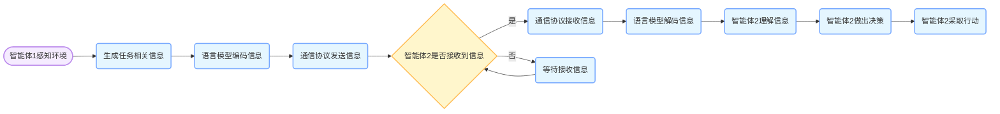

# 语言模型在多agent协作任务中的应用

> 关键词：语言模型、多agent协作、智能体、自然语言处理、协作任务、通信协议、强化学习

> 摘要：本文深入探讨了语言模型在多agent协作任务中的应用。随着人工智能技术的不断发展，多agent系统在各个领域的应用愈发广泛，而语言模型的出现为多agent之间的协作提供了更强大的支持。文章首先介绍了相关的背景知识，包括目的、预期读者、文档结构和术语表。接着阐述了核心概念与联系，通过文本示意图和Mermaid流程图展示其原理和架构。详细讲解了核心算法原理及具体操作步骤，并用Python代码进行了阐述。同时给出了数学模型和公式，并举例说明。在项目实战部分，通过实际案例展示了代码实现和解读。分析了语言模型在多agent协作任务中的实际应用场景，推荐了相关的学习资源、开发工具框架和论文著作。最后总结了未来发展趋势与挑战，还提供了常见问题与解答以及扩展阅读和参考资料，旨在为读者全面呈现语言模型在多agent协作任务中的应用全貌。

## 1. 背景介绍 
### 1.1 目的和范围
在当今复杂的人工智能应用场景中，多agent系统的协作需求日益增长。多agent系统由多个智能体组成，这些智能体需要相互协作来完成各种任务。语言模型的出现为多agent之间的通信和协作提供了新的思路和方法。本文的目的在于深入研究语言模型在多agent协作任务中的应用，探讨如何利用语言模型提高多agent系统的协作效率和智能水平。范围涵盖了语言模型和多agent协作的基本概念、核心算法、数学模型、实际应用场景等多个方面，旨在为相关领域的研究人员和开发者提供全面的参考。

### 1.2 预期读者
本文预期读者包括人工智能领域的研究人员、多agent系统开发者、自然语言处理工程师、对智能协作系统感兴趣的技术爱好者等。对于正在研究或开发多agent协作系统的专业人员，本文可以提供深入的技术原理和实践经验；对于对该领域有兴趣的初学者，本文可以帮助他们建立起对语言模型和多agent协作的基本认识。

### 1.3 文档结构概述
本文将按照以下结构进行阐述：首先介绍背景知识，包括目的、预期读者、文档结构和术语表；接着讲解核心概念与联系，通过文本示意图和Mermaid流程图展示其原理和架构；然后详细阐述核心算法原理及具体操作步骤，并用Python代码进行说明；随后给出数学模型和公式，并举例说明；在项目实战部分，通过实际案例展示代码实现和解读；分析语言模型在多agent协作任务中的实际应用场景；推荐相关的学习资源、开发工具框架和论文著作；最后总结未来发展趋势与挑战，提供常见问题与解答以及扩展阅读和参考资料。

### 1.4 术语表
#### 1.4.1 核心术语定义
- **语言模型**：是一种对自然语言进行建模的工具，它可以根据给定的上下文预测下一个词或序列的概率分布。常见的语言模型有基于统计的语言模型和基于神经网络的语言模型，如GPT系列。
- **多agent系统**：由多个智能体组成的系统，这些智能体可以感知环境、进行决策并采取行动，通过相互协作来完成特定的任务。
- **智能体**：具有一定的感知、决策和行动能力的实体，可以是软件程序、机器人等。
- **协作任务**：需要多个智能体共同参与、相互配合才能完成的任务。

#### 1.4.2 相关概念解释
- **自然语言处理**：是人工智能的一个重要领域，主要研究如何让计算机理解和处理自然语言。语言模型是自然语言处理中的一个关键技术。
- **通信协议**：在多agent系统中，通信协议规定了智能体之间如何进行信息交换和通信，以确保信息的准确传递和理解。
- **强化学习**：是一种机器学习方法，智能体通过与环境进行交互，根据环境反馈的奖励信号来学习最优的行为策略。

#### 1.4.3 缩略词列表
- **NLP**：Natural Language Processing（自然语言处理）
- **GPT**：Generative Pretrained Transformer（生成式预训练变换器）
- **RL**：Reinforcement Learning（强化学习）

## 2. 核心概念与联系 
### 核心概念原理
语言模型在多agent协作任务中起着关键的作用。其基本原理是，语言模型可以将智能体之间的信息以自然语言的形式进行表示和处理。智能体可以利用语言模型将自己的感知信息、决策信息等转换为自然语言描述，然后通过通信协议将这些信息传递给其他智能体。其他智能体接收到信息后，再利用语言模型对其进行理解和分析，从而做出相应的决策。

例如，在一个机器人协作搬运任务中，一个机器人可以使用语言模型生成“我在位置A发现一个重物，需要协助搬运”这样的信息，并发送给其他机器人。其他机器人接收到信息后，通过语言模型理解其含义，然后根据自身的状态和任务安排做出响应，如“我距离较近，我去协助”。

### 架构的文本示意图
```plaintext
多agent协作系统
|
|-- 智能体1
|   |-- 感知模块
|   |-- 决策模块
|   |-- 通信模块
|   |   |-- 语言模型（编码信息）
|   |   |-- 通信协议（发送信息）
|
|-- 智能体2
|   |-- 感知模块
|   |-- 决策模块
|   |-- 通信模块
|   |   |-- 通信协议（接收信息）
|   |   |-- 语言模型（解码信息）
|
|-- ...
|
|-- 环境
```

### Mermaid流程图


## 3. 核心算法原理 & 具体操作步骤 
### 核心算法原理
在多agent协作任务中，语言模型的核心算法主要涉及到信息的编码和解码。以基于Transformer架构的语言模型为例，其基本原理是通过多头自注意力机制来捕捉输入序列中不同位置之间的依赖关系。

多头自注意力机制的计算公式如下：
$$
\text{Attention}(Q, K, V) = \text{softmax}(\frac{QK^T}{\sqrt{d_k}})V
$$
其中，$Q$ 是查询矩阵，$K$ 是键矩阵，$V$ 是值矩阵，$d_k$ 是键的维度。

在信息编码阶段，智能体将自己的感知信息和决策信息转换为自然语言序列，然后输入到语言模型中。语言模型通过多头自注意力机制对输入序列进行处理，得到编码后的向量表示。在信息解码阶段，接收信息的智能体将接收到的信息输入到语言模型中，语言模型同样通过多头自注意力机制对其进行处理，得到解码后的信息。

### 具体操作步骤
1. **信息收集**：智能体通过感知模块收集环境信息和自身状态信息。
2. **信息转换**：将收集到的信息转换为自然语言描述。
3. **信息编码**：将自然语言描述输入到语言模型中进行编码，得到编码后的向量表示。
4. **信息发送**：通过通信协议将编码后的信息发送给其他智能体。
5. **信息接收**：其他智能体通过通信协议接收信息。
6. **信息解码**：将接收到的信息输入到语言模型中进行解码，得到解码后的信息。
7. **信息理解**：根据解码后的信息，智能体进行理解和分析。
8. **决策与行动**：智能体根据理解的信息做出决策，并采取相应的行动。

### Python源代码实现
```python
import torch
import torch.nn as nn
import torch.nn.functional as F

# 定义多头自注意力机制
class MultiHeadAttention(nn.Module):
    def __init__(self, d_model, num_heads):
        super(MultiHeadAttention, self).__init__()
        self.d_model = d_model
        self.num_heads = num_heads
        self.d_k = d_model // num_heads

        self.W_q = nn.Linear(d_model, d_model)
        self.W_k = nn.Linear(d_model, d_model)
        self.W_v = nn.Linear(d_model, d_model)
        self.W_o = nn.Linear(d_model, d_model)

    def forward(self, Q, K, V, mask=None):
        batch_size = Q.size(0)

        # 线性变换
        Q = self.W_q(Q)
        K = self.W_k(K)
        V = self.W_v(V)

        # 分割多头
        Q = Q.view(batch_size, -1, self.num_heads, self.d_k).transpose(1, 2)
        K = K.view(batch_size, -1, self.num_heads, self.d_k).transpose(1, 2)
        V = V.view(batch_size, -1, self.num_heads, self.d_k).transpose(1, 2)

        # 计算注意力分数
        scores = torch.matmul(Q, K.transpose(-2, -1)) / torch.sqrt(torch.tensor(self.d_k, dtype=torch.float32))

        if mask is not None:
            scores = scores.masked_fill(mask == 0, -1e9)

        # 计算注意力权重
        attn_weights = F.softmax(scores, dim=-1)

        # 加权求和
        output = torch.matmul(attn_weights, V)

        # 合并多头
        output = output.transpose(1, 2).contiguous().view(batch_size, -1, self.d_model)

        # 线性变换
        output = self.W_o(output)

        return output

# 示例使用
d_model = 512
num_heads = 8
batch_size = 32
seq_len = 10

# 随机生成输入
Q = torch.randn(batch_size, seq_len, d_model)
K = torch.randn(batch_size, seq_len, d_model)
V = torch.randn(batch_size, seq_len, d_model)

# 创建多头自注意力模块
multihead_attn = MultiHeadAttention(d_model, num_heads)

# 计算注意力输出
output = multihead_attn(Q, K, V)
print(output.shape)  # 输出形状应为 (batch_size, seq_len, d_model)
```

## 4. 数学模型和公式 & 详细讲解 & 举例说明 
### 数学模型和公式
#### 语言模型的概率模型
语言模型的核心任务是计算给定上下文下下一个词的概率。对于一个词序列 $w_1, w_2, \cdots, w_n$，语言模型的概率可以表示为：
$$
P(w_1, w_2, \cdots, w_n) = \prod_{i=1}^{n} P(w_i | w_1, w_2, \cdots, w_{i-1})
$$
其中，$P(w_i | w_1, w_2, \cdots, w_{i-1})$ 表示在给定前面 $i-1$ 个词的条件下，第 $i$ 个词出现的概率。

#### 多头自注意力机制的详细公式
在多头自注意力机制中，查询矩阵 $Q$、键矩阵 $K$ 和值矩阵 $V$ 是通过对输入向量进行线性变换得到的：
$$
Q = XW_Q
$$
$$
K = XW_K
$$
$$
V = XW_V
$$
其中，$X$ 是输入向量，$W_Q$、$W_K$ 和 $W_V$ 是可学习的权重矩阵。

多头自注意力机制的输出可以表示为：
$$
\text{MultiHead}(Q, K, V) = \text{Concat}(\text{head}_1, \text{head}_2, \cdots, \text{head}_h)W_O
$$
其中，$\text{head}_i = \text{Attention}(QW_Q^i, KW_K^i, VW_V^i)$，$h$ 是头的数量，$W_O$ 是可学习的权重矩阵。

### 详细讲解
语言模型的概率模型是基于链式法则推导出来的，它通过计算每个词在给定前面词的条件下的概率，来估计整个词序列的概率。这种模型可以用于文本生成、语言理解等任务。

多头自注意力机制通过将输入向量投影到多个低维子空间中，分别计算注意力分数，然后将这些分数合并起来，从而捕捉到输入序列中不同位置之间的多种依赖关系。这种机制可以提高语言模型的表达能力和性能。

### 举例说明
假设我们有一个简单的语言模型，输入的词序列是 “I like to play football”。语言模型会依次计算每个词的条件概率：
$$
P(\text{I})
$$
$$
P(\text{like} | \text{I})
$$
$$
P(\text{to} | \text{I like})
$$
$$
P(\text{play} | \text{I like to})
$$
$$
P(\text{football} | \text{I like to play})
$$
然后将这些概率相乘，得到整个词序列的概率。

在多头自注意力机制中，假设输入向量 $X$ 的维度是 $d_{model} = 512$，头的数量 $h = 8$，则每个头的维度 $d_k = d_{model} / h = 64$。查询矩阵 $Q$、键矩阵 $K$ 和值矩阵 $V$ 会分别将输入向量投影到 8 个 64 维的子空间中，然后分别计算注意力分数，最后将这些分数合并起来得到最终的输出。

## 5. 项目实战：代码实际案例和详细解释说明 
### 5.1  开发环境搭建
#### 操作系统
可以选择 Linux（如 Ubuntu）、Windows 或 macOS 作为开发环境。

#### 编程语言
使用 Python 作为主要的编程语言，建议使用 Python 3.7 及以上版本。

#### 依赖库安装
```bash
pip install torch  # 深度学习框架
pip install transformers  # 预训练语言模型库
```

### 5.2  源代码详细实现和代码解读
以下是一个简单的多agent协作任务的代码示例，模拟两个智能体之间的信息通信和协作。

```python
from transformers import AutoTokenizer, AutoModelForCausalLM
import torch

# 加载预训练语言模型和分词器
tokenizer = AutoTokenizer.from_pretrained("gpt2")
model = AutoModelForCausalLM.from_pretrained("gpt2")

# 定义智能体类
class Agent:
    def __init__(self, name):
        self.name = name

    def perceive(self, environment_info):
        # 模拟感知环境信息
        return environment_info

    def encode_message(self, message):
        # 编码信息
        input_ids = tokenizer.encode(message, return_tensors='pt')
        return input_ids

    def decode_message(self, input_ids):
        # 解码信息
        output = model.generate(input_ids)
        message = tokenizer.decode(output[0], skip_special_tokens=True)
        return message

    def communicate(self, other_agent, message):
        # 与其他智能体通信
        input_ids = self.encode_message(message)
        received_message = other_agent.decode_message(input_ids)
        print(f"{self.name} sent: {message}")
        print(f"{other_agent.name} received: {received_message}")

# 创建两个智能体
agent1 = Agent("Agent1")
agent2 = Agent("Agent2")

# 模拟环境信息
environment_info = "There is a ball in the room."

# 智能体1感知环境信息
perceived_info = agent1.perceive(environment_info)

# 智能体1向智能体2发送信息
agent1.communicate(agent2, perceived_info)
```

### 5.3  代码解读与分析
- **加载预训练语言模型和分词器**：使用 `transformers` 库加载预训练的 GPT-2 语言模型和对应的分词器。
- **定义智能体类**：`Agent` 类包含了智能体的基本功能，如感知环境信息、编码信息、解码信息和与其他智能体通信。
- **感知环境信息**：`perceive` 方法模拟智能体感知环境信息。
- **编码信息**：`encode_message` 方法使用分词器将自然语言信息转换为输入向量。
- **解码信息**：`decode_message` 方法使用语言模型对输入向量进行解码，生成自然语言信息。
- **通信过程**：`communicate` 方法实现了智能体之间的信息通信，一个智能体将信息编码后发送给另一个智能体，另一个智能体对信息进行解码并输出。

通过这个简单的示例，我们可以看到语言模型在多agent协作任务中的基本应用，即智能体之间通过语言模型进行信息的编码和解码，实现信息的传递和理解。

## 6. 实际应用场景 
### 机器人协作任务
在机器人协作搬运、搜索救援等任务中，多个机器人可以作为智能体，通过语言模型进行信息通信和协作。例如，在一个仓库搬运任务中，一个机器人发现某个货物需要搬运，但自身能力有限，它可以使用语言模型生成“我在货架 A 发现一个重货物，需要协助搬运”的信息，并发送给其他机器人。其他机器人接收到信息后，通过语言模型理解其含义，然后根据自身的状态和任务安排做出响应，如“我距离较近，我去协助”。

### 智能客服协作
在大型客服系统中，多个智能客服可以作为智能体进行协作。当一个智能客服遇到复杂问题无法解决时，它可以使用语言模型将问题描述转换为自然语言信息，发送给其他智能客服请求协助。其他智能客服接收到信息后，通过语言模型理解问题的含义，并提供相应的解决方案。

### 自动驾驶车辆协作
在自动驾驶领域，多辆自动驾驶车辆可以作为智能体进行协作。例如，在交通拥堵的情况下，一辆车辆可以使用语言模型生成“前方路口拥堵，建议绕道行驶”的信息，并发送给周围的车辆。其他车辆接收到信息后，通过语言模型理解其含义，然后调整自己的行驶路线，实现交通的优化和安全。

### 虚拟智能助手协作
多个虚拟智能助手可以在智能家居、办公等场景中进行协作。例如，在智能家居场景中，一个智能助手发现用户想要播放音乐，但当前设备无法满足需求，它可以使用语言模型将需求信息发送给其他智能助手。其他智能助手接收到信息后，通过语言模型理解需求，然后在合适的设备上播放音乐。

## 7. 工具和资源推荐
### 7.1 学习资源推荐
#### 7.1.1 书籍推荐
- 《自然语言处理入门》：介绍了自然语言处理的基本概念、算法和技术，适合初学者入门。
- 《深度学习》：详细讲解了深度学习的原理和应用，包括语言模型的相关知识。
- 《多智能体系统》：深入探讨了多智能体系统的理论和实践，对于理解多agent协作任务有很大帮助。

#### 7.1.2 在线课程
- Coursera 上的“Natural Language Processing Specialization”：由顶尖高校的教授授课，全面介绍了自然语言处理的各个方面。
- edX 上的“Deep Learning for Natural Language Processing”：专注于深度学习在自然语言处理中的应用，包括语言模型的实现和优化。
- Udemy 上的“Multi-Agent Systems and Reinforcement Learning”：讲解了多智能体系统和强化学习的相关知识，对于多agent协作任务的研究有很大帮助。

#### 7.1.3 技术博客和网站
- Medium：有很多关于自然语言处理和多智能体系统的技术文章，作者来自世界各地的研究人员和开发者。
- arXiv：提供了大量的学术论文，包括语言模型和多agent协作的最新研究成果。
- Hugging Face Blog：专注于自然语言处理和深度学习的技术博客，介绍了很多关于预训练语言模型的应用和实践。

### 7.2 开发工具框架推荐
#### 7.2.1 IDE和编辑器
- PyCharm：功能强大的 Python 集成开发环境，提供了代码编辑、调试、版本控制等功能。
- Visual Studio Code：轻量级的代码编辑器，支持多种编程语言，有丰富的插件可以扩展功能。
- Jupyter Notebook：交互式的开发环境，适合进行数据探索、模型训练和实验。

#### 7.2.2 调试和性能分析工具
- TensorBoard：用于可视化深度学习模型的训练过程和性能指标，帮助开发者分析模型的训练效果。
- PyTorch Profiler：可以对 PyTorch 模型进行性能分析，找出性能瓶颈，优化代码。
- cProfile：Python 自带的性能分析工具，可以分析代码的执行时间和函数调用关系。

#### 7.2.3 相关框架和库
- PyTorch：开源的深度学习框架，提供了丰富的工具和库，用于构建和训练语言模型。
- TensorFlow：另一个流行的深度学习框架，也支持语言模型的开发和训练。
- Transformers：Hugging Face 开发的库，提供了多种预训练语言模型和工具，方便开发者使用和微调语言模型。

### 7.3 相关论文著作推荐
#### 7.3.1 经典论文
- “Attention Is All You Need”：介绍了 Transformer 架构，是现代语言模型的基础。
- “Language Models are Unsupervised Multitask Learners”：介绍了 GPT 系列语言模型的原理和应用。
- “Multi-Agent Systems: A Modern Approach to Distributed Artificial Intelligence”：经典的多智能体系统论文，奠定了多智能体系统的理论基础。

#### 7.3.2 最新研究成果
- 关注 arXiv 上关于语言模型和多智能体系统的最新论文，了解该领域的前沿研究动态。
- 参加相关的学术会议，如 NeurIPS、ICML、ACL 等，获取最新的研究成果和技术报告。

#### 7.3.3 应用案例分析
- 研究一些实际应用案例的论文，了解语言模型在多agent协作任务中的具体应用和效果评估。例如，一些关于机器人协作、智能客服协作等方面的应用案例论文。

## 8. 总结：未来发展趋势与挑战
### 未来发展趋势
- **更强的语言理解和生成能力**：随着语言模型技术的不断发展，未来的语言模型将具有更强的语言理解和生成能力，能够更准确地理解智能体之间的信息，并生成更加自然、流畅的回复。
- **多模态融合**：将语言模型与视觉、听觉等多模态信息融合，使智能体能够更好地感知和理解复杂的环境信息，提高多agent协作的效率和智能水平。
- **强化学习与语言模型的结合**：通过强化学习方法优化语言模型在多agent协作任务中的决策和行为，使智能体能够根据环境反馈不断学习和改进协作策略。
- **大规模分布式协作**：支持更多智能体之间的大规模分布式协作，应用于更复杂的场景，如城市交通管理、全球供应链优化等。

### 挑战
- **语言歧义性**：自然语言存在歧义性，语言模型在理解和处理歧义信息时可能会出现错误，影响多agent协作的效果。
- **通信效率**：在多agent系统中，智能体之间的通信可能会受到网络延迟、带宽限制等因素的影响，导致信息传递不及时或丢失。
- **知识表示和共享**：如何有效地表示和共享智能体之间的知识，使不同智能体能够更好地理解和利用彼此的信息，是一个亟待解决的问题。
- **安全和隐私**：在多agent协作过程中，智能体之间的信息通信涉及到安全和隐私问题，需要采取有效的措施来保护信息的安全和隐私。

## 9. 附录：常见问题与解答
### 问题1：语言模型在多agent协作任务中会出现信息丢失的情况吗？
答：可能会出现信息丢失的情况。一方面，语言模型在编码和解码过程中可能会因为模型的局限性而丢失一些信息；另一方面，通信过程中的网络问题，如延迟、丢包等，也可能导致信息丢失。为了减少信息丢失，可以采用更先进的语言模型和可靠的通信协议。

### 问题2：如何选择适合多agent协作任务的语言模型？
答：选择适合的语言模型需要考虑多个因素，如任务的复杂度、对语言理解和生成能力的要求、计算资源的限制等。对于简单的任务，可以选择轻量级的语言模型；对于复杂的任务，可能需要选择更强大的预训练语言模型，并进行微调。

### 问题3：多agent协作任务中智能体之间的通信协议有哪些？
答：常见的通信协议包括消息队列协议（如 RabbitMQ、Kafka）、HTTP 协议、TCP/IP 协议等。选择通信协议需要根据任务的特点和需求来决定，例如，如果需要实时通信，可以选择消息队列协议；如果需要与 Web 服务集成，可以选择 HTTP 协议。

### 问题4：语言模型在多agent协作任务中的计算资源需求大吗？
答：语言模型的计算资源需求通常较大，特别是一些大型的预训练语言模型。在多agent协作任务中，需要根据实际情况合理分配计算资源，可以采用分布式计算、模型压缩等技术来降低计算资源需求。

## 10. 扩展阅读 & 参考资料
### 扩展阅读
- 深入研究不同类型的语言模型，如基于规则的语言模型、基于统计的语言模型和基于神经网络的语言模型。
- 学习多智能体系统的不同理论和方法，如博弈论、分布式人工智能等。
- 关注自然语言处理和多智能体系统领域的最新研究动态和技术发展趋势。

### 参考资料
- 《自然语言处理实战》
- 《多智能体系统原理与编程》
- arXiv 上关于语言模型和多智能体系统的相关论文
- Hugging Face 官方文档和教程
- PyTorch 和 TensorFlow 官方文档和教程