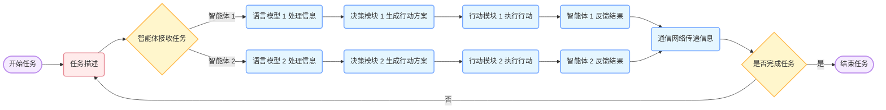

# 语言模型在多智能体协作任务中的决策能力与协调效率优化

> 关键词：语言模型、多智能体协作、决策能力、协调效率、优化策略

> 摘要：本文聚焦于语言模型在多智能体协作任务中的应用，深入探讨了语言模型的决策能力以及多智能体之间的协调效率问题。首先介绍了相关背景知识，包括研究目的、预期读者等内容。接着阐述了核心概念与联系，通过文本示意图和 Mermaid 流程图展示其架构。详细讲解了核心算法原理并给出 Python 源代码，同时分析了数学模型和公式。通过项目实战展示代码实现和解读，探讨了实际应用场景。推荐了学习、开发相关的工具和资源，最后总结了未来发展趋势与挑战，还包含常见问题解答和参考资料等内容，旨在为语言模型在多智能体协作任务中的应用提供全面的技术指导和理论支持。

## 1. 背景介绍 
### 1.1 目的和范围
在当今复杂的任务环境中，多智能体协作系统展现出强大的处理能力和适应性。语言模型作为智能体之间信息交互和决策制定的关键工具，其决策能力和多智能体之间的协调效率直接影响整个系统的性能。本研究的目的在于深入分析语言模型在多智能体协作任务中的作用机制，探索优化其决策能力和协调效率的方法和策略。范围涵盖了从基础概念的理解到算法原理的分析，再到实际项目的应用和未来发展趋势的探讨。

### 1.2 预期读者
本文预期读者包括人工智能领域的研究人员、开发者、软件架构师以及对多智能体系统和语言模型感兴趣的技术爱好者。对于正在从事相关研究和开发工作的专业人员，本文提供了深入的技术分析和优化思路；对于初学者，本文可以帮助他们建立对语言模型在多智能体协作任务中应用的基本概念和理解。

### 1.3 文档结构概述
本文将按照以下结构展开：首先介绍背景知识，包括研究目的、预期读者等；接着阐述核心概念与联系，通过文本示意图和 Mermaid 流程图展示其架构；详细讲解核心算法原理并给出 Python 源代码；分析数学模型和公式；通过项目实战展示代码实现和解读；探讨实际应用场景；推荐学习、开发相关的工具和资源；最后总结未来发展趋势与挑战，还包含常见问题解答和参考资料等内容。

### 1.4 术语表
#### 1.4.1 核心术语定义
- **语言模型**：是一种基于概率统计的模型，用于预测文本序列中下一个词出现的概率。在多智能体协作中，语言模型可以用于智能体之间的信息理解和生成。
- **多智能体协作**：多个智能体通过相互通信和协调，共同完成一个或多个任务的过程。智能体可以是软件程序、机器人等。
- **决策能力**：智能体在面对不同情况时，根据自身的知识和目标，选择最优行动方案的能力。
- **协调效率**：多智能体在协作过程中，通过有效的通信和协调机制，快速、准确地完成任务的效率。

#### 1.4.2 相关概念解释
- **智能体**：具有感知、决策和行动能力的实体，可以自主地与环境进行交互。在多智能体系统中，智能体之间可以通过通信进行协作。
- **通信协议**：多智能体之间进行信息交换的规则和格式，确保信息的准确传递和理解。
- **任务分配**：将一个复杂的任务分解为多个子任务，并分配给不同的智能体完成的过程。

#### 1.4.3 缩略词列表
- **NLP**：Natural Language Processing，自然语言处理
- **RL**：Reinforcement Learning，强化学习
- **ML**：Machine Learning，机器学习

## 2. 核心概念与联系 

### 核心概念原理
语言模型在多智能体协作任务中起着至关重要的作用。语言模型可以作为智能体之间的信息传递和理解的桥梁，通过对自然语言的处理，智能体可以更好地理解任务要求、其他智能体的意图和环境信息。

智能体的决策能力依赖于语言模型对信息的处理和分析。语言模型可以将输入的文本信息转换为智能体可以理解的特征表示，智能体根据这些特征表示和自身的决策算法，选择合适的行动方案。

多智能体之间的协调效率则与语言模型的通信能力和智能体之间的协作机制有关。语言模型可以生成清晰、准确的信息，促进智能体之间的有效沟通。同时，合理的协作机制可以确保智能体之间的行动协调一致，避免冲突和重复工作。

### 架构的文本示意图
```plaintext
多智能体协作系统
|
|-- 智能体 1
|   |-- 语言模型 1
|   |-- 决策模块 1
|   |-- 行动模块 1
|
|-- 智能体 2
|   |-- 语言模型 2
|   |-- 决策模块 2
|   |-- 行动模块 2
|
|-- ...
|
|-- 通信网络
```

### Mermaid 流程图


## 3. 核心算法原理 & 具体操作步骤 

### 核心算法原理
在多智能体协作任务中，语言模型的决策能力和协调效率可以通过强化学习算法进行优化。强化学习是一种通过智能体与环境进行交互，根据奖励信号来学习最优策略的机器学习方法。

具体来说，每个智能体可以将语言模型输出的信息作为状态输入，通过决策模块选择行动，执行行动后从环境中获得奖励信号。智能体根据奖励信号来调整自己的策略，以最大化长期累积奖励。

### Python 源代码实现
```python
import numpy as np

# 定义智能体类
class Agent:
    def __init__(self, state_size, action_size, learning_rate=0.1, discount_factor=0.9):
        self.state_size = state_size
        self.action_size = action_size
        self.learning_rate = learning_rate
        self.discount_factor = discount_factor
        # 初始化 Q 表
        self.q_table = np.zeros((state_size, action_size))

    def choose_action(self, state, epsilon=0.1):
        if np.random.uniform(0, 1) < epsilon:
            # 探索：随机选择行动
            action = np.random.choice(self.action_size)
        else:
            # 利用：选择 Q 值最大的行动
            action = np.argmax(self.q_table[state, :])
        return action

    def update_q_table(self, state, action, reward, next_state):
        # Q 学习更新公式
        max_q_next = np.max(self.q_table[next_state, :])
        self.q_table[state, action] += self.learning_rate * (reward + self.discount_factor * max_q_next - self.q_table[state, action])

# 模拟多智能体协作任务
def multi_agent_collaboration(num_agents, state_size, action_size, num_episodes=1000):
    agents = [Agent(state_size, action_size) for _ in range(num_agents)]
    for episode in range(num_episodes):
        # 初始化状态
        states = [np.random.randint(0, state_size) for _ in range(num_agents)]
        done = False
        while not done:
            actions = []
            for agent in agents:
                state = states[agents.index(agent)]
                action = agent.choose_action(state)
                actions.append(action)
            # 执行行动并获取奖励和下一个状态
            rewards, next_states = execute_actions(actions)
            for agent in agents:
                index = agents.index(agent)
                state = states[index]
                action = actions[index]
                reward = rewards[index]
                next_state = next_states[index]
                agent.update_q_table(state, action, reward, next_state)
            states = next_states
            # 判断是否完成任务
            done = check_done(states)
    return agents

# 模拟执行行动并获取奖励和下一个状态
def execute_actions(actions):
    rewards = [np.random.randint(-1, 2) for _ in actions]
    next_states = [np.random.randint(0, 10) for _ in actions]
    return rewards, next_states

# 模拟判断是否完成任务
def check_done(states):
    # 简单示例：当所有状态都为 0 时完成任务
    return all(state == 0 for state in states)

# 运行多智能体协作任务
num_agents = 2
state_size = 10
action_size = 3
agents = multi_agent_collaboration(num_agents, state_size, action_size)
```

### 具体操作步骤
1. **初始化智能体**：创建多个智能体，每个智能体初始化自己的 Q 表。
2. **开始训练**：在每个训练周期中，初始化智能体的状态。
3. **选择行动**：每个智能体根据当前状态和 Q 表选择行动。
4. **执行行动**：执行选择的行动，从环境中获取奖励和下一个状态。
5. **更新 Q 表**：每个智能体根据奖励和下一个状态更新自己的 Q 表。
6. **判断是否完成任务**：如果完成任务，则结束当前训练周期；否则，继续下一轮迭代。
7. **重复训练**：重复步骤 2 - 6，直到达到指定的训练周期数。

## 4. 数学模型和公式 & 详细讲解 & 举例说明 

### 数学模型
在强化学习中，多智能体协作任务可以用马尔可夫决策过程（MDP）来描述。马尔可夫决策过程是一个五元组 $(S, A, P, R, \gamma)$，其中：
- $S$ 是状态空间，表示智能体可能处于的所有状态。
- $A$ 是行动空间，表示智能体可以采取的所有行动。
- $P(s'|s, a)$ 是状态转移概率，表示在状态 $s$ 采取行动 $a$ 后转移到状态 $s'$ 的概率。
- $R(s, a, s')$ 是奖励函数，表示在状态 $s$ 采取行动 $a$ 转移到状态 $s'$ 时获得的奖励。
- $\gamma$ 是折扣因子，用于权衡当前奖励和未来奖励的重要性。

### 数学公式
在 Q 学习算法中，智能体的目标是学习一个最优的动作价值函数 $Q(s, a)$，表示在状态 $s$ 采取行动 $a$ 时的预期累积奖励。Q 学习的更新公式为：
$$Q(s, a) \leftarrow Q(s, a) + \alpha [R(s, a, s') + \gamma \max_{a'} Q(s', a') - Q(s, a)]$$
其中：
- $\alpha$ 是学习率，控制每次更新的步长。
- $\gamma$ 是折扣因子，用于权衡当前奖励和未来奖励的重要性。
- $R(s, a, s')$ 是在状态 $s$ 采取行动 $a$ 转移到状态 $s'$ 时获得的奖励。
- $\max_{a'} Q(s', a')$ 是在状态 $s'$ 下所有可能行动中最大的 Q 值。

### 详细讲解
Q 学习算法的核心思想是通过不断地与环境进行交互，根据奖励信号来更新 Q 表，使得 Q 表逐渐逼近最优的动作价值函数。每次更新时，智能体根据当前状态 $s$ 和行动 $a$ 获得奖励 $R(s, a, s')$，并估计下一个状态 $s'$ 的最大 Q 值 $\max_{a'} Q(s', a')$。然后，根据更新公式更新当前状态和行动的 Q 值。

### 举例说明
假设一个简单的多智能体协作任务，状态空间 $S = \{0, 1, 2\}$，行动空间 $A = \{0, 1\}$，初始 Q 表如下：
| 状态 | 行动 0 | 行动 1 |
|------|--------|--------|
| 0    | 0      | 0      |
| 1    | 0      | 0      |
| 2    | 0      | 0      |

智能体在状态 $s = 0$ 采取行动 $a = 0$，转移到状态 $s' = 1$，获得奖励 $R(0, 0, 1) = 1$。假设学习率 $\alpha = 0.1$，折扣因子 $\gamma = 0.9$。

首先，计算 $\max_{a'} Q(1, a')$，由于初始 Q 表中 $Q(1, 0) = Q(1, 1) = 0$，所以 $\max_{a'} Q(1, a') = 0$。

然后，根据更新公式更新 $Q(0, 0)$：
$$Q(0, 0) \leftarrow Q(0, 0) + 0.1 [1 + 0.9 \times 0 - Q(0, 0)] = 0 + 0.1 \times (1 - 0) = 0.1$$

更新后的 Q 表如下：
| 状态 | 行动 0 | 行动 1 |
|------|--------|--------|
| 0    | 0.1    | 0      |
| 1    | 0      | 0      |
| 2    | 0      | 0      |

## 5. 项目实战：代码实际案例和详细解释说明 

### 5.1  开发环境搭建
1. **安装 Python**：确保系统中安装了 Python 3.6 及以上版本。可以从 Python 官方网站（https://www.python.org/downloads/）下载并安装。
2. **安装必要的库**：本项目需要使用 `numpy` 库，可以使用以下命令进行安装：
```sh
pip install numpy
```

### 5.2  源代码详细实现和代码解读
```python
import numpy as np

# 定义智能体类
class Agent:
    def __init__(self, state_size, action_size, learning_rate=0.1, discount_factor=0.9):
        self.state_size = state_size
        self.action_size = action_size
        self.learning_rate = learning_rate
        self.discount_factor = discount_factor
        # 初始化 Q 表
        self.q_table = np.zeros((state_size, action_size))

    def choose_action(self, state, epsilon=0.1):
        if np.random.uniform(0, 1) < epsilon:
            # 探索：随机选择行动
            action = np.random.choice(self.action_size)
        else:
            # 利用：选择 Q 值最大的行动
            action = np.argmax(self.q_table[state, :])
        return action

    def update_q_table(self, state, action, reward, next_state):
        # Q 学习更新公式
        max_q_next = np.max(self.q_table[next_state, :])
        self.q_table[state, action] += self.learning_rate * (reward + self.discount_factor * max_q_next - self.q_table[state, action])

# 模拟多智能体协作任务
def multi_agent_collaboration(num_agents, state_size, action_size, num_episodes=1000):
    agents = [Agent(state_size, action_size) for _ in range(num_agents)]
    for episode in range(num_episodes):
        # 初始化状态
        states = [np.random.randint(0, state_size) for _ in range(num_agents)]
        done = False
        while not done:
            actions = []
            for agent in agents:
                state = states[agents.index(agent)]
                action = agent.choose_action(state)
                actions.append(action)
            # 执行行动并获取奖励和下一个状态
            rewards, next_states = execute_actions(actions)
            for agent in agents:
                index = agents.index(agent)
                state = states[index]
                action = actions[index]
                reward = rewards[index]
                next_state = next_states[index]
                agent.update_q_table(state, action, reward, next_state)
            states = next_states
            # 判断是否完成任务
            done = check_done(states)
    return agents

# 模拟执行行动并获取奖励和下一个状态
def execute_actions(actions):
    rewards = [np.random.randint(-1, 2) for _ in actions]
    next_states = [np.random.randint(0, 10) for _ in actions]
    return rewards, next_states

# 模拟判断是否完成任务
def check_done(states):
    # 简单示例：当所有状态都为 0 时完成任务
    return all(state == 0 for state in states)

# 运行多智能体协作任务
num_agents = 2
state_size = 10
action_size = 3
agents = multi_agent_collaboration(num_agents, state_size, action_size)
```

### 代码解读与分析
1. **智能体类 `Agent`**：
    - `__init__` 方法：初始化智能体的状态空间、行动空间、学习率、折扣因子和 Q 表。
    - `choose_action` 方法：根据当前状态和 epsilon - greedy 策略选择行动。以一定的概率 $\epsilon$ 进行探索（随机选择行动），以 $1 - \epsilon$ 的概率进行利用（选择 Q 值最大的行动）。
    - `update_q_table` 方法：根据 Q 学习更新公式更新 Q 表。

2. **多智能体协作函数 `multi_agent_collaboration`**：
    - 初始化多个智能体。
    - 在每个训练周期中，初始化智能体的状态。
    - 循环执行以下操作，直到任务完成：
        - 每个智能体选择行动。
        - 执行行动并获取奖励和下一个状态。
        - 每个智能体更新自己的 Q 表。
        - 更新智能体的状态。
        - 判断是否完成任务。

3. **辅助函数**：
    - `execute_actions` 函数：模拟执行行动并获取奖励和下一个状态。
    - `check_done` 函数：模拟判断是否完成任务。

## 6. 实际应用场景 
### 机器人协作任务
在机器人协作任务中，多个机器人可以作为智能体，通过语言模型进行通信和协作。例如，在物流仓库中，多个搬运机器人需要协作完成货物的搬运任务。每个机器人可以使用语言模型理解任务指令和其他机器人的信息，根据自身的位置和状态做出决策，选择合适的行动，如前往指定地点搬运货物、将货物运输到目标位置等。通过有效的协调和协作，提高货物搬运的效率。

### 智能交通系统
在智能交通系统中，车辆、交通信号灯等可以作为智能体。语言模型可以用于车辆之间的信息交互和交通管理中心与车辆之间的通信。例如，车辆可以通过语言模型向其他车辆发送自己的行驶状态、目的地等信息，避免碰撞和拥堵。交通管理中心可以通过语言模型向车辆发布交通指令，优化交通流量。

### 分布式计算任务
在分布式计算任务中，多个计算节点可以作为智能体。语言模型可以用于计算节点之间的任务分配和协调。例如，当有一个复杂的计算任务时，主节点可以使用语言模型将任务分解为多个子任务，并根据计算节点的状态和能力分配给不同的节点。计算节点之间可以通过语言模型进行通信，协调计算进度，确保任务的高效完成。

## 7. 工具和资源推荐
### 7.1 学习资源推荐
#### 7.1.1 书籍推荐
- 《人工智能：一种现代的方法》：全面介绍了人工智能的基本概念、算法和应用，包括多智能体系统和强化学习等内容。
- 《强化学习：原理与Python实现》：详细讲解了强化学习的原理和算法，并通过 Python 代码进行实现，适合初学者学习。
- 《自然语言处理入门》：介绍了自然语言处理的基本技术和方法，包括语言模型的相关知识。

#### 7.1.2 在线课程
- Coursera 上的“人工智能基础”课程：由知名教授授课，系统地介绍了人工智能的基础知识和应用。
- edX 上的“强化学习”课程：深入讲解了强化学习的理论和实践，提供了丰富的案例和实验。
- 中国大学MOOC上的“自然语言处理”课程：结合实际应用，介绍了自然语言处理的核心技术和方法。

#### 7.1.3 技术博客和网站
- Medium：上面有很多关于人工智能、多智能体系统和语言模型的技术文章和研究成果分享。
- arXiv：提供了大量的学术论文，包括最新的研究成果和前沿技术。
- 机器之心：专注于人工智能领域的资讯和技术解读，提供了丰富的学习资源和案例分析。

### 7.2 开发工具框架推荐
#### 7.2.1 IDE和编辑器
- PyCharm：一款专业的 Python 集成开发环境，提供了丰富的代码编辑、调试和分析功能。
- Visual Studio Code：一款轻量级的代码编辑器，支持多种编程语言和插件扩展，适合快速开发和调试。

#### 7.2.2 调试和性能分析工具
- PDB：Python 自带的调试工具，可以帮助开发者定位代码中的问题。
- cProfile：Python 标准库中的性能分析工具，可以分析代码的执行时间和函数调用关系。

#### 7.2.3 相关框架和库
- TensorFlow：一个开源的机器学习框架，提供了丰富的工具和库，支持深度学习和强化学习算法的实现。
- PyTorch：另一个流行的深度学习框架，具有简洁的 API 和高效的计算性能。
- OpenAI Gym：一个用于开发和比较强化学习算法的工具包，提供了多种环境和任务。

### 7.3 相关论文著作推荐
#### 7.3.1 经典论文
- “Q - Learning”：由 Watkins 和 Dayan 发表的经典论文，首次提出了 Q 学习算法，为强化学习的发展奠定了基础。
- “Mastering the Game of Go with Deep Neural Networks and Tree Search”：介绍了 AlphaGo 使用的深度学习和蒙特卡罗树搜索算法，展示了人工智能在复杂游戏中的强大能力。

#### 7.3.2 最新研究成果
- 关注顶级学术会议，如 NeurIPS（神经信息处理系统大会）、ICML（国际机器学习会议）、ACL（计算语言学协会年会）等，这些会议上会发布很多关于多智能体系统、语言模型和强化学习的最新研究成果。

#### 7.3.3 应用案例分析
- 可以查阅一些实际应用案例的论文，了解语言模型在多智能体协作任务中的具体应用和优化策略，如机器人协作、智能交通等领域的案例分析。

## 8. 总结：未来发展趋势与挑战
### 未来发展趋势
- **更强大的语言模型**：随着自然语言处理技术的不断发展，语言模型的性能将不断提高，能够更好地理解和生成自然语言，为多智能体协作提供更准确、更丰富的信息。
- **深度强化学习与多智能体协作的融合**：深度强化学习可以处理更复杂的状态和行动空间，将其与多智能体协作相结合，可以提高智能体的决策能力和协调效率，解决更复杂的实际问题。
- **跨领域应用**：语言模型在多智能体协作任务中的应用将扩展到更多领域，如医疗、金融、教育等，为这些领域带来更高效、更智能的解决方案。

### 挑战
- **通信带宽和延迟**：多智能体之间的通信需要消耗一定的带宽和时间，在大规模多智能体系统中，通信带宽和延迟可能会成为影响协调效率的瓶颈。
- **智能体的异构性**：不同智能体可能具有不同的能力、知识和目标，如何协调这些异构智能体之间的协作是一个挑战。
- **安全性和可靠性**：在实际应用中，多智能体系统的安全性和可靠性至关重要。语言模型可能会受到攻击和干扰，导致智能体的决策出现错误，影响整个系统的性能。

## 9. 附录：常见问题与解答
### 1. 语言模型在多智能体协作中是如何工作的？
语言模型在多智能体协作中主要用于信息的理解和生成。智能体可以将接收到的文本信息输入到语言模型中，语言模型对其进行处理和分析，将其转换为智能体可以理解的特征表示。智能体根据这些特征表示和自身的决策算法，选择合适的行动。同时，智能体可以使用语言模型生成清晰、准确的信息，与其他智能体进行通信和协调。

### 2. 如何提高多智能体之间的协调效率？
可以从以下几个方面提高多智能体之间的协调效率：
- **优化通信协议**：设计高效的通信协议，确保信息的准确传递和理解，减少通信延迟。
- **合理的任务分配**：根据智能体的能力和状态，合理分配任务，避免任务冲突和重复工作。
- **强化学习算法**：使用强化学习算法训练智能体，使其能够根据环境的反馈不断调整自己的策略，提高协调效率。

### 3. 多智能体协作系统中智能体的决策能力受哪些因素影响？
智能体的决策能力受以下因素影响：
- **语言模型的性能**：语言模型的准确性和理解能力直接影响智能体对信息的处理和分析，从而影响决策能力。
- **智能体的知识和经验**：智能体的知识和经验可以帮助其更好地理解任务要求和环境信息，做出更合理的决策。
- **决策算法**：不同的决策算法具有不同的性能和特点，选择合适的决策算法可以提高智能体的决策能力。

## 10. 扩展阅读 & 参考资料
### 扩展阅读
- 《多智能体系统：原理与应用》：深入介绍了多智能体系统的原理、算法和应用，为进一步学习和研究提供了更全面的知识。
- 《深度学习进阶：自然语言处理》：详细讲解了自然语言处理中的深度学习技术，包括语言模型的高级应用。

### 参考资料
- Watkins, C. J., & Dayan, P. (1992). Q - learning. Machine learning, 8(3 - 4), 279 - 292.
- Silver, D., Huang, A., Maddison, C. J., Guez, A., Sifre, L., van den Driessche, G., ... & Hassabis, D. (2016). Mastering the game of Go with deep neural networks and tree search. nature, 529(7587), 484 - 489.