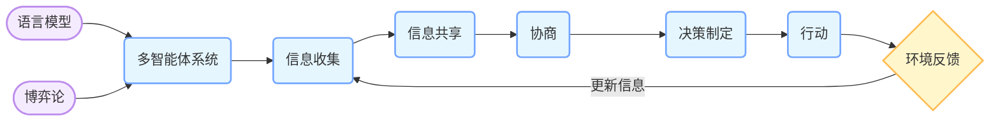

# 语言模型在多智能体协同决策与博弈中的应用研究

> 关键词：语言模型、多智能体系统、协同决策、博弈论、人工智能

> 摘要：本文聚焦于语言模型在多智能体协同决策与博弈中的应用。首先介绍了相关研究的背景，包括目的、预期读者等内容。详细阐述了语言模型、多智能体系统、协同决策和博弈论等核心概念及其联系，通过文本示意图和 Mermaid 流程图进行直观展示。深入讲解了核心算法原理，并用 Python 源代码进行详细阐述。分析了其中涉及的数学模型和公式，并举例说明。通过项目实战展示了语言模型在多智能体场景中的具体应用，包括开发环境搭建、源代码实现与解读。探讨了其实际应用场景，推荐了相关的学习资源、开发工具框架以及论文著作。最后总结了未来发展趋势与挑战，并提供了常见问题解答和扩展阅读参考资料，旨在全面深入地研究语言模型在多智能体协同决策与博弈中的应用，为相关领域的研究和实践提供有价值的参考。

## 1. 背景介绍 
### 1.1 目的和范围
在当今复杂的人工智能和多智能体系统研究领域，多智能体协同决策与博弈是一个关键且具有挑战性的问题。多智能体系统由多个自主的智能体组成，这些智能体需要在不同的环境中进行交互、决策和协作，以实现共同或各自的目标。传统的多智能体决策方法往往存在局限性，例如难以处理复杂的环境信息、缺乏有效的通信和协作机制等。

语言模型作为人工智能领域的重要技术，具有强大的自然语言处理能力，能够理解和生成自然语言文本。将语言模型应用于多智能体协同决策与博弈中，可以为智能体提供更加灵活和高效的通信方式，帮助智能体更好地理解环境信息和其他智能体的意图，从而做出更优的决策。

本研究的目的在于深入探讨语言模型在多智能体协同决策与博弈中的应用机制和效果，通过理论分析、算法设计和实验验证，揭示语言模型如何提升多智能体系统的性能和效率。研究范围涵盖了语言模型的基本原理、多智能体系统的架构和决策过程、博弈论的相关概念和方法，以及语言模型在不同多智能体场景中的具体应用。

### 1.2 预期读者
本文预期读者包括人工智能、计算机科学、控制科学与工程等相关专业的研究人员和学生，他们对多智能体系统、语言模型和博弈论等领域有一定的了解和兴趣，希望深入学习和研究语言模型在多智能体协同决策与博弈中的应用。同时，也适合从事智能系统开发、机器人控制、网络优化等实际工程应用的技术人员，他们可以从本文中获取相关的技术思路和方法，应用到实际项目中。

### 1.3 文档结构概述
本文将按照以下结构进行组织：
1. **背景介绍**：介绍研究的目的、范围、预期读者和文档结构概述，以及相关术语的定义和解释。
2. **核心概念与联系**：详细阐述语言模型、多智能体系统、协同决策和博弈论等核心概念，通过文本示意图和 Mermaid 流程图展示它们之间的联系。
3. **核心算法原理 & 具体操作步骤**：深入讲解语言模型在多智能体协同决策与博弈中应用的核心算法原理，并用 Python 源代码进行详细阐述。
4. **数学模型和公式 & 详细讲解 & 举例说明**：分析语言模型在多智能体系统中涉及的数学模型和公式，并通过具体例子进行说明。
5. **项目实战：代码实际案例和详细解释说明**：通过一个具体的项目实战，展示语言模型在多智能体协同决策与博弈中的应用，包括开发环境搭建、源代码实现与解读。
6. **实际应用场景**：探讨语言模型在多智能体协同决策与博弈中的实际应用场景，如智能交通、机器人协作、网络安全等。
7. **工具和资源推荐**：推荐相关的学习资源、开发工具框架以及论文著作，帮助读者进一步深入学习和研究。
8. **总结：未来发展趋势与挑战**：总结语言模型在多智能体协同决策与博弈中的应用现状，分析未来发展趋势和面临的挑战。
9. **附录：常见问题与解答**：提供常见问题的解答，帮助读者更好地理解和应用相关技术。
10. **扩展阅读 & 参考资料**：提供扩展阅读的建议和相关参考资料，方便读者进一步深入研究。

### 1.4 术语表
#### 1.4.1 核心术语定义
- **语言模型**：是一种概率模型，用于计算自然语言文本的概率分布，能够预测下一个词或句子的可能性。常见的语言模型包括基于统计的语言模型和基于深度学习的语言模型，如循环神经网络（RNN）、长短时记忆网络（LSTM）、Transformer 等。
- **多智能体系统（Multi - Agent System，MAS）**：由多个自主的智能体组成的系统，这些智能体可以感知环境、进行决策和行动，并且能够与其他智能体进行交互和协作，以实现共同或各自的目标。
- **协同决策**：指多个智能体在面对共同的问题或任务时，通过信息共享、协商和合作，共同制定决策方案，以实现整体最优的过程。
- **博弈论（Game Theory）**：是研究决策主体在相互对抗或合作中的策略选择及其均衡问题的数学理论和方法，主要包括非合作博弈和合作博弈等类型。

#### 1.4.2 相关概念解释
- **智能体（Agent）**：是具有自主性、反应性、主动性和社会性的实体，能够感知环境、进行推理和决策，并采取行动以实现自身的目标。
- **环境（Environment）**：是智能体所处的外部世界，包括物理环境、信息环境等，智能体通过感知环境获取信息，并通过行动影响环境。
- **策略（Strategy）**：是智能体在决策过程中选择的行动方案，通常是基于智能体对环境的感知和对其他智能体行为的预测。
- **均衡（Equilibrium）**：在博弈论中，是指所有智能体的策略组合达到一种稳定状态，在这种状态下，任何一个智能体都没有动机单方面改变自己的策略。

#### 1.4.3 缩略词列表
- **MAS**：Multi - Agent System（多智能体系统）
- **RNN**：Recurrent Neural Network（循环神经网络）
- **LSTM**：Long Short - Term Memory（长短时记忆网络）
- **NLP**：Natural Language Processing（自然语言处理）

## 2. 核心概念与联系 

### 语言模型原理
语言模型的核心目标是计算给定文本序列的概率。基于统计的语言模型通过对大量文本数据的统计分析，计算词与词之间的共现概率。例如，n - 元语法（n - gram）模型，它假设一个词的出现只依赖于前面的 n - 1 个词。

基于深度学习的语言模型则通过神经网络学习文本的语义和语法信息。以 Transformer 为例，它采用了自注意力机制（Self - Attention），能够捕捉文本中不同位置之间的依赖关系。Transformer 由编码器和解码器组成，编码器将输入的文本序列转换为一系列的特征表示，解码器根据这些特征表示生成输出文本。

### 多智能体系统架构
多智能体系统通常由多个智能体、通信网络和环境组成。智能体可以是软件智能体、机器人等。通信网络用于智能体之间的信息交换，环境是智能体活动的空间。智能体在环境中感知信息，通过通信网络与其他智能体进行交互，然后根据自身的目标和策略进行决策和行动。

### 协同决策过程
协同决策过程包括信息收集、信息共享、协商和决策制定等阶段。智能体首先通过感知环境和与其他智能体通信收集信息，然后将自己的信息共享给其他智能体。在协商阶段，智能体通过交流和讨论，对问题进行分析和评估，提出不同的决策方案。最后，根据一定的决策规则，选择最优的决策方案。

### 博弈论基础
博弈论研究多个决策主体在相互作用中的策略选择。常见的博弈类型包括囚徒困境、纳什均衡博弈等。在博弈中，每个决策主体都有自己的策略集合和收益函数，决策主体的目标是通过选择合适的策略来最大化自己的收益。

### 核心概念联系的文本示意图
语言模型为多智能体系统中的智能体提供了一种自然语言的通信和信息处理方式。智能体可以使用语言模型理解其他智能体的消息和环境信息，从而更好地进行协同决策。博弈论为多智能体的决策提供了理论基础，通过分析不同策略组合下的收益，智能体可以选择最优的策略。多智能体系统则是语言模型和博弈论应用的具体场景，语言模型和博弈论的结合可以提升多智能体系统的性能和效率。

### Mermaid 流程图


## 3. 核心算法原理 & 具体操作步骤 

### 基于语言模型的智能体通信算法
在多智能体系统中，智能体之间的通信是协同决策的关键。基于语言模型的智能体通信算法可以实现智能体之间自然语言的交互。

#### 算法原理
智能体在发送消息时，将自己的意图和信息编码为自然语言文本，然后使用语言模型对文本进行生成和优化，以提高消息的表达效果。在接收消息时，智能体使用语言模型对收到的文本进行解码和理解，提取其中的关键信息。

#### Python 源代码实现
```python
import torch
from transformers import GPT2LMHeadModel, GPT2Tokenizer

# 加载预训练的语言模型和分词器
tokenizer = GPT2Tokenizer.from_pretrained('gpt2')
model = GPT2LMHeadModel.from_pretrained('gpt2')

# 智能体发送消息
def send_message(intent):
    # 将意图编码为文本
    input_text = f"我的意图是 {intent}"
    input_ids = tokenizer.encode(input_text, return_tensors='pt')
    # 生成消息文本
    output = model.generate(input_ids, max_length=50, num_beams=5, no_repeat_ngram_size=2, early_stopping=True)
    message = tokenizer.decode(output[0], skip_special_tokens=True)
    return message

# 智能体接收消息
def receive_message(message):
    # 对消息进行解码和理解
    input_ids = tokenizer.encode(message, return_tensors='pt')
    with torch.no_grad():
        outputs = model(input_ids)
    logits = outputs.logits
    # 简单示例：提取关键信息（这里只是简单示意，实际应用需要更复杂的处理）
    # 例如，假设关键信息在特定位置
    key_info = tokenizer.decode(torch.argmax(logits[0, -1, :]).item())
    return key_info

# 示例使用
intent = "合作完成任务"
message = send_message(intent)
print(f"发送的消息: {message}")
key_info = receive_message(message)
print(f"提取的关键信息: {key_info}")
```

### 基于博弈论的多智能体决策算法
在多智能体协同决策中，每个智能体需要根据其他智能体的策略选择自己的最优策略。基于博弈论的多智能体决策算法可以帮助智能体实现这一目标。

#### 算法原理
该算法基于纳什均衡的概念，每个智能体通过分析其他智能体的可能策略和收益，计算自己在不同策略下的收益，然后选择收益最大的策略。

#### Python 源代码实现
```python
import numpy as np

# 定义博弈的收益矩阵
# 假设有两个智能体，每个智能体有两种策略
payoff_matrix = np.array([
    [[3, 3], [0, 5]],
    [[5, 0], [1, 1]]
])

# 智能体选择策略
def choose_strategy(agent_id, other_agent_strategy):
    agent_payoffs = payoff_matrix[agent_id, other_agent_strategy, :]
    best_strategy = np.argmax(agent_payoffs)
    return best_strategy

# 示例使用
agent1_strategy = choose_strategy(0, 0)
agent2_strategy = choose_strategy(1, agent1_strategy)
print(f"智能体 1 的策略: {agent1_strategy}")
print(f"智能体 2 的策略: {agent2_strategy}")
```

### 具体操作步骤
1. **初始化**：初始化多智能体系统，包括智能体的数量、初始状态和目标。加载预训练的语言模型和相关参数。
2. **信息收集**：每个智能体通过感知环境和与其他智能体通信收集信息。
3. **消息生成与发送**：智能体将自己的意图和信息使用语言模型生成自然语言消息，并发送给其他智能体。
4. **消息接收与理解**：智能体接收其他智能体的消息，使用语言模型对消息进行解码和理解，提取关键信息。
5. **决策制定**：每个智能体根据收集到的信息和其他智能体的策略，使用基于博弈论的决策算法选择自己的最优策略。
6. **行动执行**：智能体根据自己选择的策略执行相应的行动。
7. **环境反馈与更新**：智能体根据环境的反馈更新自己的状态和信息，然后重复步骤 2 - 6，直到达到目标或满足终止条件。

## 4. 数学模型和公式 & 详细讲解 & 举例说明 

### 语言模型的数学模型
语言模型的核心是计算文本序列的概率。对于一个文本序列 $w_1, w_2, \cdots, w_T$，语言模型的目标是计算其概率 $P(w_1, w_2, \cdots, w_T)$。

根据链式法则，$P(w_1, w_2, \cdots, w_T) = P(w_1)P(w_2|w_1)P(w_3|w_1, w_2) \cdots P(w_T|w_1, w_2, \cdots, w_{T - 1})$。

#### n - 元语法模型
n - 元语法模型假设一个词的出现只依赖于前面的 $n - 1$ 个词，即 $P(w_t|w_1, w_2, \cdots, w_{t - 1}) \approx P(w_t|w_{t - n + 1}, w_{t - n + 2}, \cdots, w_{t - 1})$。

例如，对于二元语法模型（$n = 2$），$P(w_1, w_2, \cdots, w_T) \approx \prod_{t = 1}^{T} P(w_t|w_{t - 1})$，其中 $P(w_t|w_{t - 1}) = \frac{C(w_{t - 1}, w_t)}{C(w_{t - 1})}$，$C(w_{t - 1}, w_t)$ 是词对 $(w_{t - 1}, w_t)$ 在语料库中出现的次数，$C(w_{t - 1})$ 是词 $w_{t - 1}$ 在语料库中出现的次数。

#### 深度学习语言模型
深度学习语言模型通常使用神经网络来学习文本的概率分布。以 Transformer 为例，它通过自注意力机制计算每个位置的表示，然后通过全连接层输出每个词的概率分布。

假设输入的文本序列为 $x_1, x_2, \cdots, x_T$，Transformer 的编码器输出为 $h_1, h_2, \cdots, h_T$，解码器在每个时间步 $t$ 计算下一个词的概率分布 $P(w_{t + 1}|x_1, x_2, \cdots, x_t)$。

### 博弈论的数学模型
在博弈论中，一个博弈通常由以下几个要素组成：
- **参与者（Players）**：参与博弈的决策主体，用 $i = 1, 2, \cdots, N$ 表示。
- **策略集合（Strategy Sets）**：每个参与者 $i$ 有自己的策略集合 $S_i$，其中的元素 $s_i \in S_i$ 表示参与者 $i$ 可以选择的策略。
- **收益函数（Payoff Functions）**：每个参与者 $i$ 有一个收益函数 $u_i(s_1, s_2, \cdots, s_N)$，表示当所有参与者选择策略 $(s_1, s_2, \cdots, s_N)$ 时，参与者 $i$ 的收益。

#### 纳什均衡
纳什均衡是博弈论中的一个重要概念。对于一个博弈 $(N, \{S_i\}_{i = 1}^{N}, \{u_i\}_{i = 1}^{N})$，如果存在一个策略组合 $(s_1^*, s_2^*, \cdots, s_N^*)$，使得对于任意的参与者 $i$ 和任意的策略 $s_i \in S_i$，都有 $u_i(s_1^*, s_2^*, \cdots, s_i^*, \cdots, s_N^*) \geq u_i(s_1^*, s_2^*, \cdots, s_i, \cdots, s_N^*)$，则称 $(s_1^*, s_2^*, \cdots, s_N^*)$ 为该博弈的一个纳什均衡。

### 举例说明
#### 语言模型举例
假设我们有一个简单的语料库：["我爱中国", "中国是一个伟大的国家"]。对于二元语法模型，计算 $P(中国|我爱)$。

在语料库中，$C(我爱, 中国) = 1$，$C(我爱) = 1$，所以 $P(中国|我爱) = \frac{C(我爱, 中国)}{C(我爱)} = 1$。

#### 博弈论举例
考虑一个简单的囚徒困境博弈。有两个囚犯 A 和 B，他们面临两种策略：坦白（C）和抵赖（D）。收益矩阵如下：

|  | A 坦白（C） | A 抵赖（D） |
|---|---|---|
| B 坦白（C） | (-3, -3) | (0, -5) |
| B 抵赖（D） | (-5, 0) | (-1, -1) |

其中，第一个数字表示 A 的收益，第二个数字表示 B 的收益。

通过分析可以发现，（坦白，坦白）是该博弈的纳什均衡。因为对于 A 来说，如果 B 选择坦白，A 选择坦白的收益为 - 3，选择抵赖的收益为 - 5，所以 A 会选择坦白；如果 B 选择抵赖，A 选择坦白的收益为 0，选择抵赖的收益为 - 1，所以 A 还是会选择坦白。同理，对于 B 来说，无论 A 选择什么策略，B 都会选择坦白。

## 5. 项目实战：代码实际案例和详细解释说明 

### 5.1  开发环境搭建
#### 安装 Python
首先，确保你已经安装了 Python 3.6 或更高版本。可以从 Python 官方网站（https://www.python.org/downloads/） 下载并安装适合你操作系统的 Python 版本。

#### 安装必要的库
在命令行中使用以下命令安装所需的库：
```sh
pip install torch transformers numpy
```
- `torch`：PyTorch 是一个深度学习框架，用于构建和训练神经网络。
- `transformers`：Hugging Face 的 Transformers 库提供了预训练的语言模型和相关工具。
- `numpy`：用于数值计算和矩阵运算。

### 5.2  源代码详细实现和代码解读
#### 项目概述
我们将实现一个简单的多智能体协同决策与博弈的项目，模拟两个智能体在一个简单的任务环境中进行协作和决策。智能体之间通过语言模型进行通信，根据博弈论的原理选择最优策略。

#### 代码实现
```python
import torch
from transformers import GPT2LMHeadModel, GPT2Tokenizer
import numpy as np

# 加载预训练的语言模型和分词器
tokenizer = GPT2Tokenizer.from_pretrained('gpt2')
model = GPT2LMHeadModel.from_pretrained('gpt2')

# 定义博弈的收益矩阵
payoff_matrix = np.array([
    [[3, 3], [0, 5]],
    [[5, 0], [1, 1]]
])

# 智能体类
class Agent:
    def __init__(self, agent_id):
        self.agent_id = agent_id

    # 智能体发送消息
    def send_message(self, intent):
        input_text = f"我的意图是 {intent}"
        input_ids = tokenizer.encode(input_text, return_tensors='pt')
        output = model.generate(input_ids, max_length=50, num_beams=5, no_repeat_ngram_size=2, early_stopping=True)
        message = tokenizer.decode(output[0], skip_special_tokens=True)
        return message

    # 智能体接收消息
    def receive_message(self, message):
        input_ids = tokenizer.encode(message, return_tensors='pt')
        with torch.no_grad():
            outputs = model(input_ids)
        logits = outputs.logits
        # 简单示例：提取关键信息（这里只是简单示意，实际应用需要更复杂的处理）
        key_info = tokenizer.decode(torch.argmax(logits[0, -1, :]).item())
        return key_info

    # 智能体选择策略
    def choose_strategy(self, other_agent_strategy):
        agent_payoffs = payoff_matrix[self.agent_id, other_agent_strategy, :]
        best_strategy = np.argmax(agent_payoffs)
        return best_strategy

# 主函数
def main():
    # 创建两个智能体
    agent1 = Agent(0)
    agent2 = Agent(1)

    # 智能体 1 发送消息
    intent1 = "合作完成任务"
    message1 = agent1.send_message(intent1)
    print(f"智能体 1 发送的消息: {message1}")

    # 智能体 2 接收消息
    key_info2 = agent2.receive_message(message1)
    print(f"智能体 2 提取的关键信息: {key_info2}")

    # 智能体 2 发送回复消息
    intent2 = "同意合作"
    message2 = agent2.send_message(intent2)
    print(f"智能体 2 发送的消息: {message2}")

    # 智能体 1 接收消息
    key_info1 = agent1.receive_message(message2)
    print(f"智能体 1 提取的关键信息: {key_info1}")

    # 智能体选择策略
    agent1_strategy = agent1.choose_strategy(0)
    agent2_strategy = agent2.choose_strategy(agent1_strategy)
    print(f"智能体 1 的策略: {agent1_strategy}")
    print(f"智能体 2 的策略: {agent2_strategy}")

if __name__ == "__main__":
    main()
```

#### 代码解读
1. **加载语言模型和分词器**：使用 `transformers` 库加载预训练的 GPT - 2 语言模型和分词器。
2. **定义收益矩阵**：定义一个简单的博弈收益矩阵，用于智能体的决策。
3. **智能体类**：定义一个 `Agent` 类，包含发送消息、接收消息和选择策略的方法。
    - `send_message` 方法：将智能体的意图编码为文本，使用语言模型生成消息文本。
    - `receive_message` 方法：对收到的消息进行解码和理解，提取关键信息。
    - `choose_strategy` 方法：根据其他智能体的策略和收益矩阵选择自己的最优策略。
4. **主函数**：创建两个智能体，模拟智能体之间的通信和决策过程。

### 5.3  代码解读与分析
#### 优点
- **通信灵活性**：使用语言模型实现智能体之间的自然语言通信，提高了通信的灵活性和表达能力。
- **决策优化**：基于博弈论的决策算法可以帮助智能体选择最优策略，提高多智能体系统的性能。
- **可扩展性**：代码结构清晰，易于扩展和修改，可以应用于不同的多智能体场景。

#### 缺点
- **语言理解的局限性**：目前的语言模型在复杂语义理解和推理方面还存在一定的局限性，可能导致信息提取不准确。
- **计算复杂度**：语言模型的计算复杂度较高，可能会影响系统的实时性。
- **博弈模型的简化**：示例中的博弈模型比较简单，实际应用中可能需要更复杂的博弈模型来描述多智能体之间的交互。

## 6. 实际应用场景 

### 智能交通
在智能交通系统中，多个智能车辆可以看作是多个智能体。车辆之间需要进行协同决策，以优化交通流量、避免碰撞等。语言模型可以用于车辆之间的通信，例如车辆可以通过自然语言消息交换行驶意图、路况信息等。基于博弈论的决策算法可以帮助车辆选择最优的行驶策略，如加速、减速、变道等。

### 机器人协作
在机器人协作场景中，多个机器人需要共同完成一项任务，如搬运物品、探索未知环境等。机器人之间可以使用语言模型进行通信，分享任务信息、自身状态等。通过博弈论的方法，机器人可以协调各自的行动，避免冲突，提高协作效率。

### 网络安全
在网络安全领域，多个安全设备或系统可以看作是智能体。它们需要协同工作，以检测和防范网络攻击。语言模型可以用于安全设备之间的信息共享，例如交换攻击特征、威胁情报等。基于博弈论的决策算法可以帮助安全设备选择最优的防御策略，如阻断攻击源、更新安全规则等。

### 供应链管理
在供应链管理中，供应商、制造商、物流商等可以看作是多个智能体。它们需要协同决策，以优化供应链的效率和成本。语言模型可以用于各环节之间的信息沟通，例如订单需求、库存状态等。博弈论可以帮助各方在利益冲突的情况下，选择最优的合作策略，实现供应链的整体优化。

## 7. 工具和资源推荐
### 7.1 学习资源推荐
#### 7.1.1 书籍推荐
- 《人工智能：一种现代的方法》（Artificial Intelligence: A Modern Approach）：这是一本经典的人工智能教材，涵盖了人工智能的各个领域，包括多智能体系统、语言模型等内容。
- 《自然语言处理入门》（Natural Language Processing with Python）：详细介绍了自然语言处理的基本概念和方法，包括语言模型的原理和实现。
- 《博弈论教程》（A Course in Game Theory）：系统地介绍了博弈论的基本理论和方法，适合深入学习博弈论的读者。

#### 7.1.2 在线课程
- Coursera 上的“Natural Language Processing Specialization”：由斯坦福大学教授授课，全面介绍了自然语言处理的前沿技术和应用。
- edX 上的“Artificial Intelligence”：提供了人工智能的基础知识和实践项目，包括多智能体系统和语言模型的内容。
- Udemy 上的“Game Theory for Beginners”：适合初学者学习博弈论的基本概念和应用。

#### 7.1.3 技术博客和网站
- Hugging Face Blog（https://huggingface.co/blog）：提供了关于语言模型和自然语言处理的最新研究成果和技术分享。
- Towards Data Science（https://towardsdatascience.com/）：有大量关于人工智能、机器学习和多智能体系统的技术文章和案例分析。
- OpenAI Blog（https://openai.com/blog/）：分享了 OpenAI 在人工智能领域的最新研究和进展。

### 7.2 开发工具框架推荐
#### 7.2.1 IDE和编辑器
- PyCharm：一款功能强大的 Python 集成开发环境，提供了代码编辑、调试、版本控制等功能。
- Visual Studio Code：轻量级的代码编辑器，支持多种编程语言和插件扩展，适合快速开发和调试。

#### 7.2.2 调试和性能分析工具
- Py-Spy：一个用于分析 Python 程序性能的工具，可以帮助你找出程序中的性能瓶颈。
- TensorBoard：用于可视化深度学习模型的训练过程和性能指标，方便你监控和调优模型。

#### 7.2.3 相关框架和库
- PyTorch：一个开源的深度学习框架，提供了丰富的神经网络模块和工具，方便你实现和训练语言模型。
- TensorFlow：另一个广泛使用的深度学习框架，具有强大的分布式训练和部署能力。
- Mesa：一个用于构建多智能体系统的 Python 库，提供了多智能体系统的基本架构和工具。

### 7.3 相关论文著作推荐
#### 7.3.1 经典论文
- “Attention Is All You Need”：介绍了 Transformer 模型的原理和实现，是自然语言处理领域的经典论文。
- “Multi - Agent Systems: A Modern Approach to Distributed Artificial Intelligence”：系统地介绍了多智能体系统的基本概念和方法。
- “The Theory of Games and Economic Behavior”：冯·诺伊曼和摩根斯坦恩的经典著作，奠定了博弈论的理论基础。

#### 7.3.2 最新研究成果
- 关注顶级学术会议，如 NeurIPS（Conference on Neural Information Processing Systems）、ICML（International Conference on Machine Learning）、ACL（Annual Meeting of the Association for Computational Linguistics）等，这些会议上的论文反映了人工智能和自然语言处理领域的最新研究成果。
- 查阅相关学术期刊，如 Journal of Artificial Intelligence Research、Artificial Intelligence、Computational Linguistics 等，获取最新的研究论文。

#### 7.3.3 应用案例分析
- 研究实际应用中的多智能体系统和语言模型案例，如智能交通、机器人协作等领域的应用论文，了解如何将理论方法应用到实际场景中。

## 8. 总结：未来发展趋势与挑战
### 未来发展趋势
#### 更强的语言理解和生成能力
未来的语言模型将具备更强的语言理解和生成能力，能够更好地处理复杂的语义和语境信息。这将使得多智能体之间的通信更加自然和高效，能够实现更深入的协作和决策。

#### 与其他技术的融合
语言模型将与计算机视觉、传感器技术等其他人工智能技术深度融合，为多智能体系统提供更全面的信息感知和处理能力。例如，智能机器人可以结合视觉信息和语言信息，更好地理解环境和执行任务。

#### 大规模多智能体系统
随着计算能力的提升和算法的优化，将能够处理大规模的多智能体系统。这将应用于更复杂的场景，如城市交通管理、全球供应链优化等。

#### 自适应和进化能力
多智能体系统将具备自适应和进化能力，能够根据环境的变化和任务的需求自动调整策略和行为。语言模型也将不断学习和进化，以适应新的语言表达方式和应用场景。

### 挑战
#### 语言模型的可解释性
目前的语言模型大多是基于深度学习的黑盒模型，其决策过程和内部机制难以解释。在多智能体协同决策中，需要理解语言模型的输出和决策依据，以确保决策的可靠性和安全性。

#### 多智能体的信任和协调
在多智能体系统中，智能体之间需要建立信任关系，以实现有效的协作和决策。然而，由于智能体的自主性和多样性，如何建立和维护信任关系是一个挑战。同时，智能体之间的协调也需要更有效的机制，以避免冲突和提高整体效率。

#### 计算资源和效率
语言模型的训练和推理需要大量的计算资源，尤其是在大规模多智能体系统中，计算资源的需求将更加庞大。如何提高计算效率，降低计算成本，是一个亟待解决的问题。

#### 伦理和安全问题
随着语言模型在多智能体系统中的广泛应用，伦理和安全问题也日益凸显。例如，语言模型可能会生成虚假信息、偏见性内容等，对多智能体系统的决策和行为产生负面影响。如何确保语言模型的安全性和公正性，是需要关注的重要问题。

## 9. 附录：常见问题与解答
### 语言模型在多智能体系统中会出现通信延迟吗？
会的。语言模型的推理过程需要一定的计算时间，尤其是对于复杂的语言模型和长文本输入，计算时间会更长，从而导致通信延迟。此外，网络传输延迟也会影响通信的实时性。可以通过优化语言模型的结构、使用更高效的计算设备和优化网络传输等方法来降低通信延迟。

### 如何选择合适的博弈模型用于多智能体决策？
选择合适的博弈模型需要考虑多智能体系统的特点和任务需求。首先，需要分析智能体之间的关系，是合作还是竞争。如果是合作关系，可以选择合作博弈模型；如果是竞争关系，可以选择非合作博弈模型。其次，需要考虑智能体的信息结构，是完全信息还是不完全信息。完全信息博弈模型适用于智能体对其他智能体的策略和收益有完全了解的情况，不完全信息博弈模型适用于智能体对其他智能体的信息了解有限的情况。此外，还需要考虑博弈的动态性，是静态博弈还是动态博弈。

### 语言模型的训练数据对多智能体系统的性能有什么影响？
语言模型的训练数据质量和规模会直接影响其性能，进而影响多智能体系统的性能。如果训练数据存在偏差或噪声，语言模型可能会生成不准确或有偏见的信息，导致多智能体之间的通信和决策出现问题。此外，训练数据的规模过小可能会导致语言模型的泛化能力不足，无法处理各种不同的语言表达和应用场景。因此，需要选择高质量、大规模的训练数据，并进行适当的数据预处理和清洗。

### 多智能体系统中的智能体如何处理语言模型的错误输出？
智能体可以采用以下方法处理语言模型的错误输出：
1. **错误检测**：设计错误检测机制，对语言模型的输出进行检查，判断是否存在错误或异常。例如，可以通过语法检查、语义分析等方法进行错误检测。
2. **重试机制**：如果检测到错误输出，智能体可以尝试重新调用语言模型进行推理，或者调整输入信息后再次进行推理。
3. **多模型融合**：使用多个语言模型进行推理，通过比较不同模型的输出结果，选择最合理的输出。
4. **人工干预**：在必要的情况下，可以引入人工干预，由人工对错误输出进行修正和处理。

## 10. 扩展阅读 & 参考资料
### 扩展阅读
- 深入研究强化学习在多智能体协同决策中的应用，了解如何将强化学习算法与语言模型和博弈论相结合，提高多智能体系统的性能。
- 学习分布式人工智能的相关知识，包括分布式算法、分布式计算等，为处理大规模多智能体系统提供理论和技术支持。
- 关注人工智能伦理和安全的研究，了解如何在多智能体系统中应用伦理原则和安全技术，确保系统的可靠性和公正性。

### 参考资料
- [1] Stuart Russell, Peter Norvig. Artificial Intelligence: A Modern Approach. Prentice Hall, 2009.
- [2] Steven Bird, Ewan Klein, Edward Loper. Natural Language Processing with Python. O'Reilly Media, 2009.
- [3] Martin J. Osborne, Ariel Rubinstein. A Course in Game Theory. MIT Press, 1994.
- [4] Vaswani, Ashish, et al. "Attention is all you need." Advances in neural information processing systems. 2017.
- [5] Weiss, Gerhard. Multi - Agent Systems: A Modern Approach to Distributed Artificial Intelligence. MIT Press, 1999.
- [6] von Neumann, John, and Oskar Morgenstern. The Theory of Games and Economic Behavior. Princeton University Press, 1944.