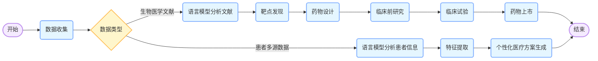

# 语言模型在新药研发全流程优化与个性化医疗方案生成中的应用

> 关键词：语言模型、新药研发、全流程优化、个性化医疗方案、人工智能

> 摘要：本文深入探讨了语言模型在新药研发全流程优化与个性化医疗方案生成中的应用。首先介绍了相关背景，包括目的、预期读者、文档结构等内容。接着阐述了核心概念与联系，通过文本示意图和 Mermaid 流程图进行说明。详细讲解了核心算法原理及具体操作步骤，借助 Python 源代码进行阐述。呈现了数学模型和公式，并举例说明。通过项目实战展示了代码实际案例并进行详细解释。分析了实际应用场景，推荐了相关工具和资源。最后总结了未来发展趋势与挑战，还给出了常见问题解答和扩展阅读参考资料，旨在全面剖析语言模型在医疗领域的重要作用和应用前景。

## 1. 背景介绍 
### 1.1 目的和范围
新药研发是一个复杂且漫长的过程，通常需要耗费大量的时间、人力和资金。据统计，一种新药从研发到上市平均需要 10 - 15 年的时间，成本高达数亿美元。而个性化医疗方案的生成则面临着患者个体差异大、数据处理难度高等问题。本研究的目的在于探索语言模型如何在新药研发的各个环节，如靶点发现、药物设计、临床试验等进行优化，以及如何利用语言模型结合患者的基因信息、病史、生活习惯等多源数据生成个性化的医疗方案。范围涵盖了语言模型在新药研发全流程和个性化医疗方案生成中的理论研究、算法实现和实际应用案例分析。

### 1.2 预期读者
本文预期读者包括生物医学领域的科研人员、医药企业的研发人员、从事人工智能与医疗交叉领域研究的学者、医疗信息系统的开发人员以及对语言模型在医疗领域应用感兴趣的相关人员。

### 1.3 文档结构概述
本文首先介绍语言模型在新药研发和个性化医疗方案生成中的背景信息，包括目的、读者和文档结构等。接着阐述核心概念与联系，包括语言模型、新药研发流程和个性化医疗方案的原理和相互关系，并通过文本示意图和 Mermaid 流程图展示。然后详细讲解核心算法原理和具体操作步骤，用 Python 代码实现。随后给出数学模型和公式，并举例说明。通过项目实战展示代码实际案例并进行解读。分析语言模型在实际中的应用场景，推荐相关的学习资源、开发工具框架和论文著作。最后总结未来发展趋势与挑战，提供常见问题解答和扩展阅读参考资料。

### 1.4 术语表
#### 1.4.1 核心术语定义
- **语言模型**：是一种对语言进行建模的概率模型，用于预测一个词序列出现的概率。在自然语言处理中，语言模型可以用于文本生成、机器翻译、问答系统等任务。
- **新药研发**：指研究和开发新的药物，包括从药物靶点的发现、药物分子的设计、药物的临床试验到药物上市等一系列过程。
- **个性化医疗方案**：根据患者的个体特征，如基因信息、病史、生活习惯等，制定的适合该患者的独特医疗方案。

#### 1.4.2 相关概念解释
- **药物靶点**：是药物在体内作用的特定生物分子，如蛋白质、核酸等。药物通过与靶点结合，调节其功能，从而达到治疗疾病的目的。
- **临床试验**：是新药研发过程中的重要环节，通过在人体上进行试验，评估药物的安全性和有效性。

#### 1.4.3 缩略词列表
- **AI**：Artificial Intelligence，人工智能
- **NLP**：Natural Language Processing，自然语言处理
- **ML**：Machine Learning，机器学习

## 2. 核心概念与联系 
### 2.1 核心概念原理
#### 2.1.1 语言模型原理
语言模型的基本原理是基于概率统计的方法，通过对大量文本数据的学习，计算一个词序列出现的概率。例如，在一个简单的 n - 元语言模型中，假设当前词的出现只依赖于前面的 n - 1 个词。对于一个句子 $w_1, w_2, \cdots, w_m$，其概率可以表示为：
$$P(w_1, w_2, \cdots, w_m) = \prod_{i = 1}^{m} P(w_i | w_1, w_2, \cdots, w_{i - 1})$$
在实际应用中，为了简化计算，通常采用 n - 元近似，即假设 $P(w_i | w_1, w_2, \cdots, w_{i - 1}) \approx P(w_i | w_{i - n + 1}, \cdots, w_{i - 1})$。

近年来，基于深度学习的语言模型得到了广泛的应用，如 Transformer 架构的语言模型。Transformer 模型通过自注意力机制（Self - Attention）来捕捉文本中的长距离依赖关系，从而能够更好地理解文本的语义信息。

#### 2.1.2 新药研发流程原理
新药研发是一个系统的过程，主要包括以下几个阶段：
- **靶点发现**：通过对疾病的病理机制研究，寻找与疾病相关的生物分子作为药物靶点。
- **药物设计**：根据靶点的结构和功能信息，设计能够与靶点特异性结合的药物分子。
- **临床前研究**：在细胞和动物模型上对药物进行安全性和有效性评价。
- **临床试验**：在人体上进行药物的临床试验，分为 I、II、III 期，评估药物的安全性、有效性和剂量等。
- **药物上市**：经过临床试验验证安全有效的药物，获得监管部门批准后上市。

#### 2.1.3 个性化医疗方案生成原理
个性化医疗方案生成的核心是综合考虑患者的个体特征。首先，收集患者的多源数据，包括基因信息、病史、生活习惯等。然后，利用数据分析和机器学习算法对这些数据进行挖掘和分析，提取与疾病相关的特征。最后，根据这些特征为患者制定个性化的医疗方案，如药物选择、治疗剂量、治疗周期等。

### 2.2 核心概念架构的文本示意图
语言模型在新药研发和个性化医疗方案生成中的应用架构可以描述如下：

语言模型作为核心技术，贯穿于新药研发的各个环节和个性化医疗方案生成过程。在新药研发中，语言模型可以对大量的生物医学文献进行分析，辅助靶点发现；可以根据靶点信息和药物化学知识设计药物分子；还可以对临床试验数据进行分析，优化试验方案。在个性化医疗方案生成中，语言模型可以对患者的病历、基因报告等文本信息进行理解和分析，结合患者的个体特征生成个性化的医疗建议。

### 2.3 Mermaid 流程图


## 3. 核心算法原理 & 具体操作步骤 
### 3.1 核心算法原理
在语言模型应用于新药研发和个性化医疗方案生成中，主要涉及到文本分类、命名实体识别、文本生成等自然语言处理任务。这里以基于 Transformer 的语言模型为例进行说明。

Transformer 模型由编码器（Encoder）和解码器（Decoder）组成。编码器的作用是将输入的文本序列转换为一系列的特征向量，解码器则根据这些特征向量生成输出文本。自注意力机制是 Transformer 模型的核心，它可以计算输入序列中每个位置与其他位置的相关性，从而更好地捕捉文本的语义信息。

具体来说，自注意力机制的计算过程如下：
对于输入序列 $X = [x_1, x_2, \cdots, x_n]$，首先将每个输入向量 $x_i$ 分别乘以三个不同的权重矩阵 $W_Q$、$W_K$ 和 $W_V$，得到查询向量 $Q$、键向量 $K$ 和值向量 $V$：
$$Q = XW_Q$$
$$K = XW_K$$
$$V = XW_V$$
然后计算注意力分数：
$$Attention(Q, K, V) = \text{softmax}(\frac{QK^T}{\sqrt{d_k}})V$$
其中，$d_k$ 是查询向量和键向量的维度。

### 3.2 具体操作步骤
#### 3.2.1 数据预处理
首先，收集生物医学文献、患者病历等文本数据。然后对数据进行清洗，去除噪声、特殊字符等。接着进行分词处理，将文本分割成单个的词语或字符。最后，将分词后的文本转换为模型可以接受的数字表示，如词向量。

#### 3.2.2 模型训练
使用预处理后的数据对 Transformer 语言模型进行训练。训练过程中，通过最小化损失函数来调整模型的参数，使得模型能够更好地预测文本序列。常见的损失函数包括交叉熵损失函数。

#### 3.2.3 模型应用
在新药研发中，使用训练好的模型对生物医学文献进行分析，提取与靶点相关的信息，辅助药物设计。在个性化医疗方案生成中，对患者的病历信息进行分析，提取患者的特征，生成个性化的医疗建议。

### 3.3 Python 源代码实现
```python
import torch
import torch.nn as nn
import torch.nn.functional as F

# 定义自注意力机制
class SelfAttention(nn.Module):
    def __init__(self, input_dim, d_k, d_v):
        super(SelfAttention, self).__init__()
        self.W_Q = nn.Linear(input_dim, d_k)
        self.W_K = nn.Linear(input_dim, d_k)
        self.W_V = nn.Linear(input_dim, d_v)

    def forward(self, X):
        Q = self.W_Q(X)
        K = self.W_K(X)
        V = self.W_V(X)
        attn_scores = torch.matmul(Q, K.transpose(-2, -1)) / torch.sqrt(torch.tensor(Q.size(-1), dtype=torch.float32))
        attn_probs = F.softmax(attn_scores, dim=-1)
        output = torch.matmul(attn_probs, V)
        return output

# 定义简单的 Transformer 编码器层
class TransformerEncoderLayer(nn.Module):
    def __init__(self, input_dim, d_k, d_v, hidden_dim):
        super(TransformerEncoderLayer, self).__init__()
        self.self_attn = SelfAttention(input_dim, d_k, d_v)
        self.feed_forward = nn.Sequential(
            nn.Linear(d_v, hidden_dim),
            nn.ReLU(),
            nn.Linear(hidden_dim, input_dim)
        )
        self.norm1 = nn.LayerNorm(input_dim)
        self.norm2 = nn.LayerNorm(input_dim)

    def forward(self, X):
        attn_output = self.self_attn(X)
        X = self.norm1(X + attn_output)
        ff_output = self.feed_forward(X)
        X = self.norm2(X + ff_output)
        return X

# 示例使用
input_dim = 128
d_k = 64
d_v = 64
hidden_dim = 256
batch_size = 32
seq_len = 10

X = torch.randn(batch_size, seq_len, input_dim)
encoder_layer = TransformerEncoderLayer(input_dim, d_k, d_v, hidden_dim)
output = encoder_layer(X)
print(output.shape)
```

## 4. 数学模型和公式 & 详细讲解 & 举例说明 
### 4.1 语言模型的数学模型和公式
#### 4.1.1 n - 元语言模型
如前面所述，n - 元语言模型通过计算条件概率来预测词序列的概率。对于一个 n - 元语言模型，条件概率 $P(w_i | w_{i - n + 1}, \cdots, w_{i - 1})$ 可以通过最大似然估计来计算：
$$P(w_i | w_{i - n + 1}, \cdots, w_{i - 1}) = \frac{C(w_{i - n + 1}, \cdots, w_{i - 1}, w_i)}{C(w_{i - n + 1}, \cdots, w_{i - 1})}$$
其中，$C(w_{i - n + 1}, \cdots, w_{i - 1}, w_i)$ 表示词序列 $(w_{i - n + 1}, \cdots, w_{i - 1}, w_i)$ 在训练数据中出现的次数，$C(w_{i - n + 1}, \cdots, w_{i - 1})$ 表示词序列 $(w_{i - n + 1}, \cdots, w_{i - 1})$ 在训练数据中出现的次数。

例如，在一个二元语言模型中，假设训练数据为 “I like apples. I like bananas.”，要计算 $P(apples | like)$，则 $C(like, apples) = 1$，$C(like) = 2$，所以 $P(apples | like)=\frac{1}{2}$。

#### 4.1.2 Transformer 模型的数学模型
Transformer 模型的核心是自注意力机制，其数学公式如前面所述：
$$Attention(Q, K, V) = \text{softmax}(\frac{QK^T}{\sqrt{d_k}})V$$
这个公式的详细解释如下：
- $QK^T$ 计算查询向量和键向量之间的相似度得分。
- $\frac{1}{\sqrt{d_k}}$ 是一个缩放因子，用于防止点积结果过大，导致 softmax 函数的梯度消失。
- $\text{softmax}$ 函数将相似度得分转换为概率分布。
- 最后，将概率分布与值向量相乘，得到加权和作为输出。

### 4.2 新药研发和个性化医疗方案生成中的数学模型
#### 4.2.1 靶点发现中的数学模型
在靶点发现中，可以使用文本挖掘和机器学习算法来分析生物医学文献，寻找与疾病相关的基因和蛋白质作为靶点。例如，可以使用支持向量机（SVM）对文献中的基因和蛋白质进行分类，判断其是否为潜在的靶点。SVM 的目标是找到一个最优的超平面，使得不同类别的样本之间的间隔最大。其数学模型可以表示为：
$$\min_{w, b} \frac{1}{2} \|w\|^2 + C \sum_{i = 1}^{n} \xi_i$$
$$\text{s.t. } y_i(w^T x_i + b) \geq 1 - \xi_i, \xi_i \geq 0, i = 1, \cdots, n$$
其中，$w$ 是超平面的法向量，$b$ 是偏置项，$C$ 是惩罚参数，$\xi_i$ 是松弛变量，$x_i$ 是样本特征向量，$y_i$ 是样本标签。

#### 4.2.2 个性化医疗方案生成中的数学模型
在个性化医疗方案生成中，可以使用多变量回归模型来预测患者的疾病风险和治疗效果。例如，对于一个线性回归模型：
$$y = \beta_0 + \beta_1 x_1 + \beta_2 x_2 + \cdots + \beta_p x_p + \epsilon$$
其中，$y$ 是预测的疾病风险或治疗效果，$x_1, x_2, \cdots, x_p$ 是患者的特征变量，$\beta_0, \beta_1, \cdots, \beta_p$ 是回归系数，$\epsilon$ 是误差项。

通过最小化误差平方和来估计回归系数：
$$\min_{\beta_0, \beta_1, \cdots, \beta_p} \sum_{i = 1}^{n} (y_i - (\beta_0 + \beta_1 x_{i1} + \beta_2 x_{i2} + \cdots + \beta_p x_{ip}))^2$$

## 5. 项目实战：代码实际案例和详细解释说明 
### 5.1 开发环境搭建
#### 5.1.1 安装 Python
首先，确保系统中已经安装了 Python 3.6 及以上版本。可以从 Python 官方网站（https://www.python.org/downloads/） 下载并安装。

#### 5.1.2 安装深度学习框架
本项目使用 PyTorch 作为深度学习框架。可以使用以下命令安装 PyTorch：
```bash
pip install torch torchvision
```

#### 5.1.3 安装其他依赖库
还需要安装一些其他的依赖库，如 `numpy`、`pandas`、`scikit - learn` 等。可以使用以下命令安装：
```bash
pip install numpy pandas scikit-learn
```

### 5.2 源代码详细实现和代码解读
#### 5.2.1 数据加载和预处理
```python
import pandas as pd
from sklearn.model_selection import train_test_split
from torch.utils.data import Dataset, DataLoader
import torch

# 定义数据集类
class MedicalDataset(Dataset):
    def __init__(self, texts, labels):
        self.texts = texts
        self.labels = labels

    def __len__(self):
        return len(self.texts)

    def __getitem__(self, idx):
        text = self.texts[idx]
        label = self.labels[idx]
        return text, label

# 加载数据
data = pd.read_csv('medical_data.csv')
texts = data['text'].tolist()
labels = data['label'].tolist()

# 划分训练集和测试集
train_texts, test_texts, train_labels, test_labels = train_test_split(texts, labels, test_size=0.2, random_state=42)

# 创建数据集和数据加载器
train_dataset = MedicalDataset(train_texts, train_labels)
test_dataset = MedicalDataset(test_texts, test_labels)

train_dataloader = DataLoader(train_dataset, batch_size=32, shuffle=True)
test_dataloader = DataLoader(test_dataset, batch_size=32, shuffle=False)
```
代码解读：
- 首先定义了一个 `MedicalDataset` 类，用于封装文本数据和标签。
- 然后使用 `pandas` 库加载数据，并将文本和标签分别存储在列表中。
- 使用 `train_test_split` 函数将数据划分为训练集和测试集。
- 最后创建数据集和数据加载器，方便后续的训练和测试。

#### 5.2.2 定义模型
```python
import torch.nn as nn

class MedicalClassifier(nn.Module):
    def __init__(self, input_dim, hidden_dim, output_dim):
        super(MedicalClassifier, self).__init__()
        self.fc1 = nn.Linear(input_dim, hidden_dim)
        self.relu = nn.ReLU()
        self.fc2 = nn.Linear(hidden_dim, output_dim)

    def forward(self, x):
        x = self.fc1(x)
        x = self.relu(x)
        x = self.fc2(x)
        return x

# 初始化模型
input_dim = 128
hidden_dim = 256
output_dim = 2
model = MedicalClassifier(input_dim, hidden_dim, output_dim)
```
代码解读：
- 定义了一个简单的全连接神经网络 `MedicalClassifier`，包含两个全连接层和一个 ReLU 激活函数。
- 初始化模型时，指定输入维度、隐藏维度和输出维度。

#### 5.2.3 训练模型
```python
import torch.optim as optim

# 定义损失函数和优化器
criterion = nn.CrossEntropyLoss()
optimizer = optim.Adam(model.parameters(), lr=0.001)

# 训练模型
num_epochs = 10
for epoch in range(num_epochs):
    model.train()
    running_loss = 0.0
    for texts, labels in train_dataloader:
        optimizer.zero_grad()
        outputs = model(texts)
        loss = criterion(outputs, labels)
        loss.backward()
        optimizer.step()
        running_loss += loss.item()
    print(f'Epoch {epoch + 1}, Loss: {running_loss / len(train_dataloader)}')
```
代码解读：
- 定义了交叉熵损失函数和 Adam 优化器。
- 在训练循环中，遍历训练数据加载器，计算损失并进行反向传播和参数更新。

#### 5.2.4 测试模型
```python
model.eval()
correct = 0
total = 0
with torch.no_grad():
    for texts, labels in test_dataloader:
        outputs = model(texts)
        _, predicted = torch.max(outputs.data, 1)
        total += labels.size(0)
        correct += (predicted == labels).sum().item()

print(f'Accuracy: {100 * correct / total}%')
```
代码解读：
- 将模型设置为评估模式，关闭梯度计算。
- 遍历测试数据加载器，计算预测结果并统计准确率。

### 5.3 代码解读与分析
#### 5.3.1 数据处理部分
数据处理部分主要完成了数据的加载、划分和封装。使用 `pandas` 库可以方便地读取 CSV 格式的数据，`train_test_split` 函数可以将数据随机划分为训练集和测试集，`Dataset` 和 `DataLoader` 类可以将数据封装成适合 PyTorch 训练的格式。

#### 5.3.2 模型定义部分
模型定义部分使用了一个简单的全连接神经网络。全连接层可以将输入特征映射到隐藏层，ReLU 激活函数可以引入非线性，最后一个全连接层将隐藏层的输出映射到输出维度。

#### 5.3.3 训练部分
训练部分使用了交叉熵损失函数和 Adam 优化器。交叉熵损失函数适用于多分类问题，Adam 优化器是一种自适应学习率的优化算法，可以自动调整学习率。在训练循环中，通过反向传播和参数更新来不断优化模型的参数。

#### 5.3.4 测试部分
测试部分将模型设置为评估模式，关闭梯度计算，以提高计算效率。通过计算预测结果和真实标签的准确率来评估模型的性能。

## 6. 实际应用场景 
### 6.1 新药研发中的应用
#### 6.1.1 靶点发现
语言模型可以对大量的生物医学文献进行分析，提取与疾病相关的基因和蛋白质信息，辅助科研人员发现潜在的药物靶点。例如，通过分析文献中关于疾病机制的描述，语言模型可以识别出与疾病发生发展密切相关的基因和蛋白质，为新药研发提供方向。

#### 6.1.2 药物设计
在药物设计阶段，语言模型可以结合靶点信息和药物化学知识，生成可能的药物分子结构。通过对已知药物分子和靶点相互作用的文献进行学习，语言模型可以预测新的药物分子与靶点的结合亲和力，从而筛选出有潜力的药物分子。

#### 6.1.3 临床试验优化
语言模型可以对临床试验数据进行分析，优化试验方案。例如，通过分析患者的病历信息和试验数据，语言模型可以预测患者对不同治疗方案的反应，从而选择最适合的患者入组试验，提高试验的效率和成功率。

### 6.2 个性化医疗方案生成中的应用
#### 6.2.1 患者信息分析
语言模型可以对患者的病历、基因报告等文本信息进行分析，提取患者的特征。例如，通过分析病历中的症状描述、诊断结果等信息，语言模型可以识别出患者的疾病类型、严重程度等特征，为个性化医疗方案的生成提供依据。

#### 6.2.2 治疗方案推荐
根据患者的个体特征，语言模型可以结合医学知识和临床经验，为患者推荐个性化的治疗方案。例如，对于患有糖尿病的患者，语言模型可以根据患者的血糖水平、并发症情况、生活习惯等信息，推荐适合的药物治疗方案、饮食控制方案和运动方案。

#### 6.2.3 治疗效果预测
语言模型可以对患者的治疗效果进行预测，帮助医生及时调整治疗方案。通过分析患者的治疗历史、当前症状等信息，语言模型可以预测患者在不同治疗方案下的治疗效果，如疾病缓解率、复发率等，为医生的决策提供参考。

## 7. 工具和资源推荐
### 7.1 学习资源推荐
#### 7.1.1 书籍推荐
- 《自然语言处理入门》：这本书系统地介绍了自然语言处理的基本概念、算法和应用，适合初学者入门。
- 《深度学习》：由 Ian Goodfellow、Yoshua Bengio 和 Aaron Courville 合著，是深度学习领域的经典教材，涵盖了深度学习的理论和实践。
- 《生物信息学》：介绍了生物信息学的基本原理和方法，包括基因序列分析、蛋白质结构预测等内容，对于理解新药研发中的生物信息处理有很大帮助。

#### 7.1.2 在线课程
- Coursera 上的 “Natural Language Processing Specialization”：由顶尖大学的教授授课，全面介绍了自然语言处理的各个方面。
- edX 上的 “Deep Learning for Everyone”：适合初学者学习深度学习的基本概念和方法。
- 中国大学 MOOC 上的 “生物信息学”：由国内知名高校的教师授课，讲解生物信息学的相关知识。

#### 7.1.3 技术博客和网站
- arXiv：是一个预印本平台，上面有很多关于自然语言处理、生物信息学等领域的最新研究成果。
- Medium：有很多技术博主分享自然语言处理和医疗领域的技术文章和实践经验。
- Bioinformatics.org：是一个生物信息学的专业网站，提供了丰富的生物信息学资源和工具。

### 7.2 开发工具框架推荐
#### 7.2.1 IDE和编辑器
- PyCharm：是一款专业的 Python 集成开发环境，具有代码编辑、调试、版本控制等功能，适合 Python 开发。
- Jupyter Notebook：是一个交互式的开发环境，适合进行数据探索和模型实验。
- Visual Studio Code：是一款轻量级的代码编辑器，支持多种编程语言和插件，具有丰富的扩展功能。

#### 7.2.2 调试和性能分析工具
- PyTorch Profiler：是 PyTorch 提供的性能分析工具，可以帮助开发者分析模型的性能瓶颈，优化代码。
- TensorBoard：是 TensorFlow 提供的可视化工具，也可以与 PyTorch 结合使用，用于可视化模型的训练过程和性能指标。
- cProfile：是 Python 内置的性能分析工具，可以分析代码的执行时间和函数调用情况。

#### 7.2.3 相关框架和库
- PyTorch：是一个开源的深度学习框架，具有动态计算图、高效的 GPU 支持等特点，广泛应用于自然语言处理和医疗领域。
- Hugging Face Transformers：是一个基于 PyTorch 和 TensorFlow 的自然语言处理库，提供了预训练的语言模型和相关工具，方便开发者快速实现自然语言处理任务。
- BioPython：是一个用于生物信息学的 Python 库，提供了丰富的生物信息处理工具和数据结构。

### 7.3 相关论文著作推荐
#### 7.3.1 经典论文
- “Attention Is All You Need”：介绍了 Transformer 模型的原理和实现，是自然语言处理领域的经典论文。
- “Deep Learning in Drug Discovery”：探讨了深度学习在药物研发中的应用，为语言模型在新药研发中的应用提供了理论基础。
- “Personalized Medicine: A New Paradigm for Drug Development and Healthcare”：阐述了个性化医疗的概念和发展趋势，对个性化医疗方案生成的研究具有重要的指导意义。

#### 7.3.2 最新研究成果
- 关注顶级学术会议如 ACL（Association for Computational Linguistics）、NeurIPS（Neural Information Processing Systems）、Bioinformatics 等上的最新研究成果，了解语言模型在新药研发和个性化医疗方案生成中的最新进展。
- 查阅知名学术期刊如 Nature、Science、Cell 等上的相关研究论文，获取前沿的科研成果。

#### 7.3.3 应用案例分析
- 分析一些成功的语言模型在医疗领域的应用案例，如 IBM Watson for Oncology 在癌症治疗方案推荐中的应用，了解实际应用中的挑战和解决方案。

## 8. 总结：未来发展趋势与挑战
### 8.1 未来发展趋势
#### 8.1.1 多模态融合
未来，语言模型将与图像、视频、音频等多模态数据融合，为新药研发和个性化医疗方案生成提供更全面的信息。例如，结合医学影像数据和病历文本信息，语言模型可以更准确地诊断疾病和制定治疗方案。

#### 8.1.2 强化学习与语言模型结合
强化学习可以通过与环境的交互来优化决策，将强化学习与语言模型结合，可以实现更智能的药物研发和个性化医疗方案生成。例如，在药物临床试验中，通过强化学习可以动态调整试验方案，提高试验效率。

#### 8.1.3 跨学科合作
语言模型在新药研发和个性化医疗方案生成中的应用需要计算机科学、生物学、医学等多学科的合作。未来，跨学科的研究团队将不断涌现，推动该领域的快速发展。

### 8.2 挑战
#### 8.2.1 数据质量和隐私问题
生物医学数据和患者信息通常具有高度的敏感性和隐私性，如何在保护数据隐私的前提下，获取高质量的数据是一个挑战。此外，数据的标注和清洗也需要大量的人力和时间成本。

#### 8.2.2 模型可解释性
语言模型通常是黑盒模型，其决策过程难以解释。在医疗领域，模型的可解释性至关重要，医生和患者需要了解模型的决策依据。因此，如何提高语言模型的可解释性是一个亟待解决的问题。

#### 8.2.3 伦理和法律问题
语言模型在新药研发和个性化医疗方案生成中的应用涉及到伦理和法律问题，如数据的所有权、模型的责任认定等。如何制定相应的伦理和法律规范，保障患者的权益和社会的公平正义，是一个需要深入研究的问题。

## 9. 附录：常见问题与解答
### 9.1 语言模型在新药研发和个性化医疗方案生成中的准确性如何保证？
语言模型的准确性可以通过以下几个方面来保证：
- **数据质量**：使用高质量、标注准确的训练数据，对数据进行严格的清洗和预处理。
- **模型选择和调优**：选择合适的语言模型架构，并通过交叉验证等方法进行模型调优，优化模型的超参数。
- **集成学习**：可以使用多个语言模型进行集成，通过投票或平均等方法提高预测的准确性。
- **人工审核**：在实际应用中，对于重要的决策，如药物研发的靶点选择和个性化医疗方案的生成，需要人工审核和验证。

### 9.2 语言模型在处理生物医学文本时面临哪些挑战？
语言模型在处理生物医学文本时面临以下挑战：
- **术语复杂性**：生物医学领域有大量的专业术语和缩写，语言模型需要准确理解这些术语的含义。
- **语义歧义**：生物医学文本中存在语义歧义的情况，例如同一个术语在不同的上下文中可能有不同的含义。
- **数据稀疏性**：生物医学数据相对较少，语言模型在训练时可能会面临数据稀疏的问题，导致模型的泛化能力不足。

### 9.3 如何将语言模型与现有的医疗信息系统集成？
将语言模型与现有的医疗信息系统集成可以通过以下步骤实现：
- **接口设计**：设计语言模型与医疗信息系统之间的接口，明确数据的输入和输出格式。
- **数据交互**：通过接口实现语言模型与医疗信息系统之间的数据交互，将医疗信息系统中的数据传递给语言模型进行处理，将语言模型的输出结果返回给医疗信息系统。
- **系统测试**：对集成后的系统进行全面的测试，确保系统的稳定性和可靠性。

## 10. 扩展阅读 & 参考资料
### 10.1 扩展阅读
- 《人工智能医学》：深入探讨了人工智能在医学领域的应用，包括疾病诊断、治疗方案推荐等方面。
- 《自然语言处理实战》：通过实际案例介绍自然语言处理的应用和实现方法。
- 《精准医学》：介绍了精准医学的概念、技术和应用，对个性化医疗方案生成有深入的阐述。

### 10.2 参考资料
- 相关学术论文：在撰写本文过程中，参考了大量的学术论文，如 “Transformer - based Language Models for Biomedical Text Mining”、“Personalized Medicine: Challenges and Opportunities” 等。
- 官方文档：参考了 PyTorch、Hugging Face Transformers 等框架和库的官方文档。
- 行业报告：参考了一些医疗行业的市场研究报告和技术趋势报告，了解语言模型在医疗领域的应用现状和发展趋势。