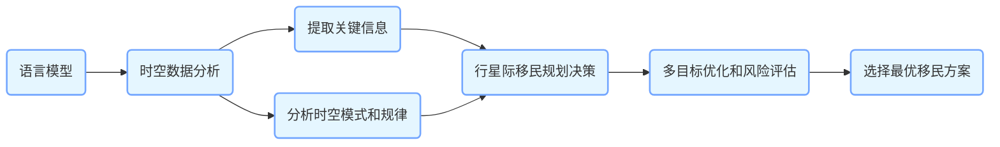

# 语言模型在时空数据分析与行星际移民规划决策中的创新研究

> 关键词：语言模型、时空数据分析、行星际移民、规划决策、创新应用

> 摘要：本文聚焦于语言模型在时空数据分析与行星际移民规划决策中的创新研究。首先阐述了相关研究的背景与目的，介绍了预期读者和文档结构。接着深入剖析了语言模型、时空数据分析、行星际移民规划决策等核心概念及其联系，并给出相应的原理和架构示意图。详细讲解了核心算法原理，结合 Python 源代码说明具体操作步骤，同时给出相关数学模型和公式并举例。通过项目实战，展示了语言模型在该领域的代码实现与解读。探讨了其实际应用场景，推荐了相关学习资源、开发工具框架以及论文著作。最后总结了未来发展趋势与挑战，提供常见问题解答和扩展阅读参考资料，旨在为语言模型在时空数据分析与行星际移民规划决策领域的进一步研究和应用提供全面而深入的指导。

## 1. 背景介绍 
### 1.1 目的和范围
随着人类对宇宙探索的不断深入，行星际移民逐渐从科幻设想走向现实研究。时空数据分析作为理解宇宙环境和天体特征的关键手段，对于行星际移民规划决策具有重要意义。语言模型作为人工智能领域的重要成果，其强大的自然语言处理能力为时空数据分析和行星际移民规划决策带来了新的机遇。本文的目的在于探索语言模型在时空数据分析与行星际移民规划决策中的创新应用，通过理论分析、算法实现、项目实战等方式，深入研究其可行性和有效性，为相关领域的研究和实践提供理论支持和技术参考。

本文的研究范围涵盖了语言模型的基本原理、时空数据分析的方法和技术、行星际移民规划决策的关键因素和流程，以及语言模型在这些领域的具体应用场景和实现方式。同时，对相关的数学模型、算法原理、代码实现等进行详细阐述，并结合实际案例进行分析和验证。

### 1.2 预期读者
本文预期读者包括但不限于以下几类人群：
- **科研人员**：从事人工智能、天文学、航天工程等相关领域的科研人员，希望通过本文了解语言模型在时空数据分析与行星际移民规划决策中的最新研究成果和应用方法，为其科研工作提供新的思路和方向。
- **工程师和技术人员**：涉及软件开发、数据分析、航天系统设计等领域的工程师和技术人员，期望从本文中获取语言模型在实际项目中的具体实现方法和技术细节，以便在工作中应用相关技术。
- **学生**：对人工智能、天文学、航天科学等领域感兴趣的学生，通过阅读本文可以拓宽知识面，了解跨学科研究的方法和应用，为其后续的学习和研究打下基础。
- **政策制定者和决策者**：负责制定航天发展战略、行星际移民规划等政策的相关人员，通过本文可以了解语言模型在行星际移民规划决策中的作用和价值，为政策制定提供科学依据。

### 1.3 文档结构概述
本文共分为十个部分，具体结构如下：
1. **背景介绍**：介绍研究的目的和范围、预期读者、文档结构概述以及相关术语表。
2. **核心概念与联系**：阐述语言模型、时空数据分析、行星际移民规划决策等核心概念的原理和架构，并给出相应的示意图和流程图。
3. **核心算法原理 & 具体操作步骤**：详细讲解语言模型在时空数据分析与行星际移民规划决策中应用的核心算法原理，并结合 Python 源代码说明具体操作步骤。
4. **数学模型和公式 & 详细讲解 & 举例说明**：给出相关的数学模型和公式，并进行详细讲解和举例说明。
5. **项目实战：代码实际案例和详细解释说明**：通过项目实战，展示语言模型在时空数据分析与行星际移民规划决策中的代码实现和详细解释说明。
6. **实际应用场景**：探讨语言模型在时空数据分析与行星际移民规划决策中的实际应用场景。
7. **工具和资源推荐**：推荐相关的学习资源、开发工具框架以及论文著作。
8. **总结：未来发展趋势与挑战**：总结语言模型在时空数据分析与行星际移民规划决策中的未来发展趋势和面临的挑战。
9. **附录：常见问题与解答**：提供常见问题的解答，帮助读者更好地理解和应用相关技术。
10. **扩展阅读 & 参考资料**：提供扩展阅读的建议和相关参考资料，方便读者进一步深入研究。

### 1.4 术语表
#### 1.4.1 核心术语定义
- **语言模型**：是一种基于概率统计的模型，用于描述语言的概率分布，能够根据给定的上下文预测下一个词或字符的概率。
- **时空数据分析**：是指对具有时间和空间属性的数据进行收集、存储、分析和可视化的过程，旨在发现数据中的时空模式和规律。
- **行星际移民**：是指人类从地球向其他行星或天体迁移并建立定居点的过程。
- **规划决策**：是指在面对复杂问题和多种方案时，通过分析、评估和比较，选择最优方案的过程。

#### 1.4.2 相关概念解释
- **自然语言处理**：是人工智能领域的一个重要分支，旨在让计算机能够理解、处理和生成自然语言。
- **机器学习**：是一门多领域交叉学科，涉及概率论、统计学、逼近论、凸分析、算法复杂度理论等多门学科，它专门研究计算机怎样模拟或实现人类的学习行为，以获取新的知识或技能，重新组织已有的知识结构使之不断改善自身的性能。
- **深度学习**：是机器学习的一个分支领域，它是一种基于对数据进行表征学习的方法，通过构建具有多个层次的神经网络模型，自动从数据中学习特征和模式。

#### 1.4.3 缩略词列表
- **NLP**：Natural Language Processing，自然语言处理
- **ML**：Machine Learning，机器学习
- **DL**：Deep Learning，深度学习
- **GPT**：Generative Pretrained Transformer，生成式预训练变换器

## 2. 核心概念与联系 

### 语言模型原理
语言模型的核心目标是对语言的概率分布进行建模，以预测文本序列中每个词或字符的出现概率。常见的语言模型包括基于统计的语言模型和基于神经网络的语言模型。

基于统计的语言模型，如 n - 元语法模型（n - gram model），是一种简单而有效的语言模型。它基于马尔可夫假设，即一个词的出现概率只与它前面的 n - 1 个词有关。例如，二元语法模型（bigram model）假设一个词的出现概率只与它前面的一个词有关。

基于神经网络的语言模型，如循环神经网络（RNN）、长短期记忆网络（LSTM）和生成式预训练变换器（GPT）等，通过神经网络的强大学习能力，能够捕捉到更复杂的语言模式和上下文信息。这些模型通常在大规模语料库上进行预训练，然后在特定任务上进行微调。

### 时空数据分析原理
时空数据分析主要包括时空数据的收集、存储、处理和分析等环节。时空数据通常具有时间和空间两个维度的属性，如地理位置、时间戳等。

时空数据的收集可以通过传感器、卫星、观测站等多种方式进行。收集到的时空数据需要进行存储和管理，常见的时空数据库包括 PostGIS、MongoDB 等。

时空数据分析的方法包括时空聚类、时空预测、时空关联分析等。这些方法可以帮助我们发现时空数据中的模式和规律，为决策提供支持。

### 行星际移民规划决策原理
行星际移民规划决策是一个复杂的系统工程，需要考虑多个方面的因素，如目标行星的环境条件、资源状况、交通成本、人类生存需求等。

在行星际移民规划决策中，需要进行多目标优化和风险评估。通过建立数学模型和仿真模拟，对不同的移民方案进行评估和比较，选择最优方案。

### 核心概念的联系
语言模型在时空数据分析与行星际移民规划决策中具有重要的作用。在时空数据分析中，语言模型可以用于处理和分析与时空数据相关的文本信息，如科学文献、观测报告等，帮助提取关键信息和知识。在行星际移民规划决策中，语言模型可以用于生成移民方案、评估风险和进行决策支持，通过自然语言处理技术与决策者进行交互，提供智能化的决策建议。

### 文本示意图
```plaintext
语言模型
    |
    | 处理文本信息
    |
时空数据分析 ---- 提取关键信息 ---- 为行星际移民规划决策提供数据支持
    |
    | 分析时空模式和规律
    |
行星际移民规划决策 ---- 多目标优化和风险评估 ---- 选择最优移民方案
```

### Mermaid 流程图


## 3. 核心算法原理 & 具体操作步骤 

### 核心算法原理
在语言模型应用于时空数据分析与行星际移民规划决策中，主要涉及到文本分类、信息提取、文本生成等算法。

#### 文本分类算法
文本分类是将文本划分到不同类别的任务。常见的文本分类算法包括朴素贝叶斯分类器、支持向量机（SVM）、深度学习分类器等。

以深度学习分类器为例，通常使用卷积神经网络（CNN）或循环神经网络（RNN）来构建文本分类模型。这些模型通过对文本进行特征提取和分类，将文本划分到不同的类别中。

#### 信息提取算法
信息提取是从文本中提取关键信息的任务。常见的信息提取算法包括命名实体识别（NER）、关系抽取等。

命名实体识别是识别文本中具有特定意义的实体，如人名、地名、组织机构名等。关系抽取是识别文本中实体之间的关系，如因果关系、从属关系等。

#### 文本生成算法
文本生成是根据给定的输入生成文本的任务。常见的文本生成算法包括基于规则的生成算法、基于统计的生成算法和基于神经网络的生成算法。

基于神经网络的文本生成算法，如 GPT 模型，通过在大规模语料库上进行预训练，学习到语言的概率分布，然后根据输入的上下文生成相应的文本。

### 具体操作步骤（Python 源代码实现）

#### 文本分类示例
```python
import numpy as np
from sklearn.feature_extraction.text import TfidfVectorizer
from sklearn.naive_bayes import MultinomialNB
from sklearn.model_selection import train_test_split

# 示例数据
texts = ["This is a positive review", "This is a negative review", "Another positive one", "Another negative one"]
labels = [1, 0, 1, 0]

# 数据预处理
vectorizer = TfidfVectorizer()
X = vectorizer.fit_transform(texts)
y = np.array(labels)

# 划分训练集和测试集
X_train, X_test, y_train, y_test = train_test_split(X, y, test_size=0.2, random_state=42)

# 训练模型
model = MultinomialNB()
model.fit(X_train, y_train)

# 预测
predictions = model.predict(X_test)
print("Predictions:", predictions)
```

#### 命名实体识别示例
```python
import spacy

# 加载英文语言模型
nlp = spacy.load("en_core_web_sm")

# 示例文本
text = "Apple is looking at buying U.K. startup for $1 billion"

# 处理文本
doc = nlp(text)

# 提取命名实体
for ent in doc.ents:
    print(ent.text, ent.start_char, ent.end_char, ent.label_)
```

#### 文本生成示例
```python
from transformers import GPT2LMHeadModel, GPT2Tokenizer

# 加载模型和分词器
tokenizer = GPT2Tokenizer.from_pretrained("gpt2")
model = GPT2LMHeadModel.from_pretrained("gpt2")

# 输入文本
input_text = "Once upon a time"

# 编码输入文本
input_ids = tokenizer.encode(input_text, return_tensors="pt")

# 生成文本
output = model.generate(input_ids, max_length=100, num_beams=5, no_repeat_ngram_size=2, early_stopping=True)

# 解码生成的文本
generated_text = tokenizer.decode(output[0], skip_special_tokens=True)
print("Generated text:", generated_text)
```

## 4. 数学模型和公式 & 详细讲解 & 举例说明 

### 文本分类的数学模型
#### 朴素贝叶斯分类器
朴素贝叶斯分类器基于贝叶斯定理和特征条件独立假设。对于一个文本分类问题，假设我们有 $C$ 个类别 $c_1, c_2, \cdots, c_C$，文本 $x$ 由 $n$ 个特征 $x_1, x_2, \cdots, x_n$ 组成。

根据贝叶斯定理，文本 $x$ 属于类别 $c_i$ 的后验概率为：

$$P(c_i|x) = \frac{P(x|c_i)P(c_i)}{P(x)}$$

由于 $P(x)$ 对于所有类别都是相同的，因此在分类时可以忽略。根据特征条件独立假设，$P(x|c_i)$ 可以表示为：

$$P(x|c_i) = \prod_{j=1}^{n} P(x_j|c_i)$$

则文本 $x$ 属于类别 $c_i$ 的概率可以表示为：

$$P(c_i|x) \propto P(c_i) \prod_{j=1}^{n} P(x_j|c_i)$$

分类器选择具有最大后验概率的类别作为文本的类别，即：

$$\hat{c} = \arg \max_{c_i} P(c_i|x) = \arg \max_{c_i} P(c_i) \prod_{j=1}^{n} P(x_j|c_i)$$

#### 举例说明
假设有一个文本分类问题，要将文本分为“体育”和“科技”两个类别。我们有以下训练数据：

| 文本 | 类别 |
| ---- | ---- |
| “The football game was exciting” | 体育 |
| “The new smartphone is amazing” | 科技 |

我们可以计算每个类别的先验概率 $P(c_i)$ 和每个特征（词）在每个类别中的条件概率 $P(x_j|c_i)$。例如，对于类别“体育”，先验概率 $P(体育)$ 可以计算为训练数据中属于“体育”类别的文本数量除以总文本数量。对于特征“football”，在类别“体育”中的条件概率 $P(football|体育)$ 可以计算为在“体育”类别的文本中出现“football”的次数除以“体育”类别的文本中所有词的出现次数。

### 信息提取的数学模型
#### 命名实体识别
命名实体识别可以看作是一个序列标注问题，通常使用隐马尔可夫模型（HMM）或条件随机场（CRF）来解决。

以条件随机场为例，假设我们有一个输入序列 $x = (x_1, x_2, \cdots, x_n)$ 和一个标注序列 $y = (y_1, y_2, \cdots, y_n)$。条件随机场的目标是计算在给定输入序列 $x$ 的条件下，标注序列 $y$ 的条件概率 $P(y|x)$。

条件随机场的概率计算公式为：

$$P(y|x) = \frac{1}{Z(x)} \exp \left( \sum_{i=1}^{n} \sum_{k} \lambda_k f_k(y_{i-1}, y_i, x, i) \right)$$

其中，$Z(x)$ 是归一化因子，$\lambda_k$ 是特征函数 $f_k$ 的权重，$f_k(y_{i-1}, y_i, x, i)$ 是特征函数，用于描述标注序列 $y$ 在位置 $i$ 处的局部特征。

#### 举例说明
假设有一个句子“John lives in New York”，我们要对其中的命名实体进行识别。我们可以定义一些特征函数，如词本身、词的词性、词的前后文等。例如，一个特征函数可以是“当前词是人名”，另一个特征函数可以是“当前词前面的词是介词”。通过训练条件随机场模型，我们可以学习到这些特征函数的权重，从而对句子中的命名实体进行标注。

### 文本生成的数学模型
#### GPT 模型
GPT 模型基于 Transformer 架构，通过自注意力机制学习语言的概率分布。GPT 模型的目标是最大化训练数据的似然函数：

$$L(\theta) = \sum_{i=1}^{N} \log P(x_i|x_{<i}; \theta)$$

其中，$\theta$ 是模型的参数，$x_i$ 是第 $i$ 个词，$x_{<i}$ 是 $x_i$ 之前的词序列。

在生成文本时，GPT 模型根据输入的上下文 $x_{<t}$ 预测下一个词 $x_t$ 的概率分布：

$$P(x_t|x_{<t}; \theta) = \text{softmax}(W_{vocab} h_t + b_{vocab})$$

其中，$W_{vocab}$ 是词表矩阵，$h_t$ 是 Transformer 模型在时间步 $t$ 的隐藏状态，$b_{vocab}$ 是偏置项。

#### 举例说明
假设我们输入的上下文是“Once upon a time”，GPT 模型会根据这个上下文预测下一个词的概率分布。例如，预测下一个词可能是“there”的概率为 0.3，“a”的概率为 0.2 等。我们可以根据这个概率分布选择下一个词，然后将其添加到上下文中，继续预测下一个词，直到生成所需长度的文本。

## 5. 项目实战：代码实际案例和详细解释说明 

### 5.1  开发环境搭建
#### 操作系统
可以选择 Linux、Windows 或 macOS 等操作系统。本项目推荐使用 Linux 系统，如 Ubuntu 18.04 或更高版本。

#### Python 环境
安装 Python 3.7 或更高版本。可以使用 Anaconda 或 Miniconda 来管理 Python 环境。

#### 依赖库安装
使用以下命令安装项目所需的依赖库：
```sh
pip install numpy scikit-learn spacy transformers
```

#### 下载预训练模型
对于 Spacy 模型，可以使用以下命令下载英文语言模型：
```sh
python -m spacy download en_core_web_sm
```

对于 Transformer 模型，可以在代码中自动下载预训练模型，也可以手动下载并保存到本地。

### 5.2  源代码详细实现和代码解读
#### 项目需求
我们要实现一个简单的时空数据分析与行星际移民规划决策系统，使用语言模型处理相关的文本信息，提取关键信息并生成决策建议。

#### 代码实现
```python
import spacy
from transformers import GPT2LMHeadModel, GPT2Tokenizer

# 加载 Spacy 模型
nlp = spacy.load("en_core_web_sm")

# 加载 GPT2 模型和分词器
tokenizer = GPT2Tokenizer.from_pretrained("gpt2")
model = GPT2LMHeadModel.from_pretrained("gpt2")

def extract_entities(text):
    """
    提取文本中的命名实体
    :param text: 输入文本
    :return: 命名实体列表
    """
    doc = nlp(text)
    entities = []
    for ent in doc.ents:
        entities.append((ent.text, ent.label_))
    return entities

def generate_decision_suggestion(context):
    """
    根据上下文生成决策建议
    :param context: 输入上下文
    :return: 生成的决策建议
    """
    input_ids = tokenizer.encode(context, return_tensors="pt")
    output = model.generate(input_ids, max_length=200, num_beams=5, no_repeat_ngram_size=2, early_stopping=True)
    generated_text = tokenizer.decode(output[0], skip_special_tokens=True)
    return generated_text

# 示例文本
text = "The Mars mission is planned for 2030. The estimated cost is $10 billion."

# 提取命名实体
entities = extract_entities(text)
print("Entities:", entities)

# 生成决策建议
context = "Based on the Mars mission information: " + text + " What should we do next?"
suggestion = generate_decision_suggestion(context)
print("Decision suggestion:", suggestion)
```

#### 代码解读
- **extract_entities 函数**：使用 Spacy 模型提取文本中的命名实体。首先将输入文本传递给 Spacy 模型进行处理，然后遍历处理结果中的实体，将实体的文本和标签添加到列表中并返回。
- **generate_decision_suggestion 函数**：使用 GPT2 模型根据输入的上下文生成决策建议。首先将上下文编码为输入 ID，然后使用 GPT2 模型进行文本生成，最后将生成的文本解码并返回。
- **主程序**：定义了一个示例文本，调用 `extract_entities` 函数提取命名实体并打印结果。然后构造一个上下文，调用 `generate_decision_suggestion` 函数生成决策建议并打印结果。

### 5.3  代码解读与分析
#### 优点
- **简单易用**：使用了成熟的自然语言处理库和预训练模型，代码实现简单，易于理解和扩展。
- **功能强大**：结合了命名实体识别和文本生成功能，可以处理文本信息并生成决策建议。

#### 缺点
- **准确性有限**：预训练模型的性能可能受到训练数据和任务的限制，生成的决策建议可能不够准确。
- **缺乏领域知识**：模型没有充分利用时空数据分析和行星际移民规划决策的领域知识，可能无法提供针对性的建议。

#### 改进方向
- **微调模型**：在特定领域的数据集上对预训练模型进行微调，提高模型的准确性和针对性。
- **融合领域知识**：将时空数据分析和行星际移民规划决策的领域知识融入到模型中，如行星环境数据、移民成本模型等，以生成更准确和有用的决策建议。

## 6. 实际应用场景 
### 时空数据文本信息处理
在时空数据分析中，存在大量的文本信息，如科学文献、观测报告、新闻报道等。语言模型可以用于处理这些文本信息，提取关键信息，如天体名称、观测时间、地理位置等。例如，在天文学研究中，语言模型可以帮助科学家从大量的文献中快速找到与特定天体相关的信息，提高研究效率。

### 行星际移民可行性评估
在行星际移民规划决策中，需要对目标行星的可行性进行评估。语言模型可以用于分析与目标行星相关的文本信息，如行星的环境条件、资源状况、人类生存需求等，生成可行性评估报告。例如，通过分析火星探测任务的相关文本信息，语言模型可以生成关于火星移民可行性的评估报告，为决策提供参考。

### 移民方案生成与优化
语言模型可以根据给定的条件和目标，生成行星际移民方案。例如，根据目标行星的环境条件、资源状况、移民人数等因素，语言模型可以生成不同的移民方案，并对这些方案进行优化。同时，语言模型可以与决策者进行交互，根据决策者的反馈对移民方案进行调整和改进。

### 风险评估与预警
在行星际移民过程中，存在各种风险，如太空辐射、行星环境变化、技术故障等。语言模型可以用于分析与这些风险相关的文本信息，如科学研究报告、事故案例等，生成风险评估报告和预警信息。例如，通过分析太空辐射相关的文本信息，语言模型可以预测太空辐射对移民人员的影响，并提供相应的防护建议。

## 7. 工具和资源推荐
### 7.1 学习资源推荐
#### 7.1.1 书籍推荐
- 《Python 自然语言处理》（Natural Language Processing with Python）：介绍了使用 Python 进行自然语言处理的基本方法和技术，包括文本分类、信息提取、文本生成等。
- 《深度学习》（Deep Learning）：由 Ian Goodfellow、Yoshua Bengio 和 Aaron Courville 编写，是深度学习领域的经典教材，涵盖了深度学习的基本原理、算法和应用。
- 《人工智能：一种现代的方法》（Artificial Intelligence: A Modern Approach）：是人工智能领域的权威教材，全面介绍了人工智能的各个方面，包括自然语言处理、机器学习、知识表示等。

#### 7.1.2 在线课程
- Coursera 上的“Natural Language Processing Specialization”：由斯坦福大学的教授授课，系统介绍了自然语言处理的基本原理、算法和应用。
- edX 上的“Deep Learning Fundamentals”：介绍了深度学习的基本概念、算法和框架，帮助学习者快速入门深度学习。
- 吴恩达的“Machine Learning”课程：是机器学习领域的经典课程，通过视频讲解、编程作业等方式，帮助学习者掌握机器学习的基本原理和算法。

#### 7.1.3 技术博客和网站
- Medium：是一个技术博客平台，上面有很多关于自然语言处理、人工智能等领域的优秀文章和教程。
- arXiv：是一个预印本数据库，提供了大量的学术论文，包括自然语言处理、机器学习、深度学习等领域的最新研究成果。
- Hugging Face：是一个专注于自然语言处理的开源社区，提供了丰富的预训练模型、数据集和工具，方便开发者进行自然语言处理任务的开发。

### 7.2 开发工具框架推荐
#### 7.2.1 IDE和编辑器
- PyCharm：是一款专业的 Python 集成开发环境（IDE），提供了丰富的功能，如代码编辑、调试、版本控制等，适合 Python 开发人员使用。
- Visual Studio Code：是一款轻量级的代码编辑器，支持多种编程语言，具有丰富的插件生态系统，适合快速开发和调试。

#### 7.2.2 调试和性能分析工具
- PDB：是 Python 内置的调试器，可以帮助开发者调试 Python 代码，定位和解决问题。
- TensorBoard：是 TensorFlow 提供的可视化工具，可以帮助开发者可视化模型的训练过程、性能指标等，进行性能分析和优化。

#### 7.2.3 相关框架和库
- Scikit-learn：是一个简单易用的机器学习库，提供了各种机器学习算法和工具，如分类、回归、聚类等，适合初学者使用。
- SpaCy：是一个高效的自然语言处理库，提供了命名实体识别、词性标注、句法分析等功能，适合处理大规模文本数据。
- Transformers：是 Hugging Face 开发的自然语言处理库，提供了各种预训练模型，如 GPT、BERT 等，方便开发者进行文本分类、信息提取、文本生成等任务。

### 7.3 相关论文著作推荐
#### 7.3.1 经典论文
- “Attention Is All You Need”：提出了 Transformer 架构，是自然语言处理领域的重要突破，为后续的预训练模型奠定了基础。
- “BERT: Pre-training of Deep Bidirectional Transformers for Language Understanding”：介绍了 BERT 模型，通过双向预训练的方式，提高了语言模型的理解能力。
- “Generative Adversarial Nets”：提出了生成对抗网络（GAN），是深度学习领域的重要成果，在图像生成、文本生成等领域有广泛应用。

#### 7.3.2 最新研究成果
- 在 arXiv 上搜索“language model for space-time data analysis”和“language model for interplanetary migration planning”等关键词，可以找到关于语言模型在时空数据分析与行星际移民规划决策领域的最新研究成果。

#### 7.3.3 应用案例分析
- 可以参考一些航天机构和科研团队的报告和论文，了解语言模型在实际航天项目中的应用案例和效果分析。例如，美国国家航空航天局（NASA）的相关研究报告和论文。

## 8. 总结：未来发展趋势与挑战
### 未来发展趋势
#### 多模态融合
未来的语言模型将不仅仅局限于处理文本信息，还将与图像、音频、视频等多模态数据进行融合。在时空数据分析与行星际移民规划决策中，结合多模态数据可以更全面地了解目标行星的环境和资源状况，提高决策的准确性和可靠性。

#### 知识增强
语言模型将与领域知识进行深度融合，通过引入领域本体、知识库等，提高模型对特定领域问题的理解和处理能力。在行星际移民规划决策中，融合天文学、航天工程、生物学等领域的知识，可以生成更具针对性和科学性的决策建议。

#### 自主学习与进化
未来的语言模型将具备更强的自主学习和进化能力，能够在不断的交互和实践中自动学习新知识、优化模型参数。在行星际移民过程中，语言模型可以根据实际情况不断调整和优化移民方案，提高应对复杂情况的能力。

#### 人机协作
语言模型将与人类专家进行更紧密的协作，形成人机协作的决策模式。人类专家可以利用语言模型提供的信息和建议，进行更深入的分析和判断，而语言模型可以通过人类专家的反馈不断学习和改进。

### 挑战
#### 数据质量与稀缺性
时空数据和行星际移民相关的数据往往具有质量参差不齐、稀缺性等问题。语言模型的性能很大程度上依赖于数据的质量和数量，因此如何获取高质量、大规模的数据是一个挑战。

#### 模型可解释性
语言模型通常是黑盒模型，其决策过程和结果难以解释。在行星际移民规划决策等重要领域，模型的可解释性至关重要，需要开发可解释的语言模型，以便决策者能够理解和信任模型的建议。

#### 计算资源需求
语言模型的训练和推理通常需要大量的计算资源，如 GPU、TPU 等。在实际应用中，如何在有限的计算资源下提高模型的效率和性能是一个挑战。

#### 伦理和法律问题
语言模型的应用可能会带来一系列伦理和法律问题，如数据隐私、算法偏见、责任认定等。在行星际移民规划决策中，需要制定相应的伦理和法律规范，确保语言模型的应用符合人类的价值观和利益。

## 9. 附录：常见问题与解答
### 问题 1：语言模型在时空数据分析与行星际移民规划决策中的准确性如何保证？
答：可以通过以下几种方式保证语言模型的准确性：
- **数据预处理**：对输入数据进行清洗、标注和特征工程，提高数据的质量。
- **模型选择和调优**：选择适合任务的语言模型，并对模型的参数进行调优，以提高模型的性能。
- **融合领域知识**：将时空数据分析和行星际移民规划决策的领域知识融入到模型中，提高模型对特定领域问题的理解和处理能力。
- **评估和验证**：使用评估指标和验证集对模型的性能进行评估和验证，及时发现和解决问题。

### 问题 2：语言模型如何处理时空数据中的不确定性？
答：语言模型可以通过以下几种方式处理时空数据中的不确定性：
- **概率建模**：使用概率模型来描述时空数据中的不确定性，如贝叶斯网络、马尔可夫链等。
- **模糊逻辑**：使用模糊逻辑来处理时空数据中的模糊性和不确定性，如模糊集、模糊推理等。
- **集成学习**：使用集成学习方法，如随机森林、梯度提升等，将多个模型的预测结果进行融合，提高模型的稳定性和准确性。

### 问题 3：语言模型在行星际移民规划决策中的应用是否会取代人类决策？
答：不会。语言模型在行星际移民规划决策中可以提供信息和建议，帮助人类决策者更好地理解问题和做出决策。但语言模型的决策结果往往是基于数据和算法的，缺乏人类的经验、判断力和价值观。在行星际移民规划决策等重要领域，人类决策者的参与和判断仍然是不可或缺的。语言模型将与人类专家进行更紧密的协作，形成人机协作的决策模式。

### 问题 4：如何选择适合的语言模型用于时空数据分析与行星际移民规划决策？
答：选择适合的语言模型需要考虑以下几个因素：
- **任务需求**：根据具体的任务需求，如文本分类、信息提取、文本生成等，选择适合的语言模型。
- **数据规模和特点**：根据数据的规模和特点，选择适合的语言模型。如果数据规模较小，可以选择轻量级的语言模型；如果数据规模较大，可以选择预训练的大型语言模型。
- **计算资源**：根据可用的计算资源，选择适合的语言模型。如果计算资源有限，可以选择轻量级的语言模型；如果计算资源充足，可以选择大型的语言模型。
- **可解释性**：在行星际移民规划决策等重要领域，需要考虑语言模型的可解释性，选择可解释性较好的语言模型。

## 10. 扩展阅读 & 参考资料
### 扩展阅读
- 《星际移民：人类未来的新征程》：探讨了行星际移民的必要性、可行性和挑战，以及人类在星际移民过程中面临的各种问题和解决方案。
- 《人工智能时代的决策科学》：介绍了人工智能在决策科学中的应用，包括决策模型、算法和方法，以及人工智能对决策过程和结果的影响。
- 《时空数据分析与建模》：详细介绍了时空数据分析的方法和技术，包括时空数据的收集、存储、处理和分析，以及时空模型的建立和应用。

### 参考资料
- [Scikit-learn 官方文档](https://scikit-learn.org/stable/)
- [SpaCy 官方文档](https://spacy.io/)
- [Transformers 官方文档](https://huggingface.co/transformers/)
- [arXiv 预印本数据库](https://arxiv.org/)
- [NASA 官方网站](https://www.nasa.gov/)