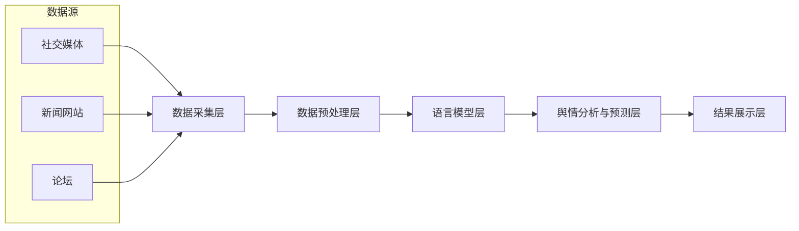

# 语言模型在社会舆情分析与预测中的应用研究

> 关键词：语言模型、社会舆情分析、社会舆情预测、自然语言处理、文本挖掘

> 摘要：本文深入探讨了语言模型在社会舆情分析与预测中的应用。首先介绍了相关背景知识，包括研究的目的、范围、预期读者等。接着阐述了语言模型、社会舆情分析与预测的核心概念及它们之间的联系，并给出了相应的文本示意图和 Mermaid 流程图。详细讲解了核心算法原理，通过 Python 源代码进行了具体说明。同时介绍了相关的数学模型和公式，并举例进行了详细解释。在项目实战部分，给出了开发环境搭建的步骤，对源代码进行了详细实现和解读分析。还探讨了语言模型在社会舆情分析与预测中的实际应用场景，推荐了相关的学习资源、开发工具框架以及论文著作。最后总结了未来发展趋势与挑战，提供了常见问题的解答以及扩展阅读和参考资料，旨在全面呈现语言模型在社会舆情分析与预测领域的应用情况。

## 1. 背景介绍 
### 1.1 目的和范围
随着互联网的飞速发展，社交媒体、新闻网站等平台产生了海量的文本数据，这些数据反映了公众对各种事件、话题的看法和态度，即社会舆情。社会舆情的分析与预测对于政府、企业等机构具有重要意义，它可以帮助政府及时了解民意，制定合理的政策；帮助企业了解市场需求和消费者反馈，调整经营策略。

语言模型作为自然语言处理领域的重要技术，能够对文本进行理解、生成和推理。本研究的目的是探讨如何利用语言模型对社会舆情进行有效分析和预测，研究范围涵盖了语言模型的原理、相关算法、数学模型，以及在不同场景下的应用实践等方面。

### 1.2 预期读者
本文预期读者包括自然语言处理领域的研究人员、从事舆情分析的专业人员、对人工智能应用感兴趣的程序员以及相关领域的学者和学生。通过阅读本文，他们可以深入了解语言模型在社会舆情分析与预测中的应用原理和方法，为实际工作和研究提供参考。

### 1.3 文档结构概述
本文首先介绍了研究的背景信息，包括目的、范围、预期读者等。接着阐述了语言模型、社会舆情分析与预测的核心概念及它们之间的联系。然后详细讲解了核心算法原理，并通过 Python 源代码进行说明。之后介绍了相关的数学模型和公式，并举例进行解释。在项目实战部分，给出了开发环境搭建的步骤，对源代码进行详细实现和解读分析。探讨了语言模型在社会舆情分析与预测中的实际应用场景，推荐了相关的学习资源、开发工具框架以及论文著作。最后总结了未来发展趋势与挑战，提供了常见问题的解答以及扩展阅读和参考资料。

### 1.4 术语表
#### 1.4.1 核心术语定义
- **语言模型**：是一种对自然语言进行建模的概率模型，用于计算一个句子或一段文本的概率，反映了语言的统计规律和语义信息。
- **社会舆情**：指在一定的社会空间内，围绕中介性社会事件的发生、发展和变化，民众对社会管理者产生和持有的社会政治态度。
- **舆情分析**：对舆情信息进行收集、整理、分析，以了解公众的态度、意见和情绪等。
- **舆情预测**：根据历史和当前的舆情信息，对未来的舆情发展趋势进行预测。

#### 1.4.2 相关概念解释
- **自然语言处理（NLP）**：是计算机科学与语言学的交叉领域，旨在让计算机理解、处理和生成自然语言。语言模型是自然语言处理中的重要组成部分。
- **文本挖掘**：从大量文本数据中发现有价值的信息和知识，包括文本分类、情感分析、主题提取等任务，这些任务在社会舆情分析中具有重要应用。

#### 1.4.3 缩略词列表
- **NLP**：Natural Language Processing（自然语言处理）
- **BERT**：Bidirectional Encoder Representations from Transformers（基于 Transformer 的双向编码器表示）
- **RNN**：Recurrent Neural Network（循环神经网络）
- **LSTM**：Long Short - Term Memory（长短期记忆网络）

## 2. 核心概念与联系 
### 核心概念原理
#### 语言模型
语言模型的基本原理是对语言的概率分布进行建模。给定一个词序列 $w_1, w_2, \cdots, w_n$，语言模型的目标是计算这个序列出现的概率 $P(w_1, w_2, \cdots, w_n)$。根据链式法则，这个概率可以分解为：

$$P(w_1, w_2, \cdots, w_n) = P(w_1)P(w_2|w_1)P(w_3|w_1, w_2)\cdots P(w_n|w_1, w_2, \cdots, w_{n - 1})$$

在实际应用中，为了简化计算，通常采用 $n$ - 元语法（$n$ - gram）模型，即假设一个词的出现只依赖于前面的 $n - 1$ 个词。例如，二元语法（bigram）模型中：

$$P(w_i|w_1, w_2, \cdots, w_{i - 1}) \approx P(w_i|w_{i - 1})$$

近年来，基于深度学习的语言模型如 RNN、LSTM 和 Transformer 等得到了广泛应用。这些模型能够学习到更复杂的语言模式和语义信息。

#### 社会舆情分析与预测
社会舆情分析主要包括以下几个方面：
- **数据收集**：从各种数据源（如社交媒体、新闻网站、论坛等）收集与特定主题相关的文本数据。
- **文本预处理**：对收集到的文本数据进行清洗、分词、去除停用词等处理，以便后续分析。
- **特征提取**：从预处理后的文本中提取有代表性的特征，如词向量、主题特征等。
- **分析与挖掘**：利用机器学习或深度学习算法对提取的特征进行分析，包括情感分析、主题分类、事件检测等。

社会舆情预测则是在舆情分析的基础上，根据历史和当前的舆情信息，对未来的舆情发展趋势进行预测。常用的预测方法包括时间序列分析、机器学习预测模型等。

### 架构的文本示意图
语言模型在社会舆情分析与预测中的应用架构主要包括以下几个部分：
1. **数据采集层**：从各种数据源收集文本数据。
2. **数据预处理层**：对收集到的文本数据进行清洗、分词、标注等预处理操作。
3. **语言模型层**：利用训练好的语言模型对预处理后的文本进行特征提取和语义理解。
4. **舆情分析与预测层**：根据语言模型提取的特征，进行情感分析、主题分类、趋势预测等操作。
5. **结果展示层**：将分析和预测结果以直观的方式展示给用户，如报表、图表等。

### Mermaid 流程图


## 3. 核心算法原理 & 具体操作步骤 
### 核心算法原理
在社会舆情分析与预测中，常用的语言模型算法包括基于深度学习的 RNN、LSTM 和 Transformer 等。下面以 LSTM 为例进行详细介绍。

#### LSTM 原理
LSTM 是一种特殊的 RNN，它能够解决传统 RNN 中的梯度消失问题，从而更好地处理长序列数据。LSTM 单元包含三个门：输入门、遗忘门和输出门。

- **遗忘门**：决定上一时刻的细胞状态 $C_{t - 1}$ 中有多少信息需要被遗忘。遗忘门的输出 $f_t$ 计算公式为：

$$f_t = \sigma(W_f[h_{t - 1}, x_t] + b_f)$$

其中，$\sigma$ 是 sigmoid 函数，$W_f$ 是遗忘门的权重矩阵，$h_{t - 1}$ 是上一时刻的隐藏状态，$x_t$ 是当前时刻的输入，$b_f$ 是遗忘门的偏置。

- **输入门**：决定当前时刻的输入 $x_t$ 中有多少信息需要被添加到细胞状态中。输入门的输出 $i_t$ 计算公式为：

$$i_t = \sigma(W_i[h_{t - 1}, x_t] + b_i)$$

同时，计算一个候选细胞状态 $\tilde{C}_t$：

$$\tilde{C}_t = \tanh(W_C[h_{t - 1}, x_t] + b_C)$$

- **更新细胞状态**：根据遗忘门和输入门的输出，更新细胞状态 $C_t$：

$$C_t = f_t \odot C_{t - 1} + i_t \odot \tilde{C}_t$$

其中，$\odot$ 表示逐元素相乘。

- **输出门**：决定当前时刻的隐藏状态 $h_t$ 中输出多少信息。输出门的输出 $o_t$ 计算公式为：

$$o_t = \sigma(W_o[h_{t - 1}, x_t] + b_o)$$

当前时刻的隐藏状态 $h_t$ 计算公式为：

$$h_t = o_t \odot \tanh(C_t)$$

### 具体操作步骤及 Python 源代码
以下是一个使用 PyTorch 实现的基于 LSTM 的情感分析示例，用于社会舆情分析中的情感分类任务。

```python
import torch
import torch.nn as nn
import torch.optim as optim
from torchtext.legacy import data, datasets

# 定义字段
TEXT = data.Field(tokenize='spacy', lower=True)
LABEL = data.LabelField(dtype=torch.float)

# 加载数据集
train_data, test_data = datasets.IMDB.splits(TEXT, LABEL)

# 构建词汇表
TEXT.build_vocab(train_data, max_size=25000, vectors="glove.6B.100d")
LABEL.build_vocab(train_data)

# 创建迭代器
train_iterator, test_iterator = data.BucketIterator.splits(
    (train_data, test_data),
    batch_size=64,
    device=torch.device('cuda' if torch.cuda.is_available() else 'cpu')
)

# 定义 LSTM 模型
class LSTMModel(nn.Module):
    def __init__(self, vocab_size, embedding_dim, hidden_dim, output_dim, n_layers, bidirectional, dropout):
        super().__init__()
        self.embedding = nn.Embedding(vocab_size, embedding_dim)
        self.lstm = nn.LSTM(embedding_dim, hidden_dim, num_layers=n_layers, bidirectional=bidirectional, dropout=dropout)
        self.fc = nn.Linear(hidden_dim * 2 if bidirectional else hidden_dim, output_dim)
        self.dropout = nn.Dropout(dropout)

    def forward(self, text):
        embedded = self.dropout(self.embedding(text))
        output, (hidden, cell) = self.lstm(embedded)
        if self.lstm.bidirectional:
            hidden = self.dropout(torch.cat((hidden[-2, :, :], hidden[-1, :, :]), dim=1))
        else:
            hidden = self.dropout(hidden[-1, :, :])
        return self.fc(hidden.squeeze(0))

# 初始化模型
INPUT_DIM = len(TEXT.vocab)
EMBEDDING_DIM = 100
HIDDEN_DIM = 256
OUTPUT_DIM = 1
N_LAYERS = 2
BIDIRECTIONAL = True
DROPOUT = 0.5

model = LSTMModel(INPUT_DIM, EMBEDDING_DIM, HIDDEN_DIM, OUTPUT_DIM, N_LAYERS, BIDIRECTIONAL, DROPOUT)

# 加载预训练的词向量
pretrained_embeddings = TEXT.vocab.vectors
model.embedding.weight.data.copy_(pretrained_embeddings)

# 定义损失函数和优化器
criterion = nn.BCEWithLogitsLoss()
optimizer = optim.Adam(model.parameters())

# 训练模型
device = torch.device('cuda' if torch.cuda.is_available() else 'cpu')
model = model.to(device)
criterion = criterion.to(device)

N_EPOCHS = 5

for epoch in range(N_EPOCHS):
    model.train()
    epoch_loss = 0
    for batch in train_iterator:
        optimizer.zero_grad()
        predictions = model(batch.text).squeeze(1)
        loss = criterion(predictions, batch.label)
        loss.backward()
        optimizer.step()
        epoch_loss += loss.item()
    print(f'Epoch: {epoch+1}, Loss: {epoch_loss/len(train_iterator)}')

# 评估模型
model.eval()
total_correct = 0
total_count = 0
with torch.no_grad():
    for batch in test_iterator:
        predictions = model(batch.text).squeeze(1)
        rounded_preds = torch.round(torch.sigmoid(predictions))
        correct = (rounded_preds == batch.label).float()
        total_correct += correct.sum()
        total_count += len(batch.label)
print(f'Accuracy: {total_correct/total_count}')
```

## 4. 数学模型和公式 & 详细讲解 & 举例说明 
### 语言模型的数学模型
#### 最大似然估计
在训练语言模型时，通常使用最大似然估计来估计模型的参数。给定一个训练语料库 $D = \{w_1, w_2, \cdots, w_N\}$，模型的参数 $\theta$ 的最大似然估计为：

$$\hat{\theta} = \arg\max_{\theta} \prod_{i = 1}^{N} P(w_i|w_1, w_2, \cdots, w_{i - 1}; \theta)$$

为了方便计算，通常取对数：

$$\hat{\theta} = \arg\max_{\theta} \sum_{i = 1}^{N} \log P(w_i|w_1, w_2, \cdots, w_{i - 1}; \theta)$$

#### 困惑度
困惑度（Perplexity）是衡量语言模型性能的一个重要指标。给定一个测试语料库 $T = \{w_1, w_2, \cdots, w_M\}$，语言模型的困惑度 $PP$ 定义为：

$$PP(T) = 2^{-\frac{1}{M} \sum_{i = 1}^{M} \log_2 P(w_i|w_1, w_2, \cdots, w_{i - 1})}$$

困惑度越小，说明语言模型对测试语料的拟合效果越好。

### 舆情预测的数学模型
#### 时间序列分析
在舆情预测中，时间序列分析是一种常用的方法。假设 $y_t$ 表示在时间 $t$ 的舆情指标（如舆情热度、情感极性等），一个简单的自回归移动平均（ARMA）模型可以表示为：

$$y_t = \sum_{i = 1}^{p} \varphi_i y_{t - i} + \epsilon_t + \sum_{j = 1}^{q} \theta_j \epsilon_{t - j}$$

其中，$\varphi_i$ 是自回归系数，$\theta_j$ 是移动平均系数，$\epsilon_t$ 是白噪声。

### 举例说明
#### 语言模型困惑度计算示例
假设我们有一个简单的语言模型，它对一个测试句子 “The cat is on the mat” 的概率计算如下：

$$P(\text{The}) = 0.1, P(\text{cat}|\text{The}) = 0.2, P(\text{is}|\text{The cat}) = 0.3, P(\text{on}|\text{The cat is}) = 0.4, P(\text{the}|\text{The cat is on}) = 0.5, P(\text{mat}|\text{The cat is on the}) = 0.6$$

则该句子的概率为：

$$P(\text{The cat is on the mat}) = 0.1\times0.2\times0.3\times0.4\times0.5\times0.6 = 0.00072$$

句子长度 $M = 6$，则困惑度为：

$$PP = 2^{-\frac{1}{6} \log_2 0.00072} \approx 33.6$$

#### 舆情预测时间序列分析示例
假设我们有过去 10 天的舆情热度数据：$y = [10, 12, 15, 13, 16, 18, 20, 17, 19, 22]$。我们可以使用 ARMA(1, 1) 模型进行预测。首先，使用 Python 的 `statsmodels` 库进行模型拟合：

```python
import numpy as np
import statsmodels.api as sm

y = np.array([10, 12, 15, 13, 16, 18, 20, 17, 19, 22])
model = sm.tsa.ARMA(y, order=(1, 1))
result = model.fit()

# 预测下一天的舆情热度
next_day_prediction = result.forecast(steps=1)[0][0]
print(f'Next day prediction: {next_day_prediction}')
```

## 5. 项目实战：代码实际案例和详细解释说明 
### 5.1  开发环境搭建
#### 安装 Python
首先，需要安装 Python 环境。建议使用 Python 3.7 及以上版本。可以从 Python 官方网站（https://www.python.org/downloads/） 下载并安装。

#### 安装依赖库
使用 `pip` 安装项目所需的依赖库，包括 `torch`、`torchtext`、`spacy` 等。

```sh
pip install torch torchtext spacy
python -m spacy download en_core_web_sm
```

### 5.2  源代码详细实现和代码解读
以下是一个完整的基于 BERT 模型的社会舆情分析项目示例，包括数据预处理、模型训练和评估。

```python
import torch
from torch.utils.data import Dataset, DataLoader
from transformers import BertTokenizer, BertForSequenceClassification, AdamW
from sklearn.model_selection import train_test_split
import pandas as pd

# 定义数据集类
class SentimentDataset(Dataset):
    def __init__(self, texts, labels, tokenizer, max_length):
        self.texts = texts
        self.labels = labels
        self.tokenizer = tokenizer
        self.max_length = max_length

    def __len__(self):
        return len(self.texts)

    def __getitem__(self, idx):
        text = self.texts[idx]
        label = self.labels[idx]
        encoding = self.tokenizer.encode_plus(
            text,
            add_special_tokens=True,
            max_length=self.max_length,
            padding='max_length',
            truncation=True,
            return_tensors='pt'
        )
        return {
            'input_ids': encoding['input_ids'].flatten(),
            'attention_mask': encoding['attention_mask'].flatten(),
            'labels': torch.tensor(label, dtype=torch.long)
        }

# 加载数据
data = pd.read_csv('sentiment_data.csv')
texts = data['text'].tolist()
labels = data['label'].tolist()

# 划分训练集和测试集
train_texts, test_texts, train_labels, test_labels = train_test_split(texts, labels, test_size=0.2, random_state=42)

# 初始化 tokenizer 和模型
tokenizer = BertTokenizer.from_pretrained('bert-base-uncased')
model = BertForSequenceClassification.from_pretrained('bert-base-uncased', num_labels=2)

# 创建数据集和数据加载器
train_dataset = SentimentDataset(train_texts, train_labels, tokenizer, max_length=128)
test_dataset = SentimentDataset(test_texts, test_labels, tokenizer, max_length=128)

train_dataloader = DataLoader(train_dataset, batch_size=16, shuffle=True)
test_dataloader = DataLoader(test_dataset, batch_size=16, shuffle=False)

# 定义优化器和损失函数
optimizer = AdamW(model.parameters(), lr=2e-5)
criterion = torch.nn.CrossEntropyLoss()

# 训练模型
device = torch.device('cuda' if torch.cuda.is_available() else 'cpu')
model = model.to(device)

N_EPOCHS = 3

for epoch in range(N_EPOCHS):
    model.train()
    epoch_loss = 0
    for batch in train_dataloader:
        input_ids = batch['input_ids'].to(device)
        attention_mask = batch['attention_mask'].to(device)
        labels = batch['labels'].to(device)

        optimizer.zero_grad()
        outputs = model(input_ids, attention_mask=attention_mask)
        logits = outputs.logits
        loss = criterion(logits, labels)
        loss.backward()
        optimizer.step()
        epoch_loss += loss.item()
    print(f'Epoch: {epoch+1}, Loss: {epoch_loss/len(train_dataloader)}')

# 评估模型
model.eval()
total_correct = 0
total_count = 0
with torch.no_grad():
    for batch in test_dataloader:
        input_ids = batch['input_ids'].to(device)
        attention_mask = batch['attention_mask'].to(device)
        labels = batch['labels'].to(device)

        outputs = model(input_ids, attention_mask=attention_mask)
        logits = outputs.logits
        predictions = torch.argmax(logits, dim=1)
        correct = (predictions == labels).sum().item()
        total_correct += correct
        total_count += len(labels)
print(f'Accuracy: {total_correct/total_count}')
```

### 5.3  代码解读与分析
#### 数据预处理
- `SentimentDataset` 类用于封装数据集，将文本数据转换为 BERT 模型所需的输入格式，包括 `input_ids` 和 `attention_mask`。
- 使用 `train_test_split` 函数将数据集划分为训练集和测试集。

#### 模型初始化
- 使用 `BertTokenizer` 对文本进行分词和编码。
- 使用 `BertForSequenceClassification` 初始化分类模型，`num_labels` 参数指定分类的类别数。

#### 训练过程
- 使用 `AdamW` 优化器进行模型参数更新。
- 在每个训练周期中，将输入数据传入模型，计算损失并进行反向传播和参数更新。

#### 评估过程
- 在评估阶段，模型处于 `eval()` 模式，使用 `torch.argmax` 函数获取预测结果，并计算准确率。

## 6. 实际应用场景 
### 政府决策支持
政府可以利用语言模型对社会舆情进行分析和预测，及时了解民众对政策的看法和需求。例如，在制定一项新的环保政策之前，通过分析社交媒体上的相关讨论，了解公众对环保问题的关注焦点和态度，从而优化政策内容。在政策实施过程中，持续监测舆情动态，及时调整政策方向，提高政策的有效性和民众满意度。

### 企业市场调研
企业可以借助语言模型分析消费者对产品或服务的评价和反馈，了解市场需求和竞争态势。例如，电商企业可以分析用户在商品评论中的情感倾向和意见建议，改进产品质量和服务水平。同时，通过对行业相关舆情的预测，提前布局市场策略，提高企业的竞争力。

### 突发事件应急管理
在突发事件（如自然灾害、公共卫生事件等）发生时，语言模型可以帮助相关部门快速了解公众的情绪和需求。例如，在疫情期间，通过分析社交媒体上的舆情信息，了解公众对防疫措施的看法和需求，及时发布准确的信息，缓解公众的恐慌情绪，提高应急管理的效率。

### 媒体内容创作与传播
媒体机构可以利用语言模型分析社会热点和公众兴趣，创作更符合受众需求的内容。例如，新闻媒体可以通过分析舆情趋势，确定报道的重点和方向，提高新闻的传播效果和影响力。同时，通过对舆情的预测，提前策划相关的专题报道，增强媒体的时效性和权威性。

## 7. 工具和资源推荐
### 7.1 学习资源推荐
#### 7.1.1 书籍推荐
- 《深度学习》（Deep Learning）：由 Ian Goodfellow、Yoshua Bengio 和 Aaron Courville 所著，是深度学习领域的经典教材，全面介绍了深度学习的基本原理和算法。
- 《自然语言处理入门》：何晗著，适合初学者快速了解自然语言处理的基本概念和方法。
- 《Python 自然语言处理》（Natural Language Processing with Python）：Steven Bird、Ewan Klein 和 Edward Loper 所著，通过 Python 语言介绍自然语言处理的实践方法。

#### 7.1.2 在线课程
- Coursera 上的 “Natural Language Processing Specialization”：由斯坦福大学的教授授课，系统介绍自然语言处理的理论和实践。
- 吴恩达的 “Deep Learning Specialization”：包含深度学习的多个方面，其中有关于语言模型的详细讲解。
- B 站的 “李宏毅机器学习” 课程：以通俗易懂的方式讲解机器学习和深度学习的知识，包括语言模型的相关内容。

#### 7.1.3 技术博客和网站
- Medium 上的 Towards Data Science：有很多关于自然语言处理和语言模型的技术文章和案例分享。
- 机器之心：专注于人工智能领域的资讯和技术分享，经常发布语言模型的最新研究成果和应用案例。
- 开源中国：提供丰富的技术文章和开源项目，对于学习语言模型和自然语言处理有很大帮助。

### 7.2 开发工具框架推荐
#### 7.2.1 IDE和编辑器
- PyCharm：功能强大的 Python 集成开发环境，提供代码编辑、调试、版本控制等功能，适合开发基于 Python 的语言模型项目。
- Jupyter Notebook：交互式的开发环境，方便进行代码编写、数据可视化和模型实验，常用于快速验证和探索性开发。
- Visual Studio Code：轻量级的代码编辑器，支持多种编程语言和插件扩展，对于语言模型开发也非常方便。

#### 7.2.2 调试和性能分析工具
- PyTorch Profiler：PyTorch 自带的性能分析工具，可以帮助开发者分析模型的运行时间、内存使用等情况，优化模型性能。
- TensorBoard：TensorFlow 提供的可视化工具，也可以与 PyTorch 结合使用，用于可视化模型训练过程中的损失、准确率等指标。
- cProfile：Python 标准库中的性能分析工具，可以对 Python 代码进行性能分析，找出性能瓶颈。

#### 7.2.3 相关框架和库
- PyTorch：深度学习框架，提供了丰富的神经网络模块和优化算法，方便开发者实现语言模型。
- TensorFlow：另一个广泛使用的深度学习框架，具有强大的分布式训练和部署能力。
- Transformers：Hugging Face 开发的自然语言处理库，集成了多种预训练的语言模型，如 BERT、GPT 等，方便开发者进行快速开发。
- NLTK：Python 的自然语言处理库，提供了丰富的文本处理工具和语料库，适合初学者进行自然语言处理的学习和实践。

### 7.3 相关论文著作推荐
#### 7.3.1 经典论文
- “Attention Is All You Need”：提出了 Transformer 架构，是语言模型领域的重要突破。
- “BERT: Pre-training of Deep Bidirectional Transformers for Language Understanding”：介绍了 BERT 模型，开创了预训练语言模型的先河。
- “Generative Adversarial Nets”：提出了生成对抗网络（GAN），对语言生成模型的发展有重要影响。

#### 7.3.2 最新研究成果
- 关注 ACL（Association for Computational Linguistics）、EMNLP（Conference on Empirical Methods in Natural Language Processing）等自然语言处理领域的顶级会议，获取最新的研究成果和技术趋势。
- 阅读 arXiv 上的预印本论文，了解语言模型领域的前沿研究。

#### 7.3.3 应用案例分析
- 一些知名企业和研究机构会发布语言模型在不同领域的应用案例，如 Google、Facebook 等公司的技术博客，以及一些行业报告和白皮书，可以从中学习到语言模型在实际应用中的经验和方法。

## 8. 总结：未来发展趋势与挑战
### 未来发展趋势
#### 更强的预训练语言模型
随着计算资源的不断提升和算法的不断改进，未来会出现更强大的预训练语言模型。这些模型将具有更大的规模和更强的语言理解能力，能够更好地处理复杂的自然语言任务。

#### 多模态融合
语言模型将与图像、音频等其他模态的信息进行融合，实现更全面的信息理解和处理。例如，在舆情分析中，可以结合图像和文本信息，更准确地把握公众的情绪和态度。

#### 个性化和定制化
未来的语言模型将能够根据用户的需求和偏好进行个性化和定制化的服务。例如，针对不同行业、不同用户群体的舆情分析和预测需求，提供定制化的解决方案。

#### 跨语言应用
随着全球化的发展，语言模型的跨语言应用将越来越重要。未来的语言模型将能够处理多种语言的文本数据，实现跨语言的舆情分析和预测。

### 挑战
#### 数据隐私和安全
语言模型的训练需要大量的文本数据，这些数据可能包含用户的隐私信息。如何在保证数据隐私和安全的前提下，充分利用这些数据进行模型训练，是一个重要的挑战。

#### 模型可解释性
目前的语言模型大多是基于深度学习的黑盒模型，其决策过程难以解释。在社会舆情分析与预测等应用场景中，需要模型具有可解释性，以便用户理解模型的决策依据。

#### 计算资源需求
训练和运行大规模的语言模型需要大量的计算资源，这对于一些中小企业和研究机构来说是一个巨大的挑战。如何降低语言模型的计算资源需求，提高模型的效率，是未来需要解决的问题。

#### 对抗攻击
语言模型容易受到对抗攻击，即通过对输入文本进行微小的扰动，使模型产生错误的输出。如何提高语言模型的鲁棒性，抵御对抗攻击，是语言模型应用中的一个重要挑战。

## 9. 附录：常见问题与解答
### 问题 1：如何选择合适的语言模型进行社会舆情分析与预测？
解答：选择合适的语言模型需要考虑多个因素，如数据规模、任务复杂度、计算资源等。如果数据规模较小，可以选择一些轻量级的语言模型，如 FastText 等；如果数据规模较大且任务复杂，可以选择预训练的语言模型，如 BERT、GPT 等。同时，还需要根据具体的应用场景和需求进行调整和优化。

### 问题 2：语言模型在处理中文舆情数据时需要注意什么？
解答：处理中文舆情数据时，需要注意中文的分词问题。中文没有明显的词边界，需要使用合适的分词工具进行分词。同时，还需要考虑中文的语义和语法特点，选择适合中文的语言模型和训练方法。

### 问题 3：如何评估语言模型在社会舆情分析与预测中的性能？
解答：可以使用多种指标来评估语言模型的性能，如准确率、召回率、F1 值、困惑度等。对于舆情预测任务，还可以使用均方误差（MSE）、平均绝对误差（MAE）等指标来评估预测的准确性。同时，还可以进行人工评估，观察模型的输出结果是否符合实际情况。

### 问题 4：语言模型在社会舆情分析与预测中存在哪些局限性？
解答：语言模型在处理自然语言时存在一定的局限性，如对语义理解的不准确性、对上下文信息的处理能力有限等。在社会舆情分析与预测中，还可能受到数据质量、数据偏差等因素的影响。此外，语言模型的决策过程难以解释，可能存在一定的风险。

## 10. 扩展阅读 & 参考资料
### 扩展阅读
- 《人工智能时代的社会与伦理》：探讨了人工智能技术在社会应用中面临的伦理和社会问题，对于理解语言模型在社会舆情分析与预测中的应用具有一定的参考价值。
- 《大数据时代》：介绍了大数据的概念、技术和应用，有助于了解社会舆情数据的特点和处理方法。

### 参考资料
- Hugging Face 官方文档：https://huggingface.co/docs
- PyTorch 官方文档：https://pytorch.org/docs/stable/index.html
- TensorFlow 官方文档：https://www.tensorflow.org/api_docs
- ACL Anthology：https://aclanthology.org/ ，自然语言处理领域的学术论文库。