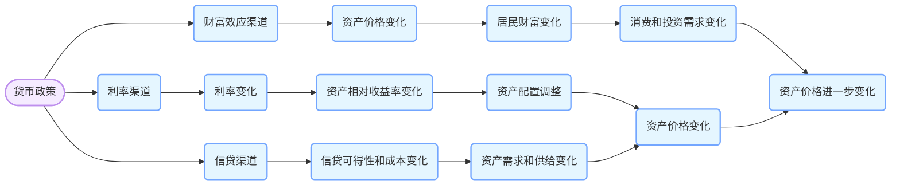

# 货币政策对资产价格的影响机制

> 关键词：货币政策、资产价格、影响机制、利率渠道、信贷渠道

> 摘要：本文深入探讨了货币政策对资产价格的影响机制。在全球经济和金融市场日益复杂的背景下，理解货币政策如何作用于资产价格具有重要的理论和实践意义。文章首先介绍了相关背景知识，包括研究的目的、预期读者、文档结构和术语表。接着阐述了核心概念及其联系，通过文本示意图和 Mermaid 流程图清晰展示。详细讲解了核心算法原理和具体操作步骤，利用 Python 源代码进行说明。同时给出了相关的数学模型和公式，并举例说明。通过项目实战，展示了代码实际案例并进行详细解释。分析了货币政策对资产价格影响机制的实际应用场景，推荐了学习、开发工具和相关论文著作。最后总结了未来发展趋势与挑战，提供了常见问题解答和扩展阅读参考资料，旨在为读者全面深入地理解货币政策与资产价格之间的关系提供有力的理论和实践支持。

## 1. 背景介绍 
### 1.1 目的和范围
货币政策是宏观经济调控的重要手段，资产价格的波动不仅影响着投资者的财富，还对整个金融市场和实体经济的稳定产生深远影响。本研究的目的在于深入剖析货币政策对资产价格的影响机制，明确不同货币政策工具如何作用于资产价格，以及这种影响在不同市场环境和经济周期中的变化特点。研究范围涵盖了常见的资产类型，如股票、债券、房地产等，以及主要的货币政策工具，包括利率调整、货币供应量控制、信贷政策等。

### 1.2 预期读者
本文的预期读者包括金融市场从业者，如投资银行家、基金经理、证券分析师等，他们可以通过了解货币政策对资产价格的影响机制，更好地进行投资决策和风险管理。学术研究人员也可以从本文中获取相关理论和实证研究的参考，进一步深入探讨货币政策与资产价格之间的关系。此外，政策制定者可以通过本文的研究成果，评估货币政策对资产市场的影响，优化货币政策的制定和实施，以维护金融市场的稳定和促进实体经济的发展。

### 1.3 文档结构概述
本文首先介绍背景知识，为后续的研究奠定基础。接着阐述核心概念及其联系，使读者对相关概念有清晰的认识。然后详细讲解核心算法原理和具体操作步骤，通过 Python 代码进行说明。再给出数学模型和公式，并举例说明。通过项目实战展示代码实际案例并进行详细解释。分析实际应用场景，推荐学习、开发工具和相关论文著作。最后总结未来发展趋势与挑战，提供常见问题解答和扩展阅读参考资料。

### 1.4 术语表
#### 1.4.1 核心术语定义
- **货币政策**：中央银行为实现特定的经济目标而采取的各种控制和调节货币供应量和信用量的方针、政策和措施的总称。
- **资产价格**：资产在市场上的交易价格，反映了资产的价值和市场供求关系。
- **利率渠道**：货币政策通过影响利率水平，进而影响资产价格的传导途径。
- **信贷渠道**：货币政策通过影响银行信贷的可得性和成本，从而影响资产价格的传导途径。

#### 1.4.2 相关概念解释
- **货币供应量**：一个国家在某一时点上为社会经济运转服务的货币存量，由包括中央银行在内的金融机构供应的存款货币和现金货币两部分构成。
- **流动性偏好**：人们宁愿持有流动性高但不能生利的货币，也不愿持有其他虽能生利但较难变现的资产的心理。这种心理决定了货币需求。
- **资产定价模型**：用于确定资产合理价格的数学模型，常见的有资本资产定价模型（CAPM）等。

#### 1.4.3 缩略词列表
- **CAPM**：Capital Asset Pricing Model，资本资产定价模型
- **M2**：广义货币供应量

## 2. 核心概念与联系 

### 核心概念原理
货币政策对资产价格的影响主要通过以下几个核心渠道实现：
- **利率渠道**：根据凯恩斯的流动性偏好理论，货币供应量的变化会影响利率水平。当中央银行增加货币供应量时，货币市场上的资金供给增加，在货币需求不变的情况下，利率会下降。利率的下降会使债券等固定收益类资产的吸引力下降，投资者会减少对债券的需求，导致债券价格下跌。同时，利率下降会降低企业的融资成本，提高企业的盈利预期，从而增加股票的吸引力，推动股票价格上涨。
- **信贷渠道**：货币政策的变化会影响银行的信贷行为。当中央银行实行宽松的货币政策时，银行的可贷资金增加，信贷条件放松，企业和个人更容易获得贷款。企业获得贷款后可以用于扩大生产、投资等，这会增加对资产的需求，从而推动资产价格上涨。例如，房地产市场中，宽松的信贷政策会使更多的人有能力购买房产，增加房地产的需求，推动房价上涨。
- **财富效应渠道**：货币政策的变化会影响居民的财富水平。当资产价格上涨时，居民的财富增加，这会刺激居民的消费和投资需求。例如，股票价格上涨会使投资者的财富增加，他们可能会增加消费支出，购买更多的商品和服务，同时也可能会增加对其他资产的投资，进一步推动资产价格上涨。

### 架构的文本示意图
货币政策通过不同的渠道影响资产价格，这些渠道相互关联、相互作用。利率渠道主要影响资产的相对收益率，从而改变投资者的资产配置；信贷渠道主要影响资产的需求和供给；财富效应渠道则通过影响居民的消费和投资行为，进一步反馈到资产价格上。整个影响机制可以用以下示意图表示：

货币政策（利率调整、货币供应量变化、信贷政策等） -> 利率渠道（利率变化 -> 资产相对收益率变化 -> 资产配置调整 -> 资产价格变化）
               |
               -> 信贷渠道（信贷可得性和成本变化 -> 资产需求和供给变化 -> 资产价格变化）
               |
               -> 财富效应渠道（资产价格变化 -> 居民财富变化 -> 消费和投资需求变化 -> 资产价格进一步变化）

### Mermaid 流程图


## 3. 核心算法原理 & 具体操作步骤 

### 利率渠道的算法原理及 Python 实现
利率渠道的核心是利率与资产价格之间的关系。以债券为例，债券价格与利率呈反向变动关系。债券价格的计算公式为：

$P = \frac{C}{(1 + r)^1} + \frac{C}{(1 + r)^2} + \cdots + \frac{C + F}{(1 + r)^n}$

其中，$P$ 为债券价格，$C$ 为债券每年支付的利息，$r$ 为市场利率，$F$ 为债券面值，$n$ 为债券剩余期限。

以下是使用 Python 实现计算债券价格随利率变化的代码：
```python
def bond_price(coupon, face_value, market_rate, years):
    price = 0
    for year in range(1, years + 1):
        if year < years:
            price += coupon / (1 + market_rate) ** year
        else:
            price += (coupon + face_value) / (1 + market_rate) ** year
    return price

# 示例参数
coupon = 50  # 每年利息
face_value = 1000  # 债券面值
years = 10  # 剩余期限

# 不同利率下的债券价格
rates = [0.03, 0.04, 0.05, 0.06, 0.07]
for rate in rates:
    price = bond_price(coupon, face_value, rate, years)
    print(f"市场利率为 {rate * 100}% 时，债券价格为 {price}")
```
### 操作步骤
1. 定义债券价格计算函数 `bond_price`，该函数接受债券每年利息、面值、市场利率和剩余期限作为参数。
2. 在函数内部，使用循环计算每年利息和到期本金的现值，并将它们累加得到债券价格。
3. 定义示例参数，包括每年利息、面值和剩余期限。
4. 定义不同的市场利率，使用循环调用 `bond_price` 函数计算不同利率下的债券价格，并打印结果。

### 信贷渠道的算法原理及 Python 实现
信贷渠道主要涉及信贷可得性和成本对资产需求和供给的影响。我们可以通过一个简单的模型来模拟信贷政策对房地产市场的影响。假设房地产需求函数为：

$D = a - bP + cL$

其中，$D$ 为房地产需求，$P$ 为房地产价格，$L$ 为信贷额度，$a$、$b$、$c$ 为参数。

房地产供给函数为：

$S = d + eP$

其中，$S$ 为房地产供给，$d$、$e$ 为参数。

市场均衡时，$D = S$，即：

$a - bP + cL = d + eP$

解得均衡价格：

$P^* = \frac{a + cL - d}{b + e}$

以下是使用 Python 实现计算不同信贷额度下房地产均衡价格的代码：
```python
def equilibrium_price(a, b, c, d, e, L):
    return (a + c * L - d) / (b + e)

# 示例参数
a = 1000
b = 2
c = 5
d = 200
e = 3

# 不同信贷额度下的均衡价格
credit_levels = [100, 200, 300, 400, 500]
for L in credit_levels:
    price = equilibrium_price(a, b, c, d, e, L)
    print(f"信贷额度为 {L} 时，房地产均衡价格为 {price}")
```
### 操作步骤
1. 定义均衡价格计算函数 `equilibrium_price`，该函数接受需求函数和供给函数的参数以及信贷额度作为参数。
2. 在函数内部，根据均衡条件计算均衡价格。
3. 定义示例参数，包括需求函数和供给函数的参数。
4. 定义不同的信贷额度，使用循环调用 `equilibrium_price` 函数计算不同信贷额度下的房地产均衡价格，并打印结果。

## 4. 数学模型和公式 & 详细讲解 & 举例说明 

### 利率渠道的数学模型
在利率渠道中，我们主要关注利率与资产价格之间的关系。以股票为例，根据股息贴现模型（DDM），股票价格可以表示为：

$P = \frac{D_1}{r - g}$

其中，$P$ 为股票价格，$D_1$ 为下一期的股息，$r$ 为必要收益率，$g$ 为股息增长率。

### 详细讲解
股息贴现模型的基本思想是，股票的价值等于其未来所有股息的现值之和。在假设股息以固定增长率 $g$ 增长的情况下，通过数学推导可以得到上述公式。必要收益率 $r$ 通常由无风险利率和风险溢价组成，货币政策的变化会影响无风险利率，从而影响必要收益率。当货币政策宽松，无风险利率下降时，必要收益率 $r$ 也会下降，在股息增长率 $g$ 和下一期股息 $D_1$ 不变的情况下，股票价格 $P$ 会上升。

### 举例说明
假设某股票下一期股息 $D_1 = 2$ 元，股息增长率 $g = 0.05$，必要收益率 $r = 0.1$，则根据股息贴现模型，股票价格为：

$P = \frac{2}{0.1 - 0.05} = 40$（元）

如果货币政策宽松，无风险利率下降，导致必要收益率 $r$ 下降到 $0.08$，则股票价格变为：

$P = \frac{2}{0.08 - 0.05} \approx 66.67$（元）

可以看到，随着必要收益率的下降，股票价格上升。

### 信贷渠道的数学模型
在信贷渠道中，我们使用前面提到的房地产市场模型，需求函数为 $D = a - bP + cL$，供给函数为 $S = d + eP$，均衡价格为 $P^* = \frac{a + cL - d}{b + e}$。

### 详细讲解
需求函数表示房地产需求与价格和信贷额度之间的关系。价格 $P$ 越高，需求越低，系数 $b$ 表示价格对需求的影响程度；信贷额度 $L$ 越高，需求越高，系数 $c$ 表示信贷额度对需求的影响程度。供给函数表示房地产供给与价格之间的关系，价格 $P$ 越高，供给越高，系数 $e$ 表示价格对供给的影响程度。在市场均衡时，需求等于供给，通过求解方程组得到均衡价格的表达式。

### 举例说明
假设 $a = 1000$，$b = 2$，$c = 5$，$d = 200$，$e = 3$，当信贷额度 $L = 100$ 时，均衡价格为：

$P^* = \frac{1000 + 5 \times 100 - 200}{2 + 3} = \frac{1300}{5} = 260$

当信贷额度增加到 $L = 200$ 时，均衡价格为：

$P^* = \frac{1000 + 5 \times 200 - 200}{2 + 3} = \frac{1800}{5} = 360$

可以看到，随着信贷额度的增加，房地产均衡价格上升。

## 5. 项目实战：代码实际案例和详细解释说明 

### 5.1  开发环境搭建
- **操作系统**：可以选择 Windows、Linux 或 macOS 等主流操作系统。
- **Python 环境**：安装 Python 3.x 版本，可以从 Python 官方网站（https://www.python.org/downloads/） 下载安装包进行安装。
- **集成开发环境（IDE）**：推荐使用 PyCharm 或 Jupyter Notebook。PyCharm 是一款功能强大的 Python IDE，提供了代码编辑、调试、版本控制等丰富的功能；Jupyter Notebook 则适合进行交互式编程和数据分析，方便代码的展示和分享。

### 5.2  源代码详细实现和代码解读
#### 利率渠道的代码实现
```python
import numpy as np
import matplotlib.pyplot as plt

def bond_price(coupon, face_value, market_rate, years):
    price = 0
    for year in range(1, years + 1):
        if year < years:
            price += coupon / (1 + market_rate) ** year
        else:
            price += (coupon + face_value) / (1 + market_rate) ** year
    return price

# 示例参数
coupon = 50
face_value = 1000
years = 10

# 不同利率下的债券价格
rates = np.linspace(0.01, 0.1, 100)
prices = []
for rate in rates:
    price = bond_price(coupon, face_value, rate, years)
    prices.append(price)

# 绘制债券价格与利率的关系图
plt.plot(rates, prices)
plt.xlabel('Market Rate')
plt.ylabel('Bond Price')
plt.title('Relationship between Bond Price and Market Rate')
plt.grid(True)
plt.show()
```
#### 代码解读
1. **导入必要的库**：`numpy` 用于生成利率数组，`matplotlib.pyplot` 用于绘制图形。
2. **定义债券价格计算函数**：`bond_price` 函数根据债券定价公式计算债券价格。
3. **设置示例参数**：包括每年利息、面值和剩余期限。
4. **生成不同的利率**：使用 `numpy.linspace` 函数生成从 0.01 到 0.1 的 100 个利率值。
5. **计算不同利率下的债券价格**：使用循环调用 `bond_price` 函数计算每个利率对应的债券价格，并将结果存储在 `prices` 列表中。
6. **绘制图形**：使用 `matplotlib.pyplot` 绘制债券价格与利率的关系图，直观展示债券价格随利率的变化趋势。

#### 信贷渠道的代码实现
```python
import numpy as np
import matplotlib.pyplot as plt

def equilibrium_price(a, b, c, d, e, L):
    return (a + c * L - d) / (b + e)

# 示例参数
a = 1000
b = 2
c = 5
d = 200
e = 3

# 不同信贷额度下的均衡价格
credit_levels = np.linspace(100, 500, 100)
prices = []
for L in credit_levels:
    price = equilibrium_price(a, b, c, d, e, L)
    prices.append(price)

# 绘制房地产均衡价格与信贷额度的关系图
plt.plot(credit_levels, prices)
plt.xlabel('Credit Level')
plt.ylabel('Equilibrium Price')
plt.title('Relationship between Equilibrium Price and Credit Level')
plt.grid(True)
plt.show()
```
#### 代码解读
1. **导入必要的库**：`numpy` 用于生成信贷额度数组，`matplotlib.pyplot` 用于绘制图形。
2. **定义均衡价格计算函数**：`equilibrium_price` 函数根据房地产市场均衡模型计算均衡价格。
3. **设置示例参数**：包括需求函数和供给函数的参数。
4. **生成不同的信贷额度**：使用 `numpy.linspace` 函数生成从 100 到 500 的 100 个信贷额度值。
5. **计算不同信贷额度下的均衡价格**：使用循环调用 `equilibrium_price` 函数计算每个信贷额度对应的均衡价格，并将结果存储在 `prices` 列表中。
6. **绘制图形**：使用 `matplotlib.pyplot` 绘制房地产均衡价格与信贷额度的关系图，直观展示均衡价格随信贷额度的变化趋势。

### 5.3  代码解读与分析
#### 利率渠道代码分析
通过绘制债券价格与利率的关系图，我们可以直观地看到债券价格与利率呈反向变动关系。当利率上升时，债券价格下降；当利率下降时，债券价格上升。这与我们前面介绍的利率渠道的原理相符，即货币政策通过影响利率水平，进而影响债券等固定收益类资产的价格。

#### 信贷渠道代码分析
通过绘制房地产均衡价格与信贷额度的关系图，我们可以看到房地产均衡价格与信贷额度呈正向变动关系。当信贷额度增加时，房地产均衡价格上升；当信贷额度减少时，房地产均衡价格下降。这反映了信贷渠道的作用机制，即货币政策通过影响信贷可得性和成本，从而影响房地产等资产的需求和供给，最终影响资产价格。

## 6. 实际应用场景 
### 投资决策
投资者可以根据货币政策的变化来调整自己的投资组合。当中央银行实行宽松的货币政策时，利率下降，债券价格可能上涨，股票价格也可能因企业盈利预期改善而上涨，投资者可以适当增加股票和债券的投资比例。相反，当中央银行实行紧缩的货币政策时，利率上升，债券价格可能下跌，股票价格也可能受到影响，投资者可以适当减少股票和债券的投资比例，增加现金等流动性资产的持有。

### 金融市场监管
金融市场监管部门可以通过监测货币政策对资产价格的影响，及时发现金融市场的潜在风险。例如，当货币政策宽松导致资产价格过度上涨时，可能会形成资产泡沫，监管部门可以采取相应的措施，如加强信贷监管、提高资本充足率等，以防止资产泡沫破裂引发金融风险。

### 宏观经济调控
政府可以利用货币政策对资产价格的影响来实现宏观经济调控的目标。例如，在经济衰退时，政府可以实行宽松的货币政策，通过降低利率、增加货币供应量等手段，刺激资产价格上涨，从而提高居民的财富水平，刺激消费和投资需求，促进经济增长。在经济过热时，政府可以实行紧缩的货币政策，抑制资产价格上涨，防止通货膨胀和经济过热。

## 7. 工具和资源推荐
### 7.1 学习资源推荐
#### 7.1.1 书籍推荐
- 《货币金融学》（米什金著）：这是一本经典的货币金融领域教材，系统介绍了货币政策、金融市场等方面的知识，对理解货币政策对资产价格的影响机制有很大帮助。
- 《投资学》（博迪著）：全面介绍了投资的基本理论和方法，包括资产定价、投资组合管理等内容，有助于深入理解资产价格的形成机制和投资决策过程。
- 《宏观经济学》（曼昆著）：宏观经济学的经典教材，阐述了宏观经济运行的基本原理和政策，对理解货币政策的宏观经济效应有重要意义。

#### 7.1.2 在线课程
- Coursera 平台上的“货币银行学”课程：由知名高校的教授授课，内容丰富，讲解详细，通过视频、作业、讨论等多种形式帮助学习者掌握货币银行学的知识。
- edX 平台上的“投资分析与组合管理”课程：提供了投资分析和组合管理的理论和实践知识，适合想要深入学习投资领域的学习者。
- 中国大学 MOOC 上的“宏观经济学”课程：国内高校的优质课程，结合中国经济实际，讲解宏观经济理论和政策，有助于学习者理解货币政策在国内经济中的应用。

#### 7.1.3 技术博客和网站
- 美联储官方网站（https://www.federalreserve.gov/）：提供了美联储的货币政策报告、经济数据等重要信息，是了解美国货币政策动态的重要渠道。
- 中国人民银行官方网站（https://www.pbc.gov.cn/）：提供了中国人民银行的货币政策公告、金融统计数据等内容，有助于了解中国货币政策的实施情况。
- 金融界网站（https://www.jrj.com.cn/）：提供了丰富的金融资讯、市场行情、研究报告等内容，对了解金融市场和资产价格动态有很大帮助。

### 7.2 开发工具框架推荐
#### 7.2.1 IDE和编辑器
- PyCharm：功能强大的 Python IDE，提供了代码自动补全、调试、版本控制等丰富的功能，适合专业的 Python 开发。
- Jupyter Notebook：交互式编程环境，方便代码的展示和分享，适合进行数据分析和模型验证。
- Visual Studio Code：轻量级的代码编辑器，支持多种编程语言，具有丰富的插件扩展功能，可用于 Python 开发和数据处理。

#### 7.2.2 调试和性能分析工具
- PyCharm 的调试功能：可以设置断点、单步执行代码、查看变量值等，方便调试 Python 代码。
- cProfile：Python 内置的性能分析工具，可以分析代码的执行时间和函数调用情况，帮助优化代码性能。
- Memory Profiler：用于分析 Python 代码的内存使用情况，找出内存泄漏和高内存消耗的问题。

#### 7.2.3 相关框架和库
- NumPy：Python 中用于科学计算的基础库，提供了高效的数组操作和数学函数，可用于数据处理和模型计算。
- Pandas：用于数据处理和分析的库，提供了数据结构和数据操作方法，方便处理和分析金融数据。
- Matplotlib：用于绘制图形和可视化数据的库，可用于展示资产价格走势、模型结果等。

### 7.3 相关论文著作推荐
#### 7.3.1 经典论文
- Bernanke, B. S., & Gertler, M. (1995). Inside the black box: The credit channel of monetary policy transmission. *Journal of Economic Perspectives*, 9(4), 27-48. 该论文深入探讨了货币政策的信贷传导渠道，对理解信贷渠道在货币政策传导中的作用具有重要意义。
- Campbell, J. Y., & Shiller, R. J. (1988). The dividend-price ratio and expectations of future dividends and discount factors. *Review of Financial Studies*, 1(3), 195-228. 这篇论文研究了股息价格比与未来股息和贴现因子的关系，对理解股票价格的决定因素有重要启示。

#### 7.3.2 最新研究成果
- Adrian, T., & Shin, H. S. (2010). Liquidity and leverage. *Journal of Financial Intermediation*, 19(3), 418-437. 该论文研究了流动性和杠杆在金融市场中的作用，对理解货币政策对金融市场的影响有新的视角。
- Gali, J., & Gambetti, L. (2015). On the sources of the Fed's reaction function shifts. *Journal of Monetary Economics*, 73, 49-65. 这篇论文分析了美联储反应函数变化的原因，有助于理解货币政策的动态调整。

#### 7.3.3 应用案例分析
- Cecchetti, S. G., Genberg, H., Lipsky, J., & Wadhwani, S. (2000). Asset prices and central bank policy. *Geneva Reports on the World Economy*. 该报告分析了资产价格与中央银行政策之间的关系，并提供了相关的应用案例和政策建议。

## 8. 总结：未来发展趋势与挑战
### 未来发展趋势
- **政策工具的创新**：随着金融市场的发展和经济环境的变化，中央银行可能会不断创新货币政策工具，以更好地实现货币政策目标。例如，一些国家已经开始探索使用量化宽松、前瞻性指引等非常规货币政策工具，这些工具对资产价格的影响机制可能与传统工具有所不同，需要进一步研究。
- **金融科技的影响**：金融科技的发展正在改变金融市场的运行模式和投资者的行为方式。例如，数字货币的出现可能会影响货币供应量和货币流通速度，从而对货币政策和资产价格产生影响。同时，人工智能、大数据等技术的应用也可能会提高投资者的决策效率和市场的透明度，进一步影响资产价格的形成机制。
- **国际货币政策协调**：在全球经济一体化的背景下，各国货币政策之间的相互影响日益增强。为了避免货币政策的溢出效应和国际金融市场的不稳定，各国可能会加强货币政策的协调与合作。这种国际协调对资产价格的影响也将成为未来研究的重要方向。

### 挑战
- **资产价格泡沫的识别和防范**：货币政策对资产价格的影响可能会导致资产价格泡沫的形成，而资产价格泡沫的破裂往往会引发金融危机。因此，如何准确识别资产价格泡沫，并采取有效的防范措施，是货币政策制定者面临的重要挑战。
- **货币政策的时滞和不确定性**：货币政策从实施到对资产价格产生影响存在一定的时滞，而且这种影响还受到多种因素的制约，具有不确定性。这使得货币政策的效果难以准确预测和评估，增加了货币政策制定和实施的难度。
- **金融市场的复杂性**：现代金融市场日益复杂，资产价格受到多种因素的影响，包括宏观经济数据、公司业绩、投资者情绪等。如何在复杂的市场环境中准确分析货币政策对资产价格的影响机制，是研究人员面临的挑战之一。

## 9. 附录：常见问题与解答
### 问题 1：货币政策对不同类型资产价格的影响是否相同？
答：不同类型资产对货币政策的反应可能不同。例如，债券价格与利率呈反向变动关系，货币政策宽松时利率下降，债券价格通常会上涨；股票价格受到企业盈利预期、市场流动性等多种因素的影响，货币政策宽松可能会提高企业盈利预期，增加市场流动性，从而推动股票价格上涨，但股票市场的波动性较大，其价格变化还受到其他因素的制约。房地产价格则受到信贷政策、土地供应等因素的影响，货币政策宽松时信贷条件放松，可能会刺激房地产需求，推动房价上涨。

### 问题 2：如何判断货币政策是宽松还是紧缩？
答：可以通过观察货币政策工具的操作和相关经济指标来判断货币政策的宽松或紧缩程度。例如，中央银行降低利率、增加货币供应量、降低法定准备金率等操作通常表示货币政策宽松；反之，提高利率、减少货币供应量、提高法定准备金率等操作则表示货币政策紧缩。此外，还可以观察一些经济指标，如通货膨胀率、经济增长率、失业率等，货币政策的调整通常是为了实现这些经济目标。

### 问题 3：资产价格泡沫一定会破裂吗？
答：资产价格泡沫并不一定会破裂，但破裂的风险随着泡沫的膨胀而增加。资产价格泡沫是指资产价格脱离其内在价值的过度上涨。当市场参与者的预期发生变化、经济基本面出现恶化或货币政策收紧等因素出现时，资产价格泡沫可能会破裂。然而，如果能够及时采取有效的政策措施，如加强市场监管、调整货币政策等，可能会延缓或避免资产价格泡沫的破裂。

## 10. 扩展阅读 & 参考资料
- [1] 米什金. 货币金融学[M]. 中国人民大学出版社, 2016.
- [2] 博迪. 投资学[M]. 机械工业出版社, 2017.
- [3] 曼昆. 宏观经济学[M]. 中国人民大学出版社, 2016.
- [4] Bernanke, B. S., & Gertler, M. (1995). Inside the black box: The credit channel of monetary policy transmission. *Journal of Economic Perspectives*, 9(4), 27-48.
- [5] Campbell, J. Y., & Shiller, R. J. (1988). The dividend-price ratio and expectations of future dividends and discount factors. *Review of Financial Studies*, 1(3), 195-228.
- [6] Adrian, T., & Shin, H. S. (2010). Liquidity and leverage. *Journal of Financial Intermediation*, 19(3), 418-437.
- [7] Gali, J., & Gambetti, L. (2015). On the sources of the Fed's reaction function shifts. *Journal of Monetary Economics*, 73, 49-65.
- [8] Cecchetti, S. G., Genberg, H., Lipsky, J., & Wadhwani, S. (2000). Asset prices and central bank policy. *Geneva Reports on the World Economy*.
- [9] 美联储官方网站（https://www.federalreserve.gov/）
- [10] 中国人民银行官方网站（https://www.pbc.gov.cn/）
- [11] 金融界网站（https://www.jrj.com.cn/）