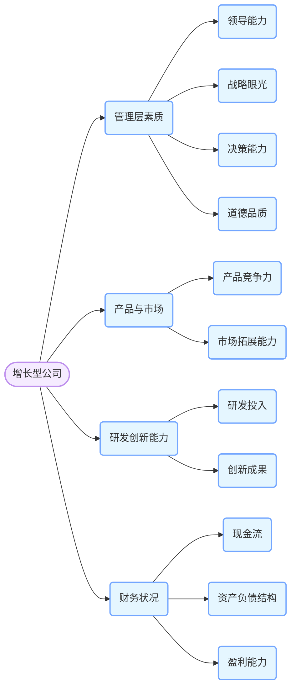

# 费雪的增长型公司特征分析

> 关键词：费雪、增长型公司、特征分析、投资策略、企业发展

> 摘要：本文深入探讨了费雪所提出的增长型公司的特征。费雪作为投资领域的重要人物，其对于增长型公司的见解具有重要的理论和实践价值。通过对费雪相关理论的研究，详细分析增长型公司在管理层、产品与市场、研发创新等多个方面的特征，旨在帮助投资者更好地识别增长型公司，为投资决策提供依据，同时也为企业经营者提供发展思路，促进企业向增长型公司迈进。

## 1. 背景介绍 
### 1.1 目的和范围
本文的主要目的是全面而深入地分析费雪所定义的增长型公司的特征。费雪在投资领域的理论为投资者提供了寻找具有长期增长潜力公司的方法。我们将研究范围聚焦于费雪所阐述的各个维度的特征，包括公司的经营管理、产品创新、市场竞争力等方面，旨在清晰地呈现增长型公司的全貌，帮助读者理解如何辨别和评估增长型公司。

### 1.2 预期读者
本文预期读者包括广大投资者，无论是专业的投资机构从业者还是普通的个人投资者，都可以从对增长型公司特征的分析中获取投资决策的参考信息。同时，企业经营者也能从这些特征中得到启发，了解增长型公司的发展方向，从而调整企业的经营策略。此外，对投资理论和企业发展研究感兴趣的学者和研究人员也可以将本文作为参考资料。

### 1.3 文档结构概述
本文首先介绍背景信息，包括目的、预期读者和文档结构概述等内容。接着阐述增长型公司的核心概念以及各特征之间的联系，通过文本示意图和 Mermaid 流程图进行直观展示。然后深入讲解费雪分析增长型公司特征所涉及的核心算法原理，并给出具体操作步骤，同时使用 Python 源代码进行详细阐述。之后介绍相关的数学模型和公式，并通过举例说明其应用。再通过项目实战，展示代码实际案例并进行详细解释说明。随后探讨增长型公司的实际应用场景。接着推荐相关的工具和资源，包括学习资源、开发工具框架以及相关论文著作。最后总结未来发展趋势与挑战，提供常见问题与解答，并列出扩展阅读和参考资料。

### 1.4 术语表
#### 1.4.1 核心术语定义
- **增长型公司**：指那些在较长时期内，具有持续的盈利增长和市场价值提升潜力的公司。这些公司通常能够不断推出创新产品或服务，拓展市场份额，实现高于行业平均水平的增长。
- **费雪投资理论**：由菲利普·费雪（Philip A. Fisher）提出的投资理论，强调通过深入研究公司的基本面，寻找具有长期增长潜力的优质公司进行投资。

#### 1.4.2 相关概念解释
- **管理层能力**：包括管理层的战略眼光、决策能力、执行能力以及领导团队的能力等。优秀的管理层能够带领公司制定正确的发展战略，并有效地组织实施，实现公司的增长目标。
- **产品创新**：指公司通过研发投入，不断推出新的产品或对现有产品进行改进，以满足市场需求的变化，提高公司的市场竞争力。

#### 1.4.3 缩略词列表
目前本文中未涉及相关缩略词。

## 2. 核心概念与联系 

### 核心概念原理
费雪认为增长型公司具有多个关键特征，这些特征相互关联，共同构成了增长型公司的基础。

- **管理层素质**：优秀的管理层是增长型公司的核心驱动力。他们具有卓越的领导能力、战略眼光和决策能力，能够准确把握市场趋势，制定合理的发展战略，并带领团队高效执行。管理层还应具备良好的道德品质和诚信度，以维护公司的长期声誉。
- **产品与市场**：增长型公司通常拥有具有竞争力的产品或服务。这些产品或服务能够满足市场的需求，具有独特的优势，如技术领先、质量卓越、成本较低等。公司还需要具备强大的市场拓展能力，能够不断扩大市场份额，提高产品的市场占有率。
- **研发创新能力**：持续的研发创新是增长型公司保持竞争优势的关键。公司需要投入足够的资源进行研发，不断推出新产品、新技术，以适应市场的变化和客户的需求。研发创新还能够提高公司的生产效率，降低成本，增强公司的盈利能力。
- **财务状况**：良好的财务状况是增长型公司持续发展的保障。公司应具有稳定的现金流、合理的资产负债结构和较高的盈利能力。财务状况的稳健性能够保证公司在面临市场风险时具有较强的抗风险能力。

### 架构的文本示意图
增长型公司的特征架构可以用以下方式表示：

增长型公司
|-- 管理层素质
|   |-- 领导能力
|   |-- 战略眼光
|   |-- 决策能力
|   |-- 道德品质
|-- 产品与市场
|   |-- 产品竞争力
|   |-- 市场拓展能力
|-- 研发创新能力
|   |-- 研发投入
|   |-- 创新成果
|-- 财务状况
|   |-- 现金流
|   |-- 资产负债结构
|   |-- 盈利能力

### Mermaid 流程图


## 3. 核心算法原理 & 具体操作步骤 

### 核心算法原理
在分析增长型公司的特征时，可以采用多因素综合评估的方法。我们可以将每个特征赋予一定的权重，然后根据公司在各个特征方面的表现进行评分，最后将各项得分乘以相应的权重并求和，得到公司的综合得分。综合得分越高，说明公司越符合增长型公司的特征。

### 具体操作步骤
1. **确定评估指标和权重**：根据费雪的理论，确定管理层素质、产品与市场、研发创新能力、财务状况等评估指标，并为每个指标分配相应的权重。例如，管理层素质权重为 30%，产品与市场权重为 30%，研发创新能力权重为 20%，财务状况权重为 20%。
2. **对每个指标进行评分**：根据公司在各个指标方面的实际表现，进行评分。评分可以采用 1 - 10 分的标准，1 分表示表现最差，10 分表示表现最好。
3. **计算综合得分**：将每个指标的得分乘以相应的权重，然后求和，得到公司的综合得分。

### Python 源代码实现
```python
# 定义评估指标和权重
weights = {
    "管理层素质": 0.3,
    "产品与市场": 0.3,
    "研发创新能力": 0.2,
    "财务状况": 0.2
}

# 定义公司在各个指标方面的得分
scores = {
    "管理层素质": 8,
    "产品与市场": 7,
    "研发创新能力": 6,
    "财务状况": 7
}

# 计算综合得分
total_score = 0
for indicator, weight in weights.items():
    score = scores[indicator]
    total_score += score * weight

print(f"公司的综合得分: {total_score}")
```

## 4. 数学模型和公式 & 详细讲解 & 举例说明 

### 数学模型和公式
设评估指标有 $n$ 个，分别为 $x_1, x_2, \cdots, x_n$，对应的权重为 $w_1, w_2, \cdots, w_n$，且 $\sum_{i = 1}^{n} w_i = 1$。公司在每个指标上的得分分别为 $s_1, s_2, \cdots, s_n$，则公司的综合得分 $S$ 可以用以下公式计算：

$$S = \sum_{i = 1}^{n} w_i s_i$$

### 详细讲解
这个公式的原理是将每个指标的得分乘以其对应的权重，然后将所有结果相加，得到综合得分。权重的分配反映了各个指标在评估增长型公司特征时的重要程度。通过综合得分，我们可以对不同公司进行比较，判断其是否符合增长型公司的特征。

### 举例说明
假设有两家公司 A 和 B，评估指标和权重如下：

| 评估指标 | 权重 |
| ---- | ---- |
| 管理层素质 | 0.3 |
| 产品与市场 | 0.3 |
| 研发创新能力 | 0.2 |
| 财务状况 | 0.2 |

两家公司在各个指标上的得分如下：

| 公司 | 管理层素质 | 产品与市场 | 研发创新能力 | 财务状况 |
| ---- | ---- | ---- | ---- | ---- |
| A | 8 | 7 | 6 | 7 |
| B | 7 | 8 | 7 | 6 |

计算两家公司的综合得分：

对于公司 A：

$$S_A = 0.3 \times 8 + 0.3 \times 7 + 0.2 \times 6 + 0.2 \times 7$$
$$S_A = 2.4 + 2.1 + 1.2 + 1.4$$
$$S_A = 7.1$$

对于公司 B：

$$S_B = 0.3 \times 7 + 0.3 \times 8 + 0.2 \times 7 + 0.2 \times 6$$
$$S_B = 2.1 + 2.4 + 1.4 + 1.2$$
$$S_B = 7.1$$

可以看出，两家公司的综合得分相同，说明它们在增长型公司特征方面的表现相当。

## 5. 项目实战：代码实际案例和详细解释说明 

### 5.1  开发环境搭建
- **Python 安装**：确保已经安装了 Python 3.x 版本。可以从 Python 官方网站（https://www.python.org/downloads/）下载并安装。
- **开发工具**：推荐使用 PyCharm 作为开发工具，它是一款功能强大的 Python 集成开发环境（IDE）。可以从 JetBrains 官方网站（https://www.jetbrains.com/pycharm/download/）下载并安装。

### 5.2  源代码详细实现和代码解读
```python
# 定义评估指标和权重
weights = {
    "管理层素质": 0.3,
    "产品与市场": 0.3,
    "研发创新能力": 0.2,
    "财务状况": 0.2
}

# 定义公司列表，每个公司用一个字典表示，包含公司名称和各个指标的得分
companies = [
    {
        "name": "公司 A",
        "管理层素质": 8,
        "产品与市场": 7,
        "研发创新能力": 6,
        "财务状况": 7
    },
    {
        "name": "公司 B",
        "管理层素质": 7,
        "产品与市场": 8,
        "研发创新能力": 7,
        "财务状况": 6
    }
]

# 计算每个公司的综合得分
for company in companies:
    total_score = 0
    for indicator, weight in weights.items():
        score = company[indicator]
        total_score += score * weight
    company["综合得分"] = total_score
    print(f"{company['name']} 的综合得分: {total_score}")

# 找出综合得分最高的公司
best_company = max(companies, key=lambda x: x["综合得分"])
print(f"综合得分最高的公司是: {best_company['name']}，综合得分: {best_company['综合得分']}")
```

### 5.3  代码解读与分析
- **权重定义**：通过字典 `weights` 定义了各个评估指标的权重，反映了每个指标在评估增长型公司特征时的重要程度。
- **公司列表**：使用列表 `companies` 存储多个公司的信息，每个公司用一个字典表示，包含公司名称和各个指标的得分。
- **综合得分计算**：通过循环遍历每个公司，根据公式计算其综合得分，并将结果存储在公司字典中。
- **最佳公司查找**：使用 `max` 函数和 `key` 参数找出综合得分最高的公司。

## 6. 实际应用场景 
### 投资决策
投资者可以使用费雪的增长型公司特征分析方法来筛选具有投资价值的公司。通过评估公司在管理层素质、产品与市场、研发创新能力、财务状况等方面的表现，计算综合得分，选择综合得分较高的公司进行投资。这样可以提高投资的成功率，获取更高的投资回报。

### 企业战略规划
企业经营者可以借鉴费雪的理论，分析自身公司的优势和劣势，制定相应的发展战略。例如，如果公司在研发创新能力方面表现较弱，可以加大研发投入，提高创新能力；如果市场拓展能力不足，可以加强市场营销团队的建设，拓展市场份额。

### 行业研究
研究人员可以使用这种方法对不同行业的公司进行比较分析，了解行业的发展趋势和竞争格局。通过分析行业内增长型公司的特征，可以为行业的发展提供参考建议。

## 7. 工具和资源推荐
### 7.1 学习资源推荐
#### 7.1.1 书籍推荐
- 《怎样选择成长股》（Common Stocks and Uncommon Profits）：菲利普·费雪的经典著作，详细阐述了他的投资理论和寻找增长型公司的方法。
- 《聪明的投资者》（The Intelligent Investor）：本杰明·格雷厄姆的著作，对价值投资和增长型投资有深入的探讨，是投资领域的必读经典。

#### 7.1.2 在线课程
- Coursera 上的“投资学原理”课程：由知名大学教授授课，系统讲解投资学的基本原理和方法，包括增长型公司的分析和投资策略。
- Udemy 上的“价值投资实战”课程：通过实际案例分析，介绍如何运用价值投资和增长型投资的方法进行投资决策。

#### 7.1.3 技术博客和网站
- 雪球网：国内知名的投资社区，有大量的投资者分享投资经验和对增长型公司的分析。
- Seeking Alpha：国外的投资研究网站，提供专业的投资分析和研究报告，对增长型公司的研究较为深入。

### 7.2 开发工具框架推荐
#### 7.2.1 IDE和编辑器
- PyCharm：功能强大的 Python 集成开发环境，提供代码编辑、调试、自动补全等功能，方便开发和调试分析增长型公司特征的 Python 代码。
- Jupyter Notebook：交互式的开发环境，适合进行数据分析和算法验证，方便展示和分享分析结果。

#### 7.2.2 调试和性能分析工具
- pdb：Python 内置的调试工具，可以帮助开发者逐步调试代码，查找问题。
- cProfile：Python 内置的性能分析工具，可以分析代码的执行时间和函数调用关系，帮助优化代码性能。

#### 7.2.3 相关框架和库
- Pandas：强大的数据分析库，提供数据结构和数据分析工具，方便处理和分析公司的财务数据和其他相关数据。
- NumPy：Python 的数值计算库，提供高效的数组操作和数学函数，用于数值计算和算法实现。

### 7.3 相关论文著作推荐
#### 7.3.1 经典论文
- “The Search for Quality Growth Stocks”：探讨了寻找增长型股票的方法和策略，对费雪的理论进行了进一步的研究和拓展。
- “Growth Investing: A Long-Term Approach”：分析了增长型投资的长期表现和影响因素，为增长型公司的投资提供了理论支持。

#### 7.3.2 最新研究成果
- 关注顶级金融学术期刊，如《Journal of Finance》《Review of Financial Studies》等，这些期刊上经常发表关于增长型公司和投资策略的最新研究成果。

#### 7.3.3 应用案例分析
- 一些知名投资机构的研究报告，如巴菲特的伯克希尔·哈撒韦公司的年报，会分享投资案例和对增长型公司的分析，具有很高的参考价值。

## 8. 总结：未来发展趋势与挑战
### 未来发展趋势
- **科技创新驱动**：随着科技的不断进步，增长型公司将更加注重科技创新。人工智能、大数据、区块链等新兴技术将为公司的发展带来新的机遇，具有这些技术优势的公司将更有可能成为增长型公司。
- **可持续发展**：消费者和投资者对企业的社会责任和可持续发展越来越关注。增长型公司将更加注重环境保护、社会责任和公司治理，实现经济、社会和环境的可持续发展。
- **全球化竞争**：随着全球化的深入发展，增长型公司将面临更加激烈的全球化竞争。公司需要具备全球化的视野和战略，拓展国际市场，提高国际竞争力。

### 挑战
- **技术变革风险**：科技的快速发展也带来了技术变革的风险。增长型公司需要不断投入研发，跟上技术发展的步伐，否则可能会被市场淘汰。
- **市场不确定性**：市场环境复杂多变，增长型公司面临着市场需求变化、竞争对手挑战等不确定性因素。公司需要具备灵活的应变能力，及时调整战略，以应对市场变化。
- **人才竞争**：优秀的人才是增长型公司发展的关键。在激烈的市场竞争中，公司需要吸引和留住优秀的人才，提高团队的整体素质和创新能力。

## 9. 附录：常见问题与解答
### 问题 1：如何准确评估公司的管理层素质？
解答：可以从管理层的教育背景、工作经验、过往业绩、领导风格等方面进行评估。还可以关注管理层的决策能力、战略眼光和对市场的敏感度。此外，了解管理层的道德品质和诚信度也非常重要，可以通过查阅公司的历史记录和相关报道来获取信息。

### 问题 2：研发创新能力的评估指标有哪些？
解答：研发创新能力的评估指标包括研发投入占比、研发人员数量和素质、专利数量和质量、新产品推出速度等。研发投入占比反映了公司对研发的重视程度；研发人员数量和素质决定了公司的研发实力；专利数量和质量体现了公司的创新成果；新产品推出速度则反映了公司将研发成果转化为市场产品的能力。

### 问题 3：财务状况评估中，哪些指标比较重要？
解答：重要的财务指标包括现金流、资产负债结构、盈利能力等。现金流是公司生存和发展的基础，稳定的现金流能够保证公司的正常运营；合理的资产负债结构可以降低公司的财务风险；盈利能力则反映了公司的经营效率和市场竞争力。

## 10. 扩展阅读 & 参考资料
- 菲利普·费雪. 《怎样选择成长股》. 海南出版社.
- 本杰明·格雷厄姆. 《聪明的投资者》. 人民邮电出版社.
- 《Journal of Finance》《Review of Financial Studies》等金融学术期刊.
- 雪球网、Seeking Alpha 等投资研究网站.
- 伯克希尔·哈撒韦公司年报等知名投资机构的研究报告.