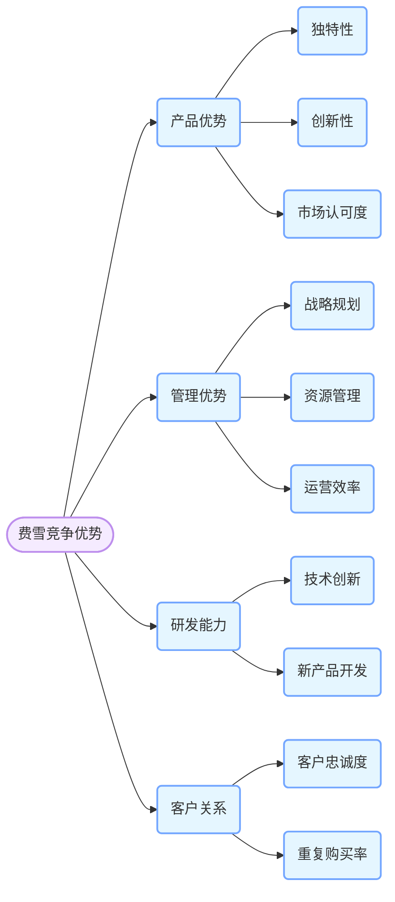

# 费雪的竞争优势分析：持续成功的关键

> 关键词：费雪、竞争优势、持续成功、投资分析、企业竞争力

> 摘要：本文围绕费雪的竞争优势展开深入分析，探讨其成为企业持续成功关键因素的原理和应用。通过介绍费雪竞争优势的背景知识，阐述其核心概念与联系，剖析核心算法原理及操作步骤，引入相关数学模型和公式，结合项目实战案例进行详细解读，介绍实际应用场景，推荐相关工具和资源，最后总结未来发展趋势与挑战，并对常见问题进行解答。旨在帮助读者全面理解费雪竞争优势的内涵，掌握其在投资和企业管理中的应用方法，为实现持续成功提供有力支持。

## 1. 背景介绍 
### 1.1 目的和范围
本文的目的在于全面深入地分析费雪的竞争优势理论，探究其在企业经营和投资领域中对于实现持续成功的关键作用。范围涵盖费雪竞争优势理论的核心概念、算法原理、数学模型，以及在实际项目中的应用案例，同时探讨其在不同行业和场景下的应用前景和发展趋势。

### 1.2 预期读者
本文预期读者包括投资者、企业管理者、经济学者、金融分析师以及对企业竞争优势和投资策略感兴趣的专业人士和爱好者。通过阅读本文，读者能够系统地了解费雪竞争优势理论，提升在投资决策和企业管理方面的能力。

### 1.3 文档结构概述
本文共分为十个部分。第一部分为背景介绍，阐述文章的目的、预期读者和文档结构，同时给出相关术语的定义和解释。第二部分介绍费雪竞争优势的核心概念与联系，通过文本示意图和 Mermaid 流程图进行直观展示。第三部分详细讲解核心算法原理，并给出具体操作步骤，结合 Python 源代码进行说明。第四部分引入数学模型和公式，进行详细讲解并举例说明。第五部分通过项目实战案例，介绍开发环境搭建、源代码实现和代码解读。第六部分探讨费雪竞争优势的实际应用场景。第七部分推荐相关的学习资源、开发工具框架和论文著作。第八部分总结未来发展趋势与挑战。第九部分为附录，解答常见问题。第十部分提供扩展阅读和参考资料。

### 1.4 术语表
#### 1.4.1 核心术语定义
- **费雪竞争优势**：由菲利普·费雪（Philip Fisher）提出的一种企业竞争优势理论，强调企业通过独特的产品、卓越的管理、良好的研发能力等因素，在市场中获得持续的竞争优势，从而实现长期的成功。
- **持续成功**：指企业在较长时间内保持稳定的增长和盈利，在市场中具有较强的竞争力和抗风险能力。
- **投资分析**：对投资项目的风险、收益、市场前景等进行评估和分析，以做出合理的投资决策。

#### 1.4.2 相关概念解释
- **企业竞争力**：企业在市场中与竞争对手相比，在产品、价格、服务、技术等方面所具有的优势和能力。
- **护城河理论**：与费雪竞争优势相关的一种理论，认为企业的竞争优势就像城堡周围的护城河，能够保护企业免受竞争对手的攻击，维持企业的长期盈利能力。

#### 1.4.3 缩略词列表
无

## 2. 核心概念与联系 
费雪竞争优势的核心概念主要包括以下几个方面：
- **产品优势**：企业拥有独特的、具有创新性的产品，能够满足消费者的需求，并且在市场中具有较高的认可度和竞争力。
- **管理优势**：优秀的企业管理团队能够制定合理的战略规划，有效地组织和管理企业的资源，提高企业的运营效率和效益。
- **研发能力**：强大的研发能力能够使企业不断推出新产品、新技术，保持在市场中的领先地位。
- **客户关系**：良好的客户关系能够提高客户的忠诚度，增加客户的重复购买率，为企业带来稳定的收入。

这些核心概念之间相互联系、相互影响，共同构成了企业的竞争优势。例如，优秀的管理团队能够推动产品研发和客户关系管理，而独特的产品和良好的客户关系又能够提升企业的市场竞争力，进一步促进企业的发展。

下面是费雪竞争优势核心概念的文本示意图：

```plaintext
费雪竞争优势
|-- 产品优势
|   |-- 独特性
|   |-- 创新性
|   |-- 市场认可度
|-- 管理优势
|   |-- 战略规划
|   |-- 资源管理
|   |-- 运营效率
|-- 研发能力
|   |-- 技术创新
|   |-- 新产品开发
|-- 客户关系
|   |-- 客户忠诚度
|   |-- 重复购买率
```

Mermaid 流程图如下：



## 3. 核心算法原理 & 具体操作步骤 
### 核心算法原理
费雪竞争优势的评估可以通过综合考虑多个因素来实现。一种常见的方法是构建一个评估模型，对每个核心概念进行量化评估，然后根据各因素的权重计算出企业的综合竞争优势得分。

假设我们将产品优势、管理优势、研发能力和客户关系作为四个主要的评估因素，每个因素又包含若干子因素。我们可以使用以下公式来计算企业的综合竞争优势得分：

$$S = w_1P + w_2M + w_3R + w_4C$$

其中，$S$ 表示企业的综合竞争优势得分，$P$ 表示产品优势得分，$M$ 表示管理优势得分，$R$ 表示研发能力得分，$C$ 表示客户关系得分，$w_1$、$w_2$、$w_3$、$w_4$ 分别表示各因素的权重，且 $w_1 + w_2 + w_3 + w_4 = 1$。

### 具体操作步骤
1. **确定评估因素和子因素**：根据费雪竞争优势的核心概念，确定产品优势、管理优势、研发能力和客户关系作为主要评估因素，并进一步确定每个因素的子因素。
2. **设定评估标准**：为每个子因素设定评估标准，例如，对于产品优势的独特性子因素，可以根据产品的专利数量、市场占有率等指标进行评估。
3. **收集数据**：收集企业在各个子因素方面的数据，例如，通过查阅企业的财务报表、市场调研报告等获取相关信息。
4. **计算各因素得分**：根据评估标准和收集到的数据，计算每个子因素的得分，然后汇总得到各主要因素的得分。
5. **确定权重**：根据各因素的重要性，确定 $w_1$、$w_2$、$w_3$、$w_4$ 的值。
6. **计算综合得分**：将各因素得分和权重代入公式 $S = w_1P + w_2M + w_3R + w_4C$，计算企业的综合竞争优势得分。

### Python 源代码实现
```python
# 定义各因素的权重
w1 = 0.3  # 产品优势权重
w2 = 0.2  # 管理优势权重
w3 = 0.3  # 研发能力权重
w4 = 0.2  # 客户关系权重

# 定义各因素得分
P = 80  # 产品优势得分
M = 75  # 管理优势得分
R = 85  # 研发能力得分
C = 70  # 客户关系得分

# 计算综合竞争优势得分
S = w1 * P + w2 * M + w3 * R + w4 * C

print(f"企业的综合竞争优势得分: {S}")
```

在上述代码中，我们首先定义了各因素的权重和得分，然后根据公式计算出企业的综合竞争优势得分，并将结果打印输出。

## 4. 数学模型和公式 & 详细讲解 & 举例说明 
### 数学模型和公式
在前面的核心算法原理中，我们已经介绍了计算企业综合竞争优势得分的公式：

$$S = w_1P + w_2M + w_3R + w_4C$$

其中，$S$ 表示企业的综合竞争优势得分，$P$ 表示产品优势得分，$M$ 表示管理优势得分，$R$ 表示研发能力得分，$C$ 表示客户关系得分，$w_1$、$w_2$、$w_3$、$w_4$ 分别表示各因素的权重，且 $w_1 + w_2 + w_3 + w_4 = 1$。

### 详细讲解
这个公式的原理是基于加权平均的思想，将各个因素的得分按照其重要性进行加权求和，得到企业的综合竞争优势得分。权重的设定反映了各因素在企业竞争优势中的相对重要性。例如，如果企业所处的行业对产品创新要求较高，那么产品优势的权重可能会相对较大；如果企业注重管理效率和团队协作，那么管理优势的权重可能会较高。

### 举例说明
假设我们要评估两家企业 A 和 B 的竞争优势。经过评估，得到以下数据：

| 企业 | 产品优势得分 ($P$) | 管理优势得分 ($M$) | 研发能力得分 ($R$) | 客户关系得分 ($C$) |
| ---- | ---- | ---- | ---- | ---- |
| A | 85 | 70 | 90 | 75 |
| B | 75 | 80 | 80 | 85 |

我们设定各因素的权重为：$w_1 = 0.3$，$w_2 = 0.2$，$w_3 = 0.3$，$w_4 = 0.2$。

对于企业 A：

$$S_A = 0.3\times85 + 0.2\times70 + 0.3\times90 + 0.2\times75$$
$$= 25.5 + 14 + 27 + 15$$
$$= 81.5$$

对于企业 B：

$$S_B = 0.3\times75 + 0.2\times80 + 0.3\times80 + 0.2\times85$$
$$= 22.5 + 16 + 24 + 17$$
$$= 79.5$$

通过计算可知，企业 A 的综合竞争优势得分高于企业 B，说明企业 A 在竞争中具有相对较强的优势。

## 5. 项目实战：代码实际案例和详细解释说明 
### 5.1  开发环境搭建
为了实现费雪竞争优势评估的项目实战，我们需要搭建一个 Python 开发环境。以下是具体的搭建步骤：
1. **安装 Python**：访问 Python 官方网站（https://www.python.org/downloads/），下载并安装适合你操作系统的 Python 版本。建议安装 Python 3.x 版本。
2. **安装开发工具**：可以选择使用 PyCharm、VS Code 等集成开发环境（IDE），或者使用 Jupyter Notebook 进行交互式开发。这里以 PyCharm 为例，访问 PyCharm 官方网站（https://www.jetbrains.com/pycharm/download/），下载并安装 PyCharm Community Edition。
3. **创建项目**：打开 PyCharm，选择“Create New Project”，创建一个新的 Python 项目。

### 5.2  源代码详细实现和代码解读
以下是一个完整的 Python 代码示例，用于实现费雪竞争优势的评估：

```python
# 定义各因素的权重
w1 = 0.3  # 产品优势权重
w2 = 0.2  # 管理优势权重
w3 = 0.3  # 研发能力权重
w4 = 0.2  # 客户关系权重

# 定义企业列表
companies = [
    {
        "name": "企业 A",
        "product_score": 85,
        "management_score": 70,
        "research_score": 90,
        "customer_score": 75
    },
    {
        "name": "企业 B",
        "product_score": 75,
        "management_score": 80,
        "research_score": 80,
        "customer_score": 85
    }
]

# 计算各企业的综合竞争优势得分
for company in companies:
    P = company["product_score"]
    M = company["management_score"]
    R = company["research_score"]
    C = company["customer_score"]
    S = w1 * P + w2 * M + w3 * R + w4 * C
    company["total_score"] = S
    print(f"{company['name']} 的综合竞争优势得分: {S}")

# 找出综合得分最高的企业
max_score_company = max(companies, key=lambda x: x["total_score"])
print(f"综合竞争优势得分最高的企业是: {max_score_company['name']}，得分: {max_score_company['total_score']}")
```

### 代码解读与分析
1. **权重定义**：定义了产品优势、管理优势、研发能力和客户关系四个因素的权重，分别为 $w_1 = 0.3$，$w_2 = 0.2$，$w_3 = 0.3$，$w_4 = 0.2$。
2. **企业列表**：创建了一个包含两个企业信息的列表，每个企业信息用一个字典表示，包含企业名称、产品优势得分、管理优势得分、研发能力得分和客户关系得分。
3. **计算综合得分**：使用 `for` 循环遍历企业列表，根据公式计算每个企业的综合竞争优势得分，并将得分存储在企业信息字典中。
4. **找出最高分企业**：使用 `max` 函数和 `lambda` 表达式找出综合得分最高的企业，并打印出企业名称和得分。

通过这个代码示例，我们可以方便地对多个企业的竞争优势进行评估和比较。

## 6. 实际应用场景 
费雪竞争优势理论在多个领域具有广泛的实际应用场景：
### 投资领域
投资者可以运用费雪竞争优势理论来评估企业的投资价值。通过分析企业的产品优势、管理优势、研发能力和客户关系等因素，投资者可以判断企业是否具有持续的竞争优势，从而做出合理的投资决策。例如，对于具有强大研发能力和独特产品优势的企业，投资者可能更愿意长期持有其股票，因为这类企业在市场中具有较高的竞争力和成长潜力。

### 企业战略规划
企业管理者可以利用费雪竞争优势理论来制定企业的战略规划。通过识别企业的竞争优势和劣势，管理者可以有针对性地制定发展战略，加强优势领域，改进劣势领域。例如，如果企业的产品优势不明显，管理者可以加大研发投入，推出更具创新性和竞争力的产品；如果企业的管理效率较低，管理者可以优化管理流程，提高运营效率。

### 市场竞争分析
在市场竞争分析中，费雪竞争优势理论可以帮助企业了解竞争对手的优势和劣势，从而制定相应的竞争策略。通过比较自身与竞争对手在各个因素上的得分，企业可以找出差距，采取差异化竞争策略，提高市场份额。例如，如果竞争对手在客户关系方面具有优势，企业可以加强客户服务，提高客户满意度，以缩小差距。

### 行业研究
行业研究人员可以运用费雪竞争优势理论来分析整个行业的竞争格局和发展趋势。通过对行业内企业的竞争优势进行评估和比较，研究人员可以发现行业的领先企业和潜在的竞争威胁，为行业发展提供参考。例如，在新兴行业中，具有较强研发能力和创新能力的企业可能更容易成为行业的领导者，研究人员可以关注这些企业的发展动态，预测行业的发展方向。

## 7. 工具和资源推荐
### 7.1 学习资源推荐
#### 7.1.1 书籍推荐
- 《怎样选择成长股》（菲利普·费雪著）：费雪的经典著作，详细阐述了他的投资理念和选择成长股的方法，对于理解费雪竞争优势理论具有重要的参考价值。
- 《竞争优势：创造与保持卓越绩效》（迈克尔·波特著）：波特的经典著作，深入探讨了企业竞争优势的来源和构建方法，与费雪竞争优势理论相互补充。

#### 7.1.2 在线课程
- Coursera 平台上的“投资学原理”课程：该课程涵盖了投资领域的基本原理和方法，包括企业分析和竞争优势评估等内容。
- edX 平台上的“战略管理”课程：介绍了企业战略管理的理论和实践，有助于理解如何运用竞争优势理论制定企业战略。

#### 7.1.3 技术博客和网站
- Seeking Alpha（https://seekingalpha.com/）：提供股票分析、投资策略等方面的文章和研究报告，其中不乏对企业竞争优势的分析和探讨。
- 雪球网（https://xueqiu.com/）：国内知名的投资社区，用户可以在上面分享投资经验和对企业的分析，了解不同视角下的企业竞争优势。

### 7.2 开发工具框架推荐
#### 7.2.1 IDE和编辑器
- PyCharm：功能强大的 Python 集成开发环境，提供代码编辑、调试、版本控制等功能，适合开发费雪竞争优势评估相关的 Python 代码。
- VS Code：轻量级的代码编辑器，支持多种编程语言和插件扩展，可用于快速编写和调试 Python 代码。

#### 7.2.2 调试和性能分析工具
- PDB：Python 自带的调试器，可以帮助开发者逐步执行代码，查找和解决代码中的问题。
- cProfile：Python 标准库中的性能分析工具，可用于分析代码的执行时间和性能瓶颈。

#### 7.2.3 相关框架和库
- Pandas：用于数据处理和分析的 Python 库，可帮助开发者处理和分析企业数据，计算各因素得分。
- NumPy：Python 的数值计算库，提供高效的数组操作和数学函数，可用于实现费雪竞争优势评估的数学模型。

### 7.3 相关论文著作推荐
#### 7.3.1 经典论文
- "The Theory of Competitive Advantage"（Michael Porter）：波特的经典论文，系统地阐述了企业竞争优势的理论和模型。
- "Investment Philosophy and the Search for Growth Stocks"（Philip Fisher）：费雪关于投资理念和成长股选择的重要论文，为理解费雪竞争优势理论提供了理论基础。

#### 7.3.2 最新研究成果
- 关注《Journal of Financial Economics》、《The Review of Financial Studies》等金融领域的顶级学术期刊，这些期刊会发表关于企业竞争优势和投资分析的最新研究成果。

#### 7.3.3 应用案例分析
- 一些商业咨询公司和研究机构会发布关于企业竞争优势的应用案例分析报告，例如麦肯锡公司、波士顿咨询集团等的研究报告，这些案例分析可以帮助读者更好地理解费雪竞争优势理论在实际中的应用。

## 8. 总结：未来发展趋势与挑战
### 未来发展趋势
- **数字化转型**：随着信息技术的快速发展，企业的数字化转型将成为提升竞争优势的关键。通过数字化技术，企业可以实现生产、管理、营销等环节的智能化和自动化，提高运营效率和创新能力。
- **可持续发展**：消费者对企业的社会责任和可持续发展越来越关注，具有良好可持续发展战略的企业将更具竞争优势。未来，企业需要在环境保护、社会公益等方面加大投入，实现经济、社会和环境的协调发展。
- **全球化竞争**：经济全球化的趋势不断加强，企业面临的竞争将更加激烈。企业需要加强国际合作，拓展海外市场，提升在全球市场的竞争力。
- **人工智能和大数据应用**：人工智能和大数据技术将在企业竞争优势评估和战略决策中发挥越来越重要的作用。通过对大量数据的分析和挖掘，企业可以更准确地了解市场需求和竞争对手情况，制定更加科学合理的竞争策略。

### 挑战
- **技术更新换代快**：信息技术的快速发展使得技术更新换代的速度越来越快，企业需要不断投入资源进行技术研发和创新，以跟上技术发展的步伐，否则将面临被市场淘汰的风险。
- **人才竞争激烈**：具备数字化、创新能力和国际化视野的人才是企业提升竞争优势的关键。然而，这类人才的竞争非常激烈，企业需要制定有效的人才吸引和培养策略，以满足企业发展的需求。
- **市场不确定性增加**：全球经济形势的不确定性、政策法规的变化等因素都会给企业带来市场风险。企业需要加强风险管理，提高应对市场变化的能力。
- **数据安全和隐私问题**：随着企业数字化程度的提高，数据安全和隐私问题日益突出。企业需要加强数据安全管理，保护客户和企业的隐私信息，否则将面临法律风险和声誉损失。

## 9. 附录：常见问题与解答
### 问题 1：如何确定各因素的权重？
确定各因素的权重需要综合考虑多个因素，例如企业所处的行业特点、发展阶段、战略目标等。一般来说，可以采用专家评估法、层次分析法等方法来确定权重。专家评估法是邀请行业专家根据经验和专业知识对各因素的重要性进行评估，然后综合专家意见确定权重。层次分析法是一种数学方法，通过构建层次结构模型，比较各因素之间的相对重要性，从而确定权重。

### 问题 2：费雪竞争优势理论适用于所有行业吗？
费雪竞争优势理论的基本原理适用于大多数行业，但在不同行业中，各因素的重要性可能会有所不同。例如，在科技行业，研发能力和产品创新可能更为重要；在服务行业，客户关系和管理效率可能更为关键。因此，在应用费雪竞争优势理论时，需要根据行业特点进行适当的调整和优化。

### 问题 3：如何收集企业在各因素方面的数据？
可以通过多种途径收集企业在各因素方面的数据。例如，企业的财务报表可以提供有关企业经营业绩、资产负债等方面的信息；市场调研报告可以了解企业的市场份额、产品口碑等情况；企业的官方网站、新闻报道等可以获取企业的战略规划、研发成果等信息。此外，还可以通过与企业内部人员、客户、供应商等进行访谈和调研，获取更详细的信息。

### 问题 4：费雪竞争优势理论与其他竞争优势理论有什么区别和联系？
费雪竞争优势理论强调企业的产品、管理、研发和客户关系等方面的优势，注重企业的长期发展和持续盈利能力。与迈克尔·波特的竞争优势理论相比，波特的理论更侧重于从产业结构和竞争战略的角度来分析企业的竞争优势，而费雪的理论更关注企业内部的核心竞争力。两者相互补充，可以为企业的竞争优势分析提供更全面的视角。

## 10. 扩展阅读 & 参考资料
### 扩展阅读
- 《创新者的窘境》（克莱顿·克里斯坦森著）：探讨了企业在面对技术创新和市场变化时的挑战和机遇，对于理解企业竞争优势的动态变化具有重要意义。
- 《从优秀到卓越》（吉姆·柯林斯著）：研究了企业从优秀到卓越的转变过程，分析了企业持续成功的关键因素，与费雪竞争优势理论相关。

### 参考资料
- Fisher, P. A. (1958). Common Stocks and Uncommon Profits. Harper & Brothers.
- Porter, M. E. (1985). Competitive Advantage: Creating and Sustaining Superior Performance. Free Press.
- 相关学术期刊文章、研究报告和行业资料。