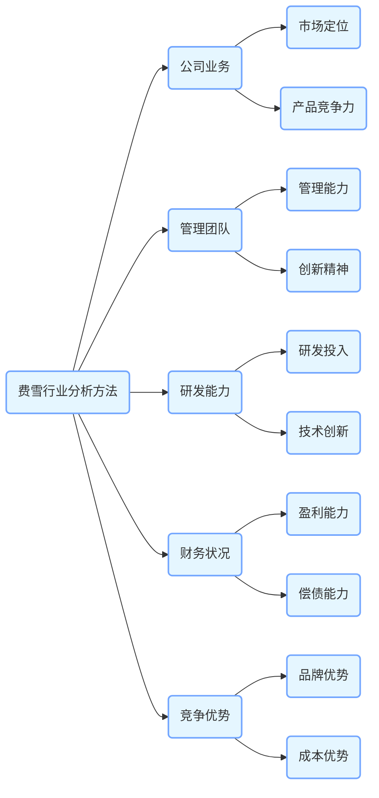

# 费雪的行业分析方法：寻找高增长机会

> 关键词：费雪、行业分析方法、高增长机会、投资、公司评估

> 摘要：本文聚焦于费雪的行业分析方法，旨在深入探讨如何运用该方法寻找高增长机会。首先介绍了费雪行业分析方法的背景，包括其目的、适用读者、文档结构和相关术语。接着阐述了核心概念与联系，通过文本示意图和 Mermaid 流程图清晰呈现。详细讲解了核心算法原理及具体操作步骤，结合 Python 源代码进行阐述。同时给出了相关的数学模型和公式，并举例说明。通过项目实战，展示了代码实际案例并进行详细解释。探讨了该方法的实际应用场景，推荐了相关的工具和资源。最后总结了未来发展趋势与挑战，提供了常见问题解答和扩展阅读参考资料，帮助读者全面掌握费雪的行业分析方法以捕捉高增长机会。

## 1. 背景介绍 
### 1.1 目的和范围
费雪的行业分析方法是一种具有深远影响力的投资分析工具，其目的在于帮助投资者从众多行业和公司中筛选出具有高增长潜力的投资标的。通过对公司的深入研究和评估，该方法旨在揭示公司的内在价值和成长前景，为投资者的决策提供有力支持。本文章的范围将涵盖费雪行业分析方法的各个方面，包括核心概念、算法原理、数学模型、实际应用案例等，以全面呈现该方法的全貌和应用价值。

### 1.2 预期读者
本文预期读者主要包括投资者、金融分析师、投资顾问、对投资分析方法感兴趣的学生以及从事相关领域研究的专业人士。无论是初涉投资领域的新手，还是经验丰富的专业投资者，都可以从本文中获取关于费雪行业分析方法的详细信息和实用指导，提升自身的投资分析能力。

### 1.3 文档结构概述
本文将按照以下结构进行阐述：首先介绍费雪行业分析方法的背景信息，包括目的、读者和术语等；接着深入探讨核心概念与联系，通过文本示意图和流程图直观呈现；然后详细讲解核心算法原理和具体操作步骤，结合 Python 代码进行说明；随后给出相关的数学模型和公式，并举例解释；通过项目实战展示实际应用案例和代码解读；探讨该方法的实际应用场景；推荐相关的工具和资源；最后总结未来发展趋势与挑战，提供常见问题解答和扩展阅读参考资料。

### 1.4 术语表
#### 1.4.1 核心术语定义
- **费雪的行业分析方法**：由菲利普·费雪（Philip Fisher）提出的一种投资分析方法，侧重于对公司的业务、管理、研发等多个方面进行深入研究，以评估公司的长期增长潜力。
- **高增长机会**：指公司或行业在未来一段时间内具有较高的盈利增长速度和市场份额扩张潜力的投资机会。
- **内在价值**：公司的真实价值，由其资产、盈利能力、增长潜力等因素决定，而非市场价格。

#### 1.4.2 相关概念解释
- **定性分析**：通过对公司的业务模式、管理团队、企业文化等非量化因素进行分析，评估公司的竞争优势和发展前景。
- **定量分析**：运用财务数据和统计方法，对公司的财务状况、盈利能力、偿债能力等进行量化评估。

#### 1.4.3 缩略词列表
- **PE**：市盈率（Price - Earnings Ratio），衡量公司股票价格与每股盈利之间的比率。
- **ROE**：净资产收益率（Return on Equity），反映公司运用自有资本的效率。

## 2. 核心概念与联系 

费雪的行业分析方法基于对公司的全面评估，核心在于寻找具有持续竞争优势和高增长潜力的公司。该方法强调定性分析和定量分析相结合，通过对公司的多个方面进行深入研究，来判断公司是否值得投资。

### 文本示意图
费雪的行业分析方法主要围绕以下几个核心方面展开：
1. **公司业务**：了解公司的主营业务、市场定位、产品或服务的竞争力等。
2. **管理团队**：评估管理团队的能力、经验、诚信和创新精神。
3. **研发能力**：考察公司的研发投入、技术创新能力和新产品推出速度。
4. **财务状况**：分析公司的财务报表，包括盈利能力、偿债能力、现金流等。
5. **竞争优势**：确定公司相对于竞争对手的优势，如品牌、成本、技术等。

这些方面相互关联，共同影响公司的长期增长潜力。例如，优秀的管理团队能够制定合理的战略，推动公司的业务发展；强大的研发能力可以帮助公司推出具有竞争力的产品，提升市场份额；良好的财务状况则为公司的持续发展提供保障。

### Mermaid 流程图


## 3. 核心算法原理 & 具体操作步骤 

### 核心算法原理
费雪的行业分析方法并没有严格意义上的固定算法，而是一种综合的分析框架。其核心思想是通过对公司的多个维度进行评估，计算出公司的综合得分，以此来判断公司的投资价值。具体来说，可以将每个评估维度赋予一定的权重，然后根据公司在各个维度上的表现进行打分，最后将各项得分加权求和得到综合得分。

### 具体操作步骤

#### 步骤 1：确定评估维度和权重
根据费雪的行业分析方法，确定需要评估的维度，如公司业务、管理团队、研发能力、财务状况、竞争优势等。然后根据每个维度的重要性，赋予相应的权重。例如：
| 评估维度 | 权重 |
|---|---|
| 公司业务 | 0.2 |
| 管理团队 | 0.2 |
| 研发能力 | 0.2 |
| 财务状况 | 0.2 |
| 竞争优势 | 0.2 |

#### 步骤 2：对每个维度进行打分
根据公司在各个维度上的表现，进行打分。打分可以采用 1 - 10 分的评分标准，1 分表示表现较差，10 分表示表现优秀。例如：
| 评估维度 | 得分 |
|---|---|
| 公司业务 | 7 |
| 管理团队 | 8 |
| 研发能力 | 6 |
| 财务状况 | 7 |
| 竞争优势 | 7 |

#### 步骤 3：计算综合得分
将每个维度的得分乘以相应的权重，然后求和得到综合得分。计算公式为：
$$综合得分 = \sum_{i = 1}^{n} 维度得分_i \times 权重_i$$

### Python 源代码实现
```python
# 定义评估维度和权重
dimensions = ["公司业务", "管理团队", "研发能力", "财务状况", "竞争优势"]
weights = [0.2, 0.2, 0.2, 0.2, 0.2]

# 定义公司在各个维度上的得分
scores = [7, 8, 6, 7, 7]

# 计算综合得分
total_score = 0
for i in range(len(dimensions)):
    total_score += scores[i] * weights[i]

print(f"公司的综合得分是: {total_score}")
```

### 代码解释
1. 首先定义了评估维度和对应的权重，存储在 `dimensions` 和 `weights` 列表中。
2. 然后定义了公司在各个维度上的得分，存储在 `scores` 列表中。
3. 使用 `for` 循环遍历每个维度，将得分乘以权重并累加到 `total_score` 中。
4. 最后打印出公司的综合得分。

## 4. 数学模型和公式 & 详细讲解 & 举例说明 

### 数学模型
费雪的行业分析方法的数学模型可以用以下公式表示：
$$V = \sum_{i = 1}^{n} w_i \times s_i$$
其中：
- $V$ 表示公司的综合得分，即投资价值。
- $w_i$ 表示第 $i$ 个评估维度的权重，且 $\sum_{i = 1}^{n} w_i = 1$。
- $s_i$ 表示公司在第 $i$ 个评估维度上的得分。

### 详细讲解
该数学模型的核心思想是通过对公司的多个评估维度进行加权求和，得到一个综合的投资价值得分。权重 $w_i$ 反映了每个评估维度的重要性，得分 $s_i$ 则反映了公司在该维度上的表现。通过这种方式，可以综合考虑公司的各个方面，更全面地评估公司的投资价值。

### 举例说明
假设我们要评估一家科技公司的投资价值，按照上述步骤确定了评估维度和权重，以及公司在各个维度上的得分如下：
| 评估维度 | 权重 | 得分 |
|---|---|---|
| 公司业务 | 0.2 | 7 |
| 管理团队 | 0.2 | 8 |
| 研发能力 | 0.2 | 6 |
| 财务状况 | 0.2 | 7 |
| 竞争优势 | 0.2 | 7 |

根据数学模型，计算该公司的综合得分：
$$V = 0.2 \times 7 + 0.2 \times 8 + 0.2 \times 6 + 0.2 \times 7 + 0.2 \times 7$$
$$V = 1.4 + 1.6 + 1.2 + 1.4 + 1.4$$
$$V = 7$$

综合得分 7 分表明该公司具有一定的投资价值，但仍有提升空间。投资者可以根据这个得分，结合其他因素，做出投资决策。

## 5. 项目实战：代码实际案例和详细解释说明 

### 5.1  开发环境搭建
为了实现费雪的行业分析方法的代码，我们需要搭建以下开发环境：
- **Python 环境**：建议使用 Python 3.7 及以上版本。可以从 Python 官方网站（https://www.python.org/downloads/）下载并安装。
- **开发工具**：推荐使用 PyCharm 或 Visual Studio Code 等集成开发环境（IDE），方便编写、调试和运行代码。

### 5.2  源代码详细实现和代码解读
```python
# 定义评估维度和权重
dimensions = ["公司业务", "管理团队", "研发能力", "财务状况", "竞争优势"]
weights = [0.2, 0.2, 0.2, 0.2, 0.2]

# 定义一个函数来计算综合得分
def calculate_total_score(scores):
    total_score = 0
    for i in range(len(dimensions)):
        total_score += scores[i] * weights[i]
    return total_score

# 示例公司的得分
company_scores = [7, 8, 6, 7, 7]

# 计算示例公司的综合得分
total_score = calculate_total_score(company_scores)

# 打印结果
print(f"示例公司的综合得分是: {total_score}")
```

### 代码解读与分析
1. **定义评估维度和权重**：`dimensions` 列表存储了评估维度的名称，`weights` 列表存储了对应的权重。
2. **定义计算综合得分的函数**：`calculate_total_score` 函数接受一个得分列表作为参数，通过遍历每个维度，将得分乘以权重并累加到 `total_score` 中，最后返回综合得分。
3. **示例公司的得分**：`company_scores` 列表存储了示例公司在各个维度上的得分。
4. **计算综合得分**：调用 `calculate_total_score` 函数，传入示例公司的得分列表，得到综合得分。
5. **打印结果**：使用 `print` 函数打印出示例公司的综合得分。

## 6. 实际应用场景 
费雪的行业分析方法在投资领域有广泛的应用场景，主要包括以下几个方面：

### 股票投资
投资者可以使用该方法评估不同公司的投资价值，筛选出具有高增长潜力的股票。通过对公司的业务、管理、研发等多个方面进行深入分析，投资者可以更准确地判断公司的长期发展前景，从而做出明智的投资决策。

### 行业研究
金融分析师可以运用费雪的行业分析方法对不同行业进行研究，了解行业内公司的竞争格局和发展趋势。通过比较不同公司在各个评估维度上的表现，分析师可以找出行业内的领先企业和具有潜力的新兴企业，为行业研究和投资建议提供依据。

### 企业并购
在企业并购过程中，收购方可以使用该方法评估目标公司的价值。通过对目标公司的全面评估，收购方可以了解目标公司的优势和劣势，判断其是否与自身的战略目标相契合，从而决定是否进行并购以及确定合理的并购价格。

### 创业投资
创业投资者可以利用该方法评估创业项目的投资价值。在众多的创业项目中，通过对项目团队、技术创新、商业模式等方面的评估，投资者可以筛选出具有高增长潜力的项目，提高投资成功率。

## 7. 工具和资源推荐
### 7.1 学习资源推荐
#### 7.1.1 书籍推荐
- 《怎样选择成长股》（Common Stocks and Uncommon Profits）：菲利普·费雪的经典著作，详细阐述了他的投资理念和行业分析方法。
- 《聪明的投资者》（The Intelligent Investor）：本杰明·格雷厄姆的投资经典，与费雪的方法相互补充，提供了全面的投资指导。
- 《财务报表分析与证券定价》（Financial Statement Analysis and Security Valuation）：深入讲解了财务报表分析的方法和技巧，对于理解费雪行业分析方法中的财务评估部分有很大帮助。

#### 7.1.2 在线课程
- Coursera 上的“投资学原理”（Principles of Investing）：由知名教授授课，涵盖了投资分析的基本原理和方法，包括行业分析和公司评估。
- edX 上的“财务报表分析”（Financial Statement Analysis）：系统介绍了财务报表分析的理论和实践，帮助学习者掌握费雪行业分析方法中的财务分析技巧。

#### 7.1.3 技术博客和网站
- Seeking Alpha（https://seekingalpha.com/）：提供专业的投资分析和研究报告，涵盖了各种行业和公司的分析，是学习费雪行业分析方法的重要参考资源。
- 雪球（https://xueqiu.com/）：国内知名的投资社区，有很多投资者分享自己的投资经验和分析方法，包括对费雪行业分析方法的应用案例。

### 7.2 开发工具框架推荐
#### 7.2.1 IDE和编辑器
- PyCharm：专业的 Python 集成开发环境，提供了丰富的代码编辑、调试和分析功能，适合开发费雪行业分析方法的相关代码。
- Visual Studio Code：轻量级的代码编辑器，支持多种编程语言，通过安装相关插件可以方便地进行 Python 开发。

#### 7.2.2 调试和性能分析工具
- PDB：Python 内置的调试器，可以帮助开发者定位代码中的问题，进行单步调试和变量查看。
- cProfile：Python 标准库中的性能分析工具，可以分析代码的运行时间和函数调用情况，帮助优化代码性能。

#### 7.2.3 相关框架和库
- Pandas：强大的数据分析库，提供了高效的数据结构和数据处理方法，可用于处理和分析财务数据。
- NumPy：Python 的科学计算库，提供了多维数组和数学函数，可用于数值计算和矩阵运算。

### 7.3 相关论文著作推荐
#### 7.3.1 经典论文
- “The Theory of Investment Value” by John Burr Williams：奠定了公司估值的理论基础，对费雪的行业分析方法有重要的理论支持。
- “Capital Asset Pricing Model: Theory and Evidence” by Eugene F. Fama and Kenneth R. French：介绍了资本资产定价模型，对于理解投资风险和回报有重要意义。

#### 7.3.2 最新研究成果
- 关注《Journal of Finance》《Review of Financial Studies》等顶级金融学术期刊，这些期刊会发表关于投资分析和行业研究的最新研究成果。

#### 7.3.3 应用案例分析
- 阅读知名投资机构的研究报告和案例分析，了解他们如何运用费雪的行业分析方法进行投资决策和行业研究。

## 8. 总结：未来发展趋势与挑战
### 未来发展趋势
- **数据驱动的分析**：随着大数据和人工智能技术的发展，费雪的行业分析方法将越来越多地结合数据驱动的分析手段。通过收集和分析大量的公司数据、行业数据和市场数据，可以更准确地评估公司的投资价值和增长潜力。
- **跨学科融合**：未来的行业分析将不仅仅局限于财务和经济领域，还将融合管理学、心理学、社会学等多个学科的知识。例如，通过研究管理团队的行为和心理特征，更好地评估管理团队的能力和决策质量。
- **全球视野**：随着经济全球化的深入发展，投资者将更加关注全球范围内的投资机会。费雪的行业分析方法将需要适应不同国家和地区的市场环境和文化差异，提供更全面的全球投资分析视角。

### 挑战
- **数据质量和可靠性**：数据驱动的分析依赖于高质量和可靠的数据。然而，在实际应用中，数据可能存在不准确、不完整或过时的问题，这将影响分析结果的准确性。
- **模型的复杂性和解释性**：随着分析方法的不断发展，模型可能会变得越来越复杂。复杂的模型虽然可以提高分析的准确性，但也会降低模型的解释性，使得投资者难以理解和信任分析结果。
- **市场变化的不确定性**：市场环境是不断变化的，新的技术、政策和竞争态势可能会对公司的发展产生重大影响。费雪的行业分析方法需要不断适应市场变化，及时调整分析策略和模型。

## 9. 附录：常见问题与解答
### 问题 1：费雪的行业分析方法适用于所有行业吗？
解答：费雪的行业分析方法具有一定的通用性，但不同行业的特点和评估重点可能会有所不同。在应用该方法时，需要根据行业的特点进行适当的调整和补充。例如，对于科技行业，研发能力和创新精神可能更为重要；对于传统制造业，成本控制和生产效率可能是关键因素。

### 问题 2：如何确定评估维度的权重？
解答：评估维度的权重可以根据投资者的投资目标、风险偏好和行业特点来确定。一般来说，可以参考历史数据、专家意见和市场经验，对每个评估维度的重要性进行主观判断。也可以使用统计方法，如主成分分析，来确定各个维度的相对重要性。

### 问题 3：费雪的行业分析方法与其他投资分析方法有什么区别？
解答：费雪的行业分析方法强调对公司的定性分析和长期增长潜力的评估，注重公司的业务模式、管理团队和研发能力等因素。而其他投资分析方法，如基本面分析、技术分析等，可能更侧重于财务数据和市场趋势的分析。费雪的方法更适合寻找具有长期投资价值的公司，而其他方法可能更适用于短期交易和市场时机的把握。

## 10. 扩展阅读 & 参考资料
- 菲利普·费雪. 《怎样选择成长股》. 机械工业出版社.
- 本杰明·格雷厄姆. 《聪明的投资者》. 人民邮电出版社.
- John Burr Williams. “The Theory of Investment Value”. Harvard University Press.
- Eugene F. Fama and Kenneth R. French. “Capital Asset Pricing Model: Theory and Evidence”. Journal of Finance.
- Seeking Alpha（https://seekingalpha.com/）
- 雪球（https://xueqiu.com/）