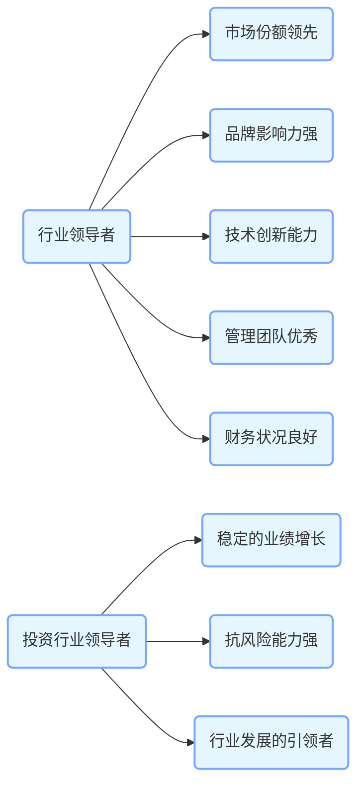

# 费雪的行业领导者投资策略

> 关键词：费雪、行业领导者、投资策略、成长股、基本面分析

> 摘要：本文深入探讨了费雪的行业领导者投资策略。首先介绍了该策略产生的背景，包括目的、预期读者等内容。接着阐述了核心概念与联系，分析了行业领导者的特征及与投资的关联。详细讲解了核心算法原理及具体操作步骤，通过 Python 代码示例进行说明。呈现了相关的数学模型和公式并举例解释。结合项目实战，给出代码实际案例及详细解读。探讨了该策略的实际应用场景，推荐了相关的学习资源、开发工具框架以及论文著作。最后总结了未来发展趋势与挑战，解答常见问题并提供扩展阅读和参考资料，旨在帮助投资者深入理解和运用费雪的行业领导者投资策略，实现更优的投资决策。

## 1. 背景介绍 
### 1.1 目的和范围
费雪的行业领导者投资策略旨在帮助投资者识别具有长期增长潜力的行业领导者企业，并通过投资这些企业实现资产的增值。该策略的范围涵盖了各个行业，无论是传统的制造业、金融业，还是新兴的科技、医疗等行业，只要存在具有竞争优势的行业领导者，都可以运用此策略进行投资分析。其目的不仅在于短期的获利，更注重长期的价值投资，通过持有优质企业的股票分享企业成长带来的红利。

### 1.2 预期读者
本文预期读者主要包括对股票投资有兴趣的个人投资者，无论是新手投资者希望学习专业的投资策略，还是有一定经验的投资者寻求优化投资组合的方法，都能从本文中获得有价值的信息。同时，金融从业者，如基金经理、投资顾问等，也可以通过深入研究费雪的行业领导者投资策略，为客户提供更专业的投资建议，优化投资产品的设计和管理。

### 1.3 文档结构概述
本文将按照以下结构展开：首先介绍费雪的行业领导者投资策略的背景信息，包括目的、预期读者等。接着阐述该策略的核心概念与联系，明确行业领导者的定义和特征以及与投资决策的关系。然后详细讲解核心算法原理和具体操作步骤，并通过 Python 代码进行示例。呈现相关的数学模型和公式并举例说明。结合项目实战，给出实际的代码案例并进行详细解读。探讨该策略在不同场景下的实际应用。推荐相关的学习资源、开发工具框架以及论文著作。最后总结未来发展趋势与挑战，解答常见问题并提供扩展阅读和参考资料。

### 1.4 术语表
#### 1.4.1 核心术语定义
- **行业领导者**：在特定行业中，具有领先的市场份额、强大的品牌影响力、先进的技术实力、高效的管理团队以及良好的财务状况的企业。这些企业通常能够引领行业的发展趋势，对行业的竞争格局产生重要影响。
- **成长股**：指发行股票的公司销售额和利润额持续增长，并且其增长速度快于整个国家及其所在行业的公司的股票。成长股通常具有较高的市盈率和市净率，投资者购买成长股是预期公司未来的盈利增长能够支撑股价的上升。
- **基本面分析**：通过对公司的财务报表、行业竞争地位、管理层素质、经营战略等基本面因素进行分析，评估公司的内在价值，从而判断股票的投资价值。

#### 1.4.2 相关概念解释
- **竞争优势**：企业相对于竞争对手所具有的独特优势，包括成本优势、产品差异化优势、技术优势、品牌优势等。竞争优势是企业能够在市场中获得超额利润的关键因素。
- **护城河**：由巴菲特提出的概念，指企业所拥有的可持续的竞争优势，就像城堡周围的护城河一样，能够保护企业免受竞争对手的攻击，维持企业的长期盈利能力。

#### 1.4.3 缩略词列表
- **PE**：市盈率（Price - Earnings Ratio），是指股票价格除以每股收益（EPS）的比率，反映了市场对公司盈利的预期。
- **PB**：市净率（Price - to - Book Ratio），是指股票价格与每股净资产的比率，反映了市场对公司净资产的估值。

## 2. 核心概念与联系 

### 行业领导者的特征
行业领导者通常具有以下几个显著特征：
1. **市场份额领先**：在所在行业中占据较大的市场份额，能够对行业的价格、产量等方面产生重要影响。例如，苹果公司在智能手机市场中一直占据着较高的市场份额，其产品的定价策略和新品发布往往会影响整个智能手机行业的发展。
2. **品牌影响力强**：拥有广泛认可和高度信赖的品牌，品牌价值高。可口可乐作为全球知名的饮料品牌，其品牌影响力不仅体现在消费者对其产品的忠诚度上，还体现在品牌的市场号召力和溢价能力上。
3. **技术创新能力**：持续投入研发，保持技术的领先地位。谷歌在搜索引擎技术、人工智能等领域不断进行创新，通过技术优势巩固其在互联网行业的领导者地位。
4. **管理团队优秀**：拥有一支经验丰富、能力卓越的管理团队，能够制定正确的发展战略，有效地组织和管理企业的运营。例如，亚马逊的创始人杰夫·贝索斯以其卓越的战略眼光和管理能力，带领亚马逊成为全球电子商务和云计算领域的领导者。
5. **财务状况良好**：具有稳定的盈利能力、健康的资产负债结构和充足的现金流。微软公司多年来保持着良好的财务状况，其强大的盈利能力和充足的现金流为其持续的研发投入和业务拓展提供了坚实的保障。

### 行业领导者与投资的联系
投资行业领导者企业具有多方面的优势：
1. **稳定的业绩增长**：行业领导者通常能够凭借其竞争优势实现持续的业绩增长，为投资者带来稳定的股息收入和资本增值。例如，贵州茅台作为白酒行业的领导者，其业绩多年来保持着稳健的增长，股价也随之不断攀升，为投资者带来了丰厚的回报。
2. **抗风险能力强**：在经济周期波动和行业竞争加剧的情况下，行业领导者企业由于其强大的实力和市场地位，能够更好地抵御风险。例如，在 2008 年全球金融危机期间，一些大型银行和金融机构由于风险控制不力纷纷倒闭，而像摩根大通这样的行业领导者凭借其稳健的经营和充足的资本储备，成功度过了危机。
3. **行业发展的引领者**：行业领导者往往能够引领行业的发展趋势，率先受益于行业的增长和变革。例如，特斯拉在电动汽车领域的创新和发展，推动了全球汽车行业向电动化和智能化转型，特斯拉的投资者也因此获得了巨大的收益。

### 文本示意图
```plaintext
行业领导者
|--市场份额领先
|--品牌影响力强
|--技术创新能力
|--管理团队优秀
|--财务状况良好

投资行业领导者
|--稳定的业绩增长
|--抗风险能力强
|--行业发展的引领者
```

### Mermaid 流程图


## 3. 核心算法原理 & 具体操作步骤 

### 核心算法原理
费雪的行业领导者投资策略的核心在于通过对企业的基本面进行深入分析，筛选出具有竞争优势的行业领导者企业。具体来说，需要综合考虑多个因素，包括财务指标、行业地位、管理能力等。可以使用多因素评分模型来评估企业的综合实力，每个因素赋予一定的权重，最后将各个因素的得分加权求和，得到企业的综合得分。得分越高的企业，越有可能是行业领导者，具有更高的投资价值。

### 具体操作步骤
1. **确定评估因素**：根据费雪的投资理念，确定评估企业的关键因素，如市场份额、品牌价值、研发投入、净利润增长率、资产负债率等。
2. **设定权重**：根据各个因素的重要性，为每个因素设定相应的权重。例如，市场份额和净利润增长率可能权重较高，而资产负债率的权重相对较低。
3. **数据收集**：收集各个企业的相关数据，包括财务报表、行业报告、市场调研数据等。
4. **因素评分**：根据收集到的数据，对每个企业的各个因素进行评分。评分可以采用百分制或其他评分标准。
5. **加权求和**：将每个因素的得分乘以其对应的权重，然后将所有因素的加权得分相加，得到企业的综合得分。
6. **筛选企业**：根据综合得分，筛选出得分较高的企业，这些企业即为潜在的行业领导者企业。

### Python 源代码示例
```python
import pandas as pd

# 定义评估因素和权重
factors = ['市场份额', '品牌价值', '研发投入', '净利润增长率', '资产负债率']
weights = [0.3, 0.2, 0.2, 0.2, 0.1]

# 示例数据：假设有三家企业 A、B、C
data = {
    '企业名称': ['A', 'B', 'C'],
    '市场份额': [80, 60, 70],
    '品牌价值': [70, 80, 65],
    '研发投入': [60, 75, 70],
    '净利润增长率': [20, 15, 18],
    '资产负债率': [30, 40, 35]
}

df = pd.DataFrame(data)

# 定义评分函数
def calculate_score(row):
    score = 0
    for i, factor in enumerate(factors):
        score += row[factor] * weights[i]
    return score

# 计算综合得分
df['综合得分'] = df.apply(calculate_score, axis=1)

# 按综合得分降序排序
df = df.sort_values(by='综合得分', ascending=False)

print(df)
```
### 代码解释
1. **定义评估因素和权重**：使用列表 `factors` 定义了评估企业的关键因素，使用列表 `weights` 为每个因素设定了相应的权重。
2. **示例数据**：使用字典 `data` 存储了三家企业的相关数据，并使用 `pandas` 库的 `DataFrame` 函数将数据转换为数据框。
3. **定义评分函数**：定义了一个名为 `calculate_score` 的函数，该函数接受一行数据作为输入，根据每个因素的得分和权重计算综合得分。
4. **计算综合得分**：使用 `apply` 函数将 `calculate_score` 函数应用到数据框的每一行，计算每个企业的综合得分，并将结果存储在新的列 `综合得分` 中。
5. **排序**：使用 `sort_values` 函数按综合得分降序排序，得到综合得分较高的企业排在前面。

## 4. 数学模型和公式 & 详细讲解 & 举例说明 

### 数学模型和公式
设企业的评估因素有 $n$ 个，分别为 $x_1, x_2, \cdots, x_n$，对应的权重分别为 $w_1, w_2, \cdots, w_n$，其中 $\sum_{i = 1}^{n} w_i = 1$。则企业的综合得分 $S$ 可以表示为：

$$S=\sum_{i = 1}^{n} w_i x_i$$

### 详细讲解
该公式的含义是将每个评估因素的得分 $x_i$ 乘以其对应的权重 $w_i$，然后将所有因素的加权得分相加，得到企业的综合得分 $S$。权重 $w_i$ 反映了每个因素在评估企业时的重要性，权重越大，该因素对综合得分的影响越大。

### 举例说明
假设有一家企业，其评估因素和得分如下：
| 评估因素 | 得分 | 权重 |
|---|---|---|
| 市场份额 | 80 | 0.3 |
| 品牌价值 | 70 | 0.2 |
| 研发投入 | 60 | 0.2 |
| 净利润增长率 | 20 | 0.2 |
| 资产负债率 | 30 | 0.1 |

根据上述公式，该企业的综合得分 $S$ 为：

$$
\begin{align*}
S&=0.3\times80 + 0.2\times70+0.2\times60 + 0.2\times20+0.1\times30\\
&=24 + 14+12 + 4+3\\
&=57
\end{align*}
$$

通过计算综合得分，可以对不同企业进行比较和筛选，选择综合得分较高的企业进行投资。

## 5. 项目实战：代码实际案例和详细解释说明 

### 5.1  开发环境搭建
1. **安装 Python**：访问 Python 官方网站（https://www.python.org/downloads/），下载并安装适合你操作系统的 Python 版本。建议安装 Python 3.7 及以上版本。
2. **安装依赖库**：使用 `pip` 命令安装所需的依赖库，主要包括 `pandas` 库，用于数据处理和分析。在命令行中执行以下命令：
```sh
pip install pandas
```

### 5.2  源代码详细实现和代码解读
```python
import pandas as pd

# 定义评估因素和权重
factors = ['市场份额', '品牌价值', '研发投入', '净利润增长率', '资产负债率']
weights = [0.3, 0.2, 0.2, 0.2, 0.1]

# 读取数据文件（假设数据存储在 CSV 文件中）
data = pd.read_csv('company_data.csv')

# 定义评分函数
def calculate_score(row):
    score = 0
    for i, factor in enumerate(factors):
        score += row[factor] * weights[i]
    return score

# 计算综合得分
data['综合得分'] = data.apply(calculate_score, axis=1)

# 按综合得分降序排序
data = data.sort_values(by='综合得分', ascending=False)

# 筛选出综合得分前 10% 的企业
top_10_percent = int(len(data) * 0.1)
top_companies = data.head(top_10_percent)

# 保存筛选结果到新的 CSV 文件
top_companies.to_csv('top_companies.csv', index=False)

print(top_companies)
```
### 代码解读
1. **导入库**：导入 `pandas` 库，用于数据处理和分析。
2. **定义评估因素和权重**：使用列表 `factors` 定义了评估企业的关键因素，使用列表 `weights` 为每个因素设定了相应的权重。
3. **读取数据文件**：使用 `pandas` 的 `read_csv` 函数读取存储企业数据的 CSV 文件。
4. **定义评分函数**：定义了一个名为 `calculate_score` 的函数，该函数接受一行数据作为输入，根据每个因素的得分和权重计算综合得分。
5. **计算综合得分**：使用 `apply` 函数将 `calculate_score` 函数应用到数据框的每一行，计算每个企业的综合得分，并将结果存储在新的列 `综合得分` 中。
6. **排序**：使用 `sort_values` 函数按综合得分降序排序，得到综合得分较高的企业排在前面。
7. **筛选企业**：计算数据框长度的 10%，并使用 `head` 函数筛选出综合得分前 10% 的企业。
8. **保存结果**：使用 `to_csv` 函数将筛选结果保存到新的 CSV 文件中。

### 5.3  代码解读与分析
通过上述代码，我们可以实现对大量企业数据的处理和分析，筛选出综合得分较高的行业领导者企业。代码的核心在于使用多因素评分模型计算企业的综合得分，通过权重的设置可以灵活调整每个因素的重要性。同时，使用 `pandas` 库可以方便地进行数据的读取、处理和保存，提高了代码的效率和可维护性。

## 6. 实际应用场景 
### 个人投资者
个人投资者可以使用费雪的行业领导者投资策略来构建自己的投资组合。通过对不同行业的企业进行分析和筛选，选择具有竞争优势的行业领导者企业进行投资。例如，在科技行业中，投资者可以关注苹果、谷歌、亚马逊等行业领导者企业；在消费行业中，可以关注贵州茅台、五粮液、海天味业等企业。通过长期持有这些优质企业的股票，分享企业成长带来的红利，实现资产的增值。

### 机构投资者
机构投资者，如基金公司、保险公司等，可以将费雪的行业领导者投资策略应用于投资产品的设计和管理。例如，基金公司可以发行以行业领导者为主题的基金产品，通过深入研究和筛选，选择具有投资价值的行业领导者企业纳入基金的投资组合。这样可以为投资者提供一种专业化、多元化的投资选择，同时也有助于机构投资者提高投资业绩和管理水平。

### 企业战略决策
企业管理者也可以借鉴费雪的行业领导者投资策略的理念，对自身企业的竞争地位和发展战略进行评估和调整。通过分析行业领导者企业的成功经验和竞争优势，企业管理者可以发现自身的不足之处，制定相应的战略措施，提升企业的核心竞争力。例如，企业可以加大研发投入，提升产品的技术含量和品质；加强品牌建设，提高品牌的知名度和美誉度；优化管理团队，提高企业的运营效率和决策水平。

## 7. 工具和资源推荐
### 7.1 学习资源推荐
#### 7.1.1 书籍推荐
- 《怎样选择成长股》：菲利普·费雪的经典著作，详细阐述了他的投资理念和方法，包括如何选择具有成长潜力的股票和行业领导者企业。
- 《聪明的投资者》：本杰明·格雷厄姆的著作，被誉为投资界的圣经，介绍了价值投资的基本原理和方法，对费雪的投资策略有一定的补充和拓展。
- 《巴菲特致股东的信》：沃伦·巴菲特每年写给股东的信，其中包含了他的投资思想和实践经验，对理解费雪的行业领导者投资策略有很大的帮助。

#### 7.1.2 在线课程
- Coursera 平台上的“投资学原理”课程：由知名高校的教授授课，系统地介绍了投资学的基本原理和方法，包括股票投资、债券投资、基金投资等内容。
- 网易云课堂上的“股票投资实战技巧”课程：结合实际案例，讲解股票投资的实战技巧和策略，对学习费雪的行业领导者投资策略有一定的参考价值。

#### 7.1.3 技术博客和网站
- 雪球网：国内知名的投资社区，提供股票、基金、债券等多种投资产品的信息和分析，投资者可以在上面交流投资经验和心得。
- 东方财富网：提供全面的金融信息和数据服务，包括股票行情、财经新闻、公司公告等内容，有助于投资者了解行业动态和企业基本面。

### 7.2 开发工具框架推荐
#### 7.2.1 IDE和编辑器
- PyCharm：一款专业的 Python 集成开发环境，具有代码编辑、调试、版本控制等功能，适合用于开发和调试 Python 投资分析代码。
- Visual Studio Code：一款轻量级的代码编辑器，支持多种编程语言，具有丰富的插件生态系统，可以通过安装相关插件来实现 Python 代码的开发和调试。

#### 7.2.2 调试和性能分析工具
- `pdb`：Python 自带的调试工具，可以帮助开发者定位和解决代码中的问题。
- `cProfile`：Python 的性能分析工具，可以分析代码的运行时间和资源消耗情况，帮助开发者优化代码性能。

#### 7.2.3 相关框架和库
- `pandas`：用于数据处理和分析的 Python 库，提供了高效的数据结构和数据分析工具，适合用于处理和分析企业的财务数据和市场数据。
- `numpy`：Python 的数值计算库，提供了高效的数组和矩阵运算功能，可用于投资分析中的数学计算。

### 7.3 相关论文著作推荐
#### 7.3.1 经典论文
- 《资本资产定价模型》：由威廉·夏普等人提出的经典论文，阐述了资产定价的基本原理和方法，对理解投资风险和收益的关系有重要意义。
- 《有效市场假说》：由尤金·法玛提出的论文，探讨了市场效率的概念和影响因素，对投资决策有一定的指导作用。

#### 7.3.2 最新研究成果
- 关于行业领导者企业的竞争优势和成长机制的研究论文：通过实证分析和案例研究，深入探讨行业领导者企业的成功经验和发展趋势，为投资者提供有价值的参考。
- 关于投资策略的优化和创新的研究论文：结合新的市场环境和技术手段，提出新的投资策略和方法，为投资者提供更多的选择。

#### 7.3.3 应用案例分析
- 关于基金公司运用行业领导者投资策略的案例分析：通过实际案例，分析基金公司如何筛选和投资行业领导者企业，以及取得的投资业绩和经验教训。
- 关于个人投资者运用费雪投资策略的案例分析：分享个人投资者在实践中运用费雪的行业领导者投资策略的经验和心得，为其他投资者提供借鉴。

## 8. 总结：未来发展趋势与挑战
### 未来发展趋势
1. **科技驱动的行业领导者崛起**：随着科技的不断进步，新兴科技行业将涌现出更多的行业领导者企业。例如，人工智能、大数据、云计算、区块链等领域的企业将在未来的经济发展中发挥重要作用，成为投资者关注的焦点。
2. **可持续发展的重要性增加**：投资者越来越关注企业的可持续发展能力，包括环境、社会和治理（ESG）等方面。具有良好 ESG 表现的行业领导者企业将更受投资者青睐，有望获得更高的估值和更好的发展前景。
3. **全球化竞争加剧**：随着全球化的深入发展，行业领导者企业将面临更加激烈的全球竞争。企业需要不断提升自身的核心竞争力，拓展国际市场，才能在全球竞争中保持领先地位。

### 挑战
1. **市场变化的不确定性**：市场环境是不断变化的，行业领导者企业也面临着各种不确定性因素的挑战，如宏观经济波动、政策变化、技术创新等。投资者需要及时调整投资策略，以应对市场变化带来的风险。
2. **信息不对称**：在投资决策过程中，投资者往往面临信息不对称的问题，难以获取准确、全面的企业信息。这可能导致投资者对行业领导者企业的评估出现偏差，从而影响投资决策的准确性。
3. **竞争优势的可持续性**：行业领导者企业的竞争优势并非一成不变，随着市场竞争的加剧和技术的进步，企业的竞争优势可能会被削弱或消失。投资者需要深入研究企业的竞争优势来源和可持续性，以确保投资的安全性和收益性。

## 9. 附录：常见问题与解答
### 1. 如何确定评估因素的权重？
评估因素的权重可以根据投资者的投资目标、风险偏好和对各个因素的重视程度来确定。一般来说，可以通过专家意见法、层次分析法等方法来确定权重。同时，也可以根据市场情况和企业的特点进行适当的调整。

### 2. 行业领导者企业一定能带来高收益吗？
虽然行业领导者企业通常具有较强的竞争优势和较好的发展前景，但并不意味着投资这些企业一定能带来高收益。市场环境是复杂多变的，企业也可能面临各种风险和挑战，如行业竞争加剧、技术创新失败、管理不善等。投资者需要对企业进行深入的研究和分析，评估企业的投资价值和风险，做出合理的投资决策。

### 3. 如何获取企业的相关数据？
可以通过多种途径获取企业的相关数据，如企业的官方网站、证券交易所网站、金融数据提供商（如 Wind、同花顺等）、行业研究报告等。同时，也可以通过实地调研、与企业管理层沟通等方式获取更详细的信息。

## 10. 扩展阅读 & 参考资料
### 扩展阅读
- 《投资中最简单的事》：邱国鹭的著作，结合中国市场的实际情况，介绍了投资的基本理念和方法，对理解费雪的行业领导者投资策略有一定的帮助。
- 《金融炼金术》：乔治·索罗斯的著作，阐述了他的反身性理论和投资哲学，对投资者的思维方式和投资决策有一定的启发。

### 参考资料
- 菲利普·费雪的相关著作和论文。
- 国内外知名金融机构和学者的研究报告和学术论文。
- 各大证券交易所和金融数据提供商发布的相关数据和信息。