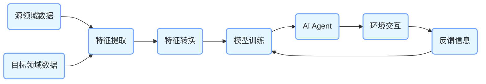

# 迁移学习在AI Agent领域适应中的应用

> 关键词：迁移学习、AI Agent、领域适应、机器学习、人工智能、知识迁移、模型泛化

> 摘要：本文深入探讨了迁移学习在AI Agent领域适应中的应用。首先介绍了迁移学习和AI Agent的相关背景知识，包括其目的、范围、预期读者和文档结构等。接着阐述了迁移学习与AI Agent领域适应的核心概念、联系及原理架构。详细讲解了核心算法原理，并给出Python源代码示例。通过数学模型和公式进一步剖析其内在机制，并举例说明。然后通过项目实战展示了代码实现和详细解读。分析了迁移学习在AI Agent领域适应中的实际应用场景。推荐了相关的学习资源、开发工具框架和论文著作。最后总结了未来发展趋势与挑战，还提供了常见问题与解答以及扩展阅读和参考资料，旨在为相关领域的研究者和开发者提供全面且深入的技术参考。

## 1. 背景介绍 
### 1.1 目的和范围
迁移学习作为机器学习领域的一个重要分支，旨在将从一个或多个源领域中学习到的知识应用到目标领域中，以提高目标领域的学习效果。而AI Agent是能够感知环境、做出决策并采取行动的智能实体。本文章的目的在于深入探讨迁移学习如何在AI Agent领域适应中发挥作用，具体范围涵盖迁移学习和AI Agent的核心概念、算法原理、数学模型、实际应用案例等，通过全面的阐述，帮助读者理解迁移学习在AI Agent领域适应中的应用机制和价值。

### 1.2 预期读者
本文预期读者包括机器学习、人工智能领域的研究者、学生，以及从事AI Agent开发的工程师和技术人员。对于希望深入了解迁移学习和AI Agent领域适应相关知识的人员，本文将提供有价值的参考。

### 1.3 文档结构概述
本文首先介绍背景知识，包括目的、范围、预期读者等。接着阐述迁移学习与AI Agent领域适应的核心概念和联系，给出原理架构示意图和流程图。然后详细讲解核心算法原理，用Python代码说明具体操作步骤。通过数学模型和公式深入剖析其内在机制，并举例说明。进行项目实战，展示代码实现和详细解读。分析实际应用场景，推荐相关学习资源、开发工具框架和论文著作。最后总结未来发展趋势与挑战，提供常见问题与解答以及扩展阅读和参考资料。

### 1.4 术语表
#### 1.4.1 核心术语定义
- **迁移学习**：一种机器学习方法，旨在将从源领域学习到的知识迁移到目标领域，以提高目标领域的学习效率和性能。
- **AI Agent**：具有感知、决策和行动能力的智能实体，能够在特定环境中自主运行。
- **领域适应**：在迁移学习中，使模型能够在不同领域之间进行有效适配的过程。

#### 1.4.2 相关概念解释
- **源领域**：迁移学习中知识的来源领域，通常具有丰富的数据和先验知识。
- **目标领域**：迁移学习中需要应用知识的领域，可能数据较少或标注成本较高。
- **特征表示**：将原始数据转换为适合机器学习模型处理的特征向量的过程。

#### 1.4.3 缩略词列表
- **ML**：Machine Learning，机器学习
- **DL**：Deep Learning，深度学习
- **RL**：Reinforcement Learning，强化学习

## 2. 核心概念与联系 
### 迁移学习的核心概念
迁移学习的核心思想是利用源领域和目标领域之间的相似性，将源领域中学习到的知识迁移到目标领域中。根据迁移的层次和方式不同，迁移学习可以分为基于实例的迁移、基于特征的迁移、基于模型的迁移和基于关系的迁移等。

### AI Agent的核心概念
AI Agent是一个能够感知环境、做出决策并采取行动的智能实体。它通常由感知模块、决策模块和行动模块组成。感知模块负责获取环境信息，决策模块根据感知信息做出决策，行动模块根据决策执行相应的行动。

### 迁移学习与AI Agent领域适应的联系
在AI Agent的实际应用中，往往需要在不同的环境和任务中进行适应。然而，每个环境和任务都可能有其独特的数据分布和特点，直接在新的环境和任务中训练AI Agent可能会面临数据不足、训练时间长等问题。迁移学习可以帮助AI Agent利用在其他相关环境和任务中学习到的知识，快速适应新的环境和任务，提高学习效率和性能。

### 原理架构示意图

这个示意图展示了迁移学习在AI Agent领域适应中的基本流程。首先从源领域和目标领域获取数据，进行特征提取和转换，然后利用转换后的特征进行模型训练，训练好的模型应用到AI Agent中，AI Agent与环境进行交互，根据反馈信息不断调整模型。

## 3. 核心算法原理 & 具体操作步骤 
### 基于特征的迁移学习算法原理
基于特征的迁移学习算法主要是通过寻找源领域和目标领域之间的共同特征表示，将源领域和目标领域的数据映射到一个共享的特征空间中，从而实现知识的迁移。一种常见的基于特征的迁移学习算法是最大均值差异（Maximum Mean Discrepancy, MMD）算法。

MMD算法的核心思想是通过最小化源领域和目标领域数据在特征空间中的分布差异，使得源领域和目标领域的数据在特征空间中尽可能地相似。具体来说，MMD通过计算源领域和目标领域数据的核均值嵌入（Kernel Mean Embedding）之间的距离来衡量分布差异。

### Python源代码实现
```python
import numpy as np
from sklearn.metrics.pairwise import rbf_kernel

def mmd(X_source, X_target, gamma=1.0):
    """
    计算最大均值差异（MMD）
    :param X_source: 源领域数据
    :param X_target: 目标领域数据
    :param gamma: 核函数的带宽参数
    :return: MMD值
    """
    n_source = X_source.shape[0]
    n_target = X_target.shape[0]
    
    # 计算核矩阵
    K_ss = rbf_kernel(X_source, X_source, gamma=gamma)
    K_st = rbf_kernel(X_source, X_target, gamma=gamma)
    K_tt = rbf_kernel(X_target, X_target, gamma=gamma)
    
    # 计算MMD值
    mmd_value = (np.sum(K_ss) / (n_source * n_source) + np.sum(K_tt) / (n_target * n_target)
                 - 2 * np.sum(K_st) / (n_source * n_target))
    
    return mmd_value

# 示例数据
X_source = np.random.randn(100, 10)
X_target = np.random.randn(80, 10)

# 计算MMD值
mmd_value = mmd(X_source, X_target)
print("MMD值:", mmd_value)
```
### 具体操作步骤
1. **数据准备**：收集源领域和目标领域的数据，分别记为 $X_s$ 和 $X_t$。
2. **特征提取**：对源领域和目标领域的数据进行特征提取，得到特征表示 $F_s$ 和 $F_t$。
3. **计算MMD值**：使用上述代码计算 $F_s$ 和 $F_t$ 之间的MMD值。
4. **最小化MMD值**：通过优化算法（如梯度下降）调整特征转换函数，使得MMD值最小化，从而实现源领域和目标领域数据在特征空间中的分布对齐。
5. **模型训练**：使用对齐后的特征进行模型训练，得到适应目标领域的AI Agent模型。

## 4. 数学模型和公式 & 详细讲解 & 举例说明 
### MMD的数学模型和公式
设 $X_s = \{x_{s1}, x_{s2}, \cdots, x_{sn_s}\}$ 是源领域的数据，$X_t = \{x_{t1}, x_{t2}, \cdots, x_{tn_t}\}$ 是目标领域的数据，$\mathcal{H}$ 是再生核希尔伯特空间（Reproducing Kernel Hilbert Space, RKHS），$k$ 是核函数。

源领域数据的核均值嵌入为：
$$\mu_s = \frac{1}{n_s} \sum_{i=1}^{n_s} \phi(x_{si})$$
目标领域数据的核均值嵌入为：
$$\mu_t = \frac{1}{n_t} \sum_{i=1}^{n_t} \phi(x_{ti})$$
其中，$\phi(x)$ 是将数据 $x$ 映射到RKHS $\mathcal{H}$ 中的映射函数。

MMD定义为核均值嵌入之间的距离：
$$MMD^2(\mathcal{D}_s, \mathcal{D}_t) = \|\mu_s - \mu_t\|_{\mathcal{H}}^2$$
展开可得：
$$MMD^2(\mathcal{D}_s, \mathcal{D}_t) = \frac{1}{n_s^2} \sum_{i=1}^{n_s} \sum_{j=1}^{n_s} k(x_{si}, x_{sj}) + \frac{1}{n_t^2} \sum_{i=1}^{n_t} \sum_{j=1}^{n_t} k(x_{ti}, x_{tj}) - \frac{2}{n_s n_t} \sum_{i=1}^{n_s} \sum_{j=1}^{n_t} k(x_{si}, x_{tj})$$

### 详细讲解
MMD通过计算源领域和目标领域数据在RKHS中的核均值嵌入之间的距离，来衡量两个领域数据的分布差异。如果MMD值为0，则说明源领域和目标领域的数据在RKHS中的分布完全相同。通过最小化MMD值，可以使得源领域和目标领域的数据在特征空间中的分布更加相似，从而实现知识的迁移。

### 举例说明
假设源领域数据 $X_s$ 是一组手写数字图像（MNIST数据集），目标领域数据 $X_t$ 是另一组手写数字图像（USPS数据集）。由于MNIST和USPS数据集的图像分布存在一定差异，直接在USPS数据集上训练模型可能效果不佳。我们可以使用MMD算法将MNIST数据集和USPS数据集的数据映射到一个共享的特征空间中，使得它们的分布更加相似，然后在这个共享特征空间中训练模型，提高模型在USPS数据集上的性能。

## 5. 项目实战：代码实际案例和详细解释说明 
### 5.1  开发环境搭建
- **操作系统**：Ubuntu 20.04
- **Python版本**：Python 3.8
- **深度学习框架**：PyTorch 1.9.0
- **其他依赖库**：NumPy、Scikit-learn、Matplotlib等

可以使用以下命令安装相关依赖库：
```bash
pip install torch torchvision numpy scikit-learn matplotlib
```

### 5.2  源代码详细实现和代码解读
```python
import torch
import torch.nn as nn
import torch.optim as optim
from torch.utils.data import DataLoader
from torchvision import datasets, transforms
import numpy as np
import matplotlib.pyplot as plt

# 定义简单的神经网络模型
class SimpleNet(nn.Module):
    def __init__(self):
        super(SimpleNet, self).__init__()
        self.fc1 = nn.Linear(784, 128)
        self.relu = nn.ReLU()
        self.fc2 = nn.Linear(128, 10)

    def forward(self, x):
        x = x.view(-1, 784)
        x = self.fc1(x)
        x = self.relu(x)
        x = self.fc2(x)
        return x

# 定义MMD损失函数
def mmd_loss(X_source, X_target, gamma=1.0):
    n_source = X_source.size(0)
    n_target = X_target.size(0)
    
    # 计算核矩阵
    K_ss = torch.exp(-torch.cdist(X_source, X_source) ** 2 / gamma)
    K_st = torch.exp(-torch.cdist(X_source, X_target) ** 2 / gamma)
    K_tt = torch.exp(-torch.cdist(X_target, X_target) ** 2 / gamma)
    
    # 计算MMD值
    mmd_value = (torch.sum(K_ss) / (n_source * n_source) + torch.sum(K_tt) / (n_target * n_target)
                 - 2 * torch.sum(K_st) / (n_source * n_target))
    
    return mmd_value

# 数据预处理
transform = transforms.Compose([
    transforms.ToTensor(),
    transforms.Normalize((0.1307,), (0.3081,))
])

# 加载源领域数据（MNIST）
source_train_dataset = datasets.MNIST(root='./data', train=True, transform=transform, download=True)
source_train_loader = DataLoader(source_train_dataset, batch_size=64, shuffle=True)

# 加载目标领域数据（USPS）
target_train_dataset = datasets.USPS(root='./data', train=True, transform=transform, download=True)
target_train_loader = DataLoader(target_train_dataset, batch_size=64, shuffle=True)

# 初始化模型、优化器和损失函数
model = SimpleNet()
optimizer = optim.Adam(model.parameters(), lr=0.001)
criterion = nn.CrossEntropyLoss()

# 训练模型
num_epochs = 10
for epoch in range(num_epochs):
    model.train()
    for i, ((source_data, source_labels), (target_data, _)) in enumerate(zip(source_train_loader, target_train_loader)):
        optimizer.zero_grad()
        
        # 前向传播
        source_output = model(source_data)
        target_output = model(target_data)
        
        # 计算分类损失
        classification_loss = criterion(source_output, source_labels)
        
        # 计算MMD损失
        mmd_value = mmd_loss(source_output, target_output)
        
        # 总损失
        total_loss = classification_loss + mmd_value
        
        # 反向传播和优化
        total_loss.backward()
        optimizer.step()
        
    print(f'Epoch {epoch+1}/{num_epochs}, Loss: {total_loss.item()}')

# 测试模型
target_test_dataset = datasets.USPS(root='./data', train=False, transform=transform, download=True)
target_test_loader = DataLoader(target_test_dataset, batch_size=64, shuffle=False)

model.eval()
correct = 0
total = 0
with torch.no_grad():
    for data, labels in target_test_loader:
        output = model(data)
        _, predicted = torch.max(output.data, 1)
        total += labels.size(0)
        correct += (predicted == labels).sum().item()

print(f'Accuracy on target domain: {100 * correct / total}%')
```
### 5.3  代码解读与分析
1. **模型定义**：定义了一个简单的全连接神经网络 `SimpleNet`，用于对手写数字图像进行分类。
2. **MMD损失函数**：实现了MMD损失函数 `mmd_loss`，用于衡量源领域和目标领域数据的分布差异。
3. **数据加载**：使用 `torchvision` 库加载MNIST和USPS数据集，并进行数据预处理。
4. **训练过程**：在每个训练周期中，同时从源领域和目标领域加载数据，计算分类损失和MMD损失，将两者相加得到总损失，然后进行反向传播和优化。
5. **测试过程**：在目标领域的测试集上测试模型的性能，计算准确率。

通过这种方式，模型在训练过程中不仅学习了源领域的分类知识，还通过最小化MMD损失来适应目标领域的数据分布，从而提高在目标领域的性能。

## 6. 实际应用场景 
### 机器人领域
在机器人的实际应用中，机器人可能需要在不同的环境中执行任务，如室内和室外环境。由于不同环境的光照、地形等因素不同，直接在新环境中训练机器人的感知和决策模型可能会面临数据不足的问题。迁移学习可以帮助机器人利用在其他相关环境中学习到的知识，快速适应新环境。例如，机器人在室内环境中学习到的目标检测和避障知识可以迁移到室外环境中，提高机器人在室外环境中的适应性和性能。

### 自动驾驶领域
自动驾驶车辆需要在不同的道路和交通场景中行驶。不同地区的道路规则、交通标志和驾驶习惯可能存在差异。迁移学习可以帮助自动驾驶车辆利用在其他地区学习到的驾驶知识，快速适应新地区的交通环境。例如，在一个地区训练的自动驾驶模型可以通过迁移学习快速适应另一个地区的交通规则和道路特点。

### 医疗领域
在医疗诊断中，不同医院的医疗设备、患者群体和疾病分布可能存在差异。迁移学习可以帮助医生利用在其他医院积累的诊断经验和数据，提高在新医院的诊断准确率。例如，在一家医院训练的疾病诊断模型可以通过迁移学习应用到另一家医院，减少数据收集和模型训练的时间和成本。

## 7. 工具和资源推荐
### 7.1 学习资源推荐
#### 7.1.1 书籍推荐
- 《机器学习》（周志华）：全面介绍了机器学习的基本概念、算法和应用，是机器学习领域的经典教材。
- 《深度学习》（Ian Goodfellow、Yoshua Bengio和Aaron Courville）：系统阐述了深度学习的理论和实践，适合深入学习深度学习的读者。
- 《迁移学习》（Sinno Jialin Pan和Qiang Yang）：专门介绍迁移学习的原理、算法和应用，是迁移学习领域的权威著作。

#### 7.1.2 在线课程
- Coursera上的“Machine Learning”（Andrew Ng）：经典的机器学习在线课程，适合初学者入门。
- edX上的“Deep Learning Specialization”：深度学习专项课程，由多位知名学者授课，内容全面深入。
- B站的“李宏毅机器学习”：李宏毅教授的机器学习课程，讲解生动有趣，易于理解。

#### 7.1.3 技术博客和网站
- Medium：有很多关于机器学习和人工智能的技术博客，涵盖了最新的研究成果和实践经验。
- arXiv：提供了大量的学术论文，包括迁移学习和AI Agent领域的最新研究。
- Kaggle：一个数据科学竞赛平台，有很多关于机器学习和人工智能的数据集和代码示例。

### 7.2 开发工具框架推荐
#### 7.2.1 IDE和编辑器
- PyCharm：功能强大的Python集成开发环境，提供了代码编辑、调试、版本控制等功能。
- Jupyter Notebook：交互式的开发环境，适合进行数据探索和模型实验。
- Visual Studio Code：轻量级的代码编辑器，支持多种编程语言和插件扩展。

#### 7.2.2 调试和性能分析工具
- PyTorch Profiler：PyTorch提供的性能分析工具，可以帮助开发者分析模型的性能瓶颈。
- TensorBoard：TensorFlow提供的可视化工具，也可以用于PyTorch模型的可视化和性能分析。
- cProfile：Python内置的性能分析工具，可以帮助开发者分析Python代码的性能。

#### 7.2.3 相关框架和库
- PyTorch：开源的深度学习框架，提供了丰富的深度学习模型和工具，支持迁移学习的实现。
- TensorFlow：另一个流行的深度学习框架，具有强大的分布式训练和部署能力。
- Scikit-learn：Python的机器学习库，提供了各种机器学习算法和工具，适合进行迁移学习的实验和验证。

### 7.3 相关论文著作推荐
#### 7.3.1 经典论文
- “Domain Adaptation via Transfer Component Analysis”（Sinno Jialin Pan等）：提出了基于迁移成分分析（Transfer Component Analysis, TCA）的领域适应方法，是迁移学习领域的经典论文。
- “Unsupervised Domain Adaptation by Backpropagation”（Yaroslav Ganin和Victor Lempitsky）：提出了基于对抗训练的无监督领域适应方法，为迁移学习的发展做出了重要贡献。

#### 7.3.2 最新研究成果
- 关注顶级学术会议（如NeurIPS、ICML、CVPR等）上的最新论文，了解迁移学习和AI Agent领域的最新研究进展。

#### 7.3.3 应用案例分析
- 查看相关领域的应用案例分析论文，了解迁移学习在实际应用中的效果和挑战，如机器人、自动驾驶、医疗等领域。

## 8. 总结：未来发展趋势与挑战
### 未来发展趋势
- **多领域迁移学习**：未来的迁移学习将不仅仅局限于两个领域之间的知识迁移，而是朝着多领域迁移学习的方向发展。例如，一个AI Agent可以同时从多个不同的源领域中学习知识，并将这些知识迁移到目标领域中，以提高目标领域的学习效果。
- **深度迁移学习**：随着深度学习的发展，深度迁移学习将成为迁移学习的重要研究方向。深度迁移学习可以利用深度神经网络的强大表示能力，更好地捕捉源领域和目标领域之间的相似性，从而实现更有效的知识迁移。
- **强化学习与迁移学习的结合**：强化学习在AI Agent的决策和行动中起着重要作用。将强化学习与迁移学习相结合，可以帮助AI Agent在不同的环境和任务中更快地学习到最优策略，提高AI Agent的适应性和性能。

### 挑战
- **领域差异的度量和处理**：准确度量源领域和目标领域之间的差异，并找到有效的方法来处理这些差异是迁移学习面临的一个重要挑战。不同领域的数据分布、特征空间和任务目标可能存在很大差异，如何在这些差异的情况下实现有效的知识迁移是需要解决的问题。
- **知识的选择和迁移**：在源领域中学习到的知识可能并不都适用于目标领域，如何选择和迁移有用的知识是迁移学习的另一个挑战。需要开发更有效的知识选择和迁移策略，以提高迁移学习的效果。
- **数据隐私和安全**：在迁移学习中，可能需要使用来自不同领域的数据，这涉及到数据隐私和安全问题。如何在保护数据隐私和安全的前提下实现有效的知识迁移是需要关注的问题。

## 9. 附录：常见问题与解答
### 问题1：迁移学习和传统机器学习有什么区别？
答：传统机器学习通常假设训练数据和测试数据来自相同的分布，而迁移学习则允许训练数据和测试数据来自不同的分布。迁移学习通过利用源领域的知识来提高目标领域的学习效果，而传统机器学习主要依赖于目标领域的数据进行学习。

### 问题2：MMD算法适用于所有类型的数据吗？
答：MMD算法主要适用于连续型数据。对于离散型数据或文本数据，可能需要使用其他的迁移学习算法，如基于实例的迁移学习算法或基于模型的迁移学习算法。

### 问题3：如何选择合适的迁移学习算法？
答：选择合适的迁移学习算法需要考虑多个因素，如源领域和目标领域的数据分布、数据类型、任务目标等。一般来说，如果源领域和目标领域的数据分布差异较小，可以选择基于特征的迁移学习算法；如果数据分布差异较大，可以选择基于模型的迁移学习算法或基于对抗训练的迁移学习算法。

## 10. 扩展阅读 & 参考资料
### 扩展阅读
- 阅读更多关于迁移学习和AI Agent的相关书籍和论文，深入了解其理论和实践。
- 参与相关的学术会议和技术论坛，与同行交流最新的研究成果和实践经验。

### 参考资料
- 周志华. 机器学习[M]. 清华大学出版社, 2016.
- Ian Goodfellow, Yoshua Bengio, Aaron Courville. 深度学习[M]. 人民邮电出版社, 2017.
- Sinno Jialin Pan, Qiang Yang. 迁移学习[M]. 机械工业出版社, 2019.
- Yaroslav Ganin, Victor Lempitsky. Unsupervised Domain Adaptation by Backpropagation[J]. Journal of Machine Learning Research, 2015.
- Sinno Jialin Pan, et al. Domain Adaptation via Transfer Component Analysis[J]. IEEE Transactions on Neural Networks, 2011.