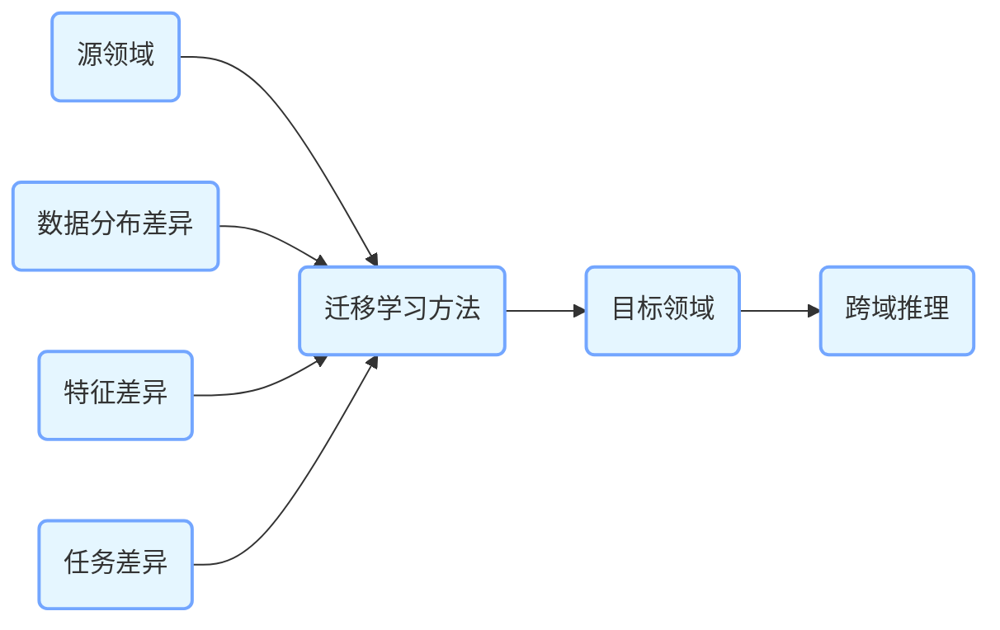

# 迁移学习在跨域推理能力增强中的创新方法

> 关键词：迁移学习、跨域推理、创新方法、领域自适应、知识迁移

> 摘要：本文围绕迁移学习在跨域推理能力增强中的创新方法展开深入探讨。首先介绍了迁移学习及跨域推理的背景知识，明确了研究的目的和范围。接着阐述了核心概念与联系，包括迁移学习和跨域推理的原理及架构。详细讲解了核心算法原理与具体操作步骤，通过Python源代码进行了说明。深入分析了相关的数学模型和公式，并举例说明。在项目实战部分，给出了开发环境搭建、源代码实现与解读。探讨了迁移学习在跨域推理中的实际应用场景，推荐了学习资源、开发工具框架以及相关论文著作。最后总结了未来发展趋势与挑战，解答了常见问题，并提供了扩展阅读与参考资料，旨在为相关领域的研究和实践提供全面且深入的指导。

## 1. 背景介绍 
### 1.1 目的和范围
在当今信息爆炸的时代，数据呈现出多样性和异构性的特点。不同领域的数据往往具有不同的分布和特征，这给传统的机器学习和推理方法带来了巨大的挑战。迁移学习作为一种新兴的机器学习技术，旨在将一个或多个源领域的知识迁移到目标领域，从而提高目标领域的学习和推理性能。本研究的目的在于探索迁移学习在跨域推理能力增强中的创新方法，以解决不同领域之间知识迁移和推理的难题。

研究范围涵盖了迁移学习的基本理论、常见算法、跨域推理的原理和应用场景。同时，重点关注如何利用迁移学习的思想和方法来增强跨域推理能力，包括领域自适应、特征迁移、模型迁移等方面的创新策略。

### 1.2 预期读者
本文预期读者包括从事机器学习、人工智能、数据挖掘等领域的研究人员和学者，他们可以从本文中获取关于迁移学习和跨域推理的最新研究成果和创新方法，为自己的研究工作提供参考和启示。同时，对于相关领域的工程师和开发者来说，本文也提供了具体的算法实现和项目实战案例，有助于他们在实际项目中应用迁移学习技术来增强跨域推理能力。此外，对人工智能和机器学习感兴趣的学生和爱好者也可以通过阅读本文，了解迁移学习和跨域推理的基本概念和方法，拓宽自己的知识面。

### 1.3 文档结构概述
本文共分为十个部分。第一部分为背景介绍，阐述了研究的目的和范围、预期读者以及文档结构概述，并给出了相关术语表。第二部分介绍核心概念与联系，包括迁移学习和跨域推理的原理和架构，同时给出文本示意图和Mermaid流程图。第三部分详细讲解核心算法原理和具体操作步骤，通过Python源代码进行说明。第四部分分析数学模型和公式，并举例说明。第五部分是项目实战，包括开发环境搭建、源代码详细实现和代码解读。第六部分探讨实际应用场景。第七部分推荐学习资源、开发工具框架以及相关论文著作。第八部分总结未来发展趋势与挑战。第九部分为附录，解答常见问题。第十部分提供扩展阅读与参考资料。

### 1.4 术语表
#### 1.4.1 核心术语定义
- **迁移学习（Transfer Learning）**：是一种机器学习技术，旨在将从一个或多个源领域中学习到的知识迁移到目标领域，以提高目标领域的学习和推理性能。
- **跨域推理（Cross - Domain Inference）**：指在不同领域的数据和知识背景下进行推理的过程，由于不同领域的数据分布和特征不同，跨域推理面临着诸多挑战。
- **领域自适应（Domain Adaptation）**：是迁移学习中的一种重要方法，旨在通过调整源领域和目标领域的数据分布，使得模型能够在不同领域之间更好地进行知识迁移和推理。
- **知识迁移（Knowledge Transfer）**：将源领域中的知识（如特征、模型参数等）应用到目标领域的过程。

#### 1.4.2 相关概念解释
- **源领域（Source Domain）**：是指已经有大量标注数据和知识的领域，迁移学习中知识的来源。
- **目标领域（Target Domain）**：是指需要进行学习和推理，但标注数据较少或没有标注数据的领域，迁移学习的目标对象。
- **特征空间（Feature Space）**：数据在特征维度上的表示空间，不同领域的数据可能具有不同的特征空间。

#### 1.4.3 缩略词列表
- **ML（Machine Learning）**：机器学习
- **DL（Deep Learning）**：深度学习
- **DA（Domain Adaptation）**：领域自适应
- **TL（Transfer Learning）**：迁移学习

## 2. 核心概念与联系 

### 迁移学习原理
迁移学习的核心思想是利用源领域中丰富的知识和数据来帮助目标领域的学习和推理。在实际应用中，源领域和目标领域可能具有不同的数据分布、特征和任务。迁移学习通过各种方法来弥合这些差异，实现知识的有效迁移。

常见的迁移学习方法包括基于特征的迁移、基于模型的迁移和基于实例的迁移。基于特征的迁移方法通过提取源领域和目标领域的共同特征，将数据映射到一个共享的特征空间，从而减少领域之间的差异。基于模型的迁移方法则是将源领域中训练好的模型参数迁移到目标领域，对模型进行微调以适应目标领域的任务。基于实例的迁移方法是选择源领域中的部分实例，将其与目标领域的数据进行组合，用于训练目标领域的模型。

### 跨域推理原理
跨域推理是在不同领域的数据和知识背景下进行推理的过程。由于不同领域的数据分布和特征不同，直接在目标领域进行推理可能会导致性能下降。跨域推理的关键在于如何利用源领域的知识来增强目标领域的推理能力。

一种常见的跨域推理方法是通过领域自适应技术，将源领域和目标领域的数据分布进行对齐，使得模型能够在不同领域之间进行有效的知识迁移。另一种方法是利用元学习的思想，学习如何快速适应不同领域的任务，从而提高跨域推理的性能。

### 文本示意图
迁移学习与跨域推理的关系可以用以下文本示意图表示：

源领域（丰富知识和数据） -- 迁移学习方法（特征迁移、模型迁移、实例迁移等） -- 目标领域（知识增强） -- 跨域推理（利用增强后的知识进行推理）

### Mermaid流程图


## 3. 核心算法原理 & 具体操作步骤 

### 基于特征的迁移学习算法原理
基于特征的迁移学习算法的核心思想是找到源领域和目标领域的共同特征表示，将数据映射到一个共享的特征空间。其中，典型的算法是最大均值差异（Maximum Mean Discrepancy, MMD）。

MMD的基本原理是通过计算源领域和目标领域数据在特征空间中的均值差异来衡量两个领域之间的距离。如果两个领域的数据在特征空间中的均值差异较小，则说明两个领域的数据分布较为相似。

### Python代码实现
```python
import numpy as np

def mmd_linear(X, Y):
    """
    计算线性核的最大均值差异
    :param X: 源领域数据，形状为 (n_samples_X, n_features)
    :param Y: 目标领域数据，形状为 (n_samples_Y, n_features)
    :return: MMD值
    """
    n_X = X.shape[0]
    n_Y = Y.shape[0]

    # 计算源领域数据的均值
    mean_X = np.mean(X, axis=0)
    # 计算目标领域数据的均值
    mean_Y = np.mean(Y, axis=0)

    # 计算MMD值
    mmd = np.dot(mean_X, mean_X) / (n_X * n_X)
    mmd += np.dot(mean_Y, mean_Y) / (n_Y * n_Y)
    mmd -= 2 * np.dot(mean_X, mean_Y) / (n_X * n_Y)

    return mmd

# 示例数据
X = np.random.rand(100, 10)  # 源领域数据
Y = np.random.rand(80, 10)   # 目标领域数据

# 计算MMD值
mmd_value = mmd_linear(X, Y)
print("MMD值:", mmd_value)
```

### 具体操作步骤
1. **数据预处理**：对源领域和目标领域的数据进行预处理，包括数据清洗、特征提取等操作，确保数据的质量和一致性。
2. **特征映射**：选择合适的特征映射方法，将源领域和目标领域的数据映射到一个共享的特征空间。可以使用线性映射或非线性映射方法，如主成分分析（PCA）、核主成分分析（KPCA）等。
3. **计算MMD值**：在共享的特征空间中，计算源领域和目标领域数据的MMD值，衡量两个领域之间的距离。
4. **领域自适应**：根据MMD值，调整源领域和目标领域的数据分布，使得MMD值最小化。可以使用梯度下降等优化算法来实现。
5. **模型训练**：在调整后的数据上训练目标领域的模型，提高模型在目标领域的性能。

## 4. 数学模型和公式 & 详细讲解 & 举例说明 

### MMD数学模型和公式
设源领域数据为 $X = \{x_1, x_2, \cdots, x_{n_X}\}$，目标领域数据为 $Y = \{y_1, y_2, \cdots, y_{n_Y}\}$，其中 $x_i \in \mathcal{X}$，$y_j \in \mathcal{X}$，$\mathcal{X}$ 为特征空间。

MMD的定义为：
$$MMD^2(\mathcal{D}_X, \mathcal{D}_Y) = \left\|\mu_{\mathcal{D}_X} - \mu_{\mathcal{D}_Y}\right\|_{\mathcal{H}}^2$$
其中，$\mu_{\mathcal{D}_X}$ 和 $\mu_{\mathcal{D}_Y}$ 分别为源领域和目标领域数据在再生核希尔伯特空间（Reproducing Kernel Hilbert Space, RKHS）$\mathcal{H}$ 中的均值，$\left\|\cdot\right\|_{\mathcal{H}}$ 为RKHS中的范数。

在实际计算中，通常使用线性核或高斯核来近似计算MMD值。对于线性核，MMD的计算公式为：
$$MMD^2(\mathcal{D}_X, \mathcal{D}_Y) = \frac{1}{n_X^2} \sum_{i=1}^{n_X} \sum_{j=1}^{n_X} k(x_i, x_j) + \frac{1}{n_Y^2} \sum_{i=1}^{n_Y} \sum_{j=1}^{n_Y} k(y_i, y_j) - \frac{2}{n_X n_Y} \sum_{i=1}^{n_X} \sum_{j=1}^{n_Y} k(x_i, y_j)$$
其中，$k(\cdot, \cdot)$ 为核函数。对于线性核，$k(x, y) = x^T y$。

### 详细讲解
MMD的核心思想是通过比较源领域和目标领域数据在RKHS中的均值来衡量两个领域之间的距离。如果两个领域的数据分布相似，则它们在RKHS中的均值也会相似，MMD值会较小。反之，如果两个领域的数据分布差异较大，则MMD值会较大。

通过最小化MMD值，可以使得源领域和目标领域的数据分布更加接近，从而实现领域自适应。在实际应用中，可以使用梯度下降等优化算法来最小化MMD值。

### 举例说明
假设源领域数据 $X$ 服从均值为 $\mu_X = [0, 0]$，协方差矩阵为 $\Sigma_X = \begin{bmatrix}1 & 0 \\ 0 & 1\end{bmatrix}$ 的二维高斯分布，目标领域数据 $Y$ 服从均值为 $\mu_Y = [2, 2]$，协方差矩阵为 $\Sigma_Y = \begin{bmatrix}1 & 0 \\ 0 & 1\end{bmatrix}$ 的二维高斯分布。

我们可以使用上述的Python代码计算 $X$ 和 $Y$ 的MMD值。由于 $X$ 和 $Y$ 的均值不同，它们的数据分布存在差异，因此MMD值会比较大。通过领域自适应技术，如调整 $Y$ 的均值，使得 $Y$ 的均值接近 $X$ 的均值，可以减小MMD值，从而实现知识的有效迁移。

## 5. 项目实战：代码实际案例和详细解释说明 

### 5.1  开发环境搭建
本项目实战使用Python语言进行开发，需要安装以下库：
- **NumPy**：用于数值计算。
- **Scikit - learn**：用于机器学习相关的操作，如数据预处理、模型训练等。
- **Matplotlib**：用于数据可视化。

可以使用以下命令安装这些库：
```sh
pip install numpy scikit-learn matplotlib
```

### 5.2  源代码详细实现和代码解读
以下是一个基于迁移学习的跨域推理项目的完整代码示例：
```python
import numpy as np
from sklearn.datasets import make_classification
from sklearn.model_selection import train_test_split
from sklearn.linear_model import LogisticRegression
from sklearn.preprocessing import StandardScaler
import matplotlib.pyplot as plt

# 生成源领域数据
X_source, y_source = make_classification(n_samples=1000, n_features=10, n_informative=5, n_redundant=0, random_state=42)

# 生成目标领域数据，模拟数据分布差异
X_target, y_target = make_classification(n_samples=200, n_features=10, n_informative=5, n_redundant=0, shift=1, random_state=42)

# 数据预处理
scaler = StandardScaler()
X_source = scaler.fit_transform(X_source)
X_target = scaler.transform(X_target)

# 划分训练集和测试集
X_source_train, X_source_test, y_source_train, y_source_test = train_test_split(X_source, y_source, test_size=0.2, random_state=42)
X_target_train, X_target_test, y_target_train, y_target_test = train_test_split(X_target, y_target, test_size=0.2, random_state=42)

# 不使用迁移学习的模型训练
model_without_tl = LogisticRegression()
model_without_tl.fit(X_source_train, y_source_train)

# 评估不使用迁移学习的模型在目标领域的性能
score_without_tl = model_without_tl.score(X_target_test, y_target_test)
print("不使用迁移学习的模型在目标领域的准确率:", score_without_tl)

# 使用迁移学习的模型训练
# 将源领域和目标领域的数据合并
X_combined = np.vstack((X_source_train, X_target_train))
y_combined = np.hstack((y_source_train, y_target_train))

model_with_tl = LogisticRegression()
model_with_tl.fit(X_combined, y_combined)

# 评估使用迁移学习的模型在目标领域的性能
score_with_tl = model_with_tl.score(X_target_test, y_target_test)
print("使用迁移学习的模型在目标领域的准确率:", score_with_tl)

# 可视化结果
plt.bar(['Without Transfer Learning', 'With Transfer Learning'], [score_without_tl, score_with_tl])
plt.ylabel('Accuracy')
plt.title('Performance Comparison')
plt.show()
```

### 5.3  代码解读与分析
1. **数据生成**：使用 `make_classification` 函数生成源领域和目标领域的数据，模拟数据分布差异。
2. **数据预处理**：使用 `StandardScaler` 对数据进行标准化处理，使得数据具有零均值和单位方差。
3. **划分训练集和测试集**：使用 `train_test_split` 函数将源领域和目标领域的数据划分为训练集和测试集。
4. **不使用迁移学习的模型训练**：使用源领域的训练数据训练逻辑回归模型，并评估该模型在目标领域测试数据上的性能。
5. **使用迁移学习的模型训练**：将源领域和目标领域的训练数据合并，使用合并后的数据训练逻辑回归模型，并评估该模型在目标领域测试数据上的性能。
6. **可视化结果**：使用 `matplotlib` 库绘制柱状图，比较不使用迁移学习和使用迁移学习的模型在目标领域的性能。

通过比较可以发现，使用迁移学习的模型在目标领域的性能通常会优于不使用迁移学习的模型，这表明迁移学习可以有效地增强跨域推理能力。

## 6. 实际应用场景 

### 图像识别
在图像识别领域，不同的数据集可能具有不同的图像风格、光照条件和背景信息。例如，在医学图像识别中，不同医院的设备和拍摄条件可能会导致图像数据的分布存在差异。迁移学习可以将在大规模通用图像数据集（如ImageNet）上训练好的模型迁移到特定的医学图像识别任务中，通过微调模型参数来适应医学图像数据的特点，从而提高医学图像识别的准确率。

### 自然语言处理
在自然语言处理领域，不同的文本来源可能具有不同的语言风格、词汇和语法结构。例如，社交媒体上的文本和新闻文章的文本存在较大差异。迁移学习可以将在大规模通用文本语料库上训练好的语言模型（如BERT）迁移到特定的文本分类、情感分析等任务中，通过微调模型参数来适应不同文本来源的特点，从而提高自然语言处理的性能。

### 语音识别
在语音识别领域，不同的说话人、口音和环境噪声会导致语音数据的分布存在差异。迁移学习可以将在大规模通用语音数据集上训练好的语音识别模型迁移到特定的说话人或环境中，通过微调模型参数来适应不同的语音数据特点，从而提高语音识别的准确率。

### 推荐系统
在推荐系统中，不同的用户群体可能具有不同的兴趣偏好和行为模式。迁移学习可以将在一个用户群体上训练好的推荐模型迁移到另一个用户群体中，通过调整模型参数来适应新用户群体的特点，从而提高推荐系统的性能。

## 7. 工具和资源推荐
### 7.1 学习资源推荐
#### 7.1.1 书籍推荐
- 《迁移学习》：全面介绍了迁移学习的基本理论、算法和应用，是学习迁移学习的经典书籍。
- 《深度学习》：虽然主要介绍深度学习的内容，但其中也包含了一些与迁移学习相关的知识，如预训练模型和微调技术。

#### 7.1.2 在线课程
- Coursera上的“Machine Learning”课程：由Andrew Ng教授讲授，涵盖了机器学习的基础知识和常见算法，其中也包括了迁移学习的相关内容。
- edX上的“Deep Learning Specialization”课程：由深度学习领域的知名学者讲授，深入介绍了深度学习的原理和应用，其中包含了迁移学习的高级内容。

#### 7.1.3 技术博客和网站
- Medium：上面有很多关于迁移学习和跨域推理的技术文章和案例分享。
- arXiv：是一个预印本论文库，上面有很多关于迁移学习和跨域推理的最新研究成果。

### 7.2 开发工具框架推荐
#### 7.2.1 IDE和编辑器
- PyCharm：是一款专业的Python集成开发环境，提供了丰富的代码编辑、调试和项目管理功能。
- Jupyter Notebook：是一个交互式的开发环境，适合进行数据探索、模型训练和可视化等操作。

#### 7.2.2 调试和性能分析工具
- TensorBoard：是TensorFlow的可视化工具，可以用于可视化模型的训练过程、损失函数和准确率等指标。
- PyTorch Profiler：是PyTorch的性能分析工具，可以用于分析模型的性能瓶颈和优化模型的运行效率。

#### 7.2.3 相关框架和库
- TensorFlow：是一个开源的机器学习框架，提供了丰富的深度学习模型和工具，支持迁移学习的实现。
- PyTorch：是另一个开源的深度学习框架，具有简洁易用的API，广泛应用于学术界和工业界，也支持迁移学习的实现。
- Scikit - learn：是一个简单易用的机器学习库，提供了各种机器学习算法和工具，可用于数据预处理、模型训练和评估等操作。

### 7.3 相关论文著作推荐
#### 7.3.1 经典论文
- “Domain Adaptation via Transfer Component Analysis”：提出了一种基于迁移成分分析的领域自适应方法，是迁移学习领域的经典论文。
- “Deep Domain Confusion: Maximizing for Domain Invariance”：提出了一种基于深度域混淆的领域自适应方法，利用深度学习模型来学习领域不变的特征。

#### 7.3.2 最新研究成果
- 可以关注每年在机器学习和人工智能领域的顶级会议（如NeurIPS、ICML、CVPR等）上发表的论文，了解迁移学习和跨域推理的最新研究进展。

#### 7.3.3 应用案例分析
- 一些知名企业（如Google、Microsoft等）的技术博客上会分享他们在实际项目中应用迁移学习和跨域推理的案例和经验，可以从中学习到实际应用中的技巧和方法。

## 8. 总结：未来发展趋势与挑战

### 未来发展趋势
- **深度迁移学习**：随着深度学习技术的不断发展，深度迁移学习将成为未来的研究热点。深度迁移学习可以利用深度学习模型的强大特征提取能力，更好地实现知识的迁移和跨域推理。
- **多模态迁移学习**：现实世界中的数据往往具有多种模态（如图像、文本、语音等），多模态迁移学习将不同模态的数据进行融合，实现跨模态的知识迁移和推理，具有广阔的应用前景。
- **自动化迁移学习**：为了降低迁移学习的应用门槛，自动化迁移学习将成为未来的发展方向。自动化迁移学习可以自动选择合适的迁移学习方法和模型，提高迁移学习的效率和性能。

### 挑战
- **领域差异建模**：不同领域之间的差异非常复杂，如何准确地建模领域差异是迁移学习面临的一个挑战。目前的方法大多基于统计特征来衡量领域差异，对于一些复杂的领域差异（如语义差异）还无法很好地处理。
- **知识表示和迁移**：如何有效地表示和迁移知识是迁移学习的核心问题。目前的方法大多基于特征和模型参数的迁移，对于一些隐性知识的迁移还存在困难。
- **可解释性**：迁移学习模型的可解释性是一个重要的问题。由于迁移学习涉及到不同领域之间的知识迁移，模型的决策过程往往比较复杂，难以解释。提高迁移学习模型的可解释性，有助于用户更好地理解和信任模型的决策结果。

## 9. 附录：常见问题与解答

### 问题1：迁移学习和传统机器学习有什么区别？
传统机器学习通常假设训练数据和测试数据来自相同的分布，而迁移学习则允许训练数据和测试数据来自不同的分布。迁移学习通过利用源领域的知识来帮助目标领域的学习和推理，从而提高目标领域的性能。

### 问题2：迁移学习的应用场景有哪些限制？
迁移学习的应用场景受到一些限制。首先，源领域和目标领域之间需要存在一定的相关性，否则知识迁移可能会导致性能下降。其次，迁移学习的效果还受到数据量、领域差异程度等因素的影响。在数据量较少或领域差异较大的情况下，迁移学习的效果可能不理想。

### 问题3：如何选择合适的迁移学习方法？
选择合适的迁移学习方法需要考虑多个因素，如领域差异程度、数据量、任务类型等。一般来说，如果领域差异较小，可以选择基于特征的迁移学习方法；如果领域差异较大，可以选择基于模型的迁移学习方法。同时，还可以根据数据量的大小选择合适的模型和算法。

### 问题4：迁移学习模型的性能如何评估？
迁移学习模型的性能评估可以使用传统的机器学习评估指标，如准确率、召回率、F1值等。同时，还可以使用一些专门的迁移学习评估指标，如领域自适应误差、迁移增益等，来评估模型在不同领域之间的迁移效果。

## 10. 扩展阅读 & 参考资料
- [1] Pan S J, Yang Q. A survey on transfer learning[J]. IEEE Transactions on Knowledge and Data Engineering, 2010, 22(10): 1345 - 1359.
- [2] Bengio Y, Courville A, Vincent P. Representation learning: A review and new perspectives[J]. IEEE transactions on pattern analysis and machine intelligence, 2013, 35(8): 1798 - 1828.
- [3] Goodfellow I J, Bengio Y, Courville A. Deep learning[M]. MIT press, 2016.
- [4] https://arxiv.org/
- [5] https://medium.com/
- [6] https://www.tensorflow.org/
- [7] https://pytorch.org/
- [8] https://scikit-learn.org/