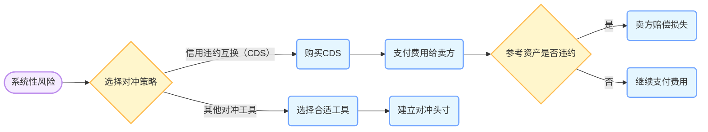

# 迈克尔·伯里的系统性风险对冲方法

> 关键词：迈克尔·伯里、系统性风险、对冲方法、次贷危机、信用违约互换

> 摘要：本文聚焦于迈克尔·伯里的系统性风险对冲方法。首先介绍了研究这一方法的目的和范围，明确预期读者。接着阐述了核心概念，包括系统性风险、对冲等，并给出相关的文本示意图和Mermaid流程图。详细讲解了迈克尔·伯里所运用的核心算法原理和具体操作步骤，结合Python代码进行说明。通过数学模型和公式深入剖析其对冲策略背后的逻辑，并举例说明。以次贷危机中伯里的实际操作作为项目实战案例，进行代码实现和解读。探讨了该对冲方法的实际应用场景，推荐了相关的学习资源、开发工具框架以及论文著作。最后总结了未来发展趋势与挑战，解答常见问题，并提供扩展阅读和参考资料，旨在全面深入地解析迈克尔·伯里的系统性风险对冲方法。

## 1. 背景介绍 
### 1.1 目的和范围
本文章的主要目的是深入剖析迈克尔·伯里的系统性风险对冲方法。系统性风险是金融市场中不可忽视的因素，它可能导致整个市场或大部分资产价格的波动，对投资者造成巨大损失。迈克尔·伯里在2007 - 2008年次贷危机期间成功运用独特的对冲策略，不仅为自己的基金避免了损失，还获得了巨额盈利。我们的研究范围将涵盖他所采用的具体对冲工具、策略的制定过程、背后的理论依据以及实际操作中的关键要点。通过对这些内容的研究，希望能为投资者、金融从业者和研究人员提供有价值的参考，帮助他们更好地应对系统性风险。

### 1.2 预期读者
本文的预期读者包括金融领域的投资者，他们可以从迈克尔·伯里的对冲方法中获取灵感，优化自己的投资组合，降低系统性风险对资产的影响。金融从业者，如基金经理、分析师等，能够通过学习其策略，提升自己在风险管理和投资决策方面的能力。同时，对金融市场和风险管理感兴趣的研究人员也可以将本文作为研究系统性风险对冲的重要参考资料，进一步探索相关理论和实践。

### 1.3 文档结构概述
本文将按照以下结构展开：首先介绍核心概念，明确系统性风险、对冲等关键概念的定义和相互联系，并通过文本示意图和Mermaid流程图进行直观展示。接着详细讲解核心算法原理和具体操作步骤，使用Python代码进行说明，使读者能够深入理解其对冲策略的实现方式。然后通过数学模型和公式，对策略背后的逻辑进行量化分析，并举例说明。以次贷危机中迈克尔·伯里的实际操作作为项目实战案例，包括开发环境搭建、源代码实现和代码解读。探讨该对冲方法的实际应用场景，为读者提供在不同市场环境下运用该方法的思路。推荐相关的学习资源、开发工具框架以及论文著作，帮助读者进一步深入学习和研究。最后总结未来发展趋势与挑战，解答常见问题，并提供扩展阅读和参考资料。

### 1.4 术语表
#### 1.4.1 核心术语定义
- **系统性风险**：指由整体政治、经济、社会等环境因素对金融市场上所有参与者所造成的影响的风险，这种风险无法通过分散投资来消除。例如，宏观经济衰退、利率变动、战争等都可能引发系统性风险。
- **对冲**：是一种通过采取与原有投资相反的操作，以降低投资组合风险的策略。其目的是在市场波动时，通过一方的盈利来弥补另一方的损失，从而达到稳定资产价值的效果。
- **信用违约互换（CDS）**：是一种金融衍生工具，它相当于一种保险合同。购买者向卖方支付一定的费用，当参考资产（如债券、贷款等）发生违约时，卖方将向购买者赔偿损失。

#### 1.4.2 相关概念解释
- **次级抵押贷款**：是指向信用等级较低、收入不稳定的借款人提供的住房抵押贷款。由于这些借款人的信用风险较高，次级抵押贷款的利率通常比优质抵押贷款高。
- **担保债务凭证（CDO）**：是一种结构化金融产品，它将多种债务（如次级抵押贷款、企业债券等）打包在一起，然后按照不同的风险等级分割成不同的层级（如优先级、中间级、权益级）进行销售。

#### 1.4.3 缩略词列表
- **CDS**：信用违约互换（Credit Default Swap）
- **CDO**：担保债务凭证（Collateralized Debt Obligation）

## 2. 核心概念与联系 

### 核心概念原理
#### 系统性风险
系统性风险是金融市场中一种不可分散的风险，它源于宏观经济、政治、社会等方面的因素，影响着整个市场或大部分资产的价格。由于系统性风险的影响范围广泛，投资者无法通过分散投资来消除它。例如，当经济衰退时，大多数企业的业绩都会受到影响，股票市场整体下跌，即使投资者持有多种不同的股票，也难以避免资产价值的缩水。

#### 对冲
对冲是一种风险管理策略，其基本原理是通过建立相反的头寸来抵消原有投资的风险。例如，投资者持有股票多头头寸，为了降低股票价格下跌的风险，可以同时买入看跌期权。当股票价格下跌时，看跌期权的价值上升，从而弥补股票多头头寸的损失。

#### 信用违约互换（CDS）
信用违约互换是一种金融衍生工具，它为投资者提供了一种对信用风险进行对冲的方式。购买者向卖方支付定期的费用（类似于保险费），当参考资产发生违约时，卖方将向购买者支付违约损失。例如，一家银行持有大量的次级抵押贷款债券，为了降低这些债券违约的风险，银行可以购买CDS。如果这些债券发生违约，银行可以从CDS卖方获得赔偿。

### 架构的文本示意图
```plaintext
系统性风险
|
|-- 影响金融市场整体
|
|-- 难以通过分散投资消除
|
|-- 对冲策略应对
|
|   |-- 信用违约互换（CDS）
|   |   |-- 购买者支付费用
|   |   |-- 卖方承担违约风险
|   |   |-- 违约时卖方赔偿
|   |
|   |-- 其他对冲工具（如期权、期货等）
```

### Mermaid流程图


## 3. 核心算法原理 & 具体操作步骤 

### 核心算法原理
迈克尔·伯里在次贷危机期间主要运用信用违约互换（CDS）进行系统性风险对冲。其核心算法原理基于对信用风险的评估和定价。

在CDS交易中，购买者需要向卖方支付一定的费用（CDS费率），这个费用的高低取决于参考资产的信用风险。信用风险越高，CDS费率就越高。伯里通过深入研究次级抵押贷款市场，发现了其中隐藏的巨大信用风险。他认为，次级抵押贷款借款人的信用状况较差，违约概率较高，而当时市场对这些风险的定价过低。

假设我们用 $P$ 表示参考资产在一定期限内的违约概率，$L$ 表示违约损失率，$R$ 表示无风险利率，$S$ 表示CDS费率。那么，在一个简化的模型中，CDS费率可以通过以下公式计算：

$S = P \times L \times (1 + R)$

这个公式表明，CDS费率与违约概率、违约损失率和无风险利率成正比。伯里通过对次级抵押贷款市场的研究，估计出较高的违约概率 $P$ 和违约损失率 $L$，从而认为当时市场上的CDS费率被低估。

### 具体操作步骤

#### 步骤1：市场研究和风险评估
伯里首先对次级抵押贷款市场进行了深入的研究。他分析了借款人的信用状况、贷款发放标准、房地产市场的走势等因素。通过大量的数据收集和分析，他发现次级抵押贷款市场存在严重的泡沫，借款人的违约风险被市场低估。

#### 步骤2：选择参考资产
在确定了次级抵押贷款市场的风险后，伯里选择了以次级抵押贷款支持的担保债务凭证（CDO）作为参考资产。CDO是一种将多种次级抵押贷款打包在一起的金融产品，其价值与次级抵押贷款的违约情况密切相关。

#### 步骤3：购买信用违约互换（CDS）
伯里代表他的基金向各大投资银行购买了针对这些CDO的CDS。在购买CDS时，他需要支付一定的费用给卖方（投资银行）。这些费用通常是按年支付的，费用的高低取决于CDS费率。

#### 步骤4：监控市场和风险
在购买CDS后，伯里需要持续监控次级抵押贷款市场和CDO的表现。如果市场情况发生变化，如房地产市场进一步恶化、借款人违约率上升等，CDS的价值可能会上升。

#### 步骤5：获利了结
当次级抵押贷款市场出现大规模违约，CDO的价值大幅下降时，伯里持有的CDS的价值将大幅上升。此时，他可以选择将CDS出售给其他投资者，或者等待CDO违约，从卖方获得赔偿，从而实现获利。

### Python源代码实现
```python
import numpy as np

# 定义参数
# 违约概率
default_probability = 0.2
# 违约损失率
loss_given_default = 0.8
# 无风险利率
risk_free_rate = 0.05

# 计算CDS费率
cds_spread = default_probability * loss_given_default * (1 + risk_free_rate)

print(f"CDS费率: {cds_spread * 100:.2f}%")
```
### 代码解释
在上述代码中，我们首先定义了三个参数：违约概率 `default_probability`、违约损失率 `loss_given_default` 和无风险利率 `risk_free_rate`。然后，根据公式 $S = P \times L \times (1 + R)$ 计算CDS费率 `cds_spread`。最后，将计算结果以百分比的形式输出。

## 4. 数学模型和公式 & 详细讲解 & 举例说明 

### 数学模型和公式
#### CDS定价模型
如前所述，在一个简化的模型中，CDS费率 $S$ 可以通过以下公式计算：

$$S = P \times L \times (1 + R)$$

其中，$P$ 表示参考资产在一定期限内的违约概率，$L$ 表示违约损失率，$R$ 表示无风险利率。

#### 预期损失模型
在评估CDS的价值时，我们还可以考虑预期损失。预期损失 $EL$ 可以通过以下公式计算：

$$EL = P \times L \times V$$

其中，$V$ 表示参考资产的面值。

### 详细讲解
#### CDS定价模型
CDS定价模型的核心思想是将CDS费率与参考资产的信用风险联系起来。违约概率 $P$ 反映了参考资产发生违约的可能性，违约损失率 $L$ 反映了在违约发生时投资者可能遭受的损失比例，无风险利率 $R$ 则考虑了资金的时间价值。通过这个公式，我们可以根据对参考资产信用风险的评估来确定合理的CDS费率。

#### 预期损失模型
预期损失模型用于评估投资者在持有CDS期间可能遭受的平均损失。它考虑了违约概率、违约损失率和参考资产的面值。通过计算预期损失，投资者可以更好地评估CDS的风险和收益。

### 举例说明
假设我们有一个面值为 $1000$ 万美元的CDO作为参考资产。根据我们的分析，该CDO在未来一年内的违约概率 $P$ 为 $0.1$，违约损失率 $L$ 为 $0.7$，无风险利率 $R$ 为 $0.03$。

#### 计算CDS费率
根据CDS定价模型，CDS费率 $S$ 为：

$$S = P \times L \times (1 + R) = 0.1 \times 0.7 \times (1 + 0.03) = 0.0721$$

即CDS费率为 $7.21\%$。这意味着投资者每年需要支付 $1000 \times 7.21\% = 72.1$ 万美元的费用来购买针对该CDO的CDS。

#### 计算预期损失
根据预期损失模型，预期损失 $EL$ 为：

$$EL = P \times L \times V = 0.1 \times 0.7 \times 1000 = 70$$

即投资者在未来一年内持有该CDS的预期损失为 $70$ 万美元。

## 5. 项目实战：代码实际案例和详细解释说明 

### 5.1 开发环境搭建
#### 安装Python
首先，你需要安装Python。可以从Python官方网站（https://www.python.org/downloads/）下载适合你操作系统的Python版本，并按照安装向导进行安装。

#### 安装必要的库
在本项目中，我们主要使用 `numpy` 库进行数值计算。可以使用以下命令安装 `numpy`：

```sh
pip install numpy
```

### 5.2 源代码详细实现和代码解读
以下是一个更完整的Python代码示例，用于模拟迈克尔·伯里的CDS投资策略：

```python
import numpy as np
import matplotlib.pyplot as plt

# 定义参数
# 初始资金
initial_funds = 10000000
# 参考资产面值
reference_asset_value = 50000000
# 投资期限（年）
investment_horizon = 5
# 每年的违约概率
default_probability_per_year = 0.1
# 违约损失率
loss_given_default = 0.7
# 无风险利率
risk_free_rate = 0.03

# 计算CDS费率
cds_spread = default_probability_per_year * loss_given_default * (1 + risk_free_rate)

# 模拟每年的违约情况
np.random.seed(42)
default_events = np.random.binomial(1, default_probability_per_year, investment_horizon)

# 初始化资金和CDS价值
funds = initial_funds
cds_value = 0

# 记录每年的资金和CDS价值
funds_history = [funds]
cds_value_history = [cds_value]

# 模拟投资过程
for year in range(investment_horizon):
    # 支付CDS费用
    cds_fee = cds_spread * reference_asset_value
    funds -= cds_fee
    
    # 如果发生违约
    if default_events[year] == 1:
        cds_payout = loss_given_default * reference_asset_value
        funds += cds_payout
    
    # 记录资金和CDS价值
    funds_history.append(funds)
    cds_value_history.append(cds_value)

# 绘制资金和CDS价值的变化曲线
years = np.arange(investment_horizon + 1)
plt.figure(figsize=(10, 6))
plt.plot(years, funds_history, label='Funds')
plt.plot(years, cds_value_history, label='CDS Value')
plt.xlabel('Year')
plt.ylabel('Value')
plt.title('CDS Investment Strategy Simulation')
plt.legend()
plt.grid(True)
plt.show()

# 输出最终资金
print(f"最终资金: {funds:.2f} 美元")
```

### 代码解读与分析
#### 参数定义
- `initial_funds`：初始资金，即投资者开始投资时拥有的资金。
- `reference_asset_value`：参考资产的面值，即CDS所针对的资产的价值。
- `investment_horizon`：投资期限，即投资者计划持有CDS的时间。
- `default_probability_per_year`：每年的违约概率，用于模拟参考资产在每年发生违约的可能性。
- `loss_given_default`：违约损失率，即参考资产发生违约时投资者可能遭受的损失比例。
- `risk_free_rate`：无风险利率，用于计算CDS费率。

#### CDS费率计算
根据前面介绍的CDS定价模型，计算CDS费率 `cds_spread`。

#### 模拟违约情况
使用 `numpy` 的 `binomial` 函数模拟每年的违约情况。该函数根据二项分布生成随机数，0 表示未违约，1 表示违约。

#### 投资过程模拟
在每年的投资过程中，首先支付CDS费用，然后检查是否发生违约。如果发生违约，投资者将从CDS卖方获得赔偿。最后，记录每年的资金和CDS价值。

#### 可视化结果
使用 `matplotlib` 库绘制资金和CDS价值的变化曲线，直观展示投资过程中的资金变化情况。

#### 输出最终资金
输出投资期限结束后的最终资金，以便评估投资策略的效果。

## 6. 实际应用场景 
### 金融机构风险管理
金融机构，如银行、保险公司等，通常持有大量的金融资产，面临着各种系统性风险。迈克尔·伯里的系统性风险对冲方法可以帮助金融机构降低这些风险。例如，银行可以通过购买CDS来对冲其持有的贷款组合的信用风险。如果贷款组合中的某些贷款发生违约，银行可以从CDS卖方获得赔偿，从而减少损失。

### 投资组合管理
投资者在构建投资组合时，需要考虑系统性风险对组合价值的影响。通过运用对冲策略，如购买CDS或其他衍生品，投资者可以降低投资组合的风险。例如，一个股票投资组合的投资者可以购买股票指数期货的看跌期权，当股票市场下跌时，看跌期权的价值上升，从而弥补股票组合的损失。

### 宏观经济环境不稳定时期
在宏观经济环境不稳定时期，如经济衰退、通货膨胀加剧等，系统性风险通常会增加。此时，投资者和金融机构可以采用迈克尔·伯里的对冲方法来保护自己的资产。例如，在经济衰退期间，房地产市场可能会受到严重影响，投资者可以购买针对房地产相关资产的CDS来对冲风险。

### 新兴市场投资
新兴市场通常具有较高的系统性风险，如政治风险、汇率风险等。投资者在投资新兴市场时，可以运用对冲策略来降低这些风险。例如，投资者可以购买新兴市场货币的外汇期权，以对冲汇率波动的风险。

## 7. 工具和资源推荐
### 7.1 学习资源推荐
#### 7.1.1 书籍推荐
- 《大空头》（*The Big Short*）：作者是迈克尔·刘易斯（Michael Lewis），这本书详细讲述了迈克尔·伯里等投资者在次贷危机期间通过做空次级抵押贷款市场获利的故事，是了解系统性风险对冲的经典读物。
- 《金融炼金术》（*The Alchemy of Finance*）：作者是乔治·索罗斯（George Soros），这本书探讨了金融市场的运行机制和投资者的行为，对于理解系统性风险和对冲策略有很大的帮助。
- 《期权、期货及其他衍生品》（*Options, Futures, and Other Derivatives*）：作者是约翰·赫尔（John C. Hull），这本书是金融衍生品领域的权威教材，详细介绍了各种衍生品的定价和交易策略，包括CDS等。

#### 7.1.2 在线课程
- Coursera上的“金融市场”（*Financial Markets*）课程：由耶鲁大学的罗伯特·席勒（Robert Shiller）教授授课，课程涵盖了金融市场的基本概念、资产定价、风险管理等内容，对于理解系统性风险和对冲策略有很大的帮助。
- edX上的“金融工程与风险管理”（*Financial Engineering and Risk Management*）课程：该课程介绍了金融工程的基本原理和方法，以及如何运用金融衍生品进行风险管理，是学习对冲策略的重要课程。

#### 7.1.3 技术博客和网站
- 彭博社（Bloomberg）：提供全球金融市场的实时数据、新闻和分析，是金融从业者和投资者获取信息的重要来源。
- 金融时报（Financial Times）：提供深入的金融市场分析和评论，对于了解系统性风险和对冲策略有很大的帮助。
- Seeking Alpha：一个金融投资社区，提供各种投资分析和研究报告，投资者可以在这里了解不同的投资策略和观点。

### 7.2 开发工具框架推荐
#### 7.2.1 IDE和编辑器
- PyCharm：是一款专门为Python开发设计的集成开发环境（IDE），具有强大的代码编辑、调试和项目管理功能，适合开发金融量化分析程序。
- Jupyter Notebook：是一个交互式的开发环境，支持Python等多种编程语言。它可以将代码、文本、图表等整合在一起，方便进行数据分析和可视化，非常适合金融数据的分析和建模。

#### 7.2.2 调试和性能分析工具
- Python自带的调试器 `pdb`：可以帮助开发者在代码运行过程中进行调试，定位和解决问题。
- `cProfile`：是Python的一个性能分析工具，可以帮助开发者分析代码的性能瓶颈，优化代码的运行效率。

#### 7.2.3 相关框架和库
- `numpy`：是Python中用于科学计算的基础库，提供了高效的数组操作和数学函数，在金融量化分析中广泛应用。
- `pandas`：是一个用于数据处理和分析的库，提供了灵活的数据结构和数据操作方法，方便进行金融数据的清洗、整理和分析。
- `scikit-learn`：是一个机器学习库，提供了各种机器学习算法和工具，可用于金融风险评估和预测。

### 7.3 相关论文著作推荐
#### 7.3.1 经典论文
- “On the Pricing of Corporate Debt: The Risk Structure of Interest Rates” by Robert C. Merton：该论文提出了著名的Merton模型，用于对公司债务进行定价，是信用风险评估领域的经典论文。
- “The Pricing of Options and Corporate Liabilities” by Fischer Black and Myron Scholes：该论文提出了Black - Scholes期权定价模型，为金融衍生品的定价奠定了基础。

#### 7.3.2 最新研究成果
- 可以关注《Journal of Finance》、《Review of Financial Studies》等金融领域的顶级学术期刊，了解关于系统性风险和对冲策略的最新研究成果。

#### 7.3.3 应用案例分析
- 可以参考一些金融机构的研究报告和案例分析，了解他们在实际应用中如何运用系统性风险对冲方法。例如，国际清算银行（BIS）的研究报告经常会涉及到金融风险管理和对冲策略的应用案例。

## 8. 总结：未来发展趋势与挑战
### 未来发展趋势
#### 金融科技的应用
随着金融科技的不断发展，系统性风险对冲方法将更加智能化和自动化。例如，人工智能和机器学习技术可以用于更准确地预测系统性风险，从而帮助投资者制定更有效的对冲策略。同时，区块链技术可以提高金融交易的透明度和安全性，降低对冲交易的成本和风险。

#### 多元化的对冲工具
未来，对冲工具将更加多元化。除了传统的CDS、期权、期货等工具外，还可能会出现更多新型的金融衍生品和对冲策略。例如，一些基于环境、社会和治理（ESG）因素的对冲工具可能会逐渐兴起，以满足投资者对可持续投资和风险管理的需求。

#### 全球合作与监管
系统性风险具有全球性特征，因此未来需要加强全球合作与监管。各国政府和金融监管机构将加强协调，共同制定和实施风险管理政策，以应对全球性的系统性风险。例如，国际货币基金组织（IMF）和金融稳定理事会（FSB）等国际组织将在全球金融稳定和风险管理方面发挥更加重要的作用。

### 挑战
#### 模型的准确性和可靠性
系统性风险的预测和评估依赖于各种数学模型和统计方法。然而，这些模型和方法往往存在一定的局限性，其准确性和可靠性受到数据质量、市场环境等多种因素的影响。因此，如何提高模型的准确性和可靠性是未来面临的一个重要挑战。

#### 市场的复杂性和不确定性
金融市场是一个复杂的系统，受到多种因素的影响，如宏观经济政策、政治事件、投资者情绪等。这些因素的变化往往具有不确定性，使得系统性风险的预测和对冲变得更加困难。例如，在新冠疫情期间，全球金融市场出现了剧烈波动，许多传统的风险模型和对冲策略都失效了。

#### 监管的挑战
随着金融创新的不断发展，新的金融产品和对冲策略不断涌现，给金融监管带来了挑战。监管机构需要不断更新和完善监管政策，以确保金融市场的稳定和投资者的利益。同时，监管机构还需要平衡创新和风险，避免过度监管抑制金融创新。

## 9. 附录：常见问题与解答
### 问题1：CDS是否可以完全消除系统性风险？
解答：CDS不能完全消除系统性风险。虽然CDS可以对冲参考资产的信用风险，但它无法应对其他类型的系统性风险，如市场风险、流动性风险等。此外，CDS本身也存在信用风险，即CDS卖方可能无法履行赔偿义务。

### 问题2：如何评估CDS卖方的信用风险？
解答：可以通过以下几个方面评估CDS卖方的信用风险：一是查看卖方的信用评级，信用评级较高的卖方通常信用风险较低；二是分析卖方的财务状况，包括资产负债表、盈利能力等；三是了解卖方的市场声誉和历史业绩。

### 问题3：除了CDS，还有哪些常见的系统性风险对冲工具？
解答：除了CDS，常见的系统性风险对冲工具还包括期权、期货、互换等。期权可以提供对市场价格波动的保护，期货可以用于对冲商品价格、利率等风险，互换可以用于调整资产负债的期限结构和利率风险。

### 问题4：在实际应用中，如何选择合适的对冲工具？
解答：在选择合适的对冲工具时，需要考虑以下几个因素：一是风险类型，不同的对冲工具适用于不同类型的风险；二是成本效益，需要比较不同对冲工具的成本和收益；三是市场流动性，选择流动性较好的对冲工具，以便在需要时能够及时买卖。

## 10. 扩展阅读 & 参考资料
### 扩展阅读
- 《聪明的投资者》（*The Intelligent Investor*）：作者是本杰明·格雷厄姆（Benjamin Graham），这本书是价值投资领域的经典著作，对于投资者理解风险管理和投资策略有很大的帮助。
- 《黑天鹅》（*The Black Swan*）：作者是纳西姆·尼古拉斯·塔勒布（Nassim Nicholas Taleb），这本书探讨了不可预测的重大事件对金融市场和社会的影响，对于理解系统性风险的不确定性有很大的启发。

### 参考资料
- Lewis, M. (2010). *The Big Short: Inside the Doomsday Machine*. W. W. Norton & Company.
- Hull, J. C. (2018). *Options, Futures, and Other Derivatives*. Pearson.
- Merton, R. C. (1974). On the Pricing of Corporate Debt: The Risk Structure of Interest Rates. *Journal of Finance*, 29(2), 449 - 470.
- Black, F., & Scholes, M. (1973). The Pricing of Options and Corporate Liabilities. *Journal of Political Economy*, 81(3), 637 - 654.