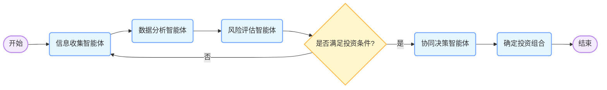

# 运用多智能体AI系统优化巴菲特的持股集中策略

> 关键词：多智能体AI系统、巴菲特持股集中策略、投资优化、人工智能、金融市场、决策模型、投资组合

> 摘要：本文聚焦于如何运用多智能体AI系统对巴菲特的持股集中策略进行优化。首先介绍了相关背景，包括目的、预期读者、文档结构和术语表。接着阐述了多智能体AI系统和巴菲特持股集中策略的核心概念及联系，给出了原理和架构的文本示意图与Mermaid流程图。详细讲解了核心算法原理，并用Python源代码进行说明，同时介绍了相关数学模型和公式。通过项目实战，展示了代码实际案例并进行详细解释。探讨了该优化策略的实际应用场景，推荐了相关的工具和资源。最后总结了未来发展趋势与挑战，提供了常见问题与解答以及扩展阅读和参考资料，旨在为投资者和研究者提供全面且深入的关于利用多智能体AI系统优化投资策略的知识和方法。

## 1. 背景介绍 
### 1.1 目的和范围
本研究的主要目的是探索如何利用多智能体AI系统来优化巴菲特的持股集中策略，以提高投资决策的准确性和效率，在金融市场中获取更优的投资回报。研究范围涵盖了多智能体AI系统的基本原理、巴菲特持股集中策略的核心要点，以及两者结合的方法和应用。通过理论分析、算法设计、代码实现和实际案例验证等多方面的研究，全面深入地探讨这一优化策略在金融投资领域的可行性和有效性。

### 1.2 预期读者
本文预期读者包括金融投资者，他们可以从本文中获取新的投资思路和方法，优化自己的投资组合；人工智能研究者，能够从金融应用的角度进一步拓展多智能体AI系统的研究方向；金融科技从业者，可借鉴本文的技术和策略，开发相关的金融投资工具和平台；以及对金融和人工智能交叉领域感兴趣的学生和学者，为他们提供学习和研究的参考资料。

### 1.3 文档结构概述
本文将按照以下结构展开：首先介绍多智能体AI系统和巴菲特持股集中策略的背景知识，包括相关术语的定义和解释。接着阐述两者的核心概念及联系，通过文本示意图和Mermaid流程图进行直观展示。然后详细讲解核心算法原理，并用Python代码进行实现。介绍相关的数学模型和公式，并通过具体例子进行说明。通过项目实战，展示代码实际案例并进行详细解释和分析。探讨该优化策略的实际应用场景，推荐相关的工具和资源。最后总结未来发展趋势与挑战，提供常见问题与解答以及扩展阅读和参考资料。

### 1.4 术语表
#### 1.4.1 核心术语定义
- **多智能体AI系统**：由多个智能体组成的人工智能系统，每个智能体具有一定的自主决策能力，通过相互协作和交互来完成复杂的任务。
- **巴菲特持股集中策略**：巴菲特所倡导的一种投资策略，强调集中投资于少数具有长期竞争优势和稳定现金流的优质公司，而不是分散投资于大量公司。
- **投资组合**：投资者持有的一系列资产的组合，包括股票、债券、基金等，旨在通过资产的配置实现风险和收益的平衡。
- **智能体**：在多智能体AI系统中，具有感知环境、决策和行动能力的个体。
- **协同决策**：多个智能体通过相互协作和信息共享，共同做出决策的过程。

#### 1.4.2 相关概念解释
- **金融市场**：进行金融资产交易的场所，包括股票市场、债券市场、期货市场等。金融市场的价格波动受到多种因素的影响，如宏观经济环境、公司基本面、政策法规等。
- **投资决策**：投资者根据自己的投资目标、风险承受能力和市场情况，选择投资资产和投资时机的过程。投资决策需要综合考虑多种因素，如资产的预期收益、风险水平、流动性等。
- **人工智能**：研究如何使计算机模拟人类智能的学科，包括机器学习、深度学习、自然语言处理等技术。人工智能在金融领域的应用越来越广泛，如风险评估、投资决策、交易策略优化等。

#### 1.4.3 缩略词列表
- **AI**：Artificial Intelligence，人工智能
- **ML**：Machine Learning，机器学习
- **DL**：Deep Learning，深度学习
- **NLP**：Natural Language Processing，自然语言处理

## 2. 核心概念与联系 
### 2.1 多智能体AI系统原理
多智能体AI系统是由多个智能体组成的分布式系统，每个智能体都有自己的目标和能力。智能体通过感知环境、与其他智能体交互和协作，来实现共同的任务或目标。智能体之间的交互可以是竞争、合作或协作的关系。多智能体AI系统具有以下特点：
- **自主性**：每个智能体都具有一定的自主决策能力，能够根据自己的感知和目标做出决策。
- **分布性**：智能体分布在不同的位置或节点上，通过通信网络进行交互。
- **协作性**：智能体之间通过协作和交互来完成复杂的任务，提高系统的整体性能。

### 2.2 巴菲特持股集中策略要点
巴菲特的持股集中策略强调集中投资于少数具有长期竞争优势和稳定现金流的优质公司。该策略的核心要点包括：
- **深入研究**：对公司的基本面进行深入研究，包括公司的业务模式、财务状况、管理团队等，以确定公司的内在价值。
- **长期投资**：持有股票的时间较长，不受短期市场波动的影响，追求公司的长期增长和价值提升。
- **集中投资**：将资金集中投资于少数几只股票，而不是分散投资于大量股票，以提高投资的集中度和回报率。

### 2.3 两者的联系
多智能体AI系统可以为巴菲特持股集中策略的优化提供有力的支持。具体来说，多智能体AI系统可以通过以下方式优化持股集中策略：
- **信息收集与分析**：多个智能体可以同时收集和分析不同来源的信息，包括公司公告、新闻报道、财务报表等，以更全面地了解公司的基本面和市场情况。
- **风险评估与控制**：智能体可以通过协作和交互，对投资组合的风险进行评估和控制，及时调整投资策略，降低风险。
- **决策优化**：多个智能体可以通过协同决策，综合考虑多种因素，如公司的内在价值、市场趋势、风险水平等，做出更优化的投资决策。

### 2.4 核心概念原理和架构的文本示意图
多智能体AI系统与巴菲特持股集中策略的结合架构可以描述如下：

多智能体AI系统包括多个智能体，每个智能体负责不同的任务，如信息收集、数据分析、风险评估等。这些智能体通过通信网络进行交互和协作，形成一个有机的整体。在投资决策过程中，智能体首先收集各种相关信息，然后对信息进行分析和处理，评估公司的内在价值和风险水平。根据评估结果，智能体通过协同决策，确定投资组合的构成和比例，实现对巴菲特持股集中策略的优化。

### 2.5 Mermaid流程图


## 3. 核心算法原理 & 具体操作步骤 
### 3.1 核心算法原理
多智能体AI系统优化巴菲特持股集中策略的核心算法主要包括信息收集算法、数据分析算法、风险评估算法和协同决策算法。

#### 3.1.1 信息收集算法
信息收集算法的主要目的是从各种数据源中收集与投资相关的信息，包括公司公告、新闻报道、财务报表等。可以使用网络爬虫技术来实现信息的自动收集。以下是一个简单的Python网络爬虫示例：

```python
import requests
from bs4 import BeautifulSoup

def get_news(url):
    try:
        response = requests.get(url)
        response.raise_for_status()
        soup = BeautifulSoup(response.text, 'html.parser')
        news_text = soup.get_text()
        return news_text
    except Exception as e:
        print(f"Error getting news: {e}")
        return None

# 示例用法
url = 'https://example.com/news'
news = get_news(url)
if news:
    print(news)
```

#### 3.1.2 数据分析算法
数据分析算法的主要目的是对收集到的信息进行分析和处理，提取有用的信息和特征。可以使用自然语言处理技术和机器学习算法来实现数据分析。以下是一个简单的文本分类示例：

```python
from sklearn.feature_extraction.text import TfidfVectorizer
from sklearn.naive_bayes import MultinomialNB
from sklearn.pipeline import Pipeline

# 示例数据
train_data = ["This is a positive news", "This is a negative news"]
train_labels = ["positive", "negative"]

# 构建分类器
text_clf = Pipeline([
    ('tfidf', TfidfVectorizer()),
    ('clf', MultinomialNB()),
])

# 训练分类器
text_clf.fit(train_data, train_labels)

# 预测
test_data = ["This is a great news"]
predicted_labels = text_clf.predict(test_data)
print(predicted_labels)
```

#### 3.1.3 风险评估算法
风险评估算法的主要目的是评估投资组合的风险水平。可以使用风险价值（VaR）模型来计算投资组合的风险。以下是一个简单的VaR计算示例：

```python
import numpy as np

def calculate_var(returns, confidence_level=0.95):
    sorted_returns = np.sort(returns)
    index = int((1 - confidence_level) * len(sorted_returns))
    var = -sorted_returns[index]
    return var

# 示例数据
returns = np.array([0.01, 0.02, -0.03, 0.04, -0.05])
var = calculate_var(returns)
print(f"VaR: {var}")
```

#### 3.1.4 协同决策算法
协同决策算法的主要目的是多个智能体通过协作和交互，综合考虑多种因素，做出更优化的投资决策。可以使用多智能体强化学习算法来实现协同决策。以下是一个简单的多智能体强化学习示例：

```python
import gym
from stable_baselines3 import PPO
from stable_baselines3.common.vec_env import DummyVecEnv

# 创建环境
env = gym.make('CartPole-v1')
env = DummyVecEnv([lambda: env])

# 训练模型
model = PPO('MlpPolicy', env, verbose=1)
model.learn(total_timesteps=10000)

# 测试模型
obs = env.reset()
for _ in range(1000):
    action, _states = model.predict(obs)
    obs, rewards, done, info = env.step(action)
    if done:
        obs = env.reset()
```

### 3.2 具体操作步骤
1. **初始化多智能体AI系统**：定义智能体的类型和数量，设置智能体的初始参数和任务。
2. **信息收集**：各个信息收集智能体开始从不同的数据源收集与投资相关的信息。
3. **数据分析**：数据分析智能体对收集到的信息进行分析和处理，提取有用的信息和特征。
4. **风险评估**：风险评估智能体根据数据分析的结果，评估投资组合的风险水平。
5. **协同决策**：协同决策智能体综合考虑多种因素，如公司的内在价值、市场趋势、风险水平等，做出投资决策。
6. **更新投资组合**：根据协同决策的结果，更新投资组合的构成和比例。
7. **循环迭代**：重复步骤2 - 6，不断优化投资组合。

## 4. 数学模型和公式 & 详细讲解 & 举例说明 
### 4.1 风险价值（VaR）模型
风险价值（VaR）是一种常用的风险度量方法，用于衡量在一定的置信水平下，投资组合在未来一段时间内可能遭受的最大损失。VaR的计算公式如下：

$$VaR = -z_{\alpha}\sigma\sqrt{\Delta t}$$

其中，$z_{\alpha}$ 是标准正态分布的分位数，对应于置信水平 $\alpha$；$\sigma$ 是投资组合的收益率标准差；$\Delta t$ 是时间间隔。

#### 4.1.1 详细讲解
- **置信水平 $\alpha$**：表示投资者对风险的承受能力，通常取值为0.95或0.99。例如，当 $\alpha = 0.95$ 时，表示在95%的置信水平下，投资组合在未来一段时间内的损失不会超过VaR值。
- **收益率标准差 $\sigma$**：反映了投资组合收益率的波动程度。标准差越大，说明投资组合的风险越高。
- **时间间隔 $\Delta t$**：表示预测的时间范围，例如一天、一周或一个月。

#### 4.1.2 举例说明
假设某投资组合的日收益率标准差为0.02，置信水平为0.95，时间间隔为一天。查标准正态分布表可得，$z_{0.95} = 1.645$。则该投资组合的日VaR值为：

$$VaR = -1.645\times0.02\times\sqrt{1} = -0.0329$$

这意味着在95%的置信水平下，该投资组合在一天内的损失不会超过3.29%。

### 4.2 资本资产定价模型（CAPM）
资本资产定价模型（CAPM）是一种用于计算资产预期收益率的模型，它描述了资产的预期收益率与市场风险之间的关系。CAPM的计算公式如下：

$$E(R_i) = R_f + \beta_i(E(R_m) - R_f)$$

其中，$E(R_i)$ 是资产 $i$ 的预期收益率；$R_f$ 是无风险收益率；$\beta_i$ 是资产 $i$ 的贝塔系数；$E(R_m)$ 是市场组合的预期收益率。

#### 4.2.1 详细讲解
- **无风险收益率 $R_f$**：通常用国债收益率来近似表示，它代表了投资者在没有风险的情况下所能获得的收益率。
- **贝塔系数 $\beta_i$**：反映了资产 $i$ 的收益率与市场组合收益率之间的相关性。$\beta_i > 1$ 表示资产 $i$ 的收益率波动比市场组合更大，风险更高；$\beta_i < 1$ 表示资产 $i$ 的收益率波动比市场组合更小，风险更低。
- **市场组合的预期收益率 $E(R_m)$**：代表了市场整体的预期收益率。

#### 4.2.2 举例说明
假设无风险收益率 $R_f = 0.03$，市场组合的预期收益率 $E(R_m) = 0.1$，某股票的贝塔系数 $\beta_i = 1.2$。则该股票的预期收益率为：

$$E(R_i) = 0.03 + 1.2\times(0.1 - 0.03) = 0.114$$

这意味着投资者预期该股票的收益率为11.4%。

### 4.3 夏普比率（Sharpe Ratio）
夏普比率是一种用于衡量投资组合风险调整后收益的指标，它反映了投资组合每承担一单位风险所获得的超额收益。夏普比率的计算公式如下：

$$Sharpe Ratio = \frac{E(R_p) - R_f}{\sigma_p}$$

其中，$E(R_p)$ 是投资组合的预期收益率；$R_f$ 是无风险收益率；$\sigma_p$ 是投资组合的收益率标准差。

#### 4.3.1 详细讲解
- **投资组合的预期收益率 $E(R_p)$**：表示投资组合在未来一段时间内的预期收益。
- **无风险收益率 $R_f$**：代表了投资者在没有风险的情况下所能获得的收益率。
- **收益率标准差 $\sigma_p$**：反映了投资组合收益率的波动程度，即风险水平。

#### 4.3.2 举例说明
假设某投资组合的预期收益率 $E(R_p) = 0.1$，无风险收益率 $R_f = 0.03$，收益率标准差 $\sigma_p = 0.2$。则该投资组合的夏普比率为：

$$Sharpe Ratio = \frac{0.1 - 0.03}{0.2} = 0.35$$

这意味着该投资组合每承担一单位风险所获得的超额收益为0.35。

## 5. 项目实战：代码实际案例和详细解释说明 
### 5.1  开发环境搭建
#### 5.1.1 安装Python
首先，确保你已经安装了Python 3.x版本。可以从Python官方网站（https://www.python.org/downloads/） 下载并安装适合你操作系统的Python版本。

#### 5.1.2 创建虚拟环境
为了避免不同项目之间的依赖冲突，建议使用虚拟环境。可以使用 `venv` 模块来创建虚拟环境：

```bash
python -m venv myenv
```

#### 5.1.3 激活虚拟环境
在Windows系统上，激活虚拟环境的命令为：

```bash
myenv\Scripts\activate
```

在Linux或Mac系统上，激活虚拟环境的命令为：

```bash
source myenv/bin/activate
```

#### 5.1.4 安装依赖库
在激活虚拟环境后，安装项目所需的依赖库，如 `requests`、`beautifulsoup4`、`scikit-learn`、`stable-baselines3` 等：

```bash
pip install requests beautifulsoup4 scikit-learn stable-baselines3
```

### 5.2  源代码详细实现和代码解读
以下是一个简单的多智能体AI系统优化巴菲特持股集中策略的代码示例：

```python
import requests
from bs4 import BeautifulSoup
from sklearn.feature_extraction.text import TfidfVectorizer
from sklearn.naive_bayes import MultinomialNB
from sklearn.pipeline import Pipeline
import numpy as np

# 信息收集智能体
class InformationCollector:
    def __init__(self, url):
        self.url = url

    def collect_news(self):
        try:
            response = requests.get(self.url)
            response.raise_for_status()
            soup = BeautifulSoup(response.text, 'html.parser')
            news_text = soup.get_text()
            return news_text
        except Exception as e:
            print(f"Error getting news: {e}")
            return None

# 数据分析智能体
class DataAnalyzer:
    def __init__(self):
        # 示例数据
        train_data = ["This is a positive news", "This is a negative news"]
        train_labels = ["positive", "negative"]

        # 构建分类器
        self.text_clf = Pipeline([
            ('tfidf', TfidfVectorizer()),
            ('clf', MultinomialNB()),
        ])

        # 训练分类器
        self.text_clf.fit(train_data, train_labels)

    def analyze_news(self, news):
        if news:
            predicted_labels = self.text_clf.predict([news])
            return predicted_labels[0]
        else:
            return None

# 风险评估智能体
class RiskAssessor:
    def __init__(self):
        pass

    def calculate_var(self, returns, confidence_level=0.95):
        sorted_returns = np.sort(returns)
        index = int((1 - confidence_level) * len(sorted_returns))
        var = -sorted_returns[index]
        return var

# 协同决策智能体
class DecisionMaker:
    def __init__(self):
        pass

    def make_decision(self, news_sentiment, var):
        if news_sentiment == "positive" and var < 0.05:
            return "Buy"
        else:
            return "Hold"

# 主程序
if __name__ == "__main__":
    # 初始化智能体
    url = 'https://example.com/news'
    info_collector = InformationCollector(url)
    data_analyzer = DataAnalyzer()
    risk_assessor = RiskAssessor()
    decision_maker = DecisionMaker()

    # 信息收集
    news = info_collector.collect_news()

    # 数据分析
    news_sentiment = data_analyzer.analyze_news(news)

    # 风险评估
    returns = np.array([0.01, 0.02, -0.03, 0.04, -0.05])
    var = risk_assessor.calculate_var(returns)

    # 协同决策
    decision = decision_maker.make_decision(news_sentiment, var)
    print(f"Decision: {decision}")
```

### 5.3  代码解读与分析
#### 5.3.1 信息收集智能体
`InformationCollector` 类负责从指定的URL收集新闻信息。`collect_news` 方法使用 `requests` 库发送HTTP请求，获取网页内容，然后使用 `BeautifulSoup` 库解析网页内容，提取新闻文本。

#### 5.3.2 数据分析智能体
`DataAnalyzer` 类负责对收集到的新闻信息进行分析和分类。在初始化时，使用示例数据训练一个文本分类器。`analyze_news` 方法使用训练好的分类器对新闻文本进行分类，返回新闻的情感倾向（正或负）。

#### 5.3.3 风险评估智能体
`RiskAssessor` 类负责评估投资组合的风险水平。`calculate_var` 方法使用风险价值（VaR）模型计算投资组合的风险。

#### 5.3.4 协同决策智能体
`DecisionMaker` 类负责根据新闻的情感倾向和投资组合的风险水平做出投资决策。`make_decision` 方法根据预设的规则，判断是买入还是持有股票。

#### 5.3.5 主程序
主程序依次调用各个智能体的方法，完成信息收集、数据分析、风险评估和协同决策的过程，并输出最终的投资决策。

## 6. 实际应用场景 
### 6.1 个人投资者
对于个人投资者来说，运用多智能体AI系统优化巴菲特的持股集中策略可以帮助他们更科学地进行投资决策。个人投资者通常缺乏专业的金融知识和分析工具，难以对大量的信息进行全面和深入的分析。多智能体AI系统可以自动收集和分析各种信息，为个人投资者提供更准确的投资建议。例如，个人投资者可以根据系统的决策结果，调整自己的投资组合，集中投资于少数优质股票，提高投资回报率。

### 6.2 金融机构
金融机构如银行、基金公司等，管理着大量的资金和投资组合。运用多智能体AI系统优化持股集中策略可以帮助金融机构提高投资决策的效率和准确性，降低风险。金融机构可以利用多智能体AI系统对市场趋势、公司基本面等进行实时监测和分析，及时调整投资组合。同时，系统的协同决策功能可以使不同部门的专业人员更好地协作，提高决策的质量。

### 6.3 量化投资公司
量化投资公司依靠数学模型和算法进行投资决策。多智能体AI系统可以为量化投资公司提供更丰富的数据源和更强大的分析工具。通过将多智能体AI系统与量化投资策略相结合，量化投资公司可以开发出更复杂和有效的投资模型，提高投资收益。例如，智能体可以收集和分析社交媒体数据、新闻舆情等非结构化信息，为量化投资模型提供更多的输入变量。

### 6.4 金融监管机构
金融监管机构需要对金融市场进行监管，防范金融风险。多智能体AI系统可以帮助金融监管机构实时监测市场动态，分析金融机构的投资行为和风险状况。监管机构可以利用系统的风险评估功能，对金融机构的投资组合进行风险预警，及时采取措施防范系统性风险。同时，系统的信息收集和分析功能可以为监管机构提供更全面的市场信息，支持监管决策的制定。

## 7. 工具和资源推荐
### 7.1 学习资源推荐
#### 7.1.1 书籍推荐
- 《人工智能：一种现代的方法》：这是一本经典的人工智能教材，全面介绍了人工智能的基本概念、算法和应用。
- 《Python机器学习》：详细介绍了Python在机器学习领域的应用，包括各种机器学习算法的实现和优化。
- 《聪明的投资者》：巴菲特的老师格雷厄姆所著，是价值投资领域的经典著作，对巴菲特的投资理念产生了深远的影响。

#### 7.1.2 在线课程
- Coursera上的“人工智能基础”课程：由知名高校的教授授课，系统地介绍了人工智能的基础知识和应用。
- edX上的“Python数据分析与可视化”课程：帮助学习者掌握Python在数据分析和可视化方面的技能。
- Udemy上的“金融投资分析与决策”课程：介绍了金融投资的基本理论和方法，以及如何进行投资决策。

#### 7.1.3 技术博客和网站
- 机器之心：专注于人工智能领域的技术博客，提供最新的技术资讯、学术论文解读和开源项目介绍。
- 金融界：提供丰富的金融市场信息和投资分析工具，是投资者获取金融信息的重要渠道。
- GitHub：是全球最大的开源代码托管平台，上面有许多与人工智能和金融投资相关的开源项目，可以供学习者参考和学习。

### 7.2 开发工具框架推荐
#### 7.2.1 IDE和编辑器
- PyCharm：是一款专业的Python集成开发环境，具有强大的代码编辑、调试和自动完成功能，适合开发Python项目。
- Jupyter Notebook：是一种交互式的开发环境，支持Python、R等多种编程语言，适合进行数据分析和模型开发。
- Visual Studio Code：是一款轻量级的代码编辑器，具有丰富的插件生态系统，支持多种编程语言，可用于快速开发和调试代码。

#### 7.2.2 调试和性能分析工具
- PDB：是Python自带的调试工具，可以帮助开发者在代码中设置断点、单步执行代码，查找和修复代码中的错误。
- cProfile：是Python的性能分析工具，可以统计代码的执行时间和函数调用次数，帮助开发者找出代码中的性能瓶颈。
- TensorBoard：是TensorFlow的可视化工具，可以用于可视化深度学习模型的训练过程和性能指标，帮助开发者优化模型。

#### 7.2.3 相关框架和库
- TensorFlow：是一个开源的机器学习框架，广泛应用于深度学习领域，提供了丰富的工具和函数，可用于构建和训练各种深度学习模型。
- PyTorch：是另一个流行的深度学习框架，具有动态图和静态图的优点，易于使用和调试，适合快速开发和实验。
- Scikit-learn：是一个简单而有效的机器学习库，提供了各种机器学习算法的实现和工具，可用于数据预处理、模型选择和评估等任务。

### 7.3 相关论文著作推荐
#### 7.3.1 经典论文
- “A Machine Learning Approach to Portfolio Optimization”：介绍了如何使用机器学习算法优化投资组合，提高投资回报率。
- “Multi-Agent Systems for Financial Markets”：探讨了多智能体系统在金融市场中的应用，包括市场模拟、交易策略优化等。
- “Value Investing: The Theory and Practice”：阐述了价值投资的理论和实践方法，对巴菲特的投资理念进行了深入分析。

#### 7.3.2 最新研究成果
- 关注顶级学术期刊如《Journal of Financial Economics》、《The Review of Financial Studies》等，这些期刊上发表了许多关于金融投资和人工智能的最新研究成果。
- 参加国际学术会议如NeurIPS、ICML等，这些会议汇聚了全球顶尖的人工智能和金融领域的研究人员，分享最新的研究进展和成果。

#### 7.3.3 应用案例分析
- 一些金融科技公司和投资机构会发布他们在实际应用中使用多智能体AI系统优化投资策略的案例分析。可以通过他们的官方网站、博客或行业报告获取这些案例，学习他们的实践经验和方法。

## 8. 总结：未来发展趋势与挑战
### 8.1 未来发展趋势
#### 8.1.1 智能化程度不断提高
随着人工智能技术的不断发展，多智能体AI系统的智能化程度将不断提高。智能体将能够更好地理解和处理复杂的金融信息，做出更准确的投资决策。例如，智能体可以利用深度学习技术对非结构化数据进行分析，挖掘潜在的投资机会。

#### 8.1.2 与其他技术的融合
多智能体AI系统将与区块链、物联网等其他技术进行深度融合。区块链技术可以提高金融交易的透明度和安全性，物联网技术可以提供更多的实时数据，为多智能体AI系统的决策提供更丰富的信息。

#### 8.1.3 个性化投资服务
未来，多智能体AI系统将能够根据投资者的个性化需求和风险偏好，提供定制化的投资服务。投资者可以根据自己的情况设置投资目标和约束条件，系统将自动生成适合他们的投资组合。

#### 8.1.4 应用领域不断拓展
多智能体AI系统优化投资策略的应用领域将不断拓展，不仅局限于股票投资，还将应用于债券、期货、外汇等其他金融市场。同时，该技术也将在企业融资、风险管理等领域发挥重要作用。

### 8.2 挑战
#### 8.2.1 数据质量和安全问题
多智能体AI系统需要大量的高质量数据来进行训练和决策。然而，金融数据往往存在噪声、缺失值和不一致性等问题，影响系统的性能。此外，金融数据的安全和隐私也是一个重要的问题，需要采取有效的措施来保护数据的安全。

#### 8.2.2 算法复杂性和可解释性
多智能体AI系统的算法往往比较复杂，难以理解和解释。在金融投资领域，算法的可解释性非常重要，因为投资者需要了解系统是如何做出决策的。因此，如何提高算法的可解释性是一个亟待解决的问题。

#### 8.2.3 市场不确定性和黑天鹅事件
金融市场具有高度的不确定性，经常会出现黑天鹅事件。多智能体AI系统难以准确预测这些突发事件，可能导致投资决策的失误。如何提高系统对市场不确定性的应对能力是一个挑战。

#### 8.2.4 法律法规和监管问题
随着多智能体AI系统在金融领域的应用越来越广泛，相关的法律法规和监管问题也日益突出。需要制定相应的法律法规和监管政策，规范系统的开发和应用，防范金融风险。

## 9. 附录：常见问题与解答
### 9.1 多智能体AI系统优化巴菲特持股集中策略的效果如何？
多智能体AI系统可以通过收集和分析更多的信息，提高投资决策的准确性和效率，从而在一定程度上优化巴菲特的持股集中策略。然而，投资市场具有不确定性，系统的效果也受到多种因素的影响，如数据质量、算法性能等。因此，不能保证系统一定能够获得更好的投资回报，但可以为投资者提供更科学的决策依据。

### 9.2 多智能体AI系统需要多少数据来进行训练？
多智能体AI系统需要足够的数据来进行训练，以保证模型的准确性和泛化能力。具体需要多少数据取决于模型的复杂度和数据的质量。一般来说，数据量越大，模型的性能越好。但同时也需要注意数据的质量，避免使用噪声数据和错误数据。

### 9.3 如何评估多智能体AI系统的性能？
可以使用多种指标来评估多智能体AI系统的性能，如投资回报率、夏普比率、风险价值（VaR）等。这些指标可以反映系统的收益和风险水平。此外，还可以通过回测和模拟实验来评估系统在历史数据和不同市场环境下的表现。

### 9.4 多智能体AI系统的开发难度大吗？
多智能体AI系统的开发难度相对较大，需要掌握人工智能、机器学习、金融等多领域的知识。同时，还需要处理大量的数据和复杂的算法。但是，随着开源框架和工具的不断发展，开发难度也在逐渐降低。可以利用现有的开源资源和工具来加快开发进程。

### 9.5 多智能体AI系统可以完全替代人工投资决策吗？
多智能体AI系统不能完全替代人工投资决策。虽然系统可以提供更科学的决策依据，但投资决策还需要考虑投资者的风险偏好、投资目标等因素，这些因素往往是主观的，难以用算法来完全描述。因此，人工投资决策仍然具有重要的作用，多智能体AI系统可以作为辅助工具，帮助投资者做出更好的决策。

## 10. 扩展阅读 & 参考资料
### 10.1 扩展阅读
- 《深度学习》：由Ian Goodfellow、Yoshua Bengio和Aaron Courville所著，是深度学习领域的经典著作，深入介绍了深度学习的原理和应用。
- 《金融炼金术》：乔治·索罗斯所著，阐述了他的投资哲学和交易策略，对投资者有很大的启发。
- 《多智能体系统导论》：全面介绍了多智能体系统的基本概念、理论和应用，是学习多智能体系统的重要参考书籍。

### 10.2 参考资料
- 相关学术论文和研究报告，如IEEE Transactions on Neural Networks and Learning Systems、ACM Transactions on Intelligent Systems and Technology等期刊上发表的论文。
- 金融机构和投资公司的官方网站，如巴菲特所在的伯克希尔·哈撒韦公司的年报和公告。
- 专业的金融资讯平台和数据库，如Wind资讯、Bloomberg等，提供了丰富的金融数据和分析工具。