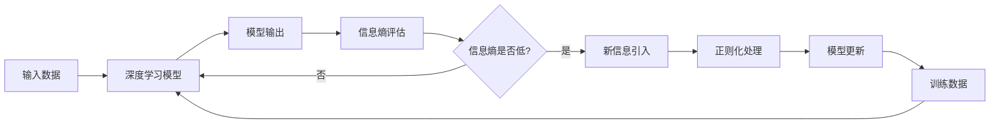

# 避免模型坍塌的新信息引入方法

> 关键词：模型坍塌、新信息引入、深度学习、神经网络、优化算法、信息熵、正则化

> 摘要：在深度学习和神经网络的训练过程中，模型坍塌是一个常见且棘手的问题，它会导致模型性能严重下降，无法有效学习数据特征。本文围绕避免模型坍塌的新信息引入方法展开，详细阐述了相关的核心概念、算法原理、数学模型，通过项目实战展示具体实现，分析了实际应用场景，推荐了相关工具和资源，最后总结未来发展趋势与挑战。旨在为研究人员和开发者提供全面深入的技术参考，帮助他们更好地解决模型坍塌问题，提升模型性能。

## 1. 背景介绍 
### 1.1 目的和范围
在深度学习领域，模型坍塌问题一直是困扰研究人员和开发者的难题。模型坍塌会使得模型在训练过程中无法充分学习数据的多样性，导致输出结果过于单一，失去泛化能力。本文的目的在于深入探讨避免模型坍塌的新信息引入方法，涵盖从理论基础到实际应用的多个方面，包括核心概念的解释、算法原理的分析、数学模型的推导、项目实战的展示以及实际应用场景的讨论等，为解决模型坍塌问题提供全面而系统的技术方案。

### 1.2 预期读者
本文预期读者主要包括深度学习和人工智能领域的研究人员、开发者、学生以及对模型优化和性能提升感兴趣的技术爱好者。无论您是初学者想要了解模型坍塌的基本概念和解决方法，还是有一定经验的专业人士希望深入研究新的信息引入策略，本文都将为您提供有价值的参考。

### 1.3 文档结构概述
本文将按照以下结构进行阐述：首先介绍背景信息，包括目的、预期读者和文档结构概述等；接着讲解核心概念与联系，通过文本示意图和 Mermaid 流程图展示相关原理和架构；然后详细阐述核心算法原理和具体操作步骤，使用 Python 源代码进行说明；再介绍数学模型和公式，并结合具体例子进行讲解；之后通过项目实战展示代码实际案例并进行详细解释；分析实际应用场景；推荐相关工具和资源；最后总结未来发展趋势与挑战，提供常见问题与解答以及扩展阅读和参考资料。

### 1.4 术语表
#### 1.4.1 核心术语定义
- **模型坍塌**：指在深度学习模型训练过程中，模型的输出逐渐变得单一，失去对数据多样性的捕捉能力，导致模型性能急剧下降的现象。
- **新信息引入**：为了避免模型坍塌，向模型中引入额外的、具有多样性的信息，以增加模型的学习能力和泛化能力。
- **信息熵**：用于衡量信息的不确定性或随机性的指标，在本文中可用于评估模型输出的多样性。
- **正则化**：通过对模型参数进行约束，防止模型过拟合，提高模型的泛化能力。

#### 1.4.2 相关概念解释
- **深度学习模型**：基于神经网络的一种机器学习模型，通过多层神经元的非线性变换来学习数据的复杂特征。
- **泛化能力**：模型在未见过的数据上能够准确预测的能力，是衡量模型性能的重要指标。
- **过拟合**：模型在训练数据上表现良好，但在测试数据上表现不佳的现象，通常是由于模型过于复杂，过度学习了训练数据的噪声。

#### 1.4.3 缩略词列表
- **DNN**：深度神经网络（Deep Neural Network）
- **CNN**：卷积神经网络（Convolutional Neural Network）
- **RNN**：循环神经网络（Recurrent Neural Network）
- **GAN**：生成对抗网络（Generative Adversarial Network）

## 2. 核心概念与联系 
### 核心概念原理
模型坍塌的本质是模型在训练过程中陷入了局部最优解，导致其输出逐渐收敛到一个狭窄的范围内，无法反映数据的真实分布。新信息引入的方法旨在打破这种局部最优状态，为模型提供更多的学习方向和信息，从而提高模型的泛化能力和多样性。

信息熵是衡量信息不确定性的重要指标，在模型中，高信息熵表示模型输出的多样性较高，而低信息熵则可能意味着模型存在坍塌的风险。通过引入新信息，可以增加模型输出的信息熵，从而避免模型坍塌。

正则化是一种常用的防止过拟合的方法，它通过对模型参数进行约束，使得模型更加平滑，减少对训练数据的依赖，从而提高模型的泛化能力。在新信息引入的过程中，正则化可以帮助模型更好地吸收和利用新信息，避免模型过度拟合新信息而导致的性能下降。

### 架构的文本示意图
```plaintext
输入数据 -> 深度学习模型 -> 模型输出
       |                |
       |                v
       |         信息熵评估
       |                |
       |                v
       |         新信息引入
       |                |
       |                v
       |         正则化处理
       |                |
       |                v
       |         模型更新
       |                |
       v                |
训练数据  <--------------
```

### Mermaid 流程图


## 3. 核心算法原理 & 具体操作步骤 
### 算法原理
我们以一个简单的神经网络模型为例，说明避免模型坍塌的新信息引入方法的算法原理。假设我们的神经网络模型有输入层、隐藏层和输出层，模型的目标是通过训练学习输入数据和输出数据之间的映射关系。

在训练过程中，我们会不断计算模型输出的信息熵。如果信息熵低于某个阈值，说明模型输出的多样性较低，可能存在模型坍塌的风险。此时，我们会引入新信息来增加模型的学习能力。

新信息的引入可以通过多种方式实现，例如在输入数据中添加噪声、引入额外的特征或者使用生成对抗网络生成新的数据样本等。在引入新信息后，我们会对模型进行正则化处理，以防止模型过拟合新信息。

### 具体操作步骤
1. **初始化模型参数**：随机初始化神经网络的权重和偏置。
2. **训练模型**：使用训练数据对模型进行训练，计算模型的损失函数。
3. **计算信息熵**：在每次训练迭代后，计算模型输出的信息熵。
4. **判断信息熵是否低于阈值**：如果信息熵低于阈值，则执行新信息引入操作。
5. **引入新信息**：根据具体的新信息引入方法，在输入数据中添加噪声、引入额外的特征或者生成新的数据样本等。
6. **正则化处理**：对模型的参数进行正则化处理，例如使用 L1 或 L2 正则化。
7. **更新模型参数**：使用优化算法（如随机梯度下降）更新模型的权重和偏置。
8. **重复步骤 2 - 7**：直到模型收敛或达到最大训练迭代次数。

### Python 源代码实现
```python
import numpy as np
import torch
import torch.nn as nn
import torch.optim as optim

# 定义一个简单的神经网络模型
class SimpleNet(nn.Module):
    def __init__(self, input_size, hidden_size, output_size):
        super(SimpleNet, self).__init__()
        self.fc1 = nn.Linear(input_size, hidden_size)
        self.relu = nn.ReLU()
        self.fc2 = nn.Linear(hidden_size, output_size)

    def forward(self, x):
        out = self.fc1(x)
        out = self.relu(out)
        out = self.fc2(out)
        return out

# 计算信息熵
def calculate_entropy(output):
    probabilities = torch.softmax(output, dim=1)
    entropy = -torch.sum(probabilities * torch.log(probabilities), dim=1)
    return torch.mean(entropy).item()

# 新信息引入方法：添加噪声
def add_noise(input_data, noise_level=0.1):
    noise = torch.randn_like(input_data) * noise_level
    return input_data + noise

# 训练模型
def train_model(model, train_data, train_labels, num_epochs=100, entropy_threshold=0.5, noise_level=0.1, l2_reg=0.01):
    criterion = nn.CrossEntropyLoss()
    optimizer = optim.SGD(model.parameters(), lr=0.01, weight_decay=l2_reg)

    for epoch in range(num_epochs):
        outputs = model(train_data)
        entropy = calculate_entropy(outputs)

        if entropy < entropy_threshold:
            train_data = add_noise(train_data, noise_level)

        loss = criterion(outputs, train_labels)
        optimizer.zero_grad()
        loss.backward()
        optimizer.step()

        if (epoch + 1) % 10 == 0:
            print(f'Epoch [{epoch + 1}/{num_epochs}], Loss: {loss.item():.4f}, Entropy: {entropy:.4f}')

# 示例数据
input_size = 10
hidden_size = 20
output_size = 5
num_samples = 100

train_data = torch.randn(num_samples, input_size)
train_labels = torch.randint(0, output_size, (num_samples,))

# 初始化模型
model = SimpleNet(input_size, hidden_size, output_size)

# 训练模型
train_model(model, train_data, train_labels)
```

## 4. 数学模型和公式 & 详细讲解 & 举例说明 
### 信息熵的数学模型和公式
信息熵是衡量信息不确定性的指标，对于一个离散随机变量 $X$，其取值为 $x_1, x_2, \cdots, x_n$，对应的概率为 $p(x_1), p(x_2), \cdots, p(x_n)$，则信息熵 $H(X)$ 的计算公式为：
$$H(X) = -\sum_{i=1}^{n} p(x_i) \log p(x_i)$$

在神经网络中，我们可以将模型的输出看作一个离散随机变量，通过计算其信息熵来评估模型输出的多样性。

### 正则化的数学模型和公式
正则化是一种常用的防止过拟合的方法，常见的正则化方法有 L1 正则化和 L2 正则化。

#### L1 正则化
L1 正则化通过在损失函数中添加模型参数的绝对值之和来约束模型的复杂度，其损失函数的计算公式为：
$$L_{L1} = L + \lambda \sum_{i=1}^{m} |w_i|$$
其中 $L$ 是原始的损失函数，$\lambda$ 是正则化系数，$w_i$ 是模型的参数。

#### L2 正则化
L2 正则化通过在损失函数中添加模型参数的平方和来约束模型的复杂度，其损失函数的计算公式为：
$$L_{L2} = L + \lambda \sum_{i=1}^{m} w_i^2$$
其中 $L$ 是原始的损失函数，$\lambda$ 是正则化系数，$w_i$ 是模型的参数。

### 详细讲解
信息熵的计算公式基于信息论的基本原理，它反映了随机变量的不确定性程度。在神经网络中，高信息熵表示模型输出的分布较为均匀，即模型能够输出多种不同的结果，具有较高的多样性；而低信息熵则表示模型输出的分布较为集中，可能存在模型坍塌的风险。

正则化的作用是在模型训练过程中对模型的参数进行约束，防止模型过拟合训练数据。L1 正则化会使得模型的参数变得稀疏，即部分参数的值为 0，从而可以实现特征选择的功能；L2 正则化会使得模型的参数更加平滑，减少模型对训练数据的依赖，提高模型的泛化能力。

### 举例说明
假设我们有一个二分类问题，模型的输出为 $y_1$ 和 $y_2$，对应的概率分别为 $p(y_1) = 0.8$ 和 $p(y_2) = 0.2$。则信息熵 $H$ 的计算如下：
$$H = - (0.8 \log 0.8 + 0.2 \log 0.2) \approx 0.72$$

如果我们使用 L2 正则化，假设原始的损失函数 $L = 0.5$，模型的参数 $w_1 = 0.2$，$w_2 = 0.3$，正则化系数 $\lambda = 0.1$，则正则化后的损失函数 $L_{L2}$ 为：
$$L_{L2} = 0.5 + 0.1 \times (0.2^2 + 0.3^2) = 0.5 + 0.1 \times 0.13 = 0.513$$

## 5. 项目实战：代码实际案例和详细解释说明 
### 5.1  开发环境搭建
为了实现避免模型坍塌的新信息引入方法，我们需要搭建一个合适的开发环境。以下是具体的步骤：

1. **安装 Python**：建议使用 Python 3.6 及以上版本，可以从 Python 官方网站（https://www.python.org/downloads/）下载并安装。
2. **安装深度学习框架**：我们使用 PyTorch 作为深度学习框架，可以根据自己的需求选择合适的安装方式。如果使用 CUDA 加速，可以参考 PyTorch 官方文档（https://pytorch.org/get-started/locally/）进行安装。
3. **安装其他依赖库**：还需要安装一些其他的依赖库，如 NumPy、Matplotlib 等，可以使用以下命令进行安装：
```sh
pip install numpy matplotlib
```

### 5.2  源代码详细实现和代码解读
以下是一个完整的项目实战代码示例，我们将使用 MNIST 数据集来训练一个简单的卷积神经网络，并使用新信息引入方法来避免模型坍塌。

```python
import torch
import torch.nn as nn
import torch.optim as optim
from torchvision import datasets, transforms
from torch.utils.data import DataLoader
import numpy as np

# 定义卷积神经网络模型
class CNN(nn.Module):
    def __init__(self):
        super(CNN, self).__init__()
        self.conv1 = nn.Conv2d(1, 16, kernel_size=3, padding=1)
        self.relu1 = nn.ReLU()
        self.pool1 = nn.MaxPool2d(2)
        self.conv2 = nn.Conv2d(16, 32, kernel_size=3, padding=1)
        self.relu2 = nn.ReLU()
        self.pool2 = nn.MaxPool2d(2)
        self.fc1 = nn.Linear(32 * 7 * 7, 128)
        self.relu3 = nn.ReLU()
        self.fc2 = nn.Linear(128, 10)

    def forward(self, x):
        out = self.conv1(x)
        out = self.relu1(out)
        out = self.pool1(out)
        out = self.conv2(out)
        out = self.relu2(out)
        out = self.pool2(out)
        out = out.view(-1, 32 * 7 * 7)
        out = self.fc1(out)
        out = self.relu3(out)
        out = self.fc2(out)
        return out

# 计算信息熵
def calculate_entropy(output):
    probabilities = torch.softmax(output, dim=1)
    entropy = -torch.sum(probabilities * torch.log(probabilities), dim=1)
    return torch.mean(entropy).item()

# 新信息引入方法：添加噪声
def add_noise(input_data, noise_level=0.1):
    noise = torch.randn_like(input_data) * noise_level
    return input_data + noise

# 训练模型
def train_model(model, train_loader, num_epochs=10, entropy_threshold=0.5, noise_level=0.1, l2_reg=0.01):
    criterion = nn.CrossEntropyLoss()
    optimizer = optim.Adam(model.parameters(), lr=0.001, weight_decay=l2_reg)

    for epoch in range(num_epochs):
        running_loss = 0.0
        for i, (images, labels) in enumerate(train_loader):
            outputs = model(images)
            entropy = calculate_entropy(outputs)

            if entropy < entropy_threshold:
                images = add_noise(images, noise_level)

            loss = criterion(outputs, labels)
            optimizer.zero_grad()
            loss.backward()
            optimizer.step()

            running_loss += loss.item()

        print(f'Epoch [{epoch + 1}/{num_epochs}], Loss: {running_loss / len(train_loader):.4f}, Entropy: {entropy:.4f}')

# 数据预处理
transform = transforms.Compose([
    transforms.ToTensor(),
    transforms.Normalize((0.1307,), (0.3081,))
])

# 加载 MNIST 数据集
train_dataset = datasets.MNIST(root='./data', train=True, transform=transform, download=True)
train_loader = DataLoader(train_dataset, batch_size=64, shuffle=True)

# 初始化模型
model = CNN()

# 训练模型
train_model(model, train_loader)
```

### 5.3  代码解读与分析
1. **模型定义**：我们定义了一个简单的卷积神经网络模型 `CNN`，包含两个卷积层、两个池化层和两个全连接层。
2. **信息熵计算**：`calculate_entropy` 函数用于计算模型输出的信息熵，通过对模型输出进行 softmax 操作得到概率分布，然后根据信息熵的计算公式进行计算。
3. **新信息引入**：`add_noise` 函数用于在输入数据中添加噪声，以增加模型的学习能力。
4. **训练过程**：在训练过程中，我们会不断计算模型输出的信息熵。如果信息熵低于阈值，则在输入数据中添加噪声。然后计算损失函数，使用 Adam 优化器更新模型的参数。

通过这种方式，我们可以避免模型坍塌，提高模型的泛化能力。

## 6. 实际应用场景 
### 图像识别
在图像识别任务中，模型坍塌可能导致模型只能识别某些特定的图像特征，而忽略了其他重要的特征。通过引入新信息，如添加噪声、进行数据增强等，可以增加模型的学习能力，提高图像识别的准确率。例如，在人脸识别系统中，引入不同角度、光照条件下的人脸图像作为新信息，可以让模型更好地适应各种实际场景。

### 自然语言处理
在自然语言处理任务中，模型坍塌可能导致生成的文本缺乏多样性，语义单一。新信息引入方法可以通过引入不同风格、主题的文本数据，或者使用预训练模型的输出作为新信息，来提高模型的语言生成能力和语义理解能力。例如，在机器翻译任务中，引入不同领域的平行语料库作为新信息，可以提高翻译的准确性和流畅性。

### 语音识别
在语音识别任务中，模型坍塌可能导致模型对某些特定口音、语速的语音识别准确率较低。通过引入不同口音、语速的语音数据作为新信息，可以提高模型的泛化能力，使其能够更好地适应各种语音环境。例如，在智能语音助手系统中，引入不同地区用户的语音数据作为新信息，可以提高语音识别的准确率和用户体验。

### 推荐系统
在推荐系统中，模型坍塌可能导致推荐结果过于单一，缺乏个性化。新信息引入方法可以通过引入用户的历史行为数据、社交网络信息等作为新信息，来提高推荐系统的个性化推荐能力。例如，在电商推荐系统中，引入用户的浏览记录、购买历史、收藏信息等作为新信息，可以为用户提供更加个性化的商品推荐。

## 7. 工具和资源推荐
### 7.1 学习资源推荐
#### 7.1.1 书籍推荐
- 《深度学习》（Deep Learning）：由 Ian Goodfellow、Yoshua Bengio 和 Aaron Courville 合著，是深度学习领域的经典教材，涵盖了深度学习的基本概念、算法原理和应用案例。
- 《Python 深度学习》（Deep Learning with Python）：由 Francois Chollet 著，详细介绍了如何使用 Python 和 Keras 框架进行深度学习开发，适合初学者入门。
- 《神经网络与深度学习》（Neural Networks and Deep Learning）：由 Michael Nielsen 著，通过在线书籍的形式介绍了神经网络和深度学习的基本原理和实现方法，内容通俗易懂。

#### 7.1.2 在线课程
- Coursera 上的《深度学习专项课程》（Deep Learning Specialization）：由 Andrew Ng 教授授课，涵盖了深度学习的多个方面，包括神经网络基础、卷积神经网络、循环神经网络等。
- edX 上的《人工智能基础》（Fundamentals of Artificial Intelligence）：介绍了人工智能的基本概念、算法和应用，对深度学习的相关内容也有详细讲解。
- 哔哩哔哩（B 站）上有很多关于深度学习的教程视频，如李宏毅的《机器学习》课程，讲解生动有趣，适合初学者学习。

#### 7.1.3 技术博客和网站
- Medium 上有很多关于深度学习和人工智能的技术博客，如 Towards Data Science，上面有很多优秀的技术文章和案例分享。
- 机器之心（https://www.alldatasheet.com/）：专注于人工智能领域的资讯和技术报道，提供了很多深度学习的最新研究成果和应用案例。
- 开源中国（https://www.oschina.net/）：是一个开源技术社区，上面有很多关于深度学习的开源项目和技术文章。

### 7.2 开发工具框架推荐
#### 7.2.1 IDE和编辑器
- PyCharm：是一款专业的 Python 集成开发环境，具有代码编辑、调试、版本控制等功能，非常适合深度学习开发。
- Jupyter Notebook：是一个交互式的开发环境，可以在浏览器中编写和运行代码，方便进行数据探索和模型实验。
- Visual Studio Code：是一款轻量级的代码编辑器，支持多种编程语言和插件，通过安装相关插件可以进行深度学习开发。

#### 7.2.2 调试和性能分析工具
- TensorBoard：是 TensorFlow 提供的一个可视化工具，可以用于查看模型的训练过程、损失函数变化、模型结构等信息。
- PyTorch Profiler：是 PyTorch 提供的一个性能分析工具，可以帮助开发者分析模型的性能瓶颈，优化模型的运行效率。
- NVIDIA Nsight Systems：是 NVIDIA 提供的一个性能分析工具，可以用于分析 GPU 加速的深度学习模型的性能。

#### 7.2.3 相关框架和库
- PyTorch：是一个开源的深度学习框架，具有动态图、自动求导等特性，非常适合快速开发和实验。
- TensorFlow：是一个广泛使用的深度学习框架，具有强大的分布式训练和部署能力，适合大规模的深度学习应用。
- Keras：是一个高级神经网络 API，基于 TensorFlow、Theano 等后端，可以快速搭建和训练深度学习模型。

### 7.3 相关论文著作推荐
#### 7.3.1 经典论文
- 《ImageNet Classification with Deep Convolutional Neural Networks》：Alex Krizhevsky 等人发表的论文，介绍了 AlexNet 模型，开创了深度学习在图像识别领域的先河。
- 《Long Short-Term Memory》：Sepp Hochreiter 和 Jürgen Schmidhuber 发表的论文，提出了长短期记忆网络（LSTM），解决了循环神经网络中的梯度消失问题。
- 《Generative Adversarial Nets》：Ian Goodfellow 等人发表的论文，提出了生成对抗网络（GAN），在图像生成、数据增强等领域取得了广泛应用。

#### 7.3.2 最新研究成果
- 可以通过 arXiv（https://arxiv.org/）、ACM Digital Library（https://dl.acm.org/）等学术论文平台搜索关于避免模型坍塌和新信息引入方法的最新研究成果。
- 关注顶级学术会议，如 NeurIPS（Neural Information Processing Systems）、ICML（International Conference on Machine Learning）、CVPR（IEEE Conference on Computer Vision and Pattern Recognition）等，这些会议上会有很多关于深度学习的最新研究成果发布。

#### 7.3.3 应用案例分析
- 《Deep Learning in Healthcare: A Comprehensive Review》：介绍了深度学习在医疗领域的应用案例，包括疾病诊断、医学图像分析等。
- 《Deep Learning for Autonomous Vehicles: A Review》：介绍了深度学习在自动驾驶领域的应用案例，包括目标检测、路径规划等。
- 《Deep Learning in Finance: A Survey》：介绍了深度学习在金融领域的应用案例，包括风险评估、股票预测等。

## 8. 总结：未来发展趋势与挑战
### 未来发展趋势
- **多模态信息融合**：未来的新信息引入方法将更加注重多模态信息的融合，如将图像、文本、语音等多种信息结合起来，为模型提供更丰富、更全面的信息，从而提高模型的性能和泛化能力。
- **自适应信息引入**：模型将能够根据自身的状态和训练数据的特点，自适应地引入新信息，避免盲目引入信息导致的过拟合和性能下降问题。
- **强化学习与新信息引入的结合**：强化学习可以通过智能体与环境的交互来学习最优策略，将强化学习与新信息引入方法相结合，可以让模型在动态环境中更好地学习和适应，提高模型的鲁棒性和适应性。

### 挑战
- **信息质量控制**：引入的新信息质量直接影响模型的性能，如果新信息中包含噪声或错误信息，可能会导致模型性能下降。因此，如何有效地控制新信息的质量是一个重要的挑战。
- **计算资源需求**：随着模型复杂度的增加和新信息的引入，模型的训练和推理需要更多的计算资源。如何在有限的计算资源下实现高效的新信息引入方法是一个亟待解决的问题。
- **模型可解释性**：新信息引入方法可能会增加模型的复杂度，使得模型的可解释性降低。如何在提高模型性能的同时，保持模型的可解释性是一个重要的研究方向。

## 9. 附录：常见问题与解答
### 1. 什么是模型坍塌？
模型坍塌是指在深度学习模型训练过程中，模型的输出逐渐变得单一，失去对数据多样性的捕捉能力，导致模型性能急剧下降的现象。

### 2. 为什么要引入新信息来避免模型坍塌？
引入新信息可以打破模型在训练过程中陷入的局部最优状态，为模型提供更多的学习方向和信息，从而增加模型的学习能力和泛化能力，避免模型坍塌。

### 3. 新信息引入有哪些方法？
新信息引入的方法有很多种，常见的包括在输入数据中添加噪声、引入额外的特征、使用生成对抗网络生成新的数据样本等。

### 4. 如何选择合适的信息熵阈值？
信息熵阈值的选择需要根据具体的任务和数据集进行调整。一般来说，可以通过实验的方法，尝试不同的阈值，观察模型的性能变化，选择能够使模型性能最优的阈值。

### 5. 正则化的作用是什么？
正则化的作用是在模型训练过程中对模型的参数进行约束，防止模型过拟合训练数据，提高模型的泛化能力。

### 6. 新信息引入方法会增加模型的训练时间吗？
新信息引入方法可能会增加模型的训练时间，因为引入新信息会增加模型的学习负担。但是，通过合理选择新信息引入的方法和参数，可以在提高模型性能的同时，尽量减少训练时间的增加。

## 10. 扩展阅读 & 参考资料
### 扩展阅读
- 《Adversarial Machine Learning》：介绍了对抗机器学习的基本概念、算法和应用，与新信息引入方法有一定的关联。
- 《Probabilistic Graphical Models: Principles and Techniques》：介绍了概率图模型的基本原理和技术，对于理解模型的不确定性和信息熵有帮助。
- 《Reinforcement Learning: An Introduction》：介绍了强化学习的基本概念、算法和应用，与未来新信息引入方法的发展趋势相关。

### 参考资料
- Goodfellow, I. J., Bengio, Y., & Courville, A. (2016). Deep Learning. MIT Press.
- Chollet, F. (2018). Deep Learning with Python. Manning Publications.
- Nielsen, M. A. (2015). Neural Networks and Deep Learning. Determination Press.
- Krizhevsky, A., Sutskever, I., & Hinton, G. E. (2012). ImageNet Classification with Deep Convolutional Neural Networks. Advances in Neural Information Processing Systems.
- Hochreiter, S., & Schmidhuber, J. (1997). Long Short-Term Memory. Neural Computation.
- Goodfellow, I. J., et al. (2014). Generative Adversarial Nets. Advances in Neural Information Processing Systems.