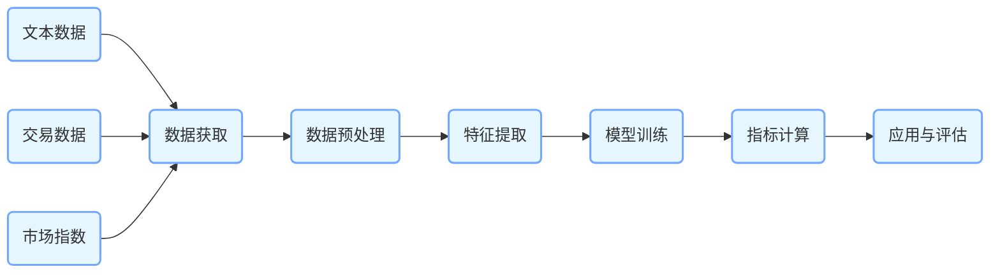

# 金融市场情绪指标开发

> 关键词：金融市场、情绪指标、数据挖掘、机器学习、自然语言处理、量化分析、市场预测

> 摘要：本文围绕金融市场情绪指标的开发展开，深入探讨其背后的核心概念、算法原理、数学模型等内容。首先介绍了开发金融市场情绪指标的背景，包括目的、预期读者、文档结构等信息。接着阐述了核心概念及其联系，通过文本示意图和 Mermaid 流程图进行清晰展示。详细讲解了核心算法原理并给出 Python 源代码，同时对相关数学模型和公式进行举例说明。通过项目实战部分，展示了开发环境搭建、源代码实现与解读。分析了该情绪指标的实际应用场景，推荐了学习、开发相关的工具和资源，包括书籍、在线课程、技术博客等。最后总结了未来发展趋势与挑战，提供常见问题解答和扩展阅读参考资料，旨在为读者全面呈现金融市场情绪指标开发的全过程和关键要点。

## 1. 背景介绍 
### 1.1 目的和范围
金融市场的波动受到多种因素的影响，其中投资者情绪是一个重要且复杂的因素。开发金融市场情绪指标的目的在于捕捉投资者的情绪状态，为金融市场分析、投资决策、风险管理等提供有价值的参考信息。通过对各类数据的挖掘和分析，构建能够反映市场情绪的量化指标，帮助投资者更好地理解市场动态，把握投资机会，降低投资风险。

本文档的范围涵盖了金融市场情绪指标开发的各个方面，包括数据来源、核心概念、算法原理、数学模型、项目实战、应用场景以及相关工具和资源等，旨在为读者提供一个全面、系统的开发指南。

### 1.2 预期读者
本文预期读者包括金融从业者，如投资经理、交易员、分析师等，他们可以借助情绪指标优化投资决策和风险管理策略；计算机科学和数据科学领域的专业人员，如程序员、数据分析师、机器学习工程师等，对金融市场情绪指标的开发技术和算法实现感兴趣；以及对金融市场和数据分析有一定了解的研究人员和爱好者，希望深入学习和探索情绪指标开发的相关知识。

### 1.3 文档结构概述
本文将按照以下结构展开：首先介绍开发金融市场情绪指标的背景信息，包括目的、预期读者和文档结构概述等。接着阐述核心概念与联系，通过文本示意图和 Mermaid 流程图进行清晰展示。详细讲解核心算法原理并给出 Python 源代码，同时对相关数学模型和公式进行举例说明。通过项目实战部分，展示开发环境搭建、源代码实现与解读。分析该情绪指标的实际应用场景，推荐学习、开发相关的工具和资源。最后总结未来发展趋势与挑战，提供常见问题解答和扩展阅读参考资料。

### 1.4 术语表
#### 1.4.1 核心术语定义
- **金融市场情绪**：投资者对金融市场的总体看法、预期和情感状态，包括乐观、悲观、恐慌等情绪，这些情绪会影响投资者的决策和市场的走势。
- **情绪指标**：用于量化金融市场情绪的数值指标，通过对相关数据的分析和处理得到，能够反映市场参与者的情绪变化。
- **自然语言处理（NLP）**：计算机科学与语言学的交叉领域，研究如何让计算机理解、处理和生成人类语言，在金融市场情绪指标开发中常用于分析文本数据。
- **机器学习（ML）**：一门多领域交叉学科，涉及概率论、统计学、逼近论、凸分析、算法复杂度理论等多门学科，专门研究计算机怎样模拟或实现人类的学习行为，以获取新的知识或技能，重新组织已有的知识结构使之不断改善自身的性能，在情绪指标开发中用于模型训练和预测。
- **量化分析**：运用数学、统计学等方法对金融市场数据进行分析和处理，以揭示市场规律和趋势，为投资决策提供依据。

#### 1.4.2 相关概念解释
- **数据挖掘**：从大量的、不完全的、有噪声的、模糊的、随机的数据中提取隐含在其中的、人们事先不知道的、但又是潜在有用的信息和知识的过程。在金融市场情绪指标开发中，数据挖掘用于从各种数据源中提取与情绪相关的信息。
- **文本数据**：以文字形式存在的数据，如新闻报道、社交媒体评论、研究报告等，是金融市场情绪分析的重要数据来源。
- **情感分析**：自然语言处理的一个重要应用，通过对文本的语义、语法和语境等进行分析，判断文本所表达的情感倾向，如积极、消极或中性，在情绪指标开发中用于分析投资者的情绪。

#### 1.4.3 缩略词列表
- **NLP**：Natural Language Processing（自然语言处理）
- **ML**：Machine Learning（机器学习）
- **API**：Application Programming Interface（应用程序编程接口）
- **ETF**：Exchange Traded Fund（交易型开放式指数基金）

## 2. 核心概念与联系 
金融市场情绪指标的开发涉及多个核心概念，它们之间相互关联、相互影响。下面通过文本示意图和 Mermaid 流程图来展示这些概念及其联系。

### 文本示意图
金融市场情绪指标的开发主要涉及数据获取、数据预处理、特征提取、模型训练和指标计算等环节。数据获取是从各种数据源收集与金融市场和投资者情绪相关的数据，包括文本数据、交易数据、市场指数等。数据预处理是对获取的数据进行清洗、转换和归一化等操作，以提高数据质量。特征提取是从预处理后的数据中提取能够反映市场情绪的特征，如文本的情感极性、交易数据的成交量和波动率等。模型训练是使用机器学习或深度学习算法对提取的特征进行训练，构建情绪预测模型。指标计算是根据训练好的模型对市场情绪进行量化，得到情绪指标。

### Mermaid 流程图


这个流程图展示了金融市场情绪指标开发的主要流程。首先从不同的数据源获取数据，然后对数据进行预处理，接着提取特征，使用这些特征进行模型训练，计算得到情绪指标，最后将指标应用于实际场景并进行评估。

## 3. 核心算法原理 & 具体操作步骤 
### 核心算法原理
在金融市场情绪指标开发中，常用的算法包括自然语言处理算法和机器学习算法。自然语言处理算法用于处理文本数据，提取文本的情感信息；机器学习算法用于构建情绪预测模型，对市场情绪进行量化。

#### 自然语言处理算法 - 情感分析
情感分析是自然语言处理的一个重要应用，其核心思想是通过对文本的语义、语法和语境等进行分析，判断文本所表达的情感倾向，如积极、消极或中性。常见的情感分析方法包括基于词典的方法、基于机器学习的方法和基于深度学习的方法。

- **基于词典的方法**：该方法通过预先构建一个情感词典，将文本中的词汇与词典中的词汇进行匹配，根据词汇的情感极性计算文本的情感得分。例如，如果文本中包含“上涨”、“利好”等积极词汇，则文本的情感得分增加；如果包含“下跌”、“利空”等消极词汇，则文本的情感得分减少。

- **基于机器学习的方法**：该方法使用机器学习算法对标注好的文本数据进行训练，构建情感分类模型。在训练过程中，将文本转换为特征向量，如词袋模型、TF-IDF 特征等，然后使用分类算法，如朴素贝叶斯、支持向量机等，对文本的情感进行分类。

- **基于深度学习的方法**：该方法使用深度学习模型，如循环神经网络（RNN）、长短期记忆网络（LSTM）、卷积神经网络（CNN）等，对文本的语义和语境进行建模，从而实现更准确的情感分析。

#### 机器学习算法 - 回归模型
在得到文本的情感信息后，需要使用机器学习算法构建情绪预测模型，对市场情绪进行量化。回归模型是一种常用的机器学习算法，用于预测连续变量的值。在金融市场情绪指标开发中，可以使用回归模型将文本的情感得分、交易数据和市场指数等特征与市场情绪进行建模，得到情绪指标。

### 具体操作步骤及 Python 源代码
下面以基于词典的情感分析和线性回归模型为例，介绍金融市场情绪指标开发的具体操作步骤及 Python 源代码。

#### 步骤 1：数据获取
假设我们已经从新闻网站获取了一批金融新闻文本数据，存储在一个列表中。

```python
news_texts = [
    "股市今日大幅上涨，投资者信心大增",
    "经济数据不佳，股市可能面临调整",
    "公司业绩超预期，股价有望继续攀升"
]
```

#### 步骤 2：数据预处理
对获取的文本数据进行清洗和分词处理。

```python
import re
import jieba

def preprocess_text(text):
    # 去除特殊字符
    text = re.sub(r'[^\u4e00-\u9fa5a-zA-Z0-9]', ' ', text)
    # 分词
    words = jieba.lcut(text)
    return words

preprocessed_texts = [preprocess_text(text) for text in news_texts]
```

#### 步骤 3：情感分析 - 基于词典的方法
构建一个简单的情感词典，然后根据词典计算文本的情感得分。

```python
# 情感词典
positive_words = ["上涨", "大增", "超预期", "攀升"]
negative_words = ["下跌", "调整", "不佳"]

def sentiment_score(words):
    score = 0
    for word in words:
        if word in positive_words:
            score += 1
        elif word in negative_words:
            score -= 1
    return score

sentiment_scores = [sentiment_score(words) for words in preprocessed_texts]
```

#### 步骤 4：模型训练 - 线性回归模型
假设我们已经获取了对应的市场情绪指标值，存储在一个列表中。

```python
import numpy as np
from sklearn.linear_model import LinearRegression

# 市场情绪指标值
market_sentiments = [0.8, 0.2, 0.9]

# 特征矩阵
X = np.array(sentiment_scores).reshape(-1, 1)
y = np.array(market_sentiments)

# 训练线性回归模型
model = LinearRegression()
model.fit(X, y)
```

#### 步骤 5：指标计算
使用训练好的模型对新的文本数据进行情绪指标计算。

```python
new_news_text = "股市今日小幅下跌，投资者信心受挫"
new_preprocessed_text = preprocess_text(new_news_text)
new_sentiment_score = sentiment_score(new_preprocessed_text)
new_X = np.array(new_sentiment_score).reshape(-1, 1)
predicted_sentiment = model.predict(new_X)

print("预测的市场情绪指标值：", predicted_sentiment[0])
```

## 4. 数学模型和公式 & 详细讲解 & 举例说明 
### 情感分析 - 基于词典的方法
#### 数学模型和公式
基于词典的情感分析方法的核心思想是通过对文本中的词汇进行情感极性判断，然后计算文本的情感得分。假设文本 $T$ 由 $n$ 个词汇 $w_1, w_2, \cdots, w_n$ 组成，每个词汇 $w_i$ 的情感极性用 $s_i$ 表示，$s_i$ 的取值为 $1$（积极）、$-1$（消极）或 $0$（中性），则文本 $T$ 的情感得分 $S$ 可以表示为：

$$S = \sum_{i=1}^{n} s_i$$

#### 详细讲解
在实际应用中，需要预先构建一个情感词典，将词汇的情感极性存储在词典中。在计算文本的情感得分时，遍历文本中的每个词汇，根据词典中该词汇的情感极性进行累加。如果词汇不在词典中，则其情感极性为 $0$。

#### 举例说明
假设文本为“股市今日大幅上涨，投资者信心大增”，情感词典中“上涨”和“大增”的情感极性为 $1$，其他词汇的情感极性为 $0$，则该文本的情感得分 $S = 1 + 1 = 2$。

### 线性回归模型
#### 数学模型和公式
线性回归模型是一种用于预测连续变量的值的机器学习算法。假设我们有 $m$ 个样本，每个样本有 $n$ 个特征 $x_1, x_2, \cdots, x_n$，对应的目标值为 $y$，则线性回归模型可以表示为：

$$y = \theta_0 + \theta_1 x_1 + \theta_2 x_2 + \cdots + \theta_n x_n + \epsilon$$

其中，$\theta_0, \theta_1, \cdots, \theta_n$ 是模型的参数，$\epsilon$ 是误差项。线性回归模型的目标是找到一组最优的参数 $\theta$，使得预测值与真实值之间的误差最小。常用的误差度量方法是均方误差（MSE），其计算公式为：

$$MSE = \frac{1}{m} \sum_{i=1}^{m} (y_i - \hat{y}_i)^2$$

其中，$y_i$ 是第 $i$ 个样本的真实值，$\hat{y}_i$ 是第 $i$ 个样本的预测值。

#### 详细讲解
在训练线性回归模型时，需要使用最小二乘法或梯度下降法等优化算法来求解最优的参数 $\theta$。最小二乘法是一种解析解的方法，通过对均方误差求导数并令其等于 $0$，得到参数 $\theta$ 的最优解。梯度下降法是一种迭代的方法，通过不断更新参数 $\theta$ 的值，使得均方误差逐渐减小，直到收敛。

#### 举例说明
假设我们有一个简单的线性回归模型 $y = \theta_0 + \theta_1 x$，有三个样本 $(x_1, y_1) = (1, 2)$，$(x_2, y_2) = (2, 4)$，$(x_3, y_3) = (3, 6)$。使用最小二乘法求解参数 $\theta$，可以得到 $\theta_0 = 0$，$\theta_1 = 2$，则该线性回归模型为 $y = 2x$。

## 5. 项目实战：代码实际案例和详细解释说明 
### 5.1  开发环境搭建
#### 操作系统
本项目可以在 Windows、Linux 或 macOS 等操作系统上进行开发，建议使用 Linux 或 macOS 系统，因为它们对 Python 和相关开发工具的支持更好。

#### Python 环境
建议使用 Python 3.7 及以上版本。可以通过 Anaconda 或 Miniconda 来管理 Python 环境，这样可以方便地安装和管理各种 Python 库。

#### 安装必要的 Python 库
在项目开发过程中，需要使用以下 Python 库：
- **jieba**：用于中文分词。
- **numpy**：用于数值计算。
- **pandas**：用于数据处理和分析。
- **scikit-learn**：用于机器学习算法。
- **matplotlib**：用于数据可视化。

可以使用以下命令来安装这些库：

```sh
pip install jieba numpy pandas scikit-learn matplotlib
```

### 5.2  源代码详细实现和代码解读
下面是一个完整的金融市场情绪指标开发项目的源代码，包括数据获取、数据预处理、情感分析、模型训练和指标计算等环节。

```python
import re
import jieba
import numpy as np
from sklearn.linear_model import LinearRegression
import pandas as pd
import matplotlib.pyplot as plt

# 数据获取
def get_news_data():
    # 模拟从新闻网站获取数据
    news_texts = [
        "股市今日大幅上涨，投资者信心大增",
        "经济数据不佳，股市可能面临调整",
        "公司业绩超预期，股价有望继续攀升",
        "市场波动加剧，投资者谨慎观望",
        "政策利好，股市有望反弹"
    ]
    return news_texts

# 数据预处理
def preprocess_text(text):
    # 去除特殊字符
    text = re.sub(r'[^\u4e00-\u9fa5a-zA-Z0-9]', ' ', text)
    # 分词
    words = jieba.lcut(text)
    return words

# 情感分析 - 基于词典的方法
positive_words = ["上涨", "大增", "超预期", "攀升", "利好", "反弹"]
negative_words = ["下跌", "调整", "不佳", "波动加剧", "谨慎观望"]

def sentiment_score(words):
    score = 0
    for word in words:
        if word in positive_words:
            score += 1
        elif word in negative_words:
            score -= 1
    return score

# 模型训练 - 线性回归模型
def train_model(sentiment_scores, market_sentiments):
    X = np.array(sentiment_scores).reshape(-1, 1)
    y = np.array(market_sentiments)
    model = LinearRegression()
    model.fit(X, y)
    return model

# 指标计算
def calculate_sentiment_index(model, news_text):
    preprocessed_text = preprocess_text(news_text)
    sentiment_score_value = sentiment_score(preprocessed_text)
    X = np.array(sentiment_score_value).reshape(-1, 1)
    predicted_sentiment = model.predict(X)
    return predicted_sentiment[0]

# 主函数
def main():
    # 数据获取
    news_texts = get_news_data()
    # 数据预处理
    preprocessed_texts = [preprocess_text(text) for text in news_texts]
    # 情感分析
    sentiment_scores = [sentiment_score(words) for words in preprocessed_texts]
    # 假设的市场情绪指标值
    market_sentiments = [0.8, 0.2, 0.9, 0.3, 0.7]
    # 模型训练
    model = train_model(sentiment_scores, market_sentiments)
    # 指标计算
    new_news_text = "股市今日小幅下跌，投资者信心受挫"
    sentiment_index = calculate_sentiment_index(model, new_news_text)
    print("预测的市场情绪指标值：", sentiment_index)

    # 数据可视化
    df = pd.DataFrame({
        'News Text': news_texts,
        'Sentiment Score': sentiment_scores,
        'Market Sentiment': market_sentiments
    })
    plt.figure(figsize=(10, 6))
    plt.scatter(df['Sentiment Score'], df['Market Sentiment'])
    plt.xlabel('Sentiment Score')
    plt.ylabel('Market Sentiment')
    plt.title('Relationship between Sentiment Score and Market Sentiment')
    plt.show()

if __name__ == "__main__":
    main()
```

### 5.3  代码解读与分析
#### 数据获取
`get_news_data` 函数模拟从新闻网站获取金融新闻文本数据，返回一个包含新闻文本的列表。

#### 数据预处理
`preprocess_text` 函数对获取的文本数据进行清洗和分词处理，去除特殊字符，然后使用 `jieba` 库进行中文分词。

#### 情感分析
`sentiment_score` 函数基于预先构建的情感词典，计算文本的情感得分。遍历文本中的每个词汇，根据词汇的情感极性进行累加。

#### 模型训练
`train_model` 函数使用线性回归模型对情感得分和市场情绪指标值进行建模，训练得到一个线性回归模型。

#### 指标计算
`calculate_sentiment_index` 函数使用训练好的模型对新的新闻文本进行情绪指标计算，返回预测的市场情绪指标值。

#### 数据可视化
在 `main` 函数中，使用 `pandas` 库将情感得分和市场情绪指标值存储在一个 DataFrame 中，然后使用 `matplotlib` 库绘制散点图，展示情感得分和市场情绪指标值之间的关系。

## 6. 实际应用场景 
### 投资决策
金融市场情绪指标可以帮助投资者更好地理解市场参与者的情绪状态，从而优化投资决策。当情绪指标显示市场情绪乐观时，投资者可以适当增加股票等风险资产的配置；当情绪指标显示市场情绪悲观时，投资者可以适当减少风险资产的配置，增加债券等避险资产的配置。

### 风险管理
情绪指标可以作为风险管理的一个重要参考指标。当市场情绪波动较大时，投资者面临的风险也相应增加。通过监测情绪指标，投资者可以及时调整投资组合，降低风险暴露。例如，当情绪指标突然下降时，投资者可以考虑减少杠杆，增加现金储备，以应对市场的不确定性。

### 市场趋势预测
金融市场情绪指标可以反映市场参与者的预期和信心，对市场趋势的预测具有一定的参考价值。当情绪指标持续上升时，可能预示着市场将迎来上涨行情；当情绪指标持续下降时，可能预示着市场将面临下跌风险。投资者可以结合其他技术分析和基本面分析方法，综合判断市场趋势。

### 量化交易策略开发
情绪指标可以作为量化交易策略的一个重要因子。例如，可以构建一个基于情绪指标的动量策略，当情绪指标上升时买入股票，当情绪指标下降时卖出股票。通过回测和优化，可以不断调整策略参数，提高策略的盈利能力。

## 7. 工具和资源推荐
### 7.1 学习资源推荐
#### 7.1.1 书籍推荐
- 《Python 数据分析实战》：本书介绍了使用 Python 进行数据分析的方法和技巧，包括数据获取、数据处理、数据分析和数据可视化等方面的内容，对于金融市场情绪指标开发中的数据处理和分析有很大的帮助。
- 《自然语言处理入门》：本书系统地介绍了自然语言处理的基本概念、算法和应用，包括分词、词性标注、命名实体识别、情感分析等内容，是学习自然语言处理的经典教材。
- 《机器学习实战》：本书通过大量的实际案例，介绍了机器学习的基本算法和应用，包括分类、回归、聚类、降维等内容，对于金融市场情绪指标开发中的模型训练和预测有很大的帮助。

#### 7.1.2 在线课程
- Coursera 上的“Python for Data Science and Machine Learning Bootcamp”：该课程介绍了使用 Python 进行数据分析和机器学习的方法和技巧，包括数据处理、数据分析、机器学习算法和数据可视化等方面的内容。
- edX 上的“Natural Language Processing”：该课程系统地介绍了自然语言处理的基本概念、算法和应用，包括分词、词性标注、命名实体识别、情感分析等内容。
- Udemy 上的“Machine Learning A-Z™: Hands-On Python & R In Data Science”：该课程通过大量的实际案例，介绍了机器学习的基本算法和应用，包括分类、回归、聚类、降维等内容。

#### 7.1.3 技术博客和网站
- 知乎：知乎上有很多关于金融市场、数据分析、自然语言处理和机器学习的优质回答和文章，可以从中获取最新的技术动态和经验分享。
- 博客园：博客园上有很多技术博客，其中不乏关于金融市场情绪指标开发的相关文章，可以从中学习到具体的实现方法和技巧。
- 开源中国：开源中国上有很多开源项目和技术文章，对于学习和实践金融市场情绪指标开发有很大的帮助。

### 7.2 开发工具框架推荐
#### 7.2.1 IDE和编辑器
- PyCharm：PyCharm 是一款专门为 Python 开发设计的集成开发环境（IDE），具有代码编辑、调试、版本控制等功能，是 Python 开发的首选工具。
- Jupyter Notebook：Jupyter Notebook 是一个交互式的开发环境，支持多种编程语言，包括 Python、R 等。它可以将代码、文本、图像和可视化结果集成在一个文档中，非常适合数据分析和机器学习的开发和演示。
- Visual Studio Code：Visual Studio Code 是一款轻量级的代码编辑器，支持多种编程语言和插件扩展。它具有丰富的代码编辑功能和调试功能，是一款非常受欢迎的开发工具。

#### 7.2.2 调试和性能分析工具
- PDB：PDB 是 Python 自带的调试器，可以在代码中设置断点，单步执行代码，查看变量的值等，帮助开发者快速定位和解决问题。
- cProfile：cProfile 是 Python 自带的性能分析工具，可以统计代码的运行时间和函数调用次数，帮助开发者找出代码中的性能瓶颈。
- Py-Spy：Py-Spy 是一个轻量级的 Python 性能分析工具，可以实时监测 Python 程序的运行状态，查看函数的调用栈和运行时间，帮助开发者优化代码性能。

#### 7.2.3 相关框架和库
- NLTK：NLTK 是一个自然语言处理工具包，提供了丰富的语料库和工具，包括分词、词性标注、命名实体识别、情感分析等功能，是自然语言处理开发的常用工具。
- SpaCy：SpaCy 是一个快速、高效的自然语言处理库，提供了预训练的语言模型和工具，包括分词、词性标注、命名实体识别、情感分析等功能，适用于大规模文本处理。
- TensorFlow：TensorFlow 是一个开源的机器学习框架，提供了丰富的深度学习模型和工具，包括神经网络、卷积神经网络、循环神经网络等，适用于复杂的机器学习任务。
- PyTorch：PyTorch 是一个开源的深度学习框架，提供了动态计算图和丰富的深度学习模型和工具，包括神经网络、卷积神经网络、循环神经网络等，适用于研究和开发。

### 7.3 相关论文著作推荐
#### 7.3.1 经典论文
- “The Stock Market's Reaction to Uncertainty”：该论文研究了股票市场对不确定性的反应，发现投资者情绪对股票市场的波动有重要影响。
- “Sentiment Analysis: Mining Opinions, Sentiments, and Emotions”：该论文系统地介绍了情感分析的基本概念、算法和应用，是情感分析领域的经典论文。
- “Machine Learning in Finance: The State of the Art”：该论文介绍了机器学习在金融领域的应用现状和发展趋势，包括风险评估、投资决策、市场预测等方面的内容。

#### 7.3.2 最新研究成果
- 可以通过学术搜索引擎，如 Google Scholar、IEEE Xplore、ACM Digital Library 等，搜索关于金融市场情绪指标开发的最新研究成果。关注顶尖学术会议和期刊，如 NeurIPS、ICML、KDD 等，了解最新的研究动态。

#### 7.3.3 应用案例分析
- 可以参考一些金融机构和研究机构发布的报告和案例分析，了解金融市场情绪指标在实际应用中的效果和经验。例如，一些投资银行会发布关于市场情绪分析的报告，分析市场情绪对投资决策的影响。

## 8. 总结：未来发展趋势与挑战
### 未来发展趋势
#### 多源数据融合
未来的金融市场情绪指标开发将更加注重多源数据的融合，除了文本数据、交易数据和市场指数外，还将纳入社交媒体数据、宏观经济数据、企业财务数据等，以更全面、准确地反映市场情绪。

#### 深度学习技术的应用
深度学习技术在自然语言处理和机器学习领域取得了显著的进展，未来将更多地应用于金融市场情绪指标开发中。例如，使用深度学习模型对文本数据进行更深入的语义理解和情感分析，提高情绪指标的准确性和预测能力。

#### 实时监测和预警
随着金融市场的快速变化，实时监测和预警市场情绪的变化变得越来越重要。未来的情绪指标开发将更加注重实时性，通过实时数据采集和处理，及时发现市场情绪的异常波动，为投资者提供及时的预警信息。

#### 个性化情绪指标
不同的投资者对市场情绪的感知和反应可能不同，未来的情绪指标开发将更加注重个性化。根据投资者的投资偏好、风险承受能力等因素，为不同的投资者提供个性化的情绪指标，提高投资决策的针对性和有效性。

### 挑战
#### 数据质量和可靠性
金融市场数据具有复杂性、噪声性和不确定性等特点，数据质量和可靠性对情绪指标的开发和应用有重要影响。如何获取高质量、可靠的数据，并对数据进行有效的清洗和预处理，是情绪指标开发面临的一个重要挑战。

#### 情感分析的准确性
情感分析是金融市场情绪指标开发的关键环节，其准确性直接影响情绪指标的质量。由于语言的复杂性和语境的多样性，情感分析仍然存在一定的误差和局限性。如何提高情感分析的准确性，是情绪指标开发面临的另一个重要挑战。

#### 模型的可解释性
深度学习模型在金融市场情绪指标开发中具有较高的准确性和预测能力，但这些模型往往是黑箱模型，缺乏可解释性。在实际应用中，投资者需要了解模型的决策过程和依据，以便做出合理的投资决策。如何提高模型的可解释性，是情绪指标开发面临的一个重要挑战。

#### 法规和合规问题
金融市场情绪指标的开发和应用涉及到大量的金融数据和投资者信息，需要遵守相关的法规和合规要求。例如，数据隐私保护、信息披露、反洗钱等方面的法规和要求。如何在开发和应用情绪指标的过程中，遵守相关的法规和合规要求，是情绪指标开发面临的一个重要挑战。

## 9. 附录：常见问题与解答
### 1. 如何选择合适的数据源？
选择合适的数据源需要考虑数据的相关性、可靠性、时效性和可获取性等因素。在金融市场情绪指标开发中，常见的数据源包括新闻网站、社交媒体平台、金融数据提供商等。可以根据具体的需求和研究目的，选择合适的数据源。

### 2. 如何提高情感分析的准确性？
可以通过以下方法提高情感分析的准确性：
- 使用更丰富的情感词典，包括领域特定的词汇和短语。
- 采用基于机器学习或深度学习的情感分析方法，利用标注好的文本数据进行训练。
- 考虑文本的语境和语义信息，例如使用上下文感知的模型。
- 进行数据增强和模型调优，提高模型的泛化能力。

### 3. 如何评估情绪指标的有效性？
可以通过以下方法评估情绪指标的有效性：
- 与市场实际表现进行对比，观察情绪指标与市场走势的相关性。
- 进行回测分析，使用历史数据验证情绪指标在投资决策中的有效性。
- 与其他市场指标进行比较，评估情绪指标的独特性和优势。
- 进行敏感性分析，评估情绪指标对不同参数和数据变化的敏感性。

### 4. 如何处理数据中的噪声和异常值？
可以通过以下方法处理数据中的噪声和异常值：
- 数据清洗：去除重复数据、缺失值和错误数据。
- 数据平滑：使用移动平均、指数平滑等方法对数据进行平滑处理。
- 异常值检测：使用统计方法或机器学习算法检测异常值，并进行相应的处理，如删除、替换或修正。
- 特征工程：通过特征选择和转换，减少噪声和异常值对模型的影响。

### 5. 如何确保模型的稳定性和泛化能力？
可以通过以下方法确保模型的稳定性和泛化能力：
- 数据划分：将数据集划分为训练集、验证集和测试集，使用验证集进行模型调优，使用测试集进行模型评估。
- 正则化：在模型训练过程中，使用正则化方法，如 L1 正则化、L2 正则化等，防止模型过拟合。
- 交叉验证：使用交叉验证方法，如 k 折交叉验证，评估模型的稳定性和泛化能力。
- 模型融合：使用模型融合方法，如投票法、堆叠法等，提高模型的稳定性和泛化能力。

## 10. 扩展阅读 & 参考资料
### 扩展阅读
- 《金融计量学：从初级到高级建模技术》：本书介绍了金融计量学的基本概念、方法和应用，包括时间序列分析、回归分析、风险度量等内容，对于深入理解金融市场数据和模型有很大的帮助。
- 《深度学习》：本书系统地介绍了深度学习的基本概念、算法和应用，包括神经网络、卷积神经网络、循环神经网络等内容，是深度学习领域的经典教材。
- 《Python 金融实战》：本书介绍了使用 Python 进行金融分析和交易的方法和技巧，包括数据获取、数据处理、数据分析、量化交易等方面的内容，对于金融市场情绪指标开发的实践应用有很大的帮助。

### 参考资料
- 相关金融数据提供商的官方网站，如 Wind、Bloomberg 等，获取金融市场数据和相关研究报告。
- 自然语言处理和机器学习领域的开源项目和文档，如 NLTK、SpaCy、TensorFlow、PyTorch 等，获取相关的技术文档和代码示例。
- 学术数据库和搜索引擎，如 Google Scholar、IEEE Xplore、ACM Digital Library 等，获取关于金融市场情绪指标开发的学术论文和研究成果。