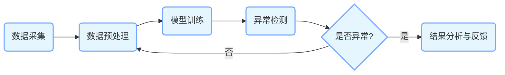

# 金融时序数据异常检测的AI方法

> 关键词：金融时序数据、异常检测、人工智能、机器学习、深度学习

> 摘要：本文围绕金融时序数据异常检测的AI方法展开，全面深入地探讨了相关技术。首先介绍了金融时序数据异常检测的背景、目的、预期读者和文档结构等内容。接着阐述了核心概念、算法原理，包括使用Python代码详细说明具体算法。通过数学模型和公式对异常检测的原理进行了深入剖析，并给出了实际例子。然后通过项目实战，从开发环境搭建、源代码实现及解读等方面进行了详细说明。还探讨了实际应用场景，推荐了相关的学习资源、开发工具框架以及论文著作。最后总结了未来发展趋势与挑战，并提供了常见问题解答和参考资料，旨在为读者提供全面且深入的金融时序数据异常检测AI方法的知识体系。

## 1. 背景介绍 
### 1.1 目的和范围
金融时序数据异常检测在金融领域具有至关重要的意义。目的在于及时、准确地发现金融数据中的异常情况，这些异常可能预示着金融风险、欺诈行为、市场波动异常等。通过有效的异常检测，可以帮助金融机构提前采取措施，降低损失，保障金融系统的稳定运行。

本文章的范围涵盖了多种基于AI的异常检测方法，包括传统的机器学习算法如基于统计的方法、支持向量机等，以及深度学习算法如循环神经网络、自编码器等。同时，会结合实际的金融时序数据，如股票价格数据、交易记录数据等，来阐述这些方法的应用。

### 1.2 预期读者
本文预期读者包括金融行业的从业者，如风险分析师、交易员、合规人员等，他们可以通过本文了解如何利用AI技术更好地进行金融数据的异常检测，提升工作效率和准确性。同时，也适合计算机科学领域的研究人员和开发者，他们可以从金融领域的实际需求出发，深入理解异常检测算法在实际场景中的应用和优化。此外，对金融科技感兴趣的学生和爱好者也能从本文中获取相关知识，拓宽知识面。

### 1.3 文档结构概述
本文将按照以下结构进行阐述：首先介绍背景知识，让读者了解金融时序数据异常检测的重要性和本文的范围。接着讲解核心概念与联系，明确异常检测的基本原理和相关概念。然后详细介绍核心算法原理及具体操作步骤，通过Python代码进行说明。之后给出数学模型和公式，并结合实际例子进行讲解。再通过项目实战，从开发环境搭建到源代码实现和解读，全面展示如何应用这些方法。随后探讨实际应用场景，让读者了解这些方法在现实中的应用方式。接着推荐相关的工具和资源，包括学习资源、开发工具框架和论文著作。最后总结未来发展趋势与挑战，提供常见问题解答和参考资料。

### 1.4 术语表
#### 1.4.1 核心术语定义
- **金融时序数据**：按时间顺序排列的金融相关数据，如股票价格随时间的变化、银行交易记录的时间序列等。
- **异常检测**：在数据集中识别出与正常模式显著不同的数据点或模式的过程。
- **AI（人工智能）**：让计算机模拟人类智能的技术，包括机器学习、深度学习等多种方法。
- **机器学习**：一门多领域交叉学科，涉及概率论、统计学、逼近论、凸分析、算法复杂度理论等多门学科。它专门研究计算机怎样模拟或实现人类的学习行为，以获取新的知识或技能，重新组织已有的知识结构使之不断改善自身的性能。
- **深度学习**：机器学习的一个分支领域，它是一种基于对数据进行表征学习的方法。深度学习通过构建具有很多层的神经网络模型，自动从大量数据中学习复杂的模式和特征。

#### 1.4.2 相关概念解释
- **正常模式**：金融时序数据中大多数数据点所遵循的模式或规律。例如，在股票价格数据中，正常模式可能表现为价格在一定范围内波动，且波动幅度和频率具有一定的稳定性。
- **异常值**：偏离正常模式的数据点。这些数据点可能是由于数据录入错误、欺诈行为、市场突发事件等原因导致的。例如，在股票交易中，某只股票突然出现异常高的成交量，可能是由于内幕交易等异常情况引起的。
- **特征提取**：从原始数据中提取出能够反映数据本质特征的信息的过程。在金融时序数据异常检测中，特征提取可以帮助我们更好地表示数据，提高异常检测的准确性。例如，我们可以从股票价格数据中提取出价格的波动率、收益率等特征。

#### 1.4.3 缩略词列表
- **SVM**：支持向量机（Support Vector Machine）
- **RNN**：循环神经网络（Recurrent Neural Network）
- **LSTM**：长短期记忆网络（Long Short - Term Memory）
- **AE**：自编码器（Autoencoder）

## 2. 核心概念与联系 

### 核心概念原理
金融时序数据异常检测的核心原理是基于对正常模式的建模和识别。在正常情况下，金融时序数据会呈现出一定的规律和模式，这些模式可以通过统计分析、机器学习或深度学习等方法进行学习和建模。当出现与正常模式显著不同的数据点时，就可以将其判定为异常值。

例如，在股票价格数据中，我们可以通过分析历史价格数据，建立一个价格波动的模型。如果某一天的股票价格波动超出了这个模型所预测的范围，那么就可以认为这一天的价格数据可能存在异常。

### 架构的文本示意图
金融时序数据异常检测的架构通常包括以下几个部分：
1. **数据采集**：从各种金融数据源中收集时序数据，如股票交易所、银行系统等。
2. **数据预处理**：对采集到的数据进行清洗、归一化、特征提取等操作，以提高数据的质量和可用性。
3. **模型训练**：使用预处理后的数据训练异常检测模型，如机器学习模型或深度学习模型。
4. **异常检测**：将新的数据输入到训练好的模型中，根据模型的输出判断是否存在异常。
5. **结果分析与反馈**：对检测到的异常结果进行分析，确定异常的原因和影响，并将结果反馈给相关人员，以便采取相应的措施。

### Mermaid 流程图


## 3. 核心算法原理 & 具体操作步骤 

### 基于统计的异常检测方法
#### 原理
基于统计的异常检测方法是通过对数据的统计特性进行分析，如均值、方差等，来判断数据点是否异常。常见的方法有基于Z - score的异常检测。

Z - score是一种衡量数据点与均值之间偏离程度的统计量，其计算公式为：
$Z=\frac{x-\mu}{\sigma}$
其中，$x$ 是数据点的值，$\mu$ 是数据的均值，$\sigma$ 是数据的标准差。

一般来说，如果 $|Z|$ 的值大于某个阈值（通常为2或3），则认为该数据点是异常值。

#### Python代码实现
```python
import numpy as np

def z_score_anomaly_detection(data, threshold=3):
    mean = np.mean(data)
    std = np.std(data)
    z_scores = np.abs((data - mean) / std)
    anomalies = np.where(z_scores > threshold)[0]
    return anomalies

# 示例数据
data = np.array([1, 2, 3, 4, 5, 100])
anomalies = z_score_anomaly_detection(data)
print("异常值的索引:", anomalies)
```
#### 具体操作步骤
1. 计算数据的均值 $\mu$ 和标准差 $\sigma$。
2. 对于每个数据点 $x$，计算其Z - score。
3. 将Z - score的绝对值与阈值进行比较，如果大于阈值，则将该数据点标记为异常值。

### 支持向量机（SVM）异常检测
#### 原理
支持向量机是一种有监督学习算法，但也可以用于异常检测。在异常检测中，通常使用单类支持向量机（One - Class SVM）。单类支持向量机的目标是找到一个超平面，将正常数据点与异常数据点分开。

单类支持向量机通过最大化正常数据点到超平面的距离，来学习正常数据的分布。当新的数据点距离超平面较远时，就可以认为该数据点是异常值。

#### Python代码实现
```python
from sklearn.svm import OneClassSVM
import numpy as np

# 示例数据
data = np.array([[1], [2], [3], [4], [5], [100]])
clf = OneClassSVM(nu=0.1)
clf.fit(data)
predictions = clf.predict(data)
anomalies = np.where(predictions == -1)[0]
print("异常值的索引:", anomalies)
```
#### 具体操作步骤
1. 准备训练数据，确保数据只包含正常数据点。
2. 初始化单类支持向量机模型，并设置相关参数，如 `nu`（控制异常值的比例）。
3. 使用训练数据对模型进行训练。
4. 将所有数据输入到训练好的模型中，得到预测结果。预测结果为 - 1 的数据点即为异常值。

### 循环神经网络（RNN）异常检测
#### 原理
循环神经网络是一种专门处理序列数据的神经网络。在金融时序数据异常检测中，RNN可以学习到数据的时间依赖关系，从而对未来的数据进行预测。如果实际数据与预测数据之间的误差超过了某个阈值，则认为该数据点是异常值。

#### Python代码实现
```python
import numpy as np
from tensorflow.keras.models import Sequential
from tensorflow.keras.layers import SimpleRNN, Dense

# 示例数据
data = np.array([1, 2, 3, 4, 5, 100])
# 数据预处理
X = data[:-1].reshape(-1, 1, 1)
y = data[1:]

# 构建RNN模型
model = Sequential()
model.add(SimpleRNN(10, input_shape=(1, 1)))
model.add(Dense(1))
model.compile(optimizer='adam', loss='mse')

# 训练模型
model.fit(X, y, epochs=50, verbose=0)

# 预测
predictions = model.predict(X)
errors = np.abs(y - predictions.flatten())
threshold = np.mean(errors) + 2 * np.std(errors)
anomalies = np.where(errors > threshold)[0]
print("异常值的索引:", anomalies)
```
#### 具体操作步骤
1. 对金融时序数据进行预处理，将其转换为适合RNN输入的格式。
2. 构建RNN模型，包括定义模型的层数、神经元数量等。
3. 编译模型，选择合适的优化器和损失函数。
4. 使用训练数据对模型进行训练。
5. 对训练数据进行预测，计算预测值与实际值之间的误差。
6. 根据误差的统计特性，确定异常检测的阈值。
7. 将误差与阈值进行比较，超过阈值的数据点即为异常值。

## 4. 数学模型和公式 & 详细讲解 & 举例说明 

### 基于统计的异常检测数学模型
#### 数学公式
如前面所述，基于Z - score的异常检测使用的公式为：
$Z=\frac{x-\mu}{\sigma}$
其中，$x$ 是数据点的值，$\mu$ 是数据的均值，$\sigma$ 是数据的标准差。均值 $\mu$ 和标准差 $\sigma$ 的计算公式分别为：
$\mu=\frac{1}{n}\sum_{i = 1}^{n}x_i$
$\sigma=\sqrt{\frac{1}{n}\sum_{i = 1}^{n}(x_i-\mu)^2}$
其中，$n$ 是数据点的数量，$x_i$ 是第 $i$ 个数据点的值。

#### 详细讲解
均值 $\mu$ 表示数据的平均水平，标准差 $\sigma$ 表示数据的离散程度。Z - score衡量了每个数据点相对于均值的偏离程度，以标准差为单位。当 $|Z|$ 较大时，说明该数据点距离均值较远，可能是异常值。

#### 举例说明
假设有一组股票价格数据：$[10, 11, 12, 13, 14, 20]$。
首先计算均值：
$\mu=\frac{10 + 11+12+13+14+20}{6}=\frac{80}{6}\approx13.33$
然后计算标准差：
$\sigma=\sqrt{\frac{(10 - 13.33)^2+(11 - 13.33)^2+(12 - 13.33)^2+(13 - 13.33)^2+(14 - 13.33)^2+(20 - 13.33)^2}{6}}$
$\approx\sqrt{\frac{11.09+5.43+1.77+0.11+0.45+44.49}{6}}\approx\sqrt{\frac{63.34}{6}}\approx3.25$
对于数据点 $x = 20$，计算其Z - score：
$Z=\frac{20 - 13.33}{3.25}\approx2.05$
如果阈值为2，则该数据点可以被认为是异常值。

### 单类支持向量机数学模型
#### 数学公式
单类支持向量机的目标是找到一个超平面 $w^Tx + b = 0$，使得正常数据点到超平面的距离最大化。其优化问题可以表示为：
$\min_{w,b,\xi}\frac{1}{2}||w||^2+\frac{1}{\nu n}\sum_{i = 1}^{n}\xi_i - b$
subject to $w^Tx_i\geq b-\xi_i,\xi_i\geq0$
其中，$w$ 是超平面的法向量，$b$ 是偏置，$\xi_i$ 是松弛变量，$\nu$ 是一个控制异常值比例的参数，$n$ 是数据点的数量，$x_i$ 是第 $i$ 个数据点。

#### 详细讲解
上述优化问题的目标是在保证正常数据点都在超平面一侧的前提下，最小化超平面的法向量的模长。松弛变量 $\xi_i$ 允许一些数据点违反约束条件，从而提高模型的鲁棒性。参数 $\nu$ 控制了异常值的比例，$\nu$ 越小，模型对异常值的容忍度越低。

#### 举例说明
假设我们有一个二维的正常数据点集合：$[(1, 1), (2, 2), (3, 3)]$。单类支持向量机的目标是找到一个超平面，将这些数据点与异常数据点分开。通过求解上述优化问题，可以得到超平面的参数 $w$ 和 $b$。当有新的数据点输入时，计算该数据点到超平面的距离，如果距离较远，则认为该数据点是异常值。

### 循环神经网络数学模型
#### 数学公式
简单循环神经网络（Simple RNN）的隐藏状态更新公式为：
$h_t=\tanh(W_{hh}h_{t - 1}+W_{xh}x_t + b_h)$
其中，$h_t$ 是时刻 $t$ 的隐藏状态，$x_t$ 是时刻 $t$ 的输入，$W_{hh}$ 是隐藏状态到隐藏状态的权重矩阵，$W_{xh}$ 是输入到隐藏状态的权重矩阵，$b_h$ 是隐藏状态的偏置，$\tanh$ 是激活函数。

输出层的计算公式为：
$y_t=W_{hy}h_t + b_y$
其中，$y_t$ 是时刻 $t$ 的输出，$W_{hy}$ 是隐藏状态到输出的权重矩阵，$b_y$ 是输出的偏置。

#### 详细讲解
循环神经网络通过不断更新隐藏状态，来捕捉数据的时间依赖关系。隐藏状态 $h_t$ 不仅取决于当前时刻的输入 $x_t$，还取决于上一时刻的隐藏状态 $h_{t - 1}$。输出层根据隐藏状态 $h_t$ 生成最终的输出 $y_t$。

#### 举例说明
假设我们要对股票价格进行预测，输入 $x_t$ 是时刻 $t$ 的股票价格，隐藏状态 $h_t$ 可以理解为模型对历史价格信息的记忆。通过不断更新隐藏状态，模型可以学习到股票价格的变化趋势。当实际价格与预测价格之间的误差超过阈值时，就可以认为该时刻的价格数据存在异常。

## 5. 项目实战：代码实际案例和详细解释说明 

### 5.1  开发环境搭建
#### 操作系统
可以选择Windows、Linux或macOS等主流操作系统。这里以Ubuntu 20.04为例进行说明。

#### 编程语言和版本
使用Python 3.8及以上版本。可以通过以下命令安装Python：
```bash
sudo apt update
sudo apt install python3.8
```

#### 依赖库安装
需要安装一些常用的Python库，如 `numpy`、`pandas`、`scikit - learn`、`tensorflow` 等。可以使用 `pip` 进行安装：
```bash
pip install numpy pandas scikit-learn tensorflow
```

### 5.2  源代码详细实现和代码解读
#### 数据准备
我们使用一个简单的股票价格数据集来进行异常检测。首先，我们需要读取数据并进行预处理。
```python
import pandas as pd
import numpy as np

# 读取数据
data = pd.read_csv('stock_prices.csv')
prices = data['Close'].values

# 数据归一化
from sklearn.preprocessing import MinMaxScaler
scaler = MinMaxScaler()
prices = scaler.fit_transform(prices.reshape(-1, 1)).flatten()
```
**代码解读**：
- 使用 `pandas` 库的 `read_csv` 函数读取股票价格数据。
- 提取收盘价数据并将其转换为 `numpy` 数组。
- 使用 `MinMaxScaler` 对数据进行归一化处理，将数据缩放到 [0, 1] 范围内。

#### 基于自编码器的异常检测
```python
from tensorflow.keras.models import Model
from tensorflow.keras.layers import Input, Dense

# 构建自编码器模型
input_layer = Input(shape=(1,))
encoded = Dense(10, activation='relu')(input_layer)
decoded = Dense(1, activation='linear')(encoded)
autoencoder = Model(input_layer, decoded)
autoencoder.compile(optimizer='adam', loss='mse')

# 训练自编码器
autoencoder.fit(prices, prices, epochs=50, batch_size=32, verbose=0)

# 计算重建误差
predictions = autoencoder.predict(prices)
errors = np.abs(prices - predictions.flatten())

# 确定异常阈值
threshold = np.mean(errors) + 2 * np.std(errors)
anomalies = np.where(errors > threshold)[0]
print("异常值的索引:", anomalies)
```
**代码解读**：
- 构建自编码器模型，包括一个输入层、一个编码器层和一个解码器层。
- 使用均方误差（MSE）作为损失函数，Adam优化器进行模型训练。
- 对训练数据进行预测，计算预测值与实际值之间的重建误差。
- 根据误差的统计特性，确定异常检测的阈值。
- 将误差与阈值进行比较，超过阈值的数据点即为异常值。

### 5.3  代码解读与分析
#### 自编码器的工作原理
自编码器的目标是学习输入数据的低维表示（编码），然后从这个低维表示中重建出原始数据（解码）。在正常情况下，自编码器可以很好地重建输入数据，重建误差较小。当出现异常数据时，自编码器无法准确地重建这些数据，导致重建误差增大。

#### 异常检测的原理
通过计算重建误差，并根据误差的统计特性确定阈值，我们可以将重建误差超过阈值的数据点标记为异常值。这种方法的优点是不需要标注异常数据，只需要正常数据进行训练。

#### 代码的可扩展性
可以通过调整自编码器的结构，如增加编码器和解码器的层数、神经元数量等，来提高模型的性能。同时，也可以尝试不同的损失函数和优化器，以找到最适合的模型配置。

## 6. 实际应用场景 

### 金融欺诈检测
在金融交易中，异常检测可以帮助识别欺诈行为。例如，在信用卡交易中，如果某张信用卡的交易模式突然发生变化，如交易金额大幅增加、交易地点异常等，就可能是欺诈行为。通过对交易记录的时序数据进行异常检测，可以及时发现这些异常交易，采取相应的措施，如冻结信用卡、通知持卡人等。

### 市场风险预警
金融市场的波动是复杂多变的，异常检测可以帮助监测市场风险。例如，在股票市场中，如果某只股票的价格突然出现异常波动，可能预示着该公司的基本面发生了变化，或者市场出现了重大事件。通过对股票价格的时序数据进行异常检测，可以及时发现这些异常波动，为投资者提供风险预警。

### 信用风险评估
在信贷业务中，异常检测可以帮助评估借款人的信用风险。例如，通过对借款人的还款记录、收入情况等时序数据进行异常检测，如果发现借款人的还款行为出现异常，如逾期还款、还款金额突然减少等，就可能预示着借款人的信用风险增加。金融机构可以根据这些异常情况，及时调整对借款人的信用评估和贷款政策。

## 7. 工具和资源推荐
### 7.1 学习资源推荐
#### 7.1.1 书籍推荐
- 《Python机器学习》：这本书详细介绍了Python在机器学习中的应用，包括各种机器学习算法的原理和实现。适合初学者入门学习。
- 《深度学习》：由深度学习领域的三位顶级专家Ian Goodfellow、Yoshua Bengio和Aaron Courville撰写，全面介绍了深度学习的理论和实践。是深度学习领域的经典著作。
- 《金融时间序列分析》：系统地介绍了金融时间序列分析的方法和技术，包括时间序列模型、波动率模型、风险度量等。对于理解金融时序数据的特点和分析方法非常有帮助。

#### 7.1.2 在线课程
- Coursera上的“机器学习”课程：由斯坦福大学的Andrew Ng教授讲授，是机器学习领域的经典课程，涵盖了机器学习的基本概念、算法和应用。
- edX上的“深度学习”课程：由百度的吴恩达教授讲授，深入介绍了深度学习的原理和实践，包括神经网络、卷积神经网络、循环神经网络等。
- Kaggle上的“金融数据分析”课程：提供了丰富的金融数据分析案例和实践项目，通过实际操作可以更好地掌握金融数据的分析方法和异常检测技术。

#### 7.1.3 技术博客和网站
- Towards Data Science：一个专注于数据科学和机器学习的博客平台，上面有很多关于异常检测、金融数据分析等方面的优秀文章。
- Medium：一个综合性的博客平台，有很多技术专家分享他们的经验和见解，包括金融科技领域的最新发展和研究成果。
- arXiv：一个预印本服务器，提供了大量的学术论文，包括机器学习、深度学习、金融时间序列分析等领域的最新研究成果。

### 7.2 开发工具框架推荐
#### 7.2.1 IDE和编辑器
- PyCharm：一款专业的Python集成开发环境，提供了丰富的代码编辑、调试、版本控制等功能，适合开发大型的Python项目。
- Jupyter Notebook：一个交互式的开发环境，支持Python、R等多种编程语言。可以方便地进行数据探索、模型训练和可视化等操作，非常适合数据科学和机器学习的开发。
- Visual Studio Code：一款轻量级的代码编辑器，支持多种编程语言和插件扩展。可以通过安装Python相关的插件，实现Python代码的编辑、调试和运行。

#### 7.2.2 调试和性能分析工具
- TensorBoard：TensorFlow的可视化工具，可以帮助用户直观地查看模型的训练过程、损失函数的变化、模型的结构等信息，方便进行模型调试和优化。
- Py-Spy：一个用于Python代码性能分析的工具，可以实时监测Python程序的CPU使用情况、函数调用时间等信息，帮助用户找出性能瓶颈。
- Scikit-learn的GridSearchCV：用于超参数调优的工具，可以帮助用户自动搜索最优的模型超参数，提高模型的性能。

#### 7.2.3 相关框架和库
- Scikit-learn：一个常用的机器学习库，提供了丰富的机器学习算法和工具，如分类、回归、聚类、异常检测等。可以方便地进行模型的训练、评估和优化。
- TensorFlow：一个开源的深度学习框架，由Google开发。提供了丰富的深度学习模型和工具，如神经网络、卷积神经网络、循环神经网络等。支持多种硬件平台，包括CPU、GPU和TPU。
- PyTorch：另一个开源的深度学习框架，由Facebook开发。具有简洁易用的API和动态计算图的特点，适合快速开发和实验深度学习模型。

### 7.3 相关论文著作推荐
#### 7.3.1 经典论文
- “Isolation Forest”：提出了一种基于孤立森林的异常检测算法，该算法在处理高维数据和大规模数据时具有较好的性能。
- “One-Class SVM for Novelty Detection”：介绍了单类支持向量机在异常检测中的应用，为异常检测提供了一种有效的方法。
- “Long Short-Term Memory”：介绍了长短期记忆网络（LSTM）的原理和应用，LSTM在处理序列数据的异常检测中具有很好的效果。

#### 7.3.2 最新研究成果
- 关注顶级学术会议如NeurIPS（神经信息处理系统大会）、ICML（国际机器学习会议）、KDD（知识发现与数据挖掘会议）等，这些会议上会有很多关于异常检测、金融数据分析等领域的最新研究成果。
- 关注顶级学术期刊如Journal of Machine Learning Research（机器学习研究杂志）、ACM Transactions on Knowledge Discovery from Data（ACM数据挖掘与知识发现汇刊）等，这些期刊上会发表很多高质量的学术论文。

#### 7.3.3 应用案例分析
- 可以参考一些金融机构的研究报告和案例分析，了解异常检测技术在实际金融业务中的应用情况和效果。例如，一些银行会发布关于信用卡欺诈检测、市场风险预警等方面的案例分析报告。

## 8. 总结：未来发展趋势与挑战

### 未来发展趋势
#### 多模态数据融合
未来的金融时序数据异常检测将不仅仅局限于单一类型的数据，而是会融合多种模态的数据，如文本数据（新闻报道、公司公告等）、图像数据（财务报表的图片等）和时序数据（股票价格、交易记录等）。通过多模态数据融合，可以更全面地了解金融市场的情况，提高异常检测的准确性。

#### 深度学习模型的优化
随着深度学习技术的不断发展，未来会出现更加高效、准确的深度学习模型用于异常检测。例如，Transformer架构在自然语言处理领域取得了巨大成功，未来可能会被应用到金融时序数据异常检测中，以更好地捕捉数据的长期依赖关系。

#### 实时异常检测
在金融领域，实时性是非常重要的。未来的异常检测系统将更加注重实时性，能够在数据产生的瞬间就进行异常检测，并及时发出警报。这需要不断优化算法和系统架构，提高计算效率。

### 挑战
#### 数据质量和隐私问题
金融数据的质量和隐私是异常检测面临的重要挑战。数据中可能存在噪声、缺失值等问题，会影响异常检测的准确性。同时，金融数据涉及用户的隐私和敏感信息，如何在保证数据隐私的前提下进行有效的异常检测是一个亟待解决的问题。

#### 模型可解释性
深度学习模型虽然在异常检测中取得了很好的效果，但往往是一个“黑箱”模型，难以解释其决策过程。在金融领域，模型的可解释性非常重要，因为金融决策需要有明确的依据。如何提高深度学习模型的可解释性是未来需要解决的一个关键问题。

#### 对抗性攻击
随着异常检测技术的发展，攻击者也会采用更加复杂的方法来绕过检测系统。例如，攻击者可能会对数据进行微小的修改，使得异常数据看起来像正常数据。如何提高异常检测系统的鲁棒性，抵御对抗性攻击是未来面临的一个挑战。

## 9. 附录：常见问题与解答

### 如何选择合适的异常检测算法？
选择合适的异常检测算法需要考虑多个因素，如数据的特点（维度、分布、时间序列特性等）、异常的定义（是局部异常还是全局异常）、计算资源和时间限制等。一般来说，对于简单的数据集，可以先尝试基于统计的方法；对于复杂的数据集，可以考虑使用机器学习或深度学习算法。

### 异常检测的阈值如何确定？
异常检测的阈值可以根据数据的统计特性来确定，如均值、标准差等。常见的方法是使用Z - score，将阈值设置为均值加减一定倍数的标准差。也可以使用基于密度的方法，如局部离群因子（LOF），通过计算数据点的局部密度来确定异常阈值。此外，还可以通过交叉验证等方法来选择最优的阈值。

### 如何处理异常检测中的误报和漏报问题？
误报是指将正常数据误判为异常数据，漏报是指将异常数据误判为正常数据。可以通过以下方法来减少误报和漏报：
- 优化异常检测算法，选择更合适的算法和参数。
- 增加数据的特征，提高数据的表示能力。
- 结合多种异常检测方法，进行综合判断。
- 对异常检测结果进行人工审核，排除误报和确认漏报。

## 10. 扩展阅读 & 参考资料
### 扩展阅读
- 《人工智能时代的金融科技》：探讨了人工智能在金融领域的应用和发展趋势，包括异常检测、风险评估、投资决策等方面。
- 《数据挖掘：概念与技术》：系统地介绍了数据挖掘的基本概念、算法和应用，对于理解异常检测的原理和方法有很大的帮助。

### 参考资料
- 相关的学术论文和研究报告，如前面推荐的经典论文和最新研究成果。
- 开源代码库，如GitHub上的相关项目，可以参考其中的代码实现和技术细节。
- 官方文档，如Scikit-learn、TensorFlow、PyTorch等库的官方文档，提供了详细的函数说明和使用示例。