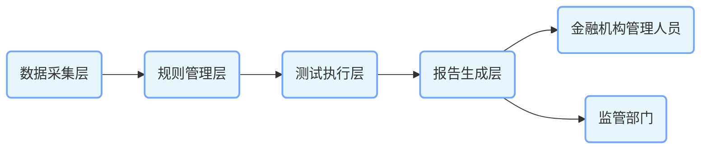

# 金融监管合规自动化测试平台

> 关键词：金融监管、合规性、自动化测试、测试平台、金融科技

> 摘要：本文围绕金融监管合规自动化测试平台展开深入探讨。随着金融行业的快速发展和监管要求的不断提高，确保金融机构的业务活动符合监管规定变得至关重要。金融监管合规自动化测试平台能够有效提高测试效率、降低人工成本、提升测试准确性，为金融机构的合规运营提供有力支持。文章详细介绍了该平台的背景、核心概念、算法原理、数学模型、项目实战、实际应用场景等内容，并对相关工具和资源进行推荐，最后对未来发展趋势与挑战进行总结，旨在为金融监管合规自动化测试领域的研究和实践提供全面的参考。

## 1. 背景介绍 
### 1.1 目的和范围
金融行业受到严格的监管，监管政策不断更新和变化。金融机构需要投入大量的人力和时间来确保其业务活动符合各种监管要求，以避免潜在的法律风险和声誉损失。本金融监管合规自动化测试平台的目的在于开发一个高效、准确、可扩展的自动化测试系统，帮助金融机构快速、全面地进行合规性测试。

其范围涵盖了金融行业的多个领域，包括银行、证券、保险等，能够对各类金融业务流程、交易数据、客户信息等进行合规性测试，确保金融机构在各个业务环节都能满足监管要求。

### 1.2 预期读者
本文的预期读者包括金融机构的合规管理人员、测试人员、技术开发人员，以及对金融科技、自动化测试等领域感兴趣的研究人员和学者。金融机构的合规管理人员可以通过本文了解如何利用自动化测试平台提升合规工作效率；测试人员可以学习到平台的测试原理和方法；技术开发人员可以参考平台的架构和实现细节进行系统开发；研究人员和学者可以从本文中获取相关领域的研究思路和前沿动态。

### 1.3 文档结构概述
本文将按照以下结构进行阐述：首先介绍金融监管合规自动化测试平台的背景信息，包括目的、范围、预期读者和文档结构概述等内容；接着详细讲解平台的核心概念与联系，通过文本示意图和 Mermaid 流程图进行说明；然后阐述核心算法原理和具体操作步骤，并使用 Python 源代码进行详细阐述；之后介绍数学模型和公式，并通过举例进行说明；再通过项目实战展示代码实际案例和详细解释说明；随后探讨平台的实际应用场景；接着推荐相关的工具和资源；最后总结未来发展趋势与挑战，并提供附录常见问题与解答以及扩展阅读和参考资料。

### 1.4 术语表
#### 1.4.1 核心术语定义
- **金融监管**：指政府通过特定的机构（如中央银行、金融监管局等）对金融交易行为主体进行的某种限制或规定。
- **合规性**：指金融机构的业务活动和管理行为符合法律法规、监管要求、行业准则等规定。
- **自动化测试**：指使用自动化测试工具或脚本代替人工进行测试的过程，能够提高测试效率和准确性。
- **测试平台**：是一个集成了各种测试工具和资源的软件系统，用于执行和管理测试任务。

#### 1.4.2 相关概念解释
- **金融科技（Fintech）**：是指利用现代科技手段改造和创新传统金融业务模式、流程和服务的新兴领域，金融监管合规自动化测试平台是金融科技的重要应用之一。
- **监管科技（Regtech）**：是指利用科技手段来帮助金融机构更好地满足监管要求，提高合规效率和降低合规成本。

#### 1.4.3 缩略词列表
- **API**：Application Programming Interface（应用程序编程接口）
- **SDK**：Software Development Kit（软件开发工具包）
- **UI**：User Interface（用户界面）
- **ETL**：Extract, Transform, Load（数据抽取、转换和加载）

## 2. 核心概念与联系 
金融监管合规自动化测试平台主要涉及以下几个核心概念：金融监管规则、合规性检查、自动化测试脚本、测试用例、测试报告等。这些概念之间相互关联，共同构成了平台的核心功能。

### 核心概念原理和架构的文本示意图
金融监管规则是平台的基础，它定义了金融机构需要遵守的各种法律法规和监管要求。合规性检查是根据这些规则对金融机构的业务数据和流程进行检查的过程。自动化测试脚本是实现合规性检查自动化的关键，它通过编程的方式模拟人工测试的步骤，对金融数据进行自动分析和验证。测试用例是对具体测试场景的描述，它包含了测试的输入数据、预期结果等信息。测试报告则是对测试结果的总结和反馈，它向金融机构的管理人员和监管部门提供了测试的详细情况和合规性评估结果。

平台的架构主要包括数据采集层、规则管理层、测试执行层和报告生成层。数据采集层负责从金融机构的各个业务系统中收集相关的数据；规则管理层对金融监管规则进行管理和维护，确保规则的准确性和及时性；测试执行层根据规则和测试用例执行自动化测试任务；报告生成层根据测试结果生成详细的测试报告。

### Mermaid 流程图


## 3. 核心算法原理 & 具体操作步骤 
### 核心算法原理
金融监管合规自动化测试平台的核心算法主要包括数据匹配算法、规则引擎算法和异常检测算法。

#### 数据匹配算法
数据匹配算法用于将金融机构的业务数据与监管规则中的要求进行匹配。常见的数据匹配算法包括字符串匹配算法、数值匹配算法和日期匹配算法等。例如，在检查客户身份信息时，可能需要使用字符串匹配算法来确保客户姓名、身份证号码等信息的准确性。

#### 规则引擎算法
规则引擎算法是平台的核心，它负责根据监管规则和业务数据进行逻辑判断和推理。规则引擎通常采用基于规则的编程模型，将监管规则以规则的形式存储在规则库中，当接收到业务数据时，规则引擎会根据规则进行匹配和执行，判断业务数据是否符合监管要求。

#### 异常检测算法
异常检测算法用于发现金融业务数据中的异常情况，如异常交易、异常客户行为等。常见的异常检测算法包括基于统计的方法、基于机器学习的方法和基于深度学习的方法等。例如，使用基于统计的方法可以计算交易金额的均值和标准差，当某笔交易金额超出正常范围时，将其标记为异常交易。

### 具体操作步骤
#### 步骤 1：数据采集
使用数据采集工具从金融机构的各个业务系统中采集相关的数据，如客户信息、交易记录、账户信息等。采集的数据可以是结构化数据（如数据库中的数据），也可以是非结构化数据（如文本文件、日志文件等）。

#### 步骤 2：数据预处理
对采集到的数据进行预处理，包括数据清洗、数据转换和数据归一化等操作。数据清洗用于去除数据中的噪声和错误信息；数据转换用于将不同格式的数据转换为统一的格式；数据归一化用于将数据的取值范围进行统一，以便后续的分析和处理。

#### 步骤 3：规则加载
从规则库中加载金融监管规则，并将其解析为规则引擎可以理解的格式。规则库可以是一个数据库，也可以是一个文件系统。

#### 步骤 4：测试执行
根据加载的规则和预处理后的数据，执行自动化测试任务。规则引擎会对业务数据进行逐行检查，判断是否符合监管要求，并将检查结果记录下来。

#### 步骤 5：结果分析
对测试结果进行分析，找出不符合监管要求的业务数据和相关的业务流程。可以使用数据分析工具对测试结果进行可视化展示，以便更好地理解和分析测试结果。

#### 步骤 6：报告生成
根据测试结果生成详细的测试报告，报告内容包括测试概述、测试结果、问题分析和建议等。测试报告可以以 HTML、PDF 等格式输出，方便金融机构的管理人员和监管部门查看。

### Python 源代码详细阐述
以下是一个简单的 Python 示例，演示了如何使用数据匹配算法和规则引擎算法进行合规性检查：

```python
# 定义监管规则
rules = [
    {
        "rule_id": 1,
        "description": "客户年龄必须在 18 岁以上",
        "condition": lambda customer: customer["age"] >= 18
    },
    {
        "rule_id": 2,
        "description": "单笔交易金额不能超过 10000 元",
        "condition": lambda transaction: transaction["amount"] <= 10000
    }
]

# 定义客户信息和交易记录
customers = [
    {"customer_id": 1, "name": "张三", "age": 20},
    {"customer_id": 2, "name": "李四", "age": 16}
]

transactions = [
    {"transaction_id": 1, "customer_id": 1, "amount": 5000},
    {"transaction_id": 2, "customer_id": 2, "amount": 12000}
]

# 执行合规性检查
def check_compliance(data, rules):
    results = []
    for item in data:
        for rule in rules:
            if rule["condition"](item):
                result = {
                    "item": item,
                    "rule_id": rule["rule_id"],
                    "description": rule["description"],
                    "compliant": True
                }
            else:
                result = {
                    "item": item,
                    "rule_id": rule["rule_id"],
                    "description": rule["description"],
                    "compliant": False
                }
            results.append(result)
    return results

# 检查客户信息合规性
customer_results = check_compliance(customers, rules)
print("客户信息合规性检查结果：")
for result in customer_results:
    print(result)

# 检查交易记录合规性
transaction_results = check_compliance(transactions, rules)
print("交易记录合规性检查结果：")
for result in transaction_results:
    print(result)
```

在这个示例中，我们定义了两个监管规则，分别是客户年龄必须在 18 岁以上和单笔交易金额不能超过 10000 元。然后，我们定义了客户信息和交易记录，并使用 `check_compliance` 函数对这些数据进行合规性检查。最后，我们输出了检查结果。

## 4. 数学模型和公式 & 详细讲解 & 举例说明 
### 数据匹配的数学模型
在数据匹配中，我们可以使用相似度度量来衡量两个数据项之间的相似程度。常见的相似度度量方法包括编辑距离、余弦相似度等。

#### 编辑距离
编辑距离（Levenshtein 距离）是指两个字符串之间，由一个字符串转换成另一个字符串所需的最少编辑操作次数（插入、删除、替换）。编辑距离的计算公式如下：

设两个字符串 $s_1$ 和 $s_2$，长度分别为 $m$ 和 $n$，编辑距离 $d(s_1, s_2)$ 可以通过动态规划的方法计算：

$$
d(i, j) = \begin{cases}
i & \text{if } j = 0 \\
j & \text{if } i = 0 \\
d(i-1, j-1) & \text{if } s_1[i-1] = s_2[j-1] \\
1 + \min(d(i-1, j), d(i, j-1), d(i-1, j-1)) & \text{if } s_1[i-1] \neq s_2[j-1]
\end{cases}
$$

其中，$d(i, j)$ 表示 $s_1$ 的前 $i$ 个字符和 $s_2$ 的前 $j$ 个字符之间的编辑距离。

#### 举例说明
假设我们要比较两个客户姓名 "张三" 和 "张四"，使用编辑距离来计算它们的相似度。

首先，我们将两个姓名转换为字符序列：$s_1 = ['张', '三']$，$s_2 = ['张', '四']$。

根据编辑距离的计算公式，我们可以得到：

$d(0, 0) = 0$

$d(1, 0) = 1$，$d(0, 1) = 1$

$d(1, 1) = d(0, 0) = 0$（因为第一个字符都是 '张'）

$d(2, 1) = 1 + \min(d(1, 1), d(2, 0), d(1, 0)) = 1 + \min(0, 2, 1) = 1$

$d(1, 2) = 1 + \min(d(0, 2), d(1, 1), d(0, 1)) = 1 + \min(2, 0, 1) = 1$

$d(2, 2) = 1 + \min(d(1, 2), d(2, 1), d(1, 1)) = 1 + \min(1, 1, 0) = 1$

所以，"张三" 和 "张四" 的编辑距离为 1。

### 异常检测的数学模型
在异常检测中，我们可以使用基于统计的方法，如均值和标准差来判断数据是否异常。

设一组数据 $x_1, x_2, \cdots, x_n$，其均值 $\mu$ 和标准差 $\sigma$ 的计算公式如下：

$$
\mu = \frac{1}{n} \sum_{i=1}^{n} x_i
$$

$$
\sigma = \sqrt{\frac{1}{n} \sum_{i=1}^{n} (x_i - \mu)^2}
$$

通常，我们可以将超出均值 $\pm k\sigma$ 范围的数据视为异常数据，其中 $k$ 是一个常数，一般取 2 或 3。

#### 举例说明
假设我们有一组交易金额数据：$[1000, 2000, 3000, 4000, 5000, 10000]$。

首先，计算均值：

$$
\mu = \frac{1}{6} (1000 + 2000 + 3000 + 4000 + 5000 + 10000) = \frac{25000}{6} \approx 4166.67
$$

然后，计算标准差：

$$
\begin{align*}
\sigma &= \sqrt{\frac{1}{6} [(1000 - 4166.67)^2 + (2000 - 4166.67)^2 + (3000 - 4166.67)^2 + (4000 - 4166.67)^2 + (5000 - 4166.67)^2 + (10000 - 4166.67)^2]} \\
&\approx 2788.87
\end{align*}
$$

如果我们取 $k = 2$，则正常范围为：

$$
\mu - 2\sigma \approx 4166.67 - 2 \times 2788.87 = -1411.07
$$

$$
\mu + 2\sigma \approx 4166.67 + 2 \times 2788.87 = 9744.41
$$

可以看出，交易金额 10000 超出了正常范围，因此可以将其视为异常交易。

## 5. 项目实战：代码实际案例和详细解释说明 
### 5.1  开发环境搭建
#### 开发语言和框架
我们选择 Python 作为开发语言，因为 Python 具有丰富的库和工具，适合快速开发和实现各种算法。同时，我们使用 Django 作为 Web 框架，它提供了强大的数据库管理、用户认证和视图处理功能，方便我们开发金融监管合规自动化测试平台的 Web 界面。

#### 数据库
选择 MySQL 作为数据库，用于存储金融业务数据、监管规则、测试结果等信息。MySQL 是一种开源的关系型数据库，具有高性能、稳定性好等优点。

#### 开发工具
使用 PyCharm 作为集成开发环境（IDE），它提供了代码编辑、调试、版本控制等功能，提高开发效率。

#### 环境配置步骤
1. 安装 Python 和 Django：可以从 Python 官方网站下载 Python 安装包，然后使用 `pip` 命令安装 Django。
2. 安装 MySQL：可以从 MySQL 官方网站下载 MySQL 安装包，并按照安装向导进行安装。
3. 配置数据库连接：在 Django 项目的 `settings.py` 文件中配置数据库连接信息，包括数据库名称、用户名、密码等。
4. 创建 Django 项目和应用：使用 `django-admin startproject` 命令创建 Django 项目，然后使用 `python manage.py startapp` 命令创建应用。

### 5.2  源代码详细实现和代码解读
#### 数据采集模块
```python
import pandas as pd
import mysql.connector

def collect_data():
    # 从 MySQL 数据库中采集数据
    connection = mysql.connector.connect(
        host="localhost",
        user="root",
        password="password",
        database="financial_data"
    )
    query = "SELECT * FROM transactions"
    df = pd.read_sql(query, connection)
    connection.close()
    return df
```
代码解读：这个函数使用 `mysql.connector` 库连接到 MySQL 数据库，然后使用 `pandas` 库的 `read_sql` 函数从数据库中读取交易数据，并将其存储在 `DataFrame` 中。最后，关闭数据库连接并返回 `DataFrame`。

#### 规则管理模块
```python
class Rule:
    def __init__(self, rule_id, description, condition):
        self.rule_id = rule_id
        self.description = description
        self.condition = condition

def load_rules():
    rules = [
        Rule(1, "单笔交易金额不能超过 10000 元", lambda transaction: transaction["amount"] <= 10000),
        Rule(2, "交易时间必须在工作日的 9:00 - 17:00 之间", lambda transaction: is_working_hour(transaction["time"]))
    ]
    return rules

def is_working_hour(time):
    # 判断时间是否在工作日的 9:00 - 17:00 之间
    import datetime
    weekday = time.weekday()
    if weekday < 5 and 9 <= time.hour < 17:
        return True
    return False
```
代码解读：这个模块定义了 `Rule` 类，用于表示监管规则。`load_rules` 函数用于加载规则，其中包含了两个规则：单笔交易金额不能超过 10000 元，交易时间必须在工作日的 9:00 - 17:00 之间。`is_working_hour` 函数用于判断交易时间是否在规定的工作时间内。

#### 测试执行模块
```python
def execute_tests(data, rules):
    results = []
    for index, row in data.iterrows():
        for rule in rules:
            if rule.condition(row):
                result = {
                    "transaction_id": row["transaction_id"],
                    "rule_id": rule.rule_id,
                    "description": rule.description,
                    "compliant": True
                }
            else:
                result = {
                    "transaction_id": row["transaction_id"],
                    "rule_id": rule.rule_id,
                    "description": rule.description,
                    "compliant": False
                }
            results.append(result)
    return results
```
代码解读：这个函数用于执行测试任务，它遍历数据集中的每一行交易数据，并根据规则进行判断。如果交易数据符合规则，则将 `compliant` 标记为 `True`，否则标记为 `False`。最后，将测试结果存储在列表中并返回。

#### 报告生成模块
```python
import csv

def generate_report(results):
    with open("test_report.csv", mode="w", newline="") as file:
        writer = csv.DictWriter(file, fieldnames=["transaction_id", "rule_id", "description", "compliant"])
        writer.writeheader()
        for result in results:
            writer.writerow(result)
```
代码解读：这个函数用于生成测试报告，它将测试结果存储在 CSV 文件中。使用 `csv.DictWriter` 类将测试结果逐行写入 CSV 文件。

### 5.3  代码解读与分析
通过以上代码实现，我们完成了金融监管合规自动化测试平台的主要功能。数据采集模块负责从数据库中采集交易数据；规则管理模块负责加载和管理监管规则；测试执行模块根据规则对交易数据进行合规性检查；报告生成模块将测试结果生成 CSV 格式的报告。

整个系统的优点在于模块化设计，各个模块之间的耦合度较低，便于维护和扩展。同时，使用 Python 语言和相关库，提高了开发效率和代码的可读性。

然而，该系统也存在一些不足之处，例如规则的定义和管理还比较简单，缺乏灵活性；测试报告的格式比较单一，不能满足不同用户的需求。在实际应用中，我们可以进一步优化和完善这些功能。

## 6. 实际应用场景 
### 银行
在银行领域，金融监管合规自动化测试平台可以用于对客户身份信息、账户信息、交易记录等进行合规性测试。例如，检查客户是否满足反洗钱规定，账户是否存在异常交易等。通过自动化测试，可以及时发现潜在的风险，提高银行的合规性管理水平。

### 证券
在证券行业，平台可以对证券交易行为、投资者适当性管理等进行测试。例如，检查证券公司是否按照规定对投资者进行风险评估，是否存在内幕交易等违规行为。自动化测试可以提高证券市场的透明度和公正性。

### 保险
在保险行业，平台可以对保险产品的条款、理赔流程等进行合规性测试。例如，检查保险条款是否符合监管要求，理赔流程是否合理等。通过自动化测试，可以保障保险消费者的权益，促进保险行业的健康发展。

## 7. 工具和资源推荐
### 7.1 学习资源推荐
#### 7.1.1 书籍推荐
- 《Python 数据分析实战》：本书介绍了使用 Python 进行数据分析的方法和技巧，对于金融数据的处理和分析非常有帮助。
- 《金融科技：重塑金融未来》：全面介绍了金融科技的发展现状和未来趋势，对于理解金融监管合规自动化测试平台的背景和意义有很大的帮助。
- 《自动化测试实战》：详细介绍了自动化测试的原理、方法和工具，对于学习如何开发自动化测试平台具有重要的参考价值。

#### 7.1.2 在线课程
- Coursera 上的 “Python for Data Science” 课程：由知名大学的教授授课，系统地介绍了 Python 在数据科学领域的应用。
- edX 上的 “Fintech: Foundations and Applications” 课程：深入探讨了金融科技的基础知识和应用案例。
- Udemy 上的 “Automated Testing with Python” 课程：通过实际项目演示了如何使用 Python 进行自动化测试。

#### 7.1.3 技术博客和网站
- 开源中国（https://www.oschina.net/）：提供了丰富的开源项目和技术文章，对于了解最新的技术动态和开源框架非常有帮助。
- 思否（https://segmentfault.com/）：是一个技术交流社区，有很多关于金融科技、自动化测试等领域的优质文章和讨论。
- 博客园（https://www.cnblogs.com/）：汇聚了众多技术开发者的博客，其中有很多关于 Python 编程、数据分析等方面的经验分享。

### 7.2 开发工具框架推荐
#### 7.2.1 IDE和编辑器
- PyCharm：是一款专门为 Python 开发设计的集成开发环境，具有强大的代码编辑、调试、版本控制等功能。
- Visual Studio Code：是一款轻量级的代码编辑器，支持多种编程语言，并且有丰富的插件可以扩展功能。

#### 7.2.2 调试和性能分析工具
- PDB：是 Python 自带的调试工具，可以帮助开发者逐步执行代码，查找和解决问题。
- cProfile：是 Python 标准库中的性能分析工具，可以分析代码的运行时间和函数调用情况，帮助开发者优化代码性能。

#### 7.2.3 相关框架和库
- Django：是一个高级 Python Web 框架，提供了强大的数据库管理、用户认证和视图处理功能，适合开发金融监管合规自动化测试平台的 Web 界面。
- Flask：是一个轻量级的 Python Web 框架，简单易用，适合快速开发和原型验证。
- Pandas：是一个强大的数据分析库，提供了高效的数据结构和数据处理功能，对于金融数据的处理和分析非常有帮助。

### 7.3 相关论文著作推荐
#### 7.3.1 经典论文
- “A Survey on Automated Software Testing”：对自动化软件测试的发展历程、技术方法和应用案例进行了全面的综述。
- “Fintech and the Remaking of Financial Services”：探讨了金融科技对金融服务行业的影响和变革。

#### 7.3.2 最新研究成果
- 关注顶级学术会议和期刊，如 ACM SIGKDD、IEEE Transactions on Software Engineering 等，及时了解金融监管合规自动化测试领域的最新研究成果。

#### 7.3.3 应用案例分析
- 可以参考一些金融机构的公开报告和案例分析，了解他们在金融监管合规自动化测试方面的实践经验和成果。

## 8. 总结：未来发展趋势与挑战
### 未来发展趋势
#### 智能化
随着人工智能技术的不断发展，金融监管合规自动化测试平台将越来越智能化。例如，使用机器学习和深度学习算法可以自动识别和分析复杂的金融数据，发现潜在的风险和违规行为；自然语言处理技术可以实现对监管规则的自动理解和解析，提高规则管理的效率。

#### 实时化
未来的测试平台将具备实时监测和预警功能，能够实时获取金融业务数据，并及时进行合规性检查。一旦发现异常情况，系统可以立即发出警报，提醒金融机构采取相应的措施，降低风险。

#### 集成化
金融监管合规自动化测试平台将与金融机构的其他业务系统进行深度集成，实现数据的共享和流通。例如，与客户关系管理系统集成，可以实时获取客户信息；与交易系统集成，可以实时监测交易行为。这样可以提高测试的准确性和全面性。

### 挑战
#### 数据安全和隐私
金融数据涉及到客户的个人隐私和金融安全，因此在数据采集、存储和处理过程中，必须确保数据的安全性和隐私性。同时，要遵守相关的法律法规和监管要求，防止数据泄露和滥用。

#### 监管规则的复杂性
金融监管规则不断更新和变化，且规则之间存在复杂的逻辑关系。如何准确理解和解析这些规则，并将其转化为可执行的测试用例，是一个巨大的挑战。

#### 技术人才短缺
开发和维护金融监管合规自动化测试平台需要具备金融、计算机、数学等多领域知识的复合型人才。目前，这类人才相对短缺，制约了平台的发展。

## 9. 附录：常见问题与解答
### 问题 1：金融监管合规自动化测试平台的测试结果是否准确可靠？
解答：平台的测试结果的准确性和可靠性取决于多个因素，如监管规则的准确性、数据的质量、算法的合理性等。在实际应用中，我们需要对监管规则进行定期更新和维护，确保数据的准确性和完整性，并不断优化算法，以提高测试结果的准确性和可靠性。

### 问题 2：平台能否适应不同金融机构的需求？
解答：平台具有一定的灵活性和可扩展性，可以根据不同金融机构的需求进行定制化开发。例如，可以根据金融机构的业务特点和监管要求，添加或修改监管规则；可以根据金融机构的数据格式和存储方式，调整数据采集和处理模块。

### 问题 3：如何保证平台的性能和稳定性？
解答：为了保证平台的性能和稳定性，我们可以采取以下措施：选择高性能的服务器和数据库；对代码进行优化，提高算法的效率；采用分布式架构，实现负载均衡；建立完善的监控和预警机制，及时发现和解决问题。

## 10. 扩展阅读 & 参考资料
### 扩展阅读
- 《金融科技前沿：区块链与数字货币》：深入探讨了区块链和数字货币等金融科技前沿领域的技术原理和应用前景。
- 《智能金融：AI 时代的金融创新与应用》：介绍了人工智能在金融领域的应用，包括风险评估、投资决策等方面。

### 参考资料
- 相关金融监管政策文件，如中国人民银行、银保监会、证监会等发布的监管规定。
- 开源项目的官方文档，如 Django、Pandas 等。
- 学术论文和研究报告，如 ACM SIGKDD、IEEE Transactions on Software Engineering 等期刊上的相关论文。