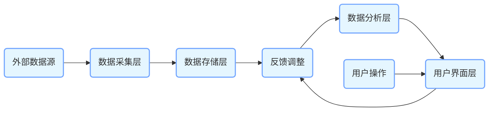

# 金融监管科技数据质量控制平台

> 关键词：金融监管科技、数据质量控制、平台架构、数据清洗、数据治理

> 摘要：本文围绕金融监管科技数据质量控制平台展开深入探讨。首先介绍了该平台产生的背景，明确其目的、范围、预期读者和文档结构。接着阐述核心概念，包括数据质量的关键要素及其相互联系，并以文本示意图和 Mermaid 流程图呈现。详细讲解核心算法原理，通过 Python 代码进行具体操作步骤的说明，同时给出相关数学模型和公式，并举例说明。在项目实战部分，从开发环境搭建、源代码实现与解读、代码分析等方面进行阐述。之后介绍了该平台的实际应用场景，推荐了学习、开发相关的工具和资源，以及相关论文著作。最后总结了未来发展趋势与挑战，还提供了常见问题解答和扩展阅读参考资料，旨在为金融监管科技领域的数据质量控制提供全面且深入的技术指导。

## 1. 背景介绍 
### 1.1 目的和范围
在金融领域，监管机构需要处理海量且复杂的数据，以确保金融市场的稳定、合规和健康发展。金融机构也需要准确、可靠的数据来进行风险评估、合规报告等业务操作。然而，当前金融数据存在来源广泛、格式多样、质量参差不齐等问题，这给金融监管和机构的业务决策带来了极大的挑战。

金融监管科技数据质量控制平台的目的在于构建一个高效、智能的系统，对金融数据进行全面的质量控制，包括数据的准确性、完整性、一致性、及时性等方面的评估和提升。其范围涵盖了金融市场的各个领域，如银行、证券、保险等，涉及到的数据类型包括交易数据、客户信息、风险指标等。

### 1.2 预期读者
本文的预期读者主要包括金融监管机构的工作人员，他们可以通过了解该平台更好地履行监管职责，提高监管效率和准确性；金融机构的技术人员和业务人员，技术人员可以借鉴平台的技术架构和实现方法进行内部数据质量控制体系的建设，业务人员可以更好地理解数据质量对业务决策的重要性；以及对金融监管科技和数据质量控制领域感兴趣的研究人员和学者，他们可以从中获取相关的理论和实践知识。

### 1.3 文档结构概述
本文首先介绍金融监管科技数据质量控制平台的背景信息，包括目的、范围、预期读者和文档结构。接着阐述核心概念，展示其原理和架构。然后详细讲解核心算法原理和具体操作步骤，给出相关数学模型和公式。通过项目实战部分，从开发环境搭建到源代码实现和分析，展示平台的具体实现过程。介绍该平台的实际应用场景，推荐相关的工具和资源以及论文著作。最后总结未来发展趋势与挑战，提供常见问题解答和扩展阅读参考资料。

### 1.4 术语表
#### 1.4.1 核心术语定义
- **金融监管科技（RegTech）**：运用科技手段来助力金融监管的实现，通过自动化、智能化的技术提高监管效率和效果。
- **数据质量控制**：对数据进行评估、监控和改进，以确保数据满足规定的质量标准。
- **数据清洗**：去除数据中的噪声、错误和不一致性，提高数据的准确性和完整性。
- **数据治理**：建立数据管理的策略、流程和标准，确保数据的有效利用和质量保证。

#### 1.4.2 相关概念解释
- **数据准确性**：数据与真实情况的符合程度，即数据是否正确地反映了业务事实。
- **数据完整性**：数据是否包含了所有必要的信息，没有缺失值或遗漏的记录。
- **数据一致性**：数据在不同系统、不同时间点或不同数据源之间的一致性，避免出现矛盾或冲突的数据。
- **数据及时性**：数据是否在需要的时间内可用，以支持及时的决策和业务操作。

#### 1.4.3 缩略词列表
- **ETL**：Extract, Transform, Load（提取、转换、加载）
- **API**：Application Programming Interface（应用程序编程接口）
- **AI**：Artificial Intelligence（人工智能）
- **ML**：Machine Learning（机器学习）

## 2. 核心概念与联系 

### 核心概念原理
金融监管科技数据质量控制平台的核心在于对金融数据的质量进行全面管理和提升。其主要原理基于以下几个关键概念：

- **数据质量评估**：通过定义一系列的数据质量指标，如准确性、完整性、一致性等，对金融数据进行量化评估。例如，对于客户信息数据，可以检查姓名、身份证号码等字段是否完整且准确。
- **数据清洗**：根据数据质量评估的结果，对存在问题的数据进行清洗操作。这可能包括去除重复记录、填充缺失值、修正错误数据等。例如，对于交易数据中的重复交易记录，可以通过比对交易时间、金额等信息进行去重处理。
- **数据监控**：实时或定期对数据进行监控，及时发现数据质量的变化和异常情况。例如，设置数据质量阈值，当某一指标超过阈值时，及时发出警报。
- **数据治理**：建立数据管理的流程和制度，明确数据的所有权、责任人和使用规则，确保数据的长期质量和有效利用。

### 架构的文本示意图
金融监管科技数据质量控制平台的架构可以分为以下几个层次：

- **数据采集层**：负责从各种数据源（如金融机构的业务系统、监管机构的数据库、外部数据提供商等）采集金融数据。
- **数据存储层**：将采集到的数据存储在合适的数据库中，如关系型数据库、非关系型数据库或数据仓库。
- **数据处理层**：对存储的数据进行质量评估、清洗、监控等处理操作。
- **数据分析层**：运用数据分析和挖掘技术，对处理后的数据进行深入分析，以支持监管决策和业务优化。
- **用户界面层**：为用户提供直观的界面，方便用户进行数据查询、质量评估结果查看、数据治理操作等。

### Mermaid 流程图


## 3. 核心算法原理 & 具体操作步骤 

### 数据质量评估算法原理
数据质量评估的核心是计算各项数据质量指标的值。以下以准确性和完整性指标为例进行说明。

#### 准确性评估
准确性评估主要是检查数据是否与真实情况相符。对于数值型数据，可以通过计算数据的误差率来评估准确性。假设我们有一组真实值 $y_{true}$ 和对应的测量值 $y_{measured}$，误差率的计算公式为：

$$误差率 = \frac{\sum_{i=1}^{n} |y_{true_i} - y_{measured_i}|}{\sum_{i=1}^{n} |y_{true_i}|}$$

以下是使用 Python 实现的示例代码：
```python
import numpy as np

def accuracy_error_rate(y_true, y_measured):
    numerator = np.sum(np.abs(y_true - y_measured))
    denominator = np.sum(np.abs(y_true))
    if denominator == 0:
        return 0
    return numerator / denominator

# 示例数据
y_true = np.array([10, 20, 30])
y_measured = np.array([11, 19, 31])

error_rate = accuracy_error_rate(y_true, y_measured)
print(f"准确性误差率: {error_rate}")
```

#### 完整性评估
完整性评估主要是检查数据是否存在缺失值。对于一个数据集 $D$，可以计算缺失值的比例来评估完整性。假设数据集 $D$ 共有 $n$ 条记录，每条记录有 $m$ 个字段，缺失值的总数为 $k$，则完整性指标的计算公式为：

$$完整性 = 1 - \frac{k}{n \times m}$$

以下是使用 Python 实现的示例代码：
```python
import pandas as pd

def completeness_score(data):
    total_cells = data.size
    missing_cells = data.isna().sum().sum()
    return 1 - (missing_cells / total_cells)

# 示例数据
data = pd.DataFrame({
    'col1': [1, 2, None],
    'col2': [4, None, 6]
})

completeness = completeness_score(data)
print(f"完整性得分: {completeness}")
```

### 数据清洗算法原理
数据清洗的主要任务是去除噪声、错误和不一致性。以下以去除重复记录和填充缺失值为例进行说明。

#### 去除重复记录
对于一个数据集 $D$，可以通过比对记录的关键字段来判断是否为重复记录。以下是使用 Python 的 Pandas 库实现的示例代码：
```python
import pandas as pd

# 示例数据
data = pd.DataFrame({
    'id': [1, 2, 2, 3],
    'name': ['Alice', 'Bob', 'Bob', 'Charlie']
})

# 去除重复记录
cleaned_data = data.drop_duplicates()
print(cleaned_data)
```

#### 填充缺失值
对于数值型数据，可以使用均值、中位数等统计量来填充缺失值；对于分类数据，可以使用众数来填充。以下是使用 Python 的 Pandas 库实现的示例代码：
```python
import pandas as pd
import numpy as np

# 示例数据
data = pd.DataFrame({
    'col1': [1, np.nan, 3],
    'col2': ['A', 'B', np.nan]
})

# 填充数值型缺失值
data['col1'].fillna(data['col1'].mean(), inplace=True)

# 填充分类数据缺失值
data['col2'].fillna(data['col2'].mode()[0], inplace=True)

print(data)
```

## 4. 数学模型和公式 & 详细讲解 & 举例说明 

### 数据质量综合评估模型
为了全面评估数据质量，可以将各项数据质量指标进行加权求和，得到一个综合的质量得分。假设我们有 $k$ 个数据质量指标 $Q_1, Q_2, \cdots, Q_k$，对应的权重为 $w_1, w_2, \cdots, w_k$，且 $\sum_{i=1}^{k} w_i = 1$，则综合质量得分 $S$ 的计算公式为：

$$S = \sum_{i=1}^{k} w_i Q_i$$

例如，假设我们考虑准确性、完整性和一致性三个指标，权重分别为 $0.4$、$0.3$ 和 $0.3$，对应的指标值分别为 $0.9$、$0.8$ 和 $0.7$，则综合质量得分 $S$ 为：

$$S = 0.4 \times 0.9 + 0.3 \times 0.8 + 0.3 \times 0.7 = 0.81$$

### 数据异常检测模型
在数据监控过程中，需要检测数据中的异常值。一种常用的方法是基于统计的方法，如 Z-Score 方法。对于一个数据集 $X = \{x_1, x_2, \cdots, x_n\}$，其均值为 $\mu$，标准差为 $\sigma$，则每个数据点 $x_i$ 的 Z-Score 计算公式为：

$$Z(x_i) = \frac{x_i - \mu}{\sigma}$$

通常，当 $|Z(x_i)| > 3$ 时，认为该数据点是异常值。以下是使用 Python 实现的示例代码：
```python
import numpy as np

def z_score_outliers(data):
    mean = np.mean(data)
    std = np.std(data)
    z_scores = np.abs((data - mean) / std)
    outliers = data[z_scores > 3]
    return outliers

# 示例数据
data = np.array([1, 2, 3, 4, 5, 100])
outliers = z_score_outliers(data)
print(f"异常值: {outliers}")
```

## 5. 项目实战：代码实际案例和详细解释说明 

### 5.1  开发环境搭建
#### 硬件环境
- **服务器**：建议使用配置较高的服务器，如 CPU 为 Intel Xeon 系列，内存 32GB 以上，硬盘容量 1TB 以上。
- **存储设备**：可以使用企业级的磁盘阵列或分布式存储系统，以确保数据的安全和可靠性。

#### 软件环境
- **操作系统**：推荐使用 Linux 系统，如 Ubuntu 或 CentOS。
- **数据库**：可以选择关系型数据库如 MySQL 或 PostgreSQL，非关系型数据库如 MongoDB 或 Redis，也可以使用数据仓库如 Hive 或 Snowflake。
- **编程语言**：主要使用 Python，版本建议为 3.7 及以上。
- **开发框架**：使用 Flask 或 Django 作为 Web 开发框架，用于构建用户界面和 API 接口。

### 5.2  源代码详细实现和代码解读
以下是一个简单的金融监管科技数据质量控制平台的示例代码，包括数据采集、质量评估和清洗的部分。

```python
import pandas as pd
from sklearn.preprocessing import StandardScaler

# 数据采集模块
def data_collection(file_path):
    data = pd.read_csv(file_path)
    return data

# 数据质量评估模块
def data_quality_assessment(data):
    # 准确性评估
    accuracy_error_rate = ...  # 调用前面实现的准确性评估函数
    # 完整性评估
    completeness_score = ...  # 调用前面实现的完整性评估函数
    return accuracy_error_rate, completeness_score

# 数据清洗模块
def data_cleaning(data):
    # 去除重复记录
    cleaned_data = data.drop_duplicates()
    # 填充缺失值
    for column in cleaned_data.columns:
        if pd.api.types.is_numeric_dtype(cleaned_data[column]):
            cleaned_data[column].fillna(cleaned_data[column].mean(), inplace=True)
        else:
            cleaned_data[column].fillna(cleaned_data[column].mode()[0], inplace=True)
    return cleaned_data

# 主函数
def main():
    file_path = 'financial_data.csv'
    # 数据采集
    data = data_collection(file_path)
    # 数据质量评估
    accuracy, completeness = data_quality_assessment(data)
    print(f"准确性误差率: {accuracy}")
    print(f"完整性得分: {completeness}")
    # 数据清洗
    cleaned_data = data_cleaning(data)
    print(cleaned_data)

if __name__ == "__main__":
    main()
```

### 5.3  代码解读与分析
- **数据采集模块**：`data_collection` 函数通过 `pandas` 库的 `read_csv` 函数从 CSV 文件中读取数据。在实际应用中，可能需要从不同的数据源（如数据库、API 接口等）采集数据。
- **数据质量评估模块**：`data_quality_assessment` 函数调用前面实现的准确性和完整性评估函数，对数据进行质量评估。可以根据需要添加更多的数据质量指标评估函数。
- **数据清洗模块**：`data_cleaning` 函数首先去除重复记录，然后根据数据类型填充缺失值。对于数值型数据，使用均值填充；对于分类数据，使用众数填充。
- **主函数**：`main` 函数依次调用数据采集、质量评估和清洗模块，完成整个数据处理流程。

## 6. 实际应用场景 
### 金融监管机构
金融监管机构可以使用该平台对金融机构报送的数据进行质量控制，确保数据的准确性和完整性，从而更好地进行风险监测、合规检查和政策制定。例如，监管机构可以通过平台对银行的信贷数据进行质量评估，及时发现数据中的异常情况，防范金融风险。

### 金融机构
金融机构可以利用该平台对内部数据进行管理和优化，提高数据质量，为业务决策提供更可靠的支持。例如，保险公司可以通过平台对客户信息和理赔数据进行清洗和治理，提高客户服务质量和风险评估的准确性。

### 金融科技公司
金融科技公司可以将该平台作为其产品或服务的一部分，为金融机构和监管机构提供数据质量控制解决方案。例如，提供数据治理咨询服务、开发数据质量监控工具等。

## 7. 工具和资源推荐
### 7.1 学习资源推荐
#### 7.1.1 书籍推荐
- 《数据质量：从入门到精通》：全面介绍了数据质量的概念、方法和实践，适合初学者和有一定经验的从业者。
- 《Python 数据分析实战》：详细讲解了使用 Python 进行数据分析的方法和技巧，包括数据清洗、数据可视化等内容。
- 《金融科技概论》：介绍了金融科技的基本概念、技术和应用，对理解金融监管科技有很大帮助。

#### 7.1.2 在线课程
- Coursera 上的“Data Science Specialization”：提供了全面的数据科学课程，包括数据处理、机器学习等内容。
- edX 上的“Financial Technology (FinTech): Foundations and Applications”：专门介绍金融科技的课程，涵盖了金融监管科技的相关知识。
- 中国大学 MOOC 上的“Python 语言程序设计”：适合初学者学习 Python 编程。

#### 7.1.3 技术博客和网站
- Towards Data Science：提供了大量的数据科学和机器学习的技术文章和案例。
- Hacker Noon：涵盖了各种技术领域的文章，包括金融科技和数据质量控制。
- 金融监管机构的官方网站：可以获取最新的金融监管政策和数据要求。

### 7.2 开发工具框架推荐
#### 7.2.1 IDE和编辑器
- PyCharm：功能强大的 Python 集成开发环境，提供了代码编辑、调试、版本控制等功能。
- Visual Studio Code：轻量级的代码编辑器，支持多种编程语言和插件扩展，适合快速开发。
- Jupyter Notebook：交互式的开发环境，适合数据探索和分析。

#### 7.2.2 调试和性能分析工具
- PDB：Python 内置的调试器，可以帮助开发者定位和解决代码中的问题。
- cProfile：Python 的性能分析工具，可以分析代码的运行时间和资源消耗情况。
- SQL Profiler：用于调试和优化 SQL 语句的工具，可以提高数据库操作的性能。

#### 7.2.3 相关框架和库
- Pandas：强大的数据处理和分析库，提供了丰富的数据结构和函数。
- NumPy：用于科学计算的基础库，提供了高效的数组操作和数学函数。
- Scikit-learn：机器学习库，提供了各种机器学习算法和工具。
- Flask 和 Django：Web 开发框架，用于构建用户界面和 API 接口。

### 7.3 相关论文著作推荐
#### 7.3.1 经典论文
- “Data Quality: The Accuracy Dimension”：深入探讨了数据准确性的概念和评估方法。
- “A Framework for Data Quality Assessment in Big Data Environments”：提出了大数据环境下的数据质量评估框架。
- “Data Cleaning: Problems and Current Approaches”：综述了数据清洗的问题和现有方法。

#### 7.3.2 最新研究成果
- 关注顶级学术会议（如 SIGKDD、ICDE 等）和期刊（如 Journal of Data and Information Quality、ACM Transactions on Database Systems 等）上的最新研究成果，了解数据质量控制和金融监管科技领域的前沿动态。

#### 7.3.3 应用案例分析
- 参考金融机构和监管机构发布的报告和案例，了解数据质量控制平台在实际应用中的效果和经验教训。

## 8. 总结：未来发展趋势与挑战
### 未来发展趋势
- **智能化**：随着人工智能和机器学习技术的发展，金融监管科技数据质量控制平台将越来越智能化。例如，利用深度学习算法自动识别数据中的异常模式和潜在风险，提高数据质量评估的准确性和效率。
- **实时性**：金融市场的变化迅速，对数据的实时性要求越来越高。未来的平台将能够实现实时数据采集、处理和监控，及时发现和解决数据质量问题。
- **跨行业融合**：金融行业与其他行业的联系越来越紧密，数据的流通和共享也越来越频繁。未来的平台将支持跨行业的数据质量控制，确保不同行业之间的数据一致性和兼容性。
- **可视化**：为了方便用户理解和使用数据质量信息，未来的平台将提供更加直观、丰富的可视化界面，展示数据质量指标、异常情况和趋势分析等内容。

### 挑战
- **数据安全与隐私**：金融数据涉及大量的敏感信息，如客户身份、交易记录等。在进行数据质量控制的过程中，需要确保数据的安全和隐私，防止数据泄露和滥用。
- **数据多样性**：金融数据来源广泛，格式多样，包括结构化数据、半结构化数据和非结构化数据。如何有效地处理和整合这些不同类型的数据，是数据质量控制面临的一大挑战。
- **技术更新换代**：信息技术发展迅速，新的算法、工具和框架不断涌现。平台需要不断更新和升级，以适应技术的发展和变化。
- **标准和规范**：目前金融监管科技领域的数据质量标准和规范还不够完善，不同机构和地区之间的标准存在差异。建立统一的标准和规范，是推动数据质量控制平台发展的关键。

## 9. 附录：常见问题与解答
### 数据质量评估指标如何选择？
数据质量评估指标的选择应根据具体的业务需求和数据特点来确定。一般来说，可以考虑准确性、完整性、一致性、及时性等核心指标。同时，还可以根据业务的特殊要求，选择其他相关的指标，如数据的时效性、合规性等。

### 数据清洗的方法有哪些？
数据清洗的方法包括去除重复记录、填充缺失值、修正错误数据、处理异常值等。具体的方法应根据数据的类型和问题的严重程度来选择。例如，对于数值型数据，可以使用均值、中位数等统计量填充缺失值；对于分类数据，可以使用众数填充。

### 如何确保数据质量控制平台的性能？
可以从以下几个方面确保数据质量控制平台的性能：
- **优化算法**：选择高效的算法和数据结构，减少计算复杂度。
- **分布式处理**：采用分布式计算技术，如 Hadoop、Spark 等，提高数据处理的并行性和效率。
- **缓存机制**：使用缓存技术，如 Redis，减少数据的重复读取和计算。
- **硬件升级**：根据业务需求，适时升级服务器的硬件配置，提高系统的处理能力。

### 数据质量控制平台如何与现有系统集成？
可以通过 API 接口、数据接口等方式实现数据质量控制平台与现有系统的集成。例如，通过 API 接口从现有系统中获取数据，进行质量控制处理后，再将处理结果返回给现有系统。同时，还需要考虑数据的格式转换、数据安全等问题。

## 10. 扩展阅读 & 参考资料
### 扩展阅读
- 《大数据时代》：介绍了大数据的概念、技术和应用，对理解金融监管科技数据质量控制平台的背景和意义有很大帮助。
- 《人工智能：现代方法》：全面介绍了人工智能的理论、算法和应用，为平台的智能化发展提供了理论基础。
- 《金融风险管理》：讲解了金融风险的识别、评估和控制方法，与数据质量控制在金融监管中的应用密切相关。

### 参考资料
- 金融监管机构发布的相关政策文件和报告。
- 相关学术期刊和会议论文。
- 开源项目的文档和代码，如 Pandas、NumPy 等库的官方文档。