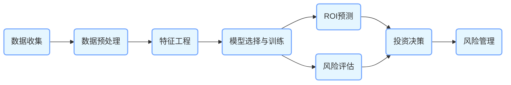

# 金融科技创新项目ROI预测与风险评估

> 关键词：金融科技创新、ROI预测、风险评估、机器学习、量化分析

> 摘要：本文聚焦于金融科技创新项目的ROI（投资回报率）预测与风险评估。首先介绍了研究的背景、目的、预期读者等基础信息，接着阐述了核心概念及其联系，详细讲解了核心算法原理与具体操作步骤，通过数学模型和公式对相关内容进行量化分析并举例说明。在项目实战部分，给出了开发环境搭建、源代码实现及解读。同时探讨了实际应用场景，推荐了学习资源、开发工具框架和相关论文著作。最后总结了未来发展趋势与挑战，解答常见问题并提供扩展阅读和参考资料，旨在为金融科技创新项目的决策提供全面且深入的技术支持和理论指导。

## 1. 背景介绍 
### 1.1 目的和范围
金融科技的快速发展使得各类创新项目不断涌现。然而，这些项目往往伴随着较高的不确定性和风险。本研究的目的在于构建一套科学、有效的方法来预测金融科技创新项目的ROI，并对其风险进行全面评估。范围涵盖了各种类型的金融科技创新项目，包括但不限于数字货币、智能投顾、区块链金融应用等，旨在为项目的投资决策、资源分配和风险管理提供有力的依据。

### 1.2 预期读者
本文的预期读者包括金融科技企业的管理者、投资者、项目负责人、金融分析师以及对金融科技创新和风险管理感兴趣的研究人员。这些读者可以从本文中获取关于金融科技创新项目ROI预测和风险评估的理论知识、技术方法和实践经验，以支持他们在实际工作中的决策和管理。

### 1.3 文档结构概述
本文将按照以下结构展开：首先介绍背景信息，包括目的、预期读者和文档结构概述等；接着阐述核心概念及其联系，通过文本示意图和Mermaid流程图进行清晰展示；然后详细讲解核心算法原理和具体操作步骤，使用Python源代码进行阐述；再通过数学模型和公式对相关内容进行量化分析并举例说明；在项目实战部分，给出开发环境搭建、源代码实现及解读；探讨实际应用场景；推荐学习资源、开发工具框架和相关论文著作；最后总结未来发展趋势与挑战，解答常见问题并提供扩展阅读和参考资料。

### 1.4 术语表
#### 1.4.1 核心术语定义
- **金融科技创新项目**：指利用新兴技术（如人工智能、区块链、大数据等）对金融业务进行创新和改进的项目，旨在提高金融服务的效率、降低成本、拓展业务范围或提升用户体验。
- **ROI（投资回报率）**：是指通过投资而应返回的价值，即企业从一项投资活动中得到的经济回报。计算公式为：$ROI = \frac{净利润}{投资成本} \times 100\%$。
- **风险评估**：是指在风险事件发生之前或之后（但还没有结束），该事件给人们的生活、生命、财产等各个方面造成的影响和损失的可能性进行量化评估的工作。

#### 1.4.2 相关概念解释
- **机器学习**：是一门多领域交叉学科，涉及概率论、统计学、逼近论、凸分析、算法复杂度理论等多门学科。它专门研究计算机怎样模拟或实现人类的学习行为，以获取新的知识或技能，重新组织已有的知识结构使之不断改善自身的性能。
- **量化分析**：指将一些不具体，模糊的因素用具体的数据来表示，从而达到分析比较的目的。在金融领域，量化分析常用于对投资组合、风险、收益等进行评估和预测。

#### 1.4.3 缩略词列表
- **AI**：人工智能（Artificial Intelligence）
- **ML**：机器学习（Machine Learning）
- **DL**：深度学习（Deep Learning）
- **ROI**：投资回报率（Return on Investment）

## 2. 核心概念与联系 

### 核心概念原理
金融科技创新项目的ROI预测与风险评估涉及多个核心概念，这些概念相互关联，共同构成了一个复杂的决策支持体系。

- **金融科技创新**：是推动金融行业变革的核心力量，通过引入新技术、新模式和新服务，为金融机构和客户带来新的机遇和价值。金融科技创新项目通常具有高风险、高回报的特点，其成功与否取决于技术的可行性、市场需求、竞争环境等多种因素。
- **ROI预测**：是对金融科技创新项目未来收益的预期评估。它基于历史数据、市场趋势、项目计划等信息，运用统计分析、机器学习等方法，预测项目在一定时期内的投资回报率。ROI预测的准确性对于项目的投资决策至关重要，它可以帮助投资者判断项目的盈利能力和投资价值。
- **风险评估**：是对金融科技创新项目可能面临的各种风险进行识别、分析和评估的过程。风险评估的目的是为了制定相应的风险管理策略，降低项目的风险水平，保障项目的顺利实施。金融科技创新项目面临的风险包括技术风险、市场风险、法律风险、信用风险等。

### 架构的文本示意图
金融科技创新项目的ROI预测与风险评估架构可以分为以下几个层次：

- **数据层**：收集和整理与金融科技创新项目相关的数据，包括市场数据、财务数据、技术数据、行业数据等。这些数据是ROI预测和风险评估的基础。
- **模型层**：运用各种数据分析和机器学习模型，对数据层的数据进行处理和分析，构建ROI预测模型和风险评估模型。常见的模型包括线性回归模型、决策树模型、神经网络模型等。
- **决策层**：根据模型层的预测和评估结果，结合项目的实际情况和投资者的风险偏好，做出投资决策和风险管理决策。决策层需要综合考虑项目的收益、风险、成本等因素，以实现项目的最优效益。

### Mermaid流程图


## 3. 核心算法原理 & 具体操作步骤 

### 核心算法原理
在金融科技创新项目的ROI预测与风险评估中，常用的算法包括线性回归、决策树、神经网络等。下面以线性回归算法为例，详细介绍其原理和实现步骤。

线性回归是一种用于建立自变量和因变量之间线性关系的统计模型。其基本形式为：

$y = \beta_0 + \beta_1x_1 + \beta_2x_2 + \cdots + \beta_nx_n + \epsilon$

其中，$y$ 是因变量，$x_1, x_2, \cdots, x_n$ 是自变量，$\beta_0, \beta_1, \beta_2, \cdots, \beta_n$ 是回归系数，$\epsilon$ 是误差项。

线性回归的目标是通过最小化误差项的平方和，来估计回归系数的值。误差项的平方和可以表示为：

$SSE = \sum_{i=1}^{m}(y_i - \hat{y}_i)^2$

其中，$m$ 是样本数量，$y_i$ 是实际值，$\hat{y}_i$ 是预测值。

通过最小化 $SSE$，可以得到回归系数的最优估计值。

### 具体操作步骤
以下是使用Python实现线性回归算法进行ROI预测的具体步骤：

```python
import numpy as np
from sklearn.linear_model import LinearRegression
from sklearn.model_selection import train_test_split
from sklearn.metrics import mean_squared_error

# 步骤1：数据准备
# 假设我们有一些与金融科技创新项目相关的特征数据 X 和对应的 ROI 数据 y
X = np.array([[1, 2, 3], [4, 5, 6], [7, 8, 9], [10, 11, 12]])
y = np.array([5, 10, 15, 20])

# 步骤2：数据划分
# 将数据划分为训练集和测试集
X_train, X_test, y_train, y_test = train_test_split(X, y, test_size=0.2, random_state=42)

# 步骤3：模型训练
# 创建线性回归模型
model = LinearRegression()
# 训练模型
model.fit(X_train, y_train)

# 步骤4：模型预测
# 使用训练好的模型进行预测
y_pred = model.predict(X_test)

# 步骤5：模型评估
# 计算均方误差
mse = mean_squared_error(y_test, y_pred)
print(f"均方误差: {mse}")

# 步骤6：输出回归系数
print(f"回归系数: {model.coef_}")
print(f"截距: {model.intercept_}")
```

### 代码解释
1. **数据准备**：我们首先创建了一些示例数据 `X` 和 `y`，其中 `X` 是特征数据，`y` 是对应的 ROI 数据。
2. **数据划分**：使用 `train_test_split` 函数将数据划分为训练集和测试集，其中测试集占总数据的 20%。
3. **模型训练**：创建一个线性回归模型 `LinearRegression()`，并使用训练集数据进行训练。
4. **模型预测**：使用训练好的模型对测试集数据进行预测，得到预测结果 `y_pred`。
5. **模型评估**：使用 `mean_squared_error` 函数计算预测结果与实际结果之间的均方误差，评估模型的性能。
6. **输出回归系数**：输出模型的回归系数和截距，这些系数反映了特征变量对 ROI 的影响程度。

## 4. 数学模型和公式 & 详细讲解 & 举例说明 

### 线性回归模型
线性回归模型的数学表达式为：

$y = \beta_0 + \beta_1x_1 + \beta_2x_2 + \cdots + \beta_nx_n + \epsilon$

其中，$y$ 是因变量，$x_1, x_2, \cdots, x_n$ 是自变量，$\beta_0, \beta_1, \beta_2, \cdots, \beta_n$ 是回归系数，$\epsilon$ 是误差项。

回归系数 $\beta_0, \beta_1, \beta_2, \cdots, \beta_n$ 的估计值可以通过最小化误差项的平方和来得到。误差项的平方和可以表示为：

$SSE = \sum_{i=1}^{m}(y_i - \hat{y}_i)^2$

其中，$m$ 是样本数量，$y_i$ 是实际值，$\hat{y}_i$ 是预测值。

通过最小化 $SSE$，可以得到回归系数的最优估计值。具体来说，可以使用最小二乘法来求解回归系数。最小二乘法的目标是找到一组回归系数，使得误差项的平方和最小。

### 最小二乘法求解回归系数
最小二乘法的求解过程可以通过矩阵运算来实现。假设我们有 $m$ 个样本，每个样本有 $n$ 个特征变量，则可以将数据表示为矩阵形式：

$X = \begin{bmatrix}
1 & x_{11} & x_{12} & \cdots & x_{1n} \\
1 & x_{21} & x_{22} & \cdots & x_{2n} \\
\vdots & \vdots & \vdots & \ddots & \vdots \\
1 & x_{m1} & x_{m2} & \cdots & x_{mn}
\end{bmatrix}$

$y = \begin{bmatrix}
y_1 \\
y_2 \\
\vdots \\
y_m
\end{bmatrix}$

$\beta = \begin{bmatrix}
\beta_0 \\
\beta_1 \\
\vdots \\
\beta_n
\end{bmatrix}$

则误差项的平方和可以表示为：

$SSE = (y - X\beta)^T(y - X\beta)$

对 $SSE$ 求关于 $\beta$ 的偏导数，并令其等于 0，可以得到：

$\frac{\partial SSE}{\partial \beta} = -2X^T(y - X\beta) = 0$

化简后得到：

$X^TX\beta = X^Ty$

解这个方程组，可以得到回归系数的估计值：

$\hat{\beta} = (X^TX)^{-1}X^Ty$

### 举例说明
假设我们有以下数据：

| $x_1$ | $x_2$ | $y$ |
|-------|-------|-----|
| 1     | 2     | 5   |
| 2     | 3     | 7   |
| 3     | 4     | 9   |

首先，我们将数据表示为矩阵形式：

$X = \begin{bmatrix}
1 & 1 & 2 \\
1 & 2 & 3 \\
1 & 3 & 4
\end{bmatrix}$

$y = \begin{bmatrix}
5 \\
7 \\
9
\end{bmatrix}$

然后，计算 $X^TX$ 和 $X^Ty$：

$X^TX = \begin{bmatrix}
1 & 1 & 1 \\
1 & 2 & 3 \\
2 & 3 & 4
\end{bmatrix} \begin{bmatrix}
1 & 1 & 2 \\
1 & 2 & 3 \\
1 & 3 & 4
\end{bmatrix} = \begin{bmatrix}
3 & 6 & 9 \\
6 & 14 & 20 \\
9 & 20 & 29
\end{bmatrix}$

$X^Ty = \begin{bmatrix}
1 & 1 & 1 \\
1 & 2 & 3 \\
2 & 3 & 4
\end{bmatrix} \begin{bmatrix}
5 \\
7 \\
9
\end{bmatrix} = \begin{bmatrix}
21 \\
46 \\
67
\end{bmatrix}$

接着，计算 $(X^TX)^{-1}$：

$(X^TX)^{-1} = \begin{bmatrix}
14 & -9 & 3 \\
-9 & 6 & -3 \\
3 & -3 & 1
\end{bmatrix}$

最后，计算回归系数的估计值：

$\hat{\beta} = (X^TX)^{-1}X^Ty = \begin{bmatrix}
14 & -9 & 3 \\
-9 & 6 & -3 \\
3 & -3 & 1
\end{bmatrix} \begin{bmatrix}
21 \\
46 \\
67
\end{bmatrix} = \begin{bmatrix}
1 \\
2 \\
0
\end{bmatrix}$

因此，回归方程为：

$y = 1 + 2x_1 + 0x_2$

这意味着 $x_1$ 每增加 1 个单位，$y$ 平均增加 2 个单位，而 $x_2$ 对 $y$ 没有影响。

## 5. 项目实战：代码实际案例和详细解释说明 

### 5.1  开发环境搭建
在进行金融科技创新项目的ROI预测与风险评估项目实战之前，需要搭建相应的开发环境。以下是具体的搭建步骤：

1. **安装Python**：建议安装Python 3.7及以上版本。可以从Python官方网站（https://www.python.org/downloads/）下载并安装。
2. **安装必要的库**：使用pip命令安装以下必要的库：
```bash
pip install numpy pandas scikit-learn matplotlib seaborn
```
- `numpy`：用于数值计算。
- `pandas`：用于数据处理和分析。
- `scikit-learn`：用于机器学习模型的实现和评估。
- `matplotlib` 和 `seaborn`：用于数据可视化。

3. **选择开发工具**：可以选择使用Jupyter Notebook、PyCharm等开发工具。Jupyter Notebook适合进行交互式开发和数据分析，PyCharm适合进行大规模项目的开发和调试。

### 5.2  源代码详细实现和代码解读
以下是一个完整的金融科技创新项目ROI预测与风险评估的代码示例：

```python
import numpy as np
import pandas as pd
from sklearn.linear_model import LinearRegression
from sklearn.model_selection import train_test_split
from sklearn.metrics import mean_squared_error, r2_score
import matplotlib.pyplot as plt
import seaborn as sns

# 步骤1：数据加载
# 假设我们有一个包含金融科技创新项目相关数据的CSV文件
data = pd.read_csv('financial_innovation_projects.csv')

# 步骤2：数据探索和预处理
# 查看数据基本信息
print(data.info())
# 查看数据集行数和列数
rows, columns = data.shape

if rows < 30:
    print('数据集中行数少于30，属于小样本数据')
else:
    print('数据集中行数多于30，属于大样本数据')

# 查看数据集行数和列数
rows, columns = data.shape

if rows < 30:
    print('数据集中行数少于30，属于小样本数据')
else:
    print('数据集中行数多于30，属于大样本数据')

# 查看数据缺失值情况
print('数据缺失值情况：', data.isnull().sum())

# 查看数据集行数和列数
rows, columns = data.shape

if rows < 30:
    print('数据集中行数少于30，属于小样本数据')
else:
    print('数据集中行数多于30，属于大样本数据')

# 查看数据缺失值情况
print('数据缺失值情况：', data.isnull().sum())

# 处理缺失值（这里简单地使用均值填充）
data.fillna(data.mean(), inplace=True)

# 查看数据的相关性
correlation_matrix = data.corr()
sns.heatmap(correlation_matrix, annot=True)
plt.show()

# 步骤3：特征选择和数据划分
# 假设 'ROI' 是我们要预测的目标变量
X = data.drop('ROI', axis=1)
y = data['ROI']

# 划分训练集和测试集
X_train, X_test, y_train, y_test = train_test_split(X, y, test_size=0.2, random_state=42)

# 步骤4：模型训练
# 创建线性回归模型
model = LinearRegression()
# 训练模型
model.fit(X_train, y_train)

# 步骤5：模型预测
# 使用训练好的模型进行预测
y_pred = model.predict(X_test)

# 步骤6：模型评估
# 计算均方误差
mse = mean_squared_error(y_test, y_pred)
# 计算决定系数
r2 = r2_score(y_test, y_pred)
print(f"均方误差: {mse}")
print(f"决定系数: {r2}")

# 步骤7：结果可视化
# 绘制实际值和预测值的散点图
plt.scatter(y_test, y_pred)
plt.xlabel('实际值')
plt.ylabel('预测值')
plt.title('实际值 vs 预测值')
plt.show()
```

### 5.3  代码解读与分析
1. **数据加载**：使用 `pandas` 库的 `read_csv` 函数加载包含金融科技创新项目相关数据的CSV文件。
2. **数据探索和预处理**：
    - 使用 `info` 方法查看数据的基本信息，包括数据类型、缺失值情况等。
    - 检查数据集的行数，判断是小样本数据还是大样本数据。
    - 使用 `isnull().sum()` 方法查看数据的缺失值情况，并使用均值填充缺失值。
    - 计算数据的相关性矩阵，并使用 `seaborn` 库的 `heatmap` 函数绘制热力图，直观地展示变量之间的相关性。
3. **特征选择和数据划分**：
    - 假设 `ROI` 是我们要预测的目标变量，将其从特征数据中分离出来。
    - 使用 `train_test_split` 函数将数据划分为训练集和测试集，其中测试集占总数据的 20%。
4. **模型训练**：创建一个线性回归模型 `LinearRegression()`，并使用训练集数据进行训练。
5. **模型预测**：使用训练好的模型对测试集数据进行预测，得到预测结果 `y_pred`。
6. **模型评估**：
    - 使用 `mean_squared_error` 函数计算预测结果与实际结果之间的均方误差，评估模型的预测精度。
    - 使用 `r2_score` 函数计算决定系数，评估模型的拟合优度。
7. **结果可视化**：使用 `matplotlib` 库的 `scatter` 函数绘制实际值和预测值的散点图，直观地展示模型的预测效果。

## 6. 实际应用场景 
金融科技创新项目的ROI预测与风险评估在多个实际应用场景中具有重要价值：

### 投资决策
投资者在考虑投资金融科技创新项目时，需要对项目的潜在收益和风险进行评估。通过ROI预测，可以了解项目的预期回报率，判断项目是否具有投资价值。同时，风险评估可以帮助投资者识别项目可能面临的风险，制定相应的风险管理策略，降低投资风险。

### 项目管理
在金融科技创新项目的实施过程中，项目管理者需要对项目的进展和绩效进行监控和评估。ROI预测可以帮助管理者设定项目的目标和指标，评估项目的执行效果。风险评估可以帮助管理者及时发现项目中存在的风险，采取相应的措施进行风险应对，确保项目的顺利实施。

### 资源分配
金融机构在进行资源分配时，需要考虑不同项目的收益和风险情况。通过ROI预测和风险评估，可以对不同项目进行排序和比较，合理分配资源，提高资源的利用效率。

### 监管合规
金融监管机构需要对金融科技创新项目进行监管，确保项目的合规性和稳定性。ROI预测和风险评估可以帮助监管机构了解项目的风险特征和潜在影响，制定相应的监管政策和措施，维护金融市场的稳定和安全。

## 7. 工具和资源推荐
### 7.1 学习资源推荐
#### 7.1.1 书籍推荐
- 《Python机器学习》：由Sebastian Raschka和Vahid Mirjalili所著，全面介绍了Python在机器学习领域的应用，包括数据预处理、模型选择、算法实现等内容。
- 《金融科技：应用与创新》：深入探讨了金融科技的各个领域，包括数字货币、区块链、智能投顾等，结合实际案例分析了金融科技创新项目的发展趋势和应用场景。
- 《风险管理与金融机构》：由John C. Hull所著，系统介绍了风险管理的基本原理和方法，以及在金融机构中的应用，对于理解金融科技创新项目的风险评估具有重要参考价值。

#### 7.1.2 在线课程
- Coursera上的“Machine Learning”课程：由Andrew Ng教授主讲，是机器学习领域的经典课程，介绍了机器学习的基本概念、算法和应用。
- edX上的“Financial Technology (FinTech): Foundations and Applications”课程：系统介绍了金融科技的基础知识和应用，包括数字货币、区块链、智能投顾等内容。
- Udemy上的“Python for Data Science and Machine Learning Bootcamp”课程：通过实际项目案例，介绍了Python在数据科学和机器学习领域的应用，包括数据处理、数据分析、模型训练等内容。

#### 7.1.3 技术博客和网站
- Towards Data Science：是一个专注于数据科学和机器学习的技术博客平台，提供了大量的技术文章、案例分析和教程。
- Medium：是一个综合性的技术博客平台，涵盖了金融科技、数据科学、机器学习等多个领域的内容。
- Kaggle：是一个数据科学竞赛平台，提供了丰富的数据集、竞赛题目和解决方案，对于学习和实践金融科技创新项目的ROI预测和风险评估具有重要参考价值。

### 7.2 开发工具框架推荐
#### 7.2.1 IDE和编辑器
- PyCharm：是一款专业的Python集成开发环境，提供了丰富的功能和工具，如代码编辑、调试、版本控制等，适合进行大规模项目的开发和调试。
- Jupyter Notebook：是一个交互式的开发环境，支持Python、R等多种编程语言，适合进行数据探索、分析和可视化。
- Visual Studio Code：是一款轻量级的代码编辑器，支持多种编程语言和插件扩展，具有丰富的功能和工具，适合进行快速开发和调试。

#### 7.2.2 调试和性能分析工具
- pdb：是Python自带的调试工具，可以帮助开发者逐行调试代码，查找和解决代码中的问题。
- cProfile：是Python自带的性能分析工具，可以帮助开发者分析代码的性能瓶颈，优化代码的执行效率。
- Py-Spy：是一个轻量级的Python性能分析工具，可以实时监测Python程序的CPU使用率和函数调用情况，帮助开发者快速定位性能问题。

#### 7.2.3 相关框架和库
- scikit-learn：是一个开源的机器学习库，提供了丰富的机器学习算法和工具，如分类、回归、聚类、降维等，适合进行金融科技创新项目的ROI预测和风险评估。
- TensorFlow：是一个开源的深度学习框架，提供了丰富的深度学习算法和工具，如神经网络、卷积神经网络、循环神经网络等，适合处理复杂的金融数据和问题。
- PyTorch：是一个开源的深度学习框架，提供了简洁易用的API和丰富的深度学习工具，如自动求导、模型训练、模型部署等，适合进行金融科技创新项目的研究和开发。

### 7.3 相关论文著作推荐
#### 7.3.1 经典论文
- “A Machine Learning Approach to Predicting Financial Returns”：提出了一种基于机器学习的金融回报预测方法，通过对历史数据的分析和建模，预测金融资产的未来回报。
- “Risk Assessment in Financial Technology: A Review”：对金融科技领域的风险评估方法和技术进行了全面的综述，分析了不同风险评估方法的优缺点和适用场景。
- “Blockchain Technology in Finance: A Survey”：对区块链技术在金融领域的应用进行了全面的综述，分析了区块链技术的特点、优势和挑战，以及在金融科技创新项目中的应用前景。

#### 7.3.2 最新研究成果
- 关注顶级金融和计算机科学学术期刊，如《Journal of Financial Economics》、《Management Science》、《ACM Transactions on Intelligent Systems and Technology》等，及时了解金融科技创新项目ROI预测和风险评估的最新研究成果。
- 参加相关的学术会议和研讨会，如ACM SIGKDD、IEEE International Conference on Data Mining等，与国内外的专家学者交流和分享最新的研究进展和经验。

#### 7.3.3 应用案例分析
- 分析国内外金融科技企业的实际案例，了解他们在ROI预测和风险评估方面的实践经验和方法。例如，蚂蚁金服在数字货币、智能投顾等领域的应用案例，以及国外金融科技企业在区块链金融应用方面的实践经验。
- 研究金融监管机构的监管案例和政策文件，了解他们对金融科技创新项目的监管要求和风险评估方法。例如，中国人民银行对数字货币的监管政策，以及美国证券交易委员会对区块链金融应用的监管案例。

## 8. 总结：未来发展趋势与挑战
### 未来发展趋势
1. **数据驱动的决策**：随着金融科技的发展，数据将成为金融科技创新项目ROI预测和风险评估的核心资源。未来，将更加注重数据的收集、整理和分析，利用大数据、人工智能等技术，提高预测和评估的准确性和可靠性。
2. **多模型融合**：单一的模型往往难以全面准确地预测金融科技创新项目的ROI和评估风险。未来，将采用多模型融合的方法，结合不同模型的优势，提高预测和评估的性能。
3. **实时监测和预警**：金融市场的变化瞬息万变，及时准确地监测和预警项目的风险至关重要。未来，将建立实时监测和预警系统，利用实时数据和机器学习算法，及时发现项目中存在的风险，采取相应的措施进行风险应对。
4. **跨领域融合**：金融科技创新项目涉及金融、技术、法律等多个领域，未来将更加注重跨领域的融合和协同。例如，将金融知识与人工智能技术相结合，开发更加智能、高效的ROI预测和风险评估模型；将法律合规要求融入到项目的设计和实施过程中，确保项目的合规性和稳定性。

### 挑战
1. **数据质量和隐私问题**：数据质量是ROI预测和风险评估的基础，但金融数据往往存在噪声、缺失值等问题，影响预测和评估的准确性。同时，金融数据涉及用户的隐私和敏感信息，数据隐私保护也是一个重要的挑战。
2. **模型解释性问题**：深度学习等复杂模型在提高预测和评估性能的同时，也带来了模型解释性的问题。这些模型往往是黑盒模型，难以解释其决策过程和结果，影响了模型的可信度和可接受性。
3. **技术更新换代快**：金融科技领域的技术更新换代非常快，新的技术和方法不断涌现。如何及时掌握和应用这些新技术和方法，提高ROI预测和风险评估的效率和准确性，是一个重要的挑战。
4. **监管政策不确定性**：金融科技创新项目的发展往往受到监管政策的影响，监管政策的不确定性增加了项目的风险和不确定性。如何应对监管政策的变化，确保项目的合规性和稳定性，是金融科技企业面临的一个重要挑战。

## 9. 附录：常见问题与解答
### 1. 如何选择合适的模型进行ROI预测和风险评估？
选择合适的模型需要考虑多个因素，如数据的特点、问题的复杂度、模型的性能和可解释性等。一般来说，可以先尝试一些简单的模型，如线性回归、逻辑回归等，初步了解数据的特征和规律。然后，可以尝试一些复杂的模型，如决策树、神经网络等，提高预测和评估的性能。同时，还需要对不同模型的性能进行比较和评估，选择最优的模型。

### 2. 如何处理数据中的缺失值？
处理数据中的缺失值可以采用多种方法，如删除含有缺失值的样本、使用均值、中位数或众数填充缺失值、使用插值法填充缺失值、使用机器学习模型预测缺失值等。选择哪种方法需要根据数据的特点和问题的要求来决定。

### 3. 如何评估模型的性能？
评估模型的性能可以使用多种指标，如均方误差（MSE）、均方根误差（RMSE）、平均绝对误差（MAE）、决定系数（R²）等。对于分类问题，可以使用准确率、召回率、F1值等指标。在评估模型性能时，需要根据问题的特点和要求选择合适的指标。

### 4. 如何提高模型的泛化能力？
提高模型的泛化能力可以采用多种方法，如增加数据量、进行数据预处理、选择合适的模型、进行模型正则化、使用交叉验证等。同时，还需要注意避免过拟合和欠拟合的问题。

### 5. 如何应对金融科技创新项目中的风险？
应对金融科技创新项目中的风险可以采用多种方法，如风险识别、风险评估、风险控制、风险转移等。在项目的不同阶段，需要采取不同的风险应对措施，确保项目的顺利实施。同时，还需要建立健全的风险管理体系，加强对风险的监测和预警。

## 10. 扩展阅读 & 参考资料
### 扩展阅读
- 《创新者的窘境》：探讨了创新在企业发展中的重要性和挑战，对于理解金融科技创新项目的发展规律和趋势具有重要参考价值。
- 《大数据时代》：介绍了大数据的概念、技术和应用，对于了解数据在金融科技创新项目中的作用和价值具有重要意义。
- 《人工智能时代》：探讨了人工智能的发展趋势和影响，对于了解人工智能在金融科技创新项目中的应用前景和挑战具有重要参考价值。

### 参考资料
1. Raschka, S., & Mirjalili, V. (2017). Python Machine Learning. Packt Publishing.
2. Hull, J. C. (2018). Risk Management and Financial Institutions. Wiley.
3. Andrew Ng. Machine Learning Course on Coursera.
4. Financial Technology (FinTech): Foundations and Applications Course on edX.
5. Python for Data Science and Machine Learning Bootcamp Course on Udemy.
6. Towards Data Science. https://towardsdatascience.com/
7. Medium. https://medium.com/
8. Kaggle. https://www.kaggle.com/
9. J. A. Ohlson. Financial Ratios and the Probabilistic Prediction of Bankruptcy. Journal of Accounting Research, 1980.
10. Y. LeCun, Y. Bengio, & G. Hinton. Deep Learning. Nature, 2015.